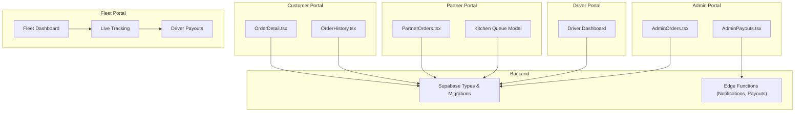
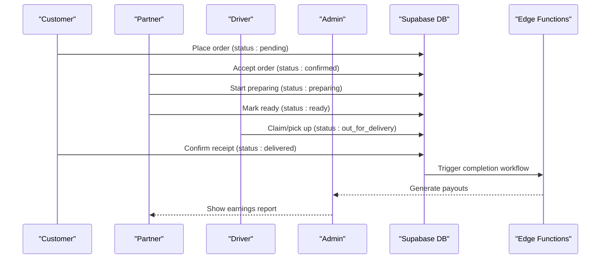
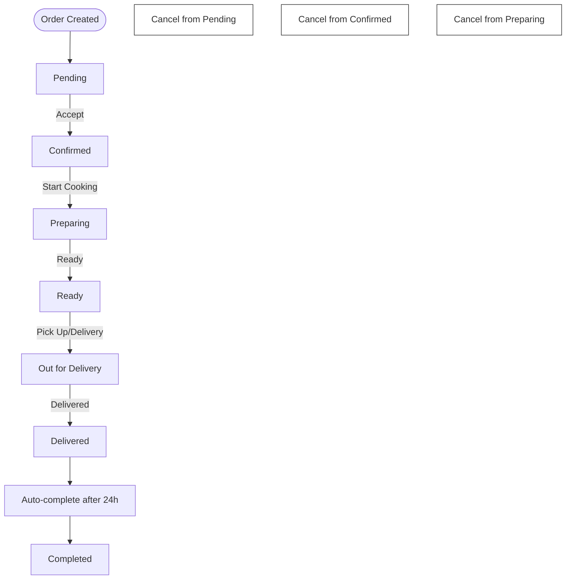
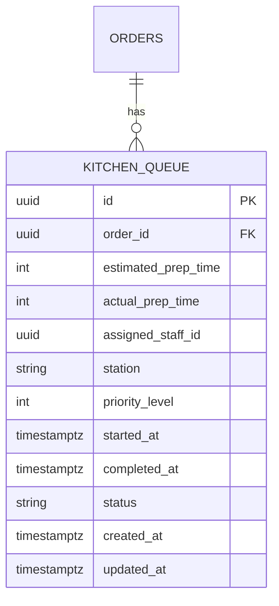
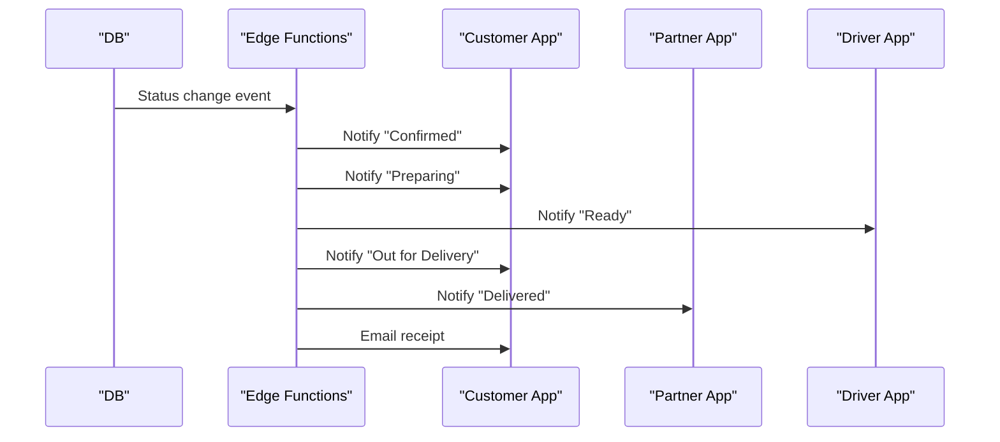
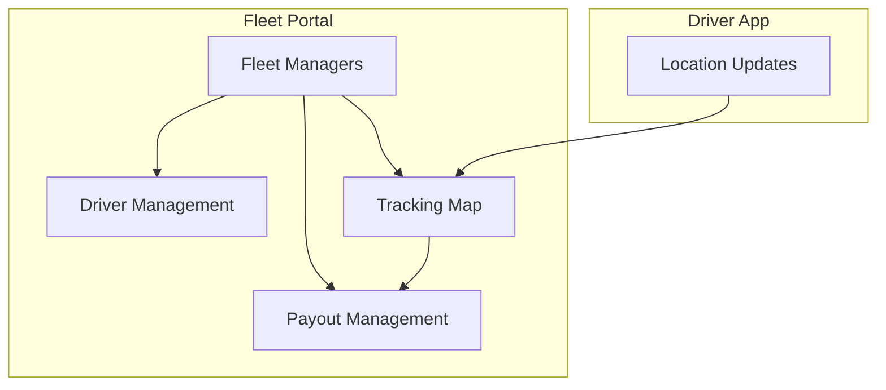
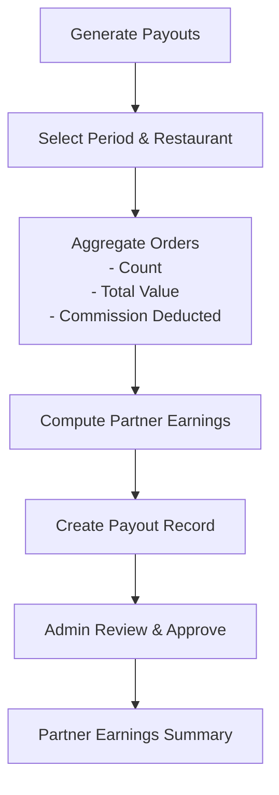
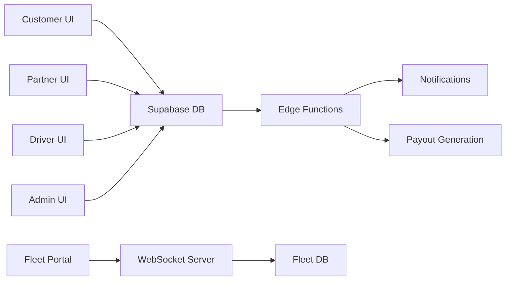

# Order Processing & Fulfillment

<cite>
**Referenced Files in This Document**
- [Order-Workflow-Proposal.md](file://docs/Order-Workflow-Proposal.md)
- [fleet-management-portal-design.md](file://docs/fleet-management-portal-design.md)
- [types.ts](file://supabase/types.ts)
- [types.ts](file://src/integrations/supabase/types.ts)
- [20260106092518_c692a11f-8f7e-4ea4-9562-10298bc83a89.sql](file://supabase/migrations/20260106092518_c692a11f-8f7e-4ea4-9562-10298bc83a89.sql)
- [AdminPayouts.tsx](file://src/pages/admin/AdminPayouts.tsx)
- [PartnerPayouts.tsx](file://src/pages/partner/PartnerPayouts.tsx)
</cite>

## Table of Contents
1. [Introduction](#introduction)
2. [Project Structure](#project-structure)
3. [Core Components](#core-components)
4. [Architecture Overview](#architecture-overview)
5. [Detailed Component Analysis](#detailed-component-analysis)
6. [Dependency Analysis](#dependency-analysis)
7. [Performance Considerations](#performance-considerations)
8. [Troubleshooting Guide](#troubleshooting-guide)
9. [Conclusion](#conclusion)

## Introduction
This document describes the order processing and fulfillment workflows across the customer, partner, driver, and admin portals, including order status management, real-time notifications, kitchen preparation controls, fleet delivery coordination, and financial tracking. It synthesizes the proposed order lifecycle, database constraints and triggers, real-time fleet tracking architecture, and payout generation logic to provide a unified operational blueprint.

## Project Structure
The order lifecycle spans UI pages, backend services, database constraints, and real-time tracking:
- UI roles: customer, partner, driver, admin
- Kitchen queue and order status are modeled in Supabase types and migrations
- Fleet portal provides live tracking and driver management
- Payouts are generated via stored functions and surfaced in admin/partner dashboards

**Section sources**
- [Order-Workflow-Proposal.md:16–200:16-200](file://docs/Order-Workflow-Proposal.md#L16-L200)
- [fleet-management-portal-design.md:1–120:1-120](file://docs/fleet-management-portal-design.md#L1-L120)

## Core Components
- Order status lifecycle and role-based transitions
- Kitchen queue modeling with preparation timing
- Real-time fleet tracking and driver handoff
- Notification triggers per status change
- Payout generation and reporting

**Section sources**
- [Order-Workflow-Proposal.md:65–116:65-116](file://docs/Order-Workflow-Proposal.md#L65-L116)
- [Order-Workflow-Proposal.md:201–211:201-211](file://docs/Order-Workflow-Proposal.md#L201-L211)
- [types.ts:1130–1171:1130-1171](file://supabase/types.ts#L1130-L1171)
- [types.ts:2691–2733:2691-2733](file://src/integrations/supabase/types.ts#L2691-L2733)

## Architecture Overview
The order lifecycle is enforced by database constraints and triggers, surfaced through role-specific UIs, and coordinated with the fleet portal for driver handoff and delivery tracking.

**Diagram sources**
- [Order-Workflow-Proposal.md:65–116:65-116](file://docs/Order-Workflow-Proposal.md#L65-L116)
- [Order-Workflow-Proposal.md:201–211:201-211](file://docs/Order-Workflow-Proposal.md#L201-L211)
- [20260106092518_c692a11f-8f7e-4ea4-9562-10298bc83a89.sql:72–113:72-113](file://supabase/migrations/20260106092518_c692a11f-8f7e-4ea4-9562-10298bc83a89.sql#L72-L113)

## Detailed Component Analysis

### Order Receiving and Status Management
- Roles and capabilities:
  - Customer: place, track, cancel (pending), confirm receipt (out_for_delivery)
  - Partner: accept, prepare, mark ready, handover, cancel (before delivered)
  - Driver: claim, pick up, deliver
  - Admin: view, override, cancel, audit
- Status flow and transitions:
  - Enforced by database constraints and validation triggers
  - Audit trail via status history table
- Notifications:
  - Push/email/SMS triggered per status change

**Diagram sources**
- [Order-Workflow-Proposal.md:65–116:65-116](file://docs/Order-Workflow-Proposal.md#L65-L116)

**Section sources**
- [Order-Workflow-Proposal.md:16–64:16-64](file://docs/Order-Workflow-Proposal.md#L16-L64)
- [Order-Workflow-Proposal.md:105–143:105-143](file://docs/Order-Workflow-Proposal.md#L105-L143)

### Kitchen Preparation Workflows
- Kitchen queue model captures preparation timing, staff assignment, station, priority, and status.
- Preparation controls:
  - Estimated and actual prep times
  - Staff assignment and station tracking
  - Priority and notes for coordination

**Diagram sources**
- [types.ts:1130–1171:1130-1171](file://supabase/types.ts#L1130-L1171)
- [types.ts:2691–2733:2691-2733](file://src/integrations/supabase/types.ts#L2691-L2733)

**Section sources**
- [types.ts:1130–1171:1130-1171](file://supabase/types.ts#L1130-L1171)
- [types.ts:2691–2733:2691-2733](file://src/integrations/supabase/types.ts#L2691-L2733)

### Real-Time Order Notifications
- Notification matrix defines who receives what and when:
  - Pending → Confirmed: customer (push/email)
  - Confirmed → Preparing: customer (push)
  - Preparing → Ready: customer + driver (push)
  - Ready → Out for Delivery: customer (push+SMS)
  - Out for Delivery → Delivered: partner (push)
  - Delivered → Completed: customer (email/receipt)

**Diagram sources**
- [Order-Workflow-Proposal.md:201–211:201-211](file://docs/Order-Workflow-Proposal.md#L201-L211)

**Section sources**
- [Order-Workflow-Proposal.md:201–211:201-211](file://docs/Order-Workflow-Proposal.md#L201-L211)

### Fleet Management and Driver Handoff
- Fleet portal supports:
  - Multi-city isolation and role-based access
  - Live GPS tracking with WebSocket broadcast
  - Driver and vehicle management
  - Payout scheduling and processing
- Driver handoff:
  - Partner marks ready
  - Driver claims/picks up order
  - Status advances to out_for_delivery and delivered

**Diagram sources**
- [fleet-management-portal-design.md:1–120:1-120](file://docs/fleet-management-portal-design.md#L1-L120)
- [fleet-management-portal-design.md:169–474:169-474](file://docs/fleet-management-portal-design.md#L169-L474)

**Section sources**
- [fleet-management-portal-design.md:124–153:124-153](file://docs/fleet-management-portal-design.md#L124-L153)
- [fleet-management-portal-design.md:169–474:169-474](file://docs/fleet-management-portal-design.md#L169-L474)

### Order Modifications, Cancellations, and Refunds
- Cancellations:
  - Allowed from pending, confirmed, preparing
  - Enforced by status validation triggers
- Modifications:
  - UI visibility constrained by current status
  - Audit trail maintained in status history
- Refunds:
  - Not explicitly modeled in the referenced files; likely handled by payment and admin workflows outside the scope of this document

**Section sources**
- [Order-Workflow-Proposal.md:102–116:102-116](file://docs/Order-Workflow-Proposal.md#L102-L116)
- [Order-Workflow-Proposal.md:105–143:105-143](file://docs/Order-Workflow-Proposal.md#L105-L143)

### Earnings Calculation, Commission Tracking, and Payout Scheduling
- Payout generation:
  - Stored function aggregates orders by restaurant and period
  - Calculates total order value, commission deducted, and partner earnings
  - Creates payout records with status and metadata
- Reporting:
  - Admin dashboard displays period, counts, totals, and amounts
  - Partner dashboard computes weekly earnings and rates

**Diagram sources**
- [20260106092518_c692a11f-8f7e-4ea4-9562-10298bc83a89.sql:72–113:72-113](file://supabase/migrations/20260106092518_c692a11f-8f7e-4ea4-9562-10298bc83a89.sql#L72-L113)
- [AdminPayouts.tsx:908–929:908-929](file://src/pages/admin/AdminPayouts.tsx#L908-L929)
- [PartnerPayouts.tsx:139–171:139-171](file://src/pages/partner/PartnerPayouts.tsx#L139-L171)

**Section sources**
- [20260106092518_c692a11f-8f7e-4ea4-9562-10298bc83a89.sql:72–113:72-113](file://supabase/migrations/20260106092518_c692a11f-8f7e-4ea4-9562-10298bc83a89.sql#L72-L113)
- [AdminPayouts.tsx:908–929:908-929](file://src/pages/admin/AdminPayouts.tsx#L908-L929)
- [PartnerPayouts.tsx:139–171:139-171](file://src/pages/partner/PartnerPayouts.tsx#L139-L171)

## Dependency Analysis
- Database constraints and triggers enforce status validity and history
- Edge functions orchestrate notifications and payouts
- UI components depend on role-aware status visibility and action handlers
- Fleet portal depends on real-time location streaming and driver management APIs

**Diagram sources**
- [Order-Workflow-Proposal.md:105–143:105-143](file://docs/Order-Workflow-Proposal.md#L105-L143)
- [20260106092518_c692a11f-8f7e-4ea4-9562-10298bc83a89.sql:72–113:72-113](file://supabase/migrations/20260106092518_c692a11f-8f7e-4ea4-9562-10298bc83a89.sql#L72-L113)

**Section sources**
- [Order-Workflow-Proposal.md:105–143:105-143](file://docs/Order-Workflow-Proposal.md#L105-L143)
- [fleet-management-portal-design.md:1–120:1-120](file://docs/fleet-management-portal-design.md#L1-L120)

## Performance Considerations
- Use database indexes on status, timestamps, and role filters to optimize order queries
- Apply row-level security policies to minimize cross-city data scans
- Cache frequently accessed driver/location data in Redis for fleet tracking
- Batch notifications and payouts to reduce edge function invocation overhead

## Troubleshooting Guide
- Status transition errors:
  - Verify database constraints and validation triggers are active
  - Check status history table for who changed what and when
- Notification delivery failures:
  - Confirm edge function logs and retry mechanisms
  - Validate push/email/SMS provider credentials
- Fleet tracking disconnects:
  - Inspect WebSocket connection state and heartbeat intervals
  - Review Redis caching and TTL settings
- Payout discrepancies:
  - Cross-check generated records against order aggregates
  - Validate idempotency keys to prevent duplicates

**Section sources**
- [Order-Workflow-Proposal.md:105–143:105-143](file://docs/Order-Workflow-Proposal.md#L105-L143)
- [fleet-management-portal-design.md:1–120:1-120](file://docs/fleet-management-portal-design.md#L1-L120)

## Conclusion
The order processing and fulfillment system integrates role-aware UIs, robust database constraints, real-time fleet tracking, and automated notifications with structured payout generation. By adhering to the defined status flows and leveraging the fleet portal’s live tracking and driver handoff capabilities, stakeholders can maintain transparency, efficiency, and financial accuracy across the entire lifecycle.