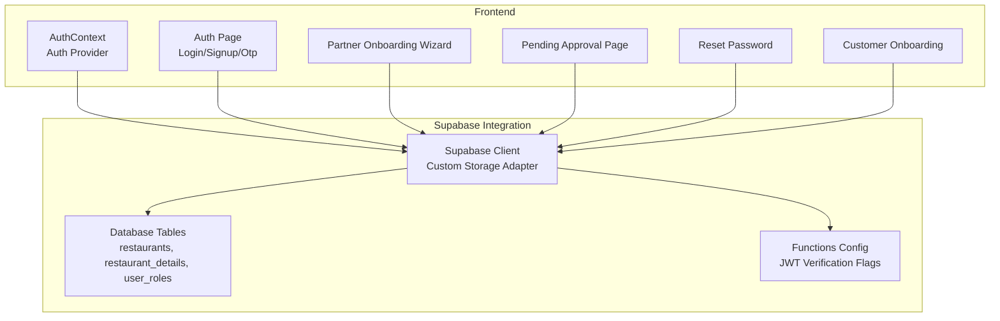
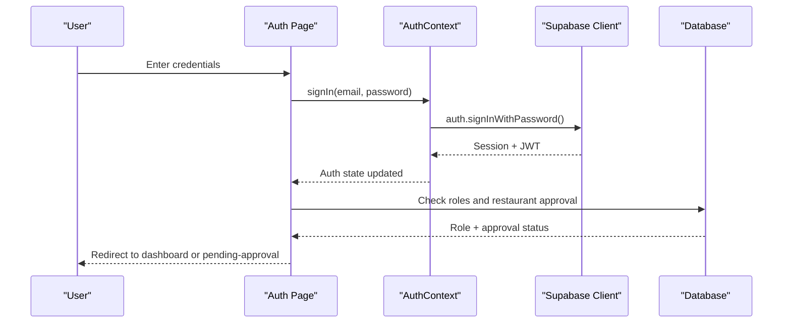
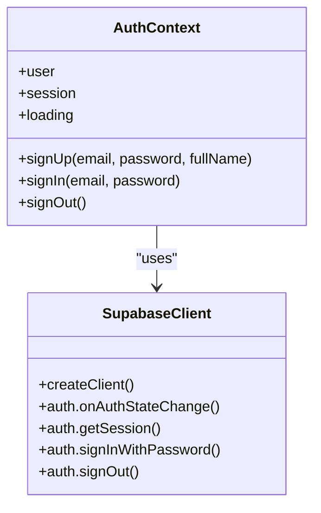
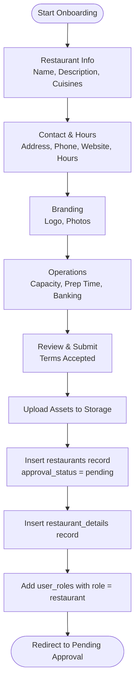
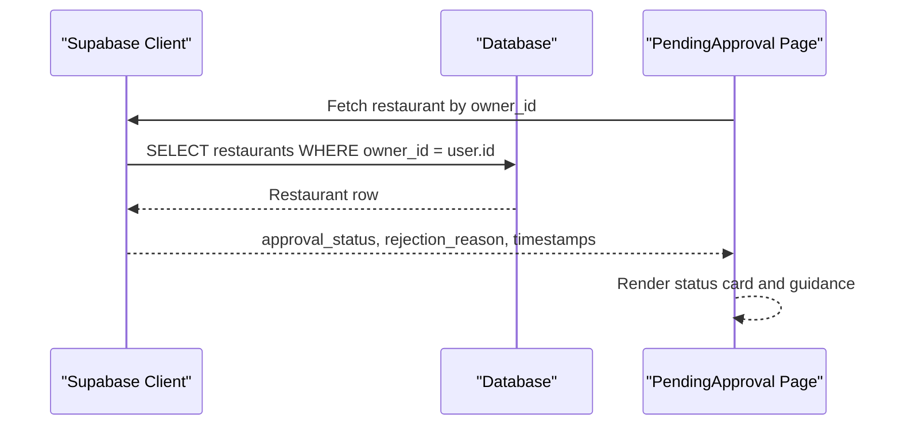
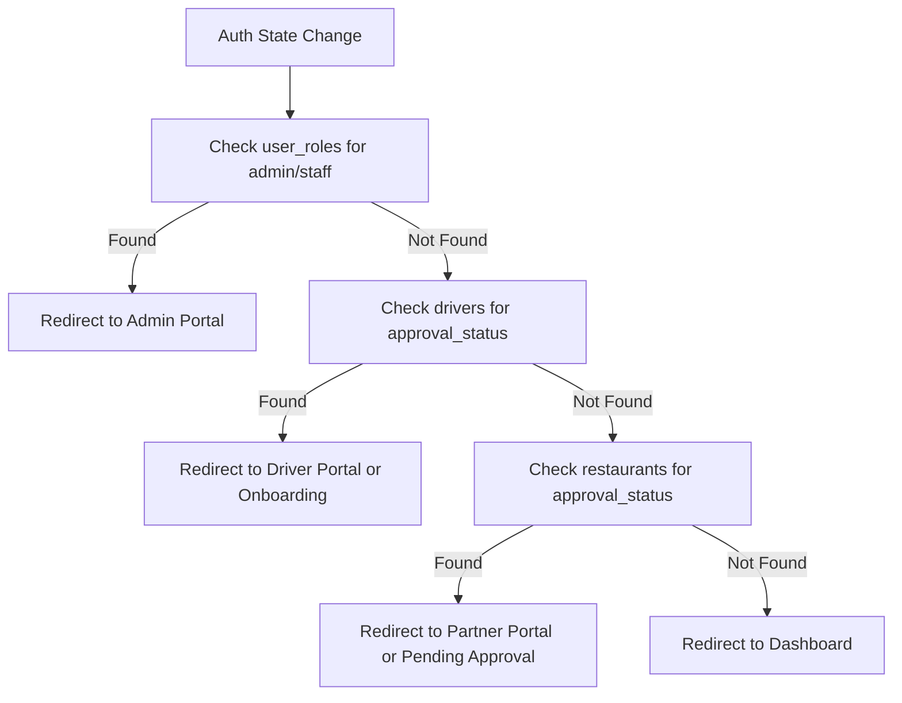
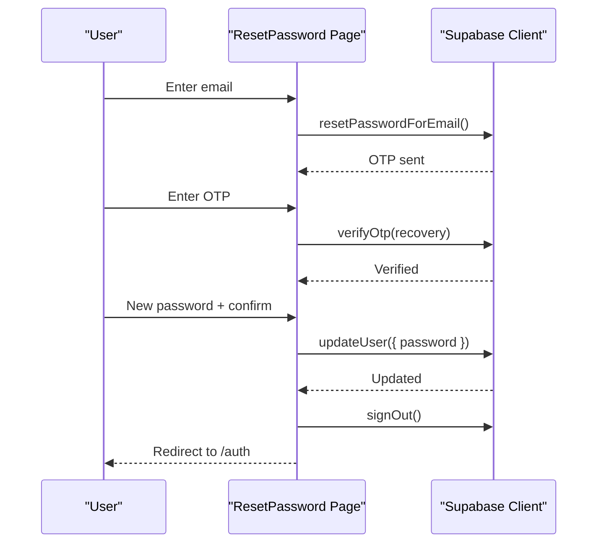
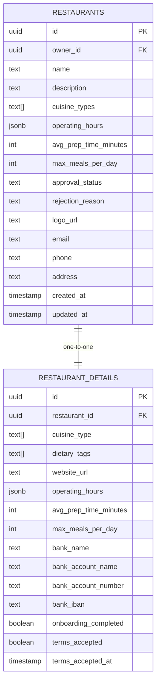
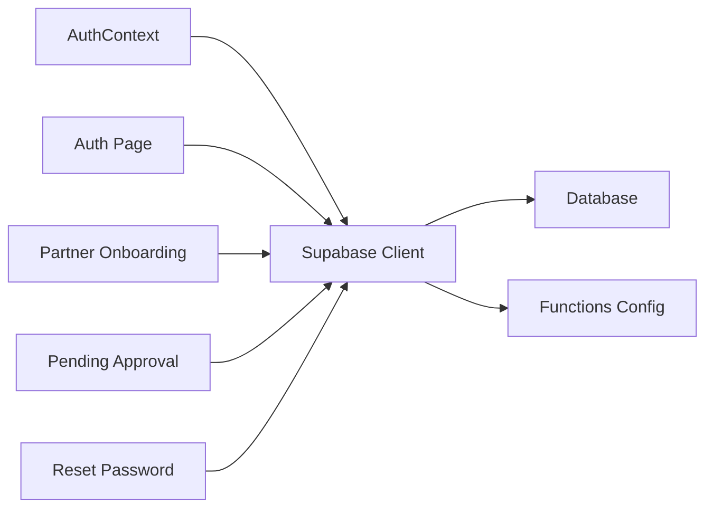

# Partner Authentication & Onboarding

<cite>
**Referenced Files in This Document**
- [AuthContext.tsx](file://src/contexts/AuthContext.tsx)
- [Auth.tsx](file://src/pages/Auth.tsx)
- [client.ts](file://src/integrations/supabase/client.ts)
- [types.ts](file://src/integrations/supabase/types.ts)
- [Onboarding.tsx](file://src/pages/Onboarding.tsx)
- [PartnerOnboarding.tsx](file://src/pages/partner/PartnerOnboarding.tsx)
- [PendingApproval.tsx](file://src/pages/partner/PendingApproval.tsx)
- [ResetPassword.tsx](file://src/pages/ResetPassword.tsx)
- [20260221150000_comprehensive_business_model_fix.sql](file://supabase/migrations/20260221150000_comprehensive_business_model_fix.sql)
- [config.toml](file://supabase/config.toml)
- [PRODUCTION_HARDENING_IMPLEMENTATION.md](file://PRODUCTION_HARDENING_IMPLEMENTATION.md)
- [PRODUCTION_HARDENING_REPORT.md](file://PRODUCTION_HARDENING_REPORT.md)
</cite>

## Table of Contents
1. [Introduction](#introduction)
2. [Project Structure](#project-structure)
3. [Core Components](#core-components)
4. [Architecture Overview](#architecture-overview)
5. [Detailed Component Analysis](#detailed-component-analysis)
6. [Dependency Analysis](#dependency-analysis)
7. [Performance Considerations](#performance-considerations)
8. [Troubleshooting Guide](#troubleshooting-guide)
9. [Conclusion](#conclusion)

## Introduction
This document describes the partner authentication and onboarding system for the restaurant partner portal. It covers the restaurant partner registration process, account verification workflows, role-based access control (RBAC), the multi-step onboarding wizard, required documentation submission, and approval status tracking. It also explains the integration with Supabase authentication, session management, and multi-step verification processes, along with security considerations, password policies, and account activation procedures.

## Project Structure
The partner authentication and onboarding system spans several frontend pages and backend Supabase configurations:
- Authentication and session management are handled via Supabase Auth with a custom React context.
- Partner-specific flows are implemented in dedicated pages for onboarding and approval status.
- Supabase database migrations define the schema for restaurants, restaurant details, and related tables.
- Supabase functions are configured for various backend tasks, with JWT verification toggled per function.

**Diagram sources**
- [AuthContext.tsx:36-61](file://src/contexts/AuthContext.tsx#L36-L61)
- [client.ts:47-57](file://src/integrations/supabase/client.ts#L47-L57)
- [PartnerOnboarding.tsx:310-352](file://src/pages/partner/PartnerOnboarding.tsx#L310-L352)
- [PendingApproval.tsx:36-80](file://src/pages/partner/PendingApproval.tsx#L36-L80)
- [20260221150000_comprehensive_business_model_fix.sql:71-120](file://supabase/migrations/20260221150000_comprehensive_business_model_fix.sql#L71-L120)
- [config.toml:1-59](file://supabase/config.toml#L1-L59)

**Section sources**
- [AuthContext.tsx:31-61](file://src/contexts/AuthContext.tsx#L31-L61)
- [client.ts:18-42](file://src/integrations/supabase/client.ts#L18-L42)
- [PartnerOnboarding.tsx:125-153](file://src/pages/partner/PartnerOnboarding.tsx#L125-L153)
- [PendingApproval.tsx:23-80](file://src/pages/partner/PendingApproval.tsx#L23-L80)
- [20260221150000_comprehensive_business_model_fix.sql:71-120](file://supabase/migrations/20260221150000_comprehensive_business_model_fix.sql#L71-L120)
- [config.toml:1-59](file://supabase/config.toml#L1-L59)

## Core Components
- Supabase Auth Context: Provides authentication state, sign-up/sign-in, and session persistence with a custom storage adapter for native environments.
- Auth Page: Handles login, signup, social login placeholders, biometric login (native), and OTP-based password reset.
- Partner Onboarding Wizard: Multi-step form for restaurant registration, branding, operations, and terms acceptance.
- Pending Approval Page: Displays application status, rejection reasons, and next steps for partner restaurants.
- Reset Password: Password reset flow using OTP verification and secure password update.
- Supabase Client: Initializes Supabase with persistent session and storage abstraction for Capacitor/native platforms.
- Database Migrations: Define restaurants, restaurant_details, and related fields for onboarding and approval workflows.

**Section sources**
- [AuthContext.tsx:8-25](file://src/contexts/AuthContext.tsx#L8-L25)
- [Auth.tsx:19-115](file://src/pages/Auth.tsx#L19-L115)
- [PartnerOnboarding.tsx:125-385](file://src/pages/partner/PartnerOnboarding.tsx#L125-L385)
- [PendingApproval.tsx:23-80](file://src/pages/partner/PendingApproval.tsx#L23-L80)
- [ResetPassword.tsx:31-73](file://src/pages/ResetPassword.tsx#L31-L73)
- [client.ts:47-57](file://src/integrations/supabase/client.ts#L47-L57)
- [20260221150000_comprehensive_business_model_fix.sql:71-120](file://supabase/migrations/20260221150000_comprehensive_business_model_fix.sql#L71-L120)

## Architecture Overview
The system integrates Supabase Auth for identity and session management, with custom storage for native devices. The partner portal enforces role-based access control and approval workflows.

**Diagram sources**
- [Auth.tsx:80-115](file://src/pages/Auth.tsx#L80-L115)
- [AuthContext.tsx:36-61](file://src/contexts/AuthContext.tsx#L36-L61)
- [client.ts:47-57](file://src/integrations/supabase/client.ts#L47-L57)

**Section sources**
- [Auth.tsx:80-115](file://src/pages/Auth.tsx#L80-L115)
- [AuthContext.tsx:36-61](file://src/contexts/AuthContext.tsx#L36-L61)
- [client.ts:47-57](file://src/integrations/supabase/client.ts#L47-L57)

## Detailed Component Analysis

### Authentication and Session Management
- AuthContext sets up an auth state listener and retrieves the current session. It exposes sign-up, sign-in, and sign-out functions and initializes push notifications on native platforms upon sign-in.
- Supabase client uses a custom storage adapter for Capacitor Preferences on native devices and localStorage on the web, enabling persistent sessions across reloads.

**Diagram sources**
- [AuthContext.tsx:31-130](file://src/contexts/AuthContext.tsx#L31-L130)
- [client.ts:47-57](file://src/integrations/supabase/client.ts#L47-L57)

**Section sources**
- [AuthContext.tsx:36-61](file://src/contexts/AuthContext.tsx#L36-L61)
- [AuthContext.tsx:63-118](file://src/contexts/AuthContext.tsx#L63-L118)
- [client.ts:18-42](file://src/integrations/supabase/client.ts#L18-L42)

### Partner Registration and Onboarding Wizard
- The partner onboarding wizard collects restaurant information, contact details, branding assets, operational capacity, and banking details.
- Upon submission, the system uploads images to Supabase Storage, creates a restaurant record with approval_status set to pending, and adds a restaurant role to the user.
- The wizard validates required fields per step and provides progress feedback.

**Diagram sources**
- [PartnerOnboarding.tsx:107-113](file://src/pages/partner/PartnerOnboarding.tsx#L107-L113)
- [PartnerOnboarding.tsx:263-385](file://src/pages/partner/PartnerOnboarding.tsx#L263-L385)

**Section sources**
- [PartnerOnboarding.tsx:125-385](file://src/pages/partner/PartnerOnboarding.tsx#L125-L385)

### Approval Status Tracking
- After registration, the system redirects partners to a pending approval page that displays the current status, rejection reason (if applicable), and next steps.
- The page fetches the restaurant’s approval status and presents actionable information and support contact details.

**Diagram sources**
- [PendingApproval.tsx:36-80](file://src/pages/partner/PendingApproval.tsx#L36-L80)

**Section sources**
- [PendingApproval.tsx:23-80](file://src/pages/partner/PendingApproval.tsx#L23-L80)

### Role-Based Access Control (RBAC)
- The system determines user roles and redirects accordingly:
  - Admin/staff roles redirect to admin portals.
  - Drivers redirect to driver onboarding or dashboard depending on approval status.
  - Restaurant owners are redirected to partner onboarding or dashboard depending on restaurant approval status.
- The implementation caches roles and performs role checks on auth state changes.

**Diagram sources**
- [Auth.tsx:80-115](file://src/pages/Auth.tsx#L80-L115)

**Section sources**
- [Auth.tsx:80-115](file://src/pages/Auth.tsx#L80-L115)

### Password Reset and Multi-Step Verification
- The password reset flow uses OTP verification via Supabase Auth. The user enters their email, receives an OTP, verifies it, and then updates their password securely.
- The reset page validates password length and matching, updates the user’s password, signs them out, and redirects to the login page.

**Diagram sources**
- [ResetPassword.tsx:31-73](file://src/pages/ResetPassword.tsx#L31-L73)

**Section sources**
- [ResetPassword.tsx:31-73](file://src/pages/ResetPassword.tsx#L31-L73)

### Database Schema for Onboarding and Approval
- The migration defines the restaurants table and restaurant_details table, including fields for cuisines, dietary tags, operating hours, banking information, and onboarding completion flags.
- These tables support the multi-step onboarding wizard and approval tracking.

**Diagram sources**
- [20260221150000_comprehensive_business_model_fix.sql:71-120](file://supabase/migrations/20260221150000_comprehensive_business_model_fix.sql#L71-L120)

**Section sources**
- [20260221150000_comprehensive_business_model_fix.sql:71-120](file://supabase/migrations/20260221150000_comprehensive_business_model_fix.sql#L71-L120)

## Dependency Analysis
- Frontend depends on Supabase client for authentication and storage operations.
- The partner onboarding flow depends on Supabase Storage for asset uploads and database inserts for restaurants and restaurant_details.
- RBAC relies on user_roles and restaurant approval_status to control navigation.
- Supabase functions are configured with JWT verification flags; some functions are marked to bypass JWT verification for specific use cases.

**Diagram sources**
- [AuthContext.tsx:31-61](file://src/contexts/AuthContext.tsx#L31-L61)
- [client.ts:47-57](file://src/integrations/supabase/client.ts#L47-L57)
- [config.toml:1-59](file://supabase/config.toml#L1-L59)

**Section sources**
- [AuthContext.tsx:31-61](file://src/contexts/AuthContext.tsx#L31-L61)
- [client.ts:47-57](file://src/integrations/supabase/client.ts#L47-L57)
- [config.toml:1-59](file://supabase/config.toml#L1-L59)

## Performance Considerations
- Session persistence and automatic token refresh reduce redundant authentication calls.
- Image uploads use Supabase Storage with file size limits to manage bandwidth and storage costs.
- Role checks and database queries are performed on auth state changes to minimize repeated network calls.

[No sources needed since this section provides general guidance]

## Troubleshooting Guide
- Authentication failures: Verify environment variables for Supabase URL and publishable key. Check IP location restrictions and blocked IP logs.
- Session issues on native: Confirm Capacitor Preferences storage adapter is functioning and sessions persist across app restarts.
- Onboarding submission errors: Validate required fields per step and ensure image sizes are within limits. Check database insert permissions and function configurations.
- Approval status not updating: Confirm restaurant approval_status transitions and user role assignments occur after onboarding completion.

**Section sources**
- [client.ts:10-16](file://src/integrations/supabase/client.ts#L10-L16)
- [PRODUCTION_HARDENING_REPORT.md:148-171](file://PRODUCTION_HARDENING_REPORT.md#L148-L171)
- [PRODUCTION_HARDENING_IMPLEMENTATION.md:258-281](file://PRODUCTION_HARDENING_IMPLEMENTATION.md#L258-L281)

## Conclusion
The partner authentication and onboarding system leverages Supabase Auth for robust identity management, with a custom storage adapter ensuring seamless sessions across platforms. The multi-step onboarding wizard captures essential restaurant information and branding assets, while the approval workflow ensures controlled activation. Role-based access control and database schema changes enforce proper routing and status tracking. Security measures include IP checks, password policies, and secure password reset flows.