# Partner Portal

<cite>
**Referenced Files in This Document**
- [App.tsx](file://src/App.tsx)
- [PartnerDashboard.tsx](file://src/pages/partner/PartnerDashboard.tsx)
- [PartnerMenu.tsx](file://src/pages/partner/PartnerMenu.tsx)
- [PartnerOrders.tsx](file://src/pages/partner/PartnerOrders.tsx)
- [PartnerAnalytics.tsx](file://src/pages/partner/PartnerAnalytics.tsx)
- [PartnerOnboarding.tsx](file://src/pages/partner/PartnerOnboarding.tsx)
- [PartnerPayouts.tsx](file://src/pages/partner/PartnerPayouts.tsx)
- [PartnerSettings.tsx](file://src/pages/partner/PartnerSettings.tsx)
- [PartnerBranchOrders.tsx](file://src/components/partner/PartnerBranchOrders.tsx)
- [PartnerDeliveryHandoff.tsx](file://src/components/partner/PartnerDeliveryHandoff.tsx)
</cite>

## Table of Contents
1. [Introduction](#introduction)
2. [Project Structure](#project-structure)
3. [Core Components](#core-components)
4. [Architecture Overview](#architecture-overview)
5. [Detailed Component Analysis](#detailed-component-analysis)
6. [Dependency Analysis](#dependency-analysis)
7. [Performance Considerations](#performance-considerations)
8. [Troubleshooting Guide](#troubleshooting-guide)
9. [Conclusion](#conclusion)

## Introduction
This document provides comprehensive documentation for the restaurant partner portal, covering restaurant setup and configuration, menu management, order processing workflows, and analytics dashboards. It also explains the branch management system, commission calculations, and payout processing. Additionally, it documents the partner onboarding process, restaurant approval workflows, performance analytics, integration with the fleet management system for delivery coordination, and premium analytics features for business insights.

## Project Structure
The partner portal is integrated into the main application routing and protected by role-based authentication. The portal exposes multiple dedicated pages for restaurant management, menu administration, order fulfillment, analytics, payouts, settings, and onboarding.

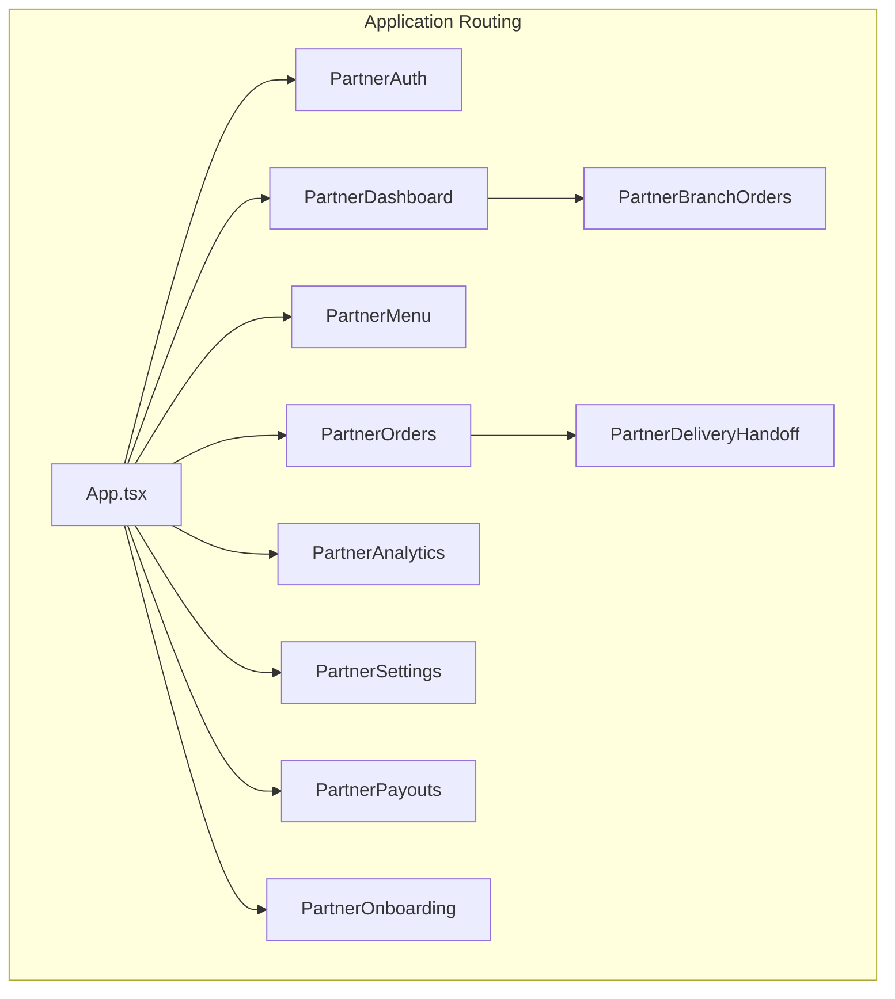

**Diagram sources**
- [App.tsx:364-469](file://src/App.tsx#L364-L469)
- [PartnerDashboard.tsx:1-687](file://src/pages/partner/PartnerDashboard.tsx#L1-L687)
- [PartnerMenu.tsx:1-800](file://src/pages/partner/PartnerMenu.tsx#L1-L800)
- [PartnerOrders.tsx:1-800](file://src/pages/partner/PartnerOrders.tsx#L1-L800)
- [PartnerAnalytics.tsx:1-436](file://src/pages/partner/PartnerAnalytics.tsx#L1-L436)
- [PartnerSettings.tsx:1-357](file://src/pages/partner/PartnerSettings.tsx#L1-L357)
- [PartnerPayouts.tsx:1-985](file://src/pages/partner/PartnerPayouts.tsx#L1-L985)
- [PartnerOnboarding.tsx:1-927](file://src/pages/partner/PartnerOnboarding.tsx#L1-L927)
- [PartnerBranchOrders.tsx:1-369](file://src/components/partner/PartnerBranchOrders.tsx#L1-L369)
- [PartnerDeliveryHandoff.tsx:1-462](file://src/components/partner/PartnerDeliveryHandoff.tsx#L1-L462)

**Section sources**
- [App.tsx:60-74](file://src/App.tsx#L60-L74)
- [App.tsx:364-469](file://src/App.tsx#L364-L469)

## Core Components
This section outlines the primary components of the partner portal and their responsibilities:

- PartnerDashboard: Displays restaurant overview, performance metrics, recent orders, and quick actions. Integrates with Supabase for real-time updates and calculates revenue based on platform commission rates.
- PartnerMenu: Manages menu items, categories, sorting, approvals, and add-ons. Provides AI-powered meal analysis for quick setup.
- PartnerOrders: Handles order lifecycle from placement to completion, including status transitions, real-time notifications, and delivery handoff with QR code verification.
- PartnerAnalytics: Presents basic analytics charts and premium analytics access via a paywall component.
- PartnerOnboarding: Guides restaurant partners through multi-step registration, branding uploads, operational settings, and banking details.
- PartnerPayouts: Calculates earnings, displays payout history, and manages payout requests with configurable frequency and bank details.
- PartnerSettings: Allows restaurant profile updates, operating hours, visibility controls, and commission rate viewing.
- PartnerBranchOrders: Shows branch-specific orders for multi-location restaurants and supports filtering and refresh.
- PartnerDeliveryHandoff: Coordinates delivery handoff with QR code verification and driver information.

**Section sources**
- [PartnerDashboard.tsx:70-687](file://src/pages/partner/PartnerDashboard.tsx#L70-L687)
- [PartnerMenu.tsx:166-800](file://src/pages/partner/PartnerMenu.tsx#L166-L800)
- [PartnerOrders.tsx:185-800](file://src/pages/partner/PartnerOrders.tsx#L185-L800)
- [PartnerAnalytics.tsx:51-436](file://src/pages/partner/PartnerAnalytics.tsx#L51-L436)
- [PartnerOnboarding.tsx:125-927](file://src/pages/partner/PartnerOnboarding.tsx#L125-L927)
- [PartnerPayouts.tsx:227-985](file://src/pages/partner/PartnerPayouts.tsx#L227-L985)
- [PartnerSettings.tsx:43-357](file://src/pages/partner/PartnerSettings.tsx#L43-L357)
- [PartnerBranchOrders.tsx:55-369](file://src/components/partner/PartnerBranchOrders.tsx#L55-L369)
- [PartnerDeliveryHandoff.tsx:52-462](file://src/components/partner/PartnerDeliveryHandoff.tsx#L52-L462)

## Architecture Overview
The partner portal leverages Supabase for backend services, including real-time Postgres changes, storage, and edge functions. Authentication is role-based, requiring the "partner" role and optional approval checks. The frontend components communicate with Supabase using typed queries and real-time subscriptions.

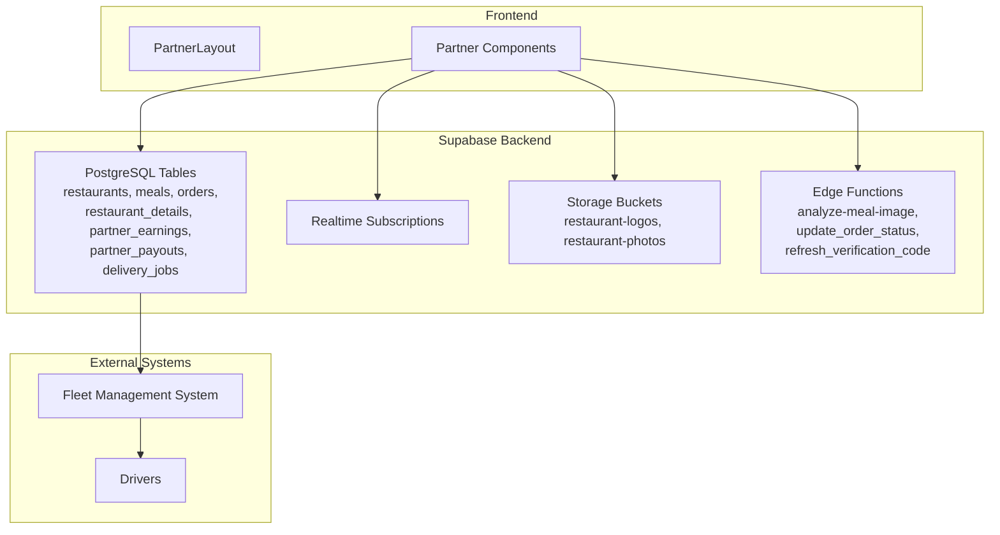

**Diagram sources**
- [PartnerDashboard.tsx:94-117](file://src/pages/partner/PartnerDashboard.tsx#L94-L117)
- [PartnerMenu.tsx:203-242](file://src/pages/partner/PartnerMenu.tsx#L203-L242)
- [PartnerOrders.tsx:249-308](file://src/pages/partner/PartnerOrders.tsx#L249-L308)
- [PartnerPayouts.tsx:314-361](file://src/pages/partner/PartnerPayouts.tsx#L314-L361)
- [PartnerDeliveryHandoff.tsx:63-134](file://src/components/partner/PartnerDeliveryHandoff.tsx#L63-L134)

## Detailed Component Analysis

### Restaurant Setup and Configuration
The onboarding process guides partners through five steps: restaurant information, contact and hours, branding, operations, and review. It validates inputs, handles media uploads, and creates restaurant records with approval status.

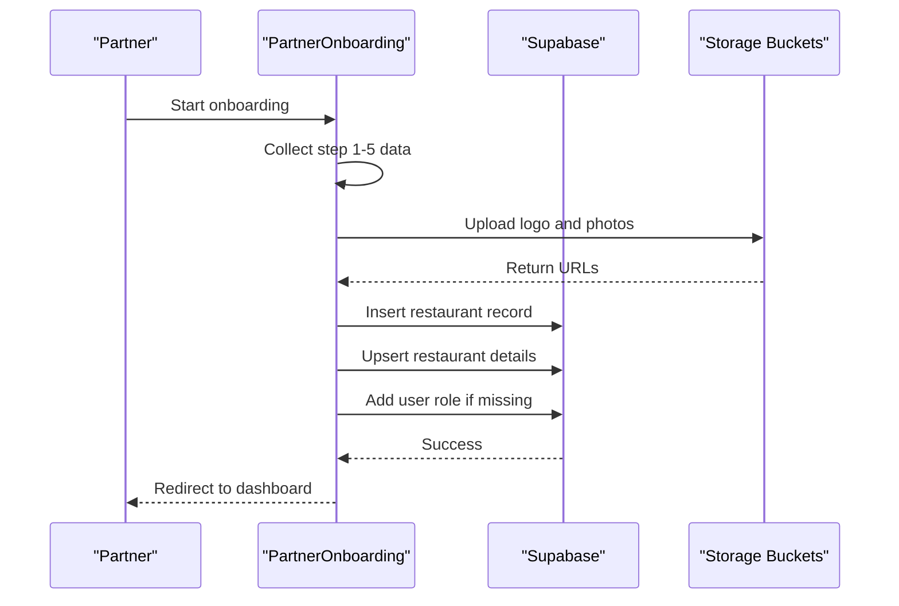

**Diagram sources**
- [PartnerOnboarding.tsx:263-385](file://src/pages/partner/PartnerOnboarding.tsx#L263-L385)

**Section sources**
- [PartnerOnboarding.tsx:125-927](file://src/pages/partner/PartnerOnboarding.tsx#L125-L927)

### Menu Management
Menu management supports CRUD operations, categorization, sorting, approval workflows, and add-ons. It integrates AI analysis for rapid meal creation and maintains real-time synchronization with admin approvals.

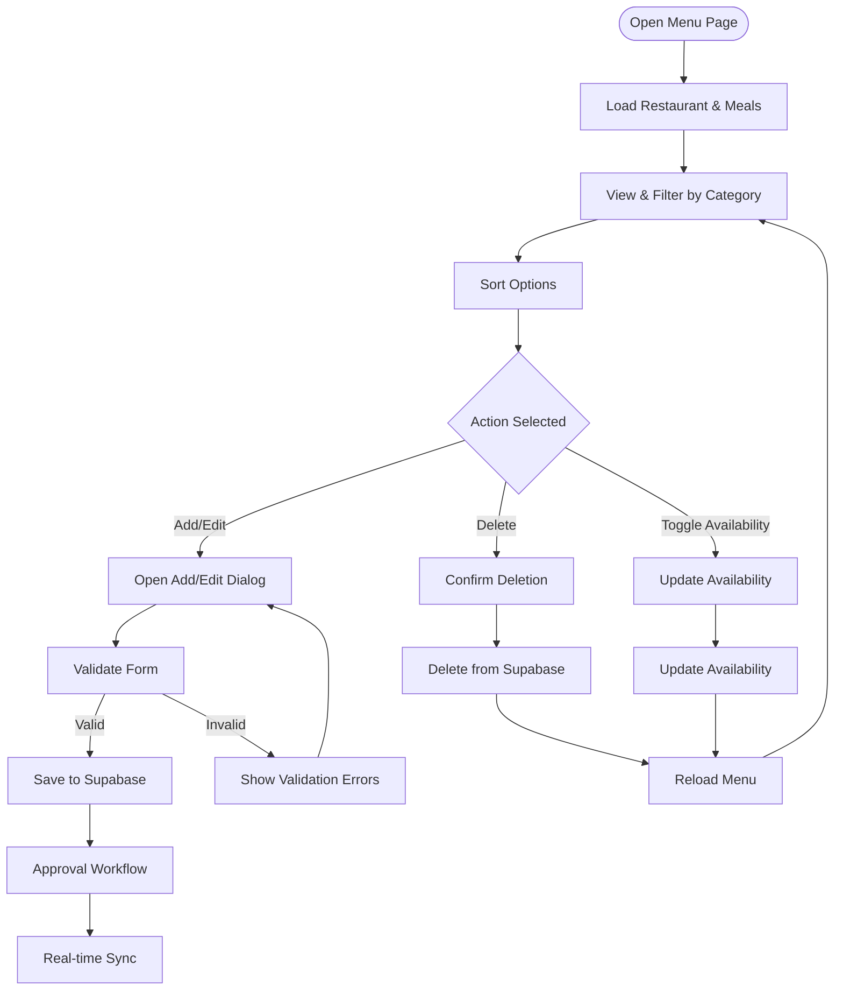

**Diagram sources**
- [PartnerMenu.tsx:249-300](file://src/pages/partner/PartnerMenu.tsx#L249-L300)
- [PartnerMenu.tsx:465-527](file://src/pages/partner/PartnerMenu.tsx#L465-L527)
- [PartnerMenu.tsx:203-242](file://src/pages/partner/PartnerMenu.tsx#L203-L242)

**Section sources**
- [PartnerMenu.tsx:166-800](file://src/pages/partner/PartnerMenu.tsx#L166-L800)

### Order Processing Workflows
Order processing spans multiple statuses from pending to completed. The system provides real-time updates, status transitions, and delivery handoff with QR code verification and driver information.

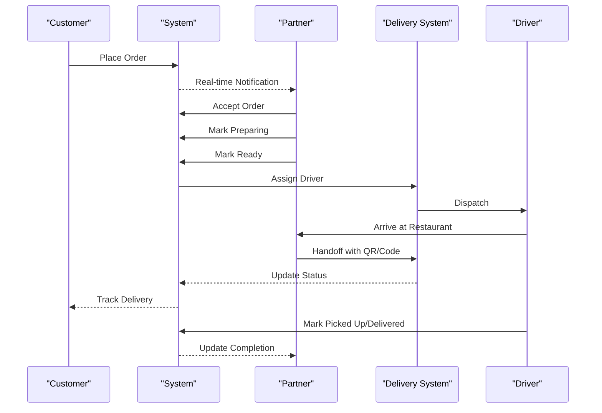

**Diagram sources**
- [PartnerOrders.tsx:479-510](file://src/pages/partner/PartnerOrders.tsx#L479-L510)
- [PartnerDeliveryHandoff.tsx:136-180](file://src/components/partner/PartnerDeliveryHandoff.tsx#L136-L180)

**Section sources**
- [PartnerOrders.tsx:185-800](file://src/pages/partner/PartnerOrders.tsx#L185-L800)
- [PartnerDeliveryHandoff.tsx:52-462](file://src/components/partner/PartnerDeliveryHandoff.tsx#L52-L462)

### Analytics Dashboard
The analytics dashboard provides basic charts and summaries, with access to premium analytics via a paywall component. It computes revenue, orders, and customer metrics using platform commission rates.

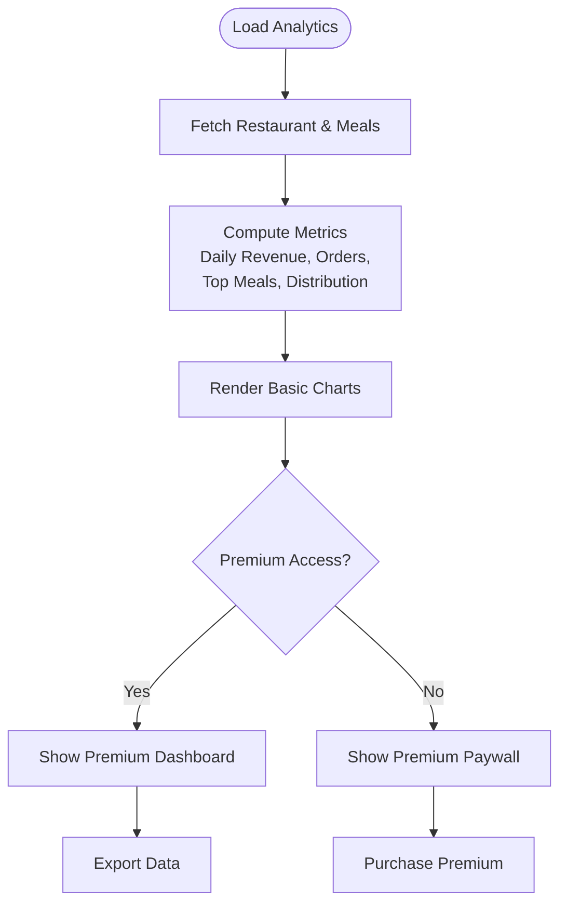

**Diagram sources**
- [PartnerAnalytics.tsx:76-191](file://src/pages/partner/PartnerAnalytics.tsx#L76-L191)
- [PartnerAnalytics.tsx:404-430](file://src/pages/partner/PartnerAnalytics.tsx#L404-L430)

**Section sources**
- [PartnerAnalytics.tsx:51-436](file://src/pages/partner/PartnerAnalytics.tsx#L51-L436)

### Branch Management System
Branch management enables multi-location restaurants to view and filter orders by branch. It supports branch selection, filtering by status, and distance calculation for delivery estimation.

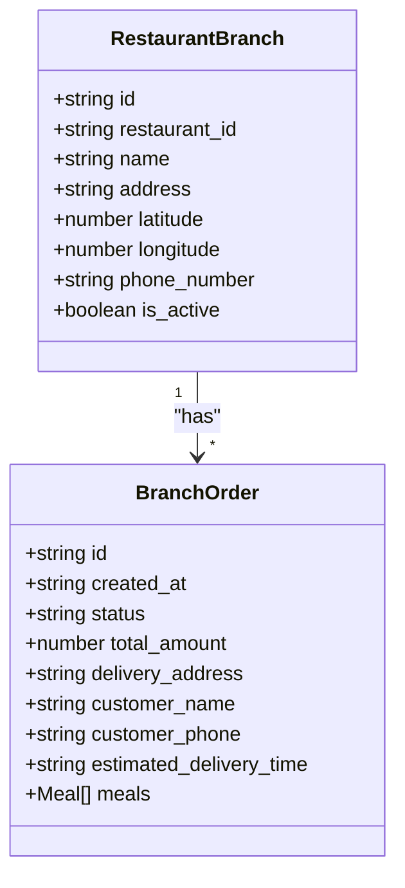

**Diagram sources**
- [PartnerBranchOrders.tsx:24-48](file://src/components/partner/PartnerBranchOrders.tsx#L24-L48)

**Section sources**
- [PartnerBranchOrders.tsx:55-369](file://src/components/partner/PartnerBranchOrders.tsx#L55-L369)

### Commission Calculations and Payout Processing
Payout processing calculates net earnings after platform commission, manages payout requests, and tracks history. Bank details are stored and validated for payout eligibility.

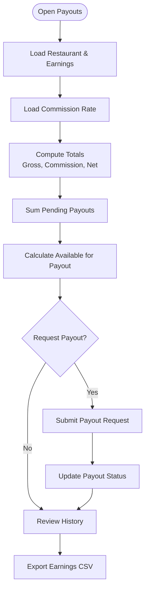

**Diagram sources**
- [PartnerPayouts.tsx:311-361](file://src/pages/partner/PartnerPayouts.tsx#L311-L361)
- [PartnerPayouts.tsx:365-389](file://src/pages/partner/PartnerPayouts.tsx#L365-L389)

**Section sources**
- [PartnerPayouts.tsx:227-985](file://src/pages/partner/PartnerPayouts.tsx#L227-L985)

### Partner Onboarding Process
The onboarding wizard collects restaurant details, branding assets, operational settings, and banking information. It enforces validation rules and creates restaurant records with approval status.

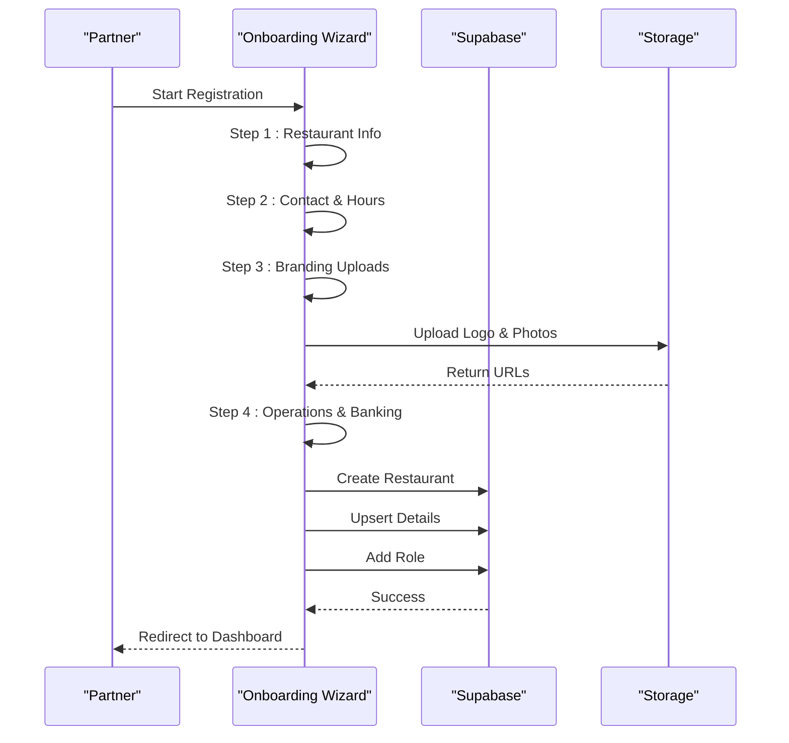

**Diagram sources**
- [PartnerOnboarding.tsx:263-385](file://src/pages/partner/PartnerOnboarding.tsx#L263-L385)

**Section sources**
- [PartnerOnboarding.tsx:125-927](file://src/pages/partner/PartnerOnboarding.tsx#L125-L927)

### Restaurant Approval Workflows
Approval workflows integrate with admin controls for menu items exceeding thresholds and restaurant registration. Real-time notifications inform partners of approval/rejection decisions.

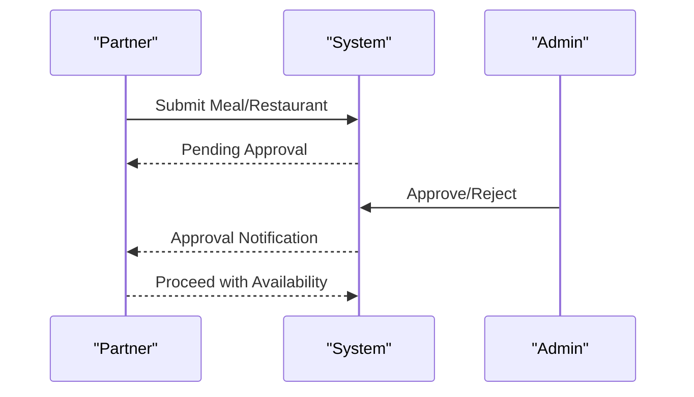

**Diagram sources**
- [PartnerMenu.tsx:465-527](file://src/pages/partner/PartnerMenu.tsx#L465-L527)
- [PartnerMenu.tsx:203-242](file://src/pages/partner/PartnerMenu.tsx#L203-L242)

**Section sources**
- [PartnerMenu.tsx:166-800](file://src/pages/partner/PartnerMenu.tsx#L166-L800)

### Performance Analytics
Performance analytics aggregates order data, computes revenue trends, and visualizes top-performing meals and distribution by meal type. It uses platform commission rates to derive net earnings.

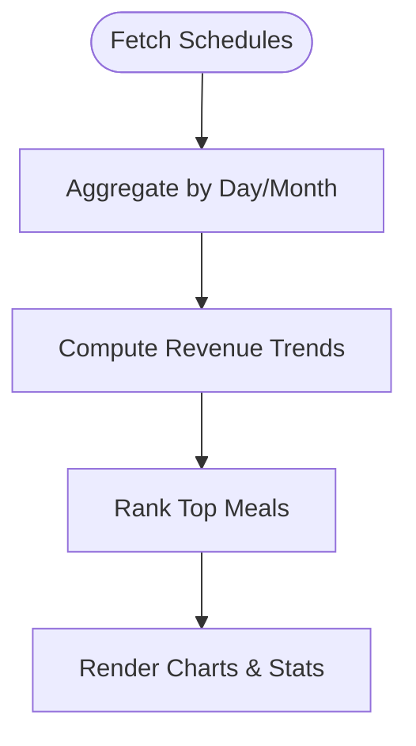

**Diagram sources**
- [PartnerAnalytics.tsx:117-191](file://src/pages/partner/PartnerAnalytics.tsx#L117-L191)

**Section sources**
- [PartnerAnalytics.tsx:51-436](file://src/pages/partner/PartnerAnalytics.tsx#L51-L436)

### Integration with Fleet Management System
The delivery handoff component integrates with the fleet management system to coordinate driver assignments, QR code verification, and real-time status updates. It provides driver contact information and delivery fee details.

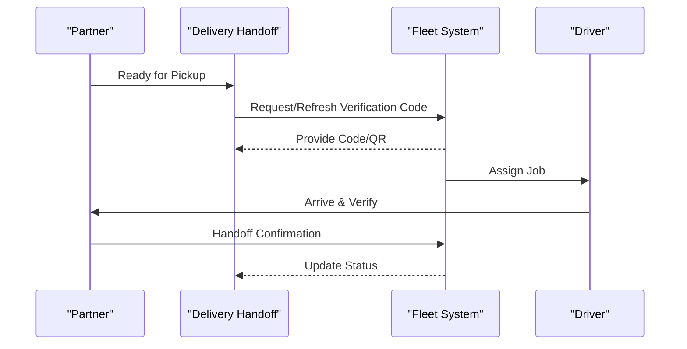

**Diagram sources**
- [PartnerDeliveryHandoff.tsx:136-180](file://src/components/partner/PartnerDeliveryHandoff.tsx#L136-L180)
- [PartnerDeliveryHandoff.tsx:63-134](file://src/components/partner/PartnerDeliveryHandoff.tsx#L63-L134)

**Section sources**
- [PartnerDeliveryHandoff.tsx:52-462](file://src/components/partner/PartnerDeliveryHandoff.tsx#L52-L462)

## Dependency Analysis
The partner portal components depend on shared layouts, authentication contexts, and Supabase services. Real-time subscriptions and edge functions enhance responsiveness and automation.

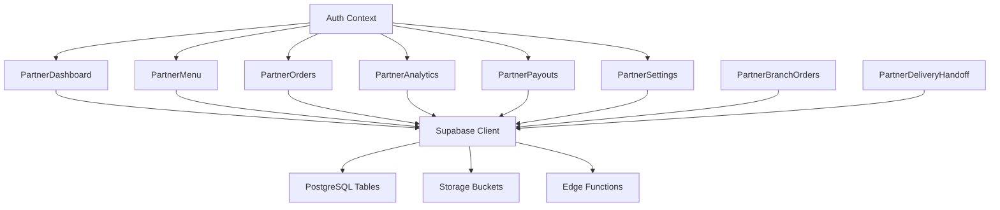

**Diagram sources**
- [PartnerDashboard.tsx:30-36](file://src/pages/partner/PartnerDashboard.tsx#L30-L36)
- [PartnerMenu.tsx:52-58](file://src/pages/partner/PartnerMenu.tsx#L52-L58)
- [PartnerOrders.tsx:29-33](file://src/pages/partner/PartnerOrders.tsx#L29-L33)
- [PartnerAnalytics.tsx:14-20](file://src/pages/partner/PartnerAnalytics.tsx#L14-L20)
- [PartnerPayouts.tsx:51-54](file://src/pages/partner/PartnerPayouts.tsx#L51-L54)
- [PartnerSettings.tsx:11-15](file://src/pages/partner/PartnerSettings.tsx#L11-L15)
- [PartnerBranchOrders.tsx:20-22](file://src/components/partner/PartnerBranchOrders.tsx#L20-L22)
- [PartnerDeliveryHandoff.tsx:16-19](file://src/components/partner/PartnerDeliveryHandoff.tsx#L16-L19)

**Section sources**
- [PartnerDashboard.tsx:70-687](file://src/pages/partner/PartnerDashboard.tsx#L70-L687)
- [PartnerMenu.tsx:166-800](file://src/pages/partner/PartnerMenu.tsx#L166-L800)
- [PartnerOrders.tsx:185-800](file://src/pages/partner/PartnerOrders.tsx#L185-L800)
- [PartnerAnalytics.tsx:51-436](file://src/pages/partner/PartnerAnalytics.tsx#L51-L436)
- [PartnerPayouts.tsx:227-985](file://src/pages/partner/PartnerPayouts.tsx#L227-L985)
- [PartnerSettings.tsx:43-357](file://src/pages/partner/PartnerSettings.tsx#L43-L357)
- [PartnerBranchOrders.tsx:55-369](file://src/components/partner/PartnerBranchOrders.tsx#L55-L369)
- [PartnerDeliveryHandoff.tsx:52-462](file://src/components/partner/PartnerDeliveryHandoff.tsx#L52-L462)

## Performance Considerations
- Real-time subscriptions reduce polling overhead and improve user experience.
- Batch operations (e.g., fetching add-ons for multiple meals) minimize network requests.
- Chart rendering uses responsive containers to optimize layout performance.
- Image uploads leverage Supabase storage with size validation to prevent large payloads.
- Date range filtering and computed summaries help avoid heavy computations on the client.

## Troubleshooting Guide
Common issues and resolutions:
- Authentication failures during AI analysis: The system detects unauthorized sessions and redirects to the auth page.
- Real-time updates not firing: Verify Supabase subscriptions and network connectivity.
- Approval notifications: Ensure admin updates are reflected in real-time channels.
- Payout submission errors: Validate bank details and available balance before requesting payouts.
- Delivery handoff delays: Confirm driver assignment and refresh verification codes when expired.

**Section sources**
- [PartnerMenu.tsx:398-452](file://src/pages/partner/PartnerMenu.tsx#L398-L452)
- [PartnerOrders.tsx:249-308](file://src/pages/partner/PartnerOrders.tsx#L249-L308)
- [PartnerPayouts.tsx:365-389](file://src/pages/partner/PartnerPayouts.tsx#L365-L389)
- [PartnerDeliveryHandoff.tsx:182-186](file://src/components/partner/PartnerDeliveryHandoff.tsx#L182-L186)

## Conclusion
The partner portal provides a comprehensive suite of tools for restaurant partners to manage their operations effectively. From onboarding and menu management to order fulfillment, analytics, and payouts, the system integrates seamlessly with Supabase and the fleet management system. The branch management and delivery handoff features enable efficient multi-location operations, while premium analytics offer advanced insights for business growth.