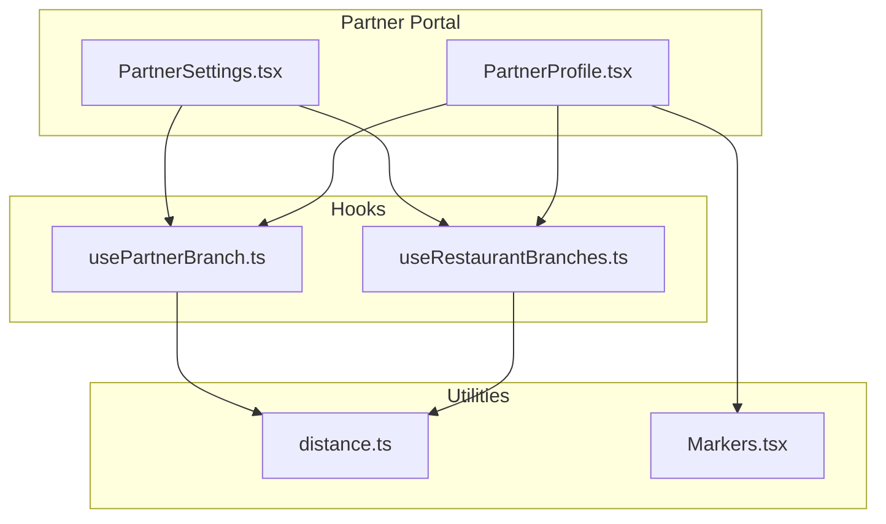
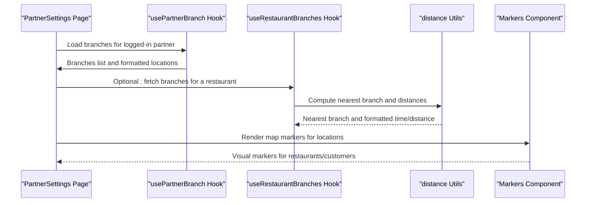
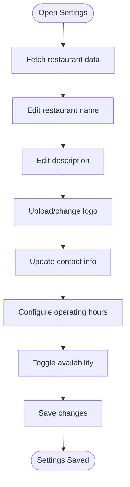
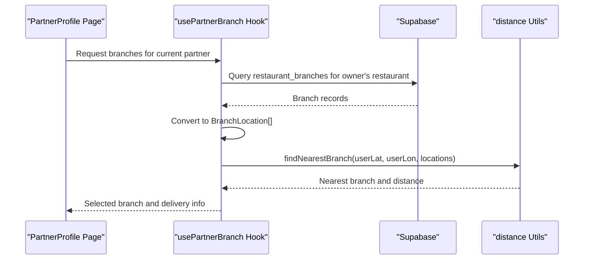
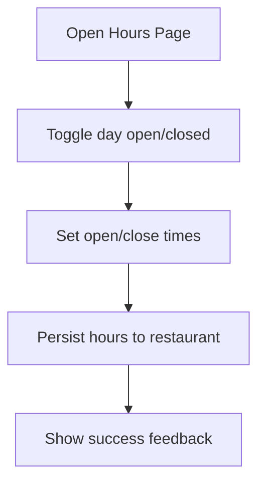
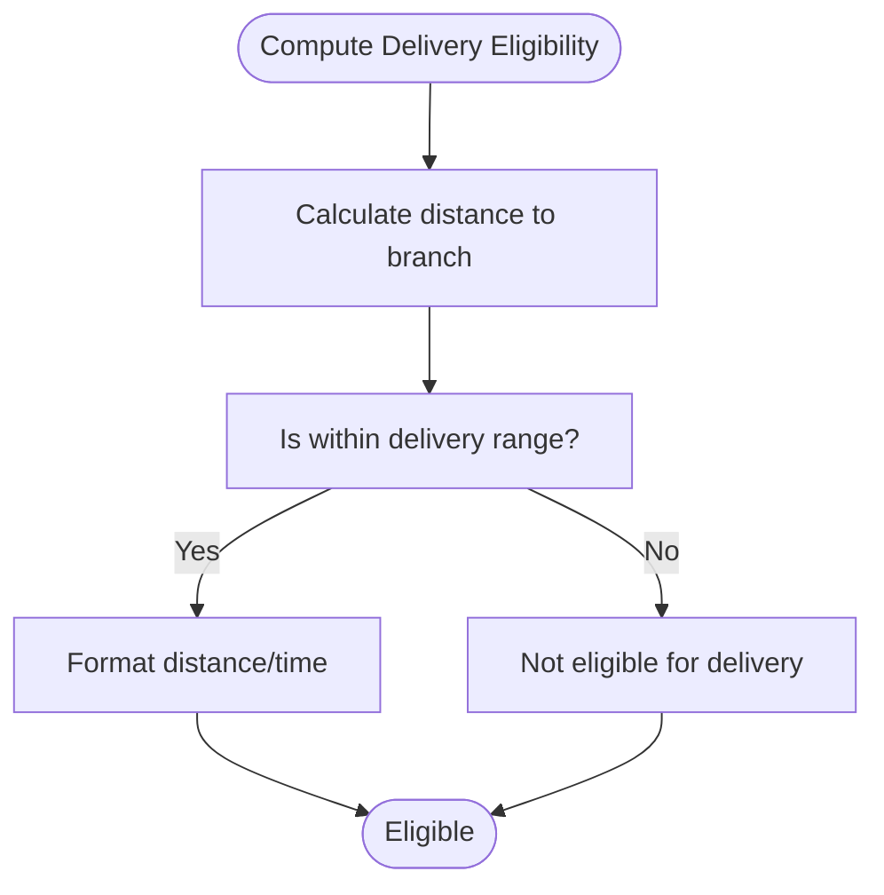
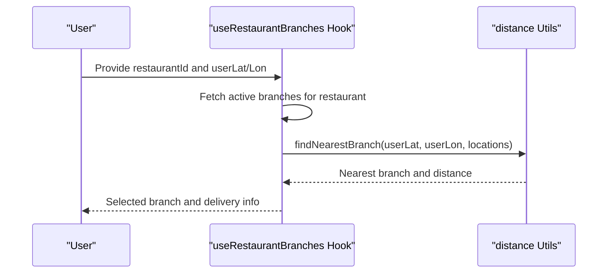
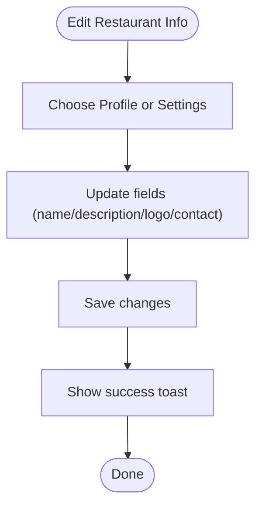
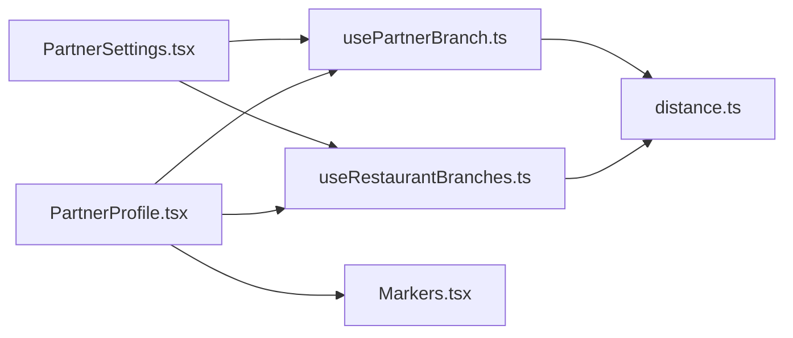

# Restaurant Management

<cite>
**Referenced Files in This Document**
- [usePartnerBranch.ts](file://src/hooks/usePartnerBranch.ts)
- [useRestaurantBranches.ts](file://src/hooks/useRestaurantBranches.ts)
- [distance.ts](file://src/lib/distance.ts)
- [PartnerSettings.tsx](file://src/pages/partner/PartnerSettings.tsx)
- [PartnerProfile.tsx](file://src/pages/partner/PartnerProfile.tsx)
- [Markers.tsx](file://src/components/maps/Markers.tsx)
- [profile.spec.ts](file://e2e/partner/profile.spec.ts)
- [partner-portal-audit-report.md](file://partner-portal-audit-report.md)
</cite>

## Table of Contents
1. [Introduction](#introduction)
2. [Project Structure](#project-structure)
3. [Core Components](#core-components)
4. [Architecture Overview](#architecture-overview)
5. [Detailed Component Analysis](#detailed-component-analysis)
6. [Dependency Analysis](#dependency-analysis)
7. [Performance Considerations](#performance-considerations)
8. [Troubleshooting Guide](#troubleshooting-guide)
9. [Conclusion](#conclusion)

## Introduction
This document describes the restaurant management capabilities available in the partner portal. It focuses on how partners configure their restaurant profile, manage multiple branches, set operational hours, and integrate with mapping services for location-based features. It also covers branch switching functionality, multi-location support, and workflows for editing restaurant information, uploading photos and logos, managing descriptions, and updating contact details.

## Project Structure
The restaurant management functionality spans several areas:
- Hooks for fetching and manipulating restaurant and branch data
- Pages for settings and profile management
- Utility library for distance and delivery calculations
- Map markers for visualizing locations
- End-to-end tests covering profile-related workflows

**Diagram sources**
- [PartnerSettings.tsx:1-357](file://src/pages/partner/PartnerSettings.tsx#L1-L357)
- [PartnerProfile.tsx:1-237](file://src/pages/partner/PartnerProfile.tsx#L1-L237)
- [usePartnerBranch.ts:1-313](file://src/hooks/usePartnerBranch.ts#L1-L313)
- [useRestaurantBranches.ts:1-229](file://src/hooks/useRestaurantBranches.ts#L1-L229)
- [distance.ts:51-158](file://src/lib/distance.ts#L51-L158)
- [Markers.tsx:1-50](file://src/components/maps/Markers.tsx#L1-L50)

**Section sources**
- [PartnerSettings.tsx:1-357](file://src/pages/partner/PartnerSettings.tsx#L1-L357)
- [PartnerProfile.tsx:1-237](file://src/pages/partner/PartnerProfile.tsx#L1-L237)
- [usePartnerBranch.ts:1-313](file://src/hooks/usePartnerBranch.ts#L1-L313)
- [useRestaurantBranches.ts:1-229](file://src/hooks/useRestaurantBranches.ts#L1-L229)
- [distance.ts:51-158](file://src/lib/distance.ts#L51-L158)
- [Markers.tsx:1-50](file://src/components/maps/Markers.tsx#L1-L50)

## Core Components
- Restaurant profile management: edit name, description, logo, contact details, and availability.
- Operational hours configuration: set opening/closing times per day and toggle closures.
- Branch management: retrieve and present branches for the logged-in partner restaurant.
- Location-based features: compute distances, delivery estimates, and display on maps.
- Multi-location support: select nearest branch, route optimization across restaurants, and branch-specific order management.

Key implementation references:
- Restaurant settings page and form handling: [PartnerSettings.tsx:43-357](file://src/pages/partner/PartnerSettings.tsx#L43-L357)
- Profile page with contact and location fields: [PartnerProfile.tsx:16-237](file://src/pages/partner/PartnerProfile.tsx#L16-L237)
- Branch retrieval and nearest-branch logic: [usePartnerBranch.ts:31-100](file://src/hooks/usePartnerBranch.ts#L31-L100), [useRestaurantBranches.ts:33-120](file://src/hooks/useRestaurantBranches.ts#L33-L120)
- Distance and delivery utilities: [distance.ts:51-158](file://src/lib/distance.ts#L51-L158)
- Map markers for locations: [Markers.tsx:1-50](file://src/components/maps/Markers.tsx#L1-L50)

**Section sources**
- [PartnerSettings.tsx:43-357](file://src/pages/partner/PartnerSettings.tsx#L43-L357)
- [PartnerProfile.tsx:16-237](file://src/pages/partner/PartnerProfile.tsx#L16-L237)
- [usePartnerBranch.ts:31-100](file://src/hooks/usePartnerBranch.ts#L31-L100)
- [useRestaurantBranches.ts:33-120](file://src/hooks/useRestaurantBranches.ts#L33-L120)
- [distance.ts:51-158](file://src/lib/distance.ts#L51-L158)
- [Markers.tsx:1-50](file://src/components/maps/Markers.tsx#L1-L50)

## Architecture Overview
The restaurant management architecture centers around Supabase-backed hooks that fetch and update restaurant data, with UI pages orchestrating forms and actions. Distance utilities power location-aware features, while map markers visualize restaurant and customer positions.

**Diagram sources**
- [PartnerSettings.tsx:43-357](file://src/pages/partner/PartnerSettings.tsx#L43-L357)
- [usePartnerBranch.ts:31-100](file://src/hooks/usePartnerBranch.ts#L31-L100)
- [useRestaurantBranches.ts:33-120](file://src/hooks/useRestaurantBranches.ts#L33-L120)
- [distance.ts:51-158](file://src/lib/distance.ts#L51-L158)
- [Markers.tsx:1-50](file://src/components/maps/Markers.tsx#L1-L50)

## Detailed Component Analysis

### Restaurant Profile Configuration
The restaurant profile allows partners to:
- Update basic information: name, description, and logo
- Manage contact details: address, phone, and email
- Control availability: enable/disable the restaurant
- Configure operational hours: per-day open/close times and closure toggles

Implementation highlights:
- Form state management and persistence via Supabase updates: [PartnerSettings.tsx:70-154](file://src/pages/partner/PartnerSettings.tsx#L70-L154)
- Per-day operating hours UI and state: [PartnerSettings.tsx:301-348](file://src/pages/partner/PartnerSettings.tsx#L301-L348)
- Availability toggle: [PartnerSettings.tsx:279-288](file://src/pages/partner/PartnerSettings.tsx#L279-L288)

**Diagram sources**
- [PartnerSettings.tsx:70-154](file://src/pages/partner/PartnerSettings.tsx#L70-L154)
- [PartnerSettings.tsx:301-348](file://src/pages/partner/PartnerSettings.tsx#L301-L348)

**Section sources**
- [PartnerSettings.tsx:70-154](file://src/pages/partner/PartnerSettings.tsx#L70-L154)
- [PartnerSettings.tsx:301-348](file://src/pages/partner/PartnerSettings.tsx#L301-L348)

### Branch Location Management
Partners can view and manage their restaurant branches:
- Retrieve branches associated with the logged-in partner’s restaurant
- Convert branch data into location objects for distance calculations
- Auto-select nearest branch during order creation

Key references:
- Fetch branches for the logged-in partner: [usePartnerBranch.ts:37-78](file://src/hooks/usePartnerBranch.ts#L37-L78)
- Branch-to-location conversion: [usePartnerBranch.ts:81-90](file://src/hooks/usePartnerBranch.ts#L81-L90)
- Auto-branch selection for orders: [usePartnerBranch.ts:260-302](file://src/hooks/usePartnerBranch.ts#L260-L302)

**Diagram sources**
- [usePartnerBranch.ts:37-78](file://src/hooks/usePartnerBranch.ts#L37-L78)
- [usePartnerBranch.ts:260-302](file://src/hooks/usePartnerBranch.ts#L260-L302)
- [distance.ts:84-120](file://src/lib/distance.ts#L84-L120)

**Section sources**
- [usePartnerBranch.ts:37-78](file://src/hooks/usePartnerBranch.ts#L37-L78)
- [usePartnerBranch.ts:81-90](file://src/hooks/usePartnerBranch.ts#L81-L90)
- [usePartnerBranch.ts:260-302](file://src/hooks/usePartnerBranch.ts#L260-L302)

### Operational Hours Setup
The settings page supports granular control of daily operating hours:
- Toggle a day open/closed
- Set open and close times
- Persist structured hours to the restaurant record

References:
- Day enumeration and default hours: [PartnerSettings.tsx:31-41](file://src/pages/partner/PartnerSettings.tsx#L31-L41)
- Hours UI and state updates: [PartnerSettings.tsx:301-348](file://src/pages/partner/PartnerSettings.tsx#L301-L348)
- Saving hours to Supabase: [PartnerSettings.tsx:127-139](file://src/pages/partner/PartnerSettings.tsx#L127-L139)

**Diagram sources**
- [PartnerSettings.tsx:301-348](file://src/pages/partner/PartnerSettings.tsx#L301-L348)
- [PartnerSettings.tsx:127-139](file://src/pages/partner/PartnerSettings.tsx#L127-L139)

**Section sources**
- [PartnerSettings.tsx:31-41](file://src/pages/partner/PartnerSettings.tsx#L31-L41)
- [PartnerSettings.tsx:301-348](file://src/pages/partner/PartnerSettings.tsx#L301-L348)
- [PartnerSettings.tsx:127-139](file://src/pages/partner/PartnerSettings.tsx#L127-L139)

### Service Area Definition and Delivery Range
Delivery eligibility is computed based on distance thresholds:
- Compute distance between user and branch
- Determine if within configured delivery range
- Format distance and delivery time for display

References:
- Distance calculation and formatting: [distance.ts:56-61](file://src/lib/distance.ts#L56-L61), [distance.ts:140-158](file://src/lib/distance.ts#L140-L158)
- Delivery range check: [distance.ts:128-133](file://src/lib/distance.ts#L128-L133)
- Nearest branch finder: [distance.ts:84-120](file://src/lib/distance.ts#L84-L120)

**Diagram sources**
- [distance.ts:56-61](file://src/lib/distance.ts#L56-L61)
- [distance.ts:128-133](file://src/lib/distance.ts#L128-L133)
- [distance.ts:140-158](file://src/lib/distance.ts#L140-L158)

**Section sources**
- [distance.ts:56-61](file://src/lib/distance.ts#L56-L61)
- [distance.ts:128-133](file://src/lib/distance.ts#L128-L133)
- [distance.ts:140-158](file://src/lib/distance.ts#L140-L158)

### Branch Switching Functionality and Multi-Location Support
The system supports:
- Selecting the nearest branch for a given restaurant and user location
- Sorting branches by distance for route planning
- Fleet manager view grouping orders by branch for driver dispatch

References:
- Auto-branch selection hook: [usePartnerBranch.ts:251-312](file://src/hooks/usePartnerBranch.ts#L251-L312)
- Nearest branch finder: [useRestaurantBranches.ts:125-146](file://src/hooks/useRestaurantBranches.ts#L125-L146)
- Optimal route across multiple restaurants: [useRestaurantBranches.ts:151-229](file://src/hooks/useRestaurantBranches.ts#L151-L229)

**Diagram sources**
- [useRestaurantBranches.ts:125-146](file://src/hooks/useRestaurantBranches.ts#L125-L146)
- [distance.ts:84-120](file://src/lib/distance.ts#L84-L120)

**Section sources**
- [usePartnerBranch.ts:251-312](file://src/hooks/usePartnerBranch.ts#L251-L312)
- [useRestaurantBranches.ts:125-146](file://src/hooks/useRestaurantBranches.ts#L125-L146)
- [useRestaurantBranches.ts:151-229](file://src/hooks/useRestaurantBranches.ts#L151-L229)

### Restaurant Information Editing Workflows
The profile and settings pages provide unified workflows for editing restaurant information:
- Profile page: personal info, restaurant info, contact details, and location coordinates
- Settings page: basic info, contact info, availability, and operating hours

References:
- Profile page layout and controls: [PartnerProfile.tsx:16-237](file://src/pages/partner/PartnerProfile.tsx#L16-L237)
- Settings page layout and controls: [PartnerSettings.tsx:166-357](file://src/pages/partner/PartnerSettings.tsx#L166-L357)

**Diagram sources**
- [PartnerProfile.tsx:16-237](file://src/pages/partner/PartnerProfile.tsx#L16-L237)
- [PartnerSettings.tsx:166-357](file://src/pages/partner/PartnerSettings.tsx#L166-L357)

**Section sources**
- [PartnerProfile.tsx:16-237](file://src/pages/partner/PartnerProfile.tsx#L16-L237)
- [PartnerSettings.tsx:166-357](file://src/pages/partner/PartnerSettings.tsx#L166-L357)

### Restaurant Photos Upload and Description Management
- Logo upload: integrated via a dedicated component in the settings page
- Description management: editable in both settings and profile contexts
- Photos upload: supported in onboarding and profile contexts

References:
- Logo upload integration: [PartnerSettings.tsx:201-205](file://src/pages/partner/PartnerSettings.tsx#L201-L205)
- Description field in settings: [PartnerSettings.tsx:192-198](file://src/pages/partner/PartnerSettings.tsx#L192-L198)
- Photos upload in onboarding: [PartnerOnboarding.tsx:89-93](file://src/pages/partner/PartnerOnboarding.tsx#L89-L93)

Note: The referenced onboarding file is included here for completeness but is outside the primary partner settings/profile scope.

**Section sources**
- [PartnerSettings.tsx:201-205](file://src/pages/partner/PartnerSettings.tsx#L201-L205)
- [PartnerSettings.tsx:192-198](file://src/pages/partner/PartnerSettings.tsx#L192-L198)
- [PartnerOnboarding.tsx:89-93](file://src/pages/partner/PartnerOnboarding.tsx#L89-L93)

### Contact Information Updates
Contact details are managed in two places:
- Settings page: address, phone, email inputs
- Profile page: similar fields for quick access

References:
- Settings contact fields: [PartnerSettings.tsx:244-269](file://src/pages/partner/PartnerSettings.tsx#L244-L269)
- Profile contact fields: [PartnerProfile.tsx:120-160](file://src/pages/partner/PartnerProfile.tsx#L120-L160)

**Section sources**
- [PartnerSettings.tsx:244-269](file://src/pages/partner/PartnerSettings.tsx#L244-L269)
- [PartnerProfile.tsx:120-160](file://src/pages/partner/PartnerProfile.tsx#L120-L160)

### Integration with Mapping Services and Location-Based Features
- Map markers for restaurants and customers
- Link to external mapping service for coordinate viewing
- Distance and delivery time formatting

References:
- Map markers: [Markers.tsx:14-45](file://src/components/maps/Markers.tsx#L14-L45)
- External map link: [PartnerProfile.tsx:218-227](file://src/pages/partner/PartnerProfile.tsx#L218-L227)
- Distance formatting: [distance.ts:56-61](file://src/lib/distance.ts#L56-L61)

**Section sources**
- [Markers.tsx:14-45](file://src/components/maps/Markers.tsx#L14-L45)
- [PartnerProfile.tsx:218-227](file://src/pages/partner/PartnerProfile.tsx#L218-L227)
- [distance.ts:56-61](file://src/lib/distance.ts#L56-L61)

## Dependency Analysis
The restaurant management features depend on:
- Supabase for data persistence and retrieval
- React hooks for state and side effects
- Shared distance utilities for location computations
- UI components for forms and map rendering

**Diagram sources**
- [PartnerSettings.tsx:1-357](file://src/pages/partner/PartnerSettings.tsx#L1-L357)
- [PartnerProfile.tsx:1-237](file://src/pages/partner/PartnerProfile.tsx#L1-L237)
- [usePartnerBranch.ts:1-313](file://src/hooks/usePartnerBranch.ts#L1-L313)
- [useRestaurantBranches.ts:1-229](file://src/hooks/useRestaurantBranches.ts#L1-L229)
- [distance.ts:51-158](file://src/lib/distance.ts#L51-L158)
- [Markers.tsx:1-50](file://src/components/maps/Markers.tsx#L1-L50)

**Section sources**
- [PartnerSettings.tsx:1-357](file://src/pages/partner/PartnerSettings.tsx#L1-L357)
- [PartnerProfile.tsx:1-237](file://src/pages/partner/PartnerProfile.tsx#L1-L237)
- [usePartnerBranch.ts:1-313](file://src/hooks/usePartnerBranch.ts#L1-L313)
- [useRestaurantBranches.ts:1-229](file://src/hooks/useRestaurantBranches.ts#L1-L229)
- [distance.ts:51-158](file://src/lib/distance.ts#L51-L158)
- [Markers.tsx:1-50](file://src/components/maps/Markers.tsx#L1-L50)

## Performance Considerations
- Minimize re-fetches by leveraging memoized hooks and conditional queries.
- Use distance utilities efficiently to avoid repeated calculations.
- Debounce user inputs for operating hours to reduce unnecessary writes.
- Batch updates where possible to reduce network requests.

## Troubleshooting Guide
Common issues and resolutions:
- Empty branch list: verify the logged-in user owns a restaurant and that branches exist and are active.
  - References: [usePartnerBranch.ts:44-78](file://src/hooks/usePartnerBranch.ts#L44-L78)
- Incorrect nearest branch: ensure user coordinates are provided and branch coordinates are valid.
  - References: [useRestaurantBranches.ts:82-87](file://src/hooks/useRestaurantBranches.ts#L82-L87), [distance.ts:84-120](file://src/lib/distance.ts#L84-L120)
- Delivery not eligible: check delivery range threshold and distance computation.
  - References: [distance.ts:128-133](file://src/lib/distance.ts#L128-L133)
- Settings save failures: inspect Supabase update errors and toast feedback.
  - References: [PartnerSettings.tsx:144-154](file://src/pages/partner/PartnerSettings.tsx#L144-L154)

**Section sources**
- [usePartnerBranch.ts:44-78](file://src/hooks/usePartnerBranch.ts#L44-L78)
- [useRestaurantBranches.ts:82-87](file://src/hooks/useRestaurantBranches.ts#L82-L87)
- [distance.ts:128-133](file://src/lib/distance.ts#L128-L133)
- [PartnerSettings.tsx:144-154](file://src/pages/partner/PartnerSettings.tsx#L144-L154)

## Conclusion
The partner portal provides comprehensive restaurant management capabilities, including profile editing, operational hours configuration, branch management, and robust location-based features. Hooks and utilities ensure accurate distance and delivery computations, while the UI pages offer intuitive workflows for partners to maintain their restaurant presence and optimize operations across multiple locations.