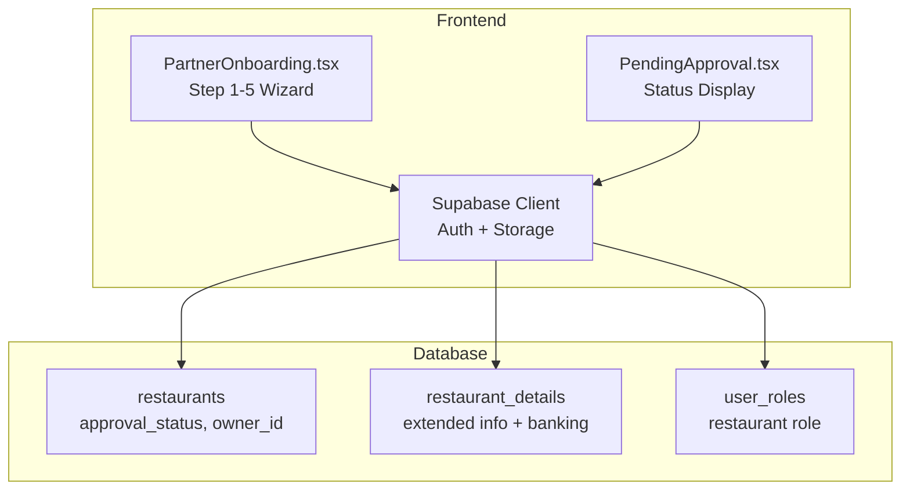
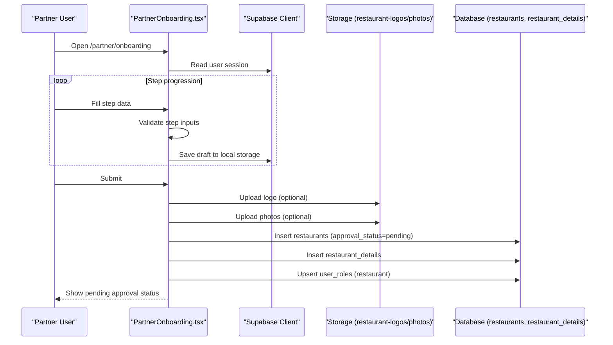
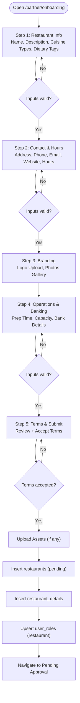
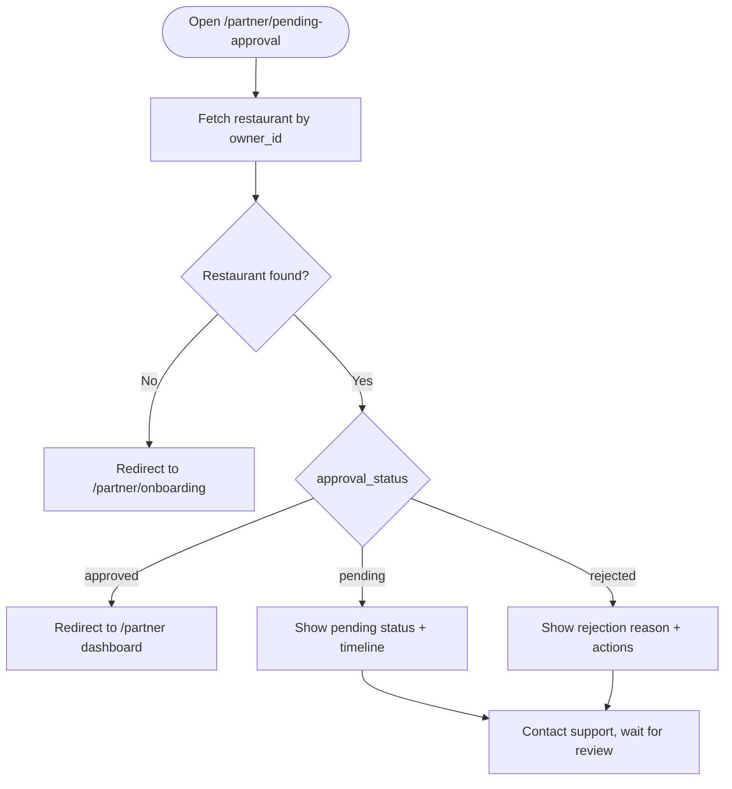
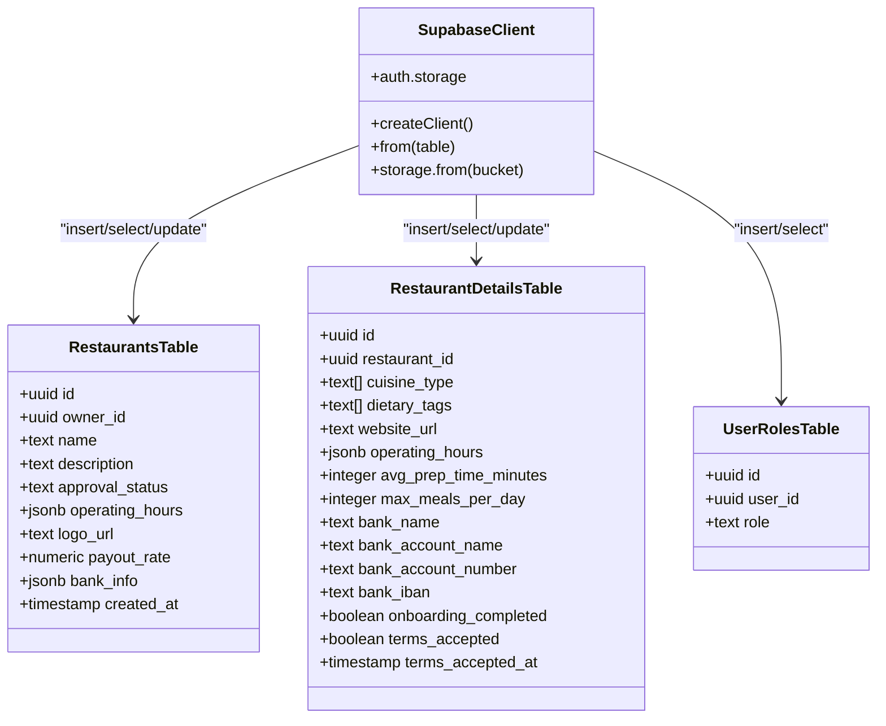
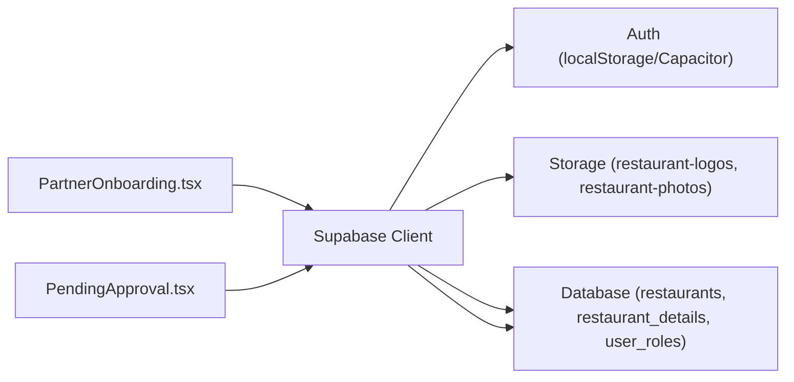

# Restaurant Onboarding

<cite>
**Referenced Files in This Document**
- [PartnerOnboarding.tsx](file://src/pages/partner/PartnerOnboarding.tsx)
- [PendingApproval.tsx](file://src/pages/partner/PendingApproval.tsx)
- [client.ts](file://src/integrations/supabase/client.ts)
- [types.ts](file://supabase/types.ts)
- [20260221150000_comprehensive_business_model_fix.sql](file://supabase/migrations/20260221150000_comprehensive_business_model_fix.sql)
- [20250219000006_sync_restaurant_columns.sql](file://supabase/migrations/20250219000006_sync_restaurant_columns.sql)
- [20260221000002_fix_restaurants_columns.sql](file://supabase/migrations/20260221000002_fix_restaurants_columns.sql)
- [partner-onboarding.spec.ts](file://e2e/cross-portal/partner-onboarding.spec.ts)
- [onboarding.spec.ts](file://e2e/partner/onboarding.spec.ts)
</cite>

## Table of Contents
1. [Introduction](#introduction)
2. [Project Structure](#project-structure)
3. [Core Components](#core-components)
4. [Architecture Overview](#architecture-overview)
5. [Detailed Component Analysis](#detailed-component-analysis)
6. [Dependency Analysis](#dependency-analysis)
7. [Performance Considerations](#performance-considerations)
8. [Troubleshooting Guide](#troubleshooting-guide)
9. [Conclusion](#conclusion)

## Introduction
This document describes the restaurant onboarding system in the partner portal. It covers the multi-step wizard process for collecting restaurant information, branding assets, operational details, and banking information. It explains validation requirements, progress saving, the pending approval status system, and communication workflows. It also documents the integration with Supabase authentication and database operations for storing restaurant information.

## Project Structure
The restaurant onboarding is implemented as a five-step wizard within the partner portal. The frontend components coordinate with Supabase for authentication and data persistence, while database migrations define the schema and policies.

**Diagram sources**
- [PartnerOnboarding.tsx:125-927](file://src/pages/partner/PartnerOnboarding.tsx#L125-L927)
- [PendingApproval.tsx:23-80](file://src/pages/partner/PendingApproval.tsx#L23-L80)
- [client.ts:47-57](file://src/integrations/supabase/client.ts#L47-L57)
- [20260221150000_comprehensive_business_model_fix.sql:46-129](file://supabase/migrations/20260221150000_comprehensive_business_model_fix.sql#L46-L129)

**Section sources**
- [PartnerOnboarding.tsx:107-113](file://src/pages/partner/PartnerOnboarding.tsx#L107-L113)
- [PendingApproval.tsx:23-80](file://src/pages/partner/PendingApproval.tsx#L23-L80)
- [client.ts:47-57](file://src/integrations/supabase/client.ts#L47-L57)

## Core Components
- PartnerOnboarding wizard: Collects restaurant information, branding, operations, and banking details; validates inputs; uploads media; submits application.
- PendingApproval page: Shows current approval status, timeline, and next steps.
- Supabase integration: Provides authentication, session persistence, and database/storage operations.
- Database schema: Defines restaurants and restaurant_details tables with approval lifecycle and RLS policies.

Key responsibilities:
- Step 1: Restaurant Info (name, description, cuisine types, dietary tags)
- Step 2: Contact & Hours (address, phone, email, website, operating hours)
- Step 3: Branding (logo upload, photo gallery)
- Step 4: Operations & Banking (prep time, capacity, bank details)
- Step 5: Terms & Submit (review and acceptance)

Validation highlights:
- Step 1: Name and description length, cuisine types required
- Step 2: Address and phone minimum lengths
- Step 4: Numeric fields > 0, bank details required
- Step 5: Terms acceptance required

Progress saving:
- Local storage persists current step and data during the wizard
- Auto-save draft with debounced updates
- Recovery dialog appears if a recent draft exists

Approval workflow:
- Submission sets approval_status to "pending"
- PendingApproval displays status and guidance
- Admin approval transitions to "approved"

**Section sources**
- [PartnerOnboarding.tsx:236-261](file://src/pages/partner/PartnerOnboarding.tsx#L236-L261)
- [PartnerOnboarding.tsx:263-385](file://src/pages/partner/PartnerOnboarding.tsx#L263-L385)
- [PendingApproval.tsx:36-80](file://src/pages/partner/PendingApproval.tsx#L36-L80)
- [20260221150000_comprehensive_business_model_fix.sql:46-129](file://supabase/migrations/20260221150000_comprehensive_business_model_fix.sql#L46-L129)

## Architecture Overview
The onboarding flow integrates frontend components with Supabase for authentication, storage, and database operations. The backend schema supports approval lifecycle and extended restaurant details.

**Diagram sources**
- [PartnerOnboarding.tsx:263-385](file://src/pages/partner/PartnerOnboarding.tsx#L263-L385)
- [client.ts:47-57](file://src/integrations/supabase/client.ts#L47-L57)
- [20260221150000_comprehensive_business_model_fix.sql:46-129](file://supabase/migrations/20260221150000_comprehensive_business_model_fix.sql#L46-L129)

## Detailed Component Analysis

### PartnerOnboarding Wizard
The wizard is a five-step form with validation and media upload capabilities. It manages state for all onboarding fields and coordinates submission.

**Diagram sources**
- [PartnerOnboarding.tsx:236-261](file://src/pages/partner/PartnerOnboarding.tsx#L236-L261)
- [PartnerOnboarding.tsx:263-385](file://src/pages/partner/PartnerOnboarding.tsx#L263-L385)
- [PartnerOnboarding.tsx:874-927](file://src/pages/partner/PartnerOnboarding.tsx#L874-L927)

Key implementation details:
- Step validation functions enforce required fields and numeric constraints
- Media upload handles file size limits and generates previews
- Submission writes to restaurants and restaurant_details tables
- Adds restaurant role to user_roles

**Section sources**
- [PartnerOnboarding.tsx:236-261](file://src/pages/partner/PartnerOnboarding.tsx#L236-L261)
- [PartnerOnboarding.tsx:263-385](file://src/pages/partner/PartnerOnboarding.tsx#L263-L385)
- [PartnerOnboarding.tsx:874-927](file://src/pages/partner/PartnerOnboarding.tsx#L874-L927)

### Pending Approval Page
Displays the current approval status, timeline, and next steps. Handles navigation and sign-out.

**Diagram sources**
- [PendingApproval.tsx:36-80](file://src/pages/partner/PendingApproval.tsx#L36-L80)

**Section sources**
- [PendingApproval.tsx:36-80](file://src/pages/partner/PendingApproval.tsx#L36-L80)

### Supabase Integration
Authentication and session persistence are configured with a custom storage adapter for native environments. Database types and migrations define the schema and policies.

**Diagram sources**
- [client.ts:47-57](file://src/integrations/supabase/client.ts#L47-L57)
- [types.ts:1-3331](file://supabase/types.ts#L1-L3331)
- [20260221150000_comprehensive_business_model_fix.sql:46-129](file://supabase/migrations/20260221150000_comprehensive_business_model_fix.sql#L46-L129)

**Section sources**
- [client.ts:47-57](file://src/integrations/supabase/client.ts#L47-L57)
- [types.ts:1-3331](file://supabase/types.ts#L1-L3331)
- [20260221150000_comprehensive_business_model_fix.sql:46-129](file://supabase/migrations/20260221150000_comprehensive_business_model_fix.sql#L46-L129)

## Dependency Analysis
The onboarding wizard depends on Supabase for authentication, storage, and database operations. The database schema defines the approval lifecycle and extended restaurant details.

**Diagram sources**
- [PartnerOnboarding.tsx:263-385](file://src/pages/partner/PartnerOnboarding.tsx#L263-L385)
- [PendingApproval.tsx:36-80](file://src/pages/partner/PendingApproval.tsx#L36-L80)
- [client.ts:47-57](file://src/integrations/supabase/client.ts#L47-L57)

**Section sources**
- [PartnerOnboarding.tsx:263-385](file://src/pages/partner/PartnerOnboarding.tsx#L263-L385)
- [PendingApproval.tsx:36-80](file://src/pages/partner/PendingApproval.tsx#L36-L80)
- [client.ts:47-57](file://src/integrations/supabase/client.ts#L47-L57)

## Performance Considerations
- Debounced auto-save reduces write frequency to local storage during onboarding.
- File uploads use small, validated previews to minimize network overhead.
- Database writes are batched per step to avoid unnecessary transactions.
- RLS policies ensure efficient row filtering for restaurant details.

## Troubleshooting Guide
Common issues and resolutions:
- Missing environment variables: Ensure Supabase URL and publishable key are configured; otherwise, initialization logs an error.
- File size exceeded: Logo and photo uploads reject files larger than the configured limit; reduce file size or resolution.
- Validation failures: Steps require specific minimum lengths and numeric ranges; correct inputs before proceeding.
- Approval status not updating: Confirm restaurants table has approval_status column and user_roles includes restaurant role after submission.
- Pending status page shows error: Verify the restaurant record exists for the current user and approval_status is populated.

Practical examples:
- Successful onboarding: After submission, approval_status transitions to "pending" and user receives a toast notification.
- Rejected application: PendingApproval displays rejection reason and provides contact support options.
- Resuming onboarding: Auto-saved drafts appear in a recovery dialog if a recent draft exists.

**Section sources**
- [client.ts:10-16](file://src/integrations/supabase/client.ts#L10-L16)
- [PartnerOnboarding.tsx:190-234](file://src/pages/partner/PartnerOnboarding.tsx#L190-L234)
- [PartnerOnboarding.tsx:369-385](file://src/pages/partner/PartnerOnboarding.tsx#L369-L385)
- [PendingApproval.tsx:70-80](file://src/pages/partner/PendingApproval.tsx#L70-L80)
- [20250219000006_sync_restaurant_columns.sql:1-83](file://supabase/migrations/20250219000006_sync_restaurant_columns.sql#L1-L83)
- [20260221000002_fix_restaurants_columns.sql:1-36](file://supabase/migrations/20260221000002_fix_restaurants_columns.sql#L1-L36)

## Conclusion
The restaurant onboarding system provides a structured, validated, and resilient five-step wizard integrated with Supabase authentication and database operations. It supports progress saving, media uploads, and a clear pending approval workflow with status communication. The schema and policies ensure secure and scalable data management for restaurant profiles and extended details.