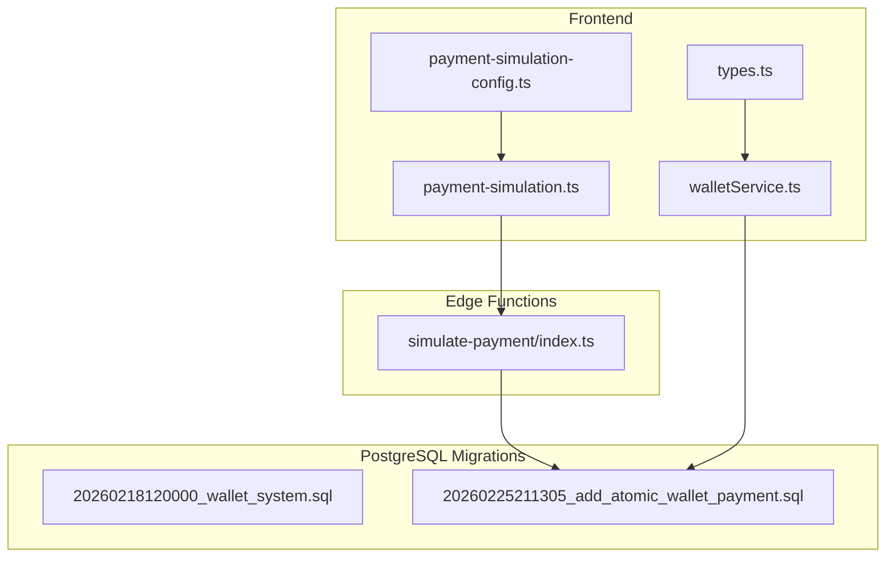
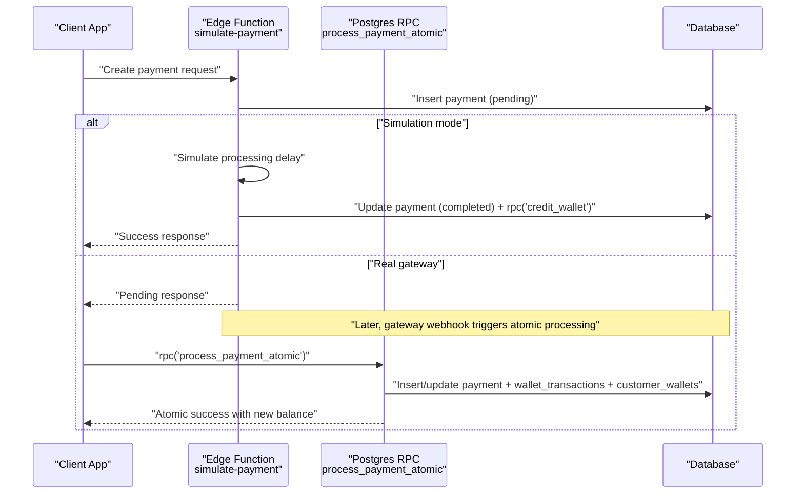
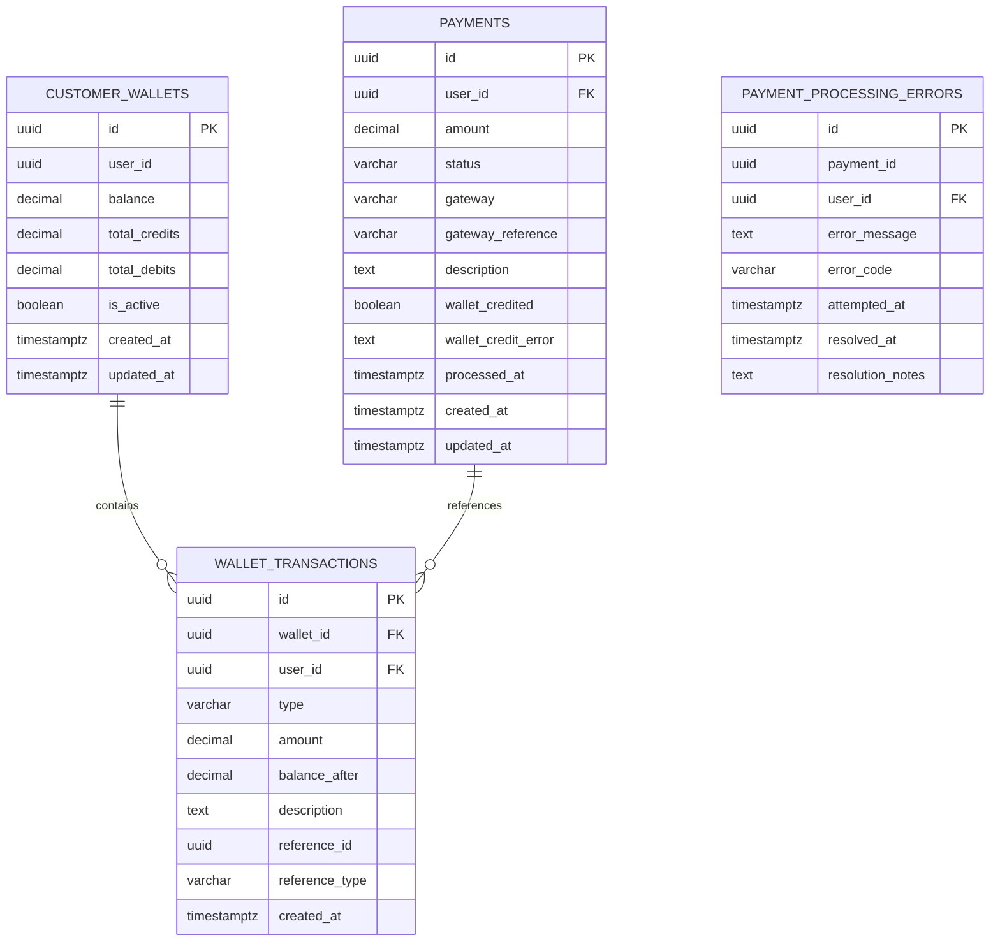
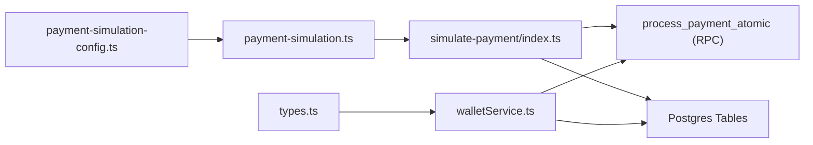

# Backend Edge Functions

<cite>
**Referenced Files in This Document**
- [PHASE2_EDGE_FUNCTIONS.md](file://supabase/functions/PHASE2_EDGE_FUNCTIONS.md)
- [simulate-payment/index.ts](file://supabase/functions/simulate-payment/index.ts)
- [20260225211305_add_atomic_wallet_payment.sql](file://supabase/migrations/20260225211305_add_atomic_wallet_payment.sql)
- [20260218120000_wallet_system.sql](file://supabase/migrations/20260218120000_wallet_system.sql)
- [payment-simulation.ts](file://src/lib/payment-simulation.ts)
- [payment-simulation-config.ts](file://src/lib/payment-simulation-config.ts)
- [walletService.ts](file://src/services/walletService.ts)
- [types.ts](file://src/integrations/supabase/types.ts)
</cite>

## Table of Contents
1. [Introduction](#introduction)
2. [Project Structure](#project-structure)
3. [Core Components](#core-components)
4. [Architecture Overview](#architecture-overview)
5. [Detailed Component Analysis](#detailed-component-analysis)
6. [Dependency Analysis](#dependency-analysis)
7. [Performance Considerations](#performance-considerations)
8. [Troubleshooting Guide](#troubleshooting-guide)
9. [Conclusion](#conclusion)
10. [Appendices](#appendices)

## Introduction
This document describes the backend edge function implementation for server-side payment processing, transaction record creation, and wallet crediting within the Nutrio Fuel platform. It covers:
- Edge function architecture and Supabase integration patterns
- Database interaction methods and atomicity guarantees
- Payment record lifecycle and error handling strategies
- Transaction rollback and reconciliation procedures
- Function deployment, environment configuration, and frontend integration
- Security considerations, rate limiting, and monitoring approaches

## Project Structure
The backend edge functions and supporting infrastructure are organized across Supabase edge functions, PostgreSQL migrations, and frontend integration utilities:
- Edge functions: Supabase Edge Functions runtime (Deno) for payment simulation and orchestration
- Database: PostgreSQL migrations defining wallet, payment, and error-handling schemas
- Frontend: Payment simulation utilities and wallet top-up orchestration service
- Types: Supabase-generated TypeScript types for database entities

**Diagram sources**
- [simulate-payment/index.ts:1-119](file://supabase/functions/simulate-payment/index.ts#L1-L119)
- [20260218120000_wallet_system.sql:59-270](file://supabase/migrations/20260218120000_wallet_system.sql#L59-L270)
- [20260225211305_add_atomic_wallet_payment.sql:1-399](file://supabase/migrations/20260225211305_add_atomic_wallet_payment.sql#L1-L399)
- [payment-simulation.ts:1-223](file://src/lib/payment-simulation.ts#L1-L223)
- [payment-simulation-config.ts:1-79](file://src/lib/payment-simulation-config.ts#L1-L79)
- [walletService.ts:1-180](file://src/services/walletService.ts#L1-L180)
- [types.ts:6716-6804](file://src/integrations/supabase/types.ts#L6716-L6804)

**Section sources**
- [PHASE2_EDGE_FUNCTIONS.md:1-411](file://supabase/functions/PHASE2_EDGE_FUNCTIONS.md#L1-L411)
- [simulate-payment/index.ts:1-119](file://supabase/functions/simulate-payment/index.ts#L1-L119)
- [20260225211305_add_atomic_wallet_payment.sql:1-399](file://supabase/migrations/20260225211305_add_atomic_wallet_payment.sql#L1-L399)
- [20260218120000_wallet_system.sql:59-270](file://supabase/migrations/20260218120000_wallet_system.sql#L59-L270)
- [payment-simulation.ts:1-223](file://src/lib/payment-simulation.ts#L1-L223)
- [payment-simulation-config.ts:1-79](file://src/lib/payment-simulation-config.ts#L1-L79)
- [walletService.ts:1-180](file://src/services/walletService.ts#L1-L180)
- [types.ts:6716-6804](file://src/integrations/supabase/types.ts#L6716-L6804)

## Core Components
- Edge function: simulate-payment
  - Accepts payment requests, creates a pending payment record, optionally simulates completion/failure, and credits the wallet atomically via a Postgres RPC
- Postgres RPC: process_payment_atomic
  - Ensures atomic payment completion and wallet crediting with row-level locks, idempotency, and error logging
- Frontend integration: PaymentSimulationService and walletService
  - Provides configurable payment simulation and orchestrates wallet top-ups with invoice generation and optional email dispatch

Key capabilities:
- Atomicity: Single transaction ensures payment and wallet update succeed or fail together
- Idempotency: Repeated invocations return success if already processed
- Error handling: Dedicated error logging table and automatic retry function
- Orchestration: Frontend services coordinate invoice creation and email delivery

**Section sources**
- [simulate-payment/index.ts:1-119](file://supabase/functions/simulate-payment/index.ts#L1-L119)
- [20260225211305_add_atomic_wallet_payment.sql:16-190](file://supabase/migrations/20260225211305_add_atomic_wallet_payment.sql#L16-L190)
- [walletService.ts:13-137](file://src/services/walletService.ts#L13-L137)
- [payment-simulation.ts:25-212](file://src/lib/payment-simulation.ts#L25-L212)

## Architecture Overview
The system integrates edge functions, Postgres functions, and frontend services to deliver robust payment and wallet operations.

**Diagram sources**
- [simulate-payment/index.ts:28-101](file://supabase/functions/simulate-payment/index.ts#L28-L101)
- [20260225211305_add_atomic_wallet_payment.sql:16-190](file://supabase/migrations/20260225211305_add_atomic_wallet_payment.sql#L16-L190)

## Detailed Component Analysis

### Edge Function: simulate-payment
Responsibilities:
- Parse incoming request and initialize Supabase client using environment variables
- Create a payment record in pending state
- In simulation mode:
  - Introduce artificial delay
  - Randomly succeed or fail (95% success rate by default)
  - On success: update payment to completed and credit wallet via rpc('credit_wallet')
  - On failure: mark payment as failed with gateway response
- Return structured JSON responses with appropriate HTTP status codes

Security and CORS:
- Supports preflight OPTIONS requests
- Uses Supabase service role key for privileged operations

Deployment and invocation:
- Deployed via Supabase CLI
- Invoked via Supabase functions client or direct HTTP POST

Operational notes:
- Uses environment variables for SUPABASE_URL and SUPABASE_SERVICE_ROLE_KEY
- Supports both simulation and real gateway modes

**Section sources**
- [simulate-payment/index.ts:1-119](file://supabase/functions/simulate-payment/index.ts#L1-L119)
- [PHASE2_EDGE_FUNCTIONS.md:175-221](file://supabase/functions/PHASE2_EDGE_FUNCTIONS.md#L175-L221)

### Postgres RPC: process_payment_atomic
Responsibilities:
- Atomic payment completion and wallet crediting within a single transaction
- Row-level locking prevents race conditions and double-spending
- Idempotent behavior: returns success if already processed
- Comprehensive error logging and optional automatic retry

Processing logic:
- Validates existing payment state and processing status
- Locks customer wallet row for exclusive access
- Inserts or updates payment record with wallet_credited flag and timestamps
- Creates wallet transaction record and updates wallet balance
- On exception: logs error, marks payment as failed, and returns error payload

Error handling and reconciliation:
- Dedicated payment_processing_errors table with RLS policy
- retry_failed_payment function to reattempt failed payments
- reconcile_wallet_credits admin function to fix orphaned credits
- auto_retry_failed_payments background job to process retries periodically

Indexes and policies:
- Indexes on wallet_credited and payment error tables
- Row-level security policies for data isolation

**Section sources**
- [20260225211305_add_atomic_wallet_payment.sql:6-14](file://supabase/migrations/20260225211305_add_atomic_wallet_payment.sql#L6-L14)
- [20260225211305_add_atomic_wallet_payment.sql:16-190](file://supabase/migrations/20260225211305_add_atomic_wallet_payment.sql#L16-L190)
- [20260225211305_add_atomic_wallet_payment.sql:201-285](file://supabase/migrations/20260225211305_add_atomic_wallet_payment.sql#L201-L285)
- [20260225211305_add_atomic_wallet_payment.sql:287-399](file://supabase/migrations/20260225211305_add_atomic_wallet_payment.sql#L287-L399)

### Frontend Integration: PaymentSimulationService and walletService
PaymentSimulationService:
- Simulates payment lifecycle: create, 3D Secure (optional), process
- Configurable success rate, delays, and 3D Secure behavior
- Publishes status updates to subscribers
- Provides presets for testing different scenarios

walletService:
- Orchestrates wallet top-ups using rpc('credit_wallet')
- Creates invoices, generates PDFs, and optionally emails them
- Handles partial failures gracefully (credits wallet even if email fails)

Types and schemas:
- Supabase-generated types define wallet_topup_packages and wallet_transactions structures
- Migrations define indexes, RLS policies, and wallet-related tables

**Section sources**
- [payment-simulation.ts:25-212](file://src/lib/payment-simulation.ts#L25-L212)
- [payment-simulation-config.ts:23-38](file://src/lib/payment-simulation-config.ts#L23-L38)
- [walletService.ts:13-137](file://src/services/walletService.ts#L13-L137)
- [types.ts:6716-6804](file://src/integrations/supabase/types.ts#L6716-L6804)
- [20260218120000_wallet_system.sql:59-270](file://supabase/migrations/20260218120000_wallet_system.sql#L59-L270)

### Database Schema and Relationships

**Diagram sources**
- [20260225211305_add_atomic_wallet_payment.sql:16-190](file://supabase/migrations/20260225211305_add_atomic_wallet_payment.sql#L16-L190)
- [20260225211305_add_atomic_wallet_payment.sql:201-230](file://supabase/migrations/20260225211305_add_atomic_wallet_payment.sql#L201-L230)
- [20260218120000_wallet_system.sql:59-270](file://supabase/migrations/20260218120000_wallet_system.sql#L59-L270)

## Dependency Analysis
- Edge function depends on:
  - Supabase client initialization via environment variables
  - Postgres RPC 'credit_wallet' for wallet crediting
  - Optional 'process_payment_atomic' for atomic processing in real gateway flows
- Frontend services depend on:
  - Supabase client for RPC calls and table operations
  - Generated types for type safety
  - Optional email service for invoice delivery

**Diagram sources**
- [simulate-payment/index.ts:23-72](file://supabase/functions/simulate-payment/index.ts#L23-L72)
- [20260225211305_add_atomic_wallet_payment.sql:16-190](file://supabase/migrations/20260225211305_add_atomic_wallet_payment.sql#L16-L190)
- [walletService.ts:13-44](file://src/services/walletService.ts#L13-L44)
- [payment-simulation.ts:25-67](file://src/lib/payment-simulation.ts#L25-L67)
- [payment-simulation-config.ts:23-38](file://src/lib/payment-simulation-config.ts#L23-L38)
- [types.ts:6716-6804](file://src/integrations/supabase/types.ts#L6716-L6804)

**Section sources**
- [simulate-payment/index.ts:1-119](file://supabase/functions/simulate-payment/index.ts#L1-L119)
- [20260225211305_add_atomic_wallet_payment.sql:16-190](file://supabase/migrations/20260225211305_add_atomic_wallet_payment.sql#L16-L190)
- [walletService.ts:13-137](file://src/services/walletService.ts#L13-L137)
- [payment-simulation.ts:25-212](file://src/lib/payment-simulation.ts#L25-L212)
- [payment-simulation-config.ts:23-38](file://src/lib/payment-simulation-config.ts#L23-L38)
- [types.ts:6716-6804](file://src/integrations/supabase/types.ts#L6716-L6804)

## Performance Considerations
- Atomic operations: process_payment_atomic minimizes contention and avoids partial writes
- Indexing: Indexes on wallet_credited and payment error tables improve query performance for retries and reconciliation
- Concurrency control: FOR UPDATE SKIP LOCKED and explicit row-level locks reduce deadlocks and race conditions
- Background jobs: auto_retry_failed_payments processes retries in batches to avoid overload
- Frontend simulation: Configurable delays and success rates help validate performance under stress

[No sources needed since this section provides general guidance]

## Troubleshooting Guide
Common issues and resolutions:
- Function deployment failures:
  - Ensure Supabase CLI is up to date and linked to the correct project
  - Validate TypeScript syntax and required environment variables
- Environment variables not applied:
  - Confirm secrets are set and function restarted
  - Verify exact variable names and values
- Database connectivity errors:
  - Check SUPABASE_URL correctness and service role key permissions
  - Ensure RLS policies permit service role access
- Email delivery problems:
  - Validate API keys and recipient addresses
  - Inspect email_logs for detailed error messages
- Payment not credited:
  - Use retry_failed_payment RPC to reattempt
  - Run reconcile_wallet_credits to fix orphaned credits
  - Monitor payment_processing_errors for root causes

Monitoring and logs:
- View function logs in real-time or retrieve recent logs
- Track auto-retry runs via auto_retry_logs
- Audit wallet transactions and payment states using indexes and policies

**Section sources**
- [PHASE2_EDGE_FUNCTIONS.md:380-411](file://supabase/functions/PHASE2_EDGE_FUNCTIONS.md#L380-L411)
- [20260225211305_add_atomic_wallet_payment.sql:201-285](file://supabase/migrations/20260225211305_add_atomic_wallet_payment.sql#L201-L285)
- [20260225211305_add_atomic_wallet_payment.sql:389-399](file://supabase/migrations/20260225211305_add_atomic_wallet_payment.sql#L389-L399)

## Conclusion
The backend edge function implementation provides a robust, atomic, and observable payment and wallet system. Edge functions handle simulation and orchestration, while Postgres RPCs guarantee atomicity and resilience. Frontend services offer flexible simulation and seamless wallet top-ups with invoicing. Together, these components form a scalable foundation for server-side payment processing with strong error handling, monitoring, and recovery mechanisms.

[No sources needed since this section summarizes without analyzing specific files]

## Appendices

### Environment Variables
- SUPABASE_URL: Supabase project URL
- SUPABASE_SERVICE_ROLE_KEY: Service role key for privileged database access
- RESEND_API_KEY: Optional, for invoice email delivery

**Section sources**
- [PHASE2_EDGE_FUNCTIONS.md:10-31](file://supabase/functions/PHASE2_EDGE_FUNCTIONS.md#L10-L31)
- [simulate-payment/index.ts:23-26](file://supabase/functions/simulate-payment/index.ts#L23-L26)

### Deployment and Invocation
- Deploy functions via Supabase CLI
- Invoke functions using Supabase functions client or direct HTTP requests
- Configure frontend to use PaymentSimulationService for local development and walletService for production flows

**Section sources**
- [PHASE2_EDGE_FUNCTIONS.md:175-254](file://supabase/functions/PHASE2_EDGE_FUNCTIONS.md#L175-L254)
- [payment-simulation.ts:25-67](file://src/lib/payment-simulation.ts#L25-L67)
- [walletService.ts:13-44](file://src/services/walletService.ts#L13-L44)

### Security and Rate Limiting
- Service role key enables database operations bypassing RLS
- JWT verification recommended for function calls
- Input validation and parameterized queries protect against injection
- CORS headers configured for browser access
- Rate limiting respected for external services (e.g., email provider)

**Section sources**
- [PHASE2_EDGE_FUNCTIONS.md:354-361](file://supabase/functions/PHASE2_EDGE_FUNCTIONS.md#L354-L361)
- [simulate-payment/index.ts:4-7](file://supabase/functions/simulate-payment/index.ts#L4-L7)