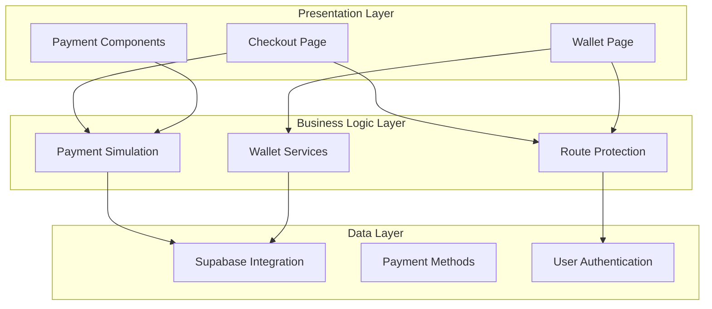
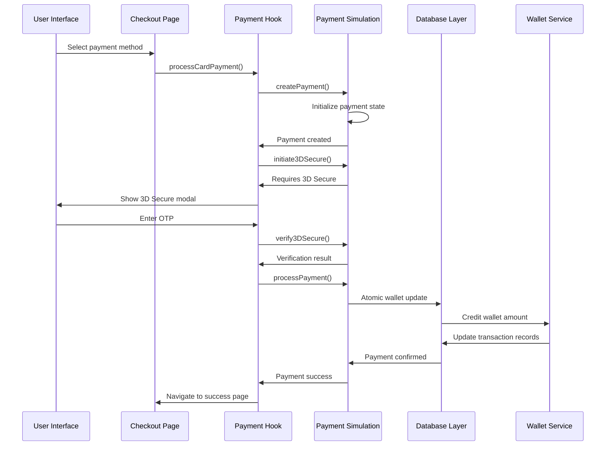
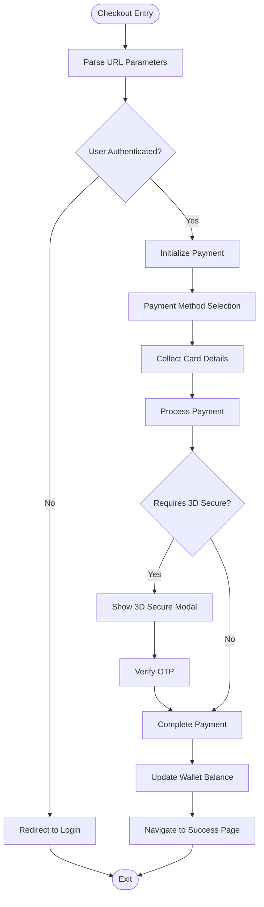
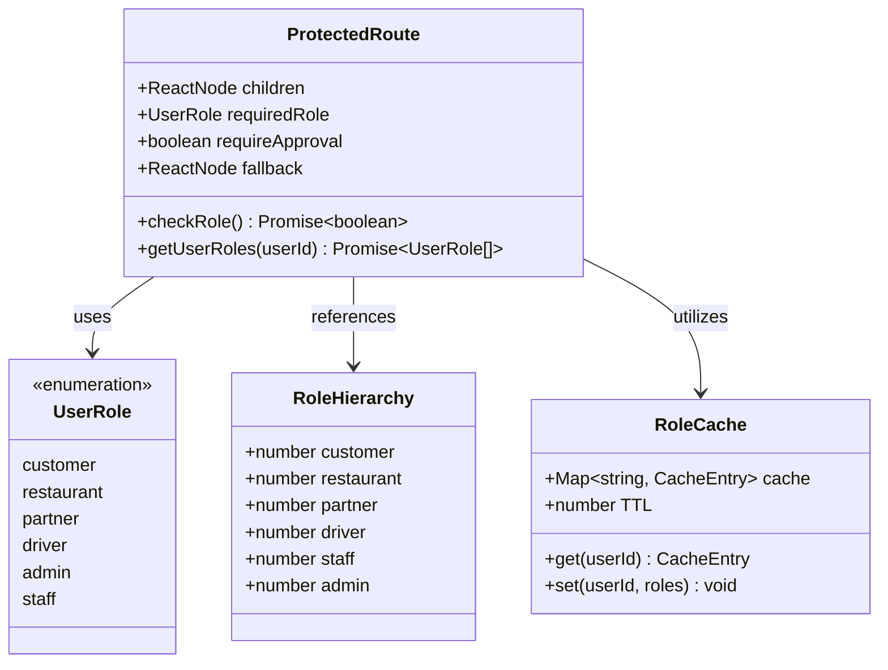
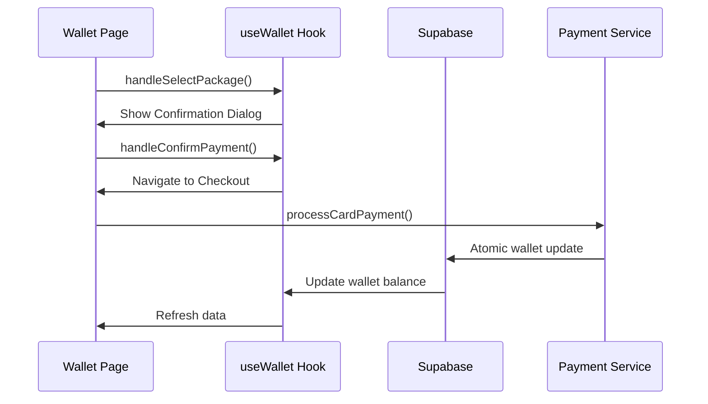
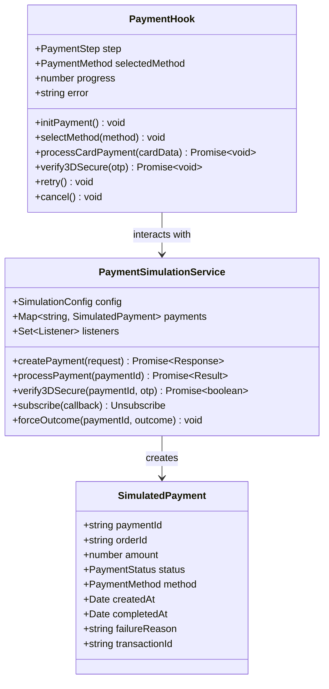
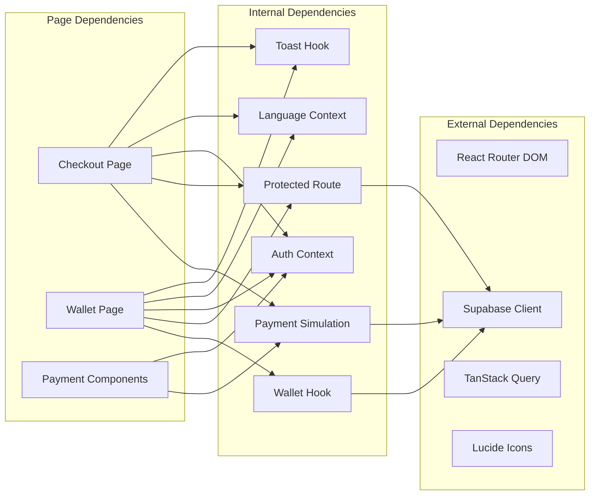

# Checkout Integration

<cite>
**Referenced Files in This Document**
- [Checkout.tsx](file://src/pages/Checkout.tsx)
- [Wallet.tsx](file://src/pages/Wallet.tsx)
- [ProtectedRoute.tsx](file://src/components/ProtectedRoute.tsx)
- [App.tsx](file://src/App.tsx)
- [useSimulatedPayment.ts](file://src/hooks/useSimulatedPayment.ts)
- [payment-simulation.ts](file://src/lib/payment-simulation.ts)
- [payment-simulation-config.ts](file://src/lib/payment-simulation-config.ts)
- [walletService.ts](file://src/services/walletService.ts)
- [useWallet.ts](file://src/hooks/useWallet.ts)
- [PaymentMethodSelector.tsx](file://src/components/payment/PaymentMethodSelector.tsx)
- [SimulatedCardForm.tsx](file://src/components/payment/SimulatedCardForm.tsx)
- [PaymentProcessingModal.tsx](file://src/components/payment/PaymentProcessingModal.tsx)
- [Simulated3DSecure.tsx](file://src/components/payment/Simulated3DSecure.tsx)
</cite>

## Table of Contents
1. [Introduction](#introduction)
2. [Project Structure](#project-structure)
3. [Core Components](#core-components)
4. [Architecture Overview](#architecture-overview)
5. [Detailed Component Analysis](#detailed-component-analysis)
6. [Dependency Analysis](#dependency-analysis)
7. [Performance Considerations](#performance-considerations)
8. [Troubleshooting Guide](#troubleshooting-guide)
9. [Conclusion](#conclusion)

## Introduction

The checkout integration system provides a comprehensive payment processing solution for the Nutrio customer portal, enabling seamless wallet top-ups, subscription purchases, and order checkout experiences. This system integrates advanced route protection mechanisms, sophisticated payment simulation frameworks, and intuitive user interface components to deliver a robust and secure payment experience.

The system supports multiple payment methods including credit cards, debit cards, Sadad payments, Apple Pay, and Google Pay, with comprehensive 3D Secure authentication capabilities. It features atomic payment processing for wallet top-ups, real-time payment status updates, and comprehensive error handling mechanisms.

## Project Structure

The checkout integration system is organized around several key architectural layers:

**Diagram sources**
- [Checkout.tsx:1-288](file://src/pages/Checkout.tsx#L1-L288)
- [Wallet.tsx:1-221](file://src/pages/Wallet.tsx#L1-L221)
- [ProtectedRoute.tsx:1-264](file://src/components/ProtectedRoute.tsx#L1-L264)

**Section sources**
- [Checkout.tsx:1-288](file://src/pages/Checkout.tsx#L1-L288)
- [Wallet.tsx:1-221](file://src/pages/Wallet.tsx#L1-L221)
- [ProtectedRoute.tsx:1-264](file://src/components/ProtectedRoute.tsx#L1-L264)

## Core Components

### Payment Simulation Framework

The payment simulation system provides a comprehensive testing and demonstration environment for payment processing without requiring actual payment gateways. The framework consists of three primary components:

**Payment Simulation Service**: Manages payment lifecycle, status tracking, and real-time updates through WebSocket-like subscriptions. It simulates various payment scenarios including success, failure, and 3D Secure verification processes.

**Payment Hook**: Provides a reactive interface for payment processing with state management, progress tracking, and error handling. The hook manages the complete payment flow from initiation to completion.

**Configuration System**: Defines payment method capabilities, success rates, and simulation parameters. Supports multiple payment methods with configurable behavior for different testing scenarios.

### Route Protection System

The protected route implementation ensures secure access to payment functionality through comprehensive authentication and authorization mechanisms:

**Authentication Layer**: Integrates with Supabase authentication to verify user identity and session validity.

**Authorization Engine**: Implements role-based access control with hierarchical permissions for different user types (customer, partner, admin, driver).

**Permission Caching**: Optimizes role checking performance through intelligent caching mechanisms to prevent repeated database queries.

### Wallet Management Integration

The wallet system provides seamless integration between payment processing and account management:

**Atomic Operations**: Ensures payment processing and wallet crediting occur as single, indivisible transactions to maintain data consistency.

**Transaction Tracking**: Maintains comprehensive records of all wallet transactions including top-ups, debits, refunds, and bonuses.

**Real-time Updates**: Provides live synchronization of wallet balances and transaction history through Supabase real-time capabilities.

**Section sources**
- [useSimulatedPayment.ts:1-189](file://src/hooks/useSimulatedPayment.ts#L1-L189)
- [payment-simulation.ts:1-223](file://src/lib/payment-simulation.ts#L1-L223)
- [payment-simulation-config.ts:1-79](file://src/lib/payment-simulation-config.ts#L1-L79)
- [ProtectedRoute.tsx:1-264](file://src/components/ProtectedRoute.tsx#L1-L264)
- [walletService.ts:1-180](file://src/services/walletService.ts#L1-L180)

## Architecture Overview

The checkout integration system follows a layered architecture pattern with clear separation of concerns:

**Diagram sources**
- [Checkout.tsx:32-78](file://src/pages/Checkout.tsx#L32-L78)
- [useSimulatedPayment.ts:84-132](file://src/hooks/useSimulatedPayment.ts#L84-L132)
- [payment-simulation.ts:108-140](file://src/lib/payment-simulation.ts#L108-L140)
- [walletService.ts:13-50](file://src/services/walletService.ts#L13-L50)

The architecture ensures loose coupling between components while maintaining strong data integrity through atomic operations and comprehensive error handling.

## Detailed Component Analysis

### Checkout Page Implementation

The checkout page serves as the central hub for all payment processing activities, supporting three distinct payment types:

**Parameter Handling**: The system parses URL parameters to determine payment context, amount, type (wallet, subscription, order), and associated package information. This flexible approach enables seamless navigation from various application contexts.

**Payment Flow Orchestration**: Implements a comprehensive payment workflow that handles method selection, card details collection, 3D Secure verification, and transaction completion. The flow adapts based on payment method capabilities and success/failure scenarios.

**Atomic Payment Processing**: For wallet top-ups, the system utilizes Supabase RPC functions to ensure atomic operations that credit wallet amounts and update transaction records in a single, indivisible process.

**Diagram sources**
- [Checkout.tsx:24-78](file://src/pages/Checkout.tsx#L24-L78)
- [useSimulatedPayment.ts:73-132](file://src/hooks/useSimulatedPayment.ts#L73-L132)

**Section sources**
- [Checkout.tsx:17-104](file://src/pages/Checkout.tsx#L17-L104)
- [Checkout.tsx:131-287](file://src/pages/Checkout.tsx#L131-L287)

### Route Protection Implementation

The protected route system provides comprehensive security for payment functionality:

**Authentication Requirements**: Ensures users are properly authenticated before accessing payment pages. The system redirects unauthenticated users to the login page while preserving their intended destination.

**Authorization Logic**: Implements role-based access control with hierarchical permissions. Different user types (customers, partners, admins, drivers) have appropriate access levels to payment functionality.

**Approval Checking**: For partner-specific routes, the system verifies business approval status before granting access to payment-related functionality.

**Caching Mechanism**: Optimizes performance by caching role checks to minimize database queries and improve response times.

**Diagram sources**
- [ProtectedRoute.tsx:26-35](file://src/components/ProtectedRoute.tsx#L26-L35)
- [ProtectedRoute.tsx:103-119](file://src/components/ProtectedRoute.tsx#L103-L119)
- [ProtectedRoute.tsx:33-35](file://src/components/ProtectedRoute.tsx#L33-L35)

**Section sources**
- [ProtectedRoute.tsx:139-230](file://src/components/ProtectedRoute.tsx#L139-L230)
- [App.tsx:292-298](file://src/App.tsx#L292-L298)

### Wallet Management Integration

The wallet system provides comprehensive account management functionality integrated with payment processing:

**Atomic Operations**: Uses Supabase RPC functions to ensure wallet crediting occurs atomically with transaction recording, preventing data inconsistencies.

**Real-time Synchronization**: Leverages Supabase real-time capabilities to provide instant updates to wallet balances and transaction history across all user sessions.

**Transaction Tracking**: Maintains detailed records of all wallet transactions including top-ups, debits, refunds, bonuses, and cashback rewards.

**Package Management**: Supports predefined top-up packages with bonus calculations and promotional offers.

**Diagram sources**
- [Wallet.tsx:80-90](file://src/pages/Wallet.tsx#L80-L90)
- [useWallet.ts:137-167](file://src/hooks/useWallet.ts#L137-L167)
- [walletService.ts:13-50](file://src/services/walletService.ts#L13-L50)

**Section sources**
- [Wallet.tsx:31-95](file://src/pages/Wallet.tsx#L31-L95)
- [useWallet.ts:56-208](file://src/hooks/useWallet.ts#L56-L208)
- [walletService.ts:13-137](file://src/services/walletService.ts#L13-L137)

### Payment Simulation Framework

The payment simulation system provides a comprehensive testing and demonstration environment:

**Multi-method Support**: Handles various payment methods including credit cards, debit cards, Sadad payments, Apple Pay, and Google Pay with method-specific behaviors.

**3D Secure Simulation**: Provides realistic 3D Secure authentication simulation with OTP verification and timeout handling.

**Configurable Scenarios**: Supports multiple simulation presets for different testing scenarios including success, failure, slow network, and flaky network conditions.

**Real-time Updates**: Implements WebSocket-like real-time updates for payment status changes and progress tracking.

**Diagram sources**
- [payment-simulation.ts:25-32](file://src/lib/payment-simulation.ts#L25-L32)
- [payment-simulation.ts:108-140](file://src/lib/payment-simulation.ts#L108-L140)
- [useSimulatedPayment.ts:22-27](file://src/hooks/useSimulatedPayment.ts#L22-L27)

**Section sources**
- [payment-simulation.ts:25-223](file://src/lib/payment-simulation.ts#L25-L223)
- [useSimulatedPayment.ts:1-189](file://src/hooks/useSimulatedPayment.ts#L1-L189)
- [payment-simulation-config.ts:1-79](file://src/lib/payment-simulation-config.ts#L1-L79)

### UI Component Integration

The checkout system integrates numerous specialized UI components for optimal user experience:

**Payment Method Selector**: Provides intuitive selection of payment methods with visual indicators and popular method highlighting.

**Card Form Simulation**: Offers realistic card input forms with automatic formatting for card numbers, expiry dates, and CVV codes.

**Processing Modals**: Displays comprehensive payment progress with security badges, progress bars, and real-time status updates.

**3D Secure Verification**: Implements secure OTP entry with countdown timers and validation feedback.

**Section sources**
- [PaymentMethodSelector.tsx:1-107](file://src/components/payment/PaymentMethodSelector.tsx#L1-L107)
- [SimulatedCardForm.tsx:1-144](file://src/components/payment/SimulatedCardForm.tsx#L1-L144)
- [PaymentProcessingModal.tsx:1-80](file://src/components/payment/PaymentProcessingModal.tsx#L1-L80)
- [Simulated3DSecure.tsx:1-105](file://src/components/payment/Simulated3DSecure.tsx#L1-L105)

## Dependency Analysis

The checkout integration system exhibits well-structured dependencies with clear separation of concerns:

**Diagram sources**
- [Checkout.tsx:1-15](file://src/pages/Checkout.tsx#L1-L15)
- [Wallet.tsx:1-29](file://src/pages/Wallet.tsx#L1-L29)
- [ProtectedRoute.tsx:1-6](file://src/components/ProtectedRoute.tsx#L1-L6)

The dependency graph reveals a clean architecture where presentation components depend on business logic hooks, which in turn depend on service layers and external integrations. This structure facilitates testing, maintenance, and future enhancements.

**Section sources**
- [App.tsx:1-739](file://src/App.tsx#L1-L739)
- [Checkout.tsx:1-288](file://src/pages/Checkout.tsx#L1-L288)
- [Wallet.tsx:1-221](file://src/pages/Wallet.tsx#L1-L221)

## Performance Considerations

The checkout integration system incorporates several performance optimization strategies:

**Lazy Loading**: Non-critical components are lazily loaded to reduce initial bundle size and improve application startup performance.

**Caching Mechanisms**: Role checking results are cached to minimize database queries and improve response times for authenticated requests.

**Efficient State Management**: Payment state is managed reactively using custom hooks to optimize rendering and prevent unnecessary re-renders.

**Real-time Updates**: Supabase real-time subscriptions provide efficient data synchronization without constant polling.

**Memory Management**: Payment simulation service implements proper cleanup of event listeners and subscriptions to prevent memory leaks.

## Troubleshooting Guide

Common issues and their resolutions:

**Payment Processing Failures**: The system provides comprehensive error handling with user-friendly error messages and retry mechanisms. Check payment simulation configuration and network connectivity.

**Authentication Issues**: Protected routes automatically redirect unauthenticated users to login. Verify authentication state and session validity.

**Wallet Update Failures**: Atomic operations ensure data consistency. Monitor Supabase RPC function responses and transaction logs for debugging.

**3D Secure Verification Problems**: The simulation accepts any 6-digit code. For real payment gateways, verify OTP delivery and validation processes.

**Navigation Issues**: Route protection ensures proper navigation flow. Check route configurations and user role assignments.

**Section sources**
- [Checkout.tsx:80-86](file://src/pages/Checkout.tsx#L80-L86)
- [useSimulatedPayment.ts:159-172](file://src/hooks/useSimulatedPayment.ts#L159-L172)
- [ProtectedRoute.tsx:202-230](file://src/components/ProtectedRoute.tsx#L202-L230)

## Conclusion

The checkout integration system represents a comprehensive solution for payment processing in the Nutrio customer portal. Its architecture demonstrates best practices in separation of concerns, security implementation, and user experience design.

Key strengths include the robust payment simulation framework, comprehensive route protection mechanisms, seamless wallet integration, and intuitive user interface components. The system's modular design facilitates future enhancements and maintains high standards for performance and reliability.

The integration patterns established provide a solid foundation for extending payment functionality to support additional payment methods, internationalization, and advanced business requirements while maintaining the system's security and performance characteristics.