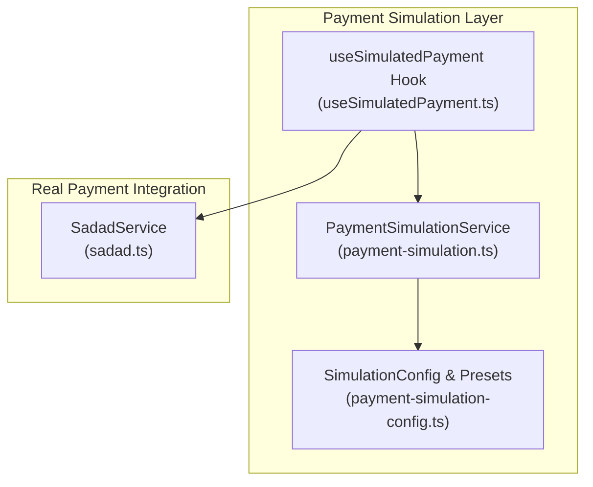
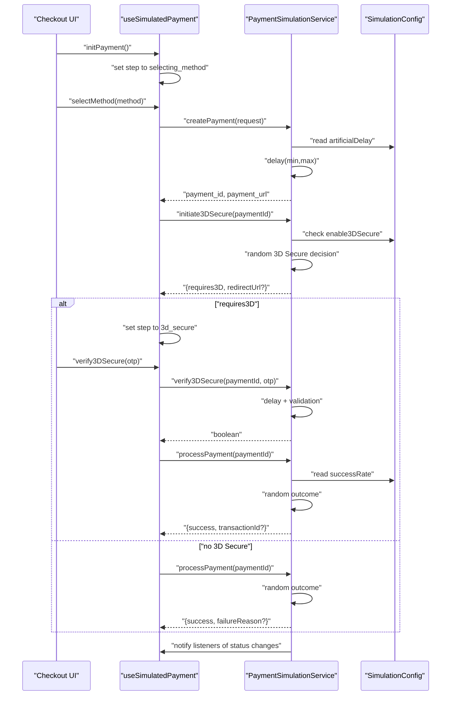
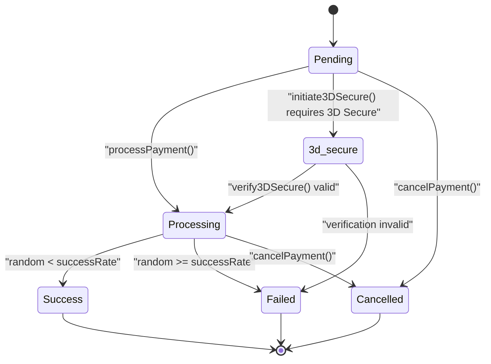
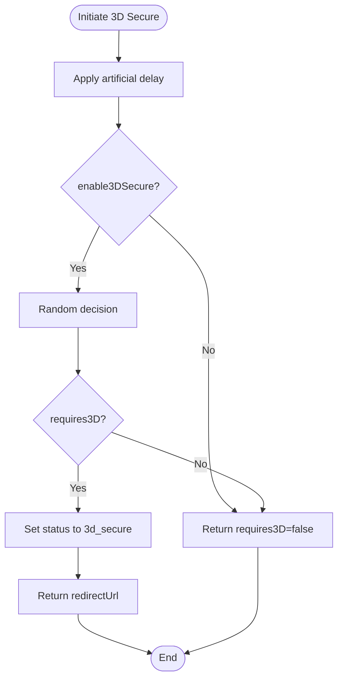
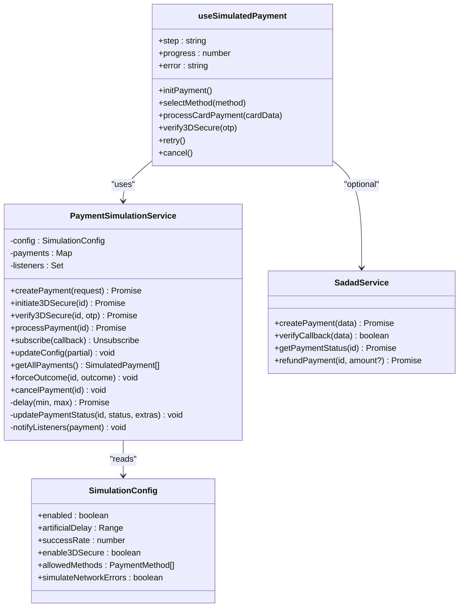

# Payment Simulation Framework

<cite>
**Referenced Files in This Document**
- [payment-simulation.ts](file://src/lib/payment-simulation.ts)
- [payment-simulation-config.ts](file://src/lib/payment-simulation-config.ts)
- [useSimulatedPayment.ts](file://src/hooks/useSimulatedPayment.ts)
- [sadad.ts](file://src/lib/sadad.ts)
</cite>

## Table of Contents
1. [Introduction](#introduction)
2. [Project Structure](#project-structure)
3. [Core Components](#core-components)
4. [Architecture Overview](#architecture-overview)
5. [Detailed Component Analysis](#detailed-component-analysis)
6. [Dependency Analysis](#dependency-analysis)
7. [Performance Considerations](#performance-considerations)
8. [Troubleshooting Guide](#troubleshooting-guide)
9. [Conclusion](#conclusion)

## Introduction
This document describes the payment simulation framework used to mimic payment gateway behavior for development, testing, and demonstration purposes. It covers the simulation engine architecture, configuration system, state management, artificial delay mechanisms, success rate controls, and 3D Secure simulation logic. It also documents configuration options, event subscription system, real-time progress tracking, integration patterns with checkout flows and UI components, and practical examples for configuring different simulation scenarios.

## Project Structure
The payment simulation framework consists of:
- A core simulation service that manages simulated payments, state transitions, and events
- A configuration module that defines simulation behavior and presets
- A React hook that orchestrates the checkout flow and UI state
- A Sadad integration module that provides real payment gateway capabilities alongside the simulation

**Diagram sources**
- [payment-simulation.ts:25-212](file://src/lib/payment-simulation.ts#L25-L212)
- [payment-simulation-config.ts:4-38](file://src/lib/payment-simulation-config.ts#L4-L38)
- [useSimulatedPayment.ts:1-189](file://src/hooks/useSimulatedPayment.ts#L1-L189)
- [sadad.ts:39-191](file://src/lib/sadad.ts#L39-L191)

**Section sources**
- [payment-simulation.ts:1-223](file://src/lib/payment-simulation.ts#L1-L223)
- [payment-simulation-config.ts:1-79](file://src/lib/payment-simulation-config.ts#L1-L79)
- [useSimulatedPayment.ts:1-189](file://src/hooks/useSimulatedPayment.ts#L1-L189)
- [sadad.ts:1-220](file://src/lib/sadad.ts#L1-L220)

## Core Components
- PaymentSimulationService: Central engine managing simulated payments, state transitions, artificial delays, 3D Secure simulation, and event broadcasting
- SimulationConfig and presets: Define behavior such as success rate, artificial delays, 3D Secure enablement, allowed payment methods, and network error simulation
- useSimulatedPayment hook: Orchestrates UI steps, progress tracking, and integrates with the simulation service
- SadadService: Real payment gateway integration for production use (optional replacement of simulation)

Key responsibilities:
- State management: Tracks payment lifecycle from pending to success/failed/cancelled
- Event system: Notifies subscribers of state changes
- Configuration-driven behavior: Adjusts delays, success probabilities, and 3D Secure behavior
- Real-time progress: Updates UI progress bars during processing

**Section sources**
- [payment-simulation.ts:25-212](file://src/lib/payment-simulation.ts#L25-L212)
- [payment-simulation-config.ts:4-38](file://src/lib/payment-simulation-config.ts#L4-L38)
- [useSimulatedPayment.ts:6-188](file://src/hooks/useSimulatedPayment.ts#L6-L188)

## Architecture Overview
The framework follows a modular architecture:
- Configuration drives behavior
- Service encapsulates state and business logic
- Hook coordinates UI and service interactions
- Optional Sadad integration supports production deployment

**Diagram sources**
- [useSimulatedPayment.ts:73-157](file://src/hooks/useSimulatedPayment.ts#L73-L157)
- [payment-simulation.ts:39-140](file://src/lib/payment-simulation.ts#L39-L140)
- [payment-simulation-config.ts:23-30](file://src/lib/payment-simulation-config.ts#L23-L30)

## Detailed Component Analysis

### PaymentSimulationService
Responsibilities:
- Manages simulated payment records in memory
- Applies configurable artificial delays
- Determines outcomes based on success rate
- Handles 3D Secure initiation and verification
- Emits real-time state updates via subscription
- Supports forced outcomes and cancellation

Core methods and behaviors:
- createPayment: Generates a payment record, applies delay, and returns a simulated response
- initiate3DSecure: Randomly decides whether 3D Secure is required and updates state accordingly
- verify3DSecure: Validates OTP format and transitions to processing
- processPayment: Finalizes payment with randomized success/failure outcome
- subscribe: Registers callbacks for real-time updates
- updateConfig: Dynamically adjusts simulation behavior
- cancelPayment: Marks a payment as cancelled
- forceOutcome: Overrides outcome for testing

State transitions:

**Diagram sources**
- [payment-simulation.ts:12-23](file://src/lib/payment-simulation.ts#L12-L23)
- [payment-simulation.ts:190-204](file://src/lib/payment-simulation.ts#L190-L204)

**Section sources**
- [payment-simulation.ts:25-212](file://src/lib/payment-simulation.ts#L25-L212)

### Simulation Configuration System
Configuration options:
- enabled: Global toggle for simulation mode
- artificialDelay: Min/max delay range applied across operations
- successRate: Probability threshold for payment success
- enable3DSecure: Controls 3D Secure simulation
- allowedMethods: Payment methods available in UI
- simulateNetworkErrors: Placeholder for future network error simulation

Presets:
- alwaysSuccess: 100% success rate
- alwaysFail: 0% success rate
- slowNetwork: Increased artificial delays
- flakyNetwork: Lower success rate with network error flag

UI method details:
- Provides metadata for payment method selection UI (names, descriptions, icons, colors)

**Section sources**
- [payment-simulation-config.ts:4-38](file://src/lib/payment-simulation-config.ts#L4-L38)
- [payment-simulation-config.ts:41-79](file://src/lib/payment-simulation-config.ts#L41-L79)

### useSimulatedPayment Hook
Orchestrates the checkout flow:
- Steps: idle → selecting_method → entering_details → processing → 3d_secure → success/failed
- Progress tracking: Updates progress percentage during processing
- Event handling: Subscribes to payment state changes and triggers UI updates
- Integration: Calls PaymentSimulationService methods for each step

Key behaviors:
- initPayment: Resets UI state and sets step to selecting_method
- selectMethod: Moves to entering_details
- processCardPayment: Creates payment, checks for 3D Secure, and processes payment
- verify3DSecure: Validates OTP, proceeds to processing, and finalizes payment
- retry/cancel: Resets UI and cancels payment if needed

**Section sources**
- [useSimulatedPayment.ts:6-188](file://src/hooks/useSimulatedPayment.ts#L6-L188)

### 3D Secure Simulation Logic
Behavior:
- After payment creation, a short delay simulates backend checks
- With 3D Secure enabled, a random decision determines if 3D Secure is required
- If required, the payment moves to 3d_secure state and a redirect URL is provided
- OTP verification accepts any 6-digit code; successful verification transitions to processing

**Diagram sources**
- [payment-simulation.ts:69-92](file://src/lib/payment-simulation.ts#L69-L92)

**Section sources**
- [payment-simulation.ts:69-106](file://src/lib/payment-simulation.ts#L69-L106)

### Artificial Delay Mechanisms
Implementation:
- delay(min, max): Generates a random delay within the configured range
- Applied before:
  - 3D Secure initiation
  - 3D Secure verification
  - Payment processing
- Configurable via artificialDelay.min/max

Effects:
- Realistic latency simulation
- Adjustable via configuration or presets

**Section sources**
- [payment-simulation.ts:184-188](file://src/lib/payment-simulation.ts#L184-L188)
- [payment-simulation-config.ts:25-26](file://src/lib/payment-simulation-config.ts#L25-L26)

### Success Rate Controls
Mechanism:
- processPayment reads successRate from configuration
- Random comparison determines success vs failure
- Failure reasons include common scenarios (insufficient funds, expired card, etc.)

Preset impact:
- alwaysSuccess sets successRate to 1
- alwaysFail sets successRate to 0
- flakyNetwork reduces successRate to 0.7

**Section sources**
- [payment-simulation.ts:121-139](file://src/lib/payment-simulation.ts#L121-L139)
- [payment-simulation-config.ts:33-38](file://src/lib/payment-simulation-config.ts#L33-L38)

### Event Subscription System and Real-time Progress Tracking
Event system:
- subscribe registers callbacks for payment updates
- notifyListeners broadcasts state changes to all subscribers
- Used by the hook to update UI state and progress

Progress tracking:
- During processing, progress increases randomly up to 90%
- After 3D Secure, progress jumps to 60% before finalizing
- Completed payments set progress to 100%

**Section sources**
- [payment-simulation.ts:147-151](file://src/lib/payment-simulation.ts#L147-L151)
- [payment-simulation.ts:206-208](file://src/lib/payment-simulation.ts#L206-L208)
- [useSimulatedPayment.ts:60-71](file://src/hooks/useSimulatedPayment.ts#L60-L71)
- [useSimulatedPayment.ts:134-157](file://src/hooks/useSimulatedPayment.ts#L134-L157)

### Integration Patterns with Checkout Flow and UI Components
Integration points:
- useSimulatedPayment coordinates UI steps and state
- PaymentSimulationService handles backend simulation
- SadadService provides optional production integration
- Configuration module supplies behavior presets and UI metadata

Checkout flow:
- Method selection → Enter card details → Processing → 3D Secure (optional) → Completion

**Section sources**
- [useSimulatedPayment.ts:73-132](file://src/hooks/useSimulatedPayment.ts#L73-L132)
- [payment-simulation.ts:39-140](file://src/lib/payment-simulation.ts#L39-L140)
- [sadad.ts:39-191](file://src/lib/sadad.ts#L39-L191)

## Dependency Analysis
Relationships:
- useSimulatedPayment depends on PaymentSimulationService for state and operations
- PaymentSimulationService depends on SimulationConfig for behavior
- PaymentSimulationService optionally integrates with SadadService for production flows
- UI components depend on the hook for checkout orchestration

**Diagram sources**
- [payment-simulation.ts:25-212](file://src/lib/payment-simulation.ts#L25-L212)
- [payment-simulation-config.ts:4-38](file://src/lib/payment-simulation-config.ts#L4-L38)
- [useSimulatedPayment.ts:1-189](file://src/hooks/useSimulatedPayment.ts#L1-L189)
- [sadad.ts:39-191](file://src/lib/sadad.ts#L39-L191)

**Section sources**
- [payment-simulation.ts:25-212](file://src/lib/payment-simulation.ts#L25-L212)
- [payment-simulation-config.ts:4-38](file://src/lib/payment-simulation-config.ts#L4-L38)
- [useSimulatedPayment.ts:1-189](file://src/hooks/useSimulatedPayment.ts#L1-L189)
- [sadad.ts:39-191](file://src/lib/sadad.ts#L39-L191)

## Performance Considerations
- Artificial delays: Configure min/max ranges to balance realism and responsiveness
- Success rate tuning: Lower rates increase retries and perceived instability
- 3D Secure probability: Higher probability increases page transitions and processing time
- Listener overhead: Keep listener count reasonable; unsubscribe when components unmount
- Memory footprint: Payments stored in-memory; consider clearing after completion in long sessions

## Troubleshooting Guide
Common issues and resolutions:
- Simulation not enabled: Ensure the global toggle is active and environment variable is set
- Payment stuck in processing: Verify success rate configuration and that delays are not excessively high
- 3D Secure not triggering: Confirm enable3DSecure is true and that random decision aligns with expectations
- OTP validation failures: Only 6-digit numeric codes are accepted
- Progress not updating: Check that the hook is subscribed and that progress intervals are running
- Production integration conflicts: Switch to SadadService when ready; simulation remains available via factory

Operational checks:
- Use getAllPayments for debugging current simulations
- Apply forceOutcome for deterministic testing
- Utilize presets to quickly switch between scenarios

**Section sources**
- [payment-simulation.ts:34-36](file://src/lib/payment-simulation.ts#L34-L36)
- [payment-simulation.ts:154-167](file://src/lib/payment-simulation.ts#L154-L167)
- [payment-simulation.ts:175-177](file://src/lib/payment-simulation.ts#L175-L177)
- [useSimulatedPayment.ts:159-172](file://src/hooks/useSimulatedPayment.ts#L159-L172)

## Conclusion
The payment simulation framework provides a robust, configurable, and production-ready mechanism to emulate payment experiences during development and testing. Its modular design allows seamless switching between simulation and real payment gateways, comprehensive state management ensures accurate UI feedback, and flexible configuration enables diverse scenario modeling. By leveraging the provided presets and integration patterns, teams can efficiently validate checkout flows, demonstrate payment experiences, and prepare for production deployments.