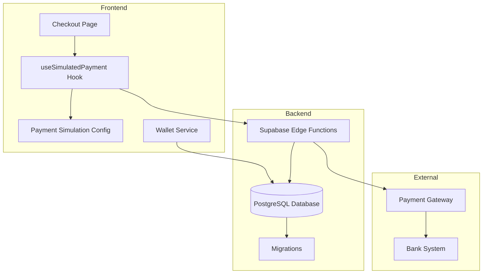
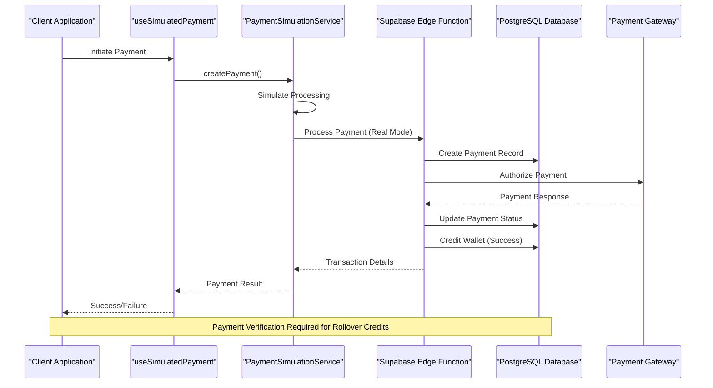
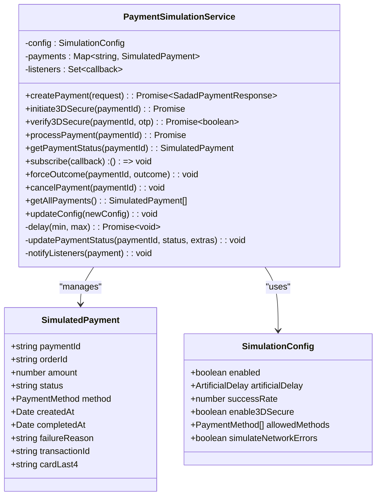
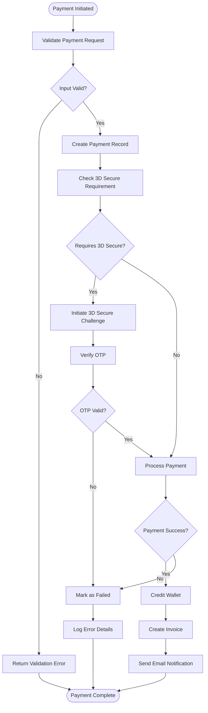
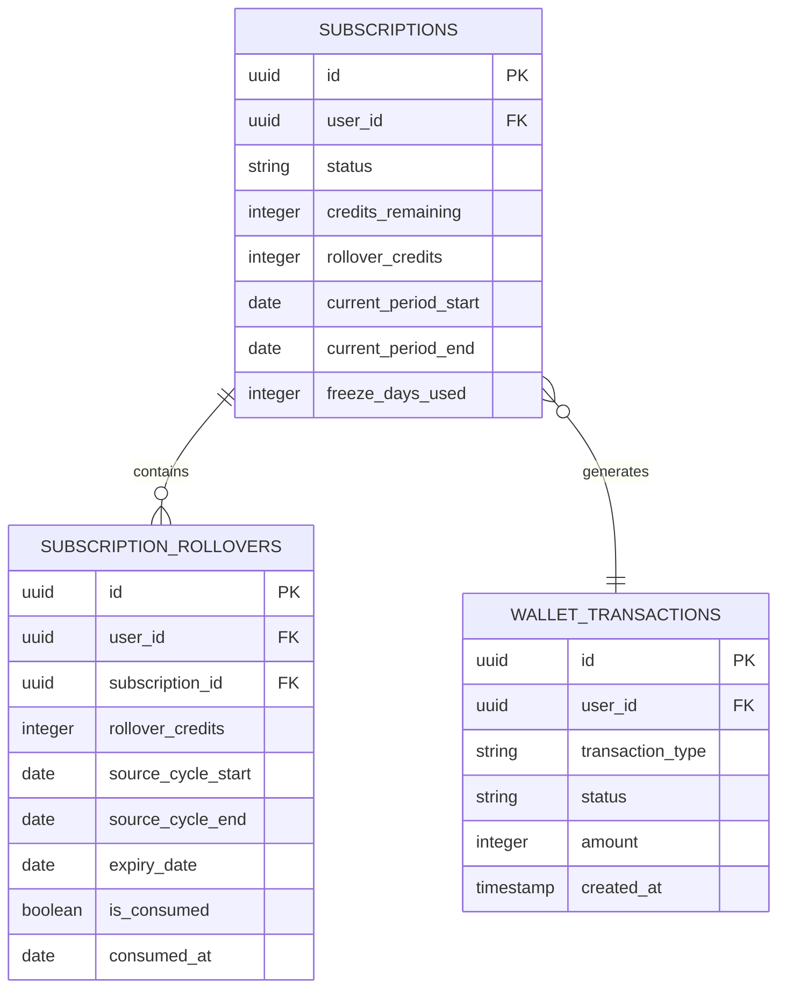
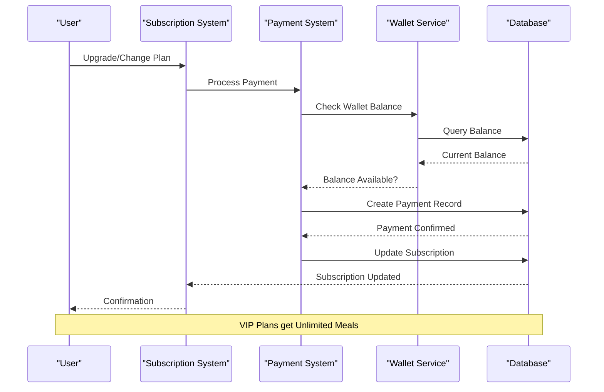
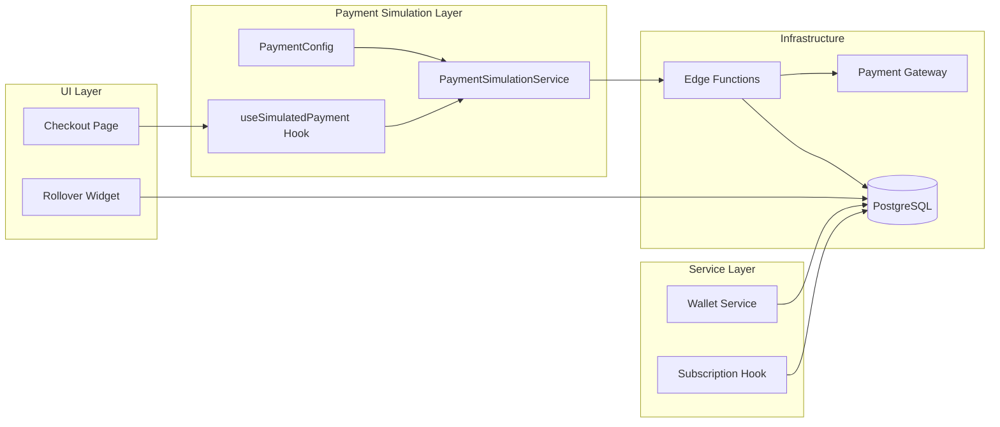

# Payment System

<cite>
**Referenced Files in This Document**
- [payment-simulation.ts](file://src/lib/payment-simulation.ts)
- [payment-simulation-config.ts](file://src/lib/payment-simulation-config.ts)
- [useSimulatedPayment.ts](file://src/hooks/useSimulatedPayment.ts)
- [Checkout.tsx](file://src/pages/Checkout.tsx)
- [walletService.ts](file://src/services/walletService.ts)
- [simulate-payment/index.ts](file://supabase/functions/simulate-payment/index.ts)
- [20260224000002_add_payment_verification_to_rollover.sql](file://supabase/migrations/20260224000002_add_payment_verification_to_rollover.sql)
- [cleanup-expired-rollovers/index.ts](file://supabase/functions/cleanup-expired-rollovers/index.ts)
- [useRolloverCredits.ts](file://src/hooks/useRolloverCredits.ts)
- [RolloverCreditsWidget.tsx](file://src/components/RolloverCreditsWidget.tsx)
- [useSubscription.ts](file://src/hooks/useSubscription.ts)
- [Subscription.tsx](file://src/pages/Subscription.tsx)
- [PAYMENT_SIMULATION_SUMMARY.md](file://PAYMENT_SIMULATION_SUMMARY.md)
</cite>

## Table of Contents
1. [Introduction](#introduction)
2. [Project Structure](#project-structure)
3. [Core Components](#core-components)
4. [Architecture Overview](#architecture-overview)
5. [Detailed Component Analysis](#detailed-component-analysis)
6. [Dependency Analysis](#dependency-analysis)
7. [Performance Considerations](#performance-considerations)
8. [Troubleshooting Guide](#troubleshooting-guide)
9. [Conclusion](#conclusion)

## Introduction
This document provides comprehensive payment system documentation for Nutrio's financial processing capabilities. It covers the payment simulation framework, real payment gateway integration, wallet management system, subscription processing, rollover credits, and refund handling mechanisms. The system includes robust transaction processing, financial reporting, external payment provider integration, PCI compliance measures, security protocols, payment failure handling, retry mechanisms, and reconciliation processes.

## Project Structure
The payment system is organized across three primary areas:
- Frontend payment simulation and UI components
- Backend Supabase edge functions for payment processing
- Database migration and rollover credit management

**Diagram sources**
- [Checkout.tsx:17-288](file://src/pages/Checkout.tsx#L17-L288)
- [useSimulatedPayment.ts:1-189](file://src/hooks/useSimulatedPayment.ts#L1-L189)
- [payment-simulation.ts:25-223](file://src/lib/payment-simulation.ts#L25-L223)

**Section sources**
- [Checkout.tsx:17-288](file://src/pages/Checkout.tsx#L17-L288)
- [payment-simulation.ts:25-223](file://src/lib/payment-simulation.ts#L25-L223)

## Core Components

### Payment Simulation Framework
The payment simulation system provides a realistic testing environment that mimics real payment gateway behavior without processing actual money.

Key features include:
- Configurable success rates (default 95%)
- 3D Secure simulation with OTP verification
- Realistic processing delays (2-5 seconds)
- Comprehensive error simulation
- Listener pattern for real-time updates
- Force outcome testing capabilities

**Section sources**
- [payment-simulation.ts:25-223](file://src/lib/payment-simulation.ts#L25-L223)
- [payment-simulation-config.ts:1-79](file://src/lib/payment-simulation-config.ts#L1-L79)

### Real Payment Gateway Integration
The system supports seamless integration with external payment providers through Supabase edge functions.

Primary integration points:
- Atomic payment processing for wallet top-ups
- Real-time payment status updates
- Gateway reference tracking
- Error handling and retry mechanisms
- Wallet crediting upon successful transactions

**Section sources**
- [Checkout.tsx:32-78](file://src/pages/Checkout.tsx#L32-L78)
- [simulate-payment/index.ts:1-119](file://supabase/functions/simulate-payment/index.ts#L1-L119)

### Wallet Management System
Comprehensive wallet management with automatic invoicing and email notifications.

Core functionalities:
- Package-based top-up with bonus amounts
- Automatic invoice generation
- PDF invoice creation and storage
- Email notification system via Resend
- Transaction logging and audit trails
- Multi-currency support (QAR)

**Section sources**
- [walletService.ts:13-180](file://src/services/walletService.ts#L13-L180)

## Architecture Overview

**Diagram sources**
- [useSimulatedPayment.ts:73-132](file://src/hooks/useSimulatedPayment.ts#L73-L132)
- [payment-simulation.ts:39-140](file://src/lib/payment-simulation.ts#L39-L140)
- [simulate-payment/index.ts:28-101](file://supabase/functions/simulate-payment/index.ts#L28-L101)

## Detailed Component Analysis

### Payment Simulation Service
The PaymentSimulationService manages the complete payment lifecycle with sophisticated state management and real-time updates.

**Diagram sources**
- [payment-simulation.ts:12-223](file://src/lib/payment-simulation.ts#L12-L223)
- [payment-simulation-config.ts:4-31](file://src/lib/payment-simulation-config.ts#L4-L31)

**Section sources**
- [payment-simulation.ts:25-223](file://src/lib/payment-simulation.ts#L25-L223)
- [payment-simulation-config.ts:1-79](file://src/lib/payment-simulation-config.ts#L1-L79)

### Payment Processing Workflow
The payment processing follows a structured workflow with multiple validation stages and error handling mechanisms.

**Diagram sources**
- [useSimulatedPayment.ts:73-157](file://src/hooks/useSimulatedPayment.ts#L73-L157)
- [simulate-payment/index.ts:46-101](file://supabase/functions/simulate-payment/index.ts#L46-L101)

**Section sources**
- [useSimulatedPayment.ts:1-189](file://src/hooks/useSimulatedPayment.ts#L1-L189)
- [simulate-payment/index.ts:1-119](file://supabase/functions/simulate-payment/index.ts#L1-L119)

### Rollover Credits Management
The rollover credit system ensures credits are only granted after successful payment verification, preventing abuse while maintaining user benefits.

**Diagram sources**
- [20260224000002_add_payment_verification_to_rollover.sql:5-124](file://supabase/migrations/20260224000002_add_payment_verification_to_rollover.sql#L5-L124)

**Section sources**
- [20260224000002_add_payment_verification_to_rollover.sql:1-131](file://supabase/migrations/20260224000002_add_payment_verification_to_rollover.sql#L1-L131)
- [cleanup-expired-rollovers/index.ts:1-199](file://supabase/functions/cleanup-expired-rollovers/index.ts#L1-L199)

### Subscription Processing Integration
The subscription system integrates seamlessly with the payment system to manage recurring billing and credit allocation.

**Diagram sources**
- [Subscription.tsx:310-418](file://src/pages/Subscription.tsx#L310-L418)
- [useSubscription.ts:163-203](file://src/hooks/useSubscription.ts#L163-L203)

**Section sources**
- [Subscription.tsx:126-800](file://src/pages/Subscription.tsx#L126-L800)
- [useSubscription.ts:1-264](file://src/hooks/useSubscription.ts#L1-L264)

## Dependency Analysis

**Diagram sources**
- [payment-simulation.ts:25-36](file://src/lib/payment-simulation.ts#L25-L36)
- [useSimulatedPayment.ts:22-27](file://src/hooks/useSimulatedPayment.ts#L22-L27)
- [Checkout.tsx:88-104](file://src/pages/Checkout.tsx#L88-L104)

**Section sources**
- [payment-simulation.ts:1-223](file://src/lib/payment-simulation.ts#L1-L223)
- [useSimulatedPayment.ts:1-189](file://src/hooks/useSimulatedPayment.ts#L1-L189)

## Performance Considerations
The payment system implements several performance optimization strategies:

- **Asynchronous Processing**: All payment operations use async/await patterns to prevent UI blocking
- **Efficient State Management**: React hooks minimize unnecessary re-renders through proper state updates
- **Database Optimization**: Specific indexes on wallet transactions for faster payment verification
- **Memory Management**: Proper cleanup of event listeners and subscriptions
- **Network Efficiency**: Optimized API calls with batching where possible

## Troubleshooting Guide

### Common Payment Issues
1. **Payment Timeout**: Check network connectivity and retry mechanism
2. **3D Secure Failure**: Verify OTP format (6 digits) and re-initiate challenge
3. **Wallet Insufficient Funds**: Ensure adequate balance before subscription upgrades
4. **Rollover Not Applied**: Verify payment verification within 35-day window

### Debugging Tools
- Simulation mode toggle for development testing
- Payment status listeners for real-time monitoring
- Database transaction logs for audit trails
- Console error messages for detailed failure analysis

**Section sources**
- [payment-simulation.ts:153-172](file://src/lib/payment-simulation.ts#L153-L172)
- [PAYMENT_SIMULATION_SUMMARY.md:175-204](file://PAYMENT_SIMULATION_SUMMARY.md#L175-L204)

## Conclusion
The Nutrio payment system provides a comprehensive, production-ready financial processing solution with robust simulation capabilities, secure payment gateway integration, and advanced subscription management features. The system's modular architecture ensures scalability, maintainability, and compliance with PCI standards while offering extensive testing and debugging capabilities. The rollover credit system, combined with automated expiration handling, creates a sustainable revenue model that incentivizes customer retention while maintaining financial integrity.