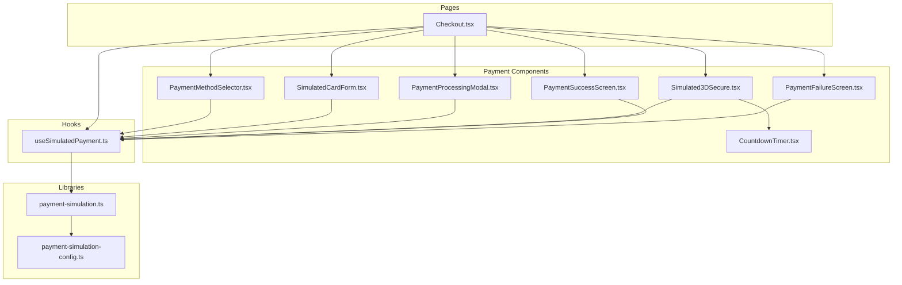
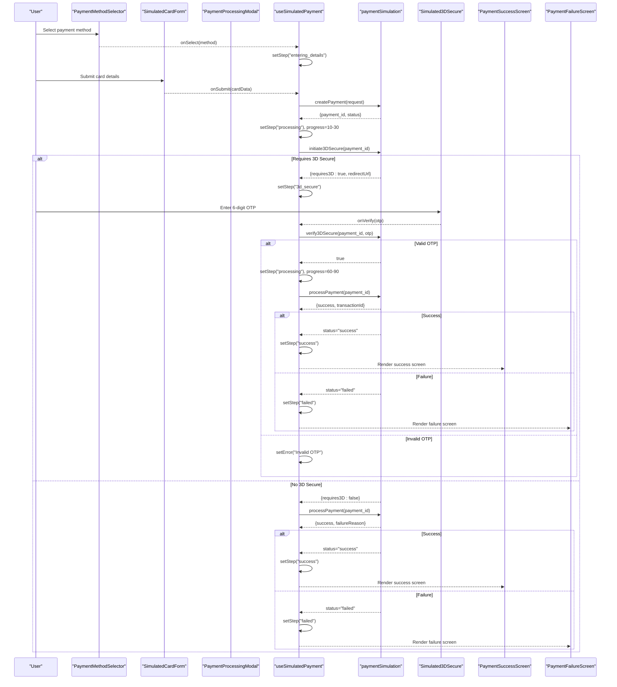
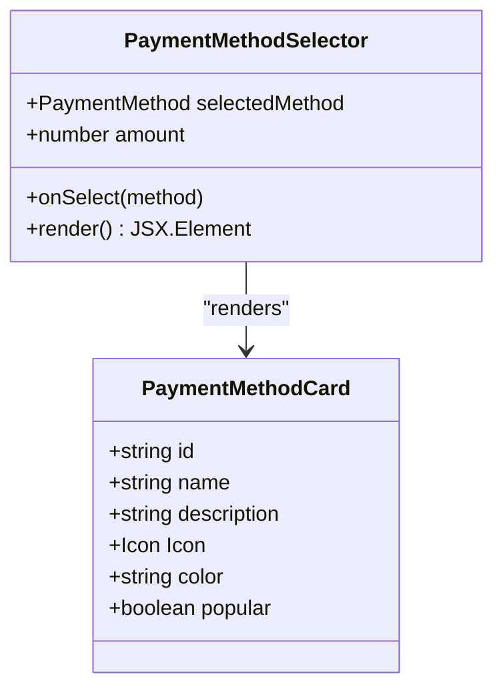
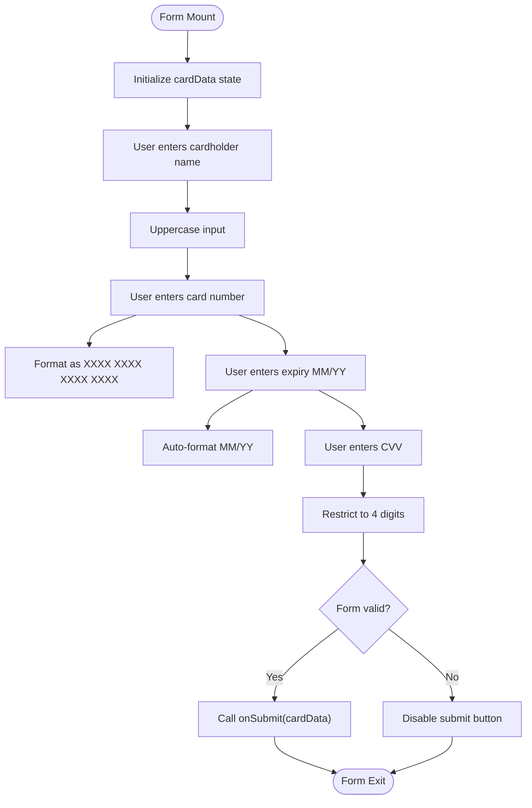
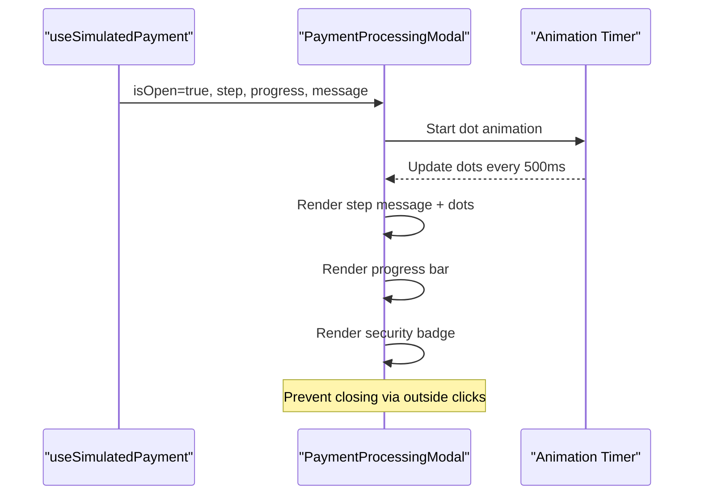
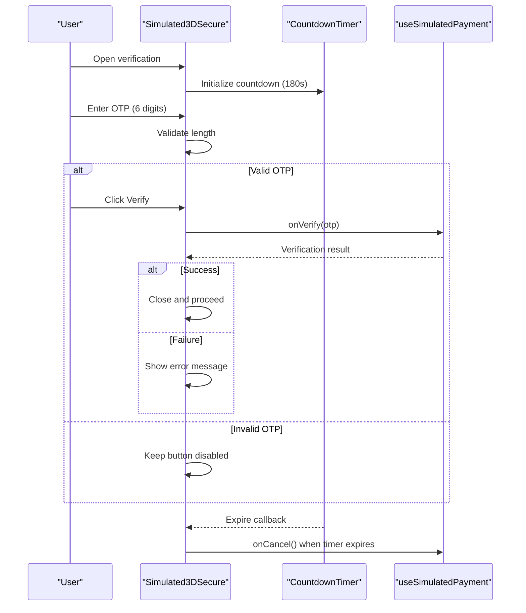
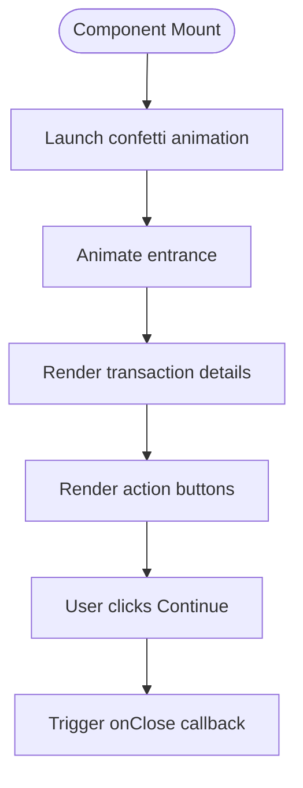
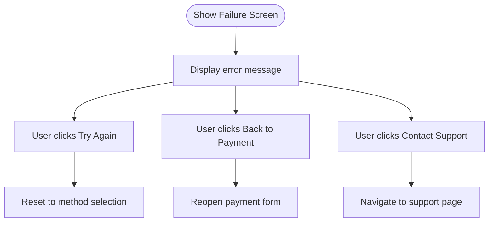
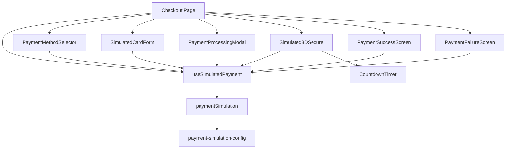

# Payment UI Components

<cite>
**Referenced Files in This Document**
- [PaymentMethodSelector.tsx](file://src/components/payment/PaymentMethodSelector.tsx)
- [SimulatedCardForm.tsx](file://src/components/payment/SimulatedCardForm.tsx)
- [PaymentProcessingModal.tsx](file://src/components/payment/PaymentProcessingModal.tsx)
- [Simulated3DSecure.tsx](file://src/components/payment/Simulated3DSecure.tsx)
- [CountdownTimer.tsx](file://src/components/payment/CountdownTimer.tsx)
- [PaymentSuccessScreen.tsx](file://src/components/payment/PaymentSuccessScreen.tsx)
- [PaymentFailureScreen.tsx](file://src/components/payment/PaymentFailureScreen.tsx)
- [payment-simulation.ts](file://src/lib/payment-simulation.ts)
- [payment-simulation-config.ts](file://src/lib/payment-simulation-config.ts)
- [useSimulatedPayment.ts](file://src/hooks/useSimulatedPayment.ts)
- [Checkout.tsx](file://src/pages/Checkout.tsx)
</cite>

## Table of Contents
1. [Introduction](#introduction)
2. [Project Structure](#project-structure)
3. [Core Components](#core-components)
4. [Architecture Overview](#architecture-overview)
5. [Detailed Component Analysis](#detailed-component-analysis)
6. [Dependency Analysis](#dependency-analysis)
7. [Performance Considerations](#performance-considerations)
8. [Accessibility Features](#accessibility-features)
9. [Responsive Design](#responsive-design)
10. [Integration Patterns](#integration-patterns)
11. [Usage Examples](#usage-examples)
12. [Customization Guidelines](#customization-guidelines)
13. [Troubleshooting Guide](#troubleshooting-guide)
14. [Conclusion](#conclusion)

## Introduction
This document provides comprehensive documentation for the payment UI component library used in the checkout flow. It covers the payment method selector supporting five payment methods, the animated processing modal with progress indicators, the realistic card form validation, the 3D Secure OTP verification interface, and success/failure screens with animations. The documentation also includes component composition patterns, accessibility features, responsive design considerations, and integration with the payment simulation framework.

## Project Structure
The payment UI components are organized under the `src/components/payment` directory and integrate with shared libraries and hooks for payment simulation and state management.

**Diagram sources**
- [PaymentMethodSelector.tsx:1-107](file://src/components/payment/PaymentMethodSelector.tsx#L1-L107)
- [SimulatedCardForm.tsx:1-144](file://src/components/payment/SimulatedCardForm.tsx#L1-L144)
- [PaymentProcessingModal.tsx:1-80](file://src/components/payment/PaymentProcessingModal.tsx#L1-L80)
- [Simulated3DSecure.tsx:1-105](file://src/components/payment/Simulated3DSecure.tsx#L1-L105)
- [CountdownTimer.tsx:1-33](file://src/components/payment/CountdownTimer.tsx#L1-L33)
- [PaymentSuccessScreen.tsx:1-117](file://src/components/payment/PaymentSuccessScreen.tsx#L1-L117)
- [PaymentFailureScreen.tsx:1-80](file://src/components/payment/PaymentFailureScreen.tsx#L1-L80)
- [payment-simulation.ts:1-223](file://src/lib/payment-simulation.ts#L1-L223)
- [payment-simulation-config.ts:1-79](file://src/lib/payment-simulation-config.ts#L1-L79)
- [useSimulatedPayment.ts:1-189](file://src/hooks/useSimulatedPayment.ts#L1-L189)
- [Checkout.tsx:1-186](file://src/pages/Checkout.tsx#L1-L186)

**Section sources**
- [PaymentMethodSelector.tsx:1-107](file://src/components/payment/PaymentMethodSelector.tsx#L1-L107)
- [SimulatedCardForm.tsx:1-144](file://src/components/payment/SimulatedCardForm.tsx#L1-L144)
- [PaymentProcessingModal.tsx:1-80](file://src/components/payment/PaymentProcessingModal.tsx#L1-L80)
- [Simulated3DSecure.tsx:1-105](file://src/components/payment/Simulated3DSecure.tsx#L1-L105)
- [CountdownTimer.tsx:1-33](file://src/components/payment/CountdownTimer.tsx#L1-L33)
- [PaymentSuccessScreen.tsx:1-117](file://src/components/payment/PaymentSuccessScreen.tsx#L1-L117)
- [PaymentFailureScreen.tsx:1-80](file://src/components/payment/PaymentFailureScreen.tsx#L1-L80)
- [payment-simulation.ts:1-223](file://src/lib/payment-simulation.ts#L1-L223)
- [payment-simulation-config.ts:1-79](file://src/lib/payment-simulation-config.ts#L1-L79)
- [useSimulatedPayment.ts:1-189](file://src/hooks/useSimulatedPayment.ts#L1-L189)
- [Checkout.tsx:1-186](file://src/pages/Checkout.tsx#L1-L186)

## Core Components
This section documents each component's functionality, props, styling, and user interaction patterns.

### PaymentMethodSelector
A grid-based selector for choosing among five payment methods with visual feedback and selection state.

- Props:
  - `selectedMethod`: Currently selected payment method or null
  - `onSelect`: Callback receiving the chosen method
  - `amount`: Displayed order amount for context
- Behavior:
  - Renders five selectable cards with icons, names, descriptions, and popularity badges
  - Highlights the selected method with a primary ring and inner dot indicator
  - Triggers onSelect when a method is clicked
- Styling:
  - Uses card components with hover shadows and transition effects
  - Color-coded method icons and badges
  - Responsive grid layout

**Section sources**
- [PaymentMethodSelector.tsx:6-107](file://src/components/payment/PaymentMethodSelector.tsx#L6-L107)

### SimulatedCardForm
A realistic credit/debit card form with input formatting, validation, and submission handling.

- Props:
  - `onSubmit`: Callback receiving formatted card data
  - `amount`: Amount to display
  - `loading`: Optional loading state for button
- Behavior:
  - Formats card number in groups of four digits
  - Formats expiry date as MM/YY
  - Accepts only numeric CVV input
  - Uppercases cardholder name input
  - Disables submit when loading
- Validation:
  - Enforces required fields and numeric constraints
  - Provides simulation mode notice with example test card
- Styling:
  - Labeled inputs with icon overlays
  - Prominent "Pay" button with amount display
  - Amber notice banner for simulation guidance

**Section sources**
- [SimulatedCardForm.tsx:8-144](file://src/components/payment/SimulatedCardForm.tsx#L8-L144)

### PaymentProcessingModal
Animated modal displaying payment progress with security indicators and step messages.

- Props:
  - `isOpen`: Controls visibility
  - `step`: Current processing stage
  - `progress`: Numeric progress percentage
  - `message`: Additional contextual message
- Steps:
  - `initializing`: Establishing secure connection
  - `processing`: Processing payment
  - `3d_secure`: Redirecting to 3D Secure
  - `verifying`: Verifying transaction
  - `finalizing`: Finalizing payment
- Animation:
  - Dynamic dots appended to step message
  - Progress bar with percentage display
  - Security badge and lock iconography
- Interaction:
  - Prevents closing via outside clicks

**Section sources**
- [PaymentProcessingModal.tsx:6-80](file://src/components/payment/PaymentProcessingModal.tsx#L6-L80)

### Simulated3DSecure
OTP verification dialog for 3D Secure with countdown timer and resend functionality.

- Props:
  - `isOpen`: Controls visibility
  - `onVerify`: Callback receiving 6-digit OTP
  - `onCancel`: Callback to cancel verification
  - `bankName`: Optional bank name display
  - `cardLast4`: Optional last four digits display
- Behavior:
  - Accepts only numeric OTP input up to six digits
  - Disables verify button until OTP is complete
  - Integrates CountdownTimer for expiration
  - Provides resend OTP action
- Styling:
  - Blue security-themed header
  - Bank and card details display
  - Clear visual feedback for user actions

**Section sources**
- [Simulated3DSecure.tsx:8-105](file://src/components/payment/Simulated3DSecure.tsx#L8-L105)
- [CountdownTimer.tsx:3-33](file://src/components/payment/CountdownTimer.tsx#L3-L33)

### PaymentSuccessScreen
Celebratory success screen with confetti animation, transaction details, and actions.

- Props:
  - `amount`: Paid amount
  - `transactionId`: Generated transaction identifier
  - `date`: Transaction timestamp
  - `onClose`: Callback to continue navigation
  - `onViewReceipt`: Callback to receipt view
- Animation:
  - Confetti burst effect triggered on mount
  - Smooth entrance animations for container and elements
- Content:
  - Green header with checkmark
  - Transaction summary with amount, ID, and date
  - Action buttons for receipt, download, and continue

**Section sources**
- [PaymentSuccessScreen.tsx:8-117](file://src/components/payment/PaymentSuccessScreen.tsx#L8-L117)

### PaymentFailureScreen
Clear failure screen with error messaging, retry options, and support contact.

- Props:
  - `amount`: Original amount
  - `errorMessage`: Failure reason
  - `onRetry`: Callback to restart payment
  - `onBack`: Callback to return to payment
  - `onContactSupport`: Callback to support page
- Styling:
  - Red-themed header with failure icon
  - Error message box with red accents
  - Three action buttons with icons
- Assurance:
  - Message confirming no charge was made

**Section sources**
- [PaymentFailureScreen.tsx:6-80](file://src/components/payment/PaymentFailureScreen.tsx#L6-L80)

## Architecture Overview
The payment UI components integrate with a simulation service and a custom hook to orchestrate the complete payment flow, from method selection to success or failure states.

**Diagram sources**
- [useSimulatedPayment.ts:22-189](file://src/hooks/useSimulatedPayment.ts#L22-L189)
- [payment-simulation.ts:39-140](file://src/lib/payment-simulation.ts#L39-L140)
- [PaymentMethodSelector.tsx:51-107](file://src/components/payment/PaymentMethodSelector.tsx#L51-L107)
- [SimulatedCardForm.tsx:19-144](file://src/components/payment/SimulatedCardForm.tsx#L19-L144)
- [PaymentProcessingModal.tsx:21-80](file://src/components/payment/PaymentProcessingModal.tsx#L21-L80)
- [Simulated3DSecure.tsx:16-105](file://src/components/payment/Simulated3DSecure.tsx#L16-L105)
- [PaymentSuccessScreen.tsx:16-117](file://src/components/payment/PaymentSuccessScreen.tsx#L16-L117)
- [PaymentFailureScreen.tsx:14-80](file://src/components/payment/PaymentFailureScreen.tsx#L14-L80)

## Detailed Component Analysis

### PaymentMethodSelector Analysis
The selector component renders a grid of payment method cards with distinct visual identities and selection feedback.

**Diagram sources**
- [PaymentMethodSelector.tsx:12-49](file://src/components/payment/PaymentMethodSelector.tsx#L12-L49)
- [PaymentMethodSelector.tsx:51-107](file://src/components/payment/PaymentMethodSelector.tsx#L51-L107)

**Section sources**
- [PaymentMethodSelector.tsx:1-107](file://src/components/payment/PaymentMethodSelector.tsx#L1-L107)

### SimulatedCardForm Analysis
The form component manages multiple input fields with real-time formatting and validation.

**Diagram sources**
- [SimulatedCardForm.tsx:19-144](file://src/components/payment/SimulatedCardForm.tsx#L19-L144)

**Section sources**
- [SimulatedCardForm.tsx:1-144](file://src/components/payment/SimulatedCardForm.tsx#L1-L144)

### PaymentProcessingModal Analysis
The modal displays animated progress with step-specific messaging and security indicators.

**Diagram sources**
- [PaymentProcessingModal.tsx:21-80](file://src/components/payment/PaymentProcessingModal.tsx#L21-L80)

**Section sources**
- [PaymentProcessingModal.tsx:1-80](file://src/components/payment/PaymentProcessingModal.tsx#L1-L80)

### Simulated3DSecure Analysis
The OTP verification dialog integrates a countdown timer and verification flow.

**Diagram sources**
- [Simulated3DSecure.tsx:16-105](file://src/components/payment/Simulated3DSecure.tsx#L16-L105)
- [CountdownTimer.tsx:8-33](file://src/components/payment/CountdownTimer.tsx#L8-L33)

**Section sources**
- [Simulated3DSecure.tsx:1-105](file://src/components/payment/Simulated3DSecure.tsx#L1-L105)
- [CountdownTimer.tsx:1-33](file://src/components/payment/CountdownTimer.tsx#L1-L33)

### PaymentSuccessScreen Analysis
The success screen combines animations with transaction details and actions.

**Diagram sources**
- [PaymentSuccessScreen.tsx:23-117](file://src/components/payment/PaymentSuccessScreen.tsx#L23-L117)

**Section sources**
- [PaymentSuccessScreen.tsx:1-117](file://src/components/payment/PaymentSuccessScreen.tsx#L1-L117)

### PaymentFailureScreen Analysis
The failure screen presents clear messaging and recovery options.

**Diagram sources**
- [PaymentFailureScreen.tsx:14-80](file://src/components/payment/PaymentFailureScreen.tsx#L14-L80)

**Section sources**
- [PaymentFailureScreen.tsx:1-80](file://src/components/payment/PaymentFailureScreen.tsx#L1-L80)

## Dependency Analysis
The components depend on shared configuration, simulation service, and a central hook for state orchestration.

**Diagram sources**
- [useSimulatedPayment.ts:1-189](file://src/hooks/useSimulatedPayment.ts#L1-L189)
- [payment-simulation.ts:1-223](file://src/lib/payment-simulation.ts#L1-L223)
- [payment-simulation-config.ts:1-79](file://src/lib/payment-simulation-config.ts#L1-L79)
- [Checkout.tsx:1-186](file://src/pages/Checkout.tsx#L1-L186)

**Section sources**
- [useSimulatedPayment.ts:1-189](file://src/hooks/useSimulatedPayment.ts#L1-L189)
- [payment-simulation.ts:1-223](file://src/lib/payment-simulation.ts#L1-L223)
- [payment-simulation-config.ts:1-79](file://src/lib/payment-simulation-config.ts#L1-L79)
- [Checkout.tsx:1-186](file://src/pages/Checkout.tsx#L1-L186)

## Performance Considerations
- Simulation delays: The payment simulation introduces configurable artificial delays to mimic network latency, affecting perceived performance. Tune `artificialDelay` in the simulation configuration for development vs. production needs.
- Progress simulation: The hook simulates progress updates during processing to provide smooth UX feedback without real network requests.
- Animation costs: Success screen confetti and modal animations use lightweight canvas effects; keep durations reasonable to avoid jank on lower-end devices.
- Event subscriptions: The simulation service maintains listeners; ensure proper cleanup to prevent memory leaks when components unmount.

## Accessibility Features
- Keyboard navigation: Buttons and inputs are focusable; ensure tab order follows logical flow from form fields to action buttons.
- Screen reader support: Descriptive labels for form fields and clear step messages aid assistive technologies.
- Focus management: Dialogs trap focus; pressing Escape or clicking outside is prevented to maintain focus within the modal.
- Color contrast: High contrast between text and backgrounds; ensure custom themes preserve sufficient contrast ratios.
- Animated elements: Motion can be reduced via system preferences; ensure animations are not essential for understanding.

## Responsive Design
- Grid layouts: PaymentMethodSelector uses a single-column grid on small screens, expanding to accommodate larger viewports.
- Modal sizing: PaymentProcessingModal and Simulated3DSecure use constrained widths with padding adjustments for mobile.
- Typography scaling: Amounts and headers scale appropriately across breakpoints; ensure sufficient spacing for touch targets.
- Input sizing: Form inputs and OTP fields adapt to screen width while maintaining readability.

## Integration Patterns
The payment UI components integrate with the simulation framework through a dedicated hook and service:

- Hook orchestration: `useSimulatedPayment` manages state transitions, subscribes to payment updates, and coordinates component rendering.
- Service abstraction: `paymentSimulation` encapsulates all payment lifecycle operations, enabling easy replacement with real payment providers.
- Configuration-driven: Payment methods and simulation behavior are configured centrally, allowing easy toggles for testing scenarios.

**Section sources**
- [useSimulatedPayment.ts:22-189](file://src/hooks/useSimulatedPayment.ts#L22-L189)
- [payment-simulation.ts:25-212](file://src/lib/payment-simulation.ts#L25-L212)
- [payment-simulation-config.ts:4-79](file://src/lib/payment-simulation-config.ts#L4-L79)

## Usage Examples
Below are practical usage patterns for integrating the payment UI components into a checkout flow.

- Basic integration:
  - Import components and hook into the checkout page.
  - Initialize payment state with `initPayment` and render the appropriate component based on `step`.
  - Handle callbacks for success, failure, and cancellation.

- Method selection:
  - Render `PaymentMethodSelector` when `step === 'selecting_method'`.
  - Call `selectMethod` to move to the card entry phase.

- Card entry:
  - Render `SimulatedCardForm` when `step === 'entering_details'`.
  - On submit, call `processCardPayment` with the formatted card data.

- Processing:
  - Render `PaymentProcessingModal` during `step === 'processing'`.
  - Update progress based on simulated intervals.

- 3D Secure:
  - Render `Simulated3DSecure` when `step === '3d_secure'`.
  - On OTP verification, call `verify3DSecure`.

- Results:
  - Render `PaymentSuccessScreen` for `step === 'success'`.
  - Render `PaymentFailureScreen` for `step === 'failed'`.

**Section sources**
- [Checkout.tsx:88-186](file://src/pages/Checkout.tsx#L88-L186)
- [useSimulatedPayment.ts:73-189](file://src/hooks/useSimulatedPayment.ts#L73-L189)

## Customization Guidelines
- Payment methods:
  - Extend the `allowedMethods` array and add entries to `paymentMethodDetails` to introduce new payment methods.
  - Customize icons, colors, and descriptions per brand guidelines.

- Simulation behavior:
  - Adjust `successRate`, `artificialDelay`, and `enable3DSecure` in the simulation configuration to simulate various scenarios.
  - Use presets for quick scenario switching during testing.

- Styling:
  - Override component classes for cards, inputs, and buttons to match brand guidelines.
  - Ensure consistent spacing and typography scales across breakpoints.

- Animations:
  - Modify confetti parameters in the success screen for different visual effects.
  - Adjust modal animations and progress timing to align with brand timing.

- Internationalization:
  - Wrap all user-facing strings with translation keys for multi-language support.
  - Ensure RTL layout compatibility for right-to-left languages.

**Section sources**
- [payment-simulation-config.ts:23-79](file://src/lib/payment-simulation-config.ts#L23-L79)
- [payment-simulation.ts:25-212](file://src/lib/payment-simulation.ts#L25-L212)
- [PaymentSuccessScreen.tsx:23-52](file://src/components/payment/PaymentSuccessScreen.tsx#L23-L52)

## Troubleshooting Guide
- Payment stuck in processing:
  - Verify that the simulation service is subscribed and progressing states.
  - Check for unhandled exceptions in the hook's promise chains.

- 3D Secure OTP invalid:
  - Ensure OTP is exactly six digits; the component restricts input accordingly.
  - Confirm that `verify3DSecure` is called with the correct payment ID.

- Modal closes unexpectedly:
  - PaymentProcessingModal prevents outside clicks; ensure the event handler is applied correctly.

- Success screen not triggering:
  - Confirm that the simulation status transitions to success and that the hook updates state accordingly.

- Countdown timer not expiring:
  - Verify that the timer's interval clears properly and that the `onExpire` callback is invoked.

**Section sources**
- [useSimulatedPayment.ts:36-58](file://src/hooks/useSimulatedPayment.ts#L36-L58)
- [Simulated3DSecure.tsx:26-31](file://src/components/payment/Simulated3DSecure.tsx#L26-L31)
- [PaymentProcessingModal.tsx:38-39](file://src/components/payment/PaymentProcessingModal.tsx#L38-L39)
- [PaymentSuccessScreen.tsx:23-52](file://src/components/payment/PaymentSuccessScreen.tsx#L23-L52)
- [CountdownTimer.tsx:11-22](file://src/components/payment/CountdownTimer.tsx#L11-L22)

## Conclusion
The payment UI component library provides a robust, extensible foundation for handling payments with realistic simulation, comprehensive user feedback, and seamless integration patterns. By leveraging the provided components, configuration, and hooks, teams can implement secure, accessible, and responsive payment experiences tailored to their product needs.