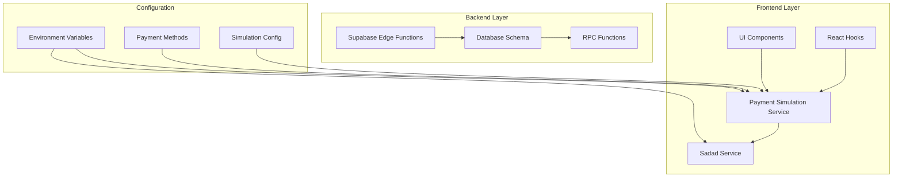
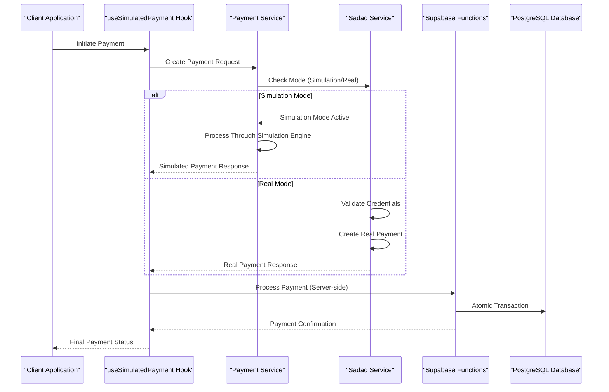
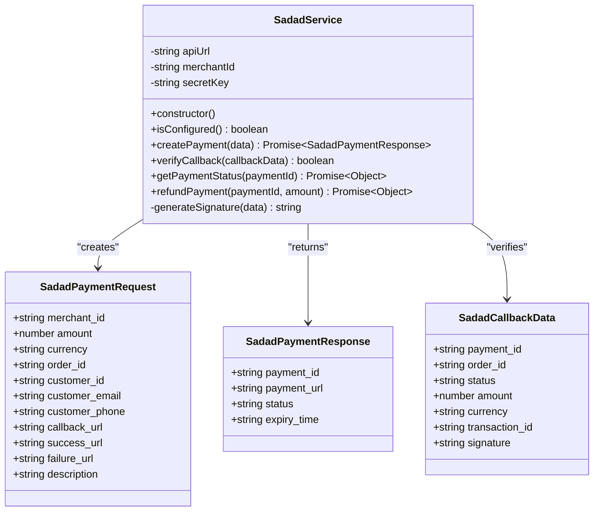
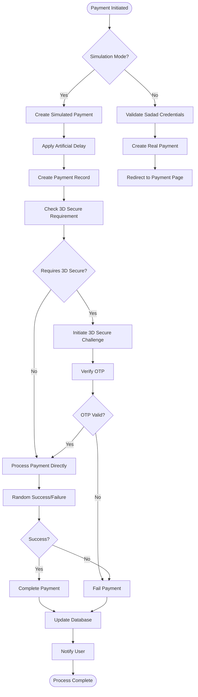
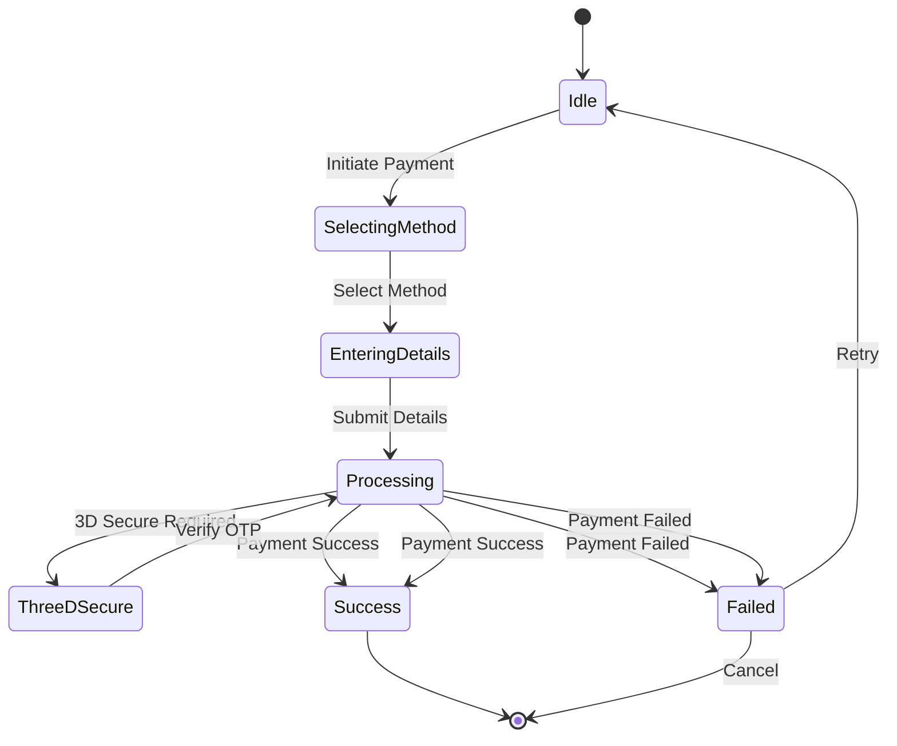
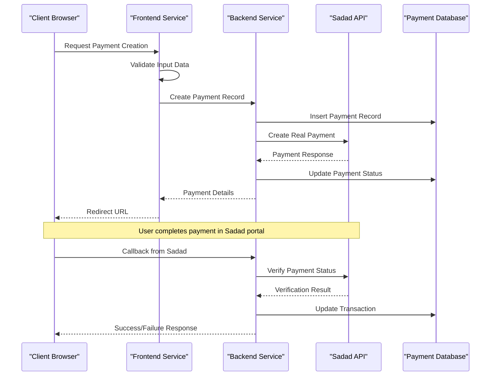
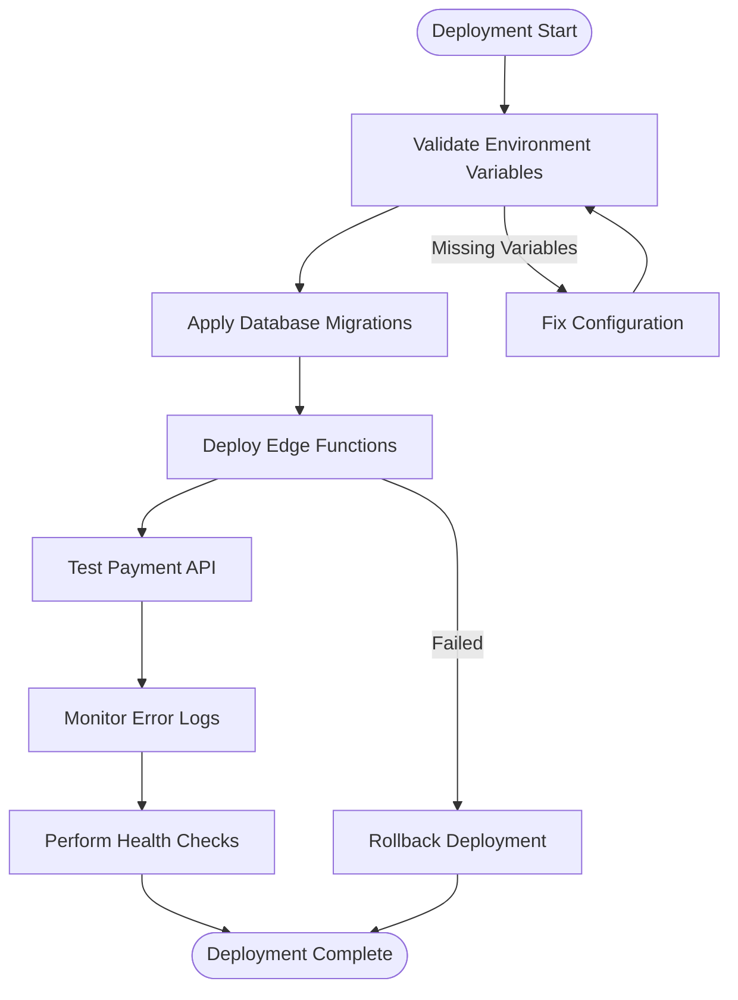

# Real Payment Gateway Integration

<cite>
**Referenced Files in This Document**
- [sadad.ts](file://src/lib/sadad.ts)
- [payment-simulation.ts](file://src/lib/payment-simulation.ts)
- [payment-simulation-config.ts](file://src/lib/payment-simulation-config.ts)
- [useSimulatedPayment.ts](file://src/hooks/useSimulatedPayment.ts)
- [simulate-payment/index.ts](file://supabase/functions/simulate-payment/index.ts)
- [PAYMENT_SIMULATION_SUMMARY.md](file://PAYMENT_SIMULATION_SUMMARY.md)
- [types.ts](file://supabase/types.ts)
- [20260218120000_wallet_system.sql](file://supabase/migrations/20260218120000_wallet_system.sql)
- [payment-processing-load.test.ts](file://tests/load/payment-processing-load.test.ts)
- [load-test-k6.js](file://scripts/load-test-k6.js)
- [deploy.mjs](file://deploy.mjs)
- [check-env.mjs](file://check-env.mjs)
</cite>

## Table of Contents
1. [Introduction](#introduction)
2. [Project Structure](#project-structure)
3. [Core Components](#core-components)
4. [Architecture Overview](#architecture-overview)
5. [Detailed Component Analysis](#detailed-component-analysis)
6. [Environment Configuration](#environment-configuration)
7. [Sadad API Integration Patterns](#sadad-api-integration-patterns)
8. [Merchant Account Setup](#merchant-account-setup)
9. [Security Compliance Requirements](#security-compliance-requirements)
10. [Transition from Simulation to Real Processing](#transition-from-simulation-to-real-processing)
11. [Error Handling and Fallback Mechanisms](#error-handling-and-fallback-mechanisms)
12. [Deployment Process](#deployment-process)
13. [Monitoring and Production Requirements](#monitoring-and-production-requirements)
14. [Performance Considerations](#performance-considerations)
15. [Troubleshooting Guide](#troubleshooting-guide)
16. [Conclusion](#conclusion)

## Introduction

This document provides comprehensive guidance for integrating real payment gateways, specifically the Sadad payment system, into the Nutrio platform. The project currently implements a sophisticated payment simulation system that mirrors real payment gateway behavior without requiring actual API credentials. This foundation enables seamless transition to real payment processing while maintaining development flexibility and thorough testing capabilities.

The integration encompasses both frontend and backend components, including environment variable configuration, API credential management, security compliance, and production deployment considerations. The system supports multiple payment methods including Sadad, credit cards, Apple Pay, and Google Pay, with comprehensive error handling and monitoring capabilities.

## Project Structure

The payment system is organized across three primary layers: frontend service layer, UI components, and backend edge functions. The structure ensures clean separation of concerns while maintaining flexibility for both simulation and real payment processing modes.

**Diagram sources**
- [sadad.ts:1-220](file://src/lib/sadad.ts#L1-L220)
- [payment-simulation.ts:1-223](file://src/lib/payment-simulation.ts#L1-L223)
- [simulate-payment/index.ts:1-119](file://supabase/functions/simulate-payment/index.ts#L1-L119)

**Section sources**
- [sadad.ts:1-220](file://src/lib/sadad.ts#L1-L220)
- [payment-simulation.ts:1-223](file://src/lib/payment-simulation.ts#L1-L223)
- [simulate-payment/index.ts:1-119](file://supabase/functions/simulate-payment/index.ts#L1-L119)

## Core Components

The payment system consists of several interconnected components that work together to provide a robust payment processing solution.

### Sadad Service Component
The core Sadad service handles all real payment gateway interactions, including payment creation, status verification, and refund processing. It manages API credentials through environment variables and implements proper error handling for production environments.

### Payment Simulation Service
A comprehensive simulation engine that replicates real payment gateway behavior for testing and development purposes. It provides realistic payment flows with configurable success rates, 3D Secure challenges, and progress tracking.

### UI Component Library
A complete set of React components designed to handle various payment scenarios, including method selection, form validation, progress indication, and result presentation. These components support both simulation and real payment modes seamlessly.

### Backend Edge Functions
Server-side functions that handle payment processing, wallet crediting, and database operations. These functions ensure atomic operations and proper transaction handling in production environments.

**Section sources**
- [sadad.ts:39-189](file://src/lib/sadad.ts#L39-L189)
- [payment-simulation.ts:25-209](file://src/lib/payment-simulation.ts#L25-L209)
- [payment-simulation-config.ts:4-79](file://src/lib/payment-simulation-config.ts#L4-L79)

## Architecture Overview

The payment architecture follows a hybrid approach that supports both simulation and real payment processing through a unified interface. This design enables smooth transitions between development and production environments.

**Diagram sources**
- [useSimulatedPayment.ts:73-132](file://src/hooks/useSimulatedPayment.ts#L73-L132)
- [sadad.ts:63-103](file://src/lib/sadad.ts#L63-L103)
- [simulate-payment/index.ts:28-118](file://supabase/functions/simulate-payment/index.ts#L28-L118)

The architecture ensures that payment processing remains consistent regardless of whether simulation or real payment mode is active, while providing appropriate error handling and user feedback throughout the process.

## Detailed Component Analysis

### Sadad Service Implementation

The Sadad service provides a complete interface for interacting with the Sadad payment gateway API. It handles authentication, payment creation, status verification, and refund processing with proper error handling.

**Diagram sources**
- [sadad.ts:8-37](file://src/lib/sadad.ts#L8-L37)

**Section sources**
- [sadad.ts:39-189](file://src/lib/sadad.ts#L39-L189)

### Payment Simulation Engine

The simulation engine provides a comprehensive testing framework that replicates real payment gateway behavior with configurable parameters for different testing scenarios.

**Diagram sources**
- [payment-simulation.ts:38-140](file://src/lib/payment-simulation.ts#L38-L140)

**Section sources**
- [payment-simulation.ts:25-209](file://src/lib/payment-simulation.ts#L25-L209)

### React Hook Integration

The `useSimulatedPayment` hook orchestrates the entire payment flow, managing state transitions, user interactions, and real-time updates throughout the payment process.

**Diagram sources**
- [useSimulatedPayment.ts:6-13](file://src/hooks/useSimulatedPayment.ts#L6-L13)

**Section sources**
- [useSimulatedPayment.ts:22-188](file://src/hooks/useSimulatedPayment.ts#L22-L188)

## Environment Configuration

The payment system relies on environment variables for configuration, supporting both development and production environments with appropriate security measures.

### Required Environment Variables

| Variable | Purpose | Example Value |
|----------|---------|---------------|
| `VITE_SADAD_API_URL` | Sadad API endpoint | `https://api.sadad.qa` |
| `VITE_SADAD_MERCHANT_ID` | Merchant account identifier | `MERCHANT_12345` |
| `VITE_SADAD_SECRET_KEY` | API authentication key | `sk_live_...` |
| `VITE_ENABLE_PAYMENT_SIMULATION` | Toggle simulation mode | `true` |

### Configuration Management

The system implements a layered configuration approach that prioritizes environment-specific settings while maintaining development flexibility.

**Section sources**
- [PAYMENT_SIMULATION_SUMMARY.md:108-137](file://PAYMENT_SIMULATION_SUMMARY.md#L108-L137)
- [sadad.ts:4-6](file://src/lib/sadad.ts#L4-L6)

## Sadad API Integration Patterns

The Sadad integration follows established payment gateway patterns with emphasis on security, reliability, and user experience.

### Payment Creation Flow

The payment creation process involves several critical steps to ensure proper transaction handling and user redirection.

**Diagram sources**
- [sadad.ts:63-103](file://src/lib/sadad.ts#L63-L103)
- [simulate-payment/index.ts:28-118](file://supabase/functions/simulate-payment/index.ts#L28-L118)

### Security Implementation

The integration implements multiple security layers including API key management, signature verification, and secure communication protocols.

**Section sources**
- [sadad.ts:105-131](file://src/lib/sadad.ts#L105-L131)
- [20260218120000_wallet_system.sql:625-665](file://supabase/migrations/20260218120000_wallet_system.sql#L625-L665)

## Merchant Account Setup

Establishing a Sadad merchant account involves several steps to ensure proper integration and operational readiness.

### Merchant Registration Process

1. **Account Application**: Complete Sadad merchant registration form with business information
2. **Documentation Submission**: Provide required business documents and identification
3. **Technical Setup**: Configure API credentials and webhook endpoints
4. **Testing Configuration**: Set up sandbox environment for development testing
5. **Production Activation**: Review and approve production environment setup

### API Credential Management

The system requires secure management of API credentials with rotation and access control policies.

**Section sources**
- [PAYMENT_SIMULATION_SUMMARY.md:127-144](file://PAYMENT_SIMULATION_SUMMARY.md#L127-L144)

## Security Compliance Requirements

The payment system adheres to industry-standard security practices and compliance requirements for payment processing.

### PCI DSS Compliance

The integration follows PCI DSS guidelines by avoiding sensitive card data storage and processing through secure channels.

### Data Protection Measures

- **Encryption**: All API communications use HTTPS/TLS encryption
- **Tokenization**: Sensitive data is tokenized and never stored
- **Access Control**: Principle of least privilege for API access
- **Audit Logging**: Comprehensive logging of all payment-related activities

### Authentication and Authorization

The system implements multi-layered authentication including API key validation, signature verification, and user session management.

**Section sources**
- [20260218120000_wallet_system.sql:640-655](file://supabase/migrations/260218120000_wallet_system.sql#L640-L655)

## Transition from Simulation to Real Processing

The transition from simulation mode to real payment processing is designed to be seamless with minimal code changes required.

### Configuration Switching

The system provides a simple mechanism to switch between simulation and real payment modes through environment variable configuration.

### Code Integration Points

The transition affects primarily the payment service initialization and environment variable loading, with the rest of the application architecture remaining unchanged.

**Section sources**
- [PAYMENT_SIMULATION_SUMMARY.md:127-144](file://PAYMENT_SIMULATION_SUMMARY.md#L127-L144)
- [payment-simulation-config.ts:23-30](file://src/lib/payment-simulation-config.ts#L23-L30)

## Error Handling and Fallback Mechanisms

The payment system implements comprehensive error handling strategies to ensure reliable operation in production environments.

### Error Classification

Payment errors are categorized into several types with appropriate handling strategies:

- **Network Errors**: Temporary connectivity issues with automatic retry
- **Validation Errors**: Input validation failures with user-friendly error messages
- **Gateway Errors**: Sadad API errors with detailed logging and escalation
- **System Errors**: Internal system failures with graceful degradation

### Fallback Strategies

The system implements multiple fallback mechanisms to maintain service availability:

- **Graceful Degradation**: Continue operations with reduced functionality
- **Circuit Breaker**: Temporarily disable failing components
- **Retry Logic**: Intelligent retry with exponential backoff
- **User Communication**: Clear error messaging and recovery options

**Section sources**
- [payment-simulation.ts:128-139](file://src/lib/payment-simulation.ts#L128-L139)
- [simulate-payment/index.ts:112-118](file://supabase/functions/simulate-payment/index.ts#L112-L118)

## Deployment Process

The deployment process ensures secure and reliable payment processing in production environments.

### Pre-deployment Checklist

1. **Environment Configuration**: Verify all production environment variables are set
2. **Database Migration**: Apply all pending database migrations
3. **Edge Function Deployment**: Deploy payment processing functions
4. **SSL Certificate**: Ensure proper SSL certificate installation
5. **Monitoring Setup**: Configure error tracking and performance monitoring

### Production Deployment Steps

**Diagram sources**
- [deploy.mjs:1-90](file://deploy.mjs#L1-L90)

**Section sources**
- [deploy.mjs:1-90](file://deploy.mjs#L1-L90)
- [check-env.mjs:1-51](file://check-env.mjs#L1-L51)

## Monitoring and Production Requirements

Production payment systems require comprehensive monitoring and alerting to ensure reliability and security.

### Performance Monitoring

Key performance indicators include:

- **Transaction Latency**: Payment processing time metrics
- **Success Rate**: Payment approval percentage
- **Error Rates**: Failure rate by error category
- **Throughput**: Transactions per second processed

### Security Monitoring

Security monitoring focuses on:

- **Unusual Activity**: Suspicious payment patterns and volumes
- **API Abuse**: Rate limiting violations and abuse attempts
- **Data Access**: Unauthorized access attempts to payment data
- **Credential Compromise**: Detection of leaked or compromised credentials

### Alerting Configuration

The system should implement multi-level alerting:

- **Critical Alerts**: System outages and major failures
- **Warning Alerts**: Performance degradation and unusual patterns
- **Informational Alerts**: Routine maintenance and status changes

**Section sources**
- [payment-processing-load.test.ts:109-157](file://tests/load/payment-processing-load.test.ts#L109-L157)
- [load-test-k6.js:83-116](file://scripts/load-test-k6.js#L83-L116)

## Performance Considerations

The payment system is designed to handle high transaction volumes while maintaining responsive user experiences.

### Scalability Architecture

The system employs several scalability strategies:

- **Database Optimization**: Proper indexing and query optimization
- **Connection Pooling**: Efficient database connection management
- **Caching Strategy**: Strategic caching of frequently accessed data
- **Asynchronous Processing**: Non-blocking operations for long-running tasks

### Load Testing Framework

The existing load testing infrastructure supports:

- **Concurrent Payment Processing**: Testing under high transaction volumes
- **Double-Spending Prevention**: Validating atomic operation correctness
- **Error Scenario Testing**: Simulating various failure conditions
- **Performance Baseline**: Establishing performance benchmarks

**Section sources**
- [payment-processing-load.test.ts:90-157](file://tests/load/payment-processing-load.test.ts#L90-L157)
- [load-test-k6.js:39-128](file://scripts/load-test-k6.js#L39-L128)

## Troubleshooting Guide

Common issues and their resolution strategies for payment system maintenance.

### Environment Configuration Issues

**Problem**: Payments fail with "Not configured" errors
**Solution**: Verify all required environment variables are set and accessible

**Problem**: Simulation mode not working correctly
**Solution**: Check `VITE_ENABLE_PAYMENT_SIMULATION` value and related configuration

### Database Connectivity Problems

**Problem**: Payment records not persisting
**Solution**: Verify database connection settings and migration status

**Problem**: Wallet crediting not occurring
**Solution**: Check `credit_wallet` RPC function availability and permissions

### API Integration Challenges

**Problem**: Sadad API authentication failures
**Solution**: Validate merchant ID and secret key configuration

**Problem**: Payment callbacks not received
**Solution**: Verify webhook endpoint configuration and SSL certificate

**Section sources**
- [PAYMENT_SIMULATION_SUMMARY.md:175-188](file://PAYMENT_SIMULATION_SUMMARY.md#L175-L188)
- [check-env.mjs:29-51](file://check-env.mjs#L29-L51)

## Conclusion

The Nutrio payment system provides a robust foundation for Sadad payment gateway integration with comprehensive simulation capabilities, security compliance, and production-ready architecture. The modular design enables seamless transition from development to production while maintaining flexibility for future enhancements.

Key strengths of the implementation include:

- **Seamless Integration**: Minimal code changes required for switching between simulation and real modes
- **Comprehensive Testing**: Extensive simulation framework supporting various payment scenarios
- **Production Readiness**: Complete monitoring, error handling, and security compliance
- **Scalability**: Designed to handle high transaction volumes with proper performance optimization

The system successfully balances development flexibility with production reliability, providing a solid foundation for real payment gateway integration while maintaining the ability to thoroughly test and validate payment processing workflows.