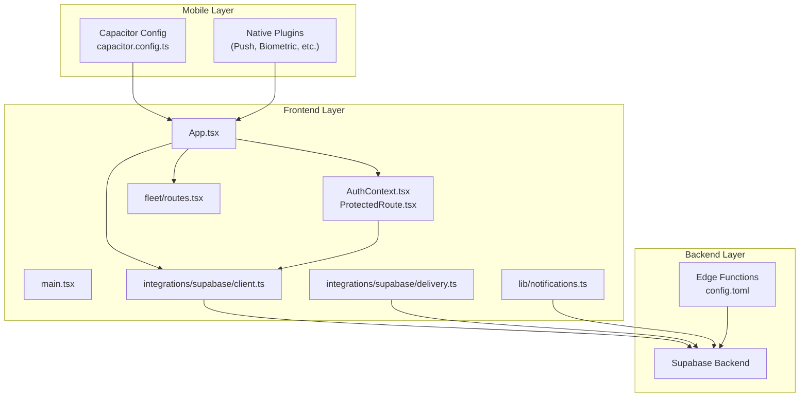
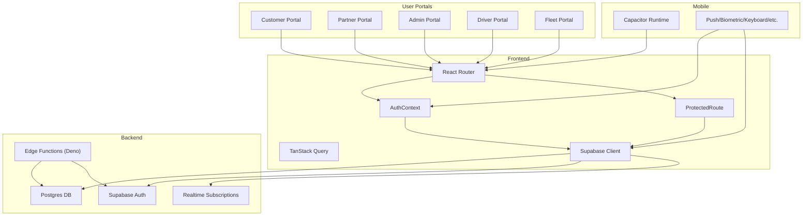
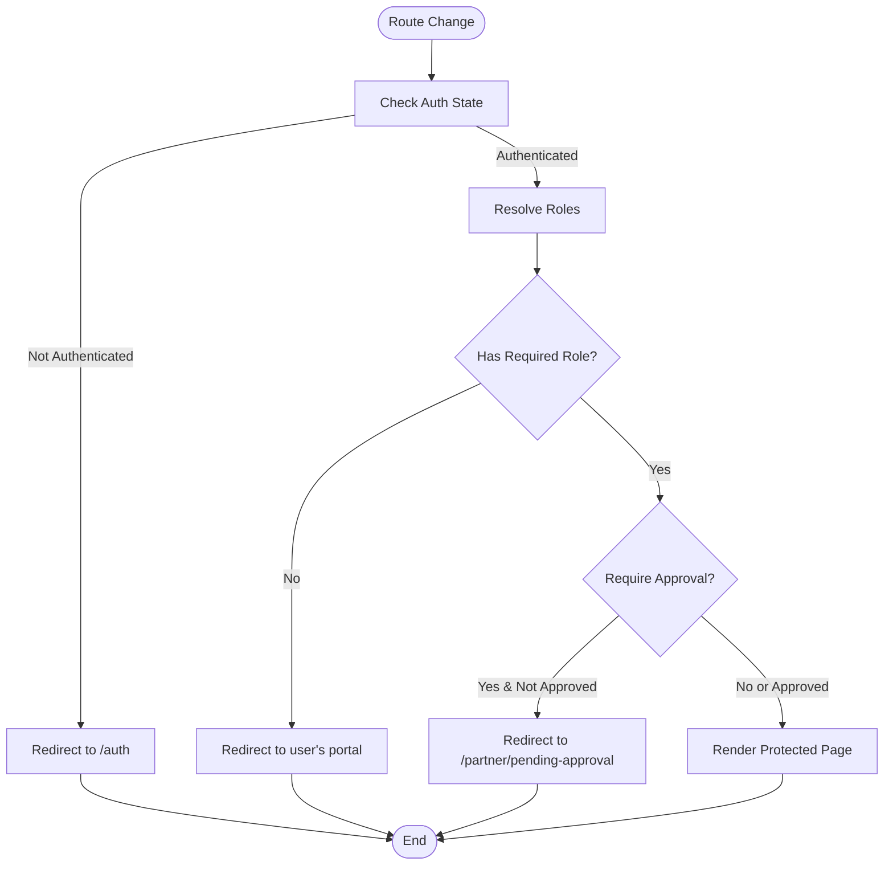
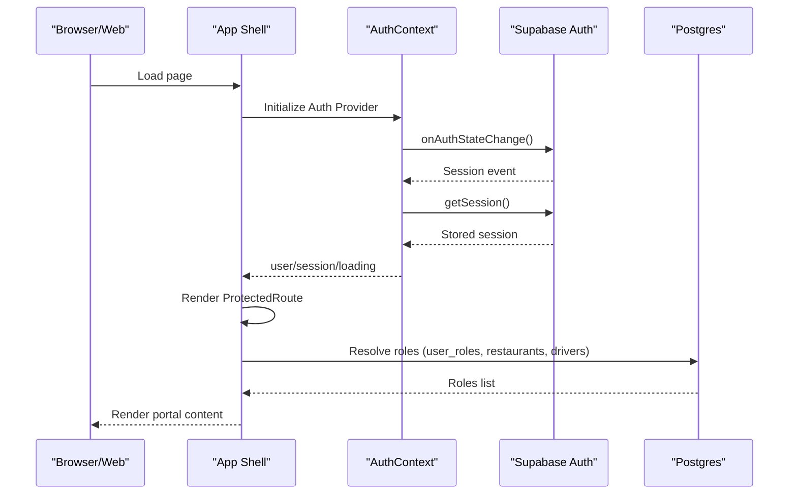
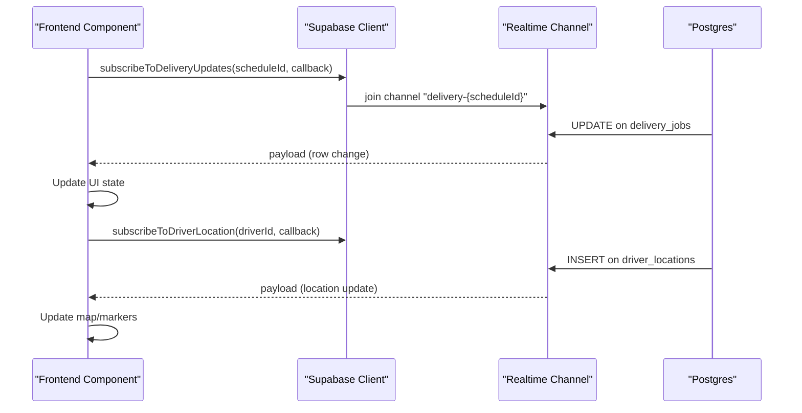
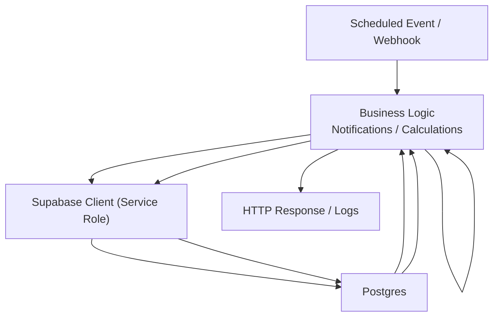
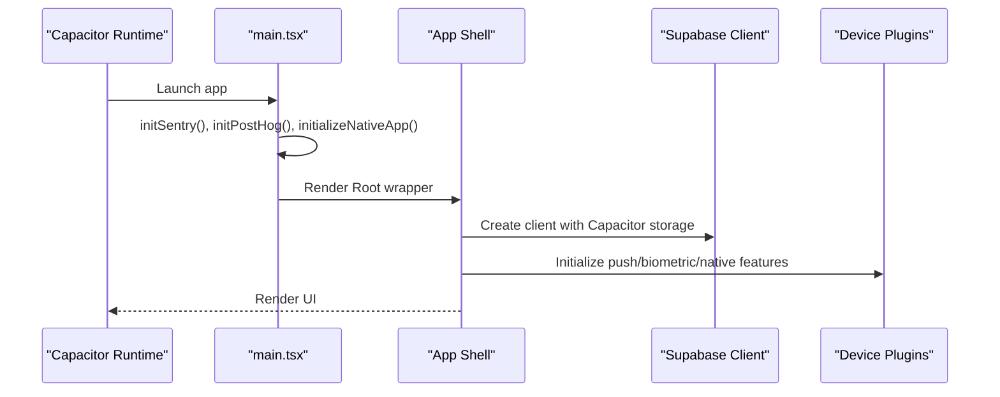
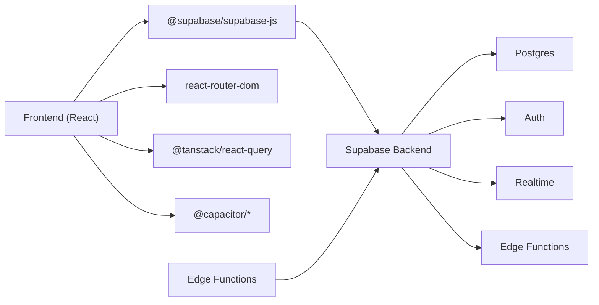

# Architecture Overview

<cite>
**Referenced Files in This Document**
- [App.tsx](file://src/App.tsx)
- [main.tsx](file://src/main.tsx)
- [AuthContext.tsx](file://src/contexts/AuthContext.tsx)
- [ProtectedRoute.tsx](file://src/components/ProtectedRoute.tsx)
- [client.ts](file://src/integrations/supabase/client.ts)
- [delivery.ts](file://src/integrations/supabase/delivery.ts)
- [notifications.ts](file://src/lib/notifications.ts)
- [capacitor.config.ts](file://capacitor.config.ts)
- [package.json](file://package.json)
- [config.toml](file://supabase/config.toml)
- [send-meal-reminders/index.ts](file://supabase/functions/send-meal-reminders/index.ts)
- [routes.tsx](file://src/fleet/routes.tsx)
</cite>

## Table of Contents
1. [Introduction](#introduction)
2. [Project Structure](#project-structure)
3. [Core Components](#core-components)
4. [Architecture Overview](#architecture-overview)
5. [Detailed Component Analysis](#detailed-component-analysis)
6. [Dependency Analysis](#dependency-analysis)
7. [Performance Considerations](#performance-considerations)
8. [Troubleshooting Guide](#troubleshooting-guide)
9. [Conclusion](#conclusion)

## Introduction
This document describes the Nutrio platform architecture with a focus on the multi-portal system design and component interactions. The platform comprises:
- A React single-page application with multi-tenant routing across customer, partner, admin, driver, and fleet portals
- A Supabase backend providing authentication, relational data, and edge functions
- Native mobile applications powered by Capacitor for Android and iOS
- Real-time data synchronization via Supabase Realtime and WebSocket connections
- Role-based access control (RBAC) spanning all user portals
- Microservices implemented as Supabase edge functions

## Project Structure
The repository is organized around a frontend monorepo with shared components, contexts, integrations, and hooks, plus a Supabase backend with edge functions and configuration. Native mobile builds are integrated via Capacitor.

**Diagram sources**
- [App.tsx:139-739](file://src/App.tsx#L139-L739)
- [main.tsx:20-50](file://src/main.tsx#L20-L50)
- [AuthContext.tsx:31-131](file://src/contexts/AuthContext.tsx#L31-L131)
- [ProtectedRoute.tsx:139-230](file://src/components/ProtectedRoute.tsx#L139-L230)
- [client.ts:47-57](file://src/integrations/supabase/client.ts#L47-L57)
- [delivery.ts:695-734](file://src/integrations/supabase/delivery.ts#L695-L734)
- [notifications.ts:18-35](file://src/lib/notifications.ts#L18-L35)
- [routes.tsx:20-42](file://src/fleet/routes.tsx#L20-L42)
- [capacitor.config.ts:3-45](file://capacitor.config.ts#L3-L45)
- [config.toml:1-59](file://supabase/config.toml#L1-L59)

**Section sources**
- [App.tsx:139-739](file://src/App.tsx#L139-L739)
- [main.tsx:20-50](file://src/main.tsx#L20-L50)
- [capacitor.config.ts:3-45](file://capacitor.config.ts#L3-L45)
- [package.json:44-127](file://package.json#L44-L127)

## Core Components
- App shell and routing: Defines portal-specific routes and wraps protected content with layout providers and guards.
- Authentication and RBAC: Centralized provider manages session state and role resolution with caching and approval checks.
- Supabase integration: Typed client with Capacitor-native storage and Realtime subscriptions.
- Edge functions: Serverless microservices for notifications, analytics, and operational tasks.
- Native mobile integration: Capacitor configuration and plugin wrappers for push, biometrics, and device APIs.

**Section sources**
- [App.tsx:139-739](file://src/App.tsx#L139-L739)
- [AuthContext.tsx:31-131](file://src/contexts/AuthContext.tsx#L31-L131)
- [ProtectedRoute.tsx:139-230](file://src/components/ProtectedRoute.tsx#L139-L230)
- [client.ts:47-57](file://src/integrations/supabase/client.ts#L47-L57)
- [config.toml:1-59](file://supabase/config.toml#L1-L59)
- [capacitor.config.ts:3-45](file://capacitor.config.ts#L3-L45)

## Architecture Overview
The system follows a layered architecture:
- Frontend layer: React SPA with React Router, TanStack Query for caching, and Supabase client for auth/data/realtime.
- Backend layer: Supabase providing Postgres, Auth, Storage, and Edge Functions (Deno runtime).
- Mobile layer: Capacitor-powered native apps with device plugins and secure storage.

**Diagram sources**
- [App.tsx:139-739](file://src/App.tsx#L139-L739)
- [AuthContext.tsx:31-131](file://src/contexts/AuthContext.tsx#L31-L131)
- [ProtectedRoute.tsx:139-230](file://src/components/ProtectedRoute.tsx#L139-L230)
- [client.ts:47-57](file://src/integrations/supabase/client.ts#L47-L57)
- [config.toml:1-59](file://supabase/config.toml#L1-L59)
- [capacitor.config.ts:3-45](file://capacitor.config.ts#L3-L45)

## Detailed Component Analysis

### Multi-Portal Routing and Layouts
- The App defines routes per portal, with lazy-loaded pages and protected routes. Customer routes are wrapped in a layout container, while admin, partner, driver, and fleet routes use dedicated layouts and nested routes.
- ProtectedRoute enforces role-based access and optional approval checks for partner routes, with role caching to reduce repeated database queries.

**Diagram sources**
- [ProtectedRoute.tsx:139-230](file://src/components/ProtectedRoute.tsx#L139-L230)
- [App.tsx:174-724](file://src/App.tsx#L174-L724)

**Section sources**
- [App.tsx:174-724](file://src/App.tsx#L174-L724)
- [ProtectedRoute.tsx:139-230](file://src/components/ProtectedRoute.tsx#L139-L230)

### Authentication and Authorization Flow
- AuthContext initializes Supabase auth listeners and session persistence. It supports sign-up/sign-in and integrates IP location checks before login.
- ProtectedRoute resolves user roles from multiple sources (roles table, ownership of restaurants, driver records) and caches results. It redirects unauthorized users to appropriate dashboards.

**Diagram sources**
- [AuthContext.tsx:36-61](file://src/contexts/AuthContext.tsx#L36-L61)
- [AuthContext.tsx:63-118](file://src/contexts/AuthContext.tsx#L63-L118)
- [ProtectedRoute.tsx:40-98](file://src/components/ProtectedRoute.tsx#L40-L98)

**Section sources**
- [AuthContext.tsx:31-131](file://src/contexts/AuthContext.tsx#L31-L131)
- [ProtectedRoute.tsx:139-230](file://src/components/ProtectedRoute.tsx#L139-L230)

### Real-Time Data Synchronization
- Supabase Realtime enables live updates for delivery jobs and driver locations. The frontend subscribes to channels and reacts to row-level changes.
- Notifications are persisted to the database and can trigger push notifications via edge functions.

**Diagram sources**
- [delivery.ts:695-734](file://src/integrations/supabase/delivery.ts#L695-L734)
- [notifications.ts:18-35](file://src/lib/notifications.ts#L18-L35)

**Section sources**
- [delivery.ts:695-734](file://src/integrations/supabase/delivery.ts#L695-L734)
- [notifications.ts:18-35](file://src/lib/notifications.ts#L18-L35)

### Supabase Edge Functions and Microservices
- Edge functions are Deno-based and deployed under Supabase Functions. They encapsulate domain logic such as sending meal reminders, processing subscriptions, and managing notifications.
- The configuration file controls JWT verification flags per function.

**Diagram sources**
- [send-meal-reminders/index.ts:29-228](file://supabase/functions/send-meal-reminders/index.ts#L29-L228)
- [config.toml:1-59](file://supabase/config.toml#L1-L59)

**Section sources**
- [send-meal-reminders/index.ts:29-228](file://supabase/functions/send-meal-reminders/index.ts#L29-L228)
- [config.toml:1-59](file://supabase/config.toml#L1-L59)

### Native Mobile Applications
- Capacitor configuration allows the web app to run natively on Android and iOS, with secure storage for sessions and device plugin integrations for push notifications, biometrics, and keyboard behavior.
- The main entry initializes monitoring, native app setup, and language provider before rendering the App shell.

**Diagram sources**
- [main.tsx:13-50](file://src/main.tsx#L13-L50)
- [client.ts:47-57](file://src/integrations/supabase/client.ts#L47-L57)
- [capacitor.config.ts:3-45](file://capacitor.config.ts#L3-L45)

**Section sources**
- [main.tsx:13-50](file://src/main.tsx#L13-L50)
- [capacitor.config.ts:3-45](file://capacitor.config.ts#L3-L45)
- [client.ts:47-57](file://src/integrations/supabase/client.ts#L47-L57)

## Dependency Analysis
- Frontend depends on Supabase JS SDK, React Router, TanStack Query, and Capacitor plugins.
- Supabase provides the backend primitives: Auth, Postgres, Realtime, and Functions.
- Edge functions depend on Supabase service role keys and environment variables.

**Diagram sources**
- [package.json:93, 120, 122:93-122](file://package.json#L93-L122)
- [config.toml:1-59](file://supabase/config.toml#L1-L59)

**Section sources**
- [package.json:44-127](file://package.json#L44-L127)
- [config.toml:1-59](file://supabase/config.toml#L1-L59)

## Performance Considerations
- Role caching: ProtectedRoute caches resolved roles to minimize repeated database queries.
- Lazy loading: Routes use lazy-loaded components to reduce initial bundle size.
- TanStack Query: Centralized caching and background refetching improve perceived performance.
- Capacitor storage: Uses native preferences to avoid web storage limitations on mobile devices.
- Edge functions: Serverless compute reduces cold starts by keeping functions warm and leveraging Supabase’s infrastructure.

[No sources needed since this section provides general guidance]

## Troubleshooting Guide
- Authentication failures: Verify Supabase URL and publishable key are present in the build environment; check AuthContext initialization and session persistence.
- Role resolution issues: Confirm user_roles, restaurants, and drivers tables contain expected data; review ProtectedRoute role cache TTL and invalidation.
- Realtime connectivity: Ensure channels are joined after authentication; verify filters and schema/table names in subscriptions.
- Edge function errors: Inspect logs for function-specific errors; validate environment variables and JWT verification settings.
- Native app issues: Confirm Capacitor configuration allows navigation to Supabase domains and plugins are initialized before use.

**Section sources**
- [client.ts:10-16](file://src/integrations/supabase/client.ts#L10-L16)
- [AuthContext.tsx:36-61](file://src/contexts/AuthContext.tsx#L36-L61)
- [ProtectedRoute.tsx:40-98](file://src/components/ProtectedRoute.tsx#L40-L98)
- [delivery.ts:695-734](file://src/integrations/supabase/delivery.ts#L695-L734)
- [config.toml:1-59](file://supabase/config.toml#L1-L59)
- [capacitor.config.ts:7-17](file://capacitor.config.ts#L7-L17)

## Conclusion
Nutrio’s architecture leverages a React frontend with multi-portal routing, Supabase as the unified backend, and Capacitor for native experiences. Role-based access control is enforced centrally, while Supabase Realtime and edge functions enable responsive, scalable data flows. This design balances developer productivity with strong separation of concerns across frontend, backend, and mobile layers.