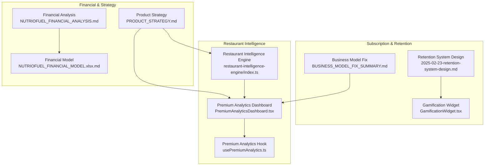
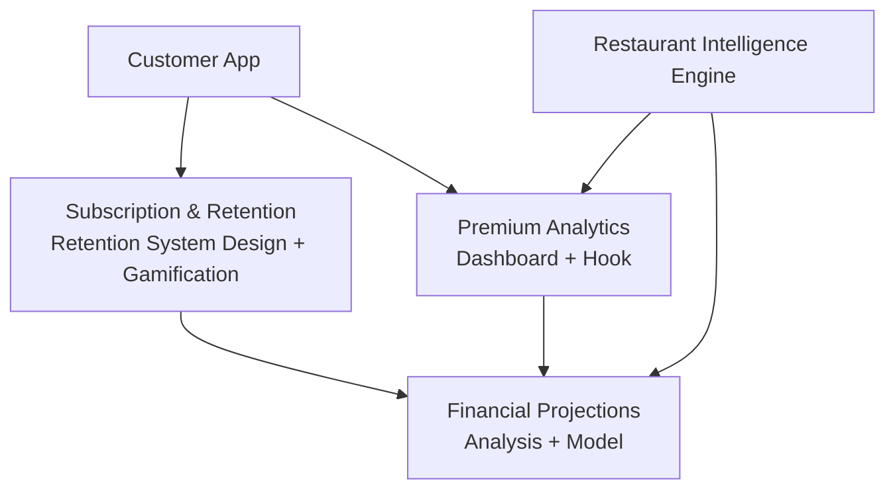
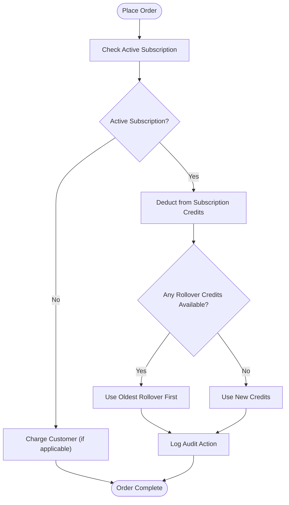
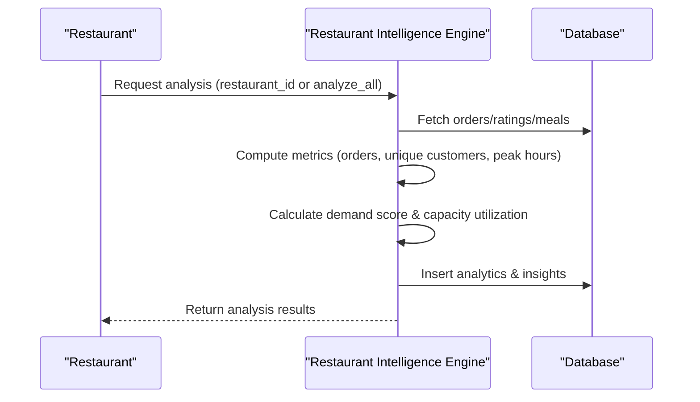
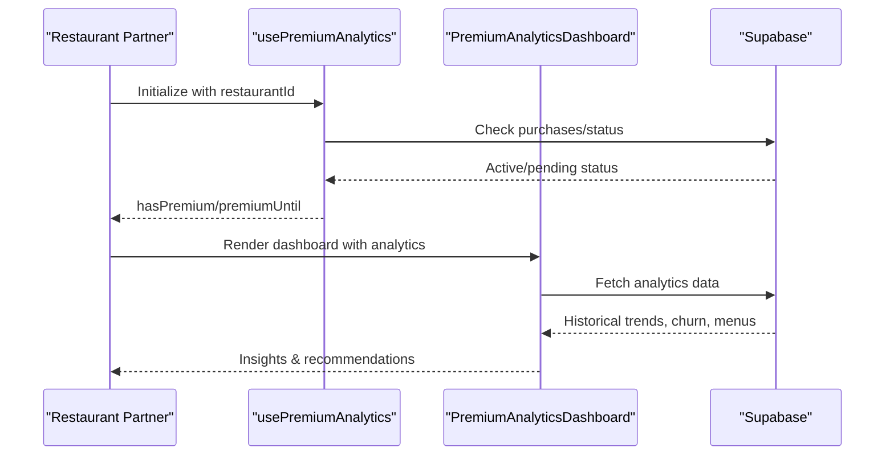
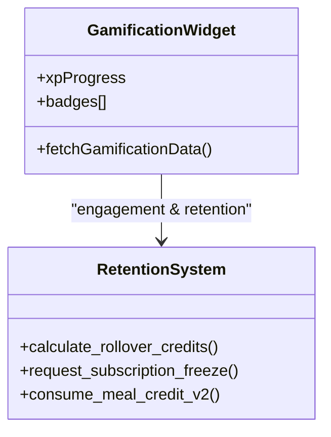
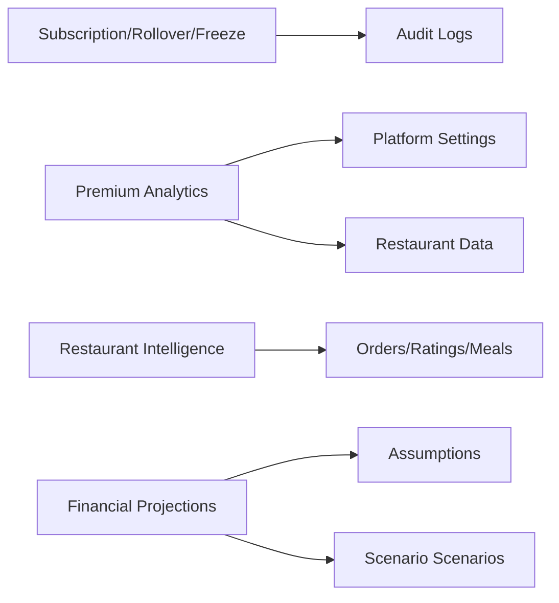

# Business Model

<cite>
**Referenced Files in This Document**
- [NUTRIOFUEL_FINANCIAL_ANALYSIS.md](file://NUTRIOFUEL_FINANCIAL_ANALYSIS.md)
- [NUTRIOFUEL_FINANCIAL_MODEL.xlsx.md](file://NUTRIOFUEL_FINANCIAL_MODEL.xlsx.md)
- [BUSINESS_MODEL_FIX_SUMMARY.md](file://BUSINESS_MODEL_FIX_SUMMARY.md)
- [PRODUCT_STRATEGY.md](file://docs/PRODUCT_STRATEGY.md)
- [2025-02-23-retention-system-design.md](file://docs/plans/2025-02-23-retention-system-design.md)
- [restaurant-intelligence-engine/index.ts](file://supabase/functions/restaurant-intelligence-engine/index.ts)
- [GamificationWidget.tsx](file://src/components/GamificationWidget.tsx)
- [PremiumAnalyticsDashboard.tsx](file://src/components/PremiumAnalyticsDashboard.tsx)
- [usePremiumAnalytics.ts](file://src/hooks/usePremiumAnalytics.ts)
</cite>

## Table of Contents
1. [Introduction](#introduction)
2. [Project Structure](#project-structure)
3. [Core Components](#core-components)
4. [Architecture Overview](#architecture-overview)
5. [Detailed Component Analysis](#detailed-component-analysis)
6. [Dependency Analysis](#dependency-analysis)
7. [Performance Considerations](#performance-considerations)
8. [Troubleshooting Guide](#troubleshooting-guide)
9. [Conclusion](#conclusion)
10. [Appendices](#appendices)

## Introduction
This document presents the Nutrio business model with a focus on multi-faceted revenue streams, operational strategy, and monetization levers. The platform operates as a healthy meal delivery marketplace with a pure subscription model for consumers, complemented by premium analytics services for restaurants, and ancillary monetization via delivery and affiliate programs. The strategy emphasizes unit economics excellence, retention through adaptive goals and gamification, and scalable technology to power growth across markets.

## Project Structure
The business model is implemented across:
- Financial planning and projections (Excel/Markdown)
- Product strategy and roadmap
- Subscription and retention system design
- Restaurant intelligence and analytics
- Customer-facing gamification and premium analytics

**Diagram sources**
- [NUTRIOFUEL_FINANCIAL_ANALYSIS.md:1-1098](file://NUTRIOFUEL_FINANCIAL_ANALYSIS.md#L1-L1098)
- [NUTRIOFUEL_FINANCIAL_MODEL.xlsx.md:1-592](file://NUTRIOFUEL_FINANCIAL_MODEL.xlsx.md#L1-L592)
- [BUSINESS_MODEL_FIX_SUMMARY.md:1-249](file://BUSINESS_MODEL_FIX_SUMMARY.md#L1-L249)
- [2025-02-23-retention-system-design.md:1-1189](file://docs/plans/2025-02-23-retention-system-design.md#L1-L1189)
- [GamificationWidget.tsx:1-295](file://src/components/GamificationWidget.tsx#L1-L295)
- [restaurant-intelligence-engine/index.ts:1-422](file://supabase/functions/restaurant-intelligence-engine/index.ts#L1-L422)
- [PremiumAnalyticsDashboard.tsx:1-1443](file://src/components/PremiumAnalyticsDashboard.tsx#L1-L1443)
- [usePremiumAnalytics.ts:1-118](file://src/hooks/usePremiumAnalytics.ts#L1-L118)

**Section sources**
- [NUTRIOFUEL_FINANCIAL_ANALYSIS.md:1-1098](file://NUTRIOFUEL_FINANCIAL_ANALYSIS.md#L1-L1098)
- [NUTRIOFUEL_FINANCIAL_MODEL.xlsx.md:1-592](file://NUTRIOFUEL_FINANCIAL_MODEL.xlsx.md#L1-L592)
- [BUSINESS_MODEL_FIX_SUMMARY.md:1-249](file://BUSINESS_MODEL_FIX_SUMMARY.md#L1-L249)
- [PRODUCT_STRATEGY.md:1-1057](file://docs/PRODUCT_STRATEGY.md#L1-L1057)
- [2025-02-23-retention-system-design.md:1-1189](file://docs/plans/2025-02-23-retention-system-design.md#L1-L1189)
- [restaurant-intelligence-engine/index.ts:1-422](file://supabase/functions/restaurant-intelligence-engine/index.ts#L1-L422)
- [GamificationWidget.tsx:1-295](file://src/components/GamificationWidget.tsx#L1-L295)
- [PremiumAnalyticsDashboard.tsx:1-1443](file://src/components/PremiumAnalyticsDashboard.tsx#L1-L1443)
- [usePremiumAnalytics.ts:1-118](file://src/hooks/usePremiumAnalytics.ts#L1-L118)

## Core Components
- Pure subscription business model for consumers with tiered plans and unlimited or high-volume allowances for premium tiers.
- Restaurant intelligence and analytics powered by AI to balance demand, optimize capacity, and surface actionable insights.
- Premium analytics dashboard for restaurants with forecasting, churn detection, menu performance, and operational insights.
- Retention and engagement features including rollover credits, subscription freeze, and gamification badges.
- Ancillary monetization via delivery fees, affiliate commissions, and premium analytics subscriptions.

**Section sources**
- [BUSINESS_MODEL_FIX_SUMMARY.md:1-249](file://BUSINESS_MODEL_FIX_SUMMARY.md#L1-L249)
- [NUTRIOFUEL_FINANCIAL_ANALYSIS.md:165-317](file://NUTRIOFUEL_FINANCIAL_ANALYSIS.md#L165-L317)
- [PremiumAnalyticsDashboard.tsx:1-1443](file://src/components/PremiumAnalyticsDashboard.tsx#L1-L1443)
- [restaurant-intelligence-engine/index.ts:1-422](file://supabase/functions/restaurant-intelligence-engine/index.ts#L1-L422)
- [2025-02-23-retention-system-design.md:1-1189](file://docs/plans/2025-02-23-retention-system-design.md#L1-L1189)
- [GamificationWidget.tsx:1-295](file://src/components/GamificationWidget.tsx#L1-L295)

## Architecture Overview
The business model integrates consumer-facing subscription flows, restaurant-side analytics, and backend AI functions to drive monetization and retention.

**Diagram sources**
- [2025-02-23-retention-system-design.md:1-1189](file://docs/plans/2025-02-23-retention-system-design.md#L1-L1189)
- [GamificationWidget.tsx:1-295](file://src/components/GamificationWidget.tsx#L1-L295)
- [PremiumAnalyticsDashboard.tsx:1-1443](file://src/components/PremiumAnalyticsDashboard.tsx#L1-L1443)
- [usePremiumAnalytics.ts:1-118](file://src/hooks/usePremiumAnalytics.ts#L1-L118)
- [restaurant-intelligence-engine/index.ts:1-422](file://supabase/functions/restaurant-intelligence-engine/index.ts#L1-L422)
- [NUTRIOFUEL_FINANCIAL_ANALYSIS.md:1-1098](file://NUTRIOFUEL_FINANCIAL_ANALYSIS.md#L1-L1098)
- [NUTRIOFUEL_FINANCIAL_MODEL.xlsx.md:1-592](file://NUTRIOFUEL_FINANCIAL_MODEL.xlsx.md#L1-L592)

## Detailed Component Analysis

### Subscription-Based Meal Plans
- Pure subscription model with tiered plans and unlimited allowances for premium tiers.
- Weekly rollover credits and freeze mechanisms to reduce churn and maintain engagement.
- Subscription lifecycle managed with billing cycles, credits tracking, and audit logs.

**Diagram sources**
- [2025-02-23-retention-system-design.md:575-722](file://docs/plans/2025-02-23-retention-system-design.md#L575-L722)

**Section sources**
- [BUSINESS_MODEL_FIX_SUMMARY.md:1-249](file://BUSINESS_MODEL_FIX_SUMMARY.md#L1-L249)
- [2025-02-23-retention-system-design.md:1-1189](file://docs/plans/2025-02-23-retention-system-design.md#L1-L1189)

### Restaurant Intelligence Engine
- AI-driven analysis of restaurant demand, capacity utilization, and growth trends.
- Generates insights to balance demand across restaurants and guide capacity decisions.

**Diagram sources**
- [restaurant-intelligence-engine/index.ts:193-421](file://supabase/functions/restaurant-intelligence-engine/index.ts#L193-L421)

**Section sources**
- [restaurant-intelligence-engine/index.ts:1-422](file://supabase/functions/restaurant-intelligence-engine/index.ts#L1-L422)

### Premium Analytics Services
- Restaurant dashboard with forecasting, churn detection, menu performance, and demand calendars.
- Subscription-based premium analytics with flexible pricing tiers.

**Diagram sources**
- [usePremiumAnalytics.ts:1-118](file://src/hooks/usePremiumAnalytics.ts#L1-L118)
- [PremiumAnalyticsDashboard.tsx:1-1443](file://src/components/PremiumAnalyticsDashboard.tsx#L1-L1443)

**Section sources**
- [PremiumAnalyticsDashboard.tsx:1-1443](file://src/components/PremiumAnalyticsDashboard.tsx#L1-L1443)
- [usePremiumAnalytics.ts:1-118](file://src/hooks/usePremiumAnalytics.ts#L1-L118)

### Retention and Gamification
- Gamification widget with XP, levels, and badges to encourage engagement.
- Retention features: rollover credits, freeze requests, and health scoring.

**Diagram sources**
- [GamificationWidget.tsx:1-295](file://src/components/GamificationWidget.tsx#L1-L295)
- [2025-02-23-retention-system-design.md:278-722](file://docs/plans/2025-02-23-retention-system-design.md#L278-L722)

**Section sources**
- [GamificationWidget.tsx:1-295](file://src/components/GamificationWidget.tsx#L1-L295)
- [2025-02-23-retention-system-design.md:1-1189](file://docs/plans/2025-02-23-retention-system-design.md#L1-L1189)

### Ancillary Revenue Streams
- Delivery fees and affiliate commissions.
- Featured listings and promotional partnerships.
- Premium analytics subscriptions.

**Section sources**
- [NUTRIOFUEL_FINANCIAL_ANALYSIS.md:165-317](file://NUTRIOFUEL_FINANCIAL_ANALYSIS.md#L165-L317)
- [NUTRIOFUEL_FINANCIAL_MODEL.xlsx.md:1-592](file://NUTRIOFUEL_FINANCIAL_MODEL.xlsx.md#L1-L592)

## Dependency Analysis
- Subscription and retention logic depends on database functions and audit logs.
- Premium analytics dashboard depends on restaurant data and platform settings.
- Restaurant intelligence engine depends on order and rating datasets.
- Financial projections depend on assumptions and growth scenarios.

**Diagram sources**
- [2025-02-23-retention-system-design.md:1-1189](file://docs/plans/2025-02-23-retention-system-design.md#L1-L1189)
- [PremiumAnalyticsDashboard.tsx:1-1443](file://src/components/PremiumAnalyticsDashboard.tsx#L1-L1443)
- [usePremiumAnalytics.ts:1-118](file://src/hooks/usePremiumAnalytics.ts#L1-L118)
- [restaurant-intelligence-engine/index.ts:1-422](file://supabase/functions/restaurant-intelligence-engine/index.ts#L1-L422)
- [NUTRIOFUEL_FINANCIAL_ANALYSIS.md:1-1098](file://NUTRIOFUEL_FINANCIAL_ANALYSIS.md#L1-L1098)
- [NUTRIOFUEL_FINANCIAL_MODEL.xlsx.md:1-592](file://NUTRIOFUEL_FINANCIAL_MODEL.xlsx.md#L1-L592)

**Section sources**
- [2025-02-23-retention-system-design.md:1-1189](file://docs/plans/2025-02-23-retention-system-design.md#L1-L1189)
- [PremiumAnalyticsDashboard.tsx:1-1443](file://src/components/PremiumAnalyticsDashboard.tsx#L1-L1443)
- [usePremiumAnalytics.ts:1-118](file://src/hooks/usePremiumAnalytics.ts#L1-L118)
- [restaurant-intelligence-engine/index.ts:1-422](file://supabase/functions/restaurant-intelligence-engine/index.ts#L1-L422)
- [NUTRIOFUEL_FINANCIAL_ANALYSIS.md:1-1098](file://NUTRIOFUEL_FINANCIAL_ANALYSIS.md#L1-L1098)
- [NUTRIOFUEL_FINANCIAL_MODEL.xlsx.md:1-592](file://NUTRIOFUEL_FINANCIAL_MODEL.xlsx.md#L1-L592)

## Performance Considerations
- Subscription model yields lower variable costs and higher LTV:CAC ratios compared to per-order transactions.
- Premium analytics and restaurant intelligence enable proactive capacity management and revenue optimization.
- Retention features (rollover credits, freeze, gamification) reduce churn and improve lifetime value.

[No sources needed since this section provides general guidance]

## Troubleshooting Guide
- Subscription credit consumption prioritizes rollover credits first; ensure rollover records are not expired.
- Premium analytics status checks fallback to restaurant column if purchase table is unavailable.
- Restaurant intelligence engine requires valid restaurant identifiers and sufficient historical data for accurate insights.

**Section sources**
- [2025-02-23-retention-system-design.md:575-722](file://docs/plans/2025-02-23-retention-system-design.md#L575-L722)
- [usePremiumAnalytics.ts:30-81](file://src/hooks/usePremiumAnalytics.ts#L30-L81)
- [restaurant-intelligence-engine/index.ts:193-421](file://supabase/functions/restaurant-intelligence-engine/index.ts#L193-L421)

## Conclusion
Nutrio’s business model leverages a pure subscription foundation, premium analytics for restaurants, and retention-driven features to achieve strong unit economics and scalability. The integration of AI-powered restaurant intelligence and customer-facing gamification strengthens engagement and monetization. Financial projections demonstrate path to profitability with disciplined cost control and growth levers.

[No sources needed since this section summarizes without analyzing specific files]

## Appendices

### Financial Projections Overview
- Revenue mix targets and ARPU optimization strategies.
- Breakeven analysis and sensitivity to key variables.
- Growth scenarios and funding requirements.

**Section sources**
- [NUTRIOFUEL_FINANCIAL_ANALYSIS.md:165-536](file://NUTRIOFUEL_FINANCIAL_ANALYSIS.md#L165-L536)
- [NUTRIOFUEL_FINANCIAL_MODEL.xlsx.md:1-592](file://NUTRIOFUEL_FINANCIAL_MODEL.xlsx.md#L1-L592)

### Strategic Roadmap
- Evolution from marketplace to platform with API monetization.
- B2B2C opportunities and long-term revenue model.

**Section sources**
- [PRODUCT_STRATEGY.md:25-610](file://docs/PRODUCT_STRATEGY.md#L25-L610)