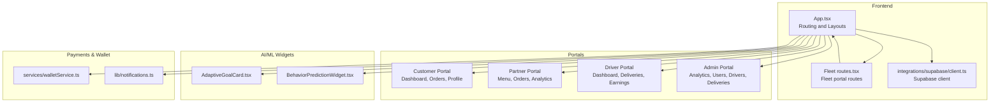
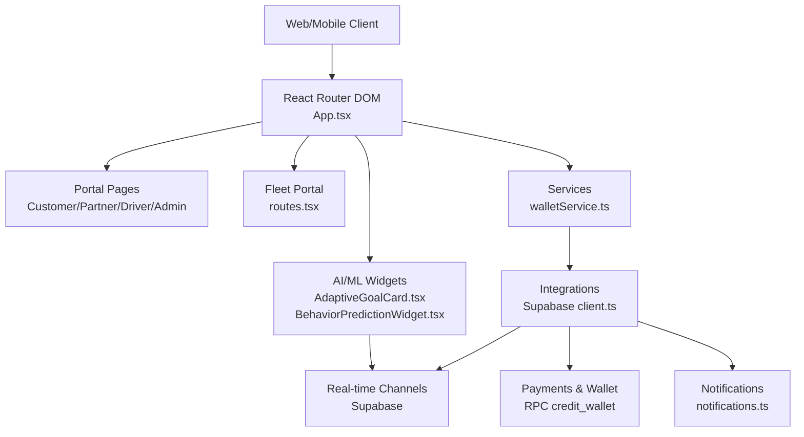
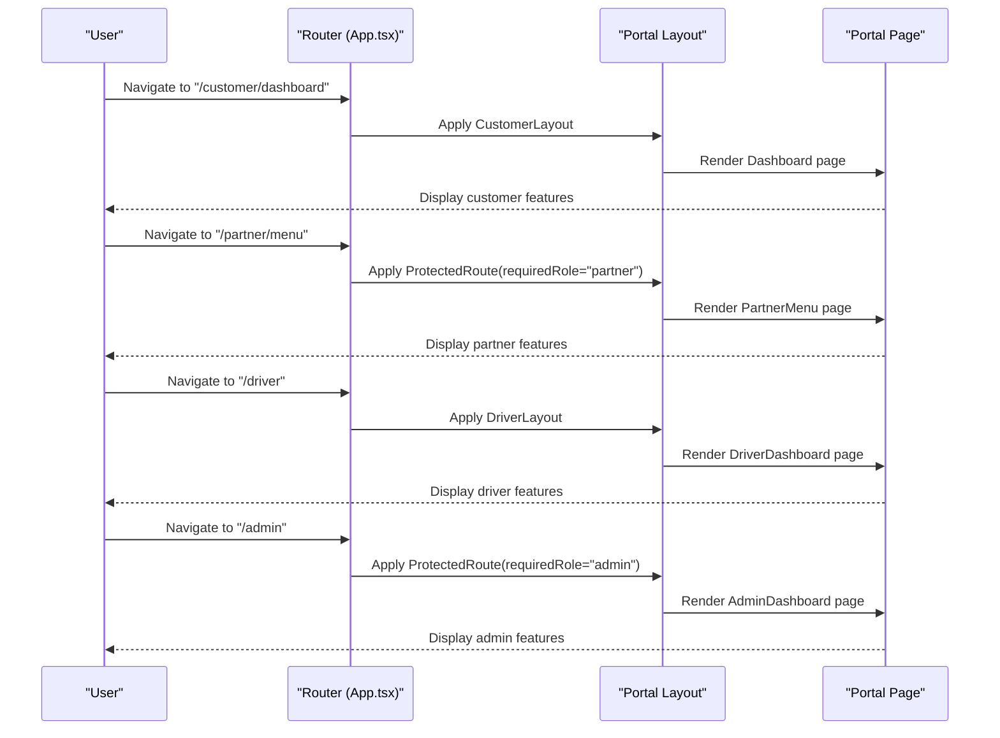
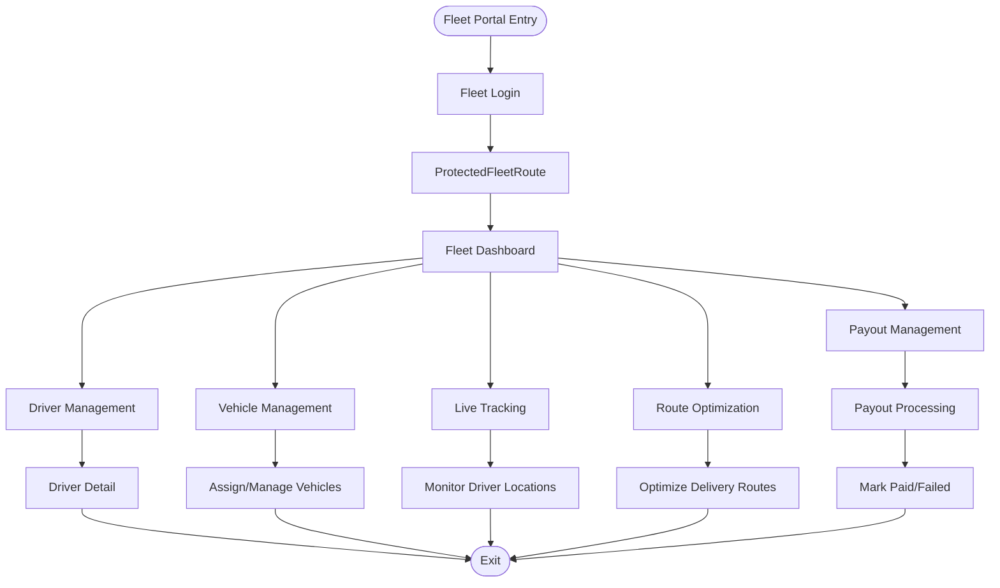
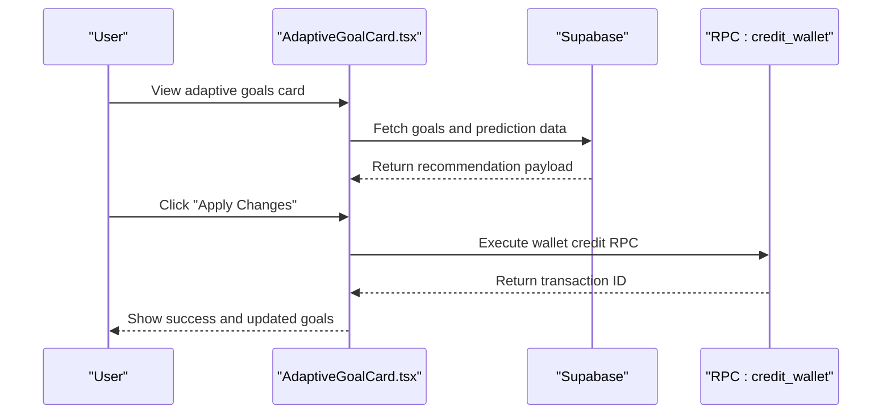
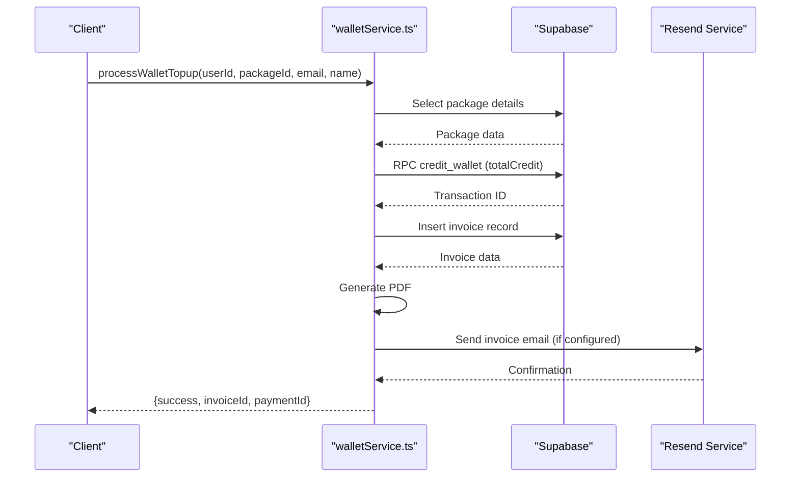
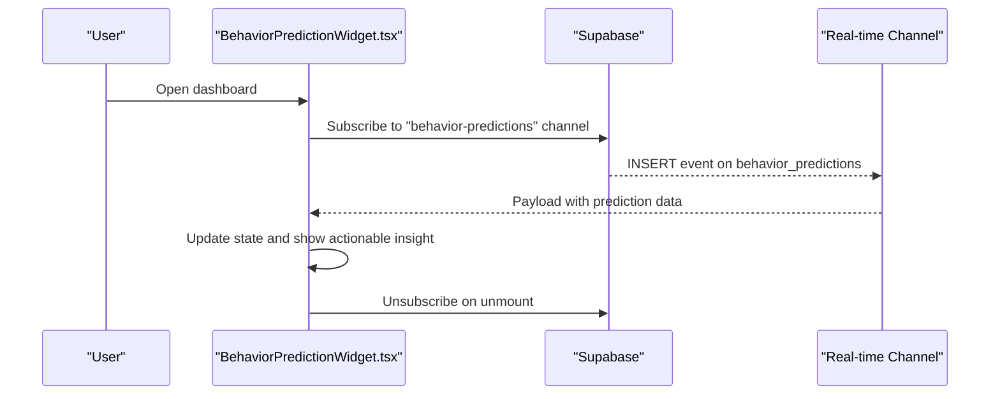
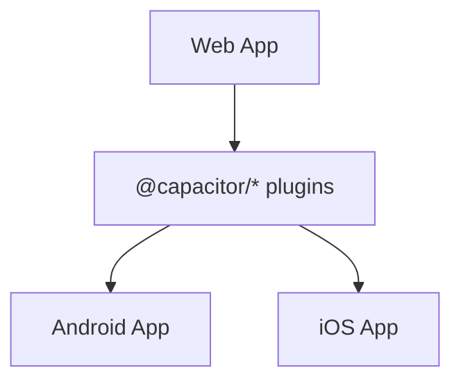
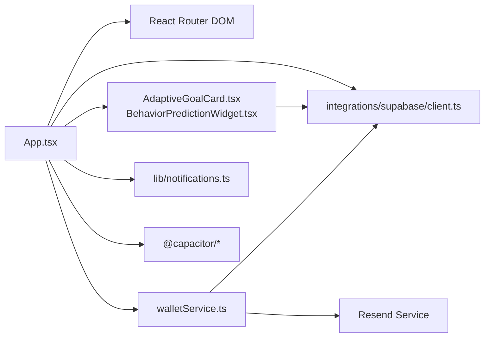

# Ecosystem Components

<cite>
**Referenced Files in This Document**
- [App.tsx](file://src/App.tsx)
- [routes.tsx](file://src/fleet/routes.tsx)
- [index.ts](file://src/fleet/index.ts)
- [index.ts](file://src/fleet/types/index.ts)
- [AdaptiveGoalCard.tsx](file://src/components/AdaptiveGoalCard.tsx)
- [BehaviorPredictionWidget.tsx](file://src/components/BehaviorPredictionWidget.tsx)
- [notifications.ts](file://src/lib/notifications.ts)
- [walletService.ts](file://src/services/walletService.ts)
- [client.ts](file://src/integrations/supabase/client.ts)
- [types.ts](file://supabase/types.ts)
- [package.json](file://package.json)
</cite>

## Table of Contents
1. [Introduction](#introduction)
2. [Project Structure](#project-structure)
3. [Core Components](#core-components)
4. [Architecture Overview](#architecture-overview)
5. [Detailed Component Analysis](#detailed-component-analysis)
6. [Dependency Analysis](#dependency-analysis)
7. [Performance Considerations](#performance-considerations)
8. [Troubleshooting Guide](#troubleshooting-guide)
9. [Conclusion](#conclusion)

## Introduction
This document describes the Nutrio ecosystem components that form the interconnected platform. It covers the four main portal systems (customer, partner, driver, admin), the fleet management system for driver operations and route optimization, the AI/ML components (adaptive goals engine, behavior prediction, and nutrition recommendations), the payment system integration and wallet functionality, the notification framework and real-time communication, and the mobile app integration via Capacitor. It also explains component interactions, data flows, and the modular design enabling feature expansion and customization.

## Project Structure
The frontend application is a React SPA built with Vite, routing through React Router DOM and integrating with Supabase for authentication, database, and real-time features. The ecosystem is organized around:
- Four main portals: customer, partner, driver, admin
- Fleet management portal for operations and route optimization
- AI/ML widgets for adaptive goals and behavior prediction
- Payment and wallet services integrated with backend functions
- Real-time notifications and Supabase channels
- Mobile app integration via Capacitor plugins

**Diagram sources**
- [App.tsx:139-739](file://src/App.tsx#L139-L739)
- [routes.tsx:1-42](file://src/fleet/routes.tsx#L1-L42)
- [client.ts](file://src/integrations/supabase/client.ts)

**Section sources**
- [App.tsx:139-739](file://src/App.tsx#L139-L739)
- [routes.tsx:1-42](file://src/fleet/routes.tsx#L1-L42)

## Core Components
- Customer portal: Browsing, ordering, scheduling, progress tracking, subscriptions, wallet, notifications, and support.
- Partner portal: Restaurant onboarding, menu management, order handling, analytics, notifications, payouts, and promotions.
- Driver portal: Onboarding, daily dashboard, order assignment, live tracking, history, earnings, payouts, profile, settings, support, and notifications.
- Admin portal: Platform management, user administration, restaurant oversight, analytics, exports, payouts, affiliate management, drivers, deliveries, IP management, freeze management, retention analytics, and premium analytics.
- Fleet management portal: Login, dashboard, driver and vehicle management, live tracking, route optimization, payout management, and processing.
- AI/ML widgets: Adaptive goals card for personalized nutrition targets and behavior prediction widget for engagement insights.
- Payment and wallet: Wallet top-up processing, invoicing, PDF generation, and email notifications.
- Notifications and real-time: Notification creation helpers and Supabase real-time channels for behavior predictions.
- Mobile integration: Capacitor plugins for push notifications, local notifications, biometrics, camera, and device capabilities.

**Section sources**
- [App.tsx:174-363](file://src/App.tsx#L174-L363)
- [App.tsx:364-469](file://src/App.tsx#L364-L469)
- [App.tsx:470-698](file://src/App.tsx#L470-L698)
- [App.tsx:699-724](file://src/App.tsx#L699-L724)
- [AdaptiveGoalCard.tsx:1-218](file://src/components/AdaptiveGoalCard.tsx#L1-L218)
- [BehaviorPredictionWidget.tsx:1-201](file://src/components/BehaviorPredictionWidget.tsx#L1-L201)
- [walletService.ts:1-180](file://src/services/walletService.ts#L1-L180)
- [notifications.ts:1-114](file://src/lib/notifications.ts#L1-L114)
- [package.json:44-126](file://package.json#L44-L126)

## Architecture Overview
The system follows a modular, layered architecture:
- Presentation layer: React components and pages per portal, with shared UI components and layouts.
- Routing and navigation: Central router in App.tsx with protected routes per role and portal.
- Services and integrations: Supabase client for auth, database, and real-time; wallet service for payment workflows; notification helpers for user messaging.
- AI/ML widgets: Client-side components that consume Supabase data and real-time channels.
- Mobile integration: Capacitor plugins enable native features in the web app.

**Diagram sources**
- [App.tsx:139-739](file://src/App.tsx#L139-L739)
- [routes.tsx:1-42](file://src/fleet/routes.tsx#L1-L42)
- [client.ts](file://src/integrations/supabase/client.ts)
- [walletService.ts:13-137](file://src/services/walletService.ts#L13-L137)
- [notifications.ts:18-114](file://src/lib/notifications.ts#L18-L114)

## Detailed Component Analysis

### Four Main Portal Systems
- Customer portal: Provides dashboards, meal browsing, scheduling, progress tracking, subscriptions, wallet, checkout, invoices, notifications, favorites, settings, affiliate, addresses, and support. Protected routes ensure authenticated access.
- Partner portal: Includes onboarding, dashboard, menu management, addons, orders, analytics, notifications, profile, payouts, boost, pending approval, and earnings dashboard. Access is role-gated to partners and requires approval.
- Driver portal: Onboarding, dashboard, orders (listing and detail), history, earnings, payouts, profile, settings, support, and notifications. Uses a dedicated layout wrapper.
- Admin portal: Comprehensive management including restaurants, users, orders, subscriptions, analytics, exports, payouts, affiliate payouts/applications, milestones, diet tags, promotions, support, notifications, drivers, deliveries, IP management, freeze management, retention analytics, streak rewards, profit dashboard, and premium analytics.

**Diagram sources**
- [App.tsx:174-363](file://src/App.tsx#L174-L363)
- [App.tsx:364-469](file://src/App.tsx#L364-L469)
- [App.tsx:470-698](file://src/App.tsx#L470-L698)
- [App.tsx:699-724](file://src/App.tsx#L699-L724)

**Section sources**
- [App.tsx:174-363](file://src/App.tsx#L174-L363)
- [App.tsx:364-469](file://src/App.tsx#L364-L469)
- [App.tsx:470-698](file://src/App.tsx#L470-L698)
- [App.tsx:699-724](file://src/App.tsx#L699-L724)

### Fleet Management System
The fleet management portal provides operational controls for city-based fleet managers:
- Authentication and protection: Fleet login and protected routes.
- Dashboard: Overview statistics for drivers, deliveries, and performance.
- Driver management: View, add, and detail drivers with status and location.
- Vehicle management: Manage vehicles assigned to drivers.
- Live tracking: Real-time driver locations and statuses.
- Route optimization: Dedicated route optimization page.
- Payout management: View and process driver payouts.

**Diagram sources**
- [routes.tsx:20-41](file://src/fleet/routes.tsx#L20-L41)
- [index.ts:1-14](file://src/fleet/index.ts#L1-L14)

**Section sources**
- [routes.tsx:1-42](file://src/fleet/routes.tsx#L1-L42)
- [index.ts:1-14](file://src/fleet/index.ts#L1-L14)
- [index.ts:4-187](file://src/fleet/types/index.ts#L4-L187)

### AI/ML Components
- Adaptive goals engine: Presents personalized nutrition targets with confidence and rationale, allowing users to apply suggested adjustments.
- Behavior prediction: Displays AI-driven insights on churn risk, boredom risk, and engagement, recommending actions and subscribing to real-time updates via Supabase.

**Diagram sources**
- [AdaptiveGoalCard.tsx:28-218](file://src/components/AdaptiveGoalCard.tsx#L28-L218)
- [walletService.ts:13-137](file://src/services/walletService.ts#L13-L137)

**Section sources**
- [AdaptiveGoalCard.tsx:1-218](file://src/components/AdaptiveGoalCard.tsx#L1-L218)
- [BehaviorPredictionWidget.tsx:1-201](file://src/components/BehaviorPredictionWidget.tsx#L1-L201)
- [walletService.ts:13-137](file://src/services/walletService.ts#L13-L137)

### Payment System Integration and Wallet Functionality
The wallet service orchestrates top-ups, credits, invoicing, PDF generation, and email notifications:
- Validates package, credits wallet with RPC, creates invoice, generates PDF, and emails invoice if configured.
- Provides invoice download capability.

**Diagram sources**
- [walletService.ts:13-137](file://src/services/walletService.ts#L13-L137)

**Section sources**
- [walletService.ts:1-180](file://src/services/walletService.ts#L1-L180)

### Real-Time Communication and Notification Framework
- Notification helpers: Create notifications for order updates, driver assignments, and new deliveries with metadata.
- Real-time behavior predictions: Subscribe to Supabase postgres_changes for behavior_predictions table filtered by user.

**Diagram sources**
- [BehaviorPredictionWidget.tsx:34-60](file://src/components/BehaviorPredictionWidget.tsx#L34-L60)
- [BehaviorPredictionWidget.tsx:40-55](file://src/components/BehaviorPredictionWidget.tsx#L40-L55)
- [notifications.ts:18-114](file://src/lib/notifications.ts#L18-L114)

**Section sources**
- [notifications.ts:1-114](file://src/lib/notifications.ts#L1-L114)
- [BehaviorPredictionWidget.tsx:1-201](file://src/components/BehaviorPredictionWidget.tsx#L1-L201)

### Mobile App Integration
Capacitor plugins are integrated for native capabilities:
- Push notifications, local notifications, biometrics, camera, device, filesystem, keyboard, preferences, share, splash screen, and status bar.
- Scripts for building and running native apps on Android and iOS.

**Diagram sources**
- [package.json:44-126](file://package.json#L44-L126)

**Section sources**
- [package.json:44-126](file://package.json#L44-L126)

## Dependency Analysis
Key dependencies and relationships:
- Routing depends on React Router DOM and protected route wrappers.
- Supabase client integrates auth, database, and real-time features.
- AI/ML widgets depend on Supabase data and real-time channels.
- Wallet service depends on Supabase RPC and email service.
- Capacitor plugins enable native features.

**Diagram sources**
- [App.tsx:139-739](file://src/App.tsx#L139-L739)
- [client.ts](file://src/integrations/supabase/client.ts)
- [AdaptiveGoalCard.tsx:1-218](file://src/components/AdaptiveGoalCard.tsx#L1-L218)
- [BehaviorPredictionWidget.tsx:1-201](file://src/components/BehaviorPredictionWidget.tsx#L1-L201)
- [walletService.ts:1-180](file://src/services/walletService.ts#L1-L180)
- [notifications.ts:1-114](file://src/lib/notifications.ts#L1-L114)
- [package.json:44-126](file://package.json#L44-L126)

**Section sources**
- [App.tsx:139-739](file://src/App.tsx#L139-L739)
- [client.ts](file://src/integrations/supabase/client.ts)
- [walletService.ts:1-180](file://src/services/walletService.ts#L1-L180)
- [notifications.ts:1-114](file://src/lib/notifications.ts#L1-L114)
- [package.json:44-126](file://package.json#L44-L126)

## Performance Considerations
- Lazy loading: Pages are lazily imported to reduce initial bundle size.
- Protected routes: Role-based access prevents unnecessary rendering and data fetching.
- Real-time subscriptions: Widgets subscribe only when needed and unsubscribe on unmount to avoid leaks.
- RPC calls: Wallet top-up uses a single RPC call to credit the wallet efficiently.
- Capacitor: Native plugins are optional and loaded conditionally to minimize overhead.

## Troubleshooting Guide
- Authentication and roles: Ensure proper role checks for partner and admin routes; verify Supabase auth context.
- Real-time channels: Confirm channel subscription and filtering; check for errors during channel creation and removal.
- Wallet top-ups: Validate package existence, handle RPC errors, and ensure invoice creation succeeds; verify email service configuration.
- Notifications: Verify notification creation and metadata; ensure correct user targeting.
- Mobile builds: Confirm Capacitor sync and platform-specific configurations.

**Section sources**
- [App.tsx:364-469](file://src/App.tsx#L364-L469)
- [App.tsx:470-698](file://src/App.tsx#L470-L698)
- [BehaviorPredictionWidget.tsx:34-60](file://src/components/BehaviorPredictionWidget.tsx#L34-L60)
- [walletService.ts:13-137](file://src/services/walletService.ts#L13-L137)
- [notifications.ts:18-114](file://src/lib/notifications.ts#L18-L114)

## Conclusion
The Nutrio ecosystem is a modular, role-based platform with integrated AI/ML insights, robust payment and wallet services, real-time notifications, and mobile app capabilities. The four main portals (customer, partner, driver, admin) and the fleet management system provide comprehensive operational coverage, while Supabase underpins authentication, data, and real-time features. The design supports easy expansion and customization through protected routes, lazy-loaded pages, and reusable services and components.