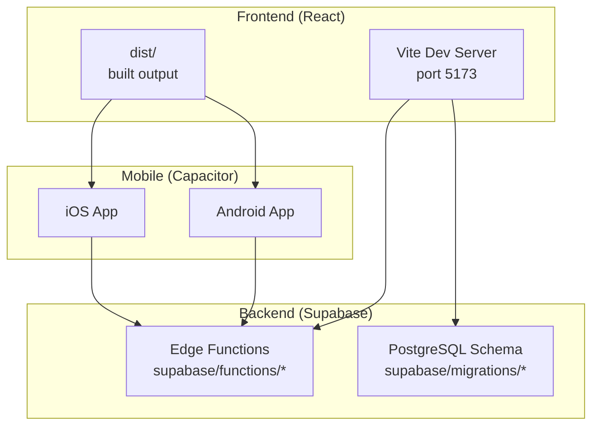
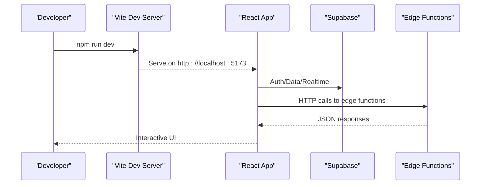
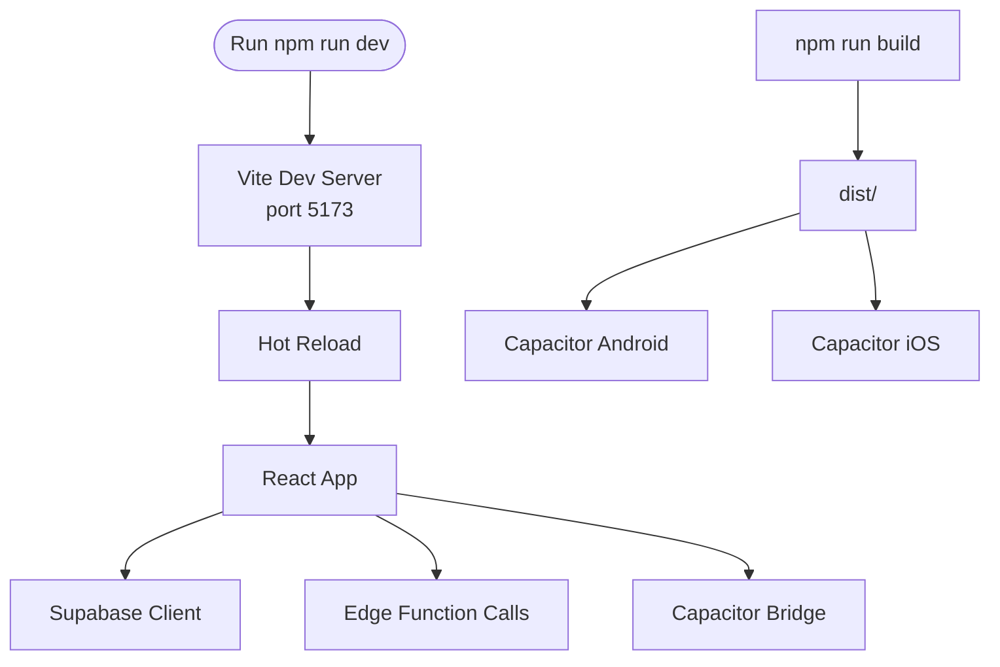
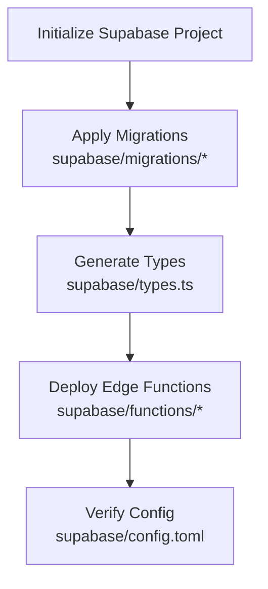
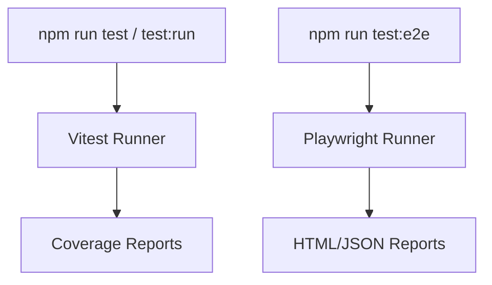
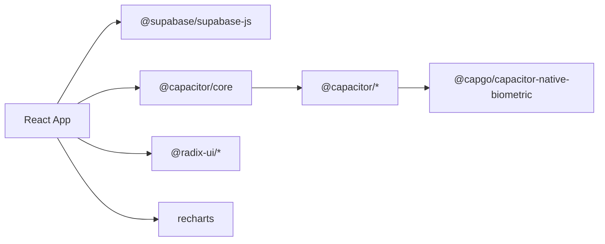

# Getting Started

<cite>
**Referenced Files in This Document**
- [package.json](file://package.json)
- [README.md](file://README.md)
- [capacitor.config.ts](file://capacitor.config.ts)
- [vite.config.ts](file://vite.config.ts)
- [playwright.config.ts](file://playwright.config.ts)
- [vitest.config.ts](file://vitest.config.ts)
- [src/lib/capacitor.ts](file://src/lib/capacitor.ts)
- [supabase/config.toml](file://supabase/config.toml)
- [supabase/types.ts](file://supabase/types.ts)
</cite>

## Table of Contents
1. [Introduction](#introduction)
2. [Project Structure](#project-structure)
3. [Core Components](#core-components)
4. [Architecture Overview](#architecture-overview)
5. [Detailed Component Analysis](#detailed-component-analysis)
6. [Dependency Analysis](#dependency-analysis)
7. [Performance Considerations](#performance-considerations)
8. [Troubleshooting Guide](#troubleshooting-guide)
9. [Conclusion](#conclusion)
10. [Appendices](#appendices)

## Introduction
This guide helps you quickly set up and run the Nutrio multi-portal healthy meal delivery platform. It covers:
- Development environment prerequisites (Node.js, npm/yarn, Supabase CLI)
- Local development setup (React frontend, Supabase edge functions, database)
- Mobile app setup with Capacitor for iOS and Android
- Practical workflows (adding features, running tests, building for production)
- Troubleshooting common setup issues
- Project structure and responsibilities

## Project Structure
Nutrio is a React single-page application bundled with Vite, integrated with Supabase for backend services and edge functions, and wrapped into native apps using Capacitor. The repository includes:
- Frontend: React application under src/, with Vite configuration for dev/build
- Backend: Supabase edge functions under supabase/functions/ and database schema under supabase/migrations/
- Mobile: Capacitor configuration and native platforms under android/ and ios/
- Testing: Playwright E2E and Vitest unit tests under e2e/ and src/**/*.{test,spec}.ts
- Scripts: npm/yarn scripts for dev, build, test, and Capacitor workflows



**Diagram sources**
- [vite.config.ts:12-27](file://vite.config.ts#L12-L27)
- [capacitor.config.ts:3-17](file://capacitor.config.ts#L3-L17)
- [supabase/config.toml:1-59](file://supabase/config.toml#L1-L59)

**Section sources**
- [package.json:7-42](file://package.json#L7-L42)
- [vite.config.ts:1-77](file://vite.config.ts#L1-L77)
- [capacitor.config.ts:1-45](file://capacitor.config.ts#L1-L45)
- [playwright.config.ts:13-91](file://playwright.config.ts#L13-L91)
- [vitest.config.ts:1-28](file://vitest.config.ts#L1-L28)

## Core Components
- React frontend with Vite dev server and build pipeline
- Supabase edge functions for backend logic
- Capacitor for native mobile capabilities
- Playwright for end-to-end testing
- Vitest for unit testing

Key responsibilities:
- package.json: Defines scripts for dev, build, test, and Capacitor workflows
- vite.config.ts: Configures dev server, HMR, aliases, and build optimizations
- capacitor.config.ts: Configures native app behavior, plugins, and server settings
- playwright.config.ts: Configures E2E test runner, reporters, and device targets
- vitest.config.ts: Configures unit test environment and coverage
- supabase/config.toml: Declares edge function settings and JWT verification flags
- supabase/types.ts: Generated TypeScript types for Supabase schema

**Section sources**
- [package.json:7-42](file://package.json#L7-L42)
- [vite.config.ts:1-77](file://vite.config.ts#L1-L77)
- [capacitor.config.ts:1-45](file://capacitor.config.ts#L1-L45)
- [playwright.config.ts:13-91](file://playwright.config.ts#L13-L91)
- [vitest.config.ts:1-28](file://vitest.config.ts#L1-L28)
- [supabase/config.toml:1-59](file://supabase/config.toml#L1-L59)
- [supabase/types.ts:1-800](file://supabase/types.ts#L1-L800)

## Architecture Overview
The frontend communicates with Supabase for authentication, real-time data, and edge functions. Capacitor wraps the built web app into native apps, enabling native features like push notifications, biometrics, and device APIs.



**Diagram sources**
- [vite.config.ts:12-27](file://vite.config.ts#L12-L27)
- [supabase/config.toml:1-59](file://supabase/config.toml#L1-L59)

## Detailed Component Analysis

### React Frontend Setup
- Start the dev server with hot module replacement
- Build for production with optimized bundles and source maps
- Use aliases and plugins configured in Vite



**Diagram sources**
- [vite.config.ts:12-27](file://vite.config.ts#L12-L27)
- [package.json:8-11](file://package.json#L8-L11)
- [capacitor.config.ts:3-17](file://capacitor.config.ts#L3-L17)

**Section sources**
- [vite.config.ts:1-77](file://vite.config.ts#L1-L77)
- [package.json:7-11](file://package.json#L7-L11)

### Supabase Edge Functions
- Edge functions are organized under supabase/functions/*
- Configuration and JWT verification flags are defined in supabase/config.toml
- Types for database schema are generated in supabase/types.ts



**Diagram sources**
- [supabase/config.toml:1-59](file://supabase/config.toml#L1-L59)
- [supabase/types.ts:1-800](file://supabase/types.ts#L1-L800)

**Section sources**
- [supabase/config.toml:1-59](file://supabase/config.toml#L1-L59)
- [supabase/types.ts:1-800](file://supabase/types.ts#L1-L800)

### Capacitor Mobile Apps
- Capacitor configuration defines app ID, name, webDir, and server settings
- Native features are exposed via src/lib/capacitor.ts with safe fallbacks
- Scripts to sync and run on Android/iOS are provided

```mermaid
sequenceDiagram
participant Dev as "Developer"
participant Vite as "Vite Build"
participant Capacitor as "Capacitor CLI"
participant Android as "Android Studio"
participant IOS as "Xcode"
Dev->>Vite : npm run build
Vite-->>Dist["dist/"]
Dev->>Capacitor : npx cap sync android
Capacitor-->>Android : Synced project
Dev->>Capacitor : npx cap open android
Dev->>Capacitor : npx cap sync ios
Capacitor-->>IOS : Synced project
Dev->>Capacitor : npx cap open ios
```

**Diagram sources**
- [capacitor.config.ts:3-17](file://capacitor.config.ts#L3-L17)
- [src/lib/capacitor.ts:1-640](file://src/lib/capacitor.ts#L1-L640)
- [package.json:20-26](file://package.json#L20-L26)

**Section sources**
- [capacitor.config.ts:1-45](file://capacitor.config.ts#L1-L45)
- [src/lib/capacitor.ts:1-640](file://src/lib/capacitor.ts#L1-L640)
- [package.json:20-26](file://package.json#L20-L26)

### Testing Framework
- Unit tests with Vitest and jsdom environment
- E2E tests with Playwright targeting multiple devices
- Coverage reporting and HTML/json reporters



**Diagram sources**
- [vitest.config.ts:1-28](file://vitest.config.ts#L1-L28)
- [playwright.config.ts:13-91](file://playwright.config.ts#L13-L91)

**Section sources**
- [vitest.config.ts:1-28](file://vitest.config.ts#L1-L28)
- [playwright.config.ts:13-91](file://playwright.config.ts#L13-L91)

## Dependency Analysis
- Frontend dependencies include React, React Router, Supabase JS, Radix UI, Recharts, Sentry, and others
- Capacitor plugins provide native capabilities (haptics, push/local notifications, biometrics)
- Build and tooling dependencies include Vite, TypeScript, ESLint, Tailwind, and Playwright



**Diagram sources**
- [package.json:44-126](file://package.json#L44-L126)

**Section sources**
- [package.json:44-126](file://package.json#L44-L126)

## Performance Considerations
- Vite dev server enables fast HMR and reliable reload
- Production builds use modern target and Terser minification
- Manual chunk splitting improves caching for vendor libraries
- Source maps enabled for Sentry integration in production

Practical tips:
- Keep dependencies lean; remove unused Radix UI components
- Monitor bundle sizes using Vite’s built-in analyzer
- Use lazy loading for large feature modules
- Enable gzip/brotli compression in production

**Section sources**
- [vite.config.ts:52-76](file://vite.config.ts#L52-L76)

## Troubleshooting Guide
Common setup issues and resolutions:

- Supabase CLI installation
  - Follow OS-specific instructions in the Supabase CLI README
  - Use npx to run CLI commands without global installation
  - Pin CLI versions in CI environments

- Edge function JWT verification
  - Review supabase/config.toml for verify_jwt flags
  - Ensure edge functions are deployed and reachable

- Capacitor build/run failures
  - Ensure Capacitor sync runs after each build
  - Confirm Capacitor config matches your app ID and webDir
  - For iOS, open Xcode and resolve provisioning issues
  - For Android, open Android Studio and accept SDK licenses

- Vite dev server connectivity
  - Allow access from local network for mobile testing
  - Adjust host/port and HMR settings if needed

- Testing timeouts
  - Increase action/navigation timeouts in playwright.config.ts
  - Use headed mode (--headed) for debugging

**Section sources**
- [README.md:16-178](file://README.md#L16-L178)
- [supabase/config.toml:1-59](file://supabase/config.toml#L1-L59)
- [capacitor.config.ts:3-17](file://capacitor.config.ts#L3-L17)
- [vite.config.ts:12-27](file://vite.config.ts#L12-L27)
- [playwright.config.ts:36-54](file://playwright.config.ts#L36-L54)

## Conclusion
You now have the essentials to set up Nutrio locally, develop features across the React frontend and Supabase edge functions, wrap the app with Capacitor for native platforms, and run comprehensive tests. Use the scripts and configurations outlined here to streamline your workflow and maintain a robust development environment.

## Appendices

### Prerequisites
- Node.js LTS recommended
- npm or Yarn package manager
- Supabase CLI installed per OS-specific instructions
- Android Studio (for Android development)
- Xcode (for iOS development)

**Section sources**
- [README.md:16-178](file://README.md#L16-L178)

### Environment Variables
- Configure environment variables for Supabase and Sentry in your shell or .env file
- For Capacitor, ensure BASE_URL points to your dev server during development

**Section sources**
- [playwright.config.ts:38](file://playwright.config.ts#L38)
- [vite.config.ts:35-39](file://vite.config.ts#L35-L39)

### Quick Start Checklist
- Install dependencies: npm install
- Start dev server: npm run dev
- Build for production: npm run build
- Run unit tests: npm run test:run
- Run E2E tests: npm run test:e2e
- Sync Capacitor: npm run cap:sync
- Run on Android: npm run cap:dev:android
- Run on iOS: npm run cap:dev:ios

**Section sources**
- [package.json:7-42](file://package.json#L7-L42)