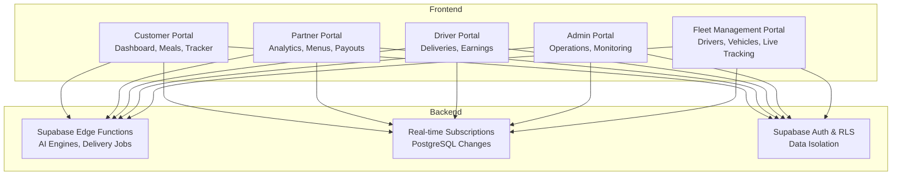
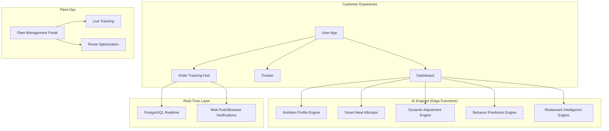
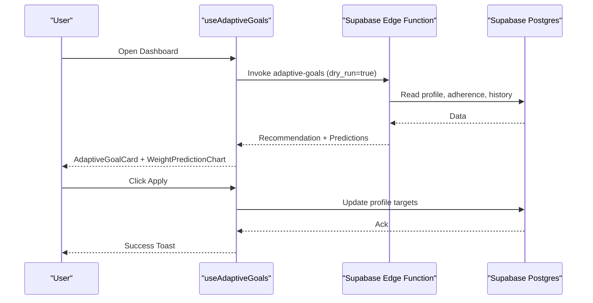
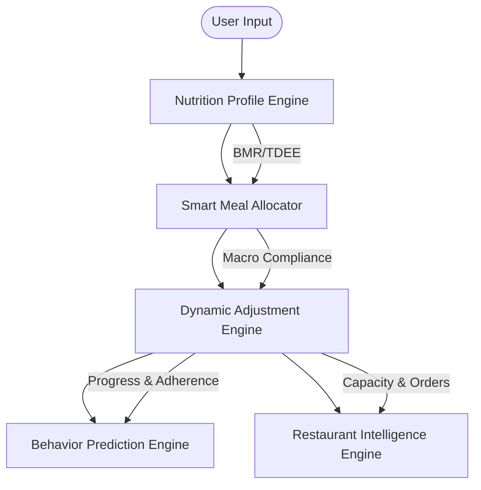
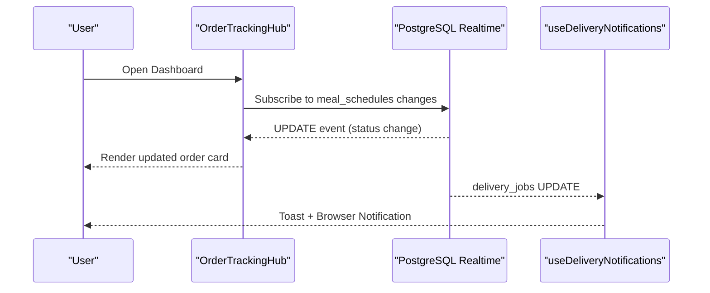
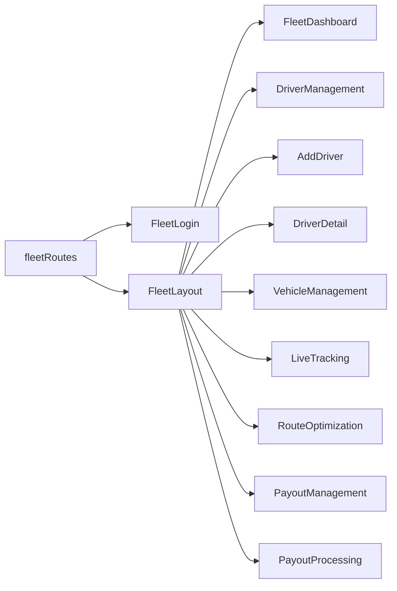
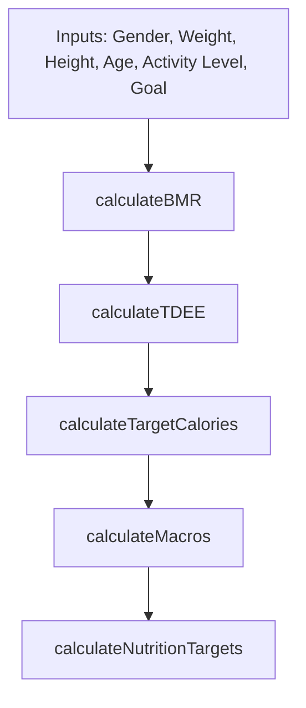
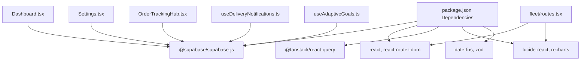

# Introduction

<cite>
**Referenced Files in This Document**
- [README.md](file://README.md)
- [package.json](file://package.json)
- [ADAPTIVE_GOALS_IMPLEMENTATION_SUMMARY.md](file://ADAPTIVE_GOALS_IMPLEMENTATION_SUMMARY.md)
- [AI_IMPLEMENTATION_SUMMARY.md](file://AI_IMPLEMENTATION_SUMMARY.md)
- [src/fleet/index.ts](file://src/fleet/index.ts)
- [src/fleet/routes.tsx](file://src/fleet/routes.tsx)
- [src/hooks/useAdaptiveGoals.ts](file://src/hooks/useAdaptiveGoals.ts)
- [src/components/OrderTrackingHub.tsx](file://src/components/OrderTrackingHub.tsx)
- [src/hooks/useDeliveryNotifications.ts](file://src/hooks/useDeliveryNotifications.ts)
- [src/lib/nutrition-calculator.ts](file://src/lib/nutrition-calculator.ts)
- [src/pages/Dashboard.tsx](file://src/pages/Dashboard.tsx)
- [src/pages/Settings.tsx](file://src/pages/Settings.tsx)
</cite>

## Table of Contents
1. [Introduction](#introduction)
2. [Project Structure](#project-structure)
3. [Core Components](#core-components)
4. [Architecture Overview](#architecture-overview)
5. [Detailed Component Analysis](#detailed-component-analysis)
6. [Dependency Analysis](#dependency-analysis)
7. [Performance Considerations](#performance-considerations)
8. [Troubleshooting Guide](#troubleshooting-guide)
9. [Conclusion](#conclusion)

## Introduction
Nutrio is a healthy meal delivery and nutrition tracking ecosystem designed to revolutionize nutrition through personalized meal delivery, automated health tracking, and intelligent recommendations powered by AI. The platform combines enterprise-grade AI engines with a seamless delivery experience, enabling users to achieve personalized nutrition goals while delivering operational excellence for restaurants, drivers, and fleet managers.

Nutrio’s mission centers on three pillars:
- Personalized nutrition: AI-powered adaptive goals and macro distribution tailored to individual progress and preferences.
- Automated health tracking: Real-time order lifecycle tracking, delivery notifications, and integrated nutrition dashboards.
- Intelligent recommendations: Multi-layer AI engines that optimize meal plans, predict behavior, and balance restaurant demand.

The platform leverages Supabase for backend infrastructure, React with TypeScript for the frontend, and a fleet management portal for delivery operations. It emphasizes scalability, security, and user-centric design to position itself as a modern, data-driven solution in the health and wellness market.

## Project Structure
Nutrio is organized around a modular frontend architecture with dedicated areas for customer, partner, driver, and admin experiences. The fleet module encapsulates delivery operations, while AI-related capabilities are implemented as Supabase Edge Functions and integrated via hooks and components.

**Diagram sources**
- [src/pages/Dashboard.tsx](file://src/pages/Dashboard.tsx)
- [src/pages/Settings.tsx](file://src/pages/Settings.tsx)
- [src/fleet/routes.tsx](file://src/fleet/routes.tsx)
- [src/components/OrderTrackingHub.tsx](file://src/components/OrderTrackingHub.tsx)
- [src/hooks/useDeliveryNotifications.ts](file://src/hooks/useDeliveryNotifications.ts)

**Section sources**
- [package.json:1-159](file://package.json#L1-L159)

## Core Components
This section highlights the platform’s core capabilities that define its value proposition.

- Adaptive Goals System
  - AI-driven, personalized nutrition targets that adjust automatically based on progress, adherence, and trends.
  - Includes plateau detection, rapid weight change alerts, and predictive weight forecasting.
  - Provides user controls for auto-adjustment frequency and safety thresholds.

- AI-Powered Meal Planning and Recommendations
  - Multi-layer AI architecture: nutrition profiling, smart meal allocation, dynamic adjustments, behavior prediction, and restaurant intelligence.
  - Ensures macro compliance, variety enforcement, and demand balancing across restaurants.

- Real-Time Delivery Tracking and Notifications
  - Live order status updates with real-time subscriptions.
  - Browser and push notifications for delivery milestones and issues.

- Fleet Management
  - Dedicated portal for managing drivers, vehicles, live tracking, route optimization, and payouts.
  - Role-based access and protected routes for fleet operations.

- Nutrition Tracking and Dashboards
  - Daily nutrition cards, streaks, and progress visuals.
  - Integration with adaptive goals and subscription plans.

**Section sources**
- [ADAPTIVE_GOALS_IMPLEMENTATION_SUMMARY.md:1-309](file://ADAPTIVE_GOALS_IMPLEMENTATION_SUMMARY.md#L1-L309)
- [AI_IMPLEMENTATION_SUMMARY.md:1-190](file://AI_IMPLEMENTATION_SUMMARY.md#L1-L190)
- [src/hooks/useAdaptiveGoals.ts:1-407](file://src/hooks/useAdaptiveGoals.ts#L1-L407)
- [src/components/OrderTrackingHub.tsx:1-235](file://src/components/OrderTrackingHub.tsx#L1-L235)
- [src/hooks/useDeliveryNotifications.ts:1-139](file://src/hooks/useDeliveryNotifications.ts#L1-L139)
- [src/fleet/index.ts:1-14](file://src/fleet/index.ts#L1-L14)
- [src/fleet/routes.tsx:1-42](file://src/fleet/routes.tsx#L1-L42)
- [src/lib/nutrition-calculator.ts:1-103](file://src/lib/nutrition-calculator.ts#L1-L103)
- [src/pages/Dashboard.tsx:1-566](file://src/pages/Dashboard.tsx#L1-L566)
- [src/pages/Settings.tsx:1-535](file://src/pages/Settings.tsx#L1-L535)

## Architecture Overview
Nutrio’s architecture integrates Supabase Edge Functions for AI logic, real-time subscriptions for live updates, and role-based portals for customers, partners, drivers, and admins. The fleet module centralizes delivery operations with live tracking and route optimization.

**Diagram sources**
- [AI_IMPLEMENTATION_SUMMARY.md:24-106](file://AI_IMPLEMENTATION_SUMMARY.md#L24-L106)
- [src/components/OrderTrackingHub.tsx:93-114](file://src/components/OrderTrackingHub.tsx#L93-L114)
- [src/hooks/useDeliveryNotifications.ts:31-135](file://src/hooks/useDeliveryNotifications.ts#L31-L135)
- [src/fleet/routes.tsx:20-41](file://src/fleet/routes.tsx#L20-L41)

## Detailed Component Analysis

### Adaptive Goals System
The adaptive goals system continuously analyzes user progress and suggests personalized nutrition adjustments. It integrates with Supabase Edge Functions and exposes a React hook for seamless UI integration.

**Diagram sources**
- [src/hooks/useAdaptiveGoals.ts:137-178](file://src/hooks/useAdaptiveGoals.ts#L137-L178)
- [src/hooks/useAdaptiveGoals.ts:247-286](file://src/hooks/useAdaptiveGoals.ts#L247-L286)
- [ADAPTIVE_GOALS_IMPLEMENTATION_SUMMARY.md:136-166](file://ADAPTIVE_GOALS_IMPLEMENTATION_SUMMARY.md#L136-L166)

**Section sources**
- [ADAPTIVE_GOALS_IMPLEMENTATION_SUMMARY.md:1-309](file://ADAPTIVE_GOALS_IMPLEMENTATION_SUMMARY.md#L1-L309)
- [src/hooks/useAdaptiveGoals.ts:1-407](file://src/hooks/useAdaptiveGoals.ts#L1-L407)
- [src/pages/Dashboard.tsx:335-347](file://src/pages/Dashboard.tsx#L335-L347)

### AI Engines Overview
Nutrio’s AI stack consists of five layers:
- Nutrition Profile Engine: Calculates BMR/TDEE and macro distribution.
- Smart Meal Allocator: Optimizes weekly meal plans with macro compliance.
- Dynamic Adjustment Engine: Adjusts goals based on progress and adherence.
- Behavior Prediction Engine: Scores churn and boredom risks with retention actions.
- Restaurant Intelligence Engine: Balances demand and capacity across restaurants.

**Diagram sources**
- [AI_IMPLEMENTATION_SUMMARY.md:24-106](file://AI_IMPLEMENTATION_SUMMARY.md#L24-L106)

**Section sources**
- [AI_IMPLEMENTATION_SUMMARY.md:1-190](file://AI_IMPLEMENTATION_SUMMARY.md#L1-L190)

### Real-Time Delivery Tracking and Notifications
The order tracking hub subscribes to real-time updates for order lifecycle events and displays status with icons and descriptions. Delivery notifications are triggered for driver assignments, en route, pickup, delivery, and failures.

**Diagram sources**
- [src/components/OrderTrackingHub.tsx:93-114](file://src/components/OrderTrackingHub.tsx#L93-L114)
- [src/hooks/useDeliveryNotifications.ts:31-135](file://src/hooks/useDeliveryNotifications.ts#L31-L135)

**Section sources**
- [src/components/OrderTrackingHub.tsx:1-235](file://src/components/OrderTrackingHub.tsx#L1-L235)
- [src/hooks/useDeliveryNotifications.ts:1-139](file://src/hooks/useDeliveryNotifications.ts#L1-L139)

### Fleet Management Portal
The fleet module provides a protected routing system for fleet operations, including live tracking, driver management, vehicle management, route optimization, and payout processing.

**Diagram sources**
- [src/fleet/routes.tsx:20-41](file://src/fleet/routes.tsx#L20-L41)
- [src/fleet/index.ts:1-14](file://src/fleet/index.ts#L1-L14)

**Section sources**
- [src/fleet/routes.tsx:1-42](file://src/fleet/routes.tsx#L1-L42)
- [src/fleet/index.ts:1-14](file://src/fleet/index.ts#L1-L14)

### Nutrition Calculation Utilities
The nutrition calculator provides foundational calculations for BMR, TDEE, target calories, and macro distribution, supporting the adaptive goals and meal planning systems.

**Diagram sources**
- [src/lib/nutrition-calculator.ts:5-88](file://src/lib/nutrition-calculator.ts#L5-L88)

**Section sources**
- [src/lib/nutrition-calculator.ts:1-103](file://src/lib/nutrition-calculator.ts#L1-L103)

### Stakeholder Perspectives

- For Investors
  - Enterprise-grade security with immutable financial records and robust RLS policies.
  - Scalable AI infrastructure with multi-layer engines and edge functions.
  - Monetization through subscription plans, VIP tiers, and affiliate programs.
  - Operational efficiency via fleet management and demand balancing.

- For Users
  - Personalized nutrition with adaptive goals and predictive insights.
  - Seamless meal delivery with real-time tracking and notifications.
  - Transparent progress tracking and actionable recommendations.

- For Developers
  - Modular frontend architecture with Supabase Edge Functions.
  - Real-time subscriptions and browser push notifications.
  - Protected fleet routes and role-based access control.

**Section sources**
- [AI_IMPLEMENTATION_SUMMARY.md:12-21](file://AI_IMPLEMENTATION_SUMMARY.md#L12-L21)
- [ADAPTIVE_GOALS_IMPLEMENTATION_SUMMARY.md:195-221](file://ADAPTIVE_GOALS_IMPLEMENTATION_SUMMARY.md#L195-L221)
- [src/pages/Dashboard.tsx:335-347](file://src/pages/Dashboard.tsx#L335-L347)
- [src/pages/Settings.tsx:310-311](file://src/pages/Settings.tsx#L310-L311)

## Dependency Analysis
Nutrio’s frontend relies on Supabase for authentication, database queries, and real-time subscriptions. Edge Functions encapsulate AI logic, while fleet management is isolated under a dedicated module.

**Diagram sources**
- [package.json:44-126](file://package.json#L44-L126)
- [src/pages/Dashboard.tsx:25](file://src/pages/Dashboard.tsx#L25)
- [src/pages/Settings.tsx:27](file://src/pages/Settings.tsx#L27)
- [src/components/OrderTrackingHub.tsx:3](file://src/components/OrderTrackingHub.tsx#L3)
- [src/hooks/useDeliveryNotifications.ts:2](file://src/hooks/useDeliveryNotifications.ts#L2)
- [src/hooks/useAdaptiveGoals.ts:2](file://src/hooks/useAdaptiveGoals.ts#L2)
- [src/fleet/routes.tsx:1](file://src/fleet/routes.tsx#L1)

**Section sources**
- [package.json:1-159](file://package.json#L1-L159)

## Performance Considerations
- Edge Functions: Offload AI computations to Supabase Edge Functions to reduce client-side load and latency.
- Real-time Subscriptions: Use targeted filters and channel scoping to minimize unnecessary updates.
- Client-Side Caching: Persist frequently accessed data (e.g., adaptive goals settings) to reduce redundant network calls.
- Fleet Routing: Precompute and cache route optimizations to improve driver experience and reduce computation overhead.

## Troubleshooting Guide
- Adaptive Goals Not Loading
  - Ensure the adaptive-goals Edge Function is deployed and accessible. The hook gracefully handles CORS errors by disabling the feature until deployment.
  - Verify user authentication and that the user profile exists in the database.

- Real-Time Tracking Not Updating
  - Confirm the user is subscribed to the correct PostgreSQL changes channel for meal schedules.
  - Check browser notification permissions if relying on browser notifications.

- Fleet Portal Access Denied
  - Verify role-based access control and that the user has appropriate fleet permissions.
  - Ensure protected routes are properly wrapped with authentication providers.

**Section sources**
- [src/hooks/useAdaptiveGoals.ts:145-178](file://src/hooks/useAdaptiveGoals.ts#L145-L178)
- [src/components/OrderTrackingHub.tsx:93-114](file://src/components/OrderTrackingHub.tsx#L93-L114)
- [src/fleet/routes.tsx:3-4](file://src/fleet/routes.tsx#L3-L4)

## Conclusion
Nutrio positions itself at the intersection of AI-driven nutrition and efficient meal delivery. Its adaptive goals system, multi-layer AI engines, real-time tracking, and fleet management module collectively deliver a scalable, secure, and user-centric platform. For investors, the combination of enterprise-grade security, monetization pathways, and operational efficiency presents strong growth potential. For users, the platform offers personalized nutrition guidance and a seamless delivery experience. For developers, the modular architecture and Supabase-first approach facilitate rapid iteration and reliable scaling.