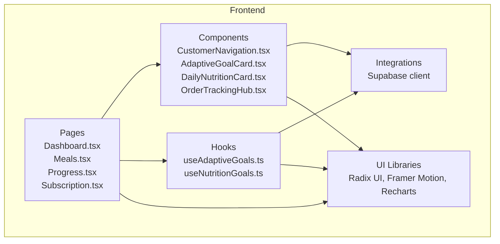
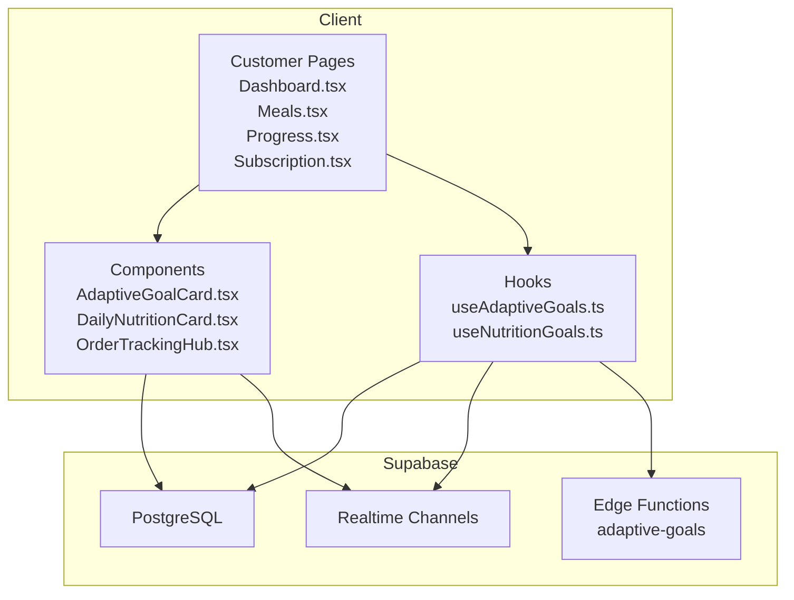
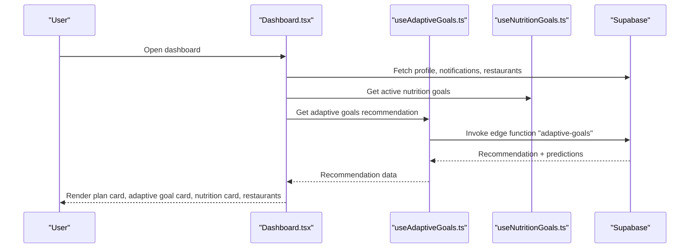
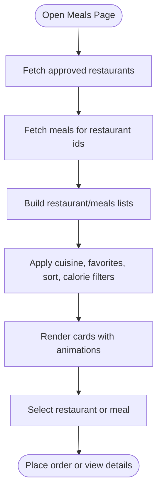
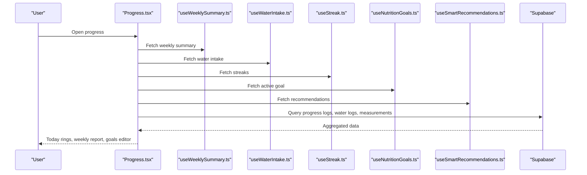
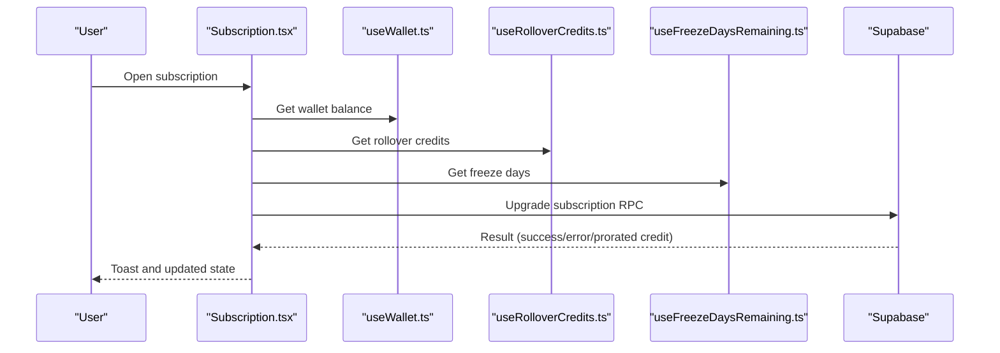
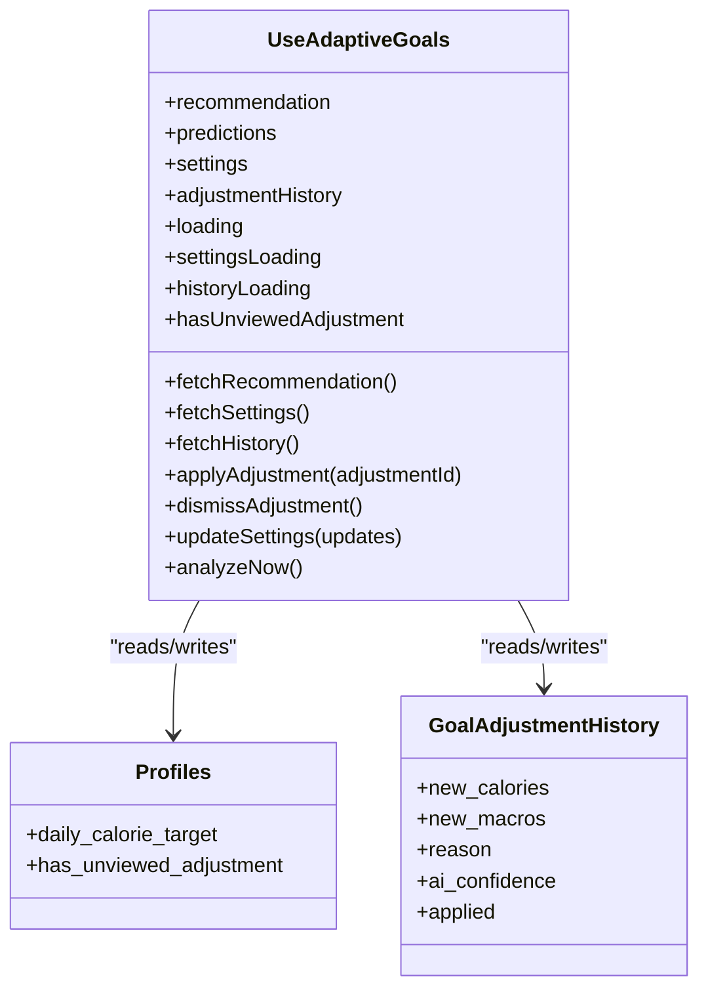
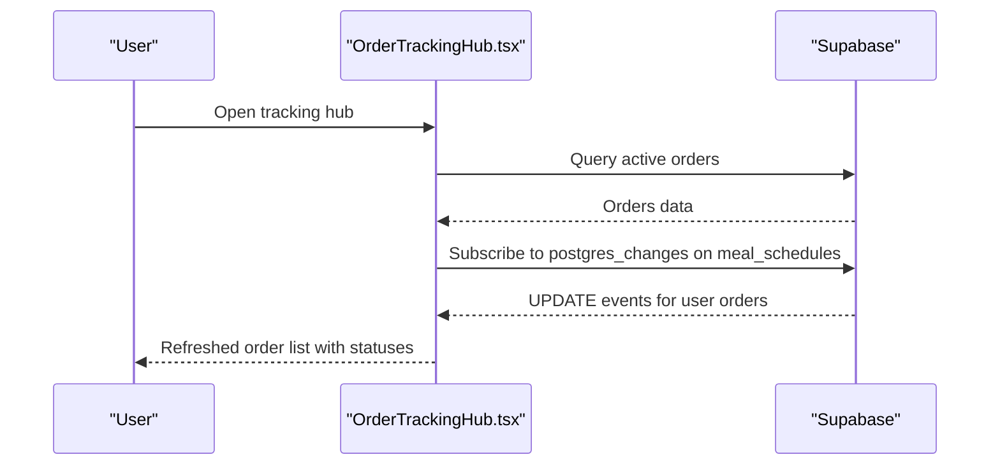
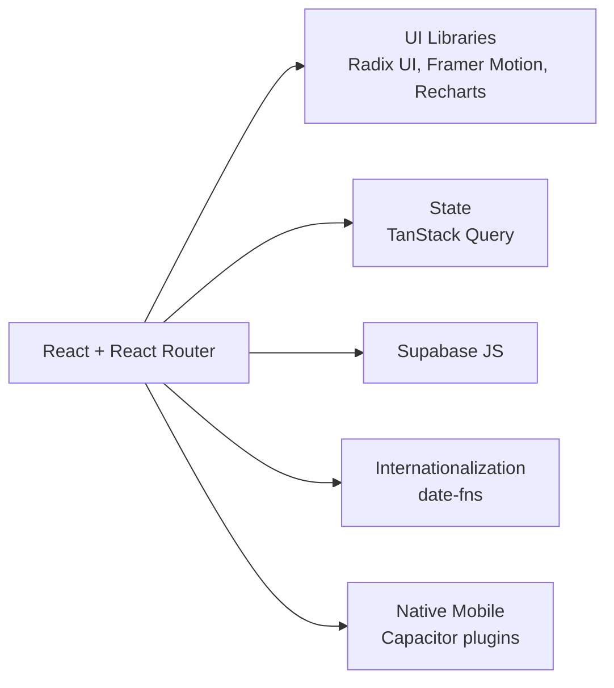

# Key Features

<cite>
**Referenced Files in This Document**
- [Dashboard.tsx](file://src/pages/Dashboard.tsx)
- [Meals.tsx](file://src/pages/Meals.tsx)
- [Progress.tsx](file://src/pages/Progress.tsx)
- [Subscription.tsx](file://src/pages/Subscription.tsx)
- [CustomerNavigation.tsx](file://src/components/CustomerNavigation.tsx)
- [AdaptiveGoalCard.tsx](file://src/components/AdaptiveGoalCard.tsx)
- [DailyNutritionCard.tsx](file://src/components/DailyNutritionCard.tsx)
- [useAdaptiveGoals.ts](file://src/hooks/useAdaptiveGoals.ts)
- [useNutritionGoals.ts](file://src/hooks/useNutritionGoals.ts)
- [OrderTrackingHub.tsx](file://src/components/OrderTrackingHub.tsx)
- [package.json](file://package.json)
</cite>

## Table of Contents
1. [Introduction](#introduction)
2. [Project Structure](#project-structure)
3. [Core Components](#core-components)
4. [Architecture Overview](#architecture-overview)
5. [Detailed Component Analysis](#detailed-component-analysis)
6. [Dependency Analysis](#dependency-analysis)
7. [Performance Considerations](#performance-considerations)
8. [Troubleshooting Guide](#troubleshooting-guide)
9. [Conclusion](#conclusion)

## Introduction
This document presents the key features of the Nutrio platform across all user portals, focusing on the customer, partner, driver, admin, and fleet management experiences. It explains the meal discovery and ordering system, nutrition tracking dashboard, adaptive goals system, subscription management, restaurant and menu management, order processing, delivery management, route optimization, earnings tracking, system monitoring, and operational control. It also covers real-time features such as live delivery tracking, push notifications, and progress monitoring, along with the multi-tenant architecture enabling different business models within a single platform instance.

## Project Structure
The frontend is a React application built with Vite, using TypeScript, Tailwind CSS, Radix UI primitives, Framer Motion, React Query, and Supabase for authentication, database, and real-time features. The repository includes portal-specific pages and components, hooks for domain logic, and integrations with Supabase and edge functions.

**Diagram sources**
- [Dashboard.tsx:1-566](file://src/pages/Dashboard.tsx#L1-L566)
- [Meals.tsx:1-800](file://src/pages/Meals.tsx#L1-L800)
- [Progress.tsx:1-687](file://src/pages/Progress.tsx#L1-L687)
- [Subscription.tsx:1-800](file://src/pages/Subscription.tsx#L1-L800)
- [CustomerNavigation.tsx:1-61](file://src/components/CustomerNavigation.tsx#L1-L61)
- [AdaptiveGoalCard.tsx:1-218](file://src/components/AdaptiveGoalCard.tsx#L1-L218)
- [DailyNutritionCard.tsx:1-255](file://src/components/DailyNutritionCard.tsx#L1-L255)
- [OrderTrackingHub.tsx:1-235](file://src/components/OrderTrackingHub.tsx#L1-L235)
- [useAdaptiveGoals.ts:1-407](file://src/hooks/useAdaptiveGoals.ts#L1-L407)
- [useNutritionGoals.ts:1-134](file://src/hooks/useNutritionGoals.ts#L1-L134)

**Section sources**
- [package.json:1-159](file://package.json#L1-L159)

## Core Components
- Customer Portal
  - Dashboard: personalized plan summary, adaptive goals suggestion, daily nutrition card, quick actions, active orders banner, streak tracker, featured restaurants carousel.
  - Meals Discovery: search, filters, favorites, sorting, cuisine chips, and restaurant/meals lists with animations and native feel.
  - Progress & Nutrition Tracking: today/week/goals tabs, rings and charts, water intake, weight tracking, smart insights, weekly report generation.
  - Subscription Management: plan selection, billing interval toggle, upgrade/modify, auto-renew toggle, promo code application, rollover credits, freeze days.
  - Navigation: bottom navigation with affiliate tab availability.

- Adaptive Goals System
  - AI-powered recommendations with confidence, plateau detection, and suggested actions.
  - Settings for auto-adjust frequency and calorie bounds.
  - History of adjustments and ability to apply or dismiss suggestions.

- Real-Time Features
  - Live order tracking hub with status updates and driver info.
  - Supabase real-time channels for order lifecycle updates.

**Section sources**
- [Dashboard.tsx:1-566](file://src/pages/Dashboard.tsx#L1-L566)
- [Meals.tsx:1-800](file://src/pages/Meals.tsx#L1-L800)
- [Progress.tsx:1-687](file://src/pages/Progress.tsx#L1-L687)
- [Subscription.tsx:1-800](file://src/pages/Subscription.tsx#L1-L800)
- [CustomerNavigation.tsx:1-61](file://src/components/CustomerNavigation.tsx#L1-L61)
- [AdaptiveGoalCard.tsx:1-218](file://src/components/AdaptiveGoalCard.tsx#L1-L218)
- [DailyNutritionCard.tsx:1-255](file://src/components/DailyNutritionCard.tsx#L1-L255)
- [useAdaptiveGoals.ts:1-407](file://src/hooks/useAdaptiveGoals.ts#L1-L407)
- [OrderTrackingHub.tsx:1-235](file://src/components/OrderTrackingHub.tsx#L1-L235)

## Architecture Overview
The platform integrates React pages and components with Supabase for authentication, storage, and real-time subscriptions. Edge functions power AI features such as adaptive goals. The UI leverages modern libraries for responsive design and smooth interactions.

**Diagram sources**
- [Dashboard.tsx:1-566](file://src/pages/Dashboard.tsx#L1-L566)
- [Meals.tsx:1-800](file://src/pages/Meals.tsx#L1-L800)
- [Progress.tsx:1-687](file://src/pages/Progress.tsx#L1-L687)
- [Subscription.tsx:1-800](file://src/pages/Subscription.tsx#L1-L800)
- [AdaptiveGoalCard.tsx:1-218](file://src/components/AdaptiveGoalCard.tsx#L1-L218)
- [DailyNutritionCard.tsx:1-255](file://src/components/DailyNutritionCard.tsx#L1-L255)
- [OrderTrackingHub.tsx:1-235](file://src/components/OrderTrackingHub.tsx#L1-L235)
- [useAdaptiveGoals.ts:1-407](file://src/hooks/useAdaptiveGoals.ts#L1-L407)
- [useNutritionGoals.ts:1-134](file://src/hooks/useNutritionGoals.ts#L1-L134)

## Detailed Component Analysis

### Customer Portal: Dashboard
The dashboard aggregates key customer activities: active plan, adaptive goals suggestion, daily nutrition summary, quick actions, active orders, streak, and featured restaurants. It orchestrates multiple hooks and components to present a cohesive home screen.

**Diagram sources**
- [Dashboard.tsx:1-566](file://src/pages/Dashboard.tsx#L1-L566)
- [useAdaptiveGoals.ts:137-178](file://src/hooks/useAdaptiveGoals.ts#L137-L178)
- [useNutritionGoals.ts:27-67](file://src/hooks/useNutritionGoals.ts#L27-L67)

**Section sources**
- [Dashboard.tsx:1-566](file://src/pages/Dashboard.tsx#L1-L566)

### Customer Portal: Meals Discovery and Ordering
The meals page enables browsing restaurants and meals with rich filtering, favorites, and sorting. It integrates Supabase queries and animations for a native mobile feel.

**Diagram sources**
- [Meals.tsx:721-800](file://src/pages/Meals.tsx#L721-L800)

**Section sources**
- [Meals.tsx:1-800](file://src/pages/Meals.tsx#L1-L800)

### Customer Portal: Progress and Nutrition Tracking
The progress page offers a segmented view for today’s stats, weekly insights, goals, and weight tracking. It generates weekly reports and integrates smart recommendations.

**Diagram sources**
- [Progress.tsx:67-145](file://src/pages/Progress.tsx#L67-L145)
- [useNutritionGoals.ts:27-67](file://src/hooks/useNutritionGoals.ts#L27-L67)

**Section sources**
- [Progress.tsx:1-687](file://src/pages/Progress.tsx#L1-L687)
- [useNutritionGoals.ts:1-134](file://src/hooks/useNutritionGoals.ts#L1-L134)

### Customer Portal: Subscription Management
The subscription page supports plan selection, billing intervals, upgrades, auto-renew toggles, promo codes, rollover credits, and freeze days.

**Diagram sources**
- [Subscription.tsx:310-418](file://src/pages/Subscription.tsx#L310-L418)

**Section sources**
- [Subscription.tsx:1-800](file://src/pages/Subscription.tsx#L1-L800)

### Adaptive Goals System
The adaptive goals system provides AI-driven nutrition adjustments with confidence, plateau detection, and suggested actions. Users can apply or dismiss recommendations.

**Diagram sources**
- [useAdaptiveGoals.ts:44-60](file://src/hooks/useAdaptiveGoals.ts#L44-L60)
- [useAdaptiveGoals.ts:246-303](file://src/hooks/useAdaptiveGoals.ts#L246-L303)
- [useAdaptiveGoals.ts:327-377](file://src/hooks/useAdaptiveGoals.ts#L327-L377)

**Section sources**
- [useAdaptiveGoals.ts:1-407](file://src/hooks/useAdaptiveGoals.ts#L1-L407)
- [AdaptiveGoalCard.tsx:1-218](file://src/components/AdaptiveGoalCard.tsx#L1-L218)

### Real-Time Delivery Tracking
The order tracking hub displays active orders with live status updates via Supabase real-time channels and links to detailed tracking.

**Diagram sources**
- [OrderTrackingHub.tsx:44-114](file://src/components/OrderTrackingHub.tsx#L44-L114)

**Section sources**
- [OrderTrackingHub.tsx:1-235](file://src/components/OrderTrackingHub.tsx#L1-L235)

### Navigation and UX
The customer navigation bar provides quick access to core areas and conditionally shows affiliate based on platform settings and approval.

**Section sources**
- [CustomerNavigation.tsx:1-61](file://src/components/CustomerNavigation.tsx#L1-L61)

## Dependency Analysis
The platform relies on a set of core dependencies for UI, routing, state, and backend integration.

**Diagram sources**
- [package.json:44-126](file://package.json#L44-L126)

**Section sources**
- [package.json:1-159](file://package.json#L1-L159)

## Performance Considerations
- Client-side caching and optimistic updates reduce redundant network calls.
- Animations and lazy loading improve perceived performance on mobile.
- Real-time subscriptions should be scoped to minimize payload and channel churn.
- Edge functions offload AI computations to reduce client CPU usage.

## Troubleshooting Guide
- Adaptive goals unavailable: The system gracefully handles missing edge functions by skipping recommendations and logging a warning.
- Real-time updates: Ensure Supabase real-time is enabled and channels are properly unsubscribed on component unmount.
- Subscription upgrades: Validate wallet balance and RPC response; handle proration and promo usage records.

**Section sources**
- [useAdaptiveGoals.ts:145-178](file://src/hooks/useAdaptiveGoals.ts#L145-L178)
- [OrderTrackingHub.tsx:94-114](file://src/components/OrderTrackingHub.tsx#L94-L114)
- [Subscription.tsx:324-418](file://src/pages/Subscription.tsx#L324-L418)

## Conclusion
Nutrio delivers a comprehensive, real-time, and adaptive platform across customer, partner, driver, admin, and fleet management portals. Its modular React architecture, Supabase integration, and edge functions enable scalable, multi-tenant operations with personalized nutrition guidance, seamless ordering, and robust delivery orchestration.