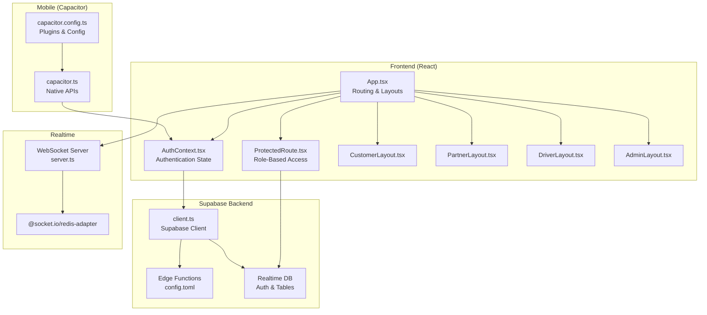
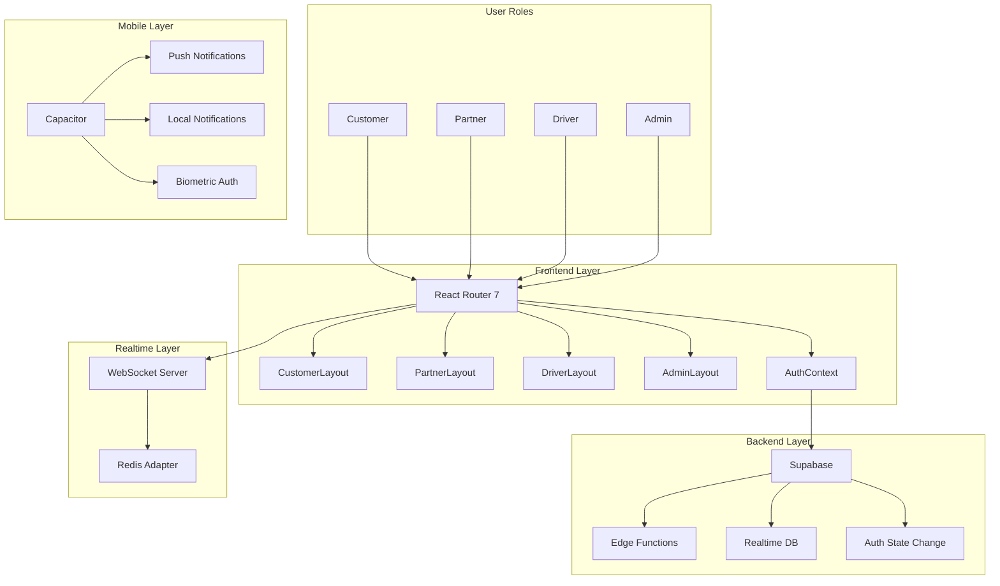
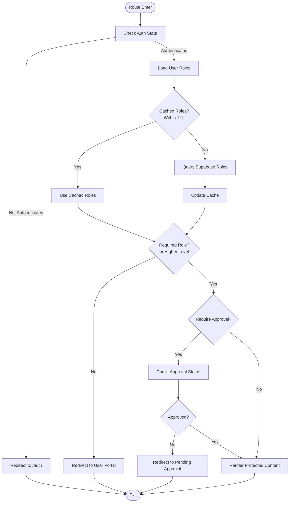
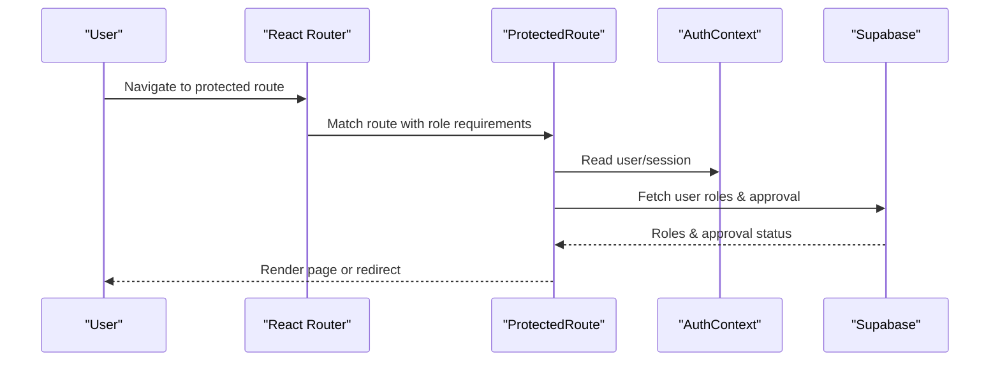
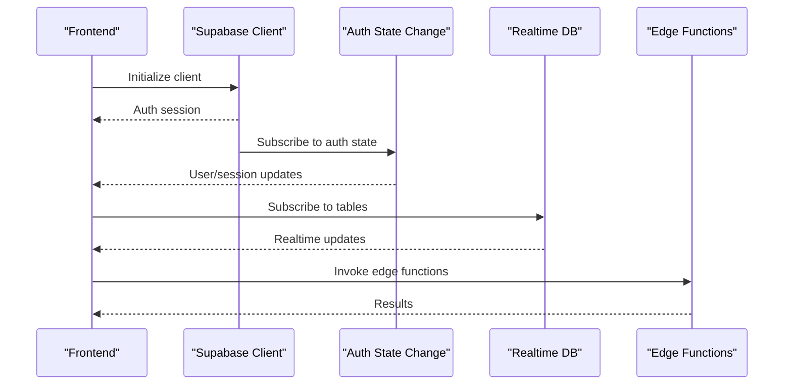
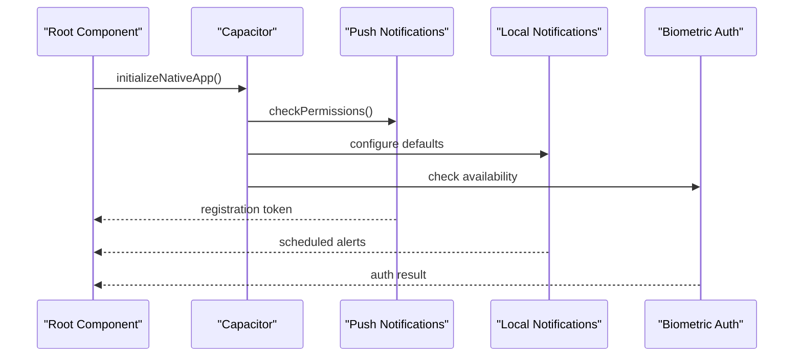
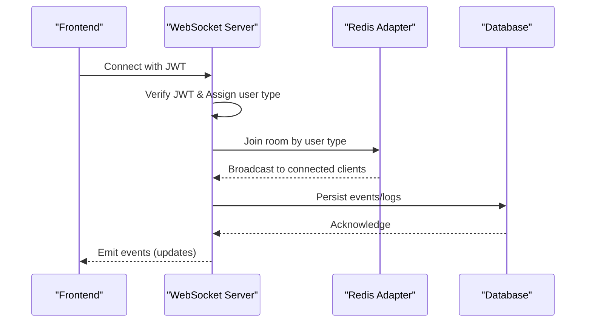
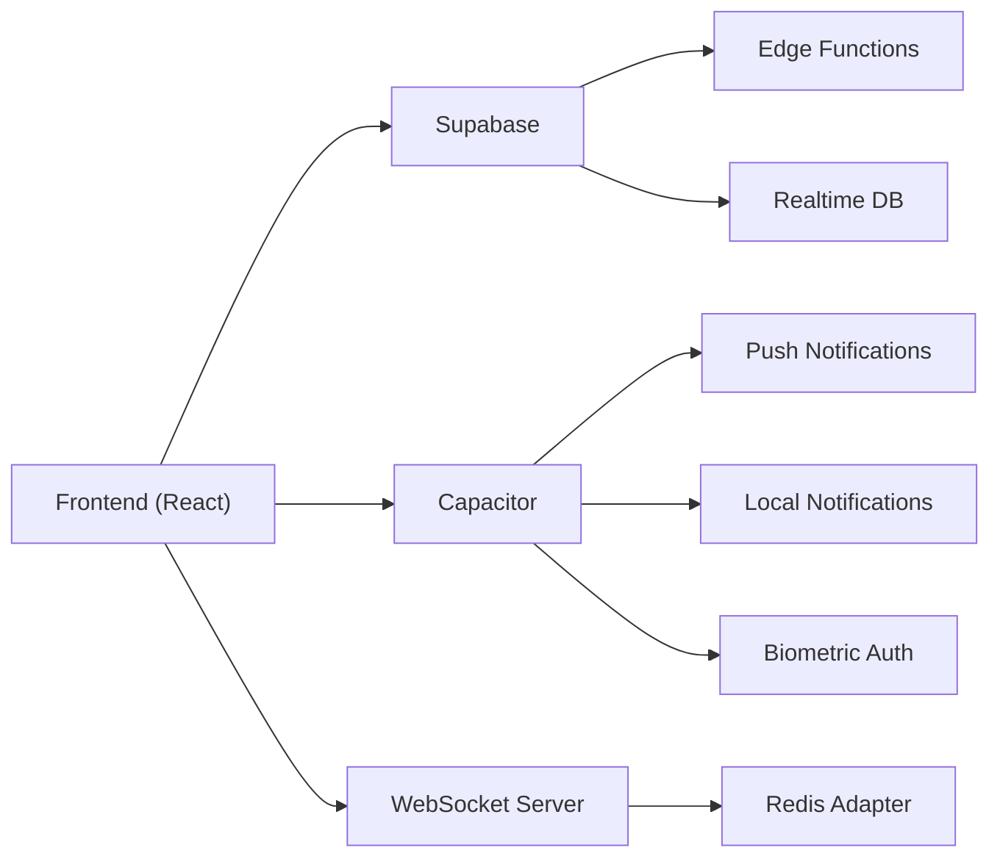

# Platform Architecture

<cite>
**Referenced Files in This Document**
- [App.tsx](file://src/App.tsx)
- [main.tsx](file://src/main.tsx)
- [AuthContext.tsx](file://src/contexts/AuthContext.tsx)
- [ProtectedRoute.tsx](file://src/components/ProtectedRoute.tsx)
- [CustomerLayout.tsx](file://src/components/CustomerLayout.tsx)
- [PartnerLayout.tsx](file://src/components/PartnerLayout.tsx)
- [DriverLayout.tsx](file://src/components/DriverLayout.tsx)
- [AdminLayout.tsx](file://src/components/AdminLayout.tsx)
- [client.ts](file://src/integrations/supabase/client.ts)
- [notifications.ts](file://src/lib/notifications.ts)
- [capacitor.ts](file://src/lib/capacitor.ts)
- [capacitor.config.ts](file://capacitor.config.ts)
- [config.toml](file://supabase/config.toml)
- [server.ts](file://websocket-server/src/server.ts)
- [package.json](file://websocket-server/package.json)
</cite>

## Table of Contents
1. [Introduction](#introduction)
2. [Project Structure](#project-structure)
3. [Core Components](#core-components)
4. [Architecture Overview](#architecture-overview)
5. [Detailed Component Analysis](#detailed-component-analysis)
6. [Dependency Analysis](#dependency-analysis)
7. [Performance Considerations](#performance-considerations)
8. [Troubleshooting Guide](#troubleshooting-guide)
9. [Conclusion](#conclusion)

## Introduction
This document presents the Nutrio platform architecture with a focus on the multi-role system design and component relationships. The platform supports four primary user roles—customer, partner (restaurant), driver, and admin—each with distinct portals and capabilities. The architecture integrates:

- Frontend built with React Router 7, context-based state management, and role-specific layouts
- Backend powered by Supabase with edge functions, real-time database features, and robust authentication flows
- Mobile experience via Capacitor plugins and native feature integration
- Real-time communication using WebSockets and push notifications
- Scalable patterns leveraging Supabase edge functions and a dedicated WebSocket server with Redis adapter

## Project Structure
The platform follows a feature-based frontend structure with role-specific routing and layouts. Supabase manages authentication, edge functions, and real-time subscriptions. A separate WebSocket server handles real-time tracking for fleet management with horizontal scaling support.

**Diagram sources**
- [App.tsx:139-739](file://src/App.tsx#L139-L739)
- [AuthContext.tsx:31-131](file://src/contexts/AuthContext.tsx#L31-L131)
- [ProtectedRoute.tsx:139-230](file://src/components/ProtectedRoute.tsx#L139-L230)
- [CustomerLayout.tsx:8-21](file://src/components/CustomerLayout.tsx#L8-L21)
- [PartnerLayout.tsx:27-140](file://src/components/PartnerLayout.tsx#L27-L140)
- [DriverLayout.tsx:16-182](file://src/components/DriverLayout.tsx#L16-L182)
- [AdminLayout.tsx:25-129](file://src/components/AdminLayout.tsx#L25-L129)
- [client.ts:47-57](file://src/integrations/supabase/client.ts#L47-L57)
- [config.toml:1-59](file://supabase/config.toml#L1-L59)
- [capacitor.config.ts:3-42](file://capacitor.config.ts#L3-L42)
- [capacitor.ts:590-608](file://src/lib/capacitor.ts#L590-L608)
- [server.ts:34-51](file://websocket-server/src/server.ts#L34-L51)
- [package.json:21-30](file://websocket-server/package.json#L21-L30)

**Section sources**
- [App.tsx:139-739](file://src/App.tsx#L139-L739)
- [main.tsx:1-50](file://src/main.tsx#L1-50)

## Core Components
- Multi-role routing and protection: The application defines protected routes with role hierarchies and optional approval checks for partner accounts.
- Context-based authentication: Centralized auth state management with Supabase integration and native session persistence.
- Role-specific layouts: Dedicated layouts for customer, partner, driver, and admin portals with tailored navigation and access controls.
- Supabase integration: Client initialization with Capacitor storage adapter, edge functions configuration, and real-time subscriptions.
- Mobile native features: Capacitor plugin wrappers for push notifications, local notifications, biometric authentication, haptics, and device APIs.
- Real-time communication: WebSocket server with Redis adapter for scalable fleet tracking and JWT-based authentication.

**Section sources**
- [ProtectedRoute.tsx:17-24](file://src/components/ProtectedRoute.tsx#L17-L24)
- [AuthContext.tsx:31-131](file://src/contexts/AuthContext.tsx#L31-L131)
- [CustomerLayout.tsx:8-21](file://src/components/CustomerLayout.tsx#L8-L21)
- [PartnerLayout.tsx:27-140](file://src/components/PartnerLayout.tsx#L27-L140)
- [DriverLayout.tsx:16-182](file://src/components/DriverLayout.tsx#L16-L182)
- [AdminLayout.tsx:25-129](file://src/components/AdminLayout.tsx#L25-L129)
- [client.ts:47-57](file://src/integrations/supabase/client.ts#L47-L57)
- [capacitor.ts:590-608](file://src/lib/capacitor.ts#L590-L608)
- [server.ts:34-51](file://websocket-server/src/server.ts#L34-L51)

## Architecture Overview
The platform enforces separation of concerns across role-specific portals while sharing common infrastructure:

- Frontend routing and layouts manage user journeys and role-based access.
- Supabase handles authentication, session persistence, and real-time data synchronization.
- Edge functions encapsulate business logic and integrations (notifications, analytics, processing).
- Capacitor bridges web code with native device capabilities for push, biometrics, and OS features.
- WebSocket server provides real-time tracking for fleet operations with Redis adapter for clustering.

**Diagram sources**
- [App.tsx:174-727](file://src/App.tsx#L174-L727)
- [AuthContext.tsx:36-61](file://src/contexts/AuthContext.tsx#L36-L61)
- [ProtectedRoute.tsx:139-189](file://src/components/ProtectedRoute.tsx#L139-L189)
- [client.ts:47-57](file://src/integrations/supabase/client.ts#L47-L57)
- [capacitor.ts:321-405](file://src/lib/capacitor.ts#L321-L405)
- [server.ts:34-51](file://websocket-server/src/server.ts#L34-L51)
- [package.json:21-30](file://websocket-server/package.json#L21-L30)

## Detailed Component Analysis

### Multi-Role System Design
The multi-role system determines access based on user roles and optional approval states. It caches role checks to minimize database queries and redirects users to appropriate dashboards when insufficient privileges are detected.

**Diagram sources**
- [ProtectedRoute.tsx:139-230](file://src/components/ProtectedRoute.tsx#L139-L230)
- [ProtectedRoute.tsx:40-98](file://src/components/ProtectedRoute.tsx#L40-L98)
- [ProtectedRoute.tsx:124-137](file://src/components/ProtectedRoute.tsx#L124-L137)

**Section sources**
- [ProtectedRoute.tsx:17-24](file://src/components/ProtectedRoute.tsx#L17-L24)
- [ProtectedRoute.tsx:34-35](file://src/components/ProtectedRoute.tsx#L34-L35)
- [ProtectedRoute.tsx:160-189](file://src/components/ProtectedRoute.tsx#L160-L189)

### Frontend Architecture: Routing, Context, and Layouts
- Routing: The application uses React Router 7 with lazy-loaded routes grouped by feature areas and separated by portal routes.
- Context: AuthProvider manages session state and exposes sign-up, sign-in, and sign-out operations.
- Layouts: Role-specific layouts provide consistent navigation and breadcrumbs, with additional driver-specific online/offline toggles.

**Diagram sources**
- [App.tsx:174-727](file://src/App.tsx#L174-L727)
- [ProtectedRoute.tsx:139-189](file://src/components/ProtectedRoute.tsx#L139-L189)
- [AuthContext.tsx:36-61](file://src/contexts/AuthContext.tsx#L36-L61)

**Section sources**
- [App.tsx:174-727](file://src/App.tsx#L174-L727)
- [AuthContext.tsx:31-131](file://src/contexts/AuthContext.tsx#L31-L131)
- [CustomerLayout.tsx:8-21](file://src/components/CustomerLayout.tsx#L8-L21)
- [PartnerLayout.tsx:27-140](file://src/components/PartnerLayout.tsx#L27-L140)
- [DriverLayout.tsx:16-182](file://src/components/DriverLayout.tsx#L16-L182)
- [AdminLayout.tsx:25-129](file://src/components/AdminLayout.tsx#L25-L129)

### Backend Architecture: Supabase Integration
- Supabase client: Initializes with Capacitor storage adapter for native sessions and persistent auth.
- Edge functions: Configured via TOML with JWT verification flags per function.
- Real-time: Auth state changes and database subscriptions enable reactive UI updates.

**Diagram sources**
- [client.ts:47-57](file://src/integrations/supabase/client.ts#L47-L57)
- [AuthContext.tsx:36-61](file://src/contexts/AuthContext.tsx#L36-L61)
- [config.toml:3-59](file://supabase/config.toml#L3-L59)

**Section sources**
- [client.ts:47-57](file://src/integrations/supabase/client.ts#L47-L57)
- [config.toml:1-59](file://supabase/config.toml#L1-L59)

### Mobile Architecture: Capacitor Integration
- Capacitor configuration enables native features including splash screen, push notifications, local notifications, and biometric authentication.
- Native API wrappers provide safe access to device capabilities with graceful fallbacks for web environments.
- Initialization ensures proper status bar styling, splash screen behavior, and permission checks on app launch.

**Diagram sources**
- [main.tsx:20-47](file://src/main.tsx#L20-L47)
- [capacitor.ts:590-608](file://src/lib/capacitor.ts#L590-L608)
- [capacitor.config.ts:19-41](file://capacitor.config.ts#L19-L41)

**Section sources**
- [capacitor.ts:590-608](file://src/lib/capacitor.ts#L590-L608)
- [capacitor.config.ts:3-42](file://capacitor.config.ts#L3-L42)

### Real-Time Communication: WebSockets and Notifications
- WebSocket server: Implements JWT authentication, user type routing (driver/fleet), and Redis adapter for horizontal scaling.
- Event-driven handlers: Manage driver and fleet connections with connection metrics and health checks.
- Notification helpers: Centralized functions to create notifications for order and delivery updates.

**Diagram sources**
- [server.ts:65-103](file://websocket-server/src/server.ts#L65-L103)
- [server.ts:108-150](file://websocket-server/src/server.ts#L108-L150)
- [package.json:21-30](file://websocket-server/package.json#L21-L30)

**Section sources**
- [server.ts:34-51](file://websocket-server/src/server.ts#L34-L51)
- [server.ts:197-224](file://websocket-server/src/server.ts#L197-L224)
- [notifications.ts:18-35](file://src/lib/notifications.ts#L18-L35)

## Dependency Analysis
The platform exhibits clear separation of concerns with layered dependencies:

- Frontend depends on Supabase for auth and data, Capacitor for native features, and the WebSocket server for real-time tracking.
- Supabase edge functions encapsulate business logic and integrate with external services.
- The WebSocket server relies on Redis for clustering and JWT for secure authentication.

**Diagram sources**
- [App.tsx:139-739](file://src/App.tsx#L139-L739)
- [client.ts:47-57](file://src/integrations/supabase/client.ts#L47-L57)
- [capacitor.ts:321-405](file://src/lib/capacitor.ts#L321-L405)
- [server.ts:34-51](file://websocket-server/src/server.ts#L34-L51)
- [package.json:21-30](file://websocket-server/package.json#L21-L30)

**Section sources**
- [App.tsx:139-739](file://src/App.tsx#L139-L739)
- [client.ts:47-57](file://src/integrations/supabase/client.ts#L47-L57)
- [capacitor.ts:321-405](file://src/lib/capacitor.ts#L321-L405)
- [server.ts:34-51](file://websocket-server/src/server.ts#L34-L51)

## Performance Considerations
- Role caching: The ProtectedRoute component caches role checks to reduce repeated database queries.
- Lazy loading: Routes are lazily loaded to improve initial bundle size and render performance.
- Supabase session persistence: Capacitor storage adapter ensures efficient session handling on native platforms.
- WebSocket scaling: Redis adapter enables horizontal scaling for real-time tracking.
- Edge functions: Offload compute-intensive tasks from the client to serverless functions.

[No sources needed since this section provides general guidance]

## Troubleshooting Guide
Common issues and resolutions:

- Authentication failures: Verify Supabase environment variables and session persistence. Check auth state change listeners and network connectivity.
- Role access denied: Confirm user roles in the database and cache invalidation. Ensure approval status for partner routes.
- Mobile push notifications: Validate Capacitor plugin configuration and permission requests. Test token registration and notification callbacks.
- WebSocket connection errors: Check JWT validity, Redis health, and server capacity limits. Review logs for authentication and transport errors.
- Edge function errors: Inspect function logs and environment variables. Ensure proper JWT verification settings.

**Section sources**
- [AuthContext.tsx:36-61](file://src/contexts/AuthContext.tsx#L36-L61)
- [ProtectedRoute.tsx:139-230](file://src/components/ProtectedRoute.tsx#L139-L230)
- [capacitor.ts:321-405](file://src/lib/capacitor.ts#L321-L405)
- [server.ts:155-157](file://websocket-server/src/server.ts#L155-L157)
- [config.toml:3-59](file://supabase/config.toml#L3-L59)

## Conclusion
The Nutrio platform employs a clean, layered architecture that separates concerns across role-specific portals, shared backend services, and native mobile capabilities. Supabase provides robust authentication, real-time data, and serverless edge functions, while Capacitor delivers seamless native experiences. The WebSocket server scales horizontally for real-time fleet tracking, and the multi-role system ensures secure, contextual access to features. This design supports future growth through modular components, edge computing, and scalable real-time infrastructure.