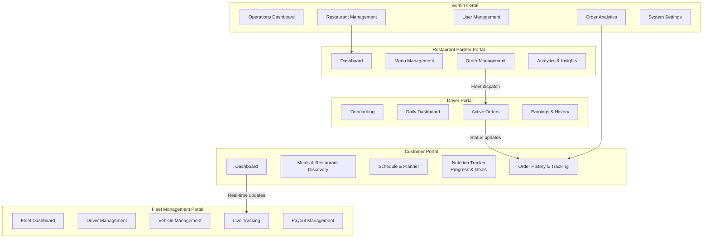
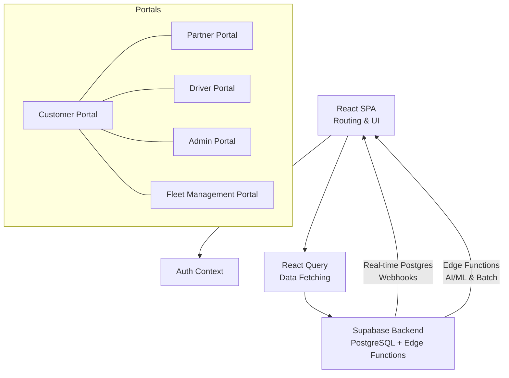
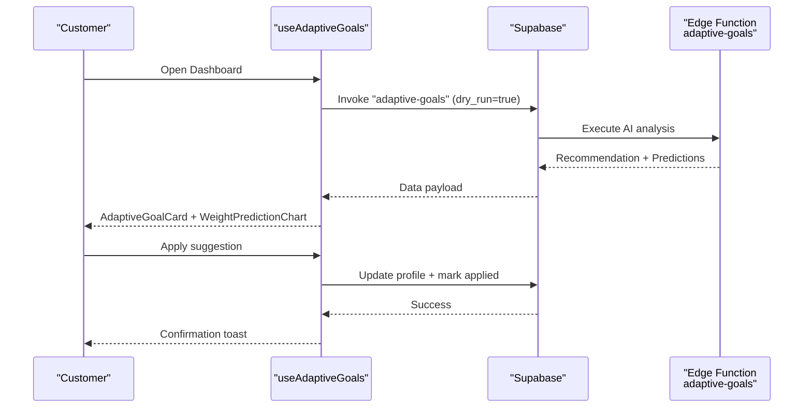
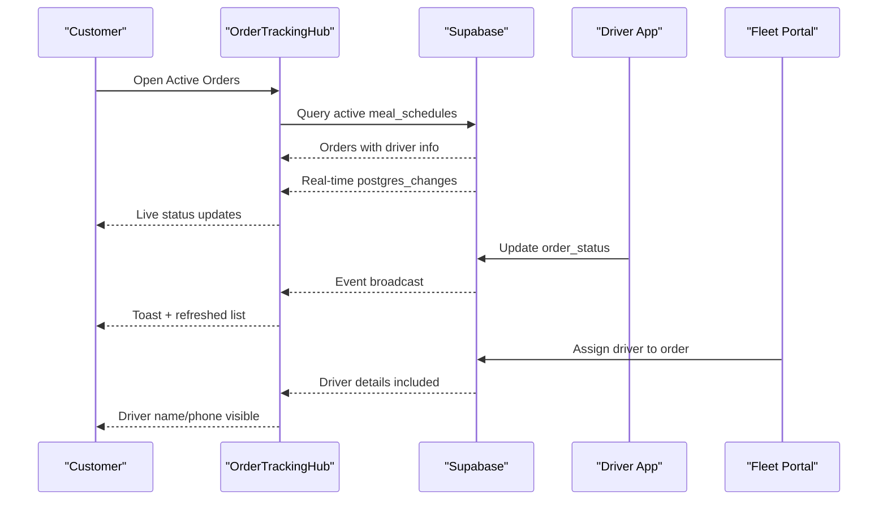
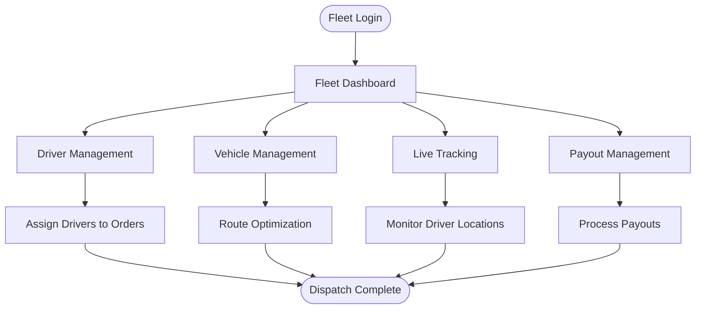
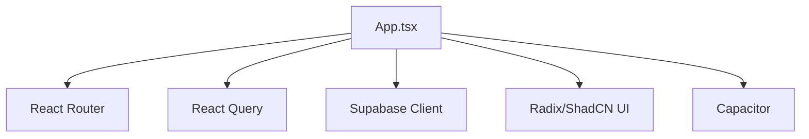

# Project Overview

<cite>
**Referenced Files in This Document**
- [README.md](file://README.md)
- [package.json](file://package.json)
- [src/App.tsx](file://src/App.tsx)
- [src/fleet/index.ts](file://src/fleet/index.ts)
- [src/fleet/routes.tsx](file://src/fleet/routes.tsx)
- [src/components/AdaptiveGoalCard.tsx](file://src/components/AdaptiveGoalCard.tsx)
- [src/hooks/useAdaptiveGoals.ts](file://src/hooks/useAdaptiveGoals.ts)
- [ADAPTIVE_GOALS_IMPLEMENTATION_SUMMARY.md](file://ADAPTIVE_GOALS_IMPLEMENTATION_SUMMARY.md)
- [src/pages/DeliveryTracking.tsx](file://src/pages/DeliveryTracking.tsx)
- [src/components/OrderTrackingHub.tsx](file://src/components/OrderTrackingHub.tsx)
- [docs/PRODUCT_STRATEGY.md](file://docs/PRODUCT_STRATEGY.md)
</cite>

## Table of Contents
1. [Introduction](#introduction)
2. [Project Structure](#project-structure)
3. [Core Components](#core-components)
4. [Architecture Overview](#architecture-overview)
5. [Detailed Component Analysis](#detailed-component-analysis)
6. [Dependency Analysis](#dependency-analysis)
7. [Performance Considerations](#performance-considerations)
8. [Troubleshooting Guide](#troubleshooting-guide)
9. [Conclusion](#conclusion)

## Introduction
Nutrio (formerly NUTRIO) is a multi-role digital platform designed to deliver healthy meals while enabling precise nutrition tracking and intelligent progress management. The platform serves four primary stakeholder groups:
- Customers: Users seeking convenient, nutritious meals with personalized nutrition guidance
- Restaurant Partners: Food providers integrated into the marketplace with operational tools
- Delivery Drivers: Independent contractors managing real-time deliveries
- Administrators: Platform operators overseeing operations, analytics, and ecosystem governance

The platform’s core value proposition centers on three pillars:
- Automated nutrition recommendations powered by adaptive goals and AI/ML logic
- End-to-end meal delivery management with real-time tracking and fleet orchestration
- Intelligent progress tracking with predictive insights and user-centric recommendations

This overview synthesizes both conceptual stakeholder benefits and technical implementation details, using terminology consistent with the codebase such as adaptive goals, fleet management, and real-time tracking.

## Project Structure
The application is a modern React-based single-page application with a comprehensive routing system supporting multiple portals:
- Customer portal for browsing, ordering, nutrition tracking, and progress monitoring
- Restaurant partner portal for menu management, order handling, and analytics
- Driver portal for onboarding, route execution, and earnings management
- Administrator portal for operations oversight, reporting, and policy management
- Fleet Management Portal for centralized driver and vehicle oversight with live tracking and payout management

**Diagram sources**
- [src/App.tsx:174-727](file://src/App.tsx#L174-L727)
- [src/fleet/routes.tsx:20-41](file://src/fleet/routes.tsx#L20-L41)

**Section sources**
- [src/App.tsx:174-727](file://src/App.tsx#L174-L727)
- [src/fleet/routes.tsx:20-41](file://src/fleet/routes.tsx#L20-L41)

## Core Components
This section highlights the platform’s foundational capabilities that enable its multi-stakeholder mission.

- Adaptive Goals System
  - Purpose: Automatically adjust daily nutrition targets based on user progress, adherence, and AI/ML analysis
  - Key Elements: Recommendation cards, settings panel, prediction charts, and backend edge functions
  - Impact: Personalized nutrition without manual recalibration, improved goal achievement, and reduced user churn

- Real-Time Delivery & Fleet Management
  - Purpose: Coordinate driver assignments, optimize routes, and provide transparent tracking for all stakeholders
  - Key Elements: Live tracking dashboards, driver management, vehicle oversight, and automated dispatch logic
  - Impact: Efficient operations, predictable delivery windows, and scalable fleet growth

- Nutrition Tracking & Progress Monitoring
  - Purpose: Enable users to log meals, monitor macronutrients, track weight trends, and visualize progress
  - Key Elements: Daily trackers, progress cards, goal adherence metrics, and predictive weight modeling
  - Impact: Data-driven behavior change, motivation through insights, and alignment with health objectives

Practical examples:
- Adaptive Goals: A user on a weight-loss journey receives a suggestion to reduce calories after detecting a plateau, with a confidence score and actionable tip
- Real-Time Tracking: A customer views an order moving from “preparing” to “out for delivery,” with driver details and estimated arrival
- Fleet Management: An administrator monitors driver utilization, assigns nearby drivers to pending orders, and processes payouts

**Section sources**
- [ADAPTIVE_GOALS_IMPLEMENTATION_SUMMARY.md:136-166](file://ADAPTIVE_GOALS_IMPLEMENTATION_SUMMARY.md#L136-L166)
- [src/components/AdaptiveGoalCard.tsx:1-218](file://src/components/AdaptiveGoalCard.tsx#L1-L218)
- [src/hooks/useAdaptiveGoals.ts:62-407](file://src/hooks/useAdaptiveGoals.ts#L62-L407)
- [src/pages/DeliveryTracking.tsx:113-592](file://src/pages/DeliveryTracking.tsx#L113-L592)
- [src/components/OrderTrackingHub.tsx:37-235](file://src/components/OrderTrackingHub.tsx#L37-L235)
- [src/fleet/index.ts:1-14](file://src/fleet/index.ts#L1-L14)

## Architecture Overview
The platform employs a modular, role-based routing architecture with shared components and a centralized Supabase backend. The frontend integrates real-time subscriptions for dynamic updates, while edge functions power AI-driven recommendations and batch processing.

**Diagram sources**
- [src/App.tsx:139-739](file://src/App.tsx#L139-L739)
- [src/hooks/useAdaptiveGoals.ts:137-178](file://src/hooks/useAdaptiveGoals.ts#L137-L178)

**Section sources**
- [src/App.tsx:139-739](file://src/App.tsx#L139-L739)
- [src/hooks/useAdaptiveGoals.ts:137-178](file://src/hooks/useAdaptiveGoals.ts#L137-L178)

## Detailed Component Analysis

### Adaptive Goals System
The adaptive goals system continuously analyzes user progress and suggests personalized nutrition adjustments. It combines historical data, adherence metrics, and predictive models to propose safe, effective changes.

**Diagram sources**
- [src/hooks/useAdaptiveGoals.ts:137-178](file://src/hooks/useAdaptiveGoals.ts#L137-L178)
- [src/hooks/useAdaptiveGoals.ts:246-286](file://src/hooks/useAdaptiveGoals.ts#L246-L286)
- [src/components/AdaptiveGoalCard.tsx:28-218](file://src/components/AdaptiveGoalCard.tsx#L28-L218)
- [ADAPTIVE_GOALS_IMPLEMENTATION_SUMMARY.md:136-166](file://ADAPTIVE_GOALS_IMPLEMENTATION_SUMMARY.md#L136-L166)

**Section sources**
- [src/hooks/useAdaptiveGoals.ts:62-407](file://src/hooks/useAdaptiveGoals.ts#L62-L407)
- [src/components/AdaptiveGoalCard.tsx:1-218](file://src/components/AdaptiveGoalCard.tsx#L1-L218)
- [ADAPTIVE_GOALS_IMPLEMENTATION_SUMMARY.md:1-309](file://ADAPTIVE_GOALS_IMPLEMENTATION_SUMMARY.md#L1-L309)

### Real-Time Delivery Tracking
The delivery tracking hub aggregates active orders, subscribes to real-time updates, and presents actionable controls for customers. It integrates with the fleet management system to reflect driver assignments and status changes.

**Diagram sources**
- [src/components/OrderTrackingHub.tsx:37-235](file://src/components/OrderTrackingHub.tsx#L37-L235)
- [src/pages/DeliveryTracking.tsx:113-592](file://src/pages/DeliveryTracking.tsx#L113-L592)

**Section sources**
- [src/components/OrderTrackingHub.tsx:37-235](file://src/components/OrderTrackingHub.tsx#L37-L235)
- [src/pages/DeliveryTracking.tsx:113-592](file://src/pages/DeliveryTracking.tsx#L113-L592)

### Fleet Management Portal
The fleet management portal centralizes driver and vehicle oversight, enabling administrators to manage dispatch, monitor live locations, and process payouts.

**Diagram sources**
- [src/fleet/routes.tsx:20-41](file://src/fleet/routes.tsx#L20-L41)
- [src/fleet/index.ts:1-14](file://src/fleet/index.ts#L1-14)

**Section sources**
- [src/fleet/routes.tsx:20-41](file://src/fleet/routes.tsx#L20-L41)
- [src/fleet/index.ts:1-14](file://src/fleet/index.ts#L1-L14)

### Conceptual Overview
From a stakeholder perspective:
- Customers benefit from intelligent, personalized nutrition guidance and seamless order experiences with real-time visibility
- Restaurant Partners gain operational tools to manage menus, orders, and analytics, improving efficiency and customer satisfaction
- Delivery Drivers enjoy streamlined onboarding, clear order assignment, and transparent earnings management
- Administrators oversee platform operations, enforce policies, and drive growth through data-driven insights
- Fleet Management enables centralized oversight of drivers and vehicles, ensuring scalability and reliability

These capabilities align with the platform’s long-term strategy to evolve from a meal delivery marketplace into an AI-powered nutrition intelligence platform, integrating deeply with health ecosystems and expanding globally.

**Section sources**
- [docs/PRODUCT_STRATEGY.md:10-23](file://docs/PRODUCT_STRATEGY.md#L10-L23)
- [docs/PRODUCT_STRATEGY.md:137-166](file://docs/PRODUCT_STRATEGY.md#L137-L166)

## Dependency Analysis
The application relies on a cohesive set of dependencies and integrations:
- React ecosystem: React Router for routing, React Query for data fetching, Radix UI and ShadCN components for UI primitives
- Supabase integration: Authentication, real-time Postgres, and edge functions for AI/ML logic
- Mobile/native: Capacitor for cross-platform capabilities
- Observability and analytics: PostHog, Sentry, and notification services

**Diagram sources**
- [src/App.tsx:1-14](file://src/App.tsx#L1-L14)
- [package.json:44-126](file://package.json#L44-L126)

**Section sources**
- [package.json:44-126](file://package.json#L44-L126)
- [src/App.tsx:1-14](file://src/App.tsx#L1-L14)

## Performance Considerations
- Real-time subscriptions: Use targeted queries and efficient polling to minimize bandwidth and battery usage on mobile devices
- Edge functions: Offload heavy computations (e.g., adaptive goals analysis) to edge functions to keep the client responsive
- Image optimization: Lazy-load meal images and thumbnails to improve initial render performance
- Pagination and virtualization: Implement infinite scrolling and virtualized lists for order histories and tracking feeds
- Caching: Cache frequently accessed data (e.g., restaurant and menu metadata) to reduce redundant network calls

## Troubleshooting Guide
Common issues and resolutions:
- Adaptive Goals not available
  - Symptom: Recommendation card does not appear or shows a message indicating AI analysis is not available
  - Cause: Edge function not deployed or CORS error
  - Resolution: Deploy the adaptive goals edge functions and ensure proper CORS configuration
  - Reference: [src/hooks/useAdaptiveGoals.ts:149-178](file://src/hooks/useAdaptiveGoals.ts#L149-L178)

- Real-time updates not reflecting
  - Symptom: Order status does not update without manual refresh
  - Cause: Real-time subscription not established or channel removed
  - Resolution: Verify real-time subscription setup and ensure channels are subscribed/unsubscribed correctly
  - Reference: [src/components/OrderTrackingHub.tsx:94-114](file://src/components/OrderTrackingHub.tsx#L94-L114), [src/pages/DeliveryTracking.tsx:258-275](file://src/pages/DeliveryTracking.tsx#L258-L275)

- Fleet tracking discrepancies
  - Symptom: Driver location or status mismatch
  - Cause: Delayed updates or stale data
  - Resolution: Confirm live tracking is enabled and refresh the fleet dashboard; verify driver app connectivity
  - Reference: [src/fleet/routes.tsx:20-41](file://src/fleet/routes.tsx#L20-L41)

**Section sources**
- [src/hooks/useAdaptiveGoals.ts:149-178](file://src/hooks/useAdaptiveGoals.ts#L149-L178)
- [src/components/OrderTrackingHub.tsx:94-114](file://src/components/OrderTrackingHub.tsx#L94-L114)
- [src/pages/DeliveryTracking.tsx:258-275](file://src/pages/DeliveryTracking.tsx#L258-L275)
- [src/fleet/routes.tsx:20-41](file://src/fleet/routes.tsx#L20-L41)

## Conclusion
Nutrio delivers a comprehensive, multi-stakeholder platform that blends healthy meal delivery with intelligent nutrition guidance and robust operational management. Through adaptive goals, real-time delivery tracking, and centralized fleet oversight, the platform creates a seamless ecosystem for customers, restaurant partners, drivers, and administrators. Its technical foundation—built on React, Supabase, and edge computing—enables scalable, data-driven personalization and operational excellence, aligning with a forward-looking strategy to become a leading AI-powered nutrition intelligence platform.