# Technology Stack

<cite>
**Referenced Files in This Document**
- [package.json](file://package.json)
- [vite.config.ts](file://vite.config.ts)
- [tailwind.config.ts](file://tailwind.config.ts)
- [capacitor.config.ts](file://capacitor.config.ts)
- [playwright.config.ts](file://playwright.config.ts)
- [vitest.config.ts](file://vitest.config.ts)
- [src/integrations/supabase/client.ts](file://src/integrations/supabase/client.ts)
- [supabase/config.toml](file://supabase/config.toml)
- [vercel.json](file://vercel.json)
- [DEPLOYMENT.md](file://DEPLOYMENT.md)
- [websocket-server/package.json](file://websocket-server/package.json)
- [AGENTS.md](file://AGENTS.md)
- [AI_IMPLEMENTATION_SUMMARY.md](file://AI_IMPLEMENTATION_SUMMARY.md)
- [src/lib/ai-report-generator.ts](file://src/lib/ai-report-generator.ts)
- [src/lib/meal-plan-generator.ts](file://src/lib/meal-plan-generator.ts)
</cite>

## Table of Contents
1. [Introduction](#introduction)
2. [Project Structure](#project-structure)
3. [Core Components](#core-components)
4. [Architecture Overview](#architecture-overview)
5. [Detailed Component Analysis](#detailed-component-analysis)
6. [Dependency Analysis](#dependency-analysis)
7. [Performance Considerations](#performance-considerations)
8. [Troubleshooting Guide](#troubleshooting-guide)
9. [Conclusion](#conclusion)
10. [Appendices](#appendices)

## Introduction
This document presents the modern full-stack technology stack powering Nutrio. It covers the frontend (React 18 with TypeScript, Tailwind CSS, and UI primitives), backend infrastructure (Supabase with PostgreSQL, Edge Functions, and real-time capabilities), mobile development (Capacitor for cross-platform deployment), testing ecosystem (Playwright and Vitest), build tooling (Vite), and deployment infrastructure. It also documents AI/ML integration points, WebSocket real-time features, and cloud infrastructure choices, with technical rationale and roadmap considerations.

## Project Structure
The repository follows a monorepo-like structure with a React SPA frontend, Supabase backend assets, a dedicated WebSocket server, and Capacitor-based native app integration. Key directories and files:
- Frontend: React 18 SPA with TypeScript, Vite build, Tailwind CSS, and UI primitives.
- Backend: Supabase project with migrations, Edge Functions, and typed client.
- Mobile: Capacitor configuration for iOS and Android.
- Testing: Playwright for E2E and Vitest for unit tests.
- Realtime: Dedicated WebSocket server for fleet tracking.
- Deployment: Vercel configuration and Supabase hosting.

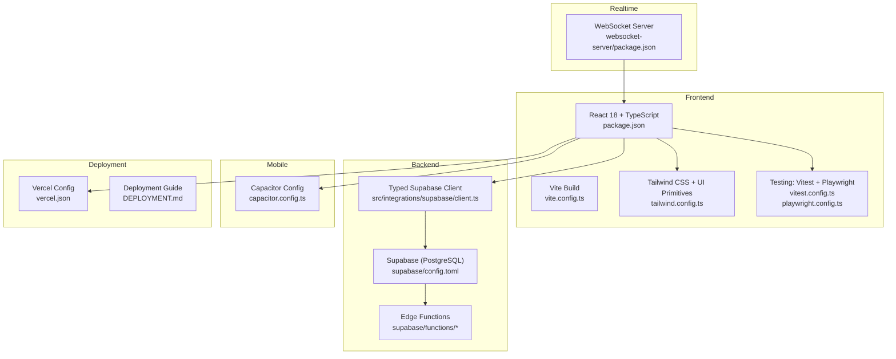

**Diagram sources**
- [vite.config.ts:1-77](file://vite.config.ts#L1-L77)
- [package.json:1-159](file://package.json#L1-L159)
- [tailwind.config.ts:1-128](file://tailwind.config.ts#L1-L128)
- [vitest.config.ts:1-28](file://vitest.config.ts#L1-L28)
- [playwright.config.ts:1-92](file://playwright.config.ts#L1-L92)
- [src/integrations/supabase/client.ts:1-57](file://src/integrations/supabase/client.ts#L1-L57)
- [supabase/config.toml:1-59](file://supabase/config.toml#L1-L59)
- [capacitor.config.ts:1-45](file://capacitor.config.ts#L1-L45)
- [websocket-server/package.json:1-44](file://websocket-server/package.json#L1-L44)
- [vercel.json:1-38](file://vercel.json#L1-L38)
- [DEPLOYMENT.md:1-137](file://DEPLOYMENT.md#L1-L137)

**Section sources**
- [AGENTS.md:36-101](file://AGENTS.md#L36-L101)
- [DEPLOYMENT.md:1-137](file://DEPLOYMENT.md#L1-L137)

## Core Components
- Frontend framework and tooling: React 18 with TypeScript, Vite for dev/build, Tailwind CSS for styling, and UI primitives from Radix UI and shadcn/ui.
- Backend: Supabase for authentication, relational database, and serverless Edge Functions.
- Mobile: Capacitor for cross-platform native packaging and runtime features.
- Testing: Vitest for unit tests and Playwright for E2E tests.
- Realtime: Socket.IO-based WebSocket server for fleet tracking with Redis adapter.
- Deployment: Vercel for SPA hosting and Supabase for hosting and Edge Functions.

**Section sources**
- [package.json:44-126](file://package.json#L44-L126)
- [vite.config.ts:1-77](file://vite.config.ts#L1-L77)
- [tailwind.config.ts:1-128](file://tailwind.config.ts#L1-L128)
- [capacitor.config.ts:1-45](file://capacitor.config.ts#L1-L45)
- [playwright.config.ts:1-92](file://playwright.config.ts#L1-L92)
- [vitest.config.ts:1-28](file://vitest.config.ts#L1-L28)
- [src/integrations/supabase/client.ts:1-57](file://src/integrations/supabase/client.ts#L1-L57)
- [supabase/config.toml:1-59](file://supabase/config.toml#L1-L59)
- [websocket-server/package.json:1-44](file://websocket-server/package.json#L1-L44)
- [vercel.json:1-38](file://vercel.json#L1-L38)

## Architecture Overview
The system is a React SPA with four portals (Customer, Partner, Admin, Driver) served from a single codebase. Supabase provides the backend, including authentication, database, and Edge Functions. Capacitor enables native mobile builds. Real-time features are handled by a dedicated WebSocket server for fleet tracking. AI/ML is integrated via Supabase Edge Functions and an external chat API for weekly reports.

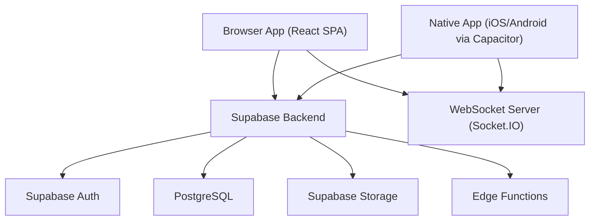

**Diagram sources**
- [AGENTS.md:36-81](file://AGENTS.md#L36-L81)
- [src/integrations/supabase/client.ts:1-57](file://src/integrations/supabase/client.ts#L1-L57)
- [supabase/config.toml:1-59](file://supabase/config.toml#L1-L59)
- [websocket-server/package.json:1-44](file://websocket-server/package.json#L1-L44)

## Detailed Component Analysis

### Frontend Stack: React 18 + TypeScript + Tailwind CSS + UI Libraries
- React 18 with TypeScript ensures type safety and modern React features. The project leverages Vite for fast development and optimized production builds.
- UI primitives are provided by Radix UI and shadcn/ui components, styled with Tailwind CSS. The design system uses CSS variables for theme tokens and animations.
- Routing is handled by React Router, with protected routes and lazy loading for performance.
- State management combines React Context for global state, TanStack Query for server state, and local state with useState/useReducer.

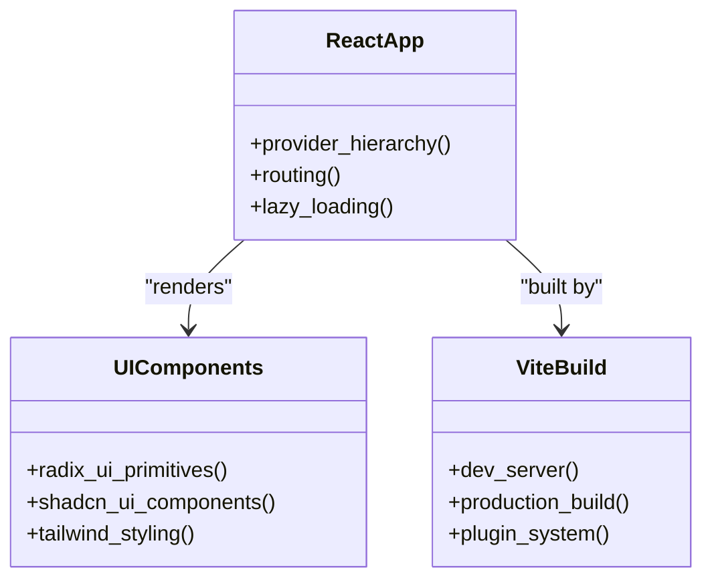

**Diagram sources**
- [AGENTS.md:36-101](file://AGENTS.md#L36-L101)
- [vite.config.ts:1-77](file://vite.config.ts#L1-L77)
- [tailwind.config.ts:1-128](file://tailwind.config.ts#L1-L128)
- [package.json:44-126](file://package.json#L44-L126)

**Section sources**
- [AGENTS.md:36-101](file://AGENTS.md#L36-L101)
- [vite.config.ts:1-77](file://vite.config.ts#L1-L77)
- [tailwind.config.ts:1-128](file://tailwind.config.ts#L1-L128)
- [package.json:44-126](file://package.json#L44-L126)

### Backend Infrastructure: Supabase with PostgreSQL, Edge Functions, and Real-time
- Supabase provides:
  - Authentication (Auth) with session persistence and auto-refresh.
  - Relational database with Row Level Security (RLS) enabled.
  - Edge Functions written in Deno for serverless logic (e.g., notifications, IP checks, AI engines).
  - Storage for assets and signed URLs.
- The typed Supabase client abstracts Supabase configuration and integrates with Capacitor preferences for native sessions.

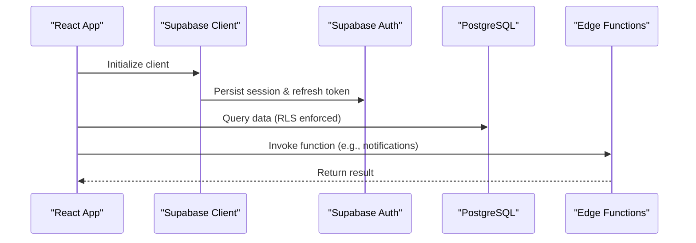

**Diagram sources**
- [src/integrations/supabase/client.ts:1-57](file://src/integrations/supabase/client.ts#L1-L57)
- [supabase/config.toml:1-59](file://supabase/config.toml#L1-L59)

**Section sources**
- [src/integrations/supabase/client.ts:1-57](file://src/integrations/supabase/client.ts#L1-L57)
- [supabase/config.toml:1-59](file://supabase/config.toml#L1-L59)
- [DEPLOYMENT.md:26-52](file://DEPLOYMENT.md#L26-L52)

### Mobile Development: Capacitor Cross-Platform Deployment
- Capacitor configuration defines the app ID, name, web build output, and server settings for development and production.
- Plugins include SplashScreen, PushNotifications, LocalNotifications, and NativeBiometric for biometric authentication.
- Native storage is abstracted via Capacitor Preferences for session persistence in the mobile app.

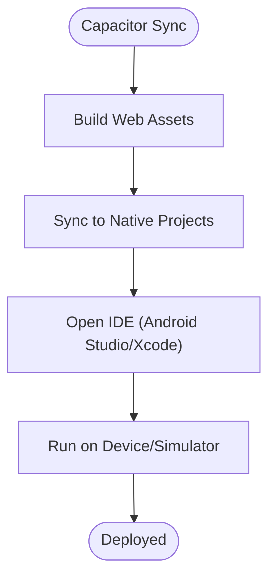

**Diagram sources**
- [capacitor.config.ts:1-45](file://capacitor.config.ts#L1-L45)
- [package.json:20-26](file://package.json#L20-L26)

**Section sources**
- [capacitor.config.ts:1-45](file://capacitor.config.ts#L1-L45)
- [package.json:20-26](file://package.json#L20-L26)

### Testing Ecosystem: Playwright and Vitest
- Vitest runs unit tests with jsdom environment, setup files, and coverage reporting.
- Playwright orchestrates E2E tests across desktop browsers, with HTML and JSON reporters, traces, screenshots, and video recording.
- Scripts support targeted E2E suites for cross-portal workflows.

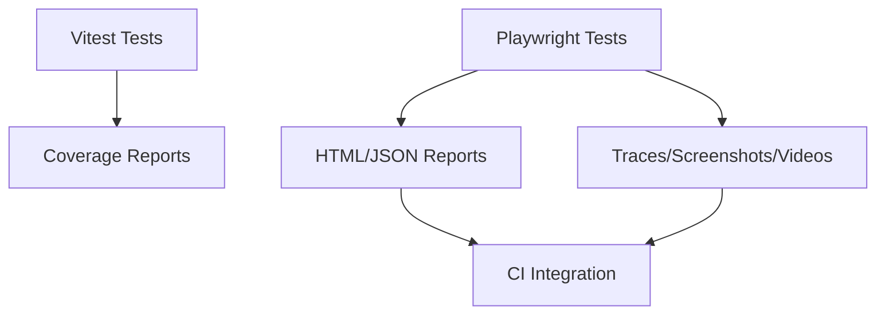

**Diagram sources**
- [vitest.config.ts:1-28](file://vitest.config.ts#L1-L28)
- [playwright.config.ts:1-92](file://playwright.config.ts#L1-L92)
- [package.json:13-42](file://package.json#L13-L42)

**Section sources**
- [vitest.config.ts:1-28](file://vitest.config.ts#L1-L28)
- [playwright.config.ts:1-92](file://playwright.config.ts#L1-L92)
- [package.json:13-42](file://package.json#L13-L42)

### Build Tools: Vite
- Vite is configured for modern browsers, HMR improvements, and production optimizations including Terser minification and chunk splitting.
- Aliased imports and dependency optimization improve build performance.
- Sentry integration for source maps in production.

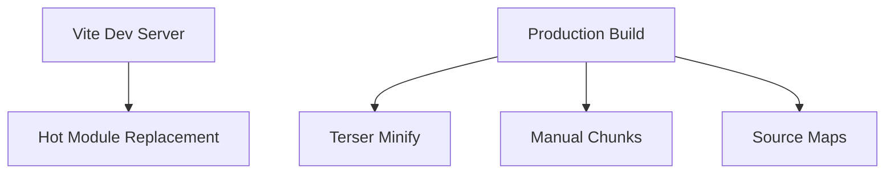

**Diagram sources**
- [vite.config.ts:1-77](file://vite.config.ts#L1-L77)

**Section sources**
- [vite.config.ts:1-77](file://vite.config.ts#L1-L77)

### Deployment Infrastructure
- Vercel configuration handles SPA routing and security headers.
- Supabase deployment and hosting are documented, including environment variables and automated deployment scripts.
- Edge Functions are deployed individually or via scripts.

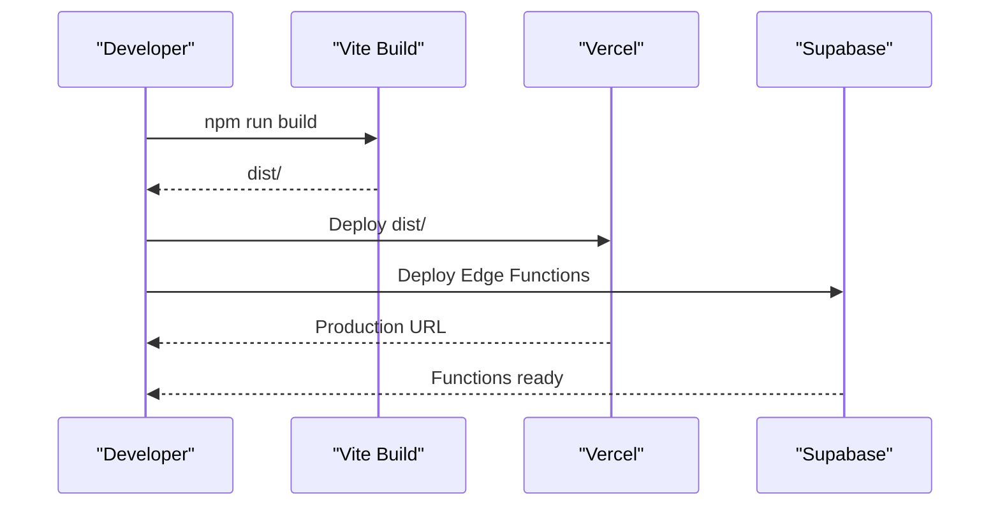

**Diagram sources**
- [vercel.json:1-38](file://vercel.json#L1-L38)
- [DEPLOYMENT.md:42-52](file://DEPLOYMENT.md#L42-L52)
- [package.json:8-10](file://package.json#L8-L10)

**Section sources**
- [vercel.json:1-38](file://vercel.json#L1-L38)
- [DEPLOYMENT.md:1-137](file://DEPLOYMENT.md#L1-L137)
- [package.json:8-10](file://package.json#L8-L10)

### AI/ML Integration Points
- Supabase Edge Functions implement five layers of AI/ML logic:
  - Layer 1: Nutrition profile engine (BMR, activity multipliers, macro distribution).
  - Layer 2: Smart meal allocator (greedy optimization with backtracking).
  - Layer 3: Dynamic adjustment engine (progress analysis, scenario-driven adjustments).
  - Layer 4: Behavior prediction engine (churn risk, boredom risk, retention actions).
  - Layer 5: Restaurant intelligence engine (demand scoring, capacity utilization).
- Weekly report generation integrates with an external chat API for personalized insights, with fallbacks for non-production environments.

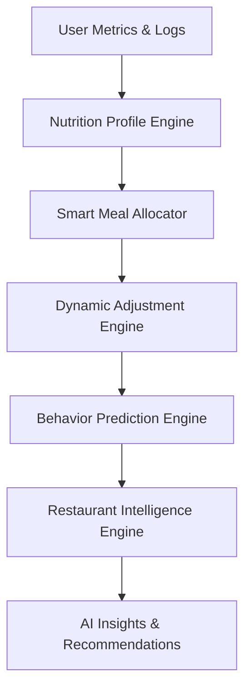

**Diagram sources**
- [AI_IMPLEMENTATION_SUMMARY.md:24-106](file://AI_IMPLEMENTATION_SUMMARY.md#L24-L106)
- [src/lib/ai-report-generator.ts:1-709](file://src/lib/ai-report-generator.ts#L1-L709)
- [src/lib/meal-plan-generator.ts:1-439](file://src/lib/meal-plan-generator.ts#L1-L439)

**Section sources**
- [AI_IMPLEMENTATION_SUMMARY.md:1-190](file://AI_IMPLEMENTATION_SUMMARY.md#L1-L190)
- [src/lib/ai-report-generator.ts:1-709](file://src/lib/ai-report-generator.ts#L1-L709)
- [src/lib/meal-plan-generator.ts:1-439](file://src/lib/meal-plan-generator.ts#L1-L439)

### WebSocket Implementation for Real-time Features
- A dedicated WebSocket server uses Socket.IO with Redis adapter for horizontal scaling and JWT-based authentication.
- The server connects to PostgreSQL and includes structured logging and type validation.
- The frontend can consume real-time updates for fleet tracking and other live features.

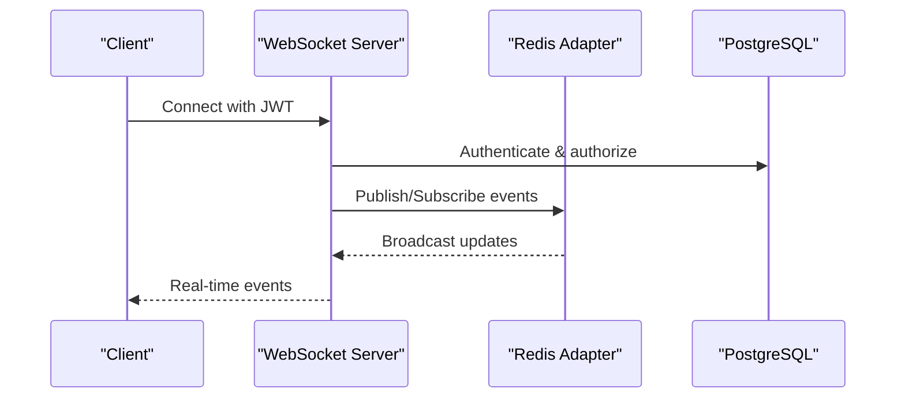

**Diagram sources**
- [websocket-server/package.json:1-44](file://websocket-server/package.json#L1-L44)

**Section sources**
- [websocket-server/package.json:1-44](file://websocket-server/package.json#L1-L44)

### Cloud Infrastructure Choices
- Frontend hosting: Vercel for SPA routing and security headers.
- Backend: Supabase for Auth, DB, Edge Functions, and Storage.
- Mobile: Capacitor for native packaging and runtime plugins.
- Testing: Playwright for E2E and Vitest for unit tests.
- Observability: Sentry for error tracking and PostHog for analytics.

**Section sources**
- [vercel.json:1-38](file://vercel.json#L1-L38)
- [package.json:91-126](file://package.json#L91-L126)
- [AGENTS.md:110-118](file://AGENTS.md#L110-L118)

## Dependency Analysis
The frontend depends on Supabase for authentication and data access, Capacitor for native features, and UI libraries for components. Supabase depends on PostgreSQL and Edge Functions. The WebSocket server depends on Redis and PostgreSQL.

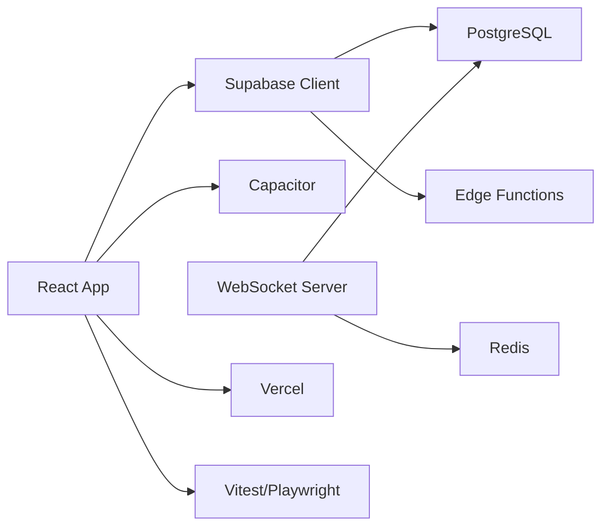

**Diagram sources**
- [src/integrations/supabase/client.ts:1-57](file://src/integrations/supabase/client.ts#L1-L57)
- [supabase/config.toml:1-59](file://supabase/config.toml#L1-L59)
- [websocket-server/package.json:1-44](file://websocket-server/package.json#L1-L44)
- [vercel.json:1-38](file://vercel.json#L1-L38)
- [package.json:128-156](file://package.json#L128-L156)

**Section sources**
- [src/integrations/supabase/client.ts:1-57](file://src/integrations/supabase/client.ts#L1-L57)
- [supabase/config.toml:1-59](file://supabase/config.toml#L1-L59)
- [websocket-server/package.json:1-44](file://websocket-server/package.json#L1-L44)
- [vercel.json:1-38](file://vercel.json#L1-L38)
- [package.json:128-156](file://package.json#L128-L156)

## Performance Considerations
- Build optimizations: Vite targets modern browsers, uses Terser minification, and splits vendor/charts bundles for caching.
- Network: Supabase Edge Functions reduce latency for serverless logic; client-side caching and image optimization improve UX.
- Realtime: Redis adapter in the WebSocket server scales horizontally; JWT-based auth minimizes overhead.
- Mobile: Capacitor aliases and asset bundling reduce bundle size; splash screen and native notifications improve perceived performance.

[No sources needed since this section provides general guidance]

## Troubleshooting Guide
- Supabase CLI and environment variables: Ensure VITE_SUPABASE_URL, VITE_SUPABASE_PUBLISHABLE_KEY, and other keys are set for production.
- Function deployment: Use individual deploy commands for Edge Functions and check status via CLI/dashboard.
- Database migrations: Reset database if conflicts occur (note: this deletes data).
- Testing: Use Playwright UI mode and Vitest watch mode for interactive debugging.

**Section sources**
- [DEPLOYMENT.md:69-137](file://DEPLOYMENT.md#L69-L137)
- [playwright.config.ts:1-92](file://playwright.config.ts#L1-L92)
- [vitest.config.ts:1-28](file://vitest.config.ts#L1-L28)

## Conclusion
Nutrio’s technology stack balances developer productivity with scalability and performance. React 18 with TypeScript and Vite deliver a modern, fast frontend; Supabase provides a robust backend with Edge Functions and real-time capabilities; Capacitor enables efficient cross-platform mobile deployment; Playwright and Vitest ensure quality across the board; and the WebSocket server powers fleet tracking. AI/ML is embedded via Edge Functions and external APIs, with fallbacks for resilience. The cloud infrastructure (Vercel and Supabase) supports rapid iteration and reliable hosting.

[No sources needed since this section summarizes without analyzing specific files]

## Appendices

### Technical Rationale
- React 18 + TypeScript: Predictable typing and concurrent features for responsive UIs.
- Vite: Fast dev server and optimized builds with minimal configuration.
- Tailwind CSS + UI primitives: Rapid UI iteration with consistent design tokens.
- Supabase: Unified backend reduces operational overhead; Edge Functions for serverless logic.
- Capacitor: Single codebase for web and native with native plugins.
- Playwright + Vitest: Comprehensive testing coverage with fast feedback loops.
- WebSocket + Redis: Horizontal scaling for real-time features.
- Sentry + PostHog: Observability and analytics for production insights.

**Section sources**
- [AGENTS.md:110-137](file://AGENTS.md#L110-L137)
- [package.json:44-126](file://package.json#L44-L126)
- [vite.config.ts:1-77](file://vite.config.ts#L1-L77)
- [websocket-server/package.json:1-44](file://websocket-server/package.json#L1-L44)

### Future Roadmap Considerations
- Expand AI/ML layers with advanced recommendation systems and personalization.
- Enhance mobile features with offline-first strategies and background sync.
- Introduce feature flags and A/B testing for product experimentation.
- Strengthen observability with structured metrics and alerting.
- Evaluate CDN and asset optimization for improved global performance.

[No sources needed since this section provides general guidance]