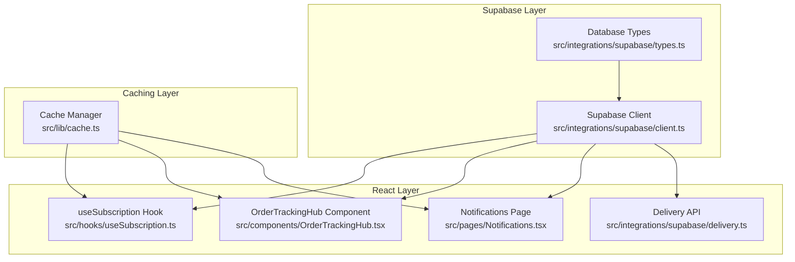
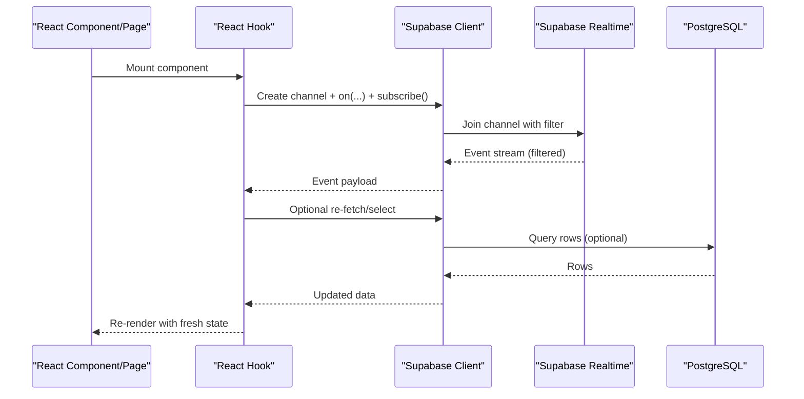
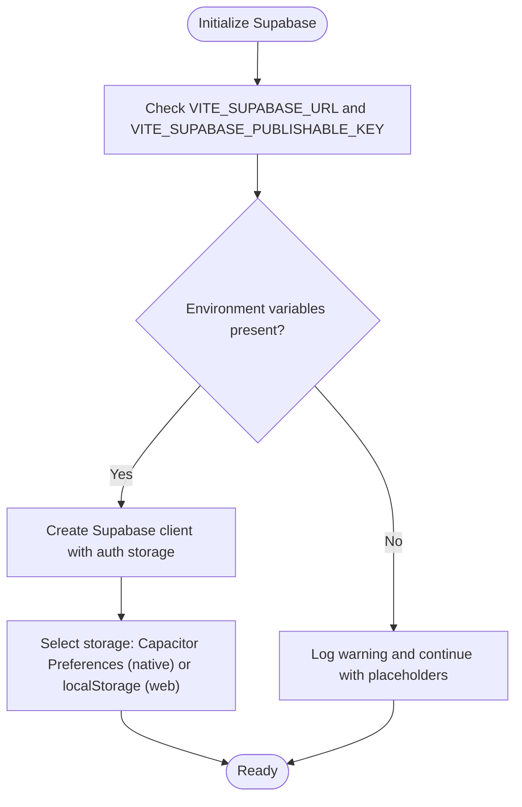
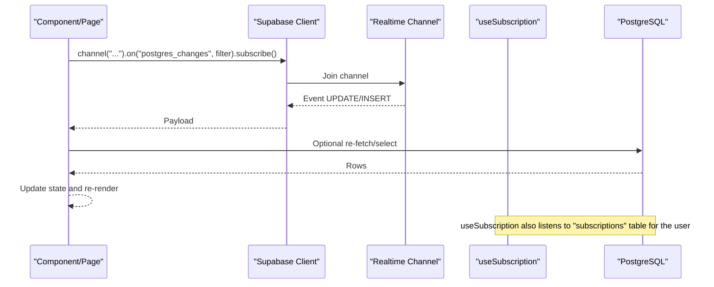
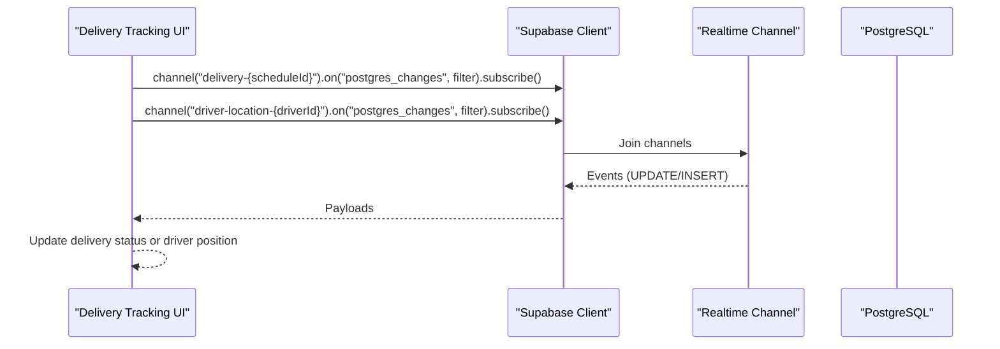
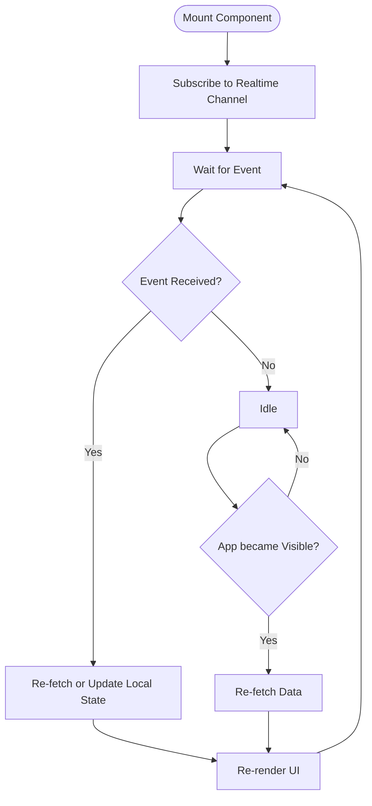
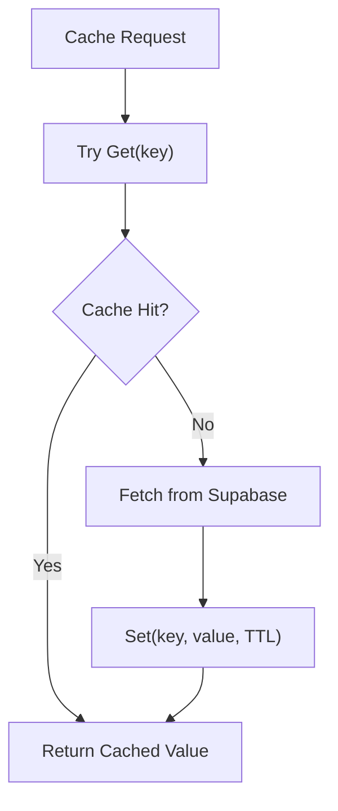
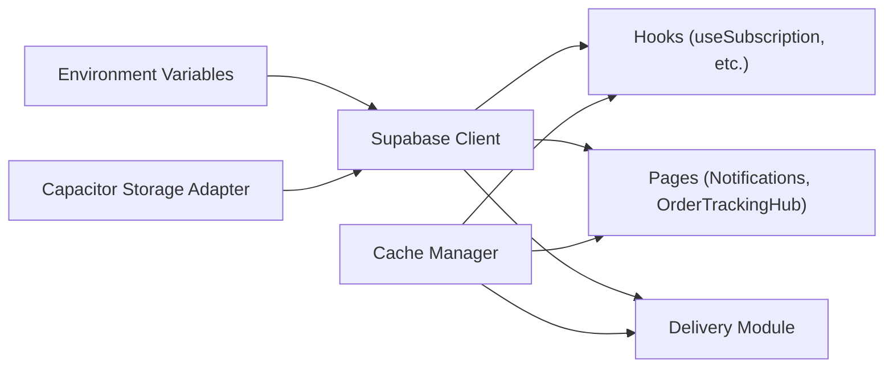

# Data Synchronization

<cite>
**Referenced Files in This Document**
- [client.ts](file://src/integrations/supabase/client.ts)
- [types.ts](file://src/integrations/supabase/types.ts)
- [delivery.ts](file://src/integrations/supabase/delivery.ts)
- [useSubscription.ts](file://src/hooks/useSubscription.ts)
- [Notifications.tsx](file://src/pages/Notifications.tsx)
- [OrderTrackingHub.tsx](file://src/components/OrderTrackingHub.tsx)
- [cache.ts](file://src/lib/cache.ts)
- [realtime.spec.ts](file://e2e/system/realtime.spec.ts)
</cite>

## Table of Contents
1. [Introduction](#introduction)
2. [Project Structure](#project-structure)
3. [Core Components](#core-components)
4. [Architecture Overview](#architecture-overview)
5. [Detailed Component Analysis](#detailed-component-analysis)
6. [Dependency Analysis](#dependency-analysis)
7. [Performance Considerations](#performance-considerations)
8. [Troubleshooting Guide](#troubleshooting-guide)
9. [Conclusion](#conclusion)

## Introduction
This document explains the real-time data synchronization system powering Nutrio’s user interfaces. It covers how Supabase Realtime is integrated to keep the UIs live, how reactive data patterns are implemented, and how local state is managed alongside Supabase subscriptions. It also documents real-time query filtering, caching strategies, conflict resolution approaches, and performance optimizations. Practical examples show how to implement real-time data binding, handle connection drops, and maintain a smooth user experience during synchronization issues.

## Project Structure
The real-time synchronization spans three layers:
- Supabase client and types: centralized client initialization and database type definitions.
- Hooks and pages: reactive data bindings via Supabase Realtime channels.
- Local caching: optional in-memory and Redis-backed caching to reduce load and improve responsiveness.

**Diagram sources**
- [client.ts:1-57](file://src/integrations/supabase/client.ts#L1-L57)
- [types.ts:1-800](file://src/integrations/supabase/types.ts#L1-L800)
- [useSubscription.ts:1-264](file://src/hooks/useSubscription.ts#L1-L264)
- [OrderTrackingHub.tsx:1-235](file://src/components/OrderTrackingHub.tsx#L1-L235)
- [Notifications.tsx:1-254](file://src/pages/Notifications.tsx#L1-L254)
- [delivery.ts:1-735](file://src/integrations/supabase/delivery.ts#L1-L735)
- [cache.ts:47-148](file://src/lib/cache.ts#L47-L148)

**Section sources**
- [client.ts:1-57](file://src/integrations/supabase/client.ts#L1-L57)
- [types.ts:1-800](file://src/integrations/supabase/types.ts#L1-L800)
- [useSubscription.ts:1-264](file://src/hooks/useSubscription.ts#L1-L264)
- [OrderTrackingHub.tsx:1-235](file://src/components/OrderTrackingHub.tsx#L1-L235)
- [Notifications.tsx:1-254](file://src/pages/Notifications.tsx#L1-L254)
- [delivery.ts:1-735](file://src/integrations/supabase/delivery.ts#L1-L735)
- [cache.ts:47-148](file://src/lib/cache.ts#L47-L148)

## Core Components
- Supabase client with Capacitor storage adapter for sessions and persistence.
- Real-time subscriptions for notifications, orders, and subscription status.
- Delivery-specific channels for live delivery updates and driver location tracking.
- Reactive hooks and components that subscribe to Supabase changes and refresh state.
- Optional caching layer to minimize repeated network requests and improve perceived performance.

Key responsibilities:
- Real-time subscriptions: subscribe/unsubscribe channels on mount/unmount.
- Query filtering: use Supabase Realtime filters to scope updates per user or entity.
- Conflict handling: rely on Supabase’s server-side updates and idempotent UI updates.
- Offline resilience: re-fetch on visibility change and provide optimistic UI while reconnecting.

**Section sources**
- [client.ts:18-57](file://src/integrations/supabase/client.ts#L18-L57)
- [useSubscription.ts:100-134](file://src/hooks/useSubscription.ts#L100-L134)
- [Notifications.tsx:89-97](file://src/pages/Notifications.tsx#L89-L97)
- [OrderTrackingHub.tsx:93-114](file://src/components/OrderTrackingHub.tsx#L93-L114)
- [delivery.ts:694-734](file://src/integrations/supabase/delivery.ts#L694-L734)
- [cache.ts:47-107](file://src/lib/cache.ts#L47-L107)

## Architecture Overview
The system uses Supabase Realtime to push database changes to clients. Components subscribe to channels scoped by user ID or entity ID. On each event, components re-fetch or update state. Optional caching reduces redundant queries.

**Diagram sources**
- [useSubscription.ts:104-118](file://src/hooks/useSubscription.ts#L104-L118)
- [Notifications.tsx:89-94](file://src/pages/Notifications.tsx#L89-L94)
- [OrderTrackingHub.tsx:97-109](file://src/components/OrderTrackingHub.tsx#L97-L109)

## Detailed Component Analysis

### Supabase Client and Storage Adapter
- Initializes the Supabase client with environment variables.
- Provides a Capacitor-native storage adapter for sessions and persistence.
- Ensures graceful handling when environment variables are missing.

**Diagram sources**
- [client.ts:7-16](file://src/integrations/supabase/client.ts#L7-L16)
- [client.ts:44-45](file://src/integrations/supabase/client.ts#L44-L45)
- [client.ts:47-57](file://src/integrations/supabase/client.ts#L47-L57)

**Section sources**
- [client.ts:1-57](file://src/integrations/supabase/client.ts#L1-L57)

### Real-time Subscriptions in Hooks and Pages
- useSubscription: subscribes to changes in the subscriptions table for the current user and re-fetches on updates.
- Notifications page: subscribes to new notifications for the logged-in user and prepends them to the list.
- OrderTrackingHub: subscribes to updates in meal_schedules for the current user and refreshes active orders.

**Diagram sources**
- [useSubscription.ts:104-118](file://src/hooks/useSubscription.ts#L104-L118)
- [Notifications.tsx:89-94](file://src/pages/Notifications.tsx#L89-L94)
- [OrderTrackingHub.tsx:97-109](file://src/components/OrderTrackingHub.tsx#L97-L109)

**Section sources**
- [useSubscription.ts:100-134](file://src/hooks/useSubscription.ts#L100-L134)
- [Notifications.tsx:67-97](file://src/pages/Notifications.tsx#L67-L97)
- [OrderTrackingHub.tsx:89-114](file://src/components/OrderTrackingHub.tsx#L89-L114)

### Delivery Real-time Channels
- Delivery updates: subscribe to updates on the delivery_jobs table filtered by schedule_id.
- Driver location: subscribe to inserts on driver_locations filtered by driver_id.

**Diagram sources**
- [delivery.ts:694-734](file://src/integrations/supabase/delivery.ts#L694-L734)

**Section sources**
- [delivery.ts:694-734](file://src/integrations/supabase/delivery.ts#L694-L734)

### Reactive Data Patterns and Local State Management
- Components and hooks manage local state and re-fetch from Supabase on real-time events.
- Idempotent UI updates: incoming events trigger re-fetch or prepend to lists without duplicating entries.
- Visibility-based refetch: components re-fetch when the app becomes visible to reconcile state after background periods.

**Diagram sources**
- [useSubscription.ts:125-134](file://src/hooks/useSubscription.ts#L125-L134)
- [Notifications.tsx:89-97](file://src/pages/Notifications.tsx#L89-L97)
- [OrderTrackingHub.tsx:93-114](file://src/components/OrderTrackingHub.tsx#L93-L114)

**Section sources**
- [useSubscription.ts:125-134](file://src/hooks/useSubscription.ts#L125-L134)
- [Notifications.tsx:67-97](file://src/pages/Notifications.tsx#L67-L97)
- [OrderTrackingHub.tsx:89-114](file://src/components/OrderTrackingHub.tsx#L89-L114)

### Conflict Resolution Strategies
- Supabase Realtime delivers server-side changes; components re-fetch or update state accordingly.
- Idempotent updates: notifications prepend new items; order list updates preserve existing items.
- Optimistic UI: immediate state changes are followed by reconciliation on next fetch or event.
- Filters: precise postgres_changes filters minimize unnecessary updates and reduce conflicts.

**Section sources**
- [Notifications.tsx:89-94](file://src/pages/Notifications.tsx#L89-L94)
- [OrderTrackingHub.tsx:97-109](file://src/components/OrderTrackingHub.tsx#L97-L109)
- [delivery.ts:702-711](file://src/integrations/supabase/delivery.ts#L702-L711)

### Offline Synchronization and Connection Resilience
- Re-fetch on visibility: components listen for visibility changes and re-sync data.
- Graceful degradation: when environment variables are missing, the client logs warnings and continues with placeholders.
- Subscription lifecycle: components clean up channels on unmount to avoid leaks.

**Section sources**
- [client.ts:11-16](file://src/integrations/supabase/client.ts#L11-L16)
- [useSubscription.ts:120-123](file://src/hooks/useSubscription.ts#L120-L123)
- [Notifications.tsx:96](file://src/pages/Notifications.tsx#L96)
- [OrderTrackingHub.tsx:111-113](file://src/components/OrderTrackingHub.tsx#L111-L113)

### Real-time Query Filtering
- Filters are applied in the postgres_changes event definition to restrict updates to the relevant user or entity.
- Examples include filtering by user_id or schedule_id.

**Section sources**
- [useSubscription.ts:108-113](file://src/hooks/useSubscription.ts#L108-L113)
- [Notifications.tsx:91](file://src/pages/Notifications.tsx#L91)
- [OrderTrackingHub.tsx:102-105](file://src/components/OrderTrackingHub.tsx#L102-L105)
- [delivery.ts:707](file://src/integrations/supabase/delivery.ts#L707)
- [delivery.ts:729](file://src/integrations/supabase/delivery.ts#L729)

### Caching Strategies
- Cache manager supports Redis-backed cache with TTL and memory fallback.
- Pattern-based invalidation allows targeted cache clearing.
- Cached fetchers wrap Supabase queries with cache reads and writes.

**Diagram sources**
- [cache.ts:47-107](file://src/lib/cache.ts#L47-L107)

**Section sources**
- [cache.ts:47-148](file://src/lib/cache.ts#L47-L148)

## Dependency Analysis
- Supabase client depends on environment variables and storage adapter.
- Hooks and pages depend on the Supabase client for subscriptions and queries.
- Delivery module encapsulates delivery-related Supabase operations and exposes subscription helpers.
- Cache module is independent but integrates with data-fetching flows.

**Diagram sources**
- [client.ts:7-16](file://src/integrations/supabase/client.ts#L7-L16)
- [client.ts:44-45](file://src/integrations/supabase/client.ts#L44-L45)
- [useSubscription.ts:1-4](file://src/hooks/useSubscription.ts#L1-L4)
- [Notifications.tsx:16](file://src/pages/Notifications.tsx#L16)
- [OrderTrackingHub.tsx:3](file://src/components/OrderTrackingHub.tsx#L3)
- [delivery.ts:4](file://src/integrations/supabase/delivery.ts#L4)
- [cache.ts:109](file://src/lib/cache.ts#L109)

**Section sources**
- [client.ts:1-57](file://src/integrations/supabase/client.ts#L1-L57)
- [useSubscription.ts:1-4](file://src/hooks/useSubscription.ts#L1-L4)
- [Notifications.tsx:16](file://src/pages/Notifications.tsx#L16)
- [OrderTrackingHub.tsx:3](file://src/components/OrderTrackingHub.tsx#L3)
- [delivery.ts:4](file://src/integrations/supabase/delivery.ts#L4)
- [cache.ts:47-107](file://src/lib/cache.ts#L47-L107)

## Performance Considerations
- Use precise filters in postgres_changes to minimize event volume.
- Prefer targeted re-fetches (e.g., re-fetch only affected rows) rather than full reloads.
- Combine caching with TTL to reduce network load and improve perceived performance.
- Unsubscribe on unmount to prevent memory leaks and unnecessary processing.
- Re-fetch on visibility change to reconcile state after extended background periods.

[No sources needed since this section provides general guidance]

## Troubleshooting Guide
- Missing environment variables: the client logs a warning and continues with placeholders. Ensure VITE_SUPABASE_URL and VITE_SUPABASE_PUBLISHABLE_KEY are set in the build environment.
- Connection drops: components re-fetch on visibility change; ensure subscriptions are cleaned up on unmount.
- Excessive updates: verify filters are correctly applied in postgres_changes definitions.
- Channel lifecycle: always remove channels in cleanup to avoid leaks.

**Section sources**
- [client.ts:11-16](file://src/integrations/supabase/client.ts#L11-L16)
- [useSubscription.ts:120-123](file://src/hooks/useSubscription.ts#L120-L123)
- [Notifications.tsx:96](file://src/pages/Notifications.tsx#L96)
- [OrderTrackingHub.tsx:111-113](file://src/components/OrderTrackingHub.tsx#L111-L113)

## Conclusion
Nutrio’s real-time synchronization leverages Supabase Realtime to keep user interfaces current with minimal latency. The system combines precise filtering, reactive hooks and components, and optional caching to deliver responsive experiences. By subscribing to scoped channels, re-fetching on visibility, and cleaning up subscriptions, the platform maintains consistency and resilience across devices and network conditions.