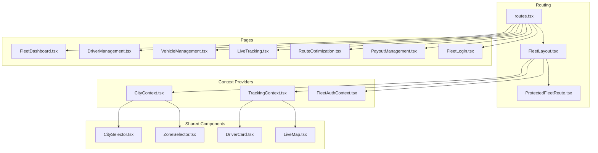
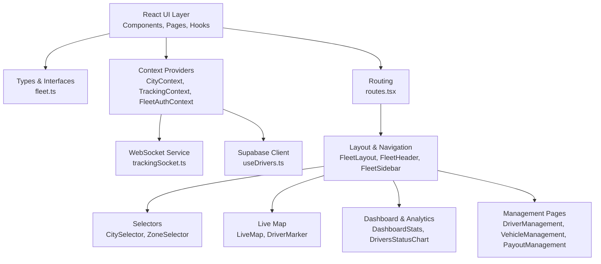
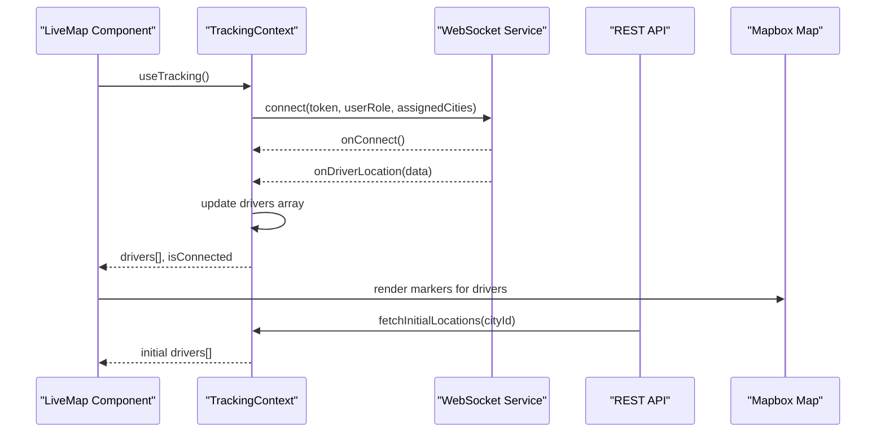
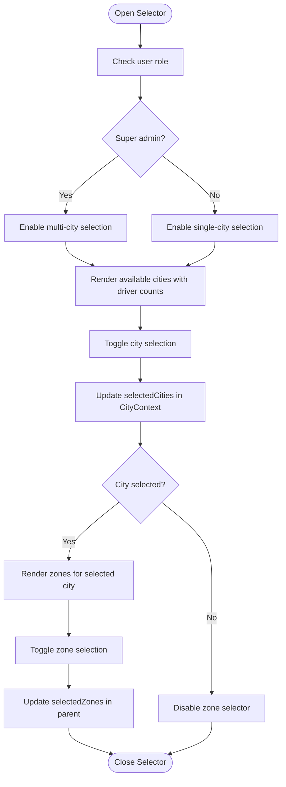
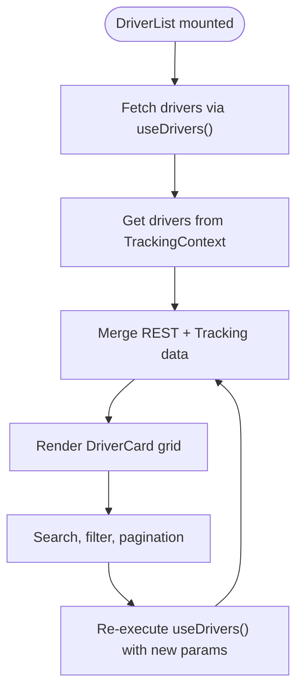
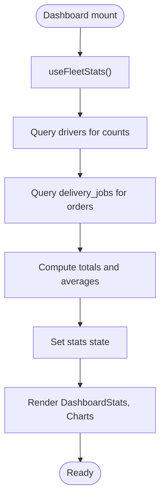
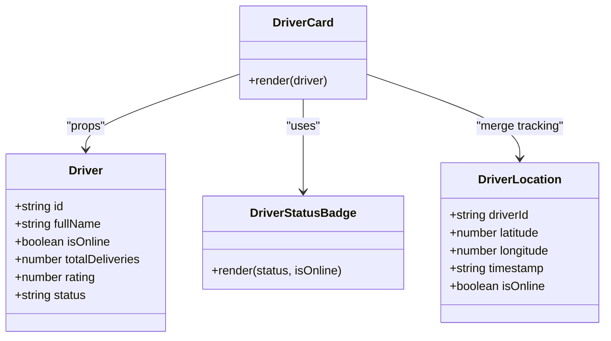
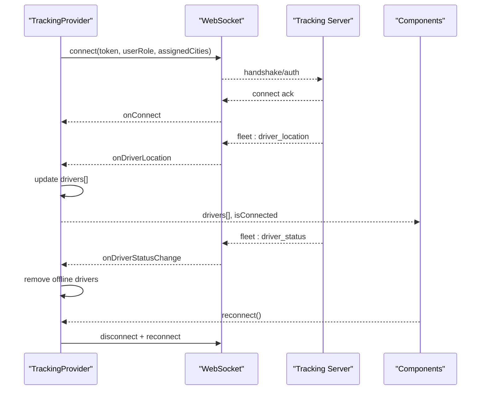
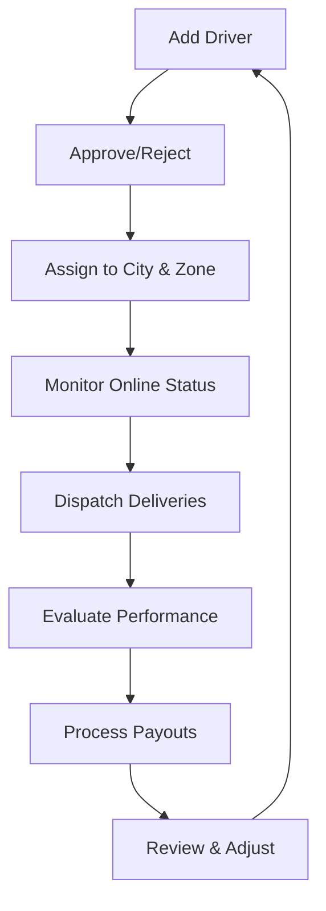
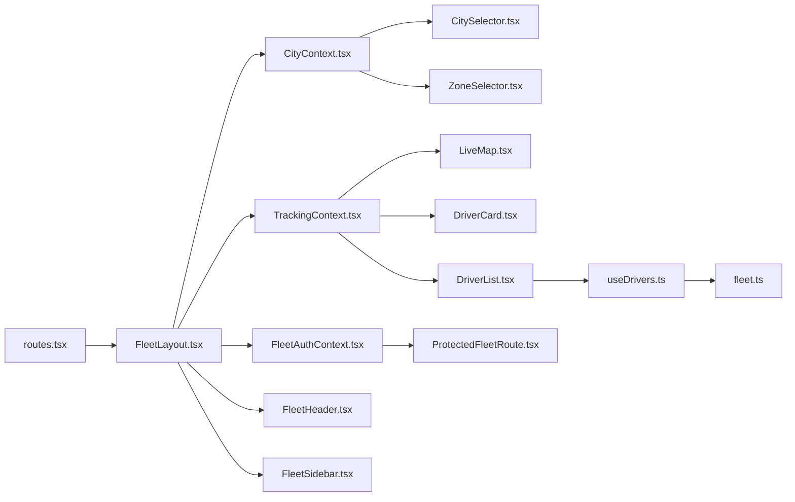

# Fleet Tracking System

<cite>
**Referenced Files in This Document**
- [index.ts](file://src/fleet/index.ts)
- [routes.tsx](file://src/fleet/routes.tsx)
- [FleetLayout.tsx](file://src/fleet/components/layout/FleetLayout.tsx)
- [FleetHeader.tsx](file://src/fleet/components/layout/FleetHeader.tsx)
- [FleetSidebar.tsx](file://src/fleet/components/layout/FleetSidebar.tsx)
- [CitySelector.tsx](file://src/fleet/components/common/CitySelector.tsx)
- [ZoneSelector.tsx](file://src/fleet/components/common/ZoneSelector.tsx)
- [CityContext.tsx](file://src/fleet/context/CityContext.tsx)
- [TrackingContext.tsx](file://src/fleet/context/TrackingContext.tsx)
- [useDrivers.ts](file://src/fleet/hooks/useDrivers.ts)
- [useFleetAuth.ts](file://src/fleet/hooks/useFleetAuth.ts)
- [fleet.ts](file://src/fleet/types/fleet.ts)
- [fleet-management-portal-design.md](file://docs/fleet-management-portal-design.md)
- [setup-fleet-demo.sh](file://scripts/setup-fleet-demo.sh)
- [LiveMap.tsx](file://src/fleet/components/map/LiveMap.tsx)
- [DriverMarker.tsx](file://src/fleet/components/map/DriverMarker.tsx)
- [DriverCard.tsx](file://src/fleet/components/drivers/DriverCard.tsx)
- [DriverList.tsx](file://src/fleet/components/drivers/DriverList.tsx)
- [DriverStatusBadge.tsx](file://src/fleet/components/drivers/DriverStatusBadge.tsx)
- [DashboardStats.tsx](file://src/fleet/components/dashboard/DashboardStats.tsx)
- [DriversStatusChart.tsx](file://src/fleet/components/dashboard/DriversStatusChart.tsx)
- [ProtectedFleetRoute.tsx](file://src/fleet/components/ProtectedFleetRoute.tsx)
- [FleetAuthContext.tsx](file://src/fleet/context/FleetAuthContext.tsx)
- [trackingSocket.ts](file://src/fleet/services/trackingSocket.ts)
- [LiveTracking.tsx](file://src/fleet/pages/LiveTracking.tsx)
- [DriverManagement.tsx](file://src/fleet/pages/DriverManagement.tsx)
- [VehicleManagement.tsx](file://src/fleet/pages/VehicleManagement.tsx)
- [PayoutManagement.tsx](file://src/fleet/pages/PayoutManagement.tsx)
- [RouteOptimization.tsx](file://src/fleet/pages/RouteOptimization.tsx)
- [FleetDashboard.tsx](file://src/fleet/pages/FleetDashboard.tsx)
- [FleetLogin.tsx](file://src/fleet/pages/FleetLogin.tsx)
- [DriverDetail.tsx](file://src/fleet/pages/DriverDetail.tsx)
- [AddDriver.tsx](file://src/fleet/pages/AddDriver.tsx)
</cite>

## Table of Contents
1. [Introduction](#introduction)
2. [Project Structure](#project-structure)
3. [Core Components](#core-components)
4. [Architecture Overview](#architecture-overview)
5. [Detailed Component Analysis](#detailed-component-analysis)
6. [Dependency Analysis](#dependency-analysis)
7. [Performance Considerations](#performance-considerations)
8. [Troubleshooting Guide](#troubleshooting-guide)
9. [Conclusion](#conclusion)
10. [Appendices](#appendices)

## Introduction
This document describes the Fleet Tracking System designed for corporate delivery management and driver supervision. It covers the fleet manager interface for monitoring multiple drivers across cities and zones, the driver assignment and dispatch system with real-time location tracking and performance metrics, the analytics dashboard, city and zone filtering, driver status indicators and performance badges, real-time communication features, and practical fleet management workflows. It also addresses scalability considerations and integration points with corporate HR systems.

## Project Structure
The fleet management portal is implemented as a modular React application with dedicated routing, context providers, shared components, and typed interfaces. Key areas include:
- Routing and layout: fleet routes, protected routes, and layout components
- Context providers: city selection, real-time tracking, and authentication
- Shared components: city selector, zone selector, driver cards, live map
- Pages: dashboard, driver management, vehicle management, live tracking, route optimization, payout management
- Services: WebSocket tracking service
- Types: comprehensive fleet domain types

**Diagram sources**
- [routes.tsx:20-41](file://src/fleet/routes.tsx#L20-L41)
- [FleetLayout.tsx:30-58](file://src/fleet/components/layout/FleetLayout.tsx#L30-L58)
- [CityContext.tsx:13-38](file://src/fleet/context/CityContext.tsx#L13-L38)
- [TrackingContext.tsx:24-128](file://src/fleet/context/TrackingContext.tsx#L24-L128)
- [CitySelector.tsx:14-115](file://src/fleet/components/common/CitySelector.tsx#L14-L115)
- [ZoneSelector.tsx:20-115](file://src/fleet/components/common/ZoneSelector.tsx#L20-L115)
- [LiveMap.tsx:1945-2043](file://src/fleet/components/map/LiveMap.tsx#L1945-L2043)
- [DriverCard.tsx](file://src/fleet/components/drivers/DriverCard.tsx)
- [FleetDashboard.tsx](file://src/fleet/pages/FleetDashboard.tsx)
- [DriverManagement.tsx](file://src/fleet/pages/DriverManagement.tsx)
- [VehicleManagement.tsx](file://src/fleet/pages/VehicleManagement.tsx)
- [LiveTracking.tsx](file://src/fleet/pages/LiveTracking.tsx)
- [RouteOptimization.tsx](file://src/fleet/pages/RouteOptimization.tsx)
- [PayoutManagement.tsx](file://src/fleet/pages/PayoutManagement.tsx)
- [FleetLogin.tsx](file://src/fleet/pages/FleetLogin.tsx)

**Section sources**
- [routes.tsx:1-42](file://src/fleet/routes.tsx#L1-L42)
- [FleetLayout.tsx:16-60](file://src/fleet/components/layout/FleetLayout.tsx#L16-L60)

## Core Components
- Fleet routing and layout: centralized routes with lazy-loaded pages, protected routes, and a responsive layout with header, sidebar, and mobile navigation.
- City and zone filtering: popover-based selectors enabling single or multi-city selection and zone filtering per city.
- Real-time tracking: WebSocket-driven driver location updates with provider state, automatic cleanup of stale entries, and live map rendering.
- Driver management: driver listing with search and status filters, driver detail view, and add driver page.
- Analytics dashboard: statistics aggregation and visualizations for driver productivity and operational metrics.
- Payout management: driver payout listing and processing workflows.
- Authentication: fleet-specific authentication context and hooks for protected access.

**Section sources**
- [routes.tsx:20-41](file://src/fleet/routes.tsx#L20-L41)
- [FleetLayout.tsx:30-58](file://src/fleet/components/layout/FleetLayout.tsx#L30-L58)
- [CitySelector.tsx:14-115](file://src/fleet/components/common/CitySelector.tsx#L14-L115)
- [ZoneSelector.tsx:20-115](file://src/fleet/components/common/ZoneSelector.tsx#L20-L115)
- [TrackingContext.tsx:24-128](file://src/fleet/context/TrackingContext.tsx#L24-L128)
- [useDrivers.ts:16-104](file://src/fleet/hooks/useDrivers.ts#L16-L104)
- [DashboardStats.tsx](file://src/fleet/components/dashboard/DashboardStats.tsx)
- [DriversStatusChart.tsx](file://src/fleet/components/dashboard/DriversStatusChart.tsx)
- [PayoutManagement.tsx](file://src/fleet/pages/PayoutManagement.tsx)
- [useFleetAuth.ts:1-9](file://src/fleet/hooks/useFleetAuth.ts#L1-L9)

## Architecture Overview
The system follows a layered architecture:
- Presentation layer: React components and pages organized by feature
- Domain layer: fleet types and business entities
- Data access layer: Supabase queries for drivers, payouts, and related entities
- Real-time layer: WebSocket connections for live driver tracking
- Context layer: global state providers for city, tracking, and auth

**Diagram sources**
- [fleet.ts:65-316](file://src/fleet/types/fleet.ts#L65-L316)
- [CityContext.tsx:13-38](file://src/fleet/context/CityContext.tsx#L13-L38)
- [TrackingContext.tsx:24-128](file://src/fleet/context/TrackingContext.tsx#L24-L128)
- [useDrivers.ts:24-92](file://src/fleet/hooks/useDrivers.ts#L24-L92)
- [trackingSocket.ts](file://src/fleet/services/trackingSocket.ts)
- [routes.tsx:20-41](file://src/fleet/routes.tsx#L20-L41)
- [FleetLayout.tsx:30-58](file://src/fleet/components/layout/FleetLayout.tsx#L30-L58)
- [FleetHeader.tsx:29-142](file://src/fleet/components/layout/FleetHeader.tsx#L29-L142)
- [FleetSidebar.tsx:38-114](file://src/fleet/components/layout/FleetSidebar.tsx#L38-L114)
- [CitySelector.tsx:14-115](file://src/fleet/components/common/CitySelector.tsx#L14-L115)
- [ZoneSelector.tsx:20-115](file://src/fleet/components/common/ZoneSelector.tsx#L20-L115)
- [LiveMap.tsx:1945-2043](file://src/fleet/components/map/LiveMap.tsx#L1945-L2043)
- [DriverMarker.tsx](file://src/fleet/components/map/DriverMarker.tsx)
- [DashboardStats.tsx](file://src/fleet/components/dashboard/DashboardStats.tsx)
- [DriversStatusChart.tsx](file://src/fleet/components/dashboard/DriversStatusChart.tsx)
- [DriverManagement.tsx](file://src/fleet/pages/DriverManagement.tsx)
- [VehicleManagement.tsx](file://src/fleet/pages/VehicleManagement.tsx)
- [PayoutManagement.tsx](file://src/fleet/pages/PayoutManagement.tsx)

## Detailed Component Analysis

### Real-Time Tracking and Live Map
The tracking system streams driver locations via WebSocket and renders them on a Mapbox map. It merges REST-provided driver metadata with live tracking updates, maintains connection status, and cleans up stale entries.

**Diagram sources**
- [LiveMap.tsx:1945-2043](file://src/fleet/components/map/LiveMap.tsx#L1945-L2043)
- [TrackingContext.tsx:62-83](file://src/fleet/context/TrackingContext.tsx#L62-L83)
- [trackingSocket.ts](file://src/fleet/services/trackingSocket.ts)
- [useDrivers.ts:24-92](file://src/fleet/hooks/useDrivers.ts#L24-L92)

**Section sources**
- [LiveMap.tsx:1945-2043](file://src/fleet/components/map/LiveMap.tsx#L1945-L2043)
- [TrackingContext.tsx:24-128](file://src/fleet/context/TrackingContext.tsx#L24-L128)

### City and Zone Filtering
CitySelector enables single or multi-city selection depending on user role, while ZoneSelector filters by geographic zones within a selected city. Both use popover UIs and maintain selection state in context.

**Diagram sources**
- [CitySelector.tsx:14-115](file://src/fleet/components/common/CitySelector.tsx#L14-L115)
- [ZoneSelector.tsx:20-115](file://src/fleet/components/common/ZoneSelector.tsx#L20-L115)
- [CityContext.tsx:13-38](file://src/fleet/context/CityContext.tsx#L13-L38)

**Section sources**
- [CitySelector.tsx:14-115](file://src/fleet/components/common/CitySelector.tsx#L14-L115)
- [ZoneSelector.tsx:20-115](file://src/fleet/components/common/ZoneSelector.tsx#L20-L115)
- [CityContext.tsx:13-38](file://src/fleet/context/CityContext.tsx#L13-L38)

### Driver Assignment and Dispatch System
Driver listing integrates REST data with real-time tracking to show accurate online/offline status and recent location updates. Filters support search, status, and pagination.

**Diagram sources**
- [DriverList.tsx:2271-2320](file://src/fleet/components/drivers/DriverList.tsx#L2271-L2320)
- [useDrivers.ts:24-92](file://src/fleet/hooks/useDrivers.ts#L24-L92)
- [TrackingContext.tsx:24-128](file://src/fleet/context/TrackingContext.tsx#L24-L128)

**Section sources**
- [DriverList.tsx:2271-2320](file://src/fleet/components/drivers/DriverList.tsx#L2271-L2320)
- [useDrivers.ts:16-104](file://src/fleet/hooks/useDrivers.ts#L16-L104)

### Fleet Analytics Dashboard
The dashboard aggregates fleet statistics (total drivers, active, online, orders in progress, today's deliveries) and presents them with visual components. Statistics are computed from Supabase queries.

**Diagram sources**
- [useDrivers.ts:106-178](file://src/fleet/hooks/useDrivers.ts#L106-L178)
- [DashboardStats.tsx](file://src/fleet/components/dashboard/DashboardStats.tsx)
- [DriversStatusChart.tsx](file://src/fleet/components/dashboard/DriversStatusChart.tsx)

**Section sources**
- [useDrivers.ts:106-178](file://src/fleet/hooks/useDrivers.ts#L106-L178)

### Driver Status Indicators and Performance Badges
Driver cards and status badges reflect real-time status and derived performance metrics. The system merges REST-provided driver attributes with live tracking updates to present accurate status.

**Diagram sources**
- [fleet.ts:95-133](file://src/fleet/types/fleet.ts#L95-L133)
- [fleet.ts:135-148](file://src/fleet/types/fleet.ts#L135-L148)
- [DriverCard.tsx](file://src/fleet/components/drivers/DriverCard.tsx)
- [DriverStatusBadge.tsx](file://src/fleet/components/drivers/DriverStatusBadge.tsx)
- [DriverList.tsx:2283-2293](file://src/fleet/components/drivers/DriverList.tsx#L2283-L2293)

**Section sources**
- [DriverCard.tsx](file://src/fleet/components/drivers/DriverCard.tsx)
- [DriverStatusBadge.tsx](file://src/fleet/components/drivers/DriverStatusBadge.tsx)
- [DriverList.tsx:2283-2293](file://src/fleet/components/drivers/DriverList.tsx#L2283-L2293)

### Real-Time Communication Features
The system uses WebSocket events for live driver location updates and status changes. The tracking provider manages connection lifecycle, error handling, and periodic cleanup of stale driver entries.

**Diagram sources**
- [TrackingContext.tsx:62-83](file://src/fleet/context/TrackingContext.tsx#L62-L83)
- [TrackingContext.tsx:85-95](file://src/fleet/context/TrackingContext.tsx#L85-L95)
- [trackingSocket.ts](file://src/fleet/services/trackingSocket.ts)

**Section sources**
- [TrackingContext.tsx:24-128](file://src/fleet/context/TrackingContext.tsx#L24-L128)

### Fleet Management Workflows
- Driver onboarding: add new driver via form, assign city and zones, approve/reject status managed through driver detail page.
- Shift management: monitor driver availability via online status and live map; assign deliveries based on proximity and capacity.
- Performance evaluation: review driver metrics (deliveries, ratings, cancellation rate) and integrate with payout calculations.

[No sources needed since this diagram shows conceptual workflow, not actual code structure]

**Section sources**
- [AddDriver.tsx](file://src/fleet/pages/AddDriver.tsx)
- [DriverDetail.tsx](file://src/fleet/pages/DriverDetail.tsx)
- [DriverManagement.tsx](file://src/fleet/pages/DriverManagement.tsx)
- [PayoutManagement.tsx](file://src/fleet/pages/PayoutManagement.tsx)

## Dependency Analysis
The fleet module exhibits clear separation of concerns:
- Routing depends on layout and protected route components
- Layout composes context providers and navigation components
- City and tracking contexts are independent but consumed by multiple components
- Driver hooks encapsulate data fetching and transformations
- Types define contracts across components and services

**Diagram sources**
- [routes.tsx:20-41](file://src/fleet/routes.tsx#L20-L41)
- [FleetLayout.tsx:30-58](file://src/fleet/components/layout/FleetLayout.tsx#L30-L58)
- [CityContext.tsx:13-38](file://src/fleet/context/CityContext.tsx#L13-L38)
- [TrackingContext.tsx:24-128](file://src/fleet/context/TrackingContext.tsx#L24-L128)
- [FleetAuthContext.tsx](file://src/fleet/context/FleetAuthContext.tsx)
- [CitySelector.tsx:14-115](file://src/fleet/components/common/CitySelector.tsx#L14-L115)
- [ZoneSelector.tsx:20-115](file://src/fleet/components/common/ZoneSelector.tsx#L20-L115)
- [LiveMap.tsx:1945-2043](file://src/fleet/components/map/LiveMap.tsx#L1945-L2043)
- [DriverCard.tsx](file://src/fleet/components/drivers/DriverCard.tsx)
- [DriverList.tsx:2271-2320](file://src/fleet/components/drivers/DriverList.tsx#L2271-L2320)
- [useDrivers.ts:24-92](file://src/fleet/hooks/useDrivers.ts#L24-L92)
- [fleet.ts:65-316](file://src/fleet/types/fleet.ts#L65-L316)
- [ProtectedFleetRoute.tsx](file://src/fleet/components/ProtectedFleetRoute.tsx)
- [FleetHeader.tsx:29-142](file://src/fleet/components/layout/FleetHeader.tsx#L29-L142)
- [FleetSidebar.tsx:38-114](file://src/fleet/components/layout/FleetSidebar.tsx#L38-L114)

**Section sources**
- [routes.tsx:20-41](file://src/fleet/routes.tsx#L20-L41)
- [FleetLayout.tsx:30-58](file://src/fleet/components/layout/FleetLayout.tsx#L30-L58)
- [useDrivers.ts:24-92](file://src/fleet/hooks/useDrivers.ts#L24-L92)

## Performance Considerations
- Real-time updates: throttle or batch driver location updates to reduce re-renders; consider virtualized lists for large driver sets.
- Connection resilience: implement exponential backoff and retry strategies for WebSocket reconnection; surface connection status prominently.
- Data caching: cache city and zone metadata; invalidate selectively on changes.
- Pagination: ensure driver listings use pagination to limit payload sizes.
- Cleanup: the tracking provider already removes stale drivers after a timeout; monitor memory usage under high concurrency.
- Map rendering: reuse DOM elements for markers and avoid frequent map recreations.

[No sources needed since this section provides general guidance]

## Troubleshooting Guide
- WebSocket disconnections: use the reconnect mechanism exposed by the tracking provider; verify token validity and server availability.
- Missing driver locations: confirm city subscriptions and that drivers are marked online; check REST initial load endpoint.
- City/zone filters not updating: ensure context providers wrap the affected components; verify user role allows multi-select.
- Authentication issues: confirm FleetAuthProvider wraps protected routes and that tokens are present in local storage/session.

**Section sources**
- [TrackingContext.tsx:97-110](file://src/fleet/context/TrackingContext.tsx#L97-L110)
- [FleetHeader.tsx:76-89](file://src/fleet/components/layout/FleetHeader.tsx#L76-L89)
- [ProtectedFleetRoute.tsx](file://src/fleet/components/ProtectedFleetRoute.tsx)
- [FleetAuthContext.tsx](file://src/fleet/context/FleetAuthContext.tsx)

## Conclusion
The Fleet Tracking System provides a scalable, real-time solution for managing corporate delivery fleets. Its modular architecture, robust context providers, and comprehensive types enable efficient driver supervision, precise analytics, and seamless integration with external systems. By following the recommended performance and troubleshooting practices, the platform can support large-scale operations with hundreds of concurrent drivers.

## Appendices

### Scalability Considerations
- Horizontal scaling: deploy multiple WebSocket servers behind a load balancer; use Redis for pub/sub fan-out to subscribed clients.
- Database optimization: add indexes on frequently filtered columns (cityId, status, approval_status); partition delivery_jobs by date.
- CDN and assets: host Mapbox assets via CDN; pre-warm tiles for target regions.
- Circuit breakers: implement circuit breaker patterns around critical endpoints (tracking, driver fetch, payout processing).
- Observability: instrument WebSocket connection metrics, error rates, and latency; add structured logs for audit trails.

[No sources needed since this section provides general guidance]

### Integration with Corporate HR Systems
- Employee onboarding: synchronize fleet manager roles and assigned cities with HR records during fleet user creation.
- Payroll alignment: expose driver payout summaries and settlement data to HR/payroll systems via secure APIs or scheduled exports.
- Compliance reporting: maintain audit logs of driver status changes and manager actions for HR compliance workflows.

[No sources needed since this section provides general guidance]

### Setup and Demo
- Install Mapbox dependencies for live tracking.
- Configure environment variables for WebSocket URL and Mapbox access token.
- Seed city data and driver records for demonstration.

**Section sources**
- [setup-fleet-demo.sh](file://scripts/setup-fleet-demo.sh)
- [LiveMap.tsx:1958-1965](file://src/fleet/components/map/LiveMap.tsx#L1958-L1965)