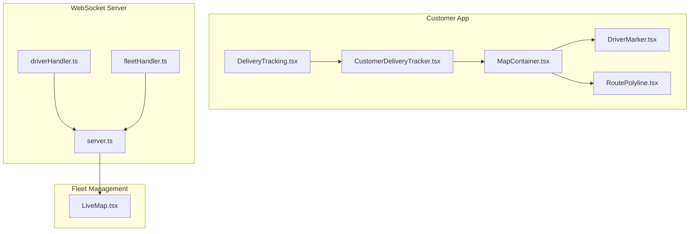
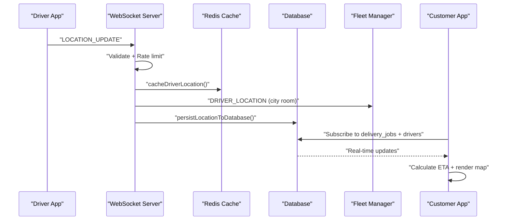
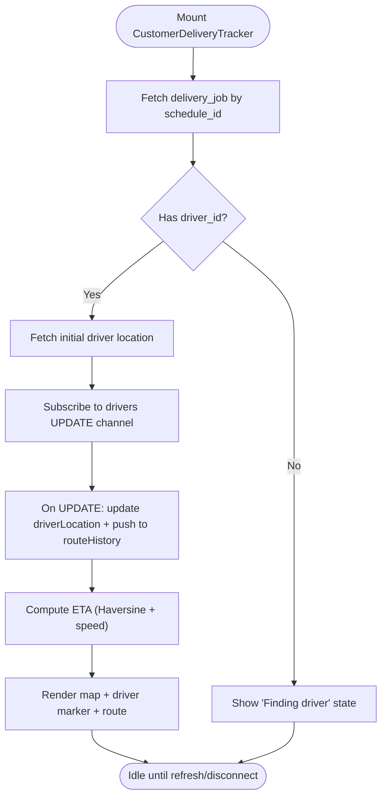
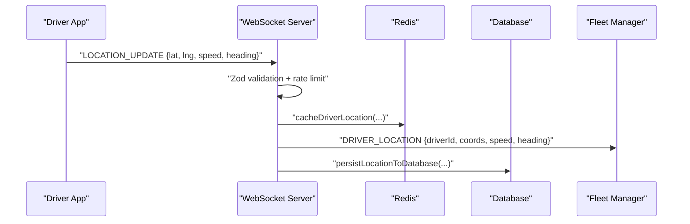
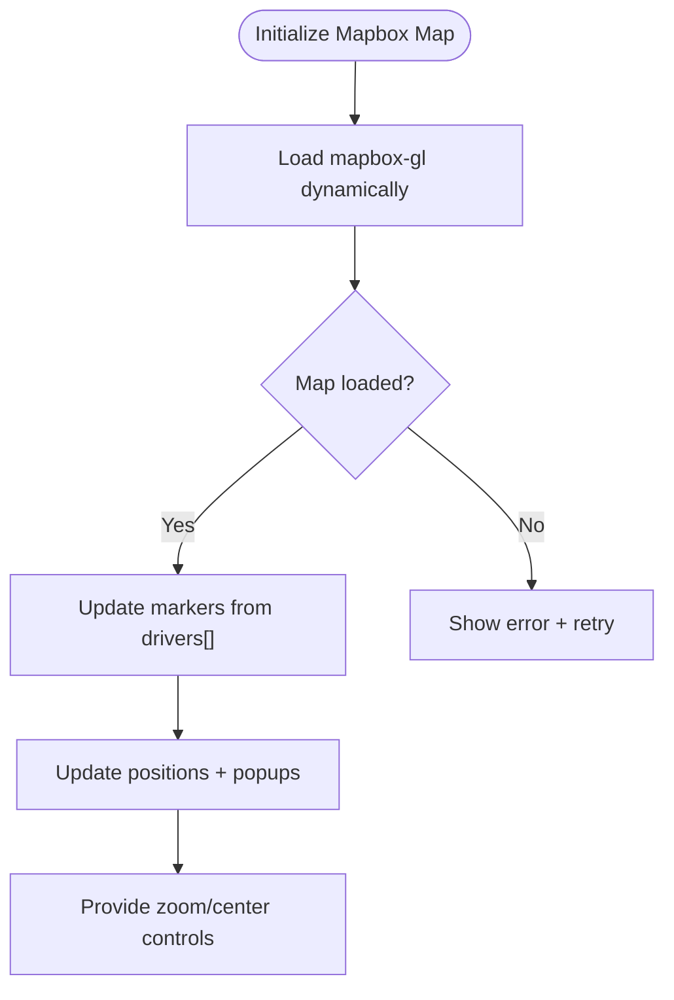
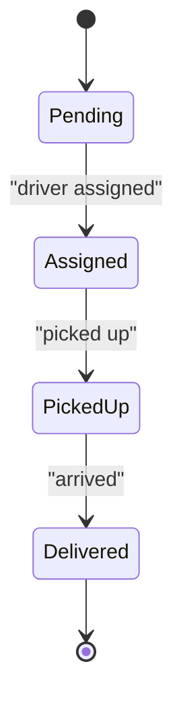
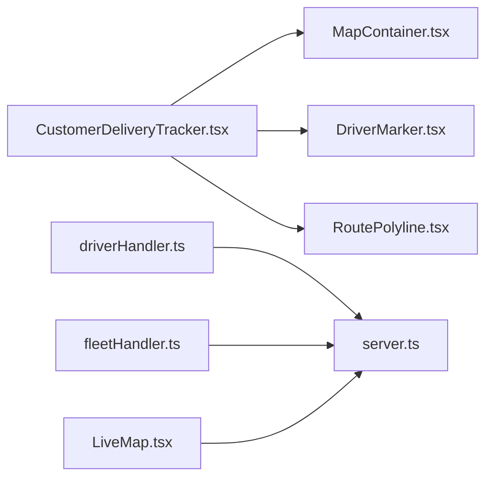

# Live Delivery Tracking

<cite>
**Referenced Files in This Document**
- [DeliveryTracking.tsx](file://src/pages/DeliveryTracking.tsx)
- [LiveMap.tsx](file://src/pages/LiveMap.tsx)
- [CustomerDeliveryTracker.tsx](file://src/components/customer/CustomerDeliveryTracker.tsx)
- [MapContainer.tsx](file://src/components/maps/MapContainer.tsx)
- [DriverMarker.tsx](file://src/components/maps/DriverMarker.tsx)
- [RoutePolyline.tsx](file://src/components/maps/RoutePolyline.tsx)
- [LiveMap.tsx](file://src/fleet/components/map/LiveMap.tsx)
- [server.ts](file://websocket-server/src/server.ts)
- [driverHandler.ts](file://websocket-server/src/handlers/driverHandler.ts)
- [fleetHandler.ts](file://websocket-server/src/handlers/fleetHandler.ts)
</cite>

## Table of Contents
1. [Introduction](#introduction)
2. [Project Structure](#project-structure)
3. [Core Components](#core-components)
4. [Architecture Overview](#architecture-overview)
5. [Detailed Component Analysis](#detailed-component-analysis)
6. [Dependency Analysis](#dependency-analysis)
7. [Performance Considerations](#performance-considerations)
8. [Troubleshooting Guide](#troubleshooting-guide)
9. [Conclusion](#conclusion)

## Introduction
This document describes the live delivery tracking system, covering GPS coordinate updates, route visualization, real-time ETA calculations, driver location sharing via WebSocket connections, and map integration with Leaflet. It explains how customer dashboards and driver management interfaces integrate live tracking, and outlines performance considerations for handling multiple concurrent tracking streams.

## Project Structure
The live tracking system spans three primary areas:
- Customer-facing tracking UI and map rendering
- Driver location streaming via WebSocket server
- Fleet management map overlay for supervisors



**Diagram sources**
- [DeliveryTracking.tsx:113-592](file://src/pages/DeliveryTracking.tsx#L113-L592)
- [CustomerDeliveryTracker.tsx:110-726](file://src/components/customer/CustomerDeliveryTracker.tsx#L110-L726)
- [MapContainer.tsx:69-116](file://src/components/maps/MapContainer.tsx#L69-L116)
- [DriverMarker.tsx:122-159](file://src/components/maps/DriverMarker.tsx#L122-L159)
- [RoutePolyline.tsx:12-91](file://src/components/maps/RoutePolyline.tsx#L12-L91)
- [server.ts:108-150](file://websocket-server/src/server.ts#L108-L150)
- [driverHandler.ts:48-100](file://websocket-server/src/handlers/driverHandler.ts#L48-L100)
- [fleetHandler.ts:36-82](file://websocket-server/src/handlers/fleetHandler.ts#L36-L82)
- [LiveMap.tsx:32-271](file://src/fleet/components/map/LiveMap.tsx#L32-L271)

**Section sources**
- [DeliveryTracking.tsx:113-592](file://src/pages/DeliveryTracking.tsx#L113-L592)
- [LiveMap.tsx:1-20](file://src/pages/LiveMap.tsx#L1-L20)
- [CustomerDeliveryTracker.tsx:110-726](file://src/components/customer/CustomerDeliveryTracker.tsx#L110-L726)
- [MapContainer.tsx:69-116](file://src/components/maps/MapContainer.tsx#L69-L116)
- [DriverMarker.tsx:122-159](file://src/components/maps/DriverMarker.tsx#L122-L159)
- [RoutePolyline.tsx:12-91](file://src/components/maps/RoutePolyline.tsx#L12-L91)
- [LiveMap.tsx:32-271](file://src/fleet/components/map/LiveMap.tsx#L32-L271)
- [server.ts:108-150](file://websocket-server/src/server.ts#L108-L150)
- [driverHandler.ts:48-100](file://websocket-server/src/handlers/driverHandler.ts#L48-L100)
- [fleetHandler.ts:36-82](file://websocket-server/src/handlers/fleetHandler.ts#L36-L82)

## Core Components
- CustomerDeliveryTracker: Subscribes to Supabase channels for delivery job and driver location updates, renders live map with driver marker, route history, and ETA.
- MapContainer: A robust Leaflet wrapper that avoids StrictMode double-init issues and supports programmatic centering.
- DriverMarker: Renders a dynamic driver icon with rotation and optional pulsing animation; displays speed and ETA in popup.
- RoutePolyline: Draws route segments with optional speed-coded coloring.
- WebSocket Server: Socket.IO server with Redis adapter, JWT auth, rate-limiting, and room-based broadcasts.
- Driver Handler: Validates and rate-limits driver location updates, caches and persists data, and broadcasts to fleet.
- Fleet Handler: Manages city subscriptions and location history requests.
- LiveMap (Fleet): Renders a Mapbox map with driver markers, online count, and controls.

**Section sources**
- [CustomerDeliveryTracker.tsx:110-726](file://src/components/customer/CustomerDeliveryTracker.tsx#L110-L726)
- [MapContainer.tsx:69-116](file://src/components/maps/MapContainer.tsx#L69-L116)
- [DriverMarker.tsx:122-159](file://src/components/maps/DriverMarker.tsx#L122-L159)
- [RoutePolyline.tsx:12-91](file://src/components/maps/RoutePolyline.tsx#L12-L91)
- [server.ts:108-150](file://websocket-server/src/server.ts#L108-L150)
- [driverHandler.ts:48-100](file://websocket-server/src/handlers/driverHandler.ts#L48-L100)
- [fleetHandler.ts:36-82](file://websocket-server/src/handlers/fleetHandler.ts#L36-L82)
- [LiveMap.tsx:32-271](file://src/fleet/components/map/LiveMap.tsx#L32-L271)

## Architecture Overview
The system integrates real-time delivery tracking across three layers:
- Data and events: Supabase Postgres changes and WebSocket events
- Transport: Socket.IO with Redis adapter for horizontal scaling
- Presentation: React components with Leaflet and Mapbox



**Diagram sources**
- [driverHandler.ts:105-207](file://websocket-server/src/handlers/driverHandler.ts#L105-L207)
- [server.ts:108-150](file://websocket-server/src/server.ts#L108-L150)
- [CustomerDeliveryTracker.tsx:152-207](file://src/components/customer/CustomerDeliveryTracker.tsx#L152-L207)

## Detailed Component Analysis

### Customer Delivery Tracking UI
- Real-time job and driver updates via Supabase channels
- Driver location updates via polling fallback if WebSockets are unavailable
- ETA calculation using Haversine distance and driver-reported speed
- Map rendering with driver marker, route history, and optional restaurant/customer markers



**Diagram sources**
- [CustomerDeliveryTracker.tsx:124-207](file://src/components/customer/CustomerDeliveryTracker.tsx#L124-L207)
- [CustomerDeliveryTracker.tsx:314-336](file://src/components/customer/CustomerDeliveryTracker.tsx#L314-L336)

**Section sources**
- [CustomerDeliveryTracker.tsx:110-726](file://src/components/customer/CustomerDeliveryTracker.tsx#L110-L726)

### Map Rendering with Leaflet
- Robust initialization with StrictMode compatibility
- Programmatic center updates without full remount
- Route rendering and driver marker with dynamic icons

```mermaid
classDiagram
class MapContainer {
+center : LatLngExpression
+zoom : number
+children : ReactNode
+render()
}
class DriverMarker {
+position : {lat, lng}
+heading : number
+speed : number
+eta : string
+render()
}
class RoutePolyline {
+positions : [{lat, lng}]
+color : string
+weight : number
+render()
}
MapContainer --> DriverMarker : "contains"
MapContainer --> RoutePolyline : "contains"
```

**Diagram sources**
- [MapContainer.tsx:69-116](file://src/components/maps/MapContainer.tsx#L69-L116)
- [DriverMarker.tsx:122-159](file://src/components/maps/DriverMarker.tsx#L122-L159)
- [RoutePolyline.tsx:12-91](file://src/components/maps/RoutePolyline.tsx#L12-L91)

**Section sources**
- [MapContainer.tsx:69-116](file://src/components/maps/MapContainer.tsx#L69-L116)
- [DriverMarker.tsx:122-159](file://src/components/maps/DriverMarker.tsx#L122-L159)
- [RoutePolyline.tsx:12-91](file://src/components/maps/RoutePolyline.tsx#L12-L91)

### Driver Location Streaming and Broadcasting
- Driver app authenticates via JWT and connects to WebSocket server
- Location updates validated and rate-limited
- Redis caching and asynchronous persistence to database
- Broadcast to city-specific fleet rooms and optionally all cities



**Diagram sources**
- [driverHandler.ts:105-207](file://websocket-server/src/handlers/driverHandler.ts#L105-L207)
- [server.ts:108-150](file://websocket-server/src/server.ts#L108-L150)

**Section sources**
- [driverHandler.ts:48-100](file://websocket-server/src/handlers/driverHandler.ts#L48-L100)
- [driverHandler.ts:105-207](file://websocket-server/src/handlers/driverHandler.ts#L105-L207)

### Fleet Management Live Map
- Dynamically loads Mapbox GL JS to avoid SSR issues
- Creates driver markers with popups showing driver info and speed
- Updates markers on driver presence changes and removes offlines
- Provides map controls and connection status indicators



**Diagram sources**
- [LiveMap.tsx:42-97](file://src/fleet/components/map/LiveMap.tsx#L42-L97)
- [LiveMap.tsx:99-160](file://src/fleet/components/map/LiveMap.tsx#L99-L160)

**Section sources**
- [LiveMap.tsx:32-271](file://src/fleet/components/map/LiveMap.tsx#L32-L271)

### Delivery Status Transitions
- Customer-facing steps collapse internal sub-states into four visible steps
- Progress bar reflects current step and completion
- ETA updates as driver moves closer to customer



**Diagram sources**
- [CustomerDeliveryTracker.tsx:289-312](file://src/components/customer/CustomerDeliveryTracker.tsx#L289-L312)

**Section sources**
- [CustomerDeliveryTracker.tsx:289-312](file://src/components/customer/CustomerDeliveryTracker.tsx#L289-L312)

## Dependency Analysis
- CustomerDeliveryTracker depends on Supabase for real-time data and on Map components for visualization.
- WebSocket server depends on Redis for clustering and JWT for authentication.
- Driver handler validates and transforms driver payloads; fleet handler manages access and history queries.



**Diagram sources**
- [CustomerDeliveryTracker.tsx:110-726](file://src/components/customer/CustomerDeliveryTracker.tsx#L110-L726)
- [MapContainer.tsx:69-116](file://src/components/maps/MapContainer.tsx#L69-L116)
- [DriverMarker.tsx:122-159](file://src/components/maps/DriverMarker.tsx#L122-L159)
- [RoutePolyline.tsx:12-91](file://src/components/maps/RoutePolyline.tsx#L12-L91)
- [driverHandler.ts:48-100](file://websocket-server/src/handlers/driverHandler.ts#L48-L100)
- [fleetHandler.ts:36-82](file://websocket-server/src/handlers/fleetHandler.ts#L36-L82)
- [LiveMap.tsx:32-271](file://src/fleet/components/map/LiveMap.tsx#L32-L271)
- [server.ts:108-150](file://websocket-server/src/server.ts#L108-L150)

**Section sources**
- [CustomerDeliveryTracker.tsx:110-726](file://src/components/customer/CustomerDeliveryTracker.tsx#L110-L726)
- [driverHandler.ts:48-100](file://websocket-server/src/handlers/driverHandler.ts#L48-L100)
- [fleetHandler.ts:36-82](file://websocket-server/src/handlers/fleetHandler.ts#L36-L82)
- [LiveMap.tsx:32-271](file://src/fleet/components/map/LiveMap.tsx#L32-L271)
- [server.ts:108-150](file://websocket-server/src/server.ts#L108-L150)

## Performance Considerations
- WebSocket server
  - Configurable ping intervals and timeouts to maintain long-lived connections efficiently
  - Redis adapter enables multi-instance scaling
  - Per-message deflate reduces payload sizes
  - Max connections and update intervals prevent overload
- Driver location updates
  - Zod validation ensures data integrity
  - Rate limiting prevents excessive updates
  - Asynchronous persistence avoids blocking the event loop
- Customer map rendering
  - Lazy loading of map components avoids SSR issues and reduces initial bundle size
  - Route history growth should be capped to control memory usage
  - Map center updates are optimized to avoid unnecessary re-renders
- Fleet map rendering
  - Dynamic import of Mapbox GL prevents SSR and reduces initial load
  - Efficient marker lifecycle (create/update/remove) minimizes DOM churn

[No sources needed since this section provides general guidance]

## Troubleshooting Guide
- WebSocket server
  - Health endpoint exposes connection counts and environment
  - Readiness probe checks Redis connectivity
  - Graceful shutdown closes all sockets, Redis, and database pools
- Driver handler
  - Emits validation errors and rate-limit warnings
  - Marks driver offline on disconnect and updates database
- Fleet handler
  - Enforces city access based on manager roles
  - Limits history points per request to protect performance
- Customer tracker
  - Falls back to polling if real-time channel fails
  - Shows loading skeletons while initializing

**Section sources**
- [server.ts:162-192](file://websocket-server/src/server.ts#L162-L192)
- [server.ts:197-239](file://websocket-server/src/server.ts#L197-L239)
- [driverHandler.ts:115-135](file://websocket-server/src/handlers/driverHandler.ts#L115-L135)
- [driverHandler.ts:280-317](file://websocket-server/src/handlers/driverHandler.ts#L280-L317)
- [fleetHandler.ts:108-116](file://websocket-server/src/handlers/fleetHandler.ts#L108-L116)
- [fleetHandler.ts:145-212](file://websocket-server/src/handlers/fleetHandler.ts#L145-L212)
- [CustomerDeliveryTracker.tsx:193-207](file://src/components/customer/CustomerDeliveryTracker.tsx#L193-L207)

## Conclusion
The live delivery tracking system combines reliable real-time data from Supabase and WebSocket streams with efficient map rendering using Leaflet and Mapbox. It provides accurate ETA estimates, dynamic route visualization, and scalable driver location broadcasting suitable for fleet supervision and customer transparency. The modular architecture and performance-conscious design enable smooth operation under multiple concurrent tracking streams.