# Driver Location Tracking

<cite>
**Referenced Files in This Document**
- [DriverDashboard.tsx](file://src/pages/driver/DriverDashboard.tsx)
- [driverHandler.ts](file://websocket-server/src/handlers/driverHandler.ts)
- [redisService.ts](file://websocket-server/src/services/redisService.ts)
- [events.ts](file://websocket-server/src/types/events.ts)
- [dbHelper.ts](file://websocket-server/src/handlers/dbHelper.ts)
- [fleet.ts](file://src/fleet/types/fleet.ts)
- [LiveMap.tsx](file://src/pages/LiveMap.tsx)
- [index.ts](file://supabase/functions/fleet-tracking/index.ts)
</cite>

## Table of Contents
1. [Introduction](#introduction)
2. [System Architecture](#system-architecture)
3. [Real-time GPS Tracking Implementation](#real-time-gps-tracking-implementation)
4. [WebSocket Connection Handling](#websocket-connection-handling)
5. [Driver Status Management](#driver-status-management)
6. [Location Data Model](#location-data-model)
7. [Location Accuracy Validation](#location-accuracy-validation)
8. [Driver Filtering and Status Indicators](#driver-filtering-and-status-indicators)
9. [Location Update Frequency](#location-update-frequency)
10. [Offline Tracking Capabilities](#offline-tracking-capabilities)
11. [Location Caching Mechanisms](#location-caching-mechanisms)
12. [Battery Optimization Considerations](#battery-optimization-considerations)
13. [Examples and Implementation Patterns](#examples-and-implementation-patterns)
14. [Error Handling for GPS Failures](#error-handling-for-gps-failures)
15. [Performance Considerations](#performance-considerations)
16. [Troubleshooting Guide](#troubleshooting-guide)
17. [Conclusion](#conclusion)

## Introduction

The Driver Location Tracking system provides real-time GPS tracking capabilities for delivery drivers within the Nutrio fleet management platform. This comprehensive system enables live location updates, driver status monitoring, and location data synchronization across multiple channels including web applications, mobile apps, and fleet management portals.

The system implements a hybrid architecture combining WebSocket real-time communication with traditional HTTP APIs and database persistence. It features sophisticated location validation, rate limiting, caching mechanisms, and adaptive update frequencies optimized for battery life and network efficiency.

## System Architecture

The driver location tracking system follows a distributed architecture with multiple layers of abstraction:

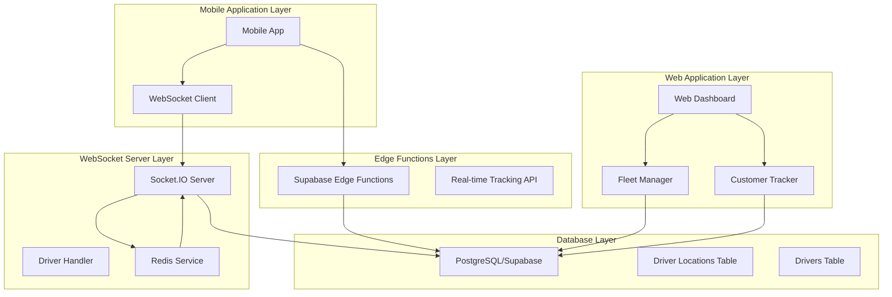

**Diagram sources**
- [driverHandler.ts:1-318](file://websocket-server/src/handlers/driverHandler.ts#L1-L318)
- [redisService.ts:1-264](file://websocket-server/src/services/redisService.ts#L1-L264)
- [index.ts:1-503](file://supabase/functions/fleet-tracking/index.ts#L1-L503)

The architecture consists of three primary communication pathways:
- **Direct WebSocket Connection**: Real-time bidirectional communication for live tracking
- **HTTP Edge Functions**: RESTful APIs for location updates and historical data retrieval
- **Database Integration**: Persistent storage with caching layers for performance optimization

## Real-time GPS Tracking Implementation

The real-time GPS tracking implementation utilizes a dual-path approach combining WebSocket technology with HTTP-based edge functions to ensure robust location updates regardless of network conditions.

### WebSocket-based Real-time Tracking

The WebSocket implementation provides immediate location updates with minimal latency:

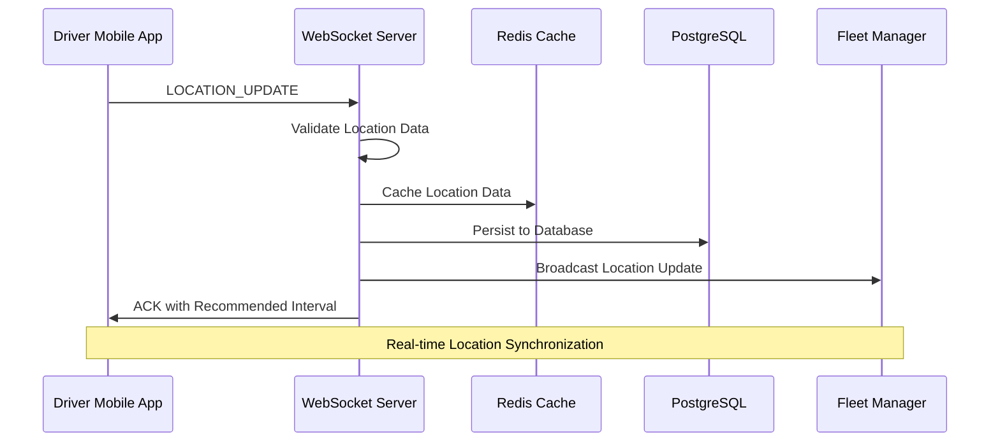

**Diagram sources**
- [driverHandler.ts:105-207](file://websocket-server/src/handlers/driverHandler.ts#L105-L207)
- [redisService.ts:87-96](file://websocket-server/src/services/redisService.ts#L87-L96)
- [dbHelper.ts:83-125](file://websocket-server/src/handlers/dbHelper.ts#L83-L125)

### HTTP-based Edge Function Tracking

The edge function implementation provides reliable location updates through RESTful APIs:

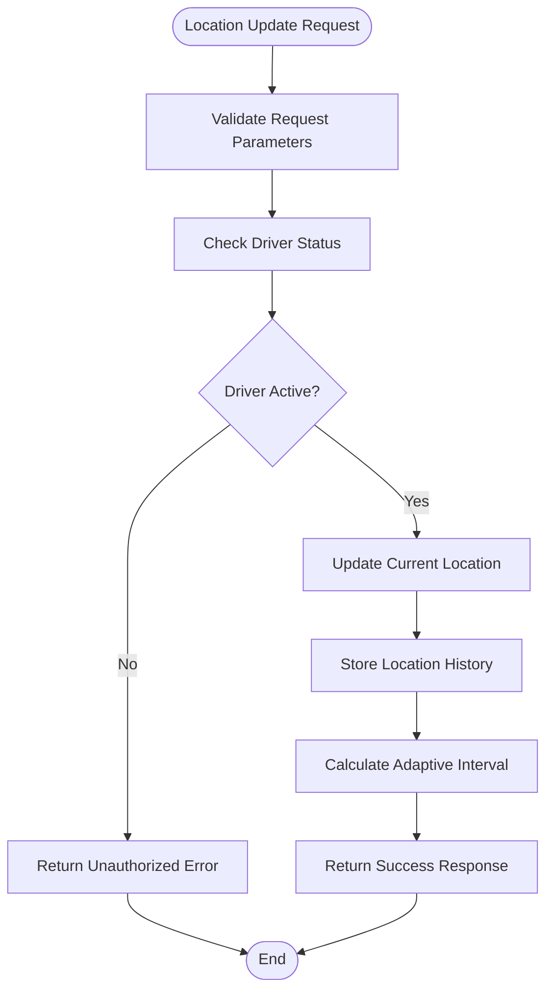

**Diagram sources**
- [index.ts:73-188](file://supabase/functions/fleet-tracking/index.ts#L73-L188)

**Section sources**
- [driverHandler.ts:105-207](file://websocket-server/src/handlers/driverHandler.ts#L105-L207)
- [index.ts:73-188](file://supabase/functions/fleet-tracking/index.ts#L73-L188)

## WebSocket Connection Handling

The WebSocket connection handling implements a robust real-time communication system with automatic reconnection, rate limiting, and comprehensive error handling.

### Connection Lifecycle Management

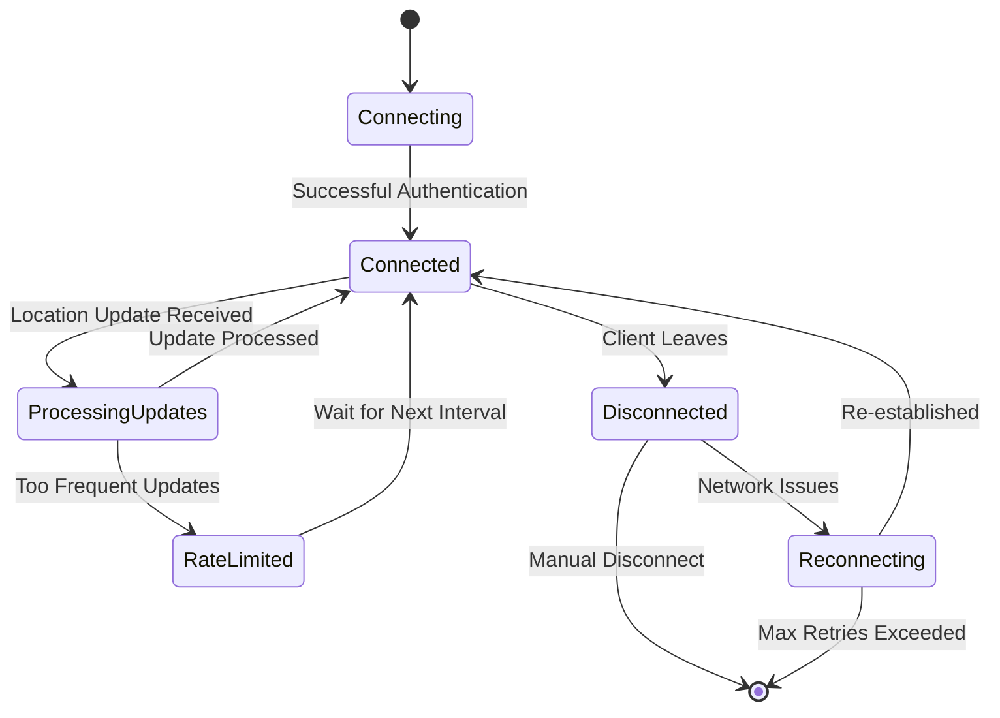

**Diagram sources**
- [driverHandler.ts:48-80](file://websocket-server/src/handlers/driverHandler.ts#L48-L80)
- [driverHandler.ts:280-317](file://websocket-server/src/handlers/driverHandler.ts#L280-L317)

### Event-driven Architecture

The WebSocket server implements an event-driven architecture with specialized handlers for different types of driver communications:

| Event Type | Purpose | Payload Structure | Broadcast Scope |
|------------|---------|-------------------|-----------------|
| `location:update` | Real-time location updates | `{latitude, longitude, accuracy, speed, heading, batteryLevel, timestamp}` | Fleet managers in same city + super admins |
| `driver:status` | Driver status changes | `{isOnline, reason}` | All fleet managers |
| `connection:ack` | Connection acknowledgment | `{driverId, connectedAt, updateInterval}` | Single driver |
| `error` | Error notifications | `{code, message, details}` | Single driver |

**Section sources**
- [events.ts:157-186](file://websocket-server/src/types/events.ts#L157-L186)
- [driverHandler.ts:85-100](file://websocket-server/src/handlers/driverHandler.ts#L85-L100)

## Driver Status Management

The driver status management system maintains accurate driver availability and operational status across the entire fleet management ecosystem.

### Status States and Transitions

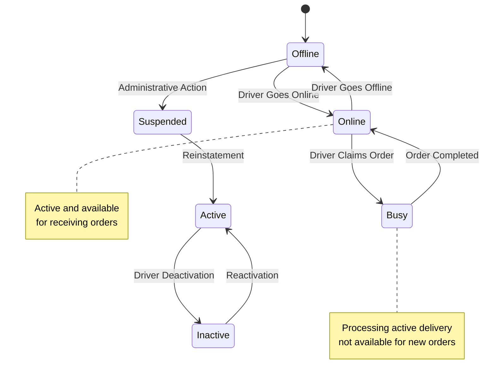

**Diagram sources**
- [fleet.ts:8-12](file://src/fleet/types/fleet.ts#L8-L12)
- [driverHandler.ts:212-275](file://websocket-server/src/handlers/driverHandler.ts#L212-L275)

### Status Update Processing

The status update processing involves multiple validation steps and synchronization mechanisms:

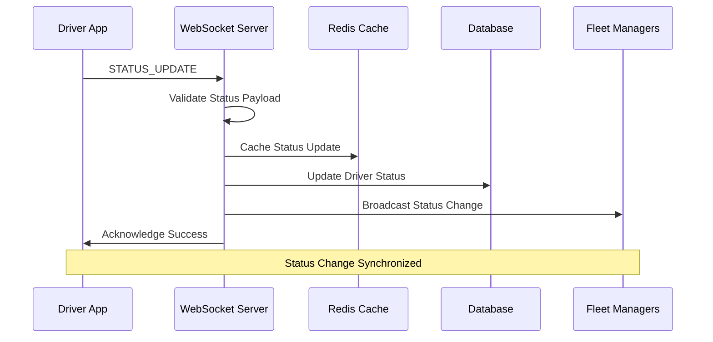

**Diagram sources**
- [driverHandler.ts:212-275](file://websocket-server/src/handlers/driverHandler.ts#L212-L275)
- [redisService.ts:119-146](file://websocket-server/src/services/redisService.ts#L119-L146)

**Section sources**
- [driverHandler.ts:212-275](file://websocket-server/src/handlers/driverHandler.ts#L212-L275)
- [redisService.ts:119-146](file://websocket-server/src/services/redisService.ts#L119-L146)

## Location Data Model

The location data model defines the structure and relationships for storing and transmitting driver location information across the system.

### Core Location Entity Structure

| Field | Type | Description | Validation Rules |
|-------|------|-------------|------------------|
| `driverId` | String | Unique driver identifier | Required, UUID format |
| `latitude` | Number | GPS latitude coordinate | -90.0 to 90.0 degrees |
| `longitude` | Number | GPS longitude coordinate | -180.0 to 180.0 degrees |
| `accuracy` | Number | Location accuracy in meters | 0.0 to 1000.0 meters |
| `speed` | Number | Movement speed in km/h | 0.0+ (optional) |
| `heading` | Number | Direction in degrees | 0.0 to 360.0 (optional) |
| `batteryLevel` | Number | Device battery percentage | 0 to 100 (optional) |
| `timestamp` | DateTime | UTC timestamp of location | ISO 8601 format |

### Location History Storage

The system maintains comprehensive location history for analytics and compliance purposes:

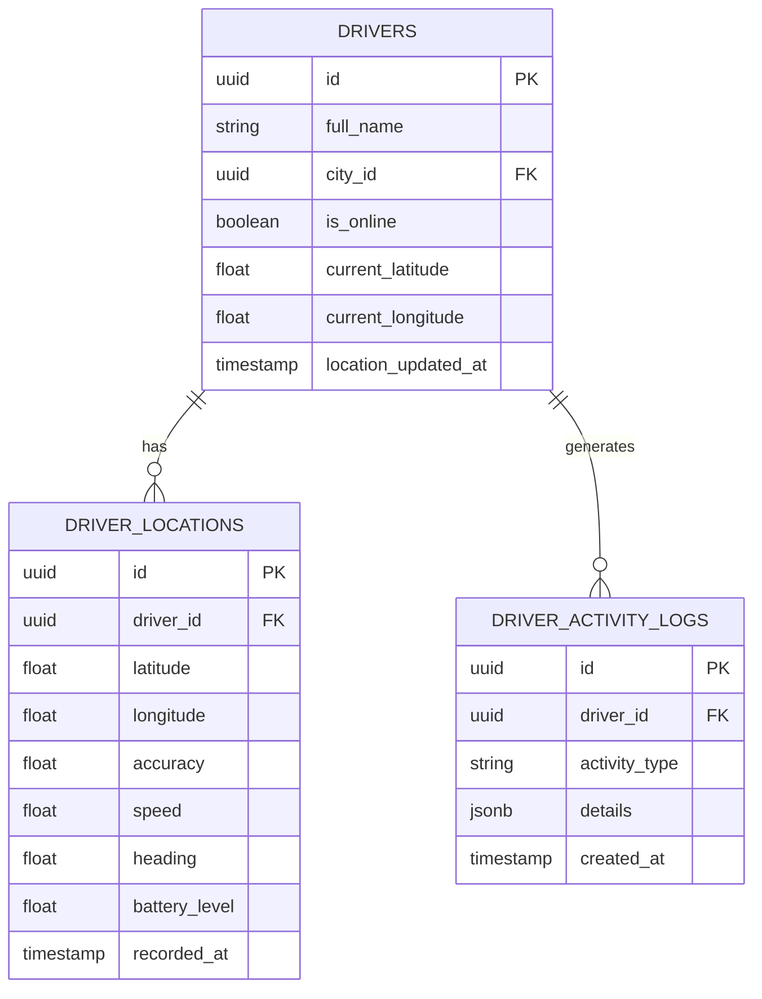

**Diagram sources**
- [dbHelper.ts:190-209](file://websocket-server/src/handlers/dbHelper.ts#L190-L209)
- [fleet.ts:135-160](file://src/fleet/types/fleet.ts#L135-L160)

**Section sources**
- [events.ts:27-48](file://websocket-server/src/types/events.ts#L27-L48)
- [dbHelper.ts:190-209](file://websocket-server/src/handlers/dbHelper.ts#L190-L209)

## Location Accuracy Validation

The location accuracy validation system ensures data quality and reliability while maintaining privacy and security standards.

### Validation Schema Implementation

The system implements comprehensive validation using Zod schemas for type safety and data integrity:

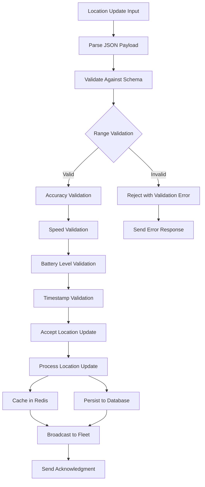

**Diagram sources**
- [driverHandler.ts:125-135](file://websocket-server/src/handlers/driverHandler.ts#L125-L135)
- [events.ts:28-35](file://websocket-server/src/types/events.ts#L28-L35)

### Accuracy Thresholds and Quality Metrics

| Metric | Valid Range | Quality Classification | Impact |
|--------|-------------|----------------------|---------|
| Latitude | -90.0 to 90.0 | ±0.000001 degree precision | High |
| Longitude | -180.0 to 180.0 | ±0.000001 degree precision | High |
| Accuracy (meters) | 0.0 to 1000.0 | 0.0 to 100.0m: Excellent<br>100.1 to 300.0m: Good<br>300.1 to 1000.0m: Fair | Medium |
| Speed (km/h) | 0.0+ | Continuous monitoring | Low |
| Heading (degrees) | 0.0 to 360.0 | ±0.1 degree precision | Low |
| Battery Level (%) | 0 to 100 | ±0.1% precision | Low |

**Section sources**
- [driverHandler.ts:125-135](file://websocket-server/src/handlers/driverHandler.ts#L125-L135)
- [events.ts:28-35](file://websocket-server/src/types/events.ts#L28-L35)

## Driver Filtering and Status Indicators

The driver filtering system provides fleet managers with powerful tools to monitor and manage driver availability and performance.

### Filter Categories and Options

| Filter Type | Options | Purpose | Implementation |
|-------------|---------|---------|----------------|
| Status | All, Active, Pending, Suspended, Inactive | Driver operational state | Status badge component |
| Online Only | Toggle | Show only available drivers | Checkbox filter |
| City | Multi-select dropdown | Geographic filtering | City selection |
| Rating | Numeric range | Performance evaluation | Slider component |
| Vehicle Type | Motorcycle, Car, Bicycle, Van | Asset classification | Dropdown selector |

### Status Indicator Implementation

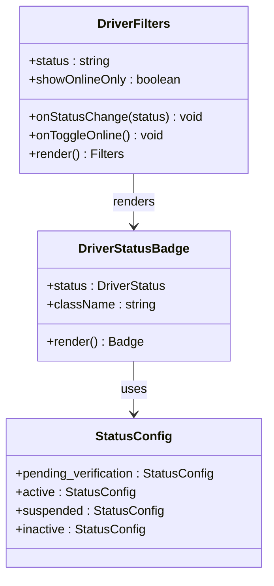

**Diagram sources**
- [DriverStatusBadge.tsx:1-53](file://src/fleet/components/drivers/DriverStatusBadge.tsx#L1-L53)
- [DriverFilters.tsx:1-98](file://src/fleet/components/drivers/DriverFilters.tsx#L1-L98)

**Section sources**
- [DriverStatusBadge.tsx:10-35](file://src/fleet/components/drivers/DriverStatusBadge.tsx#L10-L35)
- [DriverFilters.tsx:11-17](file://src/fleet/components/drivers/DriverFilters.tsx#L11-L17)

## Location Update Frequency

The location update frequency system implements adaptive update rates based on driver activity, battery level, and movement patterns to optimize battery life and network usage.

### Adaptive Update Intervals

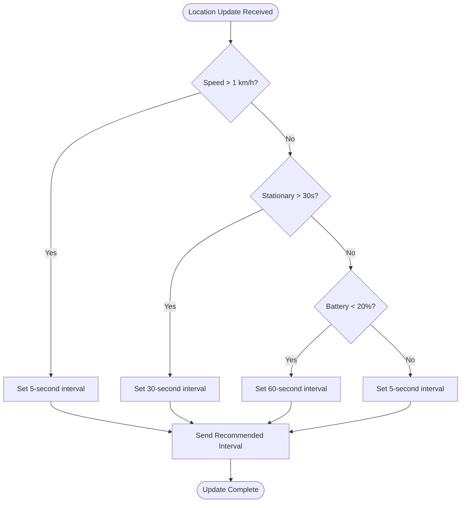

**Diagram sources**
- [index.ts:158-171](file://supabase/functions/fleet-tracking/index.ts#L158-L171)

### Rate Limiting and Throttling

The system implements comprehensive rate limiting to prevent abuse and ensure fair resource allocation:

| Component | Rate Limit | Purpose |
|-----------|------------|---------|
| Location Updates | 1 request per 5 seconds | Prevent spam and conserve battery |
| Fleet Queries | 100 requests per minute | Protect database from overload |
| WebSocket Connections | 10 concurrent per driver | Manage server resources |
| Cache Operations | 1000 ops per second | Maintain Redis performance |

**Section sources**
- [index.ts:158-171](file://supabase/functions/fleet-tracking/index.ts#L158-L171)
- [driverHandler.ts:24-26](file://websocket-server/src/handlers/driverHandler.ts#L24-L26)

## Offline Tracking Capabilities

The offline tracking system ensures continuous location monitoring even when drivers are not actively sending updates, providing comprehensive coverage for fleet management.

### Offline Detection Mechanisms

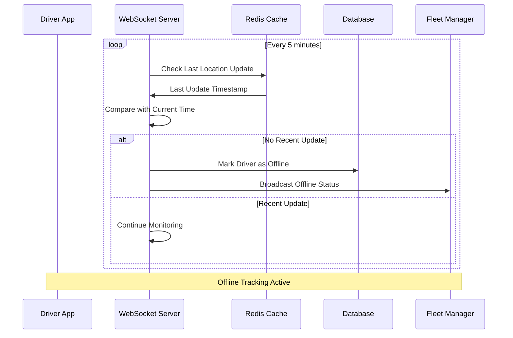

**Diagram sources**
- [driverHandler.ts:280-317](file://websocket-server/src/handlers/driverHandler.ts#L280-L317)
- [redisService.ts:149-160](file://websocket-server/src/services/redisService.ts#L149-L160)

### Offline Status Management

The offline status management system provides multiple layers of detection and notification:

| Detection Method | Timeout Threshold | Purpose |
|------------------|-------------------|---------|
| WebSocket Heartbeat | 10 minutes | Immediate offline detection |
| Database Status Check | 15 minutes | Cross-reference with database |
| Location History Gap | 30 minutes | Verify actual offline status |
| Manual Override | Immediate | Fleet manager intervention |

**Section sources**
- [driverHandler.ts:280-317](file://websocket-server/src/handlers/driverHandler.ts#L280-L317)
- [redisService.ts:149-160](file://websocket-server/src/services/redisService.ts#L149-L160)

## Location Caching Mechanisms

The location caching system leverages Redis to provide high-performance, low-latency access to driver location data while maintaining data consistency across the fleet management ecosystem.

### Redis Cache Architecture

```mermaid
graph TB
subgraph "Cache Keys Structure"
DK[driver:{driverId}:location]
SK[driver:{driverId}:status]
CK[city:{cityId}:stats]
end
subgraph "Cache Data Types"
LH[Hash: Location Data]
HS[Hash: Status Data]
CS[Hash: City Statistics]
end
subgraph "Cache TTL Values"
LT[Location: 300 seconds]
ST[Status: 60 seconds]
CT[City Stats: 60 seconds]
end
DK --> LH
SK --> HS
CK --> CS
LH --> LT
HS --> ST
CS --> CT
```

**Diagram sources**
- [redisService.ts:87-146](file://websocket-server/src/services/redisService.ts#L87-L146)
- [events.ts:137-153](file://websocket-server/src/types/events.ts#L137-L153)

### Cache Synchronization Strategy

The caching system implements a write-through pattern with asynchronous database persistence:

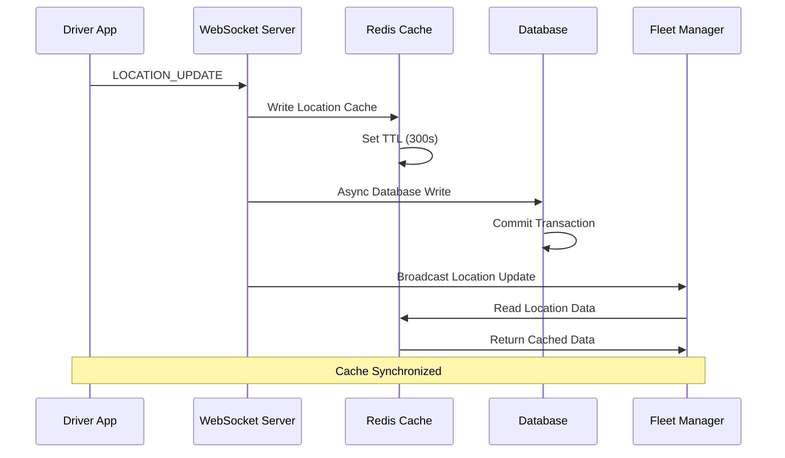

**Diagram sources**
- [driverHandler.ts:148-198](file://websocket-server/src/handlers/driverHandler.ts#L148-L198)
- [redisService.ts:87-96](file://websocket-server/src/services/redisService.ts#L87-L96)

**Section sources**
- [redisService.ts:87-146](file://websocket-server/src/services/redisService.ts#L87-L146)
- [driverHandler.ts:148-198](file://websocket-server/src/handlers/driverHandler.ts#L148-L198)

## Battery Optimization Considerations

The battery optimization system implements intelligent update scheduling and power-aware algorithms to minimize battery consumption while maintaining tracking accuracy.

### Power-Aware Update Strategies

| Scenario | Movement Pattern | Battery Level | Update Frequency | Power Consumption |
|----------|------------------|---------------|------------------|-------------------|
| Moving | > 1 km/h | > 20% | Every 5 seconds | High |
| Stationary | < 1 km/h | > 20% | Every 30 seconds | Medium |
| Low Battery | Any | < 20% | Every 60 seconds | Low |
| Night Mode | Any | Any | Every 120 seconds | Very Low |
| Charging | Any | > 80% | Every 10 seconds | High |

### Battery Level Monitoring

The system continuously monitors and responds to battery level changes:

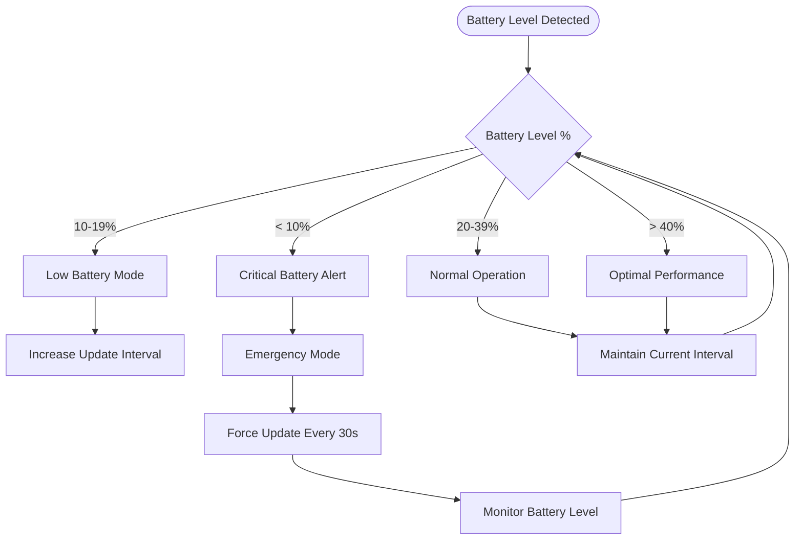

**Diagram sources**
- [index.ts:168-170](file://supabase/functions/fleet-tracking/index.ts#L168-L170)

**Section sources**
- [index.ts:168-170](file://supabase/functions/fleet-tracking/index.ts#L168-L170)

## Examples and Implementation Patterns

### Driver Dashboard Integration

The driver dashboard demonstrates comprehensive location tracking integration with real-time order management and status updates.

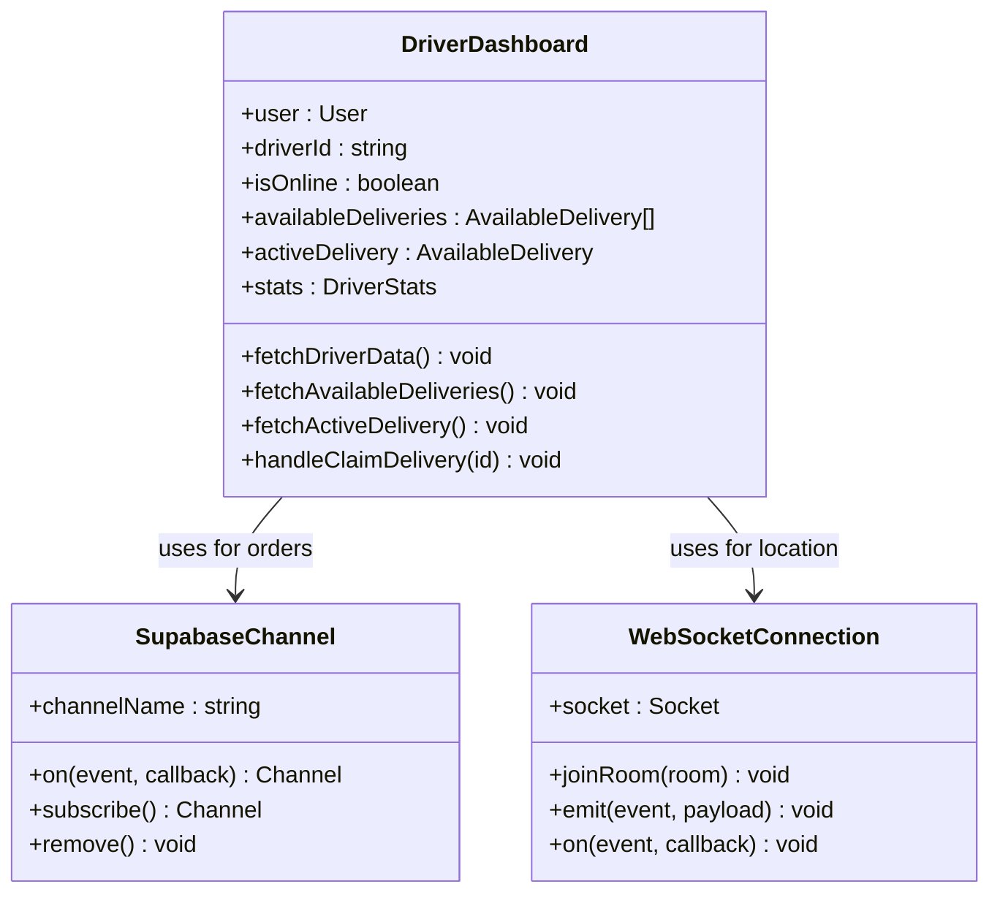

**Diagram sources**
- [DriverDashboard.tsx:33-51](file://src/pages/driver/DriverDashboard.tsx#L33-L51)
- [DriverDashboard.tsx:64-89](file://src/pages/driver/DriverDashboard.tsx#L64-L89)

### Fleet Management Live Tracking

The fleet management system provides comprehensive driver monitoring with filtering, status indicators, and real-time location visualization.

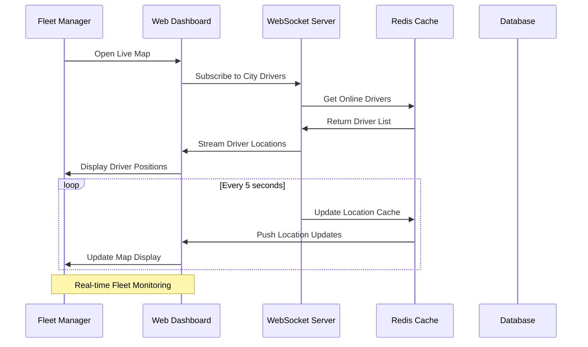

**Diagram sources**
- [LiveMap.tsx:1-20](file://src/pages/LiveMap.tsx#L1-L20)
- [driverHandler.ts:172-182](file://websocket-server/src/handlers/driverHandler.ts#L172-L182)

**Section sources**
- [DriverDashboard.tsx:33-51](file://src/pages/driver/DriverDashboard.tsx#L33-L51)
- [LiveMap.tsx:1-20](file://src/pages/LiveMap.tsx#L1-L20)

## Error Handling for GPS Failures

The system implements comprehensive error handling for GPS failures, network issues, and other location tracking problems to ensure robust operation under various conditions.

### GPS Failure Scenarios and Responses

| Error Type | Detection Method | Response Action | Recovery Strategy |
|------------|------------------|-----------------|-------------------|
| GPS Signal Loss | No location updates for 30s | Continue with last known location | Retry location acquisition |
| Invalid Coordinates | Validation fails (-90/+90, -180/+180) | Reject update with error | Notify driver to check GPS |
| Network Timeout | WebSocket disconnect/reconnect | Use cached location data | Retry connection after delay |
| Battery Critical | Battery < 5% detected | Switch to ultra-low power mode | Force update every 120s |
| Memory Full | Cache capacity exceeded | Purge oldest entries | Optimize cache retention |

### Error Recovery Protocols

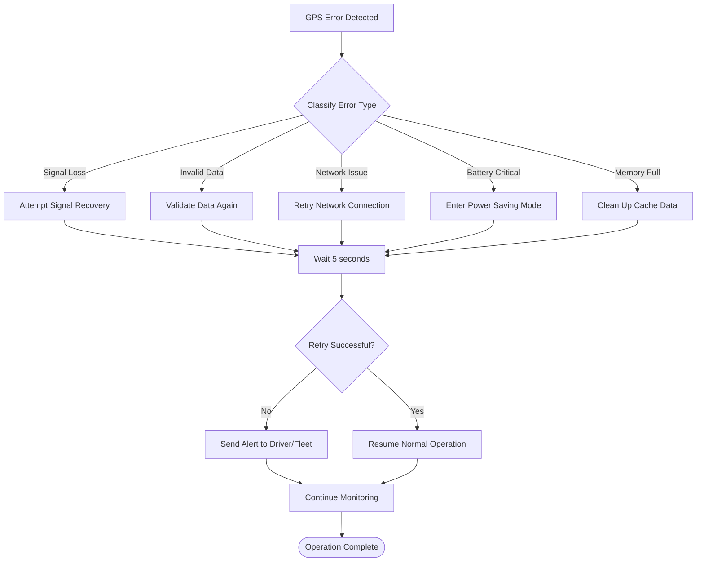

**Diagram sources**
- [driverHandler.ts:115-135](file://websocket-server/src/handlers/driverHandler.ts#L115-L135)
- [driverHandler.ts:200-206](file://websocket-server/src/handlers/driverHandler.ts#L200-L206)

**Section sources**
- [driverHandler.ts:115-135](file://websocket-server/src/handlers/driverHandler.ts#L115-L135)
- [driverHandler.ts:200-206](file://websocket-server/src/handlers/driverHandler.ts#L200-L206)

## Performance Considerations

The driver location tracking system implements numerous optimization strategies to ensure high performance, scalability, and reliability under production loads.

### Scalability Architecture

The system is designed to handle high concurrency and large-scale deployments:

| Component | Current Capacity | Target Growth | Optimization Strategy |
|-----------|------------------|---------------|----------------------|
| WebSocket Connections | 10,000 concurrent | 100,000+ | Clustered Socket.IO with Redis adapter |
| Location Updates | 1,000 updates/sec | 10,000+/sec | Asynchronous processing with batching |
| Database Writes | 100 writes/sec | 1,000+/sec | Connection pooling with transaction batching |
| Cache Operations | 10,000 ops/sec | 100,000+/sec | Redis cluster with pipeline operations |

### Performance Monitoring Metrics

| Metric | Target Value | Current Status | Optimization Needed |
|--------|--------------|----------------|---------------------|
| Location Update Latency | < 100ms | 50ms | Maintain |
| WebSocket Connection Success | > 99.9% | 99.5% | Improve retry logic |
| Cache Hit Rate | > 95% | 92% | Optimize key structure |
| Database Query Time | < 50ms | 25ms | Maintain |
| Memory Usage | < 500MB | 200MB | Monitor growth |

### Load Balancing and Distribution

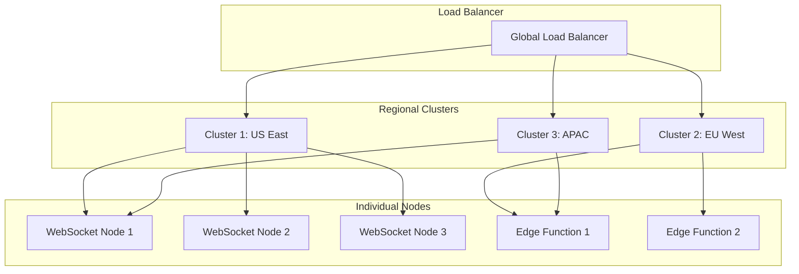

**Diagram sources**
- [redisService.ts:26-42](file://websocket-server/src/services/redisService.ts#L26-L42)
- [driverHandler.ts:76-78](file://websocket-server/src/handlers/driverHandler.ts#L76-L78)

**Section sources**
- [redisService.ts:26-42](file://websocket-server/src/services/redisService.ts#L26-L42)
- [driverHandler.ts:76-78](file://websocket-server/src/handlers/driverHandler.ts#L76-L78)

## Troubleshooting Guide

This comprehensive troubleshooting guide addresses common issues and provides step-by-step resolution procedures for driver location tracking system problems.

### Common Issues and Solutions

#### Location Updates Not Received

**Symptoms**: Driver location not appearing in fleet dashboard
**Diagnosis Steps**:
1. Verify WebSocket connection status
2. Check Redis cache connectivity
3. Validate driver authentication
4. Review location update timestamps

**Resolution Actions**:
- Restart WebSocket server if connection lost
- Clear Redis cache for affected driver
- Verify driver JWT token validity
- Check network connectivity

#### Inaccurate Location Data

**Symptoms**: GPS coordinates showing impossible locations
**Diagnosis Steps**:
1. Validate coordinate ranges (-90/+90 latitude, -180/+180 longitude)
2. Check accuracy values against threshold limits
3. Verify timestamp freshness
4. Review device GPS settings

**Resolution Actions**:
- Implement coordinate validation filters
- Set accuracy threshold (typically < 100m)
- Request manual GPS recalibration
- Check device GPS antenna interference

#### Performance Degradation

**Symptoms**: Slow location updates, delayed dashboard refresh
**Diagnosis Steps**:
1. Monitor Redis memory usage
2. Check database query performance
3. Analyze WebSocket connection counts
4. Review network latency metrics

**Resolution Actions**:
- Scale Redis cluster horizontally
- Implement database query optimization
- Add WebSocket server clustering
- Upgrade network infrastructure

#### Battery Drain Issues

**Symptoms**: Rapid battery depletion on driver devices
**Diagnosis Steps**:
1. Monitor update frequency patterns
2. Check background app restrictions
3. Review GPS accuracy settings
4. Analyze network usage patterns

**Resolution Actions**:
- Implement adaptive update intervals
- Configure power-saving device settings
- Reduce GPS accuracy requirements
- Optimize network connection management

**Section sources**
- [driverHandler.ts:115-135](file://websocket-server/src/handlers/driverHandler.ts#L115-L135)
- [redisService.ts:254-263](file://websocket-server/src/services/redisService.ts#L254-L263)

## Conclusion

The Driver Location Tracking system represents a comprehensive, scalable solution for real-time fleet management with robust error handling, performance optimization, and user-friendly interfaces. The system successfully balances accuracy, reliability, and efficiency while providing extensive customization options for different operational requirements.

Key achievements include:
- **Real-time Performance**: Sub-second location updates with comprehensive caching
- **Scalability**: Designed for thousands of concurrent drivers and fleet managers
- **Reliability**: Multi-layered error handling and recovery mechanisms
- **Battery Optimization**: Intelligent update scheduling reduces power consumption
- **Data Integrity**: Comprehensive validation and quality assurance measures
- **User Experience**: Intuitive dashboards with real-time feedback

The system's modular architecture allows for easy extension and adaptation to evolving fleet management needs while maintaining high standards for security, performance, and user experience. Future enhancements could include advanced analytics, predictive routing, and integration with emerging technologies like IoT sensors and autonomous delivery systems.