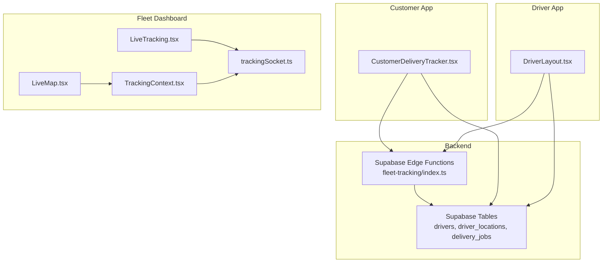
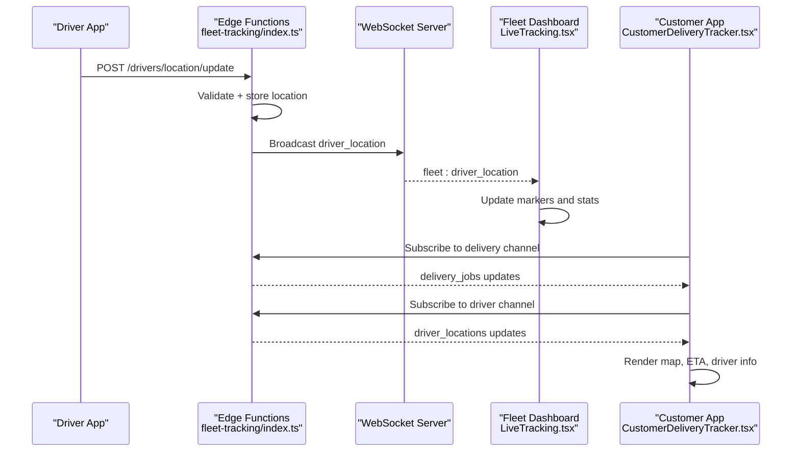
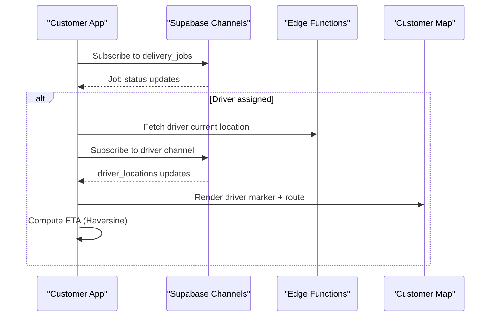
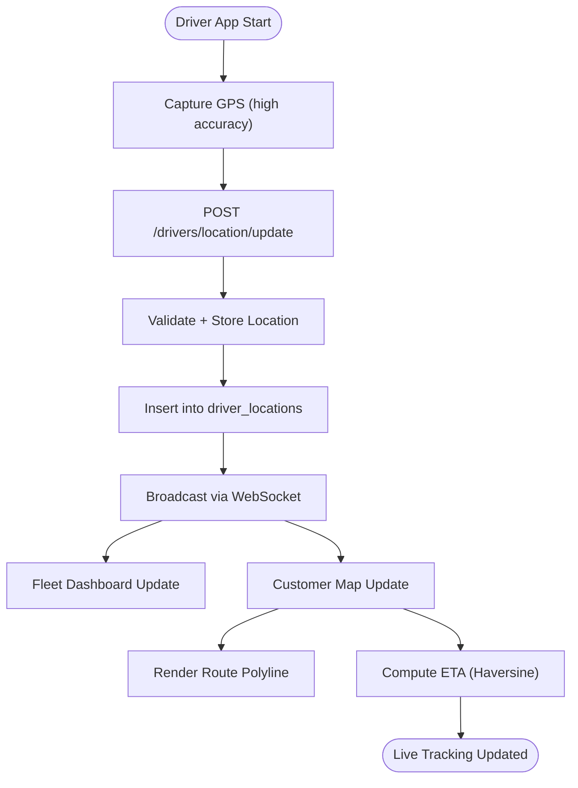
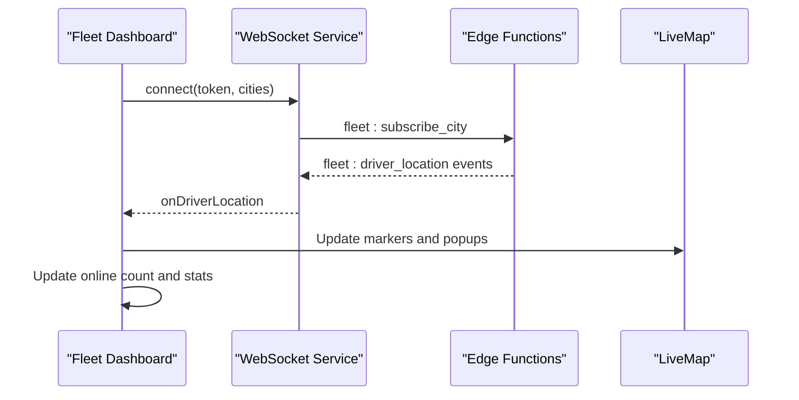
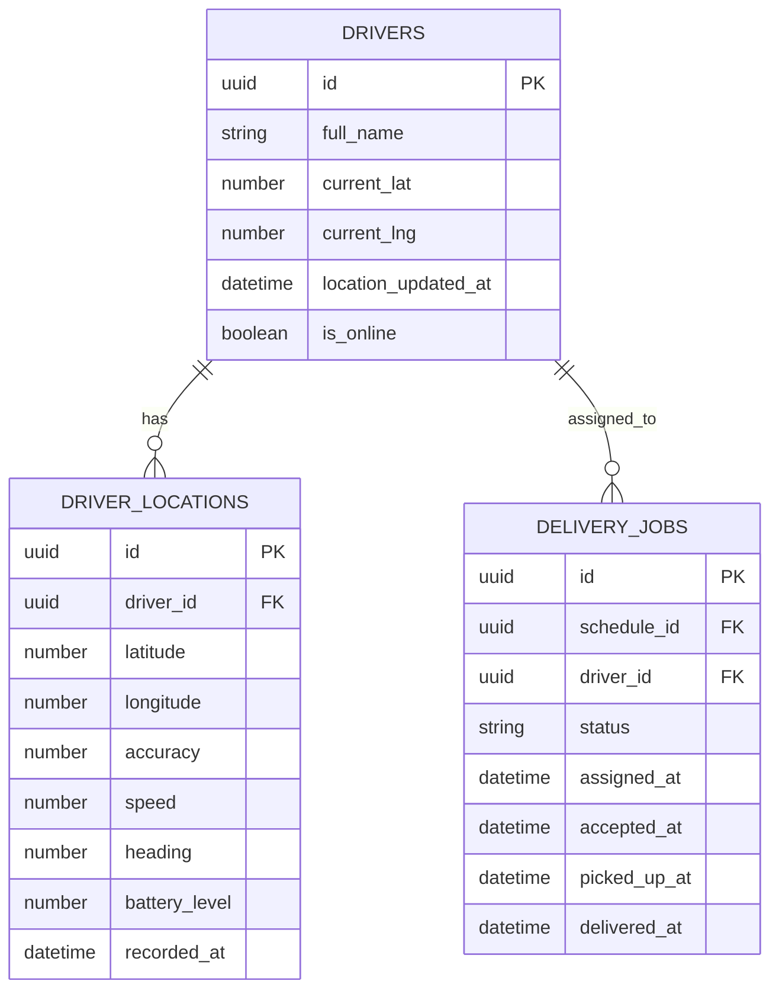
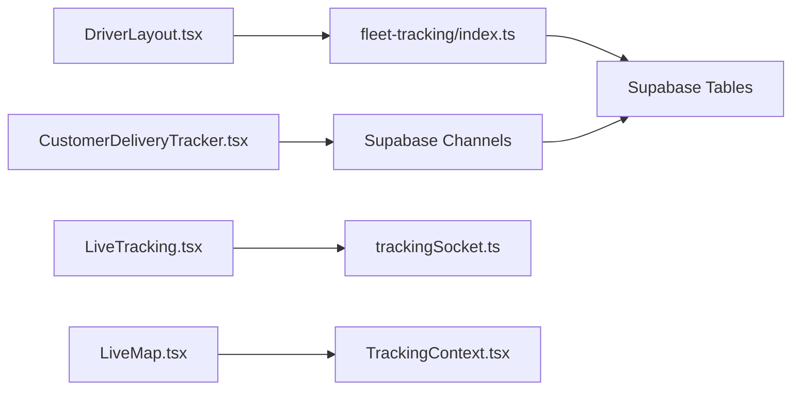

# Live Tracking

<cite>
**Referenced Files in This Document**
- [CustomerDeliveryTracker.tsx](file://src/components/customer/CustomerDeliveryTracker.tsx)
- [LiveMap.tsx](file://src/fleet/components/map/LiveMap.tsx)
- [LiveTracking.tsx](file://src/fleet/pages/LiveTracking.tsx)
- [TrackingContext.tsx](file://src/fleet/context/TrackingContext.tsx)
- [trackingSocket.ts](file://src/fleet/services/trackingSocket.ts)
- [delivery.ts](file://src/integrations/supabase/delivery.ts)
- [index.ts](file://supabase/functions/fleet-tracking/index.ts)
- [fleet.ts](file://src/fleet/types/fleet.ts)
- [DriverLayout.tsx](file://src/components/driver/DriverLayout.tsx)
- [distance.ts](file://src/lib/distance.ts)
</cite>

## Table of Contents
1. [Introduction](#introduction)
2. [Project Structure](#project-structure)
3. [Core Components](#core-components)
4. [Architecture Overview](#architecture-overview)
5. [Detailed Component Analysis](#detailed-component-analysis)
6. [Dependency Analysis](#dependency-analysis)
7. [Performance Considerations](#performance-considerations)
8. [Troubleshooting Guide](#troubleshooting-guide)
9. [Conclusion](#conclusion)

## Introduction
This document describes the real-time location and order tracking system across three primary surfaces: customer order tracking, driver-side location reporting, and fleet management live tracking. It explains how driver positions are captured, how real-time updates propagate to customers and fleet dashboards, and how the system integrates with mapping services and route visualization. It also covers update frequencies, accuracy considerations, and user experience enhancements such as driver communication and estimated arrival times.

## Project Structure
The live tracking system spans frontend components, backend APIs, and a WebSocket server:
- Customer-facing tracking: a dedicated tracker component that subscribes to order and driver location updates.
- Driver-side location reporting: periodic geolocation capture and submission to backend APIs.
- Fleet management live tracking: a real-time map dashboard powered by WebSocket events and city-scoped subscriptions.

**Diagram sources**
- [CustomerDeliveryTracker.tsx:110-207](file://src/components/customer/CustomerDeliveryTracker.tsx#L110-L207)
- [LiveTracking.tsx:39-255](file://src/fleet/pages/LiveTracking.tsx#L39-L255)
- [LiveMap.tsx:32-160](file://src/fleet/components/map/LiveMap.tsx#L32-L160)
- [TrackingContext.tsx:24-83](file://src/fleet/context/TrackingContext.tsx#L24-L83)
- [trackingSocket.ts:34-95](file://src/fleet/services/trackingSocket.ts#L34-L95)
- [index.ts:72-188](file://supabase/functions/fleet-tracking/index.ts#L72-L188)
- [delivery.ts:694-734](file://src/integrations/supabase/delivery.ts#L694-L734)

**Section sources**
- [CustomerDeliveryTracker.tsx:110-207](file://src/components/customer/CustomerDeliveryTracker.tsx#L110-L207)
- [LiveTracking.tsx:39-255](file://src/fleet/pages/LiveTracking.tsx#L39-L255)
- [LiveMap.tsx:32-160](file://src/fleet/components/map/LiveMap.tsx#L32-L160)
- [TrackingContext.tsx:24-83](file://src/fleet/context/TrackingContext.tsx#L24-L83)
- [trackingSocket.ts:34-95](file://src/fleet/services/trackingSocket.ts#L34-L95)
- [index.ts:72-188](file://supabase/functions/fleet-tracking/index.ts#L72-L188)
- [delivery.ts:694-734](file://src/integrations/supabase/delivery.ts#L694-L734)

## Core Components
- CustomerDeliveryTracker: Subscribes to delivery job and driver location updates, renders live map, driver info, and ETA.
- DriverLayout: Periodically captures geolocation and submits to backend APIs with adaptive intervals.
- LiveTracking: Renders a searchable driver list and a live map with real-time markers.
- LiveMap: Renders Mapbox GL markers for drivers with popups and overlays.
- TrackingContext: Provides real-time driver data and connection state to the fleet dashboard.
- trackingSocket: Manages WebSocket connections, subscriptions, and message queuing.
- Supabase Edge Functions: Accepts driver location updates, stores history, and serves online driver locations.
- Supabase Delivery Integration: Provides real-time Postgres changes channels for delivery and driver location updates.

**Section sources**
- [CustomerDeliveryTracker.tsx:110-207](file://src/components/customer/CustomerDeliveryTracker.tsx#L110-L207)
- [DriverLayout.tsx:93-166](file://src/components/driver/DriverLayout.tsx#L93-L166)
- [LiveTracking.tsx:39-255](file://src/fleet/pages/LiveTracking.tsx#L39-L255)
- [LiveMap.tsx:32-160](file://src/fleet/components/map/LiveMap.tsx#L32-L160)
- [TrackingContext.tsx:24-83](file://src/fleet/context/TrackingContext.tsx#L24-L83)
- [trackingSocket.ts:34-95](file://src/fleet/services/trackingSocket.ts#L34-L95)
- [index.ts:72-188](file://supabase/functions/fleet-tracking/index.ts#L72-L188)
- [delivery.ts:694-734](file://src/integrations/supabase/delivery.ts#L694-L734)

## Architecture Overview
The system uses a hybrid real-time pipeline:
- Driver mobile app periodically captures GPS and sends updates to Supabase Edge Functions.
- Edge Functions validate, store, and broadcast driver locations via WebSocket to fleet clients.
- Customer app subscribes to delivery job and driver location channels to render live tracking.

**Diagram sources**
- [index.ts:72-188](file://supabase/functions/fleet-tracking/index.ts#L72-L188)
- [trackingSocket.ts:55-95](file://src/fleet/services/trackingSocket.ts#L55-L95)
- [LiveTracking.tsx:224-255](file://src/fleet/pages/LiveTracking.tsx#L224-L255)
- [CustomerDeliveryTracker.tsx:124-207](file://src/components/customer/CustomerDeliveryTracker.tsx#L124-L207)

## Detailed Component Analysis

### Customer Order Tracking Flow
The customer tracker subscribes to real-time updates and renders a live map with driver, restaurant, and customer markers, plus route history and ETA.

**Diagram sources**
- [CustomerDeliveryTracker.tsx:124-207](file://src/components/customer/CustomerDeliveryTracker.tsx#L124-L207)
- [delivery.ts:694-734](file://src/integrations/supabase/delivery.ts#L694-L734)

**Section sources**
- [CustomerDeliveryTracker.tsx:110-207](file://src/components/customer/CustomerDeliveryTracker.tsx#L110-L207)
- [delivery.ts:694-734](file://src/integrations/supabase/delivery.ts#L694-L734)

### Driver Location Reporting and Route Visualization
Driver app captures geolocation at intervals and posts to the backend. The system adapts update frequency based on movement and battery level. The customer tracker visualizes the route as a polyline and shows driver progress.

**Diagram sources**
- [DriverLayout.tsx:93-166](file://src/components/driver/DriverLayout.tsx#L93-L166)
- [index.ts:72-188](file://supabase/functions/fleet-tracking/index.ts#L72-L188)
- [CustomerDeliveryTracker.tsx:591-621](file://src/components/customer/CustomerDeliveryTracker.tsx#L591-L621)

**Section sources**
- [DriverLayout.tsx:93-166](file://src/components/driver/DriverLayout.tsx#L93-L166)
- [index.ts:72-188](file://supabase/functions/fleet-tracking/index.ts#L72-L188)
- [CustomerDeliveryTracker.tsx:591-621](file://src/components/customer/CustomerDeliveryTracker.tsx#L591-L621)

### Fleet Live Tracking Dashboard
The fleet dashboard connects via WebSocket, subscribes to city-specific channels, and renders live markers with popups and stats overlays.

**Diagram sources**
- [LiveTracking.tsx:224-255](file://src/fleet/pages/LiveTracking.tsx#L224-L255)
- [LiveMap.tsx:32-160](file://src/fleet/components/map/LiveMap.tsx#L32-L160)
- [TrackingContext.tsx:24-83](file://src/fleet/context/TrackingContext.tsx#L24-L83)
- [trackingSocket.ts:34-95](file://src/fleet/services/trackingSocket.ts#L34-L95)

**Section sources**
- [LiveTracking.tsx:39-255](file://src/fleet/pages/LiveTracking.tsx#L39-L255)
- [LiveMap.tsx:32-160](file://src/fleet/components/map/LiveMap.tsx#L32-L160)
- [TrackingContext.tsx:24-83](file://src/fleet/context/TrackingContext.tsx#L24-L83)
- [trackingSocket.ts:34-95](file://src/fleet/services/trackingSocket.ts#L34-L95)

### Backend API and Data Model
The Edge Functions accept driver location updates, enforce rate limits, and broadcast events. They also serve online driver locations and location history for fleet dashboards.

**Diagram sources**
- [index.ts:104-156](file://supabase/functions/fleet-tracking/index.ts#L104-L156)
- [delivery.ts:679-690](file://src/integrations/supabase/delivery.ts#L679-L690)

**Section sources**
- [index.ts:72-188](file://supabase/functions/fleet-tracking/index.ts#L72-L188)
- [delivery.ts:679-690](file://src/integrations/supabase/delivery.ts#L679-L690)

## Dependency Analysis
- CustomerDeliveryTracker depends on Supabase channels for delivery and driver location updates and on a map component for rendering.
- DriverLayout depends on browser geolocation and posts to the Edge Functions API.
- Fleet LiveTracking depends on trackingSocket for real-time events and on LiveMap for visualization.
- Edge Functions depend on Supabase for storage and broadcasting.

**Diagram sources**
- [CustomerDeliveryTracker.tsx:124-207](file://src/components/customer/CustomerDeliveryTracker.tsx#L124-L207)
- [DriverLayout.tsx:93-166](file://src/components/driver/DriverLayout.tsx#L93-L166)
- [LiveTracking.tsx:224-255](file://src/fleet/pages/LiveTracking.tsx#L224-L255)
- [LiveMap.tsx:32-160](file://src/fleet/components/map/LiveMap.tsx#L32-L160)
- [TrackingContext.tsx:24-83](file://src/fleet/context/TrackingContext.tsx#L24-L83)
- [index.ts:72-188](file://supabase/functions/fleet-tracking/index.ts#L72-L188)

**Section sources**
- [CustomerDeliveryTracker.tsx:124-207](file://src/components/customer/CustomerDeliveryTracker.tsx#L124-L207)
- [DriverLayout.tsx:93-166](file://src/components/driver/DriverLayout.tsx#L93-L166)
- [LiveTracking.tsx:224-255](file://src/fleet/pages/LiveTracking.tsx#L224-L255)
- [LiveMap.tsx:32-160](file://src/fleet/components/map/LiveMap.tsx#L32-L160)
- [TrackingContext.tsx:24-83](file://src/fleet/context/TrackingContext.tsx#L24-L83)
- [index.ts:72-188](file://supabase/functions/fleet-tracking/index.ts#L72-L188)

## Performance Considerations
- Update frequency: Driver location updates adaptively—moving drivers update every few seconds; stationary drivers update less frequently; low battery triggers extended intervals.
- Rate limiting: Edge Functions enforce per-driver and per-manager rate limits to prevent abuse.
- Map rendering: The fleet dashboard uses efficient marker updates and viewport fitting; consider clustering for dense areas.
- Connection resilience: WebSocket service implements exponential backoff and message queuing during reconnects.
- ETA computation: Uses Haversine distance with cached driver speed for quick estimates.

[No sources needed since this section provides general guidance]

## Troubleshooting Guide
Common issues and remedies:
- Driver location not updating:
  - Verify geolocation permissions and device settings.
  - Confirm driver is active and online in the system.
  - Check driver heartbeat and location update API responses.
- Customer tracker not receiving updates:
  - Ensure delivery and driver channels are subscribed.
  - Confirm driver has been assigned and location is being stored.
- Fleet map not showing drivers:
  - Check WebSocket connection status and reconnection attempts.
  - Verify city filters and subscriptions.
  - Confirm driver is marked online and has recent location data.

**Section sources**
- [DriverLayout.tsx:104-153](file://src/components/driver/DriverLayout.tsx#L104-L153)
- [CustomerDeliveryTracker.tsx:124-207](file://src/components/customer/CustomerDeliveryTracker.tsx#L124-L207)
- [LiveMap.tsx:202-222](file://src/fleet/components/map/LiveMap.tsx#L202-L222)
- [TrackingContext.tsx:85-95](file://src/fleet/context/TrackingContext.tsx#L85-L95)

## Conclusion
The live tracking system combines robust driver-side location reporting, reliable backend APIs, and responsive frontend dashboards to deliver accurate, real-time visibility for customers and fleet managers. By leveraging adaptive update intervals, resilient WebSocket connections, and efficient map rendering, the system balances performance and user experience across devices and network conditions.