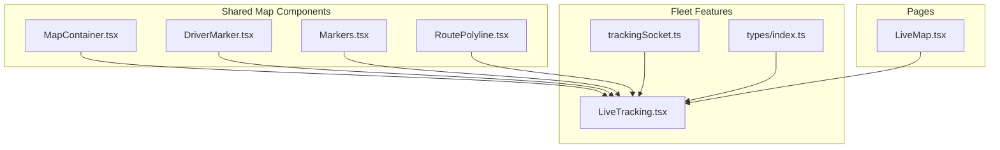
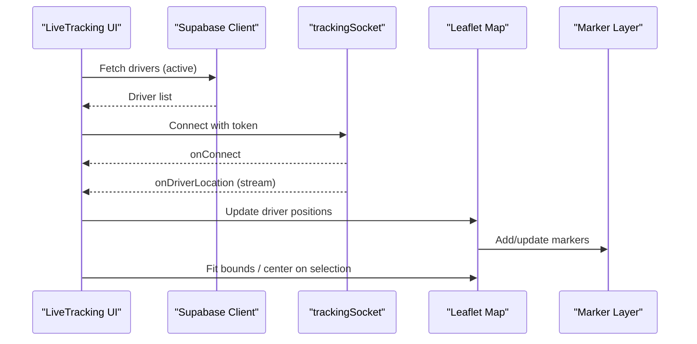
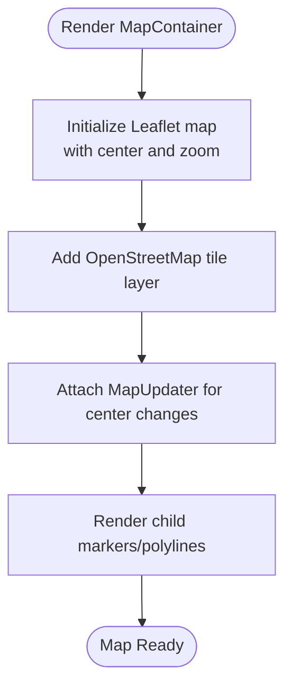
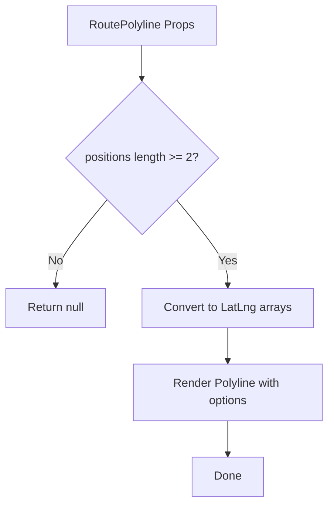
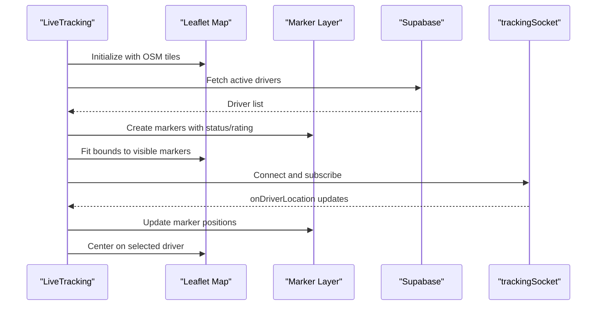
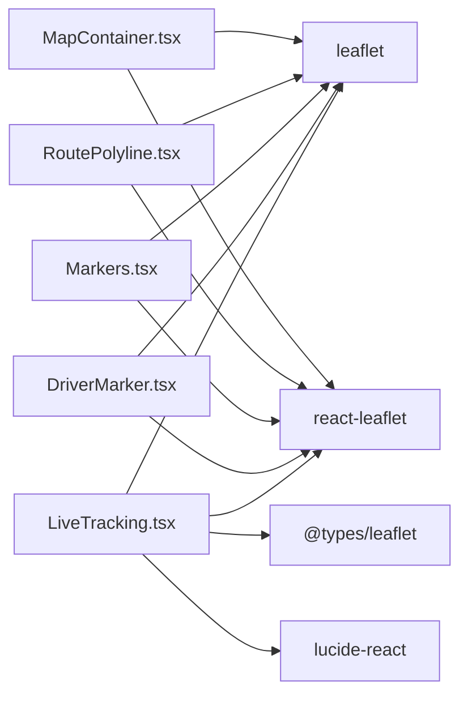

# Map Integration & Visualization

<cite>
**Referenced Files in This Document**
- [MapContainer.tsx](file://src/components/maps/MapContainer.tsx)
- [DriverMarker.tsx](file://src/components/maps/DriverMarker.tsx)
- [Markers.tsx](file://src/components/maps/Markers.tsx)
- [RoutePolyline.tsx](file://src/components/maps/RoutePolyline.tsx)
- [LiveTracking.tsx](file://src/fleet/pages/LiveTracking.tsx)
- [trackingSocket.ts](file://src/fleet/services/trackingSocket.ts)
- [index.ts](file://src/fleet/types/index.ts)
- [LiveMap.tsx](file://src/pages/LiveMap.tsx)
- [package.json](file://package.json)
</cite>

## Table of Contents
1. [Introduction](#introduction)
2. [Project Structure](#project-structure)
3. [Core Components](#core-components)
4. [Architecture Overview](#architecture-overview)
5. [Detailed Component Analysis](#detailed-component-analysis)
6. [Dependency Analysis](#dependency-analysis)
7. [Performance Considerations](#performance-considerations)
8. [Troubleshooting Guide](#troubleshooting-guide)
9. [Conclusion](#conclusion)

## Introduction
This document provides comprehensive technical documentation for the map integration and visualization system. It covers the Leaflet.js implementation, OpenStreetMap tile layer integration, custom marker rendering, driver marker styling, popup functionality, interactive map controls, initialization patterns, zoom controls, responsive design considerations, custom marker icons, driver status indicators (online/offline), rating visualization, layer management, route visualization, and performance optimization strategies for large datasets. It also includes practical examples of configuration, styling, and user interaction patterns such as click events and map centering.

## Project Structure
The map system is implemented across several components and pages:
- Shared map container and marker components under src/components/maps
- Fleet live tracking page under src/fleet/pages
- WebSocket tracking service under src/fleet/services
- Driver and location types under src/fleet/types
- Live map page routing under src/pages



**Diagram sources**
- [MapContainer.tsx](file://src/components/maps/MapContainer.tsx)
- [DriverMarker.tsx](file://src/components/maps/DriverMarker.tsx)
- [Markers.tsx](file://src/components/maps/Markers.tsx)
- [RoutePolyline.tsx](file://src/components/maps/RoutePolyline.tsx)
- [LiveTracking.tsx](file://src/fleet/pages/LiveTracking.tsx)
- [trackingSocket.ts](file://src/fleet/services/trackingSocket.ts)
- [index.ts](file://src/fleet/types/index.ts)
- [LiveMap.tsx](file://src/pages/LiveMap.tsx)

**Section sources**
- [MapContainer.tsx](file://src/components/maps/MapContainer.tsx)
- [LiveTracking.tsx](file://src/fleet/pages/LiveTracking.tsx)
- [trackingSocket.ts](file://src/fleet/services/trackingSocket.ts)
- [index.ts](file://src/fleet/types/index.ts)
- [LiveMap.tsx](file://src/pages/LiveMap.tsx)

## Core Components
- MapContainer: A robust wrapper around react-leaflet that fixes Leaflet icon issues, handles StrictMode compatibility, and provides controlled center updates.
- DriverMarker: Renders animated driver markers with direction-aware scooter icons, pulsing effect for movement, and contextual popups.
- Markers: Provides restaurant, customer, and generic location markers with distinct icons and popups.
- RoutePolyline: Draws route lines with optional speed-coded coloring and dashed styles.
- LiveTracking: Integrates Supabase data, WebSocket streaming, and Leaflet layers to visualize live driver positions with status and ratings.

**Section sources**
- [MapContainer.tsx](file://src/components/maps/MapContainer.tsx)
- [DriverMarker.tsx](file://src/components/maps/DriverMarker.tsx)
- [Markers.tsx](file://src/components/maps/Markers.tsx)
- [RoutePolyline.tsx](file://src/components/maps/RoutePolyline.tsx)
- [LiveTracking.tsx](file://src/fleet/pages/LiveTracking.tsx)

## Architecture Overview
The system combines React components with Leaflet for rendering and react-leaflet for React integration. Live data streams via WebSocket to update driver positions, which are rendered as custom markers with status and rating indicators.



**Diagram sources**
- [LiveTracking.tsx](file://src/fleet/pages/LiveTracking.tsx)
- [trackingSocket.ts](file://src/fleet/services/trackingSocket.ts)

## Detailed Component Analysis

### MapContainer Component
- Purpose: Encapsulates Leaflet map initialization, OpenStreetMap tile layer, and controlled center updates.
- Key features:
  - Fixes Leaflet default marker icon in Vite/Webpack environments.
  - Patches React 18 StrictMode double-effects to prevent "Map container is already initialized" errors.
  - Provides a MapUpdater component to programmatically re-center the map without remounting.
  - Configurable zoom, scroll wheel zoom, and responsive sizing.



**Diagram sources**
- [MapContainer.tsx](file://src/components/maps/MapContainer.tsx)

**Section sources**
- [MapContainer.tsx](file://src/components/maps/MapContainer.tsx)

### DriverMarker Component
- Purpose: Visualizes individual drivers with dynamic styling based on movement and heading.
- Key features:
  - Direction-aware scooter icon using rotation transforms.
  - Pulsing animation for moving drivers to indicate motion.
  - Popup with driver name, speed, and ETA.
  - SVG-based icon generation for consistent visuals.

```mermaid
classDiagram
class DriverMarker {
+position : {lat, lng}
+heading : number
+speed : number
+driverName : string
+eta : string
+render() DriverMarker
}
class Icons {
+createDriverIcon(heading) L.DivIcon
+createPulseIcon(heading) L.DivIcon
}
DriverMarker --> Icons : "uses"
```

**Diagram sources**
- [DriverMarker.tsx](file://src/components/maps/DriverMarker.tsx)

**Section sources**
- [DriverMarker.tsx](file://src/components/maps/DriverMarker.tsx)

### Markers Component (Location Markers)
- Purpose: Provides reusable marker components for restaurants, customers, and generic locations.
- Key features:
  - Uses react-dom/server to render styled React components into Leaflet divIcons.
  - Popups include title, address, and clickable phone links.
  - Color-coded badges for visual distinction.

```mermaid
classDiagram
class RestaurantMarker {
+position : {lat, lng}
+title : string
+address : string
+phone : string
+render() Marker
}
class CustomerMarker {
+position : {lat, lng}
+title : string
+address : string
+phone : string
+render() Marker
}
class GenericMarker {
+position : {lat, lng}
+title : string
+address : string
+phone : string
+color : string
+render() Marker
}
RestaurantMarker --> Markers : "exports"
CustomerMarker --> Markers : "exports"
GenericMarker --> Markers : "exports"
```

**Diagram sources**
- [Markers.tsx](file://src/components/maps/Markers.tsx)

**Section sources**
- [Markers.tsx](file://src/components/maps/Markers.tsx)

### RoutePolyline Component
- Purpose: Renders route lines between waypoints with optional speed-based coloring.
- Key features:
  - Standard polyline with configurable color, weight, opacity, and dashed style.
  - Speed-coded polyline segments color-coded by speed thresholds.



**Diagram sources**
- [RoutePolyline.tsx](file://src/components/maps/RoutePolyline.tsx)

**Section sources**
- [RoutePolyline.tsx](file://src/components/maps/RoutePolyline.tsx)

### LiveTracking Page Integration
- Purpose: Real-time fleet monitoring dashboard integrating data, sockets, and map rendering.
- Key features:
  - Initializes Leaflet map with OSM tiles and a dedicated marker layer.
  - Fetches active drivers from Supabase and renders custom markers with online status and ratings.
  - Subscribes to WebSocket updates to animate driver positions in real-time.
  - Implements search, filtering, and map centering on selection.
  - Displays stats overlay and selected driver details.



**Diagram sources**
- [LiveTracking.tsx](file://src/fleet/pages/LiveTracking.tsx)
- [trackingSocket.ts](file://src/fleet/services/trackingSocket.ts)

**Section sources**
- [LiveTracking.tsx](file://src/fleet/pages/LiveTracking.tsx)
- [trackingSocket.ts](file://src/fleet/services/trackingSocket.ts)
- [index.ts](file://src/fleet/types/index.ts)

### Driver Status and Rating Visualization
- Online/Offline: Status is indicated by marker color (green for online, gray for offline).
- Ratings: Popups display star-based ratings for quick visual assessment.
- Additional attributes: Total deliveries and current availability are shown in overlays.

**Section sources**
- [LiveTracking.tsx](file://src/fleet/pages/LiveTracking.tsx)

### Interactive Controls and User Interactions
- Click events: Clicking a driver in the list opens the marker popup and centers the map.
- Centering: Dedicated button to center the map on the selected driver.
- Stats overlays: Real-time counters for online and total drivers.
- Search/filtering: Text-based filtering of drivers with live map updates.

**Section sources**
- [LiveTracking.tsx](file://src/fleet/pages/LiveTracking.tsx)

### Map Initialization and Configuration
- Initialization: Leaflet map created with predefined center and zoom; OSM tile layer added.
- Configuration: Scroll wheel zoom disabled by default; responsive sizing via Tailwind classes.
- Layer management: Dedicated marker layer group for efficient updates and removal.

**Section sources**
- [LiveTracking.tsx](file://src/fleet/pages/LiveTracking.tsx)
- [MapContainer.tsx](file://src/components/maps/MapContainer.tsx)

### Zoom Controls and Responsive Design
- Zoom controls: Controlled via props; default zoom level set for optimal initial view.
- Responsive sizing: Container uses percentage-based dimensions and Tailwind utilities.
- Fit-to-bounds: Automatically adjusts zoom and center to fit visible markers.

**Section sources**
- [MapContainer.tsx](file://src/components/maps/MapContainer.tsx)
- [LiveTracking.tsx](file://src/fleet/pages/LiveTracking.tsx)

## Dependency Analysis
The map system relies on Leaflet and react-leaflet for rendering, with additional UI libraries for icons and styling.



**Diagram sources**
- [LiveTracking.tsx](file://src/fleet/pages/LiveTracking.tsx)
- [DriverMarker.tsx](file://src/components/maps/DriverMarker.tsx)
- [Markers.tsx](file://src/components/maps/Markers.tsx)
- [RoutePolyline.tsx](file://src/components/maps/RoutePolyline.tsx)
- [MapContainer.tsx](file://src/components/maps/MapContainer.tsx)
- [package.json](file://package.json)

**Section sources**
- [package.json](file://package.json)

## Performance Considerations
- Efficient marker updates: Using a dedicated layer group allows clearing and re-adding markers without full map recreation.
- Batch updates: Filtering and updating markers only when filtered driver lists change prevents unnecessary re-renders.
- Streaming data: WebSocket updates modify driver positions incrementally, avoiding full dataset reloads.
- Rendering optimization: Custom divIcons avoid heavy DOM overhead; SVG-based icons ensure crisp rendering at various scales.
- Large dataset strategies:
  - Implement clustering for dense areas to reduce DOM nodes and improve interactivity.
  - Use viewport-based filtering to limit visible markers.
  - Debounce frequent map interactions (pan/zoom) to batch updates.
  - Consider simplifying polylines or using canvas-based rendering for long routes.

[No sources needed since this section provides general guidance]

## Troubleshooting Guide
- Map container already initialized crash:
  - Cause: React 18 StrictMode double-invoking effects.
  - Solution: Use the provided StrictMode patches in the map container and ensure unique keys on mount.
- Missing marker icons:
  - Cause: Asset resolution in bundlers.
  - Solution: Import default icons and assign to Leaflet's default marker options.
- Map not centered or zoomed:
  - Verify center prop updates trigger MapUpdater.
  - Ensure scrollWheelZoom is configured appropriately.
- WebSocket disconnections:
  - Monitor connection state and implement retry logic with exponential backoff.
  - Validate token and server URL configuration.

**Section sources**
- [MapContainer.tsx](file://src/components/maps/MapContainer.tsx)
- [LiveTracking.tsx](file://src/fleet/pages/LiveTracking.tsx)
- [trackingSocket.ts](file://src/fleet/services/trackingSocket.ts)

## Conclusion
The map integration leverages Leaflet and react-leaflet to deliver a responsive, interactive, and performant visualization system. Custom markers, real-time updates via WebSocket, and structured layer management enable scalable fleet tracking. By following the documented patterns for initialization, styling, and user interactions, developers can extend the system with advanced features like clustering and canvas-based rendering for improved performance at scale.