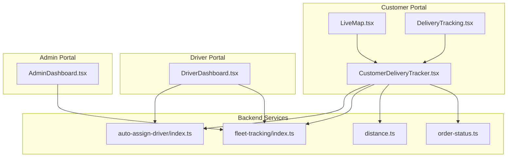
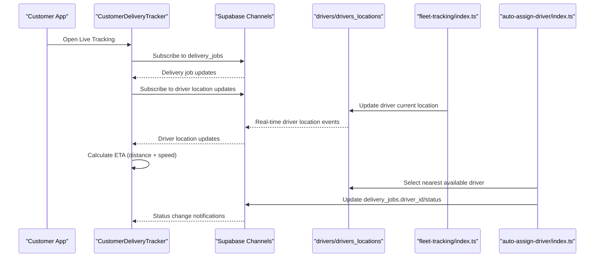
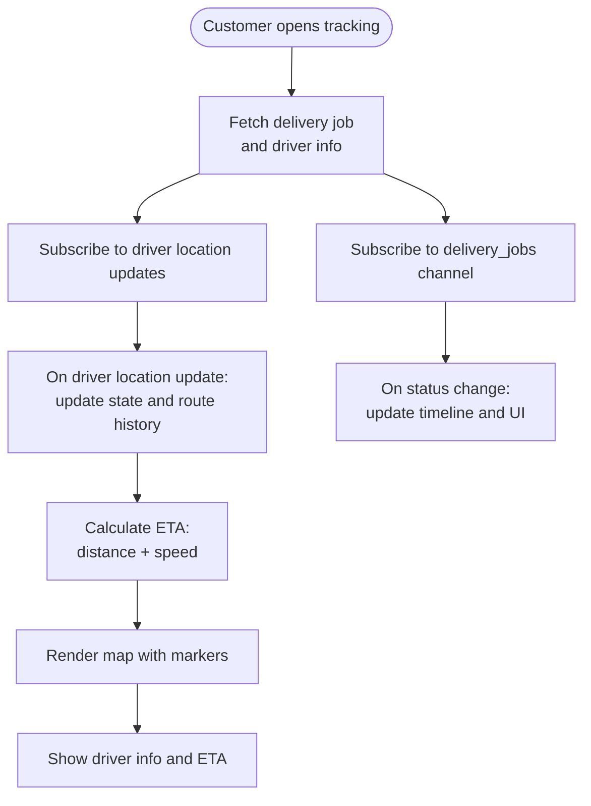
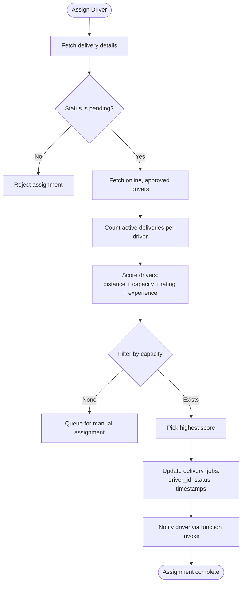
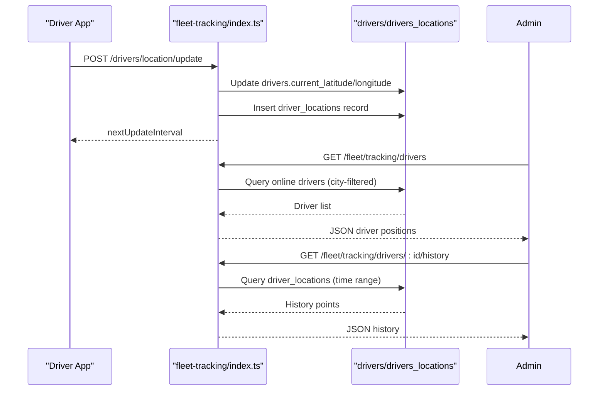
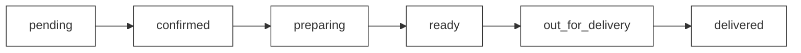
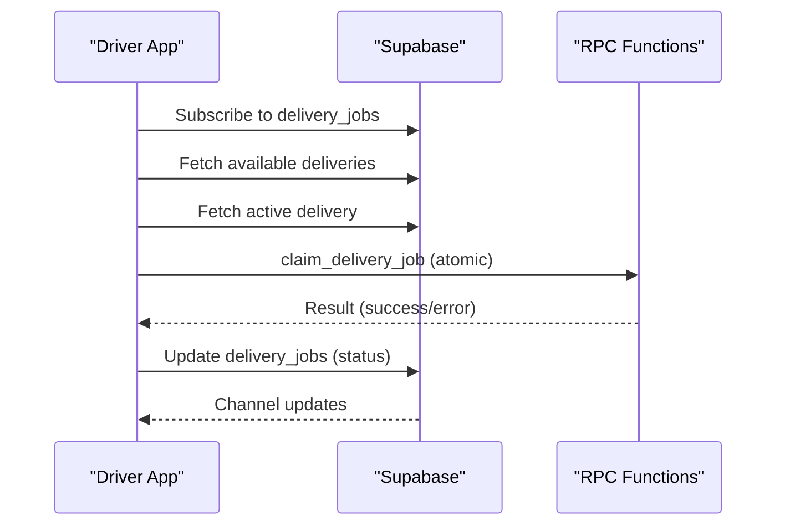
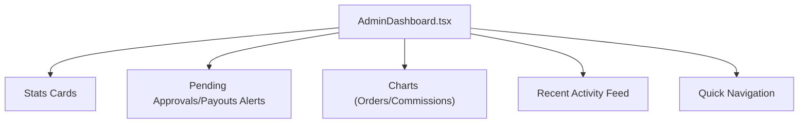
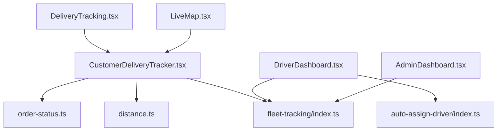

# Order Status & Delivery Monitoring

<cite>
**Referenced Files in This Document**
- [CustomerDeliveryTracker.tsx](file://src/components/customer/CustomerDeliveryTracker.tsx)
- [LiveMap.tsx](file://src/pages/LiveMap.tsx)
- [DeliveryTracking.tsx](file://src/pages/DeliveryTracking.tsx)
- [order-status.ts](file://src/lib/constants/order-status.ts)
- [distance.ts](file://src/lib/distance.ts)
- [auto-assign-driver/index.ts](file://supabase/functions/auto-assign-driver/index.ts)
- [fleet-tracking/index.ts](file://supabase/functions/fleet-tracking/index.ts)
- [DriverDashboard.tsx](file://src/pages/driver/DriverDashboard.tsx)
- [AdminDashboard.tsx](file://src/pages/admin/AdminDashboard.tsx)
- [delivery_system_design.md](file://delivery_system_design.md)
- [delivery_analysis.md](file://delivery_analysis.md)
- [Order-Workflow-Proposal.md](file://docs/Order-Workflow-Proposal.md)
</cite>

## Table of Contents
1. [Introduction](#introduction)
2. [Project Structure](#project-structure)
3. [Core Components](#core-components)
4. [Architecture Overview](#architecture-overview)
5. [Detailed Component Analysis](#detailed-component-analysis)
6. [Dependency Analysis](#dependency-analysis)
7. [Performance Considerations](#performance-considerations)
8. [Troubleshooting Guide](#troubleshooting-guide)
9. [Conclusion](#conclusion)
10. [Appendices](#appendices)

## Introduction
This document provides comprehensive documentation for the order status and delivery monitoring system within the live tracking platform. It explains the integration between driver tracking and order management, delivery status updates, and real-time order progress visualization. It also covers order-to-driver assignment tracking, delivery route monitoring, estimated arrival time calculations, order status indicators, delivery completion tracking, driver-order matching algorithms, data flow between tracking updates and order status changes, notification triggers for status updates, historical tracking data for order analysis, order timeline visualization, delivery efficiency metrics, and integration with the broader fleet management system.

## Project Structure
The delivery monitoring system spans frontend components, backend Supabase Edge Functions, and administrative dashboards. Key areas include:
- Customer-facing live tracking and order timeline visualization
- Driver assignment and real-time location updates
- Fleet management portal for driver monitoring and analytics
- Administrative dashboards for oversight and reporting

**Diagram sources**
- [CustomerDeliveryTracker.tsx:110-726](file://src/components/customer/CustomerDeliveryTracker.tsx#L110-L726)
- [LiveMap.tsx:1-20](file://src/pages/LiveMap.tsx#L1-L20)
- [DeliveryTracking.tsx:113-592](file://src/pages/DeliveryTracking.tsx#L113-L592)
- [DriverDashboard.tsx:1-494](file://src/pages/driver/DriverDashboard.tsx#L1-L494)
- [AdminDashboard.tsx:1-591](file://src/pages/admin/AdminDashboard.tsx#L1-L591)
- [auto-assign-driver/index.ts:131-287](file://supabase/functions/auto-assign-driver/index.ts#L131-L287)
- [fleet-tracking/index.ts:72-188](file://supabase/functions/fleet-tracking/index.ts#L72-L188)
- [distance.ts:112-158](file://src/lib/distance.ts#L112-L158)
- [order-status.ts:1-116](file://src/lib/constants/order-status.ts#L1-L116)

**Section sources**
- [CustomerDeliveryTracker.tsx:110-726](file://src/components/customer/CustomerDeliveryTracker.tsx#L110-L726)
- [LiveMap.tsx:1-20](file://src/pages/LiveMap.tsx#L1-L20)
- [DeliveryTracking.tsx:113-592](file://src/pages/DeliveryTracking.tsx#L113-L592)
- [DriverDashboard.tsx:1-494](file://src/pages/driver/DriverDashboard.tsx#L1-L494)
- [AdminDashboard.tsx:1-591](file://src/pages/admin/AdminDashboard.tsx#L1-L591)
- [auto-assign-driver/index.ts:131-287](file://supabase/functions/auto-assign-driver/index.ts#L131-L287)
- [fleet-tracking/index.ts:72-188](file://supabase/functions/fleet-tracking/index.ts#L72-L188)
- [distance.ts:112-158](file://src/lib/distance.ts#L112-L158)
- [order-status.ts:1-116](file://src/lib/constants/order-status.ts#L1-L116)

## Core Components
- CustomerDeliveryTracker: Real-time delivery tracking with driver location updates, ETA calculation, and live map visualization.
- LiveMap: Route-centric view for customer tracking.
- DeliveryTracking: Unified order list with tabs, status filtering, and real-time updates via Supabase channels.
- DriverDashboard: Driver-side interface for accepting, tracking, and completing deliveries.
- AdminDashboard: Administrative overview and analytics for delivery operations.
- Auto-Assignment Function: Algorithm for assigning drivers to delivery jobs based on proximity, capacity, and ratings.
- Fleet Tracking Function: Driver location ingestion, history retrieval, and fleet-level monitoring.
- Order Status Constants: Timeline progression and status configuration for UI rendering.
- Distance Utilities: Haversine distance calculation and ETA estimation.

**Section sources**
- [CustomerDeliveryTracker.tsx:110-726](file://src/components/customer/CustomerDeliveryTracker.tsx#L110-L726)
- [LiveMap.tsx:1-20](file://src/pages/LiveMap.tsx#L1-L20)
- [DeliveryTracking.tsx:113-592](file://src/pages/DeliveryTracking.tsx#L113-L592)
- [DriverDashboard.tsx:1-494](file://src/pages/driver/DriverDashboard.tsx#L1-L494)
- [AdminDashboard.tsx:1-591](file://src/pages/admin/AdminDashboard.tsx#L1-L591)
- [auto-assign-driver/index.ts:131-287](file://supabase/functions/auto-assign-driver/index.ts#L131-L287)
- [fleet-tracking/index.ts:72-188](file://supabase/functions/fleet-tracking/index.ts#L72-L188)
- [order-status.ts:1-116](file://src/lib/constants/order-status.ts#L1-L116)
- [distance.ts:112-158](file://src/lib/distance.ts#L112-L158)

## Architecture Overview
The system integrates Supabase real-time channels, Edge Functions, and client-side components to provide a seamless delivery monitoring experience. The flow includes:
- Driver location updates via the fleet tracking function stored in the drivers table and driver_locations history.
- Real-time subscriptions for delivery jobs and driver locations to keep the UI updated.
- Auto-assignment of drivers to delivery jobs based on scoring criteria.
- ETA calculations using distance utilities and driver-reported speeds.
- Administrative dashboards for monitoring and analytics.

**Diagram sources**
- [CustomerDeliveryTracker.tsx:124-207](file://src/components/customer/CustomerDeliveryTracker.tsx#L124-L207)
- [fleet-tracking/index.ts:72-188](file://supabase/functions/fleet-tracking/index.ts#L72-L188)
- [auto-assign-driver/index.ts:131-287](file://supabase/functions/auto-assign-driver/index.ts#L131-L287)

**Section sources**
- [CustomerDeliveryTracker.tsx:124-207](file://src/components/customer/CustomerDeliveryTracker.tsx#L124-L207)
- [fleet-tracking/index.ts:72-188](file://supabase/functions/fleet-tracking/index.ts#L72-L188)
- [auto-assign-driver/index.ts:131-287](file://supabase/functions/auto-assign-driver/index.ts#L131-L287)

## Detailed Component Analysis

### Customer Delivery Tracking
The customer-facing tracking component provides:
- Real-time driver location updates via Supabase channels
- ETA calculation using Haversine distance and driver speed
- Live map integration with driver, restaurant, and customer markers
- Progress timeline with normalized status steps
- Driver information and contact options

**Diagram sources**
- [CustomerDeliveryTracker.tsx:124-336](file://src/components/customer/CustomerDeliveryTracker.tsx#L124-L336)

**Section sources**
- [CustomerDeliveryTracker.tsx:110-726](file://src/components/customer/CustomerDeliveryTracker.tsx#L110-L726)
- [distance.ts:86-108](file://src/lib/distance.ts#L86-L108)

### Driver Assignment Algorithm
The auto-assignment function selects the best driver based on:
- Distance to pickup location (exponential decay scoring)
- Current workload (capacity constraints)
- Driver rating and experience
- Online and approved status

**Diagram sources**
- [auto-assign-driver/index.ts:131-287](file://supabase/functions/auto-assign-driver/index.ts#L131-L287)

**Section sources**
- [auto-assign-driver/index.ts:64-97](file://supabase/functions/auto-assign-driver/index.ts#L64-L97)
- [auto-assign-driver/index.ts:186-287](file://supabase/functions/auto-assign-driver/index.ts#L186-L287)

### Fleet Tracking and Historical Data
The fleet tracking function manages:
- Driver location updates with validation and adaptive intervals
- Retrieval of recent online drivers for fleet monitoring
- Historical location retrieval with time-range constraints and sampling
- City-based access control for fleet managers

**Diagram sources**
- [fleet-tracking/index.ts:72-188](file://supabase/functions/fleet-tracking/index.ts#L72-L188)
- [fleet-tracking/index.ts:190-371](file://supabase/functions/fleet-tracking/index.ts#L190-L371)

**Section sources**
- [fleet-tracking/index.ts:72-188](file://supabase/functions/fleet-tracking/index.ts#L72-L188)
- [fleet-tracking/index.ts:190-371](file://supabase/functions/fleet-tracking/index.ts#L190-L371)

### Order Status Indicators and Timeline
Order status progression and UI indicators are defined centrally:
- Unified status constants and timeline
- Customer-visible status labels and icons
- Status index mapping for timeline rendering
- Estimated time ranges per status

**Diagram sources**
- [order-status.ts:75-83](file://src/lib/constants/order-status.ts#L75-L83)

**Section sources**
- [order-status.ts:1-116](file://src/lib/constants/order-status.ts#L1-L116)
- [Order-Workflow-Proposal.md:65-102](file://docs/Order-Workflow-Proposal.md#L65-L102)

### Driver Dashboard and Delivery Lifecycle
The driver dashboard enables:
- Availability toggling and online status maintenance
- Fetching available deliveries and active delivery
- Claiming deliveries atomically via RPC
- Statistics for today and week delivery counts

**Diagram sources**
- [DriverDashboard.tsx:61-90](file://src/pages/driver/DriverDashboard.tsx#L61-L90)
- [DriverDashboard.tsx:303-352](file://src/pages/driver/DriverDashboard.tsx#L303-L352)

**Section sources**
- [DriverDashboard.tsx:1-494](file://src/pages/driver/DriverDashboard.tsx#L1-L494)

### Admin Dashboard and Analytics
The admin dashboard provides:
- Platform statistics and charts
- Pending approvals and payouts alerts
- Recent activity feed
- Navigation to key management areas

**Diagram sources**
- [AdminDashboard.tsx:67-591](file://src/pages/admin/AdminDashboard.tsx#L67-L591)

**Section sources**
- [AdminDashboard.tsx:1-591](file://src/pages/admin/AdminDashboard.tsx#L1-L591)

## Dependency Analysis
The system exhibits clear separation of concerns:
- Frontend components depend on Supabase client for real-time subscriptions and data fetching.
- Edge Functions encapsulate business logic for driver assignment and fleet tracking.
- Order status constants and utilities are shared across components for consistency.
- Driver and customer components subscribe to the same Supabase channels for synchronized updates.

**Diagram sources**
- [CustomerDeliveryTracker.tsx:110-726](file://src/components/customer/CustomerDeliveryTracker.tsx#L110-L726)
- [DriverDashboard.tsx:1-494](file://src/pages/driver/DriverDashboard.tsx#L1-L494)
- [AdminDashboard.tsx:1-591](file://src/pages/admin/AdminDashboard.tsx#L1-L591)
- [DeliveryTracking.tsx:113-592](file://src/pages/DeliveryTracking.tsx#L113-L592)
- [LiveMap.tsx:1-20](file://src/pages/LiveMap.tsx#L1-L20)
- [order-status.ts:1-116](file://src/lib/constants/order-status.ts#L1-L116)
- [distance.ts:112-158](file://src/lib/distance.ts#L112-L158)
- [fleet-tracking/index.ts:72-188](file://supabase/functions/fleet-tracking/index.ts#L72-L188)
- [auto-assign-driver/index.ts:131-287](file://supabase/functions/auto-assign-driver/index.ts#L131-L287)

**Section sources**
- [CustomerDeliveryTracker.tsx:110-726](file://src/components/customer/CustomerDeliveryTracker.tsx#L110-L726)
- [DriverDashboard.tsx:1-494](file://src/pages/driver/DriverDashboard.tsx#L1-L494)
- [AdminDashboard.tsx:1-591](file://src/pages/admin/AdminDashboard.tsx#L1-L591)
- [DeliveryTracking.tsx:113-592](file://src/pages/DeliveryTracking.tsx#L113-L592)
- [LiveMap.tsx:1-20](file://src/pages/LiveMap.tsx#L1-L20)
- [order-status.ts:1-116](file://src/lib/constants/order-status.ts#L1-L116)
- [distance.ts:112-158](file://src/lib/distance.ts#L112-L158)
- [fleet-tracking/index.ts:72-188](file://supabase/functions/fleet-tracking/index.ts#L72-L188)
- [auto-assign-driver/index.ts:131-287](file://supabase/functions/auto-assign-driver/index.ts#L131-L287)

## Performance Considerations
- Real-time updates: Use Supabase channels for efficient, low-latency updates instead of polling.
- Location sampling: Fleet tracking samples historical points and limits returned data to manage volume.
- ETA calculations: Use cached driver speed when available; fall back to defaults for estimation.
- Capacity constraints: Enforce driver capacity limits to prevent overloading and improve delivery reliability.
- Distance utilities: Prefer efficient distance calculations and cache results where appropriate.

[No sources needed since this section provides general guidance]

## Troubleshooting Guide
Common issues and resolutions:
- Driver location not updating: Verify driver token validation and location update endpoint; check driver status and online flag.
- No driver assigned: Confirm delivery status is pending, drivers are online and approved, and capacity constraints are met.
- ETA shows unexpected values: Ensure driver speed is reported; validate coordinate formats and units.
- Real-time UI not refreshing: Check Supabase channel subscriptions and network connectivity; verify event filters and table permissions.
- Admin dashboard missing data: Confirm city access controls and query parameters; validate time range constraints for history retrieval.

**Section sources**
- [fleet-tracking/index.ts:72-188](file://supabase/functions/fleet-tracking/index.ts#L72-L188)
- [auto-assign-driver/index.ts:131-287](file://supabase/functions/auto-assign-driver/index.ts#L131-L287)
- [CustomerDeliveryTracker.tsx:124-207](file://src/components/customer/CustomerDeliveryTracker.tsx#L124-L207)

## Conclusion
The order status and delivery monitoring system integrates real-time tracking, driver assignment, and fleet management to deliver a robust, scalable solution. By leveraging Supabase channels, Edge Functions, and centralized status definitions, the system ensures accurate, timely updates and a consistent customer experience. The modular architecture supports future enhancements such as predictive analytics, dynamic pricing, and expanded fleet capabilities.

[No sources needed since this section summarizes without analyzing specific files]

## Appendices

### Order Timeline Visualization
The customer timeline normalizes internal statuses to four visible steps: order placed, driver assigned, en route, and delivered. This simplifies user understanding while preserving internal state details.

**Section sources**
- [CustomerDeliveryTracker.tsx:289-312](file://src/components/customer/CustomerDeliveryTracker.tsx#L289-L312)
- [Order-Workflow-Proposal.md:65-102](file://docs/Order-Workflow-Proposal.md#L65-L102)

### Delivery Efficiency Metrics
- Average delivery time from restaurant ready to customer delivery
- Success rate of deliveries completed without issues
- Driver utilization and capacity adherence
- Customer satisfaction scores and on-time delivery percentages

**Section sources**
- [delivery_system_design.md:449-456](file://delivery_system_design.md#L449-L456)

### Notification Triggers
- Order creation and status transitions trigger customer notifications
- Driver assignment sends push notifications to drivers
- Real-time updates propagate via Supabase channels for immediate UI refresh

**Section sources**
- [Order-Workflow-Proposal.md:281-286](file://docs/Order-Workflow-Proposal.md#L281-L286)
- [auto-assign-driver/index.ts:99-128](file://supabase/functions/auto-assign-driver/index.ts#L99-L128)