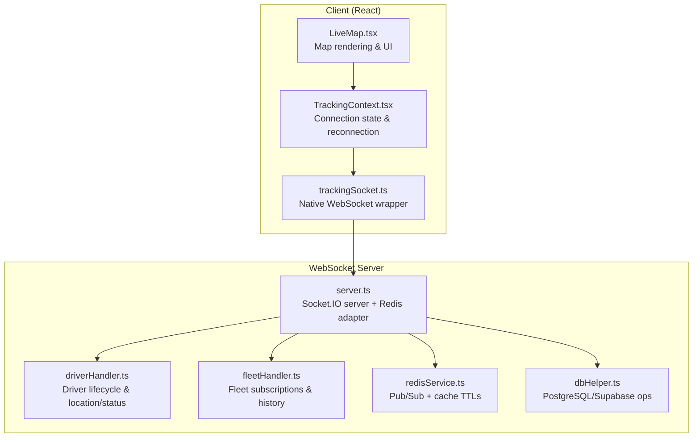
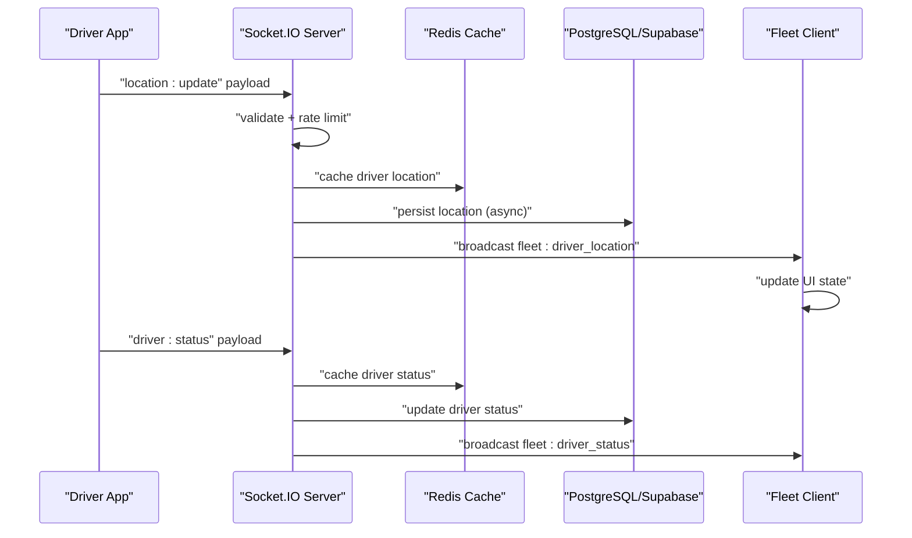
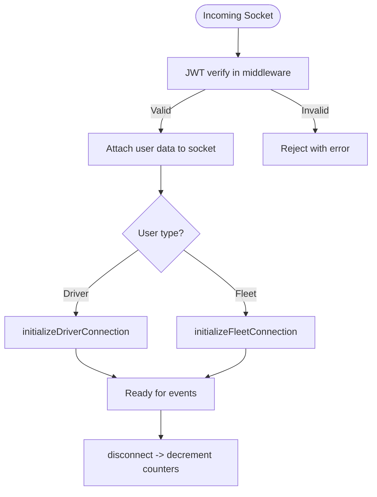
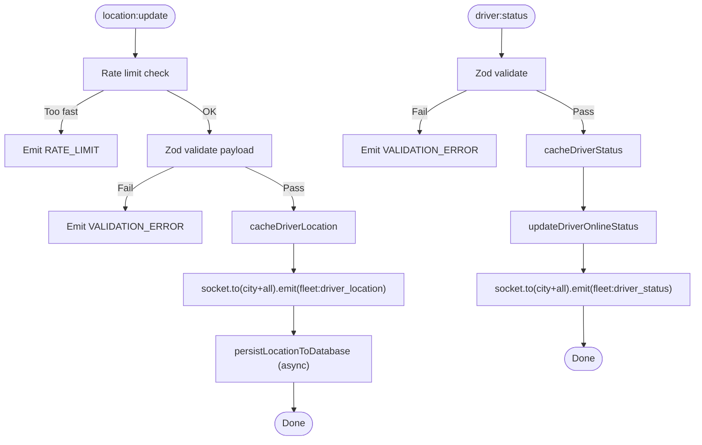
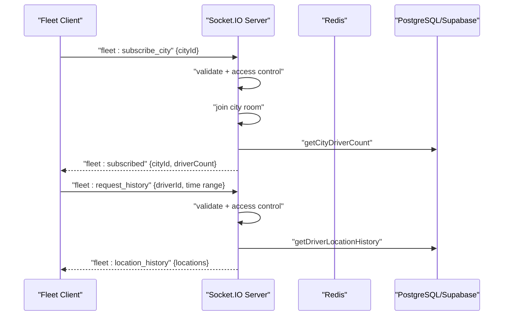
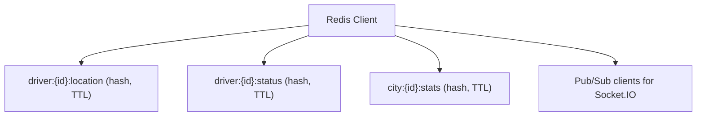
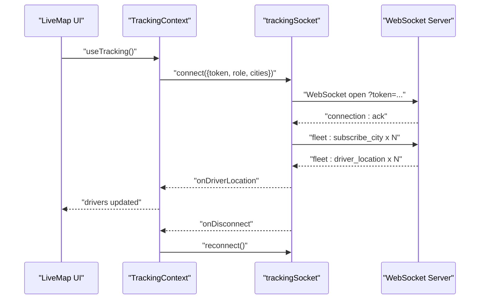
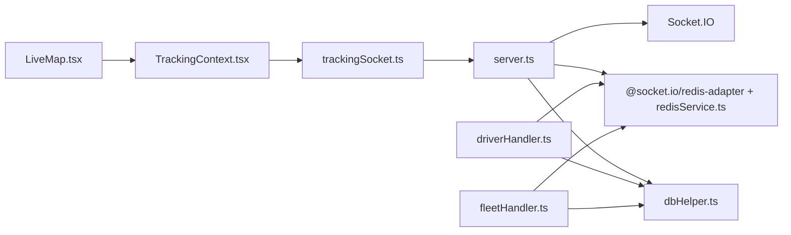

# Real-time Communication & Socket Handling

<cite>
**Referenced Files in This Document**
- [server.ts](file://websocket-server/src/server.ts)
- [events.ts](file://websocket-server/src/times/events.ts)
- [driverHandler.ts](file://websocket-server/src/handlers/driverHandler.ts)
- [fleetHandler.ts](file://websocket-server/src/handlers/fleetHandler.ts)
- [redisService.ts](file://websocket-server/src/services/redisService.ts)
- [dbHelper.ts](file://websocket-server/src/handlers/dbHelper.ts)
- [trackingSocket.ts](file://src/fleet/services/trackingSocket.ts)
- [TrackingContext.tsx](file://src/fleet/context/TrackingContext.tsx)
- [LiveMap.tsx](file://src/fleet/components/map/LiveMap.tsx)
</cite>

## Table of Contents
1. [Introduction](#introduction)
2. [Project Structure](#project-structure)
3. [Core Components](#core-components)
4. [Architecture Overview](#architecture-overview)
5. [Detailed Component Analysis](#detailed-component-analysis)
6. [Dependency Analysis](#dependency-analysis)
7. [Performance Considerations](#performance-considerations)
8. [Troubleshooting Guide](#troubleshooting-guide)
9. [Conclusion](#conclusion)

## Introduction
This document explains the real-time communication infrastructure that powers live driver tracking. It covers the WebSocket server implementation, connection management, message routing between drivers and fleet managers, authentication, event handling, error recovery, and client-side socket management with reconnection logic. It also addresses scalability, offline message queuing, and performance optimization for high-frequency location updates.

## Project Structure
The real-time system spans two primary areas:
- A dedicated WebSocket server (Node.js + Socket.IO + Redis adapter) that authenticates users, manages rooms, and broadcasts live updates.
- A React-based client that connects via a native WebSocket wrapper, subscribes to city channels, renders live driver positions, and handles reconnection.

**Diagram sources**
- [server.ts:1-256](file://websocket-server/src/server.ts#L1-L256)
- [driverHandler.ts:1-318](file://websocket-server/src/handlers/driverHandler.ts#L1-L318)
- [fleetHandler.ts:1-247](file://websocket-server/src/handlers/fleetHandler.ts#L1-L247)
- [redisService.ts:1-264](file://websocket-server/src/services/redisService.ts#L1-L264)
- [dbHelper.ts:1-204](file://websocket-server/src/handlers/dbHelper.ts#L1-L204)
- [trackingSocket.ts:1-287](file://src/fleet/services/trackingSocket.ts#L1-L287)
- [TrackingContext.tsx:1-152](file://src/fleet/context/TrackingContext.tsx#L1-L152)
- [LiveMap.tsx:1-271](file://src/fleet/components/map/LiveMap.tsx#L1-L271)

**Section sources**
- [server.ts:1-256](file://websocket-server/src/server.ts#L1-L256)
- [trackingSocket.ts:1-287](file://src/fleet/services/trackingSocket.ts#L1-L287)

## Core Components
- WebSocket Server (Socket.IO):
  - Authentication middleware validates JWT and attaches user metadata to sockets.
  - Room-based routing for city-scoped and global fleet channels.
  - Redis adapter for multi-instance scaling and pub/sub.
  - Health/readiness endpoints and graceful shutdown.
- Driver Handler:
  - Validates and rate-limits location updates.
  - Publishes driver location and status to fleet subscribers.
  - Persists updates to database asynchronously.
- Fleet Handler:
  - Manages city subscriptions and access control.
  - Provides historical location queries with validation and limits.
- Redis Service:
  - Caching for driver location/status with TTLs.
  - Pub/Sub clients for Socket.IO adapter.
  - City stats and online driver enumeration helpers.
- Database Helper:
  - Driver lookup, status updates, and location persistence with transactions.
  - Historical location retrieval and city driver counts.
- Client-side Tracking Service:
  - Native WebSocket wrapper with exponential backoff and message queue.
  - Event parsing and dispatch to React context.
- React Tracking Context:
  - Connection state, driver list, and reconnection triggers.
  - Periodic cleanup of stale drivers.

**Section sources**
- [server.ts:65-150](file://websocket-server/src/server.ts#L65-L150)
- [driverHandler.ts:48-100](file://websocket-server/src/handlers/driverHandler.ts#L48-L100)
- [fleetHandler.ts:36-82](file://websocket-server/src/handlers/fleetHandler.ts#L36-L82)
- [redisService.ts:87-160](file://websocket-server/src/services/redisService.ts#L87-L160)
- [dbHelper.ts:34-125](file://websocket-server/src/handlers/dbHelper.ts#L34-L125)
- [trackingSocket.ts:34-95](file://src/fleet/services/trackingSocket.ts#L34-L95)
- [TrackingContext.tsx:24-83](file://src/fleet/context/TrackingContext.tsx#L24-L83)

## Architecture Overview
The system uses a publish/subscribe model:
- Drivers publish location/status updates to the server.
- The server caches and persists data, then broadcasts to subscribed fleet clients in the same city and globally for super admins.
- Fleet clients subscribe to city channels and optionally request historical data.

**Diagram sources**
- [driverHandler.ts:105-207](file://websocket-server/src/handlers/driverHandler.ts#L105-L207)
- [redisService.ts:87-96](file://websocket-server/src/services/redisService.ts#L87-L96)
- [dbHelper.ts:83-125](file://websocket-server/src/handlers/dbHelper.ts#L83-L125)
- [fleetHandler.ts:67-82](file://websocket-server/src/handlers/fleetHandler.ts#L67-L82)

## Detailed Component Analysis

### WebSocket Server
- Authentication:
  - Validates JWT from handshake auth and attaches user data (type, role, IDs, assigned cities).
  - Rejects missing/expired/invalid tokens with explicit errors.
- Connection management:
  - Enforces maximum connections and emits capacity errors.
  - Tracks driver/fleet counts and logs connection/disconnect events.
- Transport and compression:
  - Supports WebSocket and polling with compression threshold and max message size.
- Health endpoints:
  - /health returns connection counts and environment.
  - /ready probes Redis readiness.

**Diagram sources**
- [server.ts:65-150](file://websocket-server/src/server.ts#L65-L150)

**Section sources**
- [server.ts:65-150](file://websocket-server/src/server.ts#L65-L150)
- [server.ts:162-192](file://websocket-server/src/server.ts#L162-L192)

### Driver Handler
- Location updates:
  - Rate limiting prevents excessive updates.
  - Zod validation ensures payload integrity.
  - Caches latest location and broadcasts to city and global fleet rooms.
  - Asynchronously persists to database.
- Status updates:
  - Updates Redis status and DB, then notifies fleet subscribers.
- Disconnect handling:
  - Marks driver offline in cache and DB.

**Diagram sources**
- [driverHandler.ts:105-207](file://websocket-server/src/handlers/driverHandler.ts#L105-L207)
- [driverHandler.ts:212-275](file://websocket-server/src/handlers/driverHandler.ts#L212-L275)

**Section sources**
- [driverHandler.ts:24-44](file://websocket-server/src/handlers/driverHandler.ts#L24-L44)
- [driverHandler.ts:105-207](file://websocket-server/src/handlers/driverHandler.ts#L105-L207)
- [driverHandler.ts:212-275](file://websocket-server/src/handlers/driverHandler.ts#L212-L275)

### Fleet Handler
- City subscription:
  - Validates payload and access (role or assigned cities).
  - Joins city room and returns driver count.
- Location history:
  - Validates request and access, then queries DB and returns paginated points.
- Initial stats:
  - Sends city stats for subscribed cities.

**Diagram sources**
- [fleetHandler.ts:87-140](file://websocket-server/src/handlers/fleetHandler.ts#L87-L140)
- [fleetHandler.ts:145-212](file://websocket-server/src/handlers/fleetHandler.ts#L145-L212)

**Section sources**
- [fleetHandler.ts:19-29](file://websocket-server/src/handlers/fleetHandler.ts#L19-L29)
- [fleetHandler.ts:87-140](file://websocket-server/src/handlers/fleetHandler.ts#L87-L140)
- [fleetHandler.ts:145-212](file://websocket-server/src/handlers/fleetHandler.ts#L145-L212)

### Redis Service
- Clients:
  - Single Redis client for commands, separate pub/sub clients for Socket.IO adapter.
- Caching:
  - Driver location/status hashed structs with TTLs.
- Helpers:
  - Online drivers enumeration and city stats aggregation.

**Diagram sources**
- [redisService.ts:87-160](file://websocket-server/src/services/redisService.ts#L87-L160)
- [redisService.ts:63-82](file://websocket-server/src/services/redisService.ts#L63-L82)

**Section sources**
- [redisService.ts:14-18](file://websocket-server/src/services/redisService.ts#L14-L18)
- [redisService.ts:87-160](file://websocket-server/src/services/redisService.ts#L87-L160)

### Database Helper
- Operations:
  - Driver lookup, status updates, transactional location persistence.
  - Historical location retrieval and city driver counts.

**Section sources**
- [dbHelper.ts:34-125](file://websocket-server/src/handlers/dbHelper.ts#L34-L125)
- [dbHelper.ts:130-163](file://websocket-server/src/handlers/dbHelper.ts#L130-L163)

### Client-side Socket Management
- Native WebSocket wrapper:
  - Connects with token query param, sets up handlers, and subscribes to cities.
  - Implements exponential backoff reconnection and message queueing.
  - Parses server messages and invokes callbacks for driver location, status, and stats.
- React context:
  - Maintains connection state, driver list, and online count.
  - Triggers periodic cleanup of stale drivers and supports manual reconnect.

**Diagram sources**
- [trackingSocket.ts:34-95](file://src/fleet/services/trackingSocket.ts#L34-L95)
- [TrackingContext.tsx:62-83](file://src/fleet/context/TrackingContext.tsx#L62-L83)
- [LiveMap.tsx:32-160](file://src/fleet/components/map/LiveMap.tsx#L32-L160)

**Section sources**
- [trackingSocket.ts:34-95](file://src/fleet/services/trackingSocket.ts#L34-L95)
- [trackingSocket.ts:162-178](file://src/fleet/services/trackingSocket.ts#L162-L178)
- [TrackingContext.tsx:24-129](file://src/fleet/context/TrackingContext.tsx#L24-L129)
- [LiveMap.tsx:32-160](file://src/fleet/components/map/LiveMap.tsx#L32-L160)

## Dependency Analysis
- Server depends on:
  - Socket.IO for transport and rooms.
  - Redis adapter for clustering and pub/sub.
  - PostgreSQL/Supabase for durable storage.
- Handlers depend on:
  - Redis service for caching and presence.
  - Database helper for authoritative data.
- Client depends on:
  - Native WebSocket for transport.
  - React context for state and lifecycle.

**Diagram sources**
- [server.ts:38-55](file://websocket-server/src/server.ts#L38-L55)
- [driverHandler.ts:16-21](file://websocket-server/src/handlers/driverHandler.ts#L16-L21)
- [fleetHandler.ts:14-17](file://websocket-server/src/handlers/fleetHandler.ts#L14-L17)
- [redisService.ts:5-8](file://websocket-server/src/services/redisService.ts#L5-L8)
- [dbHelper.ts:6-8](file://websocket-server/src/handlers/dbHelper.ts#L6-L8)
- [trackingSocket.ts:6](file://src/fleet/services/trackingSocket.ts#L6)

**Section sources**
- [server.ts:38-55](file://websocket-server/src/server.ts#L38-L55)
- [driverHandler.ts:16-21](file://websocket-server/src/handlers/driverHandler.ts#L16-L21)
- [fleetHandler.ts:14-17](file://websocket-server/src/handlers/fleetHandler.ts#L14-L17)
- [redisService.ts:5-8](file://websocket-server/src/services/redisService.ts#L5-L8)
- [dbHelper.ts:6-8](file://websocket-server/src/handlers/dbHelper.ts#L6-L8)
- [trackingSocket.ts:6](file://src/fleet/services/trackingSocket.ts#L6)

## Performance Considerations
- Compression and buffer sizing:
  - perMessageDeflate threshold and maxHttpBufferSize reduce bandwidth and memory pressure.
- Rate limiting:
  - Driver location updates are rate-limited to prevent overload.
- Async persistence:
  - Database writes are fire-and-forget after cache/broadcast to minimize latency.
- Redis TTLs:
  - Location/status entries expire automatically, controlling memory growth.
- Scaling:
  - Redis adapter enables horizontal scaling across multiple server instances.
- Client-side batching:
  - React updates are batched via context; consider throttling frequent renders if needed.

[No sources needed since this section provides general guidance]

## Troubleshooting Guide
- Authentication failures:
  - Check JWT secret and token validity; server emits explicit errors for missing/expired/invalid tokens.
- Capacity exceeded:
  - Server rejects new connections when max capacity is reached; adjust WS_MAX_CONNECTIONS accordingly.
- Redis connectivity:
  - Use /ready endpoint to verify Redis health; monitor reconnect logs.
- Client reconnection:
  - Exponential backoff is automatic; inspect reconnect attempts and delays in the client service.
- Message parsing errors:
  - Client logs parse failures; ensure server and client event names match.
- Offline scenarios:
  - Client queues messages until connected; verify queue flushing on open.

**Section sources**
- [server.ts:29-32](file://websocket-server/src/server.ts#L29-L32)
- [server.ts:109-117](file://websocket-server/src/server.ts#L109-L117)
- [server.ts:177-187](file://websocket-server/src/server.ts#L177-L187)
- [trackingSocket.ts:162-178](file://src/fleet/services/trackingSocket.ts#L162-L178)
- [trackingSocket.ts:87-94](file://src/fleet/services/trackingSocket.ts#L87-L94)

## Conclusion
The real-time tracking system combines a scalable Socket.IO server with Redis pub/sub and PostgreSQL persistence, delivering low-latency driver location and status updates to fleet clients. The client-side wrapper provides robust reconnection and message queuing, while the React context centralizes state and UI updates. Together, these components form a resilient, high-performance infrastructure suitable for live fleet visibility.