# Notification System

<cite>
**Referenced Files in This Document**
- [notifications.ts](file://src/lib/notifications.ts)
- [NotificationPreferences.tsx](file://src/components/NotificationPreferences.tsx)
- [useDeliveryNotifications.ts](file://src/hooks/useDeliveryNotifications.ts)
- [useDeliveredMealNotifications.ts](file://src/hooks/useDeliveredMealNotifications.ts)
- [Notifications.tsx](file://src/pages/Notifications.tsx)
- [DeliveredMealNotifications.tsx](file://src/components/DeliveredMealNotifications.tsx)
- [useScheduledMealNotifications.tsx](file://src/hooks/useScheduledMealNotifications.tsx)
- [send-push-notification/index.ts](file://supabase/functions/send-push-notification/index.ts)
- [capacitor.ts](file://src/lib/capacitor.ts)
- [build.gradle](file://android/app/build.gradle)
- [Package.swift](file://ios/App/CapApp-SPM/Package.swift)
</cite>

## Table of Contents
1. [Introduction](#introduction)
2. [Project Structure](#project-structure)
3. [Core Components](#core-components)
4. [Architecture Overview](#architecture-overview)
5. [Detailed Component Analysis](#detailed-component-analysis)
6. [Dependency Analysis](#dependency-analysis)
7. [Performance Considerations](#performance-considerations)
8. [Troubleshooting Guide](#troubleshooting-guide)
9. [Conclusion](#conclusion)

## Introduction
This document provides comprehensive documentation for the notification system, covering push notifications, in-app alerts, and real-time order status updates. It explains notification trigger mechanisms using Supabase edge functions and real-time data synchronization, details the notification preferences system enabling users to customize channels and frequencies, and documents delivery notifications including order confirmation, preparation updates, and delivery completion alerts. It also covers integration with Firebase Cloud Messaging (FCM) for push notifications and local notification handling for web browsers, along with notification queue management, retry mechanisms, and error handling strategies. Finally, it includes examples for implementing new notification types and customizing content based on user preferences and order status.

## Project Structure
The notification system spans frontend React components, Supabase edge functions, and native mobile integrations:
- Frontend libraries and hooks manage notification creation, preferences, real-time updates, and UI rendering.
- Supabase edge functions handle push notification delivery via FCM.
- Capacitor plugins enable native push and local notification capabilities on mobile platforms.

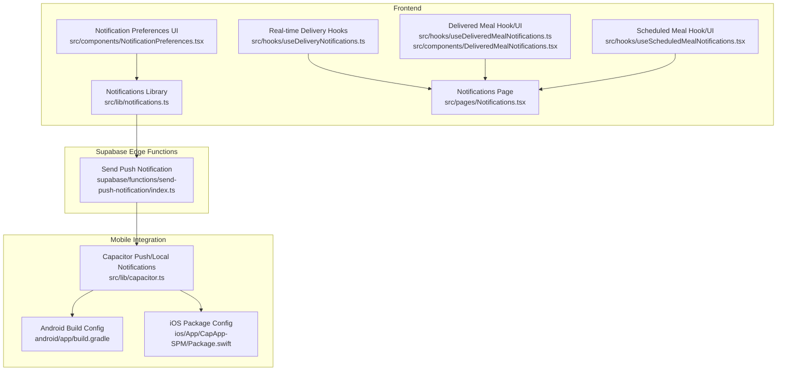

**Diagram sources**
- [notifications.ts:1-114](file://src/lib/notifications.ts#L1-L114)
- [NotificationPreferences.tsx:1-198](file://src/components/NotificationPreferences.tsx#L1-L198)
- [useDeliveryNotifications.ts:1-139](file://src/hooks/useDeliveryNotifications.ts#L1-L139)
- [useDeliveredMealNotifications.ts:1-166](file://src/hooks/useDeliveredMealNotifications.ts#L1-L166)
- [DeliveredMealNotifications.tsx:1-95](file://src/components/DeliveredMealNotifications.tsx#L1-L95)
- [useScheduledMealNotifications.tsx:1-177](file://src/hooks/useScheduledMealNotifications.tsx#L1-L177)
- [Notifications.tsx:1-254](file://src/pages/Notifications.tsx#L1-L254)
- [send-push-notification/index.ts:1-300](file://supabase/functions/send-push-notification/index.ts#L1-L300)
- [capacitor.ts:393-447](file://src/lib/capacitor.ts#L393-L447)
- [build.gradle:62-74](file://android/app/build.gradle#L62-L74)
- [Package.swift:43-51](file://ios/App/CapApp-SPM/Package.swift#L43-L51)

**Section sources**
- [notifications.ts:1-114](file://src/lib/notifications.ts#L1-L114)
- [NotificationPreferences.tsx:1-198](file://src/components/NotificationPreferences.tsx#L1-L198)
- [useDeliveryNotifications.ts:1-139](file://src/hooks/useDeliveryNotifications.ts#L1-L139)
- [useDeliveredMealNotifications.ts:1-166](file://src/hooks/useDeliveredMealNotifications.ts#L1-L166)
- [DeliveredMealNotifications.tsx:1-95](file://src/components/DeliveredMealNotifications.tsx#L1-L95)
- [useScheduledMealNotifications.tsx:1-177](file://src/hooks/useScheduledMealNotifications.tsx#L1-L177)
- [Notifications.tsx:1-254](file://src/pages/Notifications.tsx#L1-L254)
- [send-push-notification/index.ts:1-300](file://supabase/functions/send-push-notification/index.ts#L1-L300)
- [capacitor.ts:393-447](file://src/lib/capacitor.ts#L393-L447)
- [build.gradle:62-74](file://android/app/build.gradle#L62-L74)
- [Package.swift:43-51](file://ios/App/CapApp-SPM/Package.swift#L43-L51)

## Core Components
- Notification library: Provides typed notification creation and helper functions for order/delivery events.
- Notification preferences: Manages user preferences for channels (push/email/WhatsApp) and categories.
- Real-time delivery notifications: Subscribes to Supabase realtime for delivery job updates and displays browser notifications.
- Delivered meal notifications: Retrieves unread "order_delivered" notifications and allows adding meals to progress.
- Scheduled meal notifications: Displays upcoming scheduled meals and supports dismissal/view actions.
- Notifications page: Central hub for viewing, marking as read, and deleting notifications.
- Push notification edge function: Sends FCM push notifications and manages token deactivation on failures.
- Mobile/local notifications: Capacitor integration for native push and local notifications.

**Section sources**
- [notifications.ts:1-114](file://src/lib/notifications.ts#L1-L114)
- [NotificationPreferences.tsx:1-198](file://src/components/NotificationPreferences.tsx#L1-L198)
- [useDeliveryNotifications.ts:1-139](file://src/hooks/useDeliveryNotifications.ts#L1-L139)
- [useDeliveredMealNotifications.ts:1-166](file://src/hooks/useDeliveredMealNotifications.ts#L1-L166)
- [DeliveredMealNotifications.tsx:1-95](file://src/components/DeliveredMealNotifications.tsx#L1-L95)
- [useScheduledMealNotifications.tsx:1-177](file://src/hooks/useScheduledMealNotifications.tsx#L1-L177)
- [Notifications.tsx:1-254](file://src/pages/Notifications.tsx#L1-L254)
- [send-push-notification/index.ts:1-300](file://supabase/functions/send-push-notification/index.ts#L1-L300)
- [capacitor.ts:393-447](file://src/lib/capacitor.ts#L393-L447)

## Architecture Overview
The notification system integrates multiple layers:
- Triggering: Frontend helpers insert notifications into the database; Supabase edge functions send push notifications via FCM.
- Real-time: Supabase realtime channels broadcast updates to subscribed clients.
- Storage: Notifications are persisted in the database with status and metadata.
- Presentation: Users view notifications in-app, receive browser notifications for delivery updates, and get push notifications on mobile devices.

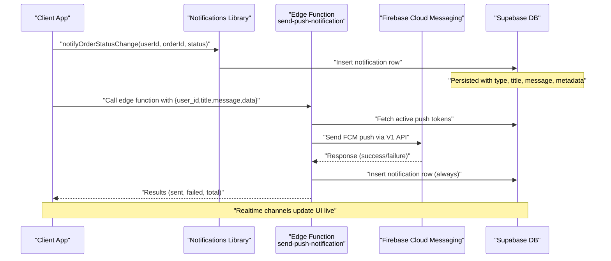

**Diagram sources**
- [notifications.ts:38-81](file://src/lib/notifications.ts#L38-L81)
- [send-push-notification/index.ts:178-299](file://supabase/functions/send-push-notification/index.ts#L178-L299)

**Section sources**
- [notifications.ts:1-114](file://src/lib/notifications.ts#L1-L114)
- [send-push-notification/index.ts:1-300](file://supabase/functions/send-push-notification/index.ts#L1-L300)

## Detailed Component Analysis

### Notification Library
Implements typed notification creation and helper functions for common scenarios:
- Notification types: order_update, driver_assigned, order_picked_up, order_delivered, delivery_claimed.
- Helper functions:
  - notifyOrderStatusChange: Generates localized messages for order lifecycle stages.
  - notifyDriverAssigned: Creates driver assignment notifications.
  - notifyNewDelivery: Creates driver availability notifications.

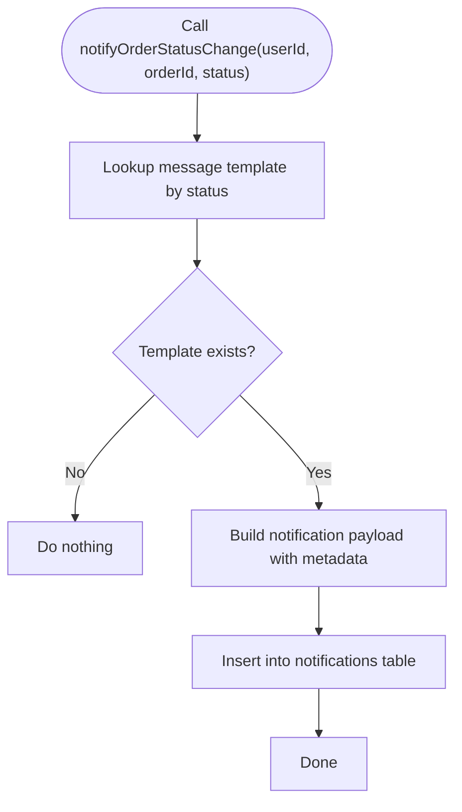

**Diagram sources**
- [notifications.ts:38-81](file://src/lib/notifications.ts#L38-L81)

**Section sources**
- [notifications.ts:1-114](file://src/lib/notifications.ts#L1-L114)

### Notification Preferences System
Allows users to customize notification channels and frequencies:
- Stores preferences in user profiles under notification_preferences.
- Supports toggles for order_updates (push/email/WhatsApp), delivery_updates (push/email/WhatsApp), promotions (email), and reminders (push).
- Persists updates to Supabase and reverts on failure.

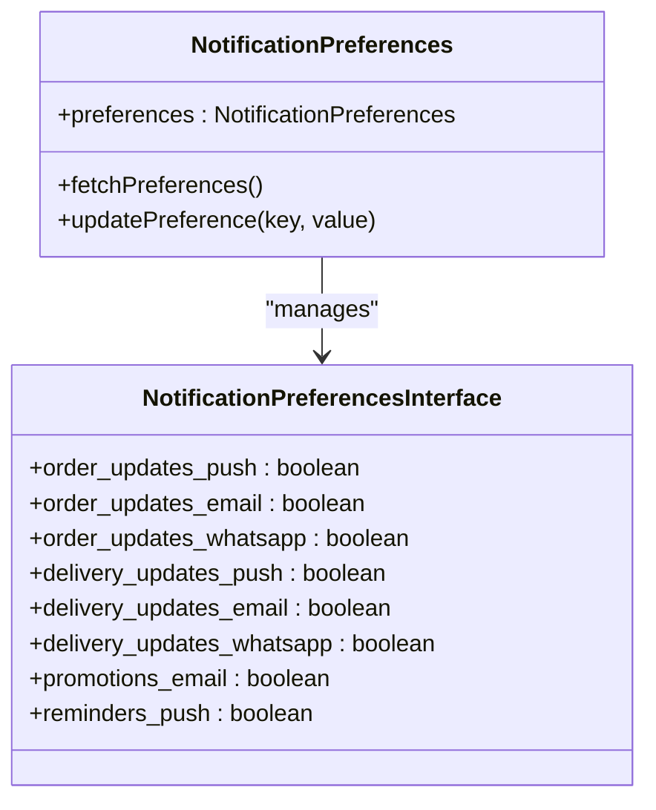

**Diagram sources**
- [NotificationPreferences.tsx:17-37](file://src/components/NotificationPreferences.tsx#L17-L37)
- [NotificationPreferences.tsx:68-83](file://src/components/NotificationPreferences.tsx#L68-L83)

**Section sources**
- [NotificationPreferences.tsx:1-198](file://src/components/NotificationPreferences.tsx#L1-L198)

### Real-time Delivery Notifications (Browser)
Subscribes to Supabase realtime for delivery job updates and displays browser notifications:
- Listens for updates on delivery_jobs table for the current user.
- Filters by schedule ownership to ensure relevance.
- Emits toast notifications and browser Web Notifications for status changes.

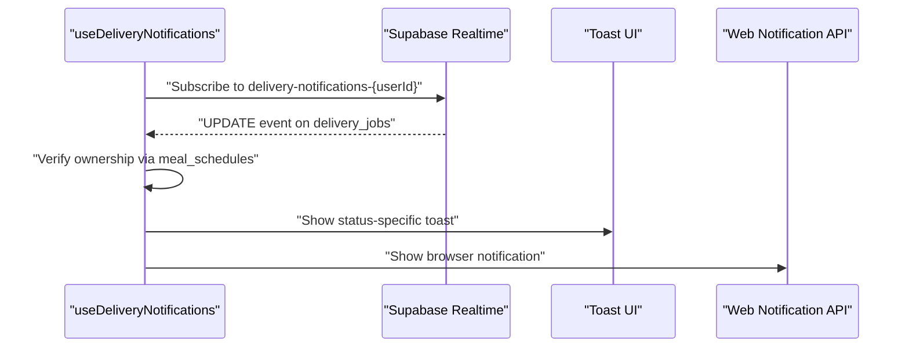

**Diagram sources**
- [useDeliveryNotifications.ts:31-135](file://src/hooks/useDeliveryNotifications.ts#L31-L135)

**Section sources**
- [useDeliveryNotifications.ts:1-139](file://src/hooks/useDeliveryNotifications.ts#L1-L139)

### Delivered Meal Notifications
Handles "order_delivered" notifications with actionable UI:
- Fetches unread notifications with specific metadata indicating progress integration.
- Allows adding meals to progress via RPC and marks notifications as read.
- Provides dismissal and refresh capabilities.

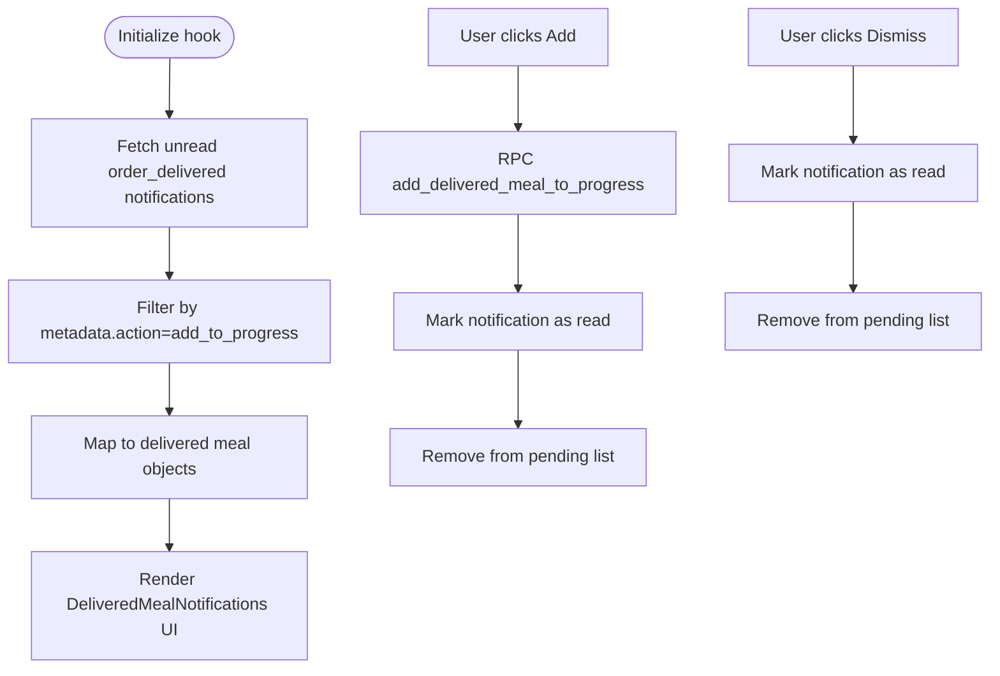

**Diagram sources**
- [useDeliveredMealNotifications.ts:40-164](file://src/hooks/useDeliveredMealNotifications.ts#L40-L164)
- [DeliveredMealNotifications.tsx:8-95](file://src/components/DeliveredMealNotifications.tsx#L8-L95)

**Section sources**
- [useDeliveredMealNotifications.ts:1-166](file://src/hooks/useDeliveredMealNotifications.ts#L1-L166)
- [DeliveredMealNotifications.tsx:1-95](file://src/components/DeliveredMealNotifications.tsx#L1-L95)

### Scheduled Meal Notifications
Displays upcoming scheduled meals and supports user actions:
- Fetches recent unread "meal_scheduled" notifications.
- Renders actionable cards with view and dismiss actions.
- Subscribes to realtime for new scheduled meal notifications.

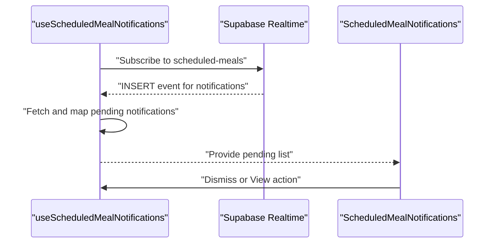

**Diagram sources**
- [useScheduledMealNotifications.tsx:95-127](file://src/hooks/useScheduledMealNotifications.tsx#L95-L127)
- [useScheduledMealNotifications.tsx:129-177](file://src/hooks/useScheduledMealNotifications.tsx#L129-L177)

**Section sources**
- [useScheduledMealNotifications.tsx:1-177](file://src/hooks/useScheduledMealNotifications.tsx#L1-L177)

### Notifications Page
Central hub for managing notifications:
- Lists all user notifications with filtering by type.
- Supports marking as read, bulk mark all as read, and deletion.
- Subscribes to realtime for live updates.

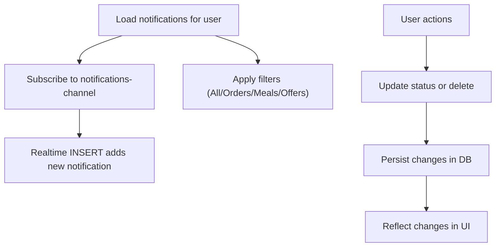

**Diagram sources**
- [Notifications.tsx:67-97](file://src/pages/Notifications.tsx#L67-L97)
- [Notifications.tsx:99-135](file://src/pages/Notifications.tsx#L99-L135)

**Section sources**
- [Notifications.tsx:1-254](file://src/pages/Notifications.tsx#L1-L254)

### Push Notification Edge Function (FCM)
Sends push notifications via Firebase Cloud Messaging:
- Validates payload and fetches active push tokens for the user.
- Exchanges a service account JWT for a Google OAuth2 access token.
- Sends FCM messages to all active tokens concurrently.
- Deactivates tokens that return UNREGISTERED or NOT_FOUND errors.
- Always inserts a notification record into the database.

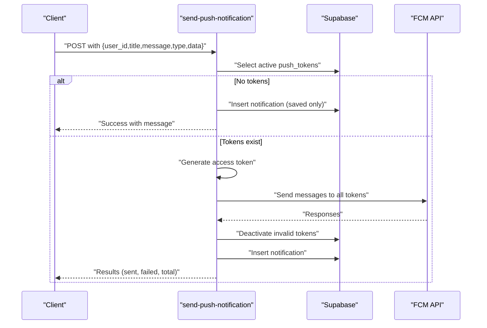

**Diagram sources**
- [send-push-notification/index.ts:178-299](file://supabase/functions/send-push-notification/index.ts#L178-L299)

**Section sources**
- [send-push-notification/index.ts:1-300](file://supabase/functions/send-push-notification/index.ts#L1-L300)

### Mobile and Local Notifications (Capacitor)
Enables native push and local notifications:
- Capacitor integration exposes registration, action handling, scheduling, and cancellation APIs.
- Android build applies google-services plugin for FCM support.
- iOS package configuration includes CapacitorPushNotifications.

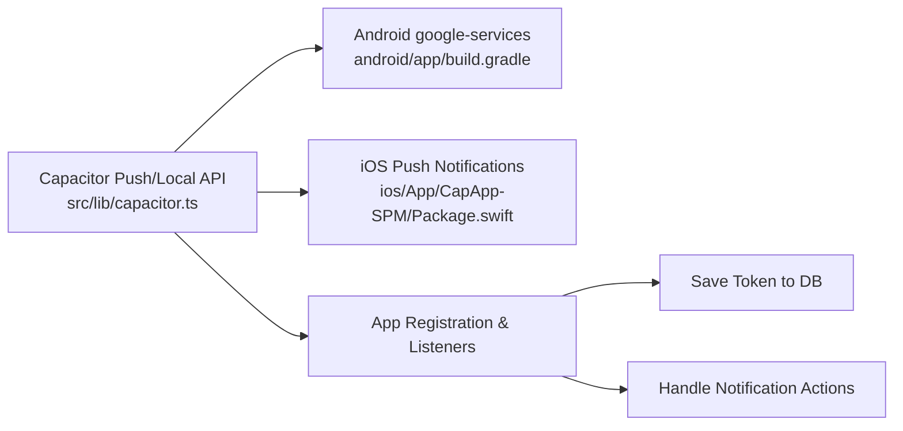

**Diagram sources**
- [capacitor.ts:393-447](file://src/lib/capacitor.ts#L393-L447)
- [build.gradle:62-74](file://android/app/build.gradle#L62-L74)
- [Package.swift:43-51](file://ios/App/CapApp-SPM/Package.swift#L43-L51)

**Section sources**
- [capacitor.ts:393-447](file://src/lib/capacitor.ts#L393-L447)
- [build.gradle:62-74](file://android/app/build.gradle#L62-L74)
- [Package.swift:43-51](file://ios/App/CapApp-SPM/Package.swift#L43-L51)

## Dependency Analysis
- Frontend depends on Supabase client for database operations and realtime subscriptions.
- Edge functions depend on Supabase admin client and Firebase Cloud Messaging V1 API.
- Mobile integration relies on Capacitor plugins and platform-specific configurations.

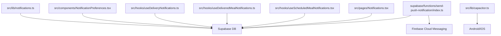

**Diagram sources**
- [notifications.ts:1-114](file://src/lib/notifications.ts#L1-L114)
- [NotificationPreferences.tsx:1-198](file://src/components/NotificationPreferences.tsx#L1-L198)
- [useDeliveryNotifications.ts:1-139](file://src/hooks/useDeliveryNotifications.ts#L1-L139)
- [useDeliveredMealNotifications.ts:1-166](file://src/hooks/useDeliveredMealNotifications.ts#L1-L166)
- [useScheduledMealNotifications.tsx:1-177](file://src/hooks/useScheduledMealNotifications.tsx#L1-L177)
- [Notifications.tsx:1-254](file://src/pages/Notifications.tsx#L1-L254)
- [send-push-notification/index.ts:1-300](file://supabase/functions/send-push-notification/index.ts#L1-L300)
- [capacitor.ts:393-447](file://src/lib/capacitor.ts#L393-L447)

**Section sources**
- [notifications.ts:1-114](file://src/lib/notifications.ts#L1-L114)
- [NotificationPreferences.tsx:1-198](file://src/components/NotificationPreferences.tsx#L1-L198)
- [useDeliveryNotifications.ts:1-139](file://src/hooks/useDeliveryNotifications.ts#L1-L139)
- [useDeliveredMealNotifications.ts:1-166](file://src/hooks/useDeliveredMealNotifications.ts#L1-L166)
- [useScheduledMealNotifications.tsx:1-177](file://src/hooks/useScheduledMealNotifications.tsx#L1-L177)
- [Notifications.tsx:1-254](file://src/pages/Notifications.tsx#L1-L254)
- [send-push-notification/index.ts:1-300](file://supabase/functions/send-push-notification/index.ts#L1-L300)
- [capacitor.ts:393-447](file://src/lib/capacitor.ts#L393-L447)

## Performance Considerations
- Real-time subscriptions: Use targeted filters (e.g., user_id, type) to minimize payload and improve responsiveness.
- Edge function batching: Sending to multiple tokens concurrently reduces latency; monitor FCM quotas and rate limits.
- Token maintenance: Proactively deactivate invalid tokens to reduce wasted send attempts.
- Database indexing: Ensure indexes on notifications (user_id, type, status) and push_tokens (user_id, is_active) for efficient queries.
- UI rendering: Memoize derived data and limit realtime updates to essential fields to keep the interface responsive.

## Troubleshooting Guide
Common issues and resolutions:
- No active push tokens: Edge function saves notification to DB and returns a message indicating notifications were saved without push.
- FCM failures: Invalid tokens are deactivated; verify service account credentials and project ID.
- Permission denials: Browser notifications require explicit user permission; request permission on mount and guide users to browser settings.
- Realtime disconnects: Ensure proper subscription lifecycle and reconnection logic; unsubscribe on component unmount.
- Stale types: Use raw SQL queries and type assertions when generated types are outdated to prevent runtime errors.

**Section sources**
- [send-push-notification/index.ts:224-239](file://supabase/functions/send-push-notification/index.ts#L224-L239)
- [useDeliveryNotifications.ts:13-29](file://src/hooks/useDeliveryNotifications.ts#L13-L29)
- [useDeliveredMealNotifications.ts:40-80](file://src/hooks/useDeliveredMealNotifications.ts#L40-L80)
- [Notifications.tsx:89-96](file://src/pages/Notifications.tsx#L89-L96)

## Conclusion
The notification system combines robust backend edge functions with reactive frontend hooks to deliver timely, customizable updates across channels. It leverages Supabase realtime for live synchronization, FCM for reliable push delivery, and in-app UI for comprehensive notification management. The modular design enables easy extension for new notification types and granular user control over preferences.