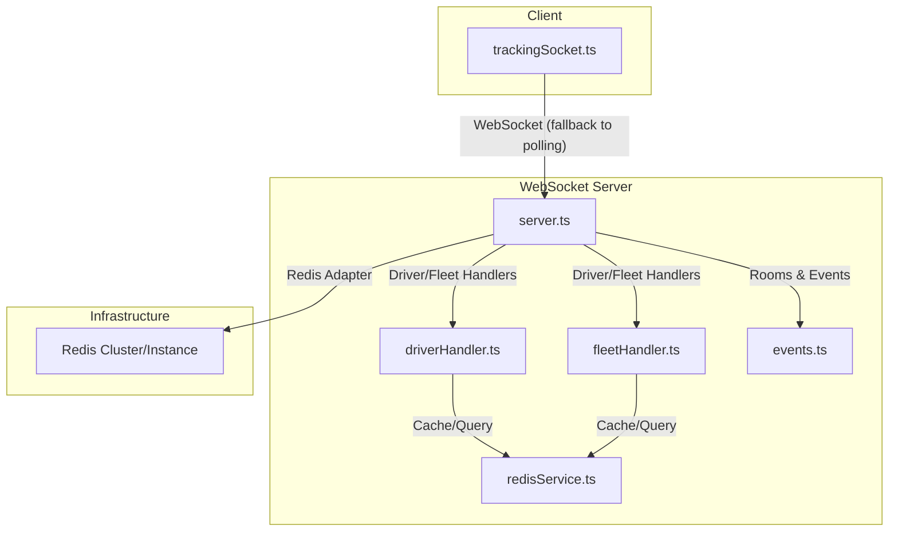
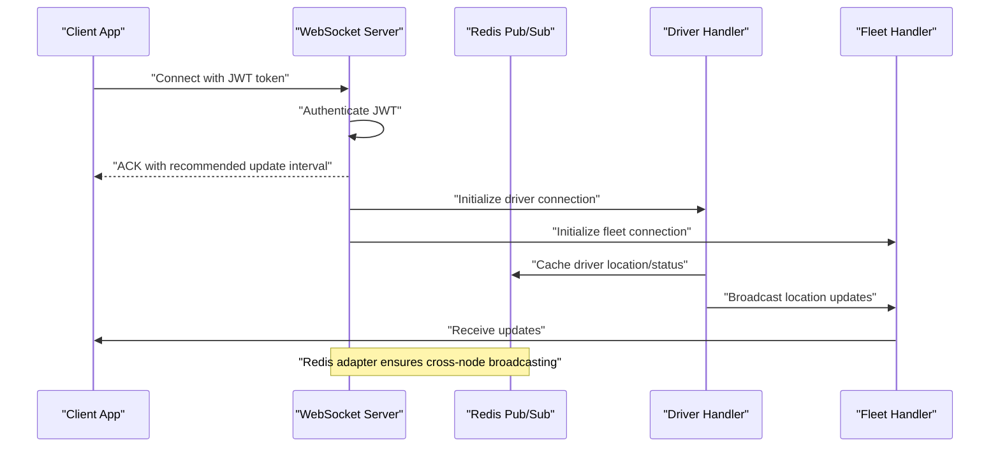
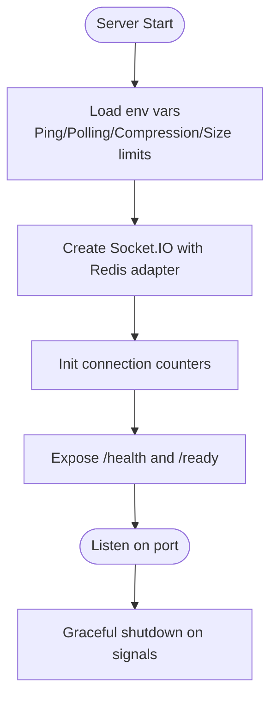
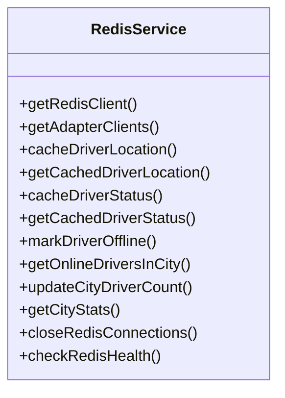
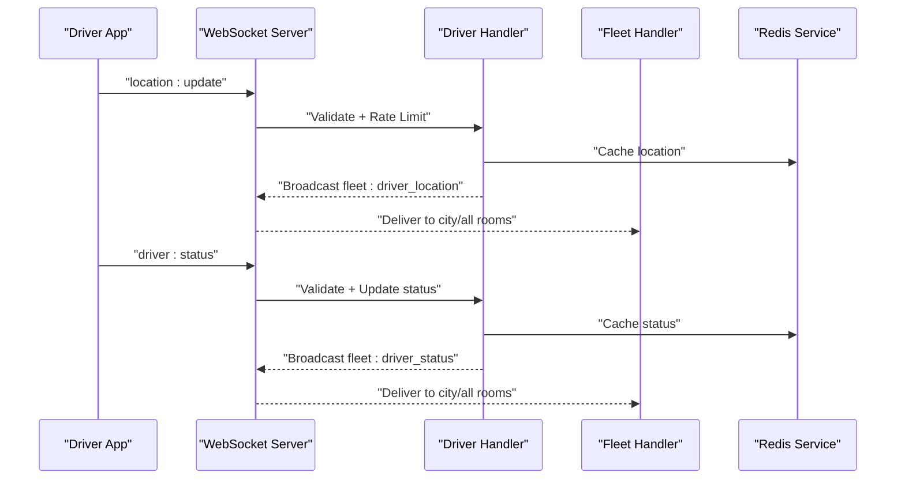
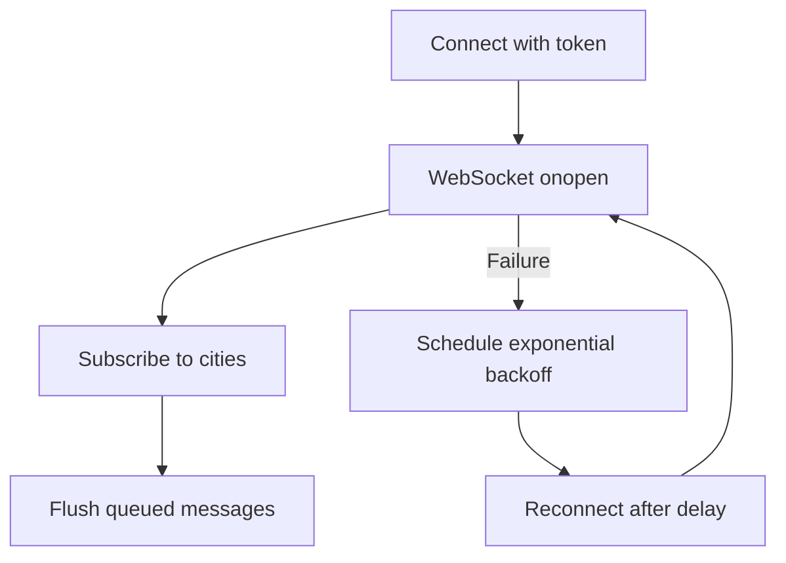
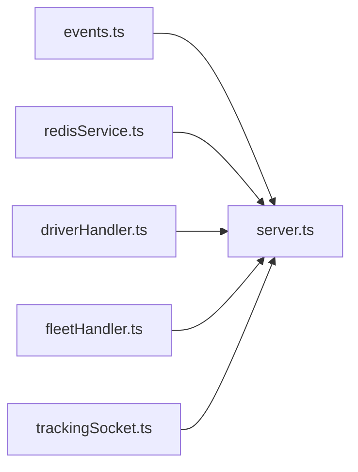

# Performance Optimization

<cite>
**Referenced Files in This Document**
- [server.ts](file://websocket-server/src/server.ts)
- [redisService.ts](file://websocket-server/src/services/redisService.ts)
- [driverHandler.ts](file://websocket-server/src/handlers/driverHandler.ts)
- [fleetHandler.ts](file://websocket-server/src/handlers/fleetHandler.ts)
- [events.ts](file://websocket-server/src/types/events.ts)
- [trackingSocket.ts](file://src/fleet/services/trackingSocket.ts)
- [fleet-management-portal-design.md](file://docs/fleet-management-portal-design.md)
- [performance-benchmark.ts](file://scripts/performance-benchmark.ts)
- [load-test-config.yml](file://tests/load-test-config.yml)
- [cache.ts](file://src/lib/cache.ts)
</cite>

## Table of Contents
1. [Introduction](#introduction)
2. [Project Structure](#project-structure)
3. [Core Components](#core-components)
4. [Architecture Overview](#architecture-overview)
5. [Detailed Component Analysis](#detailed-component-analysis)
6. [Dependency Analysis](#dependency-analysis)
7. [Performance Considerations](#performance-considerations)
8. [Troubleshooting Guide](#troubleshooting-guide)
9. [Conclusion](#conclusion)
10. [Appendices](#appendices)

## Introduction
This document focuses on real-time performance optimization strategies for the fleet management WebSocket system. It covers connection pooling, message queuing, bandwidth management, and WebSocket server configuration optimizations such as ping intervals, message size limits, and transport fallback mechanisms. It also documents the Redis adapter implementation for horizontal scaling and distributed session management, connection metrics and monitoring, message compression and serialization, connection health checks, automatic reconnection logic, graceful degradation, and memory/resource cleanup for long-running connections. Practical guidance for mobile and low-bandwidth environments is included.

## Project Structure
The real-time stack consists of:
- A WebSocket server built with Socket.IO and a Redis adapter for multi-node scaling
- Client-side tracking service using native WebSocket with exponential backoff and message queuing
- Shared event types and room naming conventions
- Redis-backed caching and pub/sub for distributed state and broadcasting
- Benchmarks and load test configurations for validating performance targets

**Diagram sources**
- [server.ts:38-51](file://websocket-server/src/server.ts#L38-L51)
- [redisService.ts:63-82](file://websocket-server/src/services/redisService.ts#L63-L82)
- [driverHandler.ts:48-80](file://websocket-server/src/handlers/driverHandler.ts#L48-L80)
- [fleetHandler.ts:36-62](file://websocket-server/src/handlers/fleetHandler.ts#L36-L62)
- [events.ts:157-186](file://websocket-server/src/types/events.ts#L157-L186)
- [trackingSocket.ts:34-53](file://src/fleet/services/trackingSocket.ts#L34-L53)

**Section sources**
- [server.ts:38-51](file://websocket-server/src/server.ts#L38-L51)
- [redisService.ts:63-82](file://websocket-server/src/services/redisService.ts#L63-L82)
- [driverHandler.ts:48-80](file://websocket-server/src/handlers/driverHandler.ts#L48-L80)
- [fleetHandler.ts:36-62](file://websocket-server/src/handlers/fleetHandler.ts#L36-L62)
- [events.ts:157-186](file://websocket-server/src/types/events.ts#L157-L186)
- [trackingSocket.ts:34-53](file://src/fleet/services/trackingSocket.ts#L34-L53)

## Core Components
- WebSocket server with Socket.IO, Redis adapter, JWT authentication, and room-based broadcasting
- Redis service for caching, pub/sub, and distributed session state
- Driver and fleet handlers implementing rate limiting, validation, and targeted broadcasts
- Client-side tracking service with exponential backoff, message queueing, and subscription management
- Health endpoints and graceful shutdown for operational reliability

Key performance-related configurations:
- Ping interval and timeout for detecting stale connections
- Transport fallback to HTTP long-polling
- Compression threshold for outbound messages
- Max message size limit
- Connection capacity gating and metrics

**Section sources**
- [server.ts:19-51](file://websocket-server/src/server.ts#L19-L51)
- [server.ts:108-150](file://websocket-server/src/server.ts#L108-L150)
- [redisService.ts:22-58](file://websocket-server/src/services/redisService.ts#L22-L58)
- [driverHandler.ts:24-44](file://websocket-server/src/handlers/driverHandler.ts#L24-L44)
- [fleetHandler.ts:19-32](file://websocket-server/src/handlers/fleetHandler.ts#L19-L32)
- [trackingSocket.ts:25-53](file://src/fleet/services/trackingSocket.ts#L25-L53)

## Architecture Overview
The system scales horizontally using sticky sessions at the load balancer and Redis pub/sub for inter-node messaging. The server enforces connection limits, validates JWT tokens, and maintains connection metrics. Clients connect via WebSocket with automatic fallback to polling and implement exponential backoff and message queuing.

**Diagram sources**
- [server.ts:65-103](file://websocket-server/src/server.ts#L65-L103)
- [driverHandler.ts:105-207](file://websocket-server/src/handlers/driverHandler.ts#L105-L207)
- [fleetHandler.ts:87-140](file://websocket-server/src/handlers/fleetHandler.ts#L87-L140)
- [redisService.ts:87-146](file://websocket-server/src/services/redisService.ts#L87-L146)

**Section sources**
- [server.ts:65-103](file://websocket-server/src/server.ts#L65-L103)
- [driverHandler.ts:105-207](file://websocket-server/src/handlers/driverHandler.ts#L105-L207)
- [fleetHandler.ts:87-140](file://websocket-server/src/handlers/fleetHandler.ts#L87-L140)
- [redisService.ts:87-146](file://websocket-server/src/services/redisService.ts#L87-L146)

## Detailed Component Analysis

### WebSocket Server Configuration and Metrics
- Ping interval and ping timeout tune keepalive responsiveness
- Transport fallback to HTTP polling improves resilience on constrained networks
- Compression threshold reduces bandwidth usage for large payloads
- Max message size limit prevents memory pressure
- Connection capacity gating protects stability under load
- Health endpoint exposes connection counts and environment metadata
- Readiness probe validates Redis connectivity
- Graceful shutdown closes servers, disconnects clients, and tears down Redis/database connections

**Diagram sources**
- [server.ts:19-51](file://websocket-server/src/server.ts#L19-L51)
- [server.ts:162-192](file://websocket-server/src/server.ts#L162-L192)
- [server.ts:197-224](file://websocket-server/src/server.ts#L197-L224)

**Section sources**
- [server.ts:19-51](file://websocket-server/src/server.ts#L19-L51)
- [server.ts:162-192](file://websocket-server/src/server.ts#L162-L192)
- [server.ts:197-224](file://websocket-server/src/server.ts#L197-L224)

### Redis Adapter Implementation for Horizontal Scaling
- Separate publisher and subscriber clients for Socket.IO adapter
- Lazy connection initialization with error and reconnect logging
- Cluster mode support via Redis Cluster client
- Key-based caching for driver location and status with TTL
- Online driver discovery and city statistics aggregation
- Centralized health check via ping

**Diagram sources**
- [redisService.ts:22-58](file://websocket-server/src/services/redisService.ts#L22-L58)
- [redisService.ts:63-82](file://websocket-server/src/services/redisService.ts#L63-L82)
- [redisService.ts:87-146](file://websocket-server/src/services/redisService.ts#L87-L146)
- [redisService.ts:165-224](file://websocket-server/src/services/redisService.ts#L165-L224)
- [redisService.ts:254-263](file://websocket-server/src/services/redisService.ts#L254-L263)

**Section sources**
- [redisService.ts:22-58](file://websocket-server/src/services/redisService.ts#L22-L58)
- [redisService.ts:63-82](file://websocket-server/src/services/redisService.ts#L63-L82)
- [redisService.ts:87-146](file://websocket-server/src/services/redisService.ts#L87-L146)
- [redisService.ts:165-224](file://websocket-server/src/services/redisService.ts#L165-L224)
- [redisService.ts:254-263](file://websocket-server/src/services/redisService.ts#L254-L263)

### Driver and Fleet Handlers: Rate Limiting, Validation, and Broadcasting
- Driver handler enforces minimum update interval and validates payload shapes
- Fleet handler validates subscription and history requests and enforces access control
- Both use Zod schemas for runtime validation
- Driver location updates are cached in Redis and broadcast to relevant rooms
- Status changes and online/offline transitions are persisted and broadcast

**Diagram sources**
- [driverHandler.ts:105-207](file://websocket-server/src/handlers/driverHandler.ts#L105-L207)
- [driverHandler.ts:212-275](file://websocket-server/src/handlers/driverHandler.ts#L212-L275)
- [fleetHandler.ts:145-212](file://websocket-server/src/handlers/fleetHandler.ts#L145-L212)
- [redisService.ts:87-146](file://websocket-server/src/services/redisService.ts#L87-L146)

**Section sources**
- [driverHandler.ts:24-44](file://websocket-server/src/handlers/driverHandler.ts#L24-L44)
- [driverHandler.ts:105-207](file://websocket-server/src/handlers/driverHandler.ts#L105-L207)
- [driverHandler.ts:212-275](file://websocket-server/src/handlers/driverHandler.ts#L212-L275)
- [fleetHandler.ts:19-32](file://websocket-server/src/handlers/fleetHandler.ts#L19-L32)
- [fleetHandler.ts:145-212](file://websocket-server/src/handlers/fleetHandler.ts#L145-L212)
- [redisService.ts:87-146](file://websocket-server/src/services/redisService.ts#L87-L146)

### Client-Side Connection Health, Reconnection, and Message Queuing
- Connects with token via URL parameter
- Exponential backoff with capped attempts
- Message queue flushed upon successful connection
- Subscription events for city-scoped tracking
- Error handling and retry scheduling

**Diagram sources**
- [trackingSocket.ts:34-53](file://src/fleet/services/trackingSocket.ts#L34-L53)
- [trackingSocket.ts:162-178](file://src/fleet/services/trackingSocket.ts#L162-L178)
- [trackingSocket.ts:191-198](file://src/fleet/services/trackingSocket.ts#L191-L198)

**Section sources**
- [trackingSocket.ts:34-53](file://src/fleet/services/trackingSocket.ts#L34-L53)
- [trackingSocket.ts:162-178](file://src/fleet/services/trackingSocket.ts#L162-L178)
- [trackingSocket.ts:191-198](file://src/fleet/services/trackingSocket.ts#L191-L198)

### Bandwidth Management, Compression, and Serialization
- Outbound compression threshold configured at the Socket.IO level
- Message size limits enforced at the server
- Client-side message queueing avoids redundant sends
- Validation schemas reduce malformed payload sizes
- Recommendations:
  - Prefer compact numeric representations for coordinates
  - Use minimal field sets for historical requests
  - Batch updates when feasible

**Section sources**
- [server.ts:47-50](file://websocket-server/src/server.ts#L47-L50)
- [driverHandler.ts:28-43](file://websocket-server/src/handlers/driverHandler.ts#L28-L43)
- [fleetHandler.ts:20-28](file://websocket-server/src/handlers/fleetHandler.ts#L20-L28)
- [trackingSocket.ts:180-189](file://src/fleet/services/trackingSocket.ts#L180-L189)

### Connection Pooling and Resource Cleanup
- Database connection pool lifecycle managed during graceful shutdown
- Redis connections closed via quit on shutdown
- Client-side WebSocket connections closed and timers cleared
- Recommendations:
  - Use connection pooling in upstream services
  - Implement idle timeouts and periodic cleanup
  - Monitor memory and CPU during long-running sessions

**Section sources**
- [server.ts:219-220](file://websocket-server/src/server.ts#L219-L220)
- [redisService.ts:229-249](file://websocket-server/src/services/redisService.ts#L229-L249)
- [trackingSocket.ts:200-211](file://src/fleet/services/trackingSocket.ts#L200-L211)

## Dependency Analysis
- Server depends on Socket.IO and Redis adapter for multi-node broadcasting
- Handlers depend on Redis service for caching and fleet handler for DB queries
- Client depends on native WebSocket with fallback and local message queueing
- Shared event types define contract between client and server

**Diagram sources**
- [events.ts:157-186](file://websocket-server/src/types/events.ts#L157-L186)
- [server.ts:11-16](file://websocket-server/src/server.ts#L11-L16)
- [redisService.ts:6-7](file://websocket-server/src/services/redisService.ts#L6-L7)
- [driverHandler.ts:6-21](file://websocket-server/src/handlers/driverHandler.ts#L6-L21)
- [fleetHandler.ts:6-16](file://websocket-server/src/handlers/fleetHandler.ts#L6-L16)
- [trackingSocket.ts:4](file://src/fleet/services/trackingSocket.ts#L4)

**Section sources**
- [events.ts:157-186](file://websocket-server/src/types/events.ts#L157-L186)
- [server.ts:11-16](file://websocket-server/src/server.ts#L11-L16)
- [redisService.ts:6-7](file://websocket-server/src/services/redisService.ts#L6-L7)
- [driverHandler.ts:6-21](file://websocket-server/src/handlers/driverHandler.ts#L6-L21)
- [fleetHandler.ts:6-16](file://websocket-server/src/handlers/fleetHandler.ts#L6-L16)
- [trackingSocket.ts:4](file://src/fleet/services/trackingSocket.ts#L4)

## Performance Considerations
- Horizontal scaling
  - Sticky sessions at the load balancer route drivers to the same server
  - Redis pub/sub ensures cross-node broadcasts
  - Kubernetes HPA can scale based on connection metrics
- Connection limits and capacity gating
  - Enforced at the server to prevent overload
  - Health and readiness probes inform load balancers
- Compression and message sizing
  - Compression threshold reduces bandwidth
  - Max message size limits protect memory
- Client resilience
  - Exponential backoff and message queueing improve reliability
- Monitoring and benchmarks
  - Use performance benchmarks and load tests to validate targets

**Section sources**
- [fleet-management-portal-design.md:2518-2585](file://docs/fleet-management-portal-design.md#L2518-L2585)
- [server.ts:19-51](file://websocket-server/src/server.ts#L19-L51)
- [server.ts:162-192](file://websocket-server/src/server.ts#L162-L192)
- [performance-benchmark.ts:133-187](file://scripts/performance-benchmark.ts#L133-L187)
- [load-test-config.yml:154-172](file://tests/load-test-config.yml#L154-L172)

## Troubleshooting Guide
- Health and readiness
  - Use /health for connection metrics and environment info
  - Use /ready to verify Redis connectivity
- Graceful shutdown
  - Server closes HTTP and Socket.IO servers, disconnects clients, and tears down Redis/database connections
- Client reconnection
  - Exponential backoff with capped attempts
  - Message queue flushed on reconnect
- Common issues
  - Authentication failures: verify JWT secret and token validity
  - Rate limiting: adjust minimum update interval or client frequency
  - Redis connectivity: check cluster/instance health and credentials

**Section sources**
- [server.ts:162-192](file://websocket-server/src/server.ts#L162-L192)
- [server.ts:197-224](file://websocket-server/src/server.ts#L197-L224)
- [redisService.ts:254-263](file://websocket-server/src/services/redisService.ts#L254-L263)
- [trackingSocket.ts:162-178](file://src/fleet/services/trackingSocket.ts#L162-L178)
- [trackingSocket.ts:191-198](file://src/fleet/services/trackingSocket.ts#L191-L198)

## Conclusion
The WebSocket server integrates Socket.IO with a Redis adapter to achieve horizontal scalability, robust connection metrics, and resilient client connectivity. Compression, message size limits, and transport fallback optimize bandwidth and reliability. The client implements exponential backoff and message queuing for degraded network conditions. Together with health endpoints, graceful shutdown, and validation-driven payloads, the system is well-positioned for real-time performance at scale.

## Appendices

### Mobile and Low-Bandwidth Optimizations
- Reduce update frequency and batch updates
- Use compression and compact data representations
- Prefer WebSocket with polling fallback
- Implement exponential backoff and retry
- Limit concurrent subscriptions and history requests
- Cache frequently accessed data locally

**Section sources**
- [server.ts:47-50](file://websocket-server/src/server.ts#L47-L50)
- [driverHandler.ts:26](file://websocket-server/src/handlers/driverHandler.ts#L26)
- [trackingSocket.ts:162-178](file://src/fleet/services/trackingSocket.ts#L162-L178)
- [trackingSocket.ts:228-269](file://src/fleet/services/trackingSocket.ts#L228-L269)

### Distributed Session Management and Redis Patterns
- Driver location and status cached with TTL
- Online driver discovery across nodes
- City statistics maintained in Redis
- Redis Cluster support for high availability

**Section sources**
- [redisService.ts:87-146](file://websocket-server/src/services/redisService.ts#L87-L146)
- [redisService.ts:165-224](file://websocket-server/src/services/redisService.ts#L165-L224)
- [redisService.ts:22-58](file://websocket-server/src/services/redisService.ts#L22-L58)

### Monitoring and Metrics
- Connection counters for total, drivers, and fleet
- Health endpoint returns environment and connection metrics
- Readiness probe checks Redis connectivity
- Use benchmarks and load tests to validate performance targets

**Section sources**
- [server.ts:57-60](file://websocket-server/src/server.ts#L57-L60)
- [server.ts:162-177](file://websocket-server/src/server.ts#L162-L177)
- [server.ts:177-187](file://websocket-server/src/server.ts#L177-L187)
- [performance-benchmark.ts:133-187](file://scripts/performance-benchmark.ts#L133-L187)
- [load-test-config.yml:154-172](file://tests/load-test-config.yml#L154-L172)