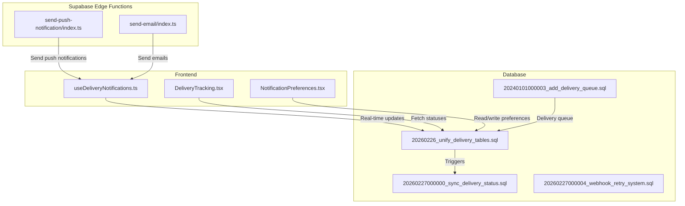
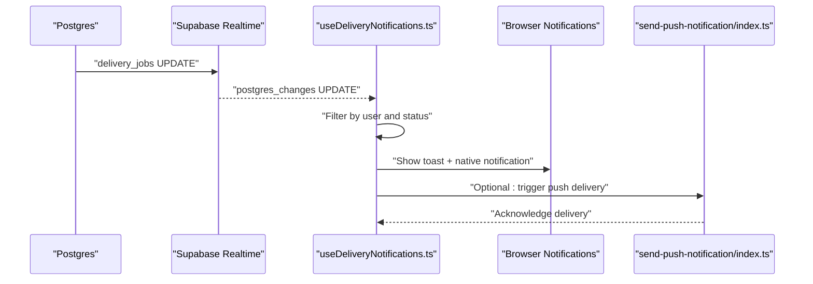
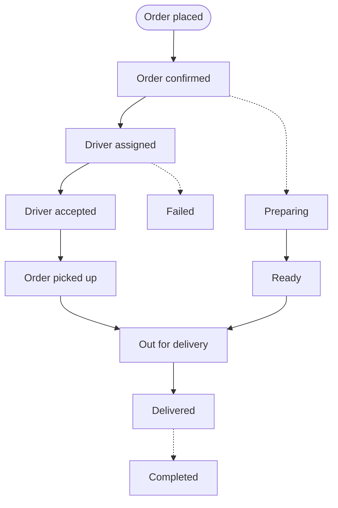
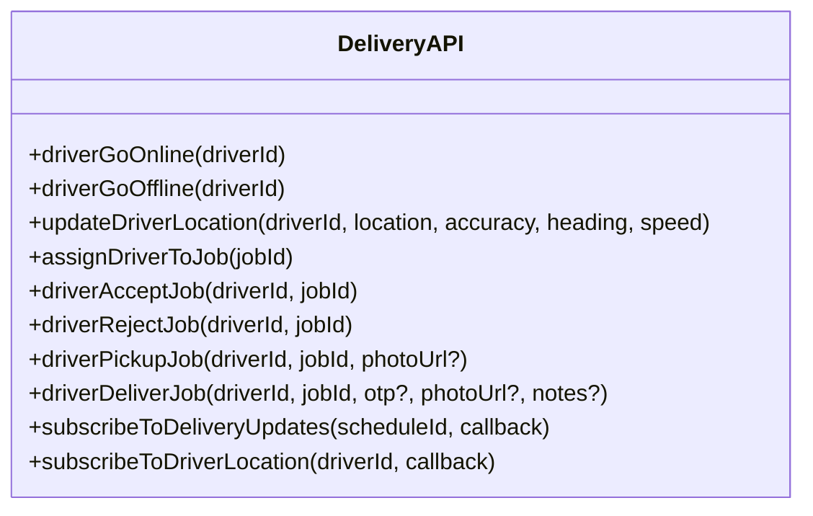
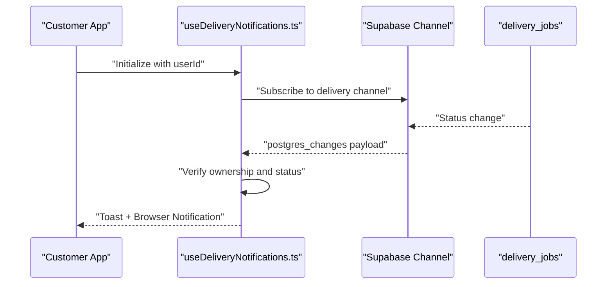
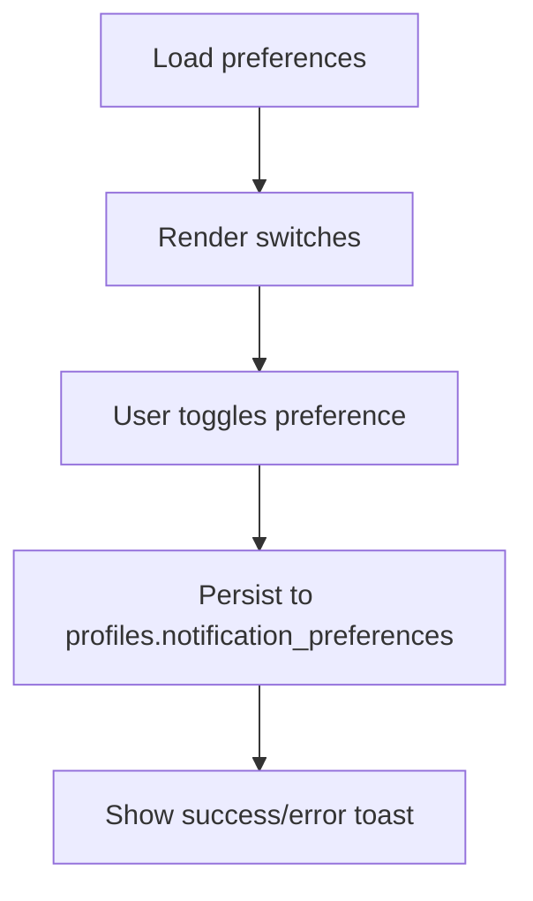
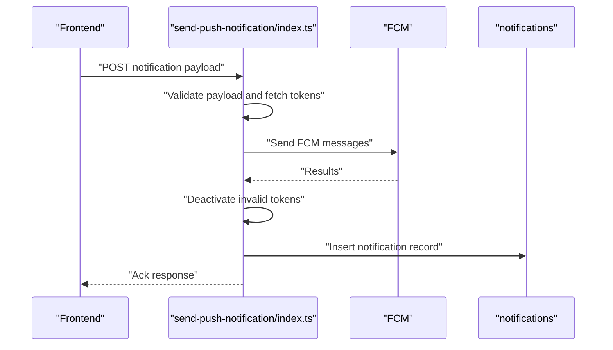
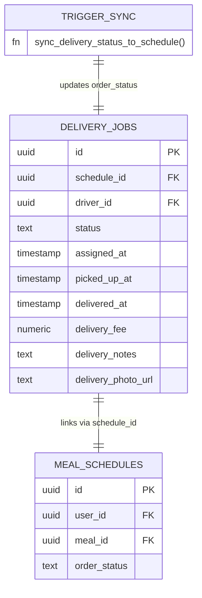
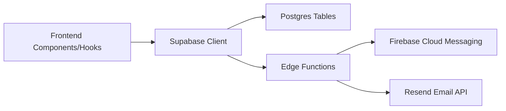

# Delivery & Order Notifications

<cite>
**Referenced Files in This Document**
- [delivery.ts](file://src/integrations/supabase/delivery.ts)
- [notifications.ts](file://src/lib/notifications.ts)
- [useDeliveryNotifications.ts](file://src/hooks/useDeliveryNotifications.ts)
- [NotificationPreferences.tsx](file://src/components/NotificationPreferences.tsx)
- [DeliveryTracking.tsx](file://src/pages/DeliveryTracking.tsx)
- [index.ts](file://supabase/functions/send-push-notification/index.ts)
- [index.ts](file://supabase/functions/send-email/index.ts)
- [20240101000003_add_delivery_queue.sql](file://supabase/migrations/20240101000003_add_delivery_queue.sql)
- [20260226_unify_delivery_tables.sql](file://supabase/migrations/20260226_unify_delivery_tables.sql)
- [20260227000000_sync_delivery_status.sql](file://supabase/migrations/20260227000000_sync_delivery_status.sql)
- [20260227000004_webhook_retry_system.sql](file://supabase/migrations/20260227000004_webhook_retry_system.sql)
</cite>

## Table of Contents
1. [Introduction](#introduction)
2. [Project Structure](#project-structure)
3. [Core Components](#core-components)
4. [Architecture Overview](#architecture-overview)
5. [Detailed Component Analysis](#detailed-component-analysis)
6. [Dependency Analysis](#dependency-analysis)
7. [Performance Considerations](#performance-considerations)
8. [Troubleshooting Guide](#troubleshooting-guide)
9. [Conclusion](#conclusion)

## Introduction
This document describes the delivery and order notification system, covering the complete delivery lifecycle from order confirmation to delivery completion. It explains how the system integrates with the Supabase real-time Postgres channels, the Supabase Edge Functions for push notifications and email, and the frontend hooks and components that deliver real-time updates to customers. It also documents notification templates, user preference handling, and delivery delay notifications.

## Project Structure
The delivery and notification system spans three layers:
- Frontend: React hooks and components for real-time delivery updates and notification preferences
- Backend: Supabase Edge Functions for push/email delivery and database triggers for status synchronization
- Database: Migrations defining delivery queues, jobs, and real-time synchronization

**Diagram sources**
- [useDeliveryNotifications.ts:31-135](file://src/hooks/useDeliveryNotifications.ts#L31-L135)
- [DeliveryTracking.tsx:257-275](file://src/pages/DeliveryTracking.tsx#L257-L275)
- [NotificationPreferences.tsx:51-83](file://src/components/NotificationPreferences.tsx#L51-L83)
- [index.ts:178-299](file://supabase/functions/send-push-notification/index.ts#L178-L299)
- [index.ts:19-119](file://supabase/functions/send-email/index.ts#L19-L119)
- [20240101000003_add_delivery_queue.sql:1-595](file://supabase/migrations/20240101000003_add_delivery_queue.sql#L1-L595)
- [20260226_unify_delivery_tables.sql:1-131](file://supabase/migrations/20260226_unify_delivery_tables.sql#L1-L131)
- [20260227000000_sync_delivery_status.sql:1-56](file://supabase/migrations/20260227000000_sync_delivery_status.sql#L1-L56)
- [20260227000004_webhook_retry_system.sql](file://supabase/migrations/20260227000004_webhook_retry_system.sql)

**Section sources**
- [delivery.ts:694-735](file://src/integrations/supabase/delivery.ts#L694-L735)
- [notifications.ts:18-114](file://src/lib/notifications.ts#L18-L114)
- [useDeliveryNotifications.ts:31-135](file://src/hooks/useDeliveryNotifications.ts#L31-L135)
- [DeliveryTracking.tsx:257-275](file://src/pages/DeliveryTracking.tsx#L257-L275)
- [NotificationPreferences.tsx:51-83](file://src/components/NotificationPreferences.tsx#L51-L83)
- [index.ts:178-299](file://supabase/functions/send-push-notification/index.ts#L178-L299)
- [index.ts:19-119](file://supabase/functions/send-email/index.ts#L19-L119)
- [20240101000003_add_delivery_queue.sql:1-595](file://supabase/migrations/20240101000003_add_delivery_queue.sql#L1-L595)
- [20260226_unify_delivery_tables.sql:1-131](file://supabase/migrations/20260226_unify_delivery_tables.sql#L1-L131)
- [20260227000000_sync_delivery_status.sql:1-56](file://supabase/migrations/20260227000000_sync_delivery_status.sql#L1-L56)
- [20260227000004_webhook_retry_system.sql](file://supabase/migrations/20260227000004_webhook_retry_system.sql)

## Core Components
- Delivery API integration: driver management, job assignment, driver actions, and real-time subscriptions
- Notification library: centralized creation and templated messages for order and delivery updates
- Real-time delivery notifications hook: subscribes to delivery job updates and renders browser notifications
- Notification preferences: user-configurable channels for order and delivery updates
- Supabase Edge Functions: push notification delivery via Firebase and email delivery via Resend
- Database migrations: delivery queue, unified delivery jobs, status synchronization, and webhook retry system

**Section sources**
- [delivery.ts:11-735](file://src/integrations/supabase/delivery.ts#L11-L735)
- [notifications.ts:18-114](file://src/lib/notifications.ts#L18-L114)
- [useDeliveryNotifications.ts:10-139](file://src/hooks/useDeliveryNotifications.ts#L10-L139)
- [NotificationPreferences.tsx:17-83](file://src/components/NotificationPreferences.tsx#L17-L83)
- [index.ts:178-299](file://supabase/functions/send-push-notification/index.ts#L178-L299)
- [index.ts:19-119](file://supabase/functions/send-email/index.ts#L19-L119)
- [20240101000003_add_delivery_queue.sql:1-595](file://supabase/migrations/20240101000003_add_delivery_queue.sql#L1-L595)
- [20260226_unify_delivery_tables.sql:1-131](file://supabase/migrations/20260226_unify_delivery_tables.sql#L1-L131)
- [20260227000000_sync_delivery_status.sql:1-56](file://supabase/migrations/20260227000000_sync_delivery_status.sql#L1-L56)
- [20260227000004_webhook_retry_system.sql](file://supabase/migrations/20260227000004_webhook_retry_system.sql)

## Architecture Overview
The system uses Supabase’s Postgres real-time capabilities to broadcast delivery status changes to subscribed clients. Edge Functions handle external integrations (push and email). A unified delivery_jobs table consolidates delivery tracking, while triggers keep customer/partner views synchronized.

**Diagram sources**
- [useDeliveryNotifications.ts:37-129](file://src/hooks/useDeliveryNotifications.ts#L37-L129)
- [20260227000000_sync_delivery_status.sql:28-31](file://supabase/migrations/20260227000000_sync_delivery_status.sql#L28-L31)
- [index.ts:178-299](file://supabase/functions/send-push-notification/index.ts#L178-L299)

## Detailed Component Analysis

### Delivery Lifecycle Notifications
The system supports the following lifecycle stages:
- Order confirmed
- Driver assigned
- Pickup confirmed
- Out for delivery
- Delivered
- Failed/cancelled

Templates and helper functions:
- Templated messages for order updates and driver assignment
- Delivery claim notifications for drivers
- Real-time toast and browser notifications for customers

**Diagram sources**
- [notifications.ts:44-81](file://src/lib/notifications.ts#L44-L81)
- [notifications.ts:83-114](file://src/lib/notifications.ts#L83-L114)
- [useDeliveryNotifications.ts:71-127](file://src/hooks/useDeliveryNotifications.ts#L71-L127)

**Section sources**
- [notifications.ts:38-114](file://src/lib/notifications.ts#L38-L114)
- [useDeliveryNotifications.ts:71-127](file://src/hooks/useDeliveryNotifications.ts#L71-L127)

### Supabase Delivery API Integration
Key capabilities:
- Driver online/offline status and location updates
- Driver assignment to nearest available driver
- Driver actions: accept/reject/pickup/deliver/fail
- Real-time subscriptions for delivery updates and driver locations
- Customer tracking and driver location retrieval

**Diagram sources**
- [delivery.ts:11-735](file://src/integrations/supabase/delivery.ts#L11-L735)

**Section sources**
- [delivery.ts:11-735](file://src/integrations/supabase/delivery.ts#L11-L735)

### Real-Time Delivery Updates for Customers
The hook subscribes to delivery_jobs updates and filters by the authenticated user’s schedule. It renders toast notifications and native browser notifications for each status change.

**Diagram sources**
- [useDeliveryNotifications.ts:37-129](file://src/hooks/useDeliveryNotifications.ts#L37-L129)

**Section sources**
- [useDeliveryNotifications.ts:10-139](file://src/hooks/useDeliveryNotifications.ts#L10-L139)

### Notification Preferences and User Control
Users can configure notification preferences for:
- Order updates (push/email/WhatsApp)
- Delivery updates (push/email/WhatsApp)
- Promotions (email)
- Meal reminders (push)

Preferences are persisted in the user profile and can be toggled in the UI.

**Diagram sources**
- [NotificationPreferences.tsx:51-83](file://src/components/NotificationPreferences.tsx#L51-L83)

**Section sources**
- [NotificationPreferences.tsx:17-198](file://src/components/NotificationPreferences.tsx#L17-L198)

### Supabase Edge Functions: Push and Email Delivery
- Push notifications: authenticates with Firebase via service account, sends to all active tokens, deactivates invalid tokens, and logs the notification
- Email delivery: validates recipients and sends via Resend API

**Diagram sources**
- [index.ts:178-299](file://supabase/functions/send-push-notification/index.ts#L178-L299)

**Section sources**
- [index.ts:178-299](file://supabase/functions/send-push-notification/index.ts#L178-L299)
- [index.ts:19-119](file://supabase/functions/send-email/index.ts#L19-L119)

### Database Schema and Status Synchronization
- Delivery queue migration defines queue items, statuses, and indexes for performance
- Unified delivery_jobs migration consolidates delivery tracking and adds driver policies
- Status synchronization trigger ensures customer/partner views stay in sync
- Webhook retry system migration supports reliable event delivery

**Diagram sources**
- [20260226_unify_delivery_tables.sql:74-95](file://supabase/migrations/20260226_unify_delivery_tables.sql#L74-L95)
- [20260227000000_sync_delivery_status.sql:5-31](file://supabase/migrations/20260227000000_sync_delivery_status.sql#L5-L31)

**Section sources**
- [20240101000003_add_delivery_queue.sql:1-595](file://supabase/migrations/20240101000003_add_delivery_queue.sql#L1-L595)
- [20260226_unify_delivery_tables.sql:1-131](file://supabase/migrations/20260226_unify_delivery_tables.sql#L1-L131)
- [20260227000000_sync_delivery_status.sql:1-56](file://supabase/migrations/20260227000000_sync_delivery_status.sql#L1-L56)
- [20260227000004_webhook_retry_system.sql](file://supabase/migrations/20260227000004_webhook_retry_system.sql)

## Dependency Analysis
- Frontend depends on Supabase client for real-time channels and database queries
- Edge Functions depend on Supabase secrets and third-party APIs (Firebase, Resend)
- Database migrations define the canonical schema and enforce referential integrity
- Real-time subscriptions rely on Postgres RLS policies to restrict access

**Diagram sources**
- [delivery.ts:694-735](file://src/integrations/supabase/delivery.ts#L694-L735)
- [index.ts:178-299](file://supabase/functions/send-push-notification/index.ts#L178-L299)
- [index.ts:19-119](file://supabase/functions/send-email/index.ts#L19-L119)

**Section sources**
- [delivery.ts:694-735](file://src/integrations/supabase/delivery.ts#L694-L735)
- [index.ts:178-299](file://supabase/functions/send-push-notification/index.ts#L178-L299)
- [index.ts:19-119](file://supabase/functions/send-email/index.ts#L19-L119)

## Performance Considerations
- Real-time subscriptions: use targeted filters (by schedule/user) to minimize payload volume
- Database indexing: delivery_queue and delivery_jobs include strategic indexes for status and location queries
- Token deactivation: push function automatically disables invalid tokens to reduce retries
- Batch operations: prefer bulk inserts/updates where appropriate to reduce round trips

## Troubleshooting Guide
Common issues and resolutions:
- No push notifications received
  - Verify active tokens exist for the user and are not deactivated
  - Confirm Firebase service account credentials are set in Supabase secrets
  - Check function logs for token invalidation and retry behavior
- Status not updating in UI
  - Ensure the user is subscribed to the correct channel and owns the schedule
  - Confirm the synchronization trigger is active and not blocked by RLS
- Email delivery failures
  - Validate the RESEND_API_KEY is configured and the recipient email is valid
  - Inspect function response for detailed error messages

**Section sources**
- [index.ts:213-239](file://supabase/functions/send-push-notification/index.ts#L213-L239)
- [index.ts:259-271](file://supabase/functions/send-push-notification/index.ts#L259-L271)
- [index.ts:273-282](file://supabase/functions/send-push-notification/index.ts#L273-L282)
- [index.ts:27-36](file://supabase/functions/send-email/index.ts#L27-L36)
- [index.ts:52-62](file://supabase/functions/send-email/index.ts#L52-L62)
- [20260227000000_sync_delivery_status.sql:24-31](file://supabase/migrations/20260227000000_sync_delivery_status.sql#L24-L31)

## Conclusion
The delivery and order notification system provides a robust, real-time experience for customers and drivers. It leverages Supabase’s real-time channels, a unified delivery_jobs schema, and Edge Functions for scalable push and email delivery. Users retain control over notification preferences, while the system ensures accurate, synchronized status updates across customer and partner portals.