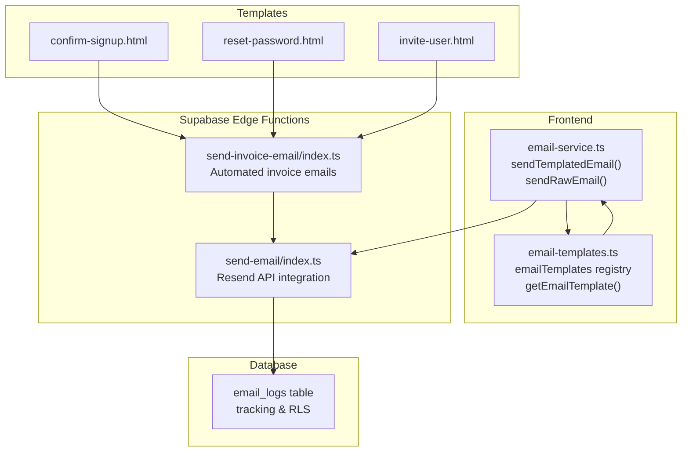
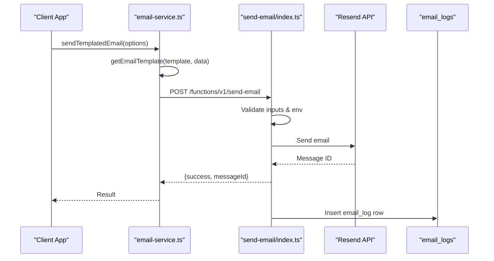
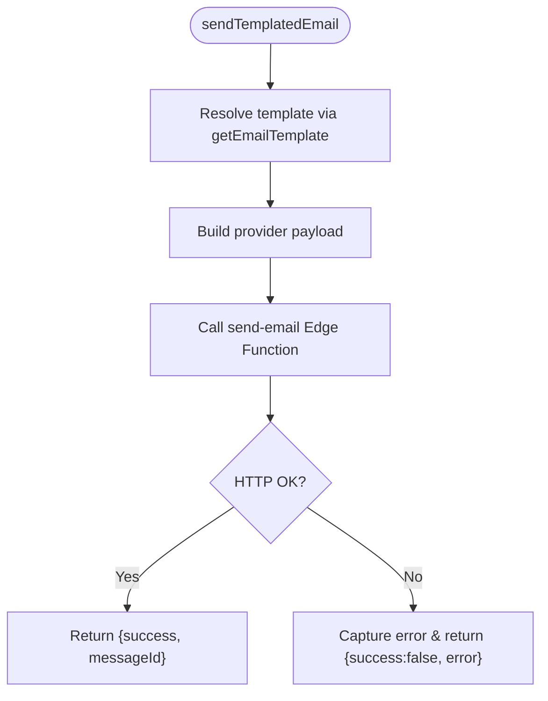
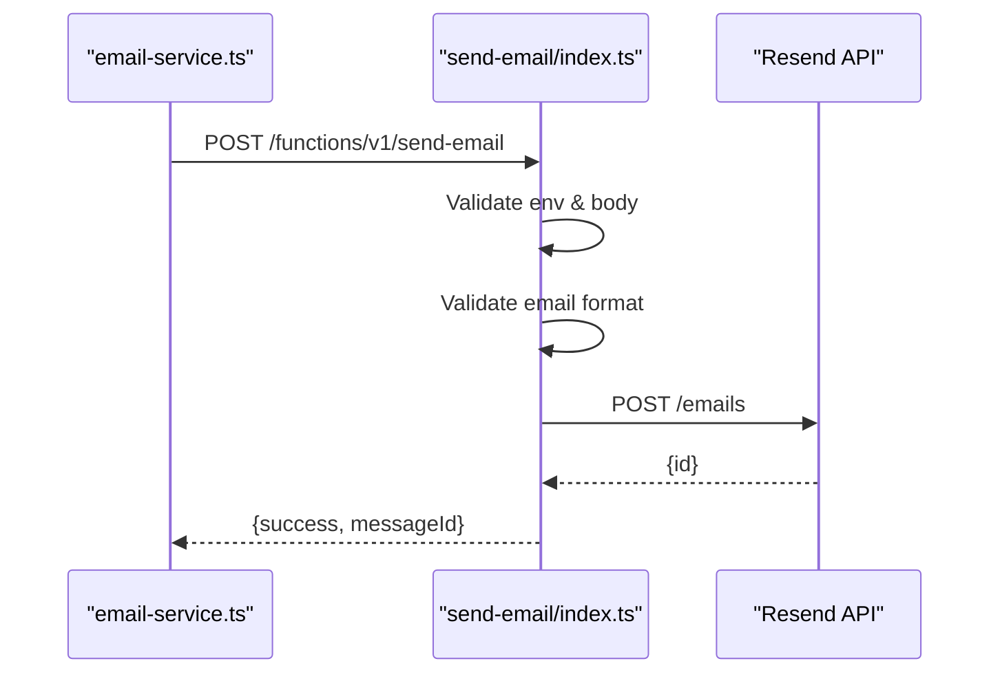
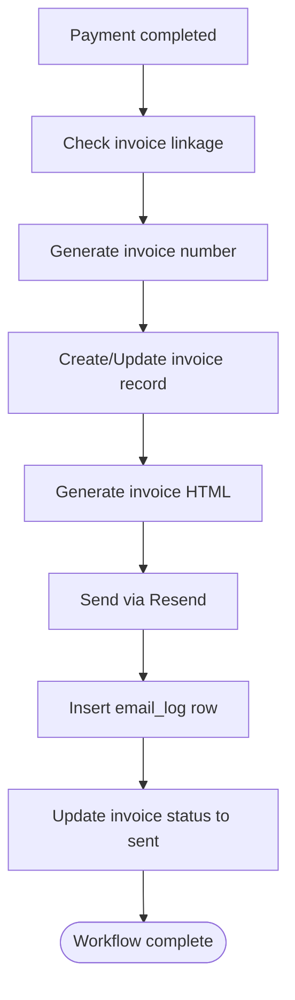
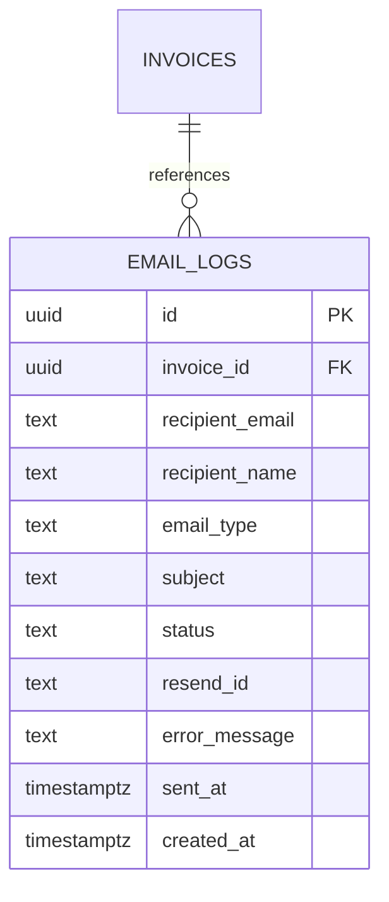
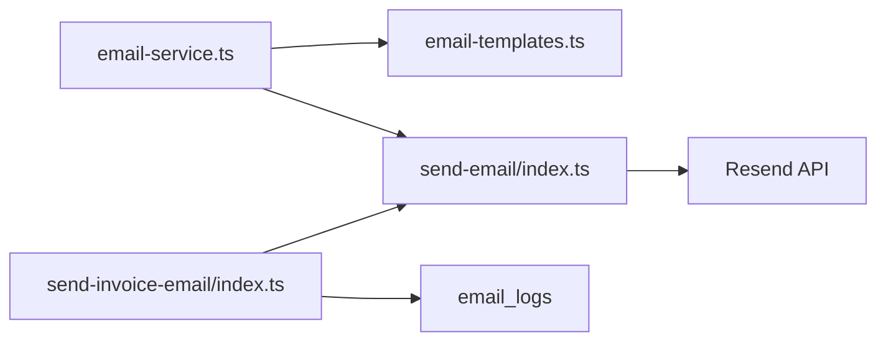

# Email Notification System

<cite>
**Referenced Files in This Document**
- [email-service.ts](file://src/lib/email-service.ts)
- [email-templates.ts](file://src/lib/email-templates.ts)
- [send-email/index.ts](file://supabase/functions/send-email/index.ts)
- [send-invoice-email/index.ts](file://supabase/functions/send-invoice-email/index.ts)
- [confirm-signup.html](file://supabase/email-templates/confirm-signup.html)
- [reset-password.html](file://supabase/email-templates/reset-password.html)
- [invite-user.html](file://supabase/email-templates/invite-user.html)
- [20260218130000_email_logs.sql](file://supabase/migrations/20260218130000_email_logs.sql)
</cite>

## Table of Contents
1. [Introduction](#introduction)
2. [Project Structure](#project-structure)
3. [Core Components](#core-components)
4. [Architecture Overview](#architecture-overview)
5. [Detailed Component Analysis](#detailed-component-analysis)
6. [Dependency Analysis](#dependency-analysis)
7. [Performance Considerations](#performance-considerations)
8. [Troubleshooting Guide](#troubleshooting-guide)
9. [Conclusion](#conclusion)

## Introduction
This document describes the email notification system used by the Nutrio application. It covers SMTP configuration via Resend, email templates, automated email workflows, provider integration, template management, bulk email processing, verification and password reset flows, promotional and administrative notifications, delivery tracking, bounce handling, and unsubscribe management. It also documents the template system with dynamic content injection, localization support, and brand consistency, along with practical examples for customization and automation.

## Project Structure
The email system spans three primary areas:
- Frontend client library for sending templated and raw emails
- Supabase Edge Functions for provider integration and automation
- Email templates stored in Supabase email-templates and managed programmatically



**Diagram sources**
- [email-service.ts:1-173](file://src/lib/email-service.ts#L1-L173)
- [email-templates.ts:1-209](file://src/lib/email-templates.ts#L1-L209)
- [send-email/index.ts:1-120](file://supabase/functions/send-email/index.ts#L1-L120)
- [send-invoice-email/index.ts:1-540](file://supabase/functions/send-invoice-email/index.ts#L1-L540)
- [20260218130000_email_logs.sql:1-31](file://supabase/migrations/20260218130000_email_logs.sql#L1-L31)

**Section sources**
- [email-service.ts:1-173](file://src/lib/email-service.ts#L1-L173)
- [email-templates.ts:1-209](file://src/lib/email-templates.ts#L1-L209)
- [send-email/index.ts:1-120](file://supabase/functions/send-email/index.ts#L1-L120)
- [send-invoice-email/index.ts:1-540](file://supabase/functions/send-invoice-email/index.ts#L1-L540)
- [20260218130000_email_logs.sql:1-31](file://supabase/migrations/20260218130000_email_logs.sql#L1-L31)

## Core Components
- Email service client: Provides typed APIs for sending templated and raw emails, with convenience functions for common workflows.
- Template engine: Central registry of email templates with dynamic subject and HTML generation, supporting brand consistency and extensibility.
- Provider integration: Supabase Edge Function that validates requests, authenticates with Resend, and sends emails.
- Automated workflows: Edge Function that generates and sends invoice emails after payment completion.
- Tracking and logging: Database table for email lifecycle tracking with Row Level Security policies.

Key responsibilities:
- Email service client: Validates inputs, resolves templates, and forwards to provider endpoint.
- Template engine: Generates HTML with consistent branding and dynamic content.
- Provider integration: Enforces security, sanitizes inputs, and integrates with Resend.
- Automated workflows: Orchestrates invoice creation, email generation, provider dispatch, and logging.
- Tracking: Records email events for monitoring and diagnostics.

**Section sources**
- [email-service.ts:23-173](file://src/lib/email-service.ts#L23-L173)
- [email-templates.ts:43-209](file://src/lib/email-templates.ts#L43-L209)
- [send-email/index.ts:19-120](file://supabase/functions/send-email/index.ts#L19-L120)
- [send-invoice-email/index.ts:327-473](file://supabase/functions/send-invoice-email/index.ts#L327-L473)
- [20260218130000_email_logs.sql:2-31](file://supabase/migrations/20260218130000_email_logs.sql#L2-L31)

## Architecture Overview
The system follows a client-driven approach:
- Frontend calls the email service client to send templated or raw emails.
- The client resolves the template and invokes the Supabase Edge Function endpoint.
- The Edge Function authenticates with Resend, validates inputs, and sends the email.
- The system logs outcomes for observability and compliance.



**Diagram sources**
- [email-service.ts:23-84](file://src/lib/email-service.ts#L23-L84)
- [send-email/index.ts:19-120](file://supabase/functions/send-email/index.ts#L19-L120)
- [20260218130000_email_logs.sql:2-14](file://supabase/migrations/20260218130000_email_logs.sql#L2-L14)

## Detailed Component Analysis

### Email Service Client
The client exposes:
- sendTemplatedEmail: Resolves a named template and data payload into subject and HTML, then sends via provider.
- sendRawEmail: Sends raw HTML with subject and recipients through the provider endpoint.
- Convenience functions: Welcome, order confirmation, password reset, subscription started, wallet top-up, and invoice notifications.

Processing logic:
- Template resolution: Retrieves subject and HTML from the registry, supports dynamic subjects via functions.
- Provider invocation: Calls Supabase Edge Function with proper headers and payload.
- Error handling: Captures exceptions, logs, and returns structured results.



**Diagram sources**
- [email-service.ts:23-84](file://src/lib/email-service.ts#L23-L84)
- [email-templates.ts:190-209](file://src/lib/email-templates.ts#L190-L209)

**Section sources**
- [email-service.ts:23-173](file://src/lib/email-service.ts#L23-L173)
- [email-templates.ts:43-209](file://src/lib/email-templates.ts#L43-L209)

### Template Management System
The template engine defines:
- Base template: Shared HTML shell with consistent styling, header, footer, and brand elements.
- Template registry: Named templates with subject and HTML generators.
- Dynamic content: Supports data-driven content injection and dynamic subjects.

Template categories:
- Transactional: Welcome, order confirmation, order delivered, password reset, subscription started, wallet top-up, invoice ready.
- Marketing: Generic marketing template with configurable subject/title/content/CTA.
- Supabase-provided: Static HTML templates for Supabase Auth flows (confirmation, reset password, invite).

Localization and brand consistency:
- Centralized styling and layout in base template.
- Dynamic content via data injection.
- Consistent sender identity and links.

```mermaid
classDiagram
class EmailTemplates {
+Record~string, EmailTemplate~ emailTemplates
+getEmailTemplate(name, data) {subject, html}
}
class EmailTemplate {
+subject : string|(data)=>string
+html : (data)=>string
}
class BaseTemplate {
+generate(content, title) string
}
EmailTemplates --> EmailTemplate : "manages"
EmailTemplates --> BaseTemplate : "uses"
```

**Diagram sources**
- [email-templates.ts:3-41](file://src/lib/email-templates.ts#L3-L41)
- [email-templates.ts:43-188](file://src/lib/email-templates.ts#L43-L188)
- [email-templates.ts:190-209](file://src/lib/email-templates.ts#L190-L209)

**Section sources**
- [email-templates.ts:1-209](file://src/lib/email-templates.ts#L1-L209)
- [confirm-signup.html:1-147](file://supabase/email-templates/confirm-signup.html#L1-L147)
- [reset-password.html:1-152](file://supabase/email-templates/reset-password.html#L1-L152)
- [invite-user.html:1-143](file://supabase/email-templates/invite-user.html#L1-L143)

### Email Provider Integration (Resend via Supabase Edge Function)
The Edge Function:
- Validates environment configuration (Resend API key).
- Parses and validates incoming request (to, subject, html).
- Sanitizes and normalizes sender/reply-to.
- Sends via Resend API and returns message ID.
- Logs errors and returns structured responses.

Security and validation:
- CORS preflight handling.
- Required fields validation.
- Email format validation.
- Error propagation with appropriate HTTP status codes.



**Diagram sources**
- [send-email/index.ts:19-120](file://supabase/functions/send-email/index.ts#L19-L120)
- [email-service.ts:50-84](file://src/lib/email-service.ts#L50-L84)

**Section sources**
- [send-email/index.ts:1-120](file://supabase/functions/send-email/index.ts#L1-L120)
- [email-service.ts:50-84](file://src/lib/email-service.ts#L50-L84)

### Automated Email Workflows
Invoice email automation:
- Triggered after payment completion.
- Generates invoice number and formats currency/date.
- Creates or updates invoice record and links to payment.
- Builds HTML invoice email and sends via Resend.
- Logs email event and updates invoice status.



**Diagram sources**
- [send-invoice-email/index.ts:327-473](file://supabase/functions/send-invoice-email/index.ts#L327-L473)

**Section sources**
- [send-invoice-email/index.ts:1-540](file://supabase/functions/send-invoice-email/index.ts#L1-L540)

### Email Verification System
Supabase Auth templates:
- Confirmation email template with branded layout and dynamic confirmation URL.
- Reset password template with secure expiration and fallback link.
- Invite user template for onboarding flows.

These templates integrate with Supabase Auth flows and use placeholders for dynamic URLs and site context.

**Section sources**
- [confirm-signup.html:1-147](file://supabase/email-templates/confirm-signup.html#L1-L147)
- [reset-password.html:1-152](file://supabase/email-templates/reset-password.html#L1-L152)
- [invite-user.html:1-143](file://supabase/email-templates/invite-user.html#L1-L143)

### Password Reset Emails
The system supports:
- Generating password reset emails with dynamic reset URL.
- Configurable expiration and fallback mechanisms.
- Integration with Supabase Auth for secure token handling.

**Section sources**
- [email-templates.ts:105-120](file://src/lib/email-templates.ts#L105-L120)
- [reset-password.html:1-152](file://supabase/email-templates/reset-password.html#L1-L152)

### Promotional Emails
Marketing template:
- Configurable subject/title/content/CTA.
- Supports dynamic content injection for campaigns.

**Section sources**
- [email-templates.ts:180-187](file://src/lib/email-templates.ts#L180-L187)

### Administrative Notifications
Administrative notifications:
- Invoice-ready emails for billing events.
- Subscription and wallet top-up confirmations.
- Order lifecycle notifications.

**Section sources**
- [email-templates.ts:162-178](file://src/lib/email-templates.ts#L162-L178)
- [email-templates.ts:122-144](file://src/lib/email-templates.ts#L122-L144)
- [email-templates.ts:146-160](file://src/lib/email-templates.ts#L146-L160)
- [email-templates.ts:66-84](file://src/lib/email-templates.ts#L66-L84)

### Email Delivery Tracking, Bounce Handling, and Unsubscribe Management
Tracking:
- email_logs table captures recipient, type, subject, status, resend_id, timestamps, and errors.
- Indexes on recipient, invoice, status, and created_at for efficient queries.
- Row Level Security policy allows service_role to manage logs.

Bounce handling:
- Status column tracks pending/sent/failed/bounced for monitoring.
- Error messages recorded for diagnostics.

Unsubscribe management:
- Not implemented in current codebase; recommended to add unsubscribe links and maintain suppression lists.



**Diagram sources**
- [20260218130000_email_logs.sql:2-14](file://supabase/migrations/20260218130000_email_logs.sql#L2-L14)

**Section sources**
- [20260218130000_email_logs.sql:1-31](file://supabase/migrations/20260218130000_email_logs.sql#L1-L31)

### Bulk Email Processing
Bulk processing capability:
- The provider integration supports single recipient arrays; bulk distribution can be achieved by invoking the endpoint multiple times or by adding batch processing logic in the Edge Function.
- Consider rate limits and provider quotas when scaling.

**Section sources**
- [send-email/index.ts:67-81](file://supabase/functions/send-email/index.ts#L67-L81)

### Examples

#### Creating a Custom Email Template
- Define a new template in the registry with subject and HTML generator.
- Use the base template for consistent styling.
- Inject dynamic data via the data parameter.

Reference paths:
- [email-templates.ts:43-188](file://src/lib/email-templates.ts#L43-L188)
- [email-templates.ts:190-209](file://src/lib/email-templates.ts#L190-L209)

#### Configuring Email Providers
- Set environment variables for Supabase and Resend in deployment configuration.
- Ensure the Edge Function has access to the Resend API key.

Reference paths:
- [send-email/index.ts:4](file://supabase/functions/send-email/index.ts#L4)
- [FINAL_STEPS.md:88](file://FINAL_STEPS.md#L88)

#### Implementing Email Automation Workflows
- Use the invoice email Edge Function to trigger after payment completion.
- Extend the function to support additional automation triggers.

Reference paths:
- [send-invoice-email/index.ts:327-473](file://supabase/functions/send-invoice-email/index.ts#L327-L473)

## Dependency Analysis
High-level dependencies:
- email-service.ts depends on email-templates.ts for template resolution and on Supabase Edge Function for provider dispatch.
- send-invoice-email/index.ts depends on Supabase client libraries, Resend API, and the email_logs table.
- Templates can be served statically or dynamically resolved by the client.



**Diagram sources**
- [email-service.ts:1-173](file://src/lib/email-service.ts#L1-L173)
- [email-templates.ts:1-209](file://src/lib/email-templates.ts#L1-L209)
- [send-email/index.ts:1-120](file://supabase/functions/send-email/index.ts#L1-L120)
- [send-invoice-email/index.ts:1-540](file://supabase/functions/send-invoice-email/index.ts#L1-L540)
- [20260218130000_email_logs.sql:1-31](file://supabase/migrations/20260218130000_email_logs.sql#L1-L31)

**Section sources**
- [email-service.ts:1-173](file://src/lib/email-service.ts#L1-L173)
- [email-templates.ts:1-209](file://src/lib/email-templates.ts#L1-L209)
- [send-email/index.ts:1-120](file://supabase/functions/send-email/index.ts#L1-L120)
- [send-invoice-email/index.ts:1-540](file://supabase/functions/send-invoice-email/index.ts#L1-L540)
- [20260218130000_email_logs.sql:1-31](file://supabase/migrations/20260218130000_email_logs.sql#L1-L31)

## Performance Considerations
- Asynchronous provider calls: Ensure non-blocking behavior in client and Edge Functions.
- Template caching: Consider memoizing template resolution for repeated sends.
- Batch processing: For bulk emails, implement batching and rate limiting to respect provider quotas.
- Logging overhead: email_logs inserts add latency; monitor and optimize indexing if needed.

## Troubleshooting Guide
Common issues and resolutions:
- Missing environment variables: Ensure RESEND_API_KEY and Supabase keys are configured.
- Validation failures: Verify recipient email format and required fields.
- Provider errors: Inspect returned error messages and Resend API response codes.
- Tracking gaps: Confirm email_logs insertions and RLS policy permissions.

**Section sources**
- [send-email/index.ts:26-62](file://supabase/functions/send-email/index.ts#L26-L62)
- [send-invoice-email/index.ts:482-500](file://supabase/functions/send-invoice-email/index.ts#L482-L500)
- [20260218130000_email_logs.sql:22-31](file://supabase/migrations/20260218130000_email_logs.sql#L22-L31)

## Conclusion
The email notification system combines a flexible template engine, robust provider integration via Resend, and automated workflows for invoice delivery. It provides strong brand consistency, dynamic content injection, and comprehensive tracking through the email_logs table. Extending the system with unsubscribe management, localization, and advanced bounce handling will further enhance reliability and user experience.