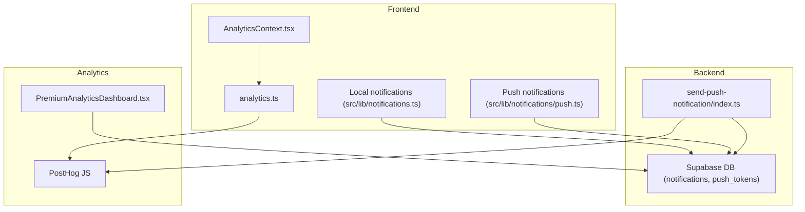
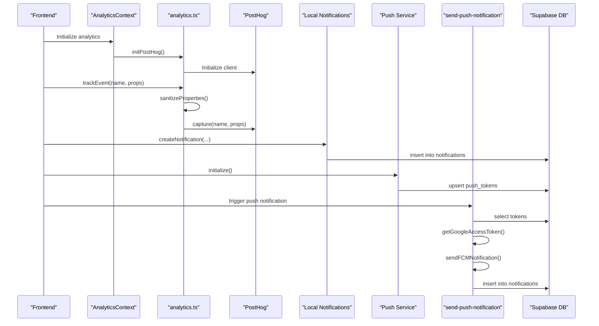
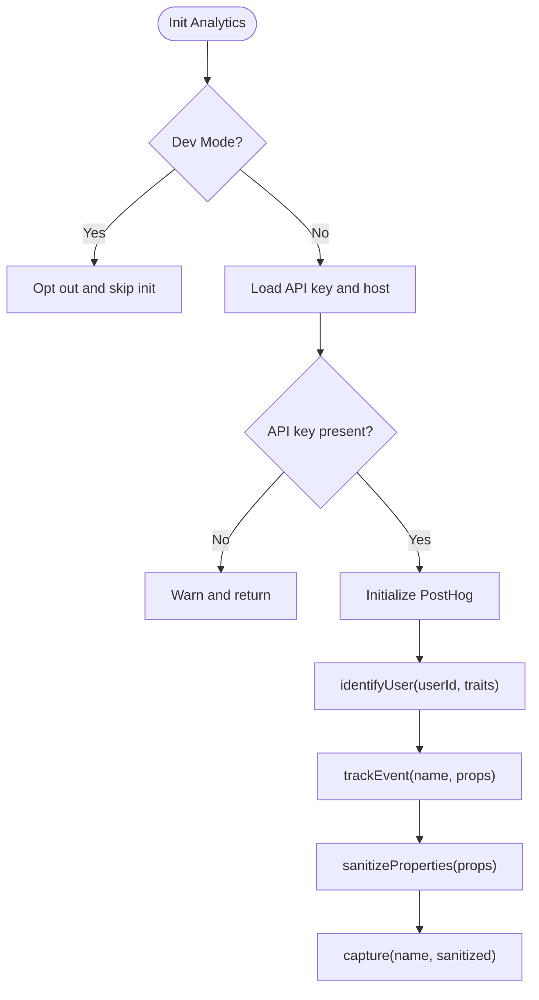
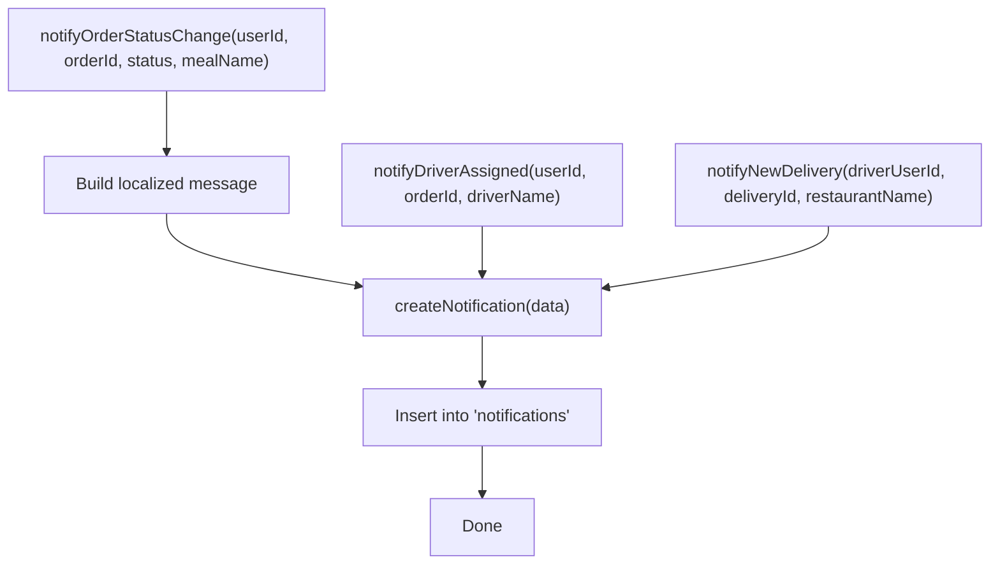
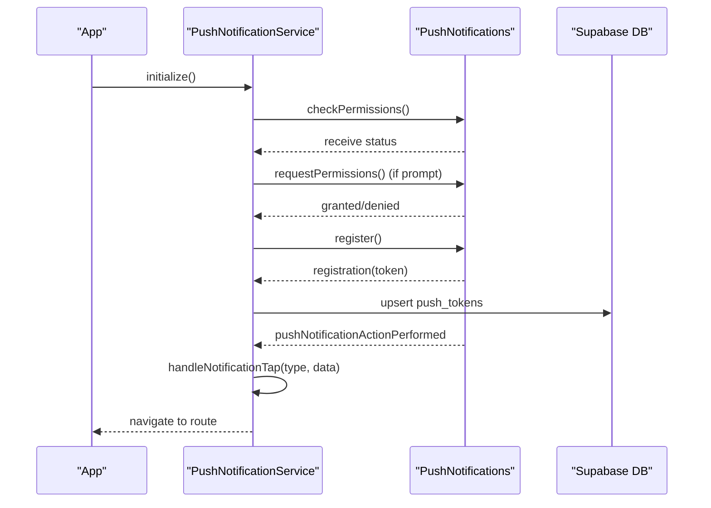
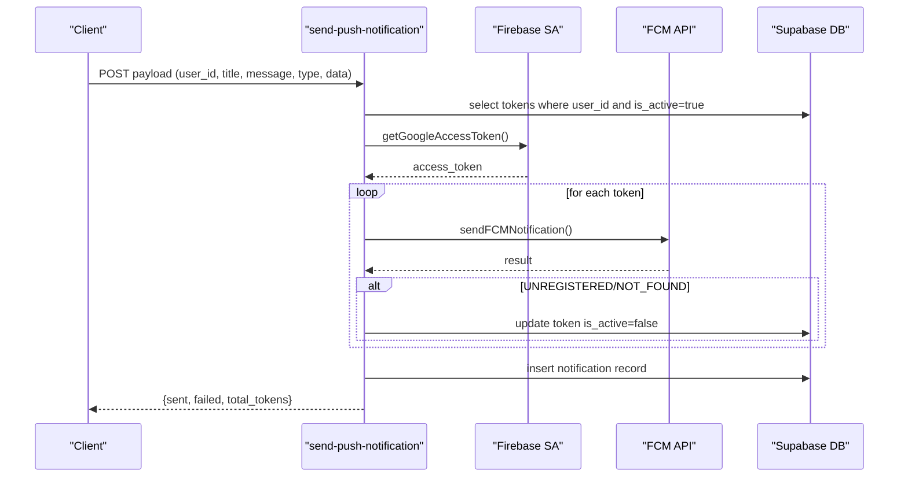
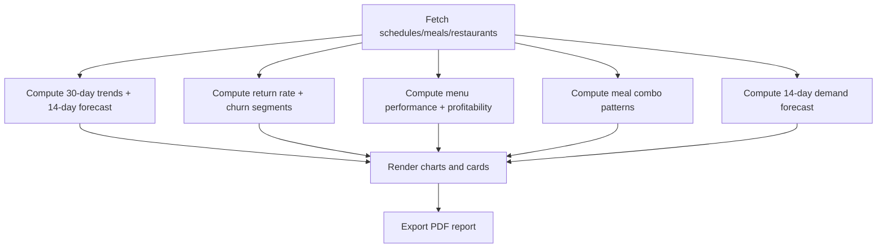
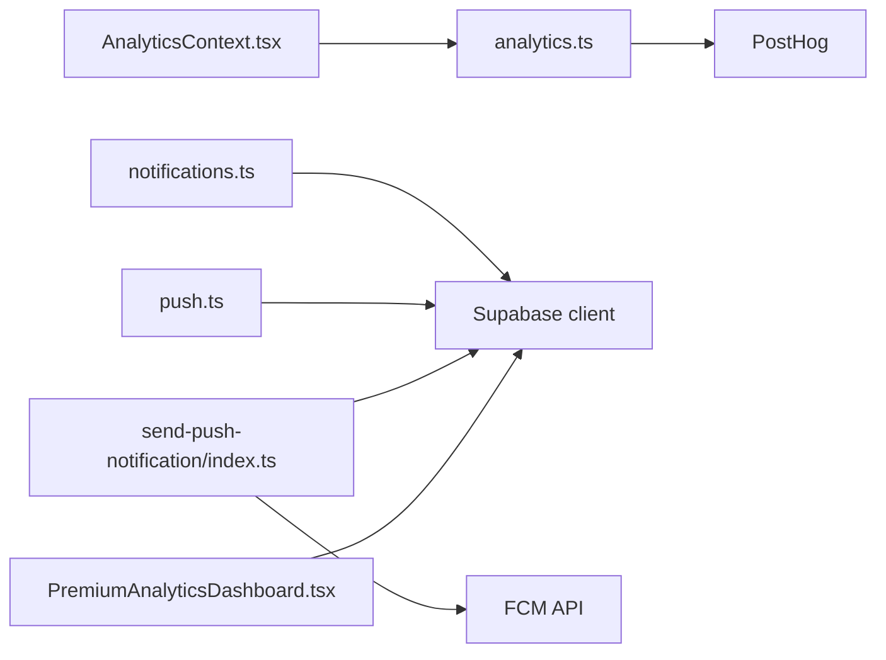
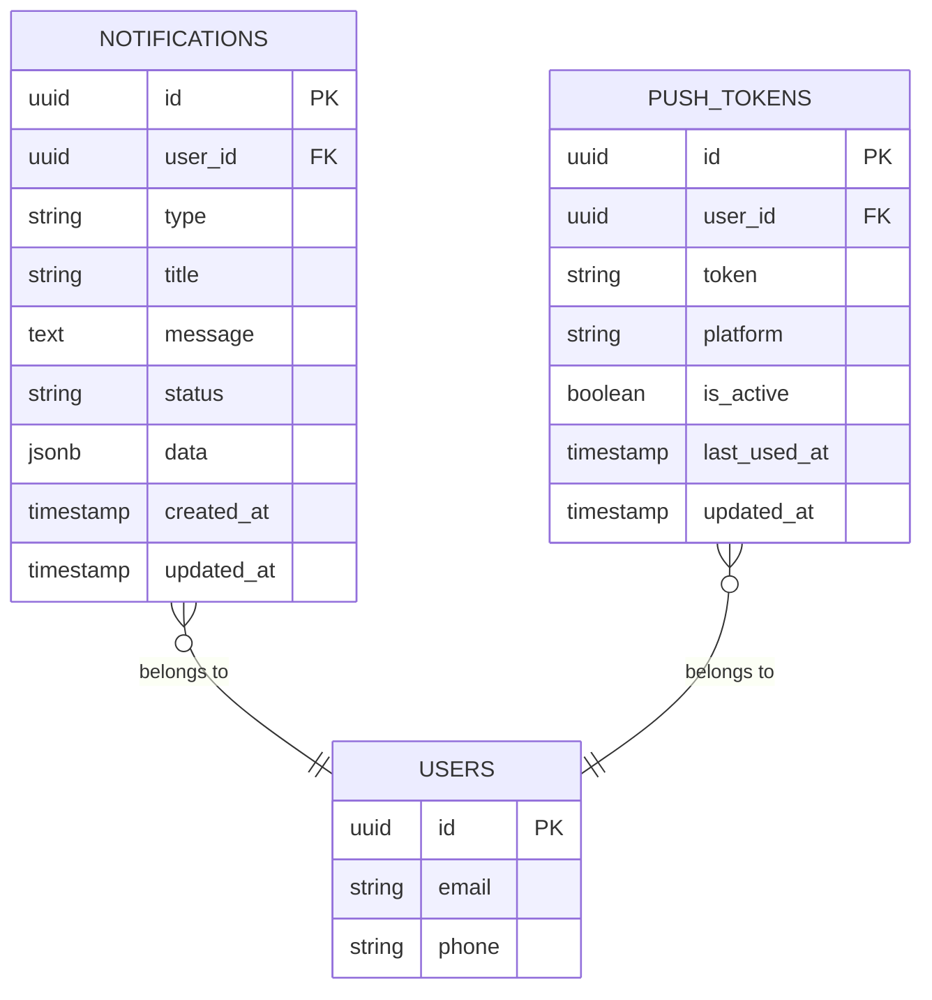

# Notification Analytics & Metrics

<cite>
**Referenced Files in This Document**
- [analytics.ts](file://src/lib/analytics.ts)
- [AnalyticsContext.tsx](file://src/contexts/AnalyticsContext.tsx)
- [notifications.ts](file://src/lib/notifications.ts)
- [push.ts](file://src/lib/notifications/push.ts)
- [send-push-notification/index.ts](file://supabase/functions/send-push-notification/index.ts)
- [PremiumAnalyticsDashboard.tsx](file://src/components/PremiumAnalyticsDashboard.tsx)
- [notifications-workflow.spec.ts](file://e2e/cross-portal/notifications-workflow.spec.ts)
- [notifications.spec.ts](file://e2e/customer/notifications.spec.ts)
- [notifications.spec.ts](file://e2e/driver/notifications.spec.ts)
- [notifications.spec.ts](file://e2e/partner/notifications.spec.ts)
- [notifications.spec.ts](file://e2e/system/notifications.spec.ts)
</cite>

## Table of Contents
1. [Introduction](#introduction)
2. [Project Structure](#project-structure)
3. [Core Components](#core-components)
4. [Architecture Overview](#architecture-overview)
5. [Detailed Component Analysis](#detailed-component-analysis)
6. [Dependency Analysis](#dependency-analysis)
7. [Performance Considerations](#performance-considerations)
8. [Troubleshooting Guide](#troubleshooting-guide)
9. [Conclusion](#conclusion)
10. [Appendices](#appendices)

## Introduction
This document describes the notification analytics and metrics tracking system. It explains how notifications are created, delivered, and tracked; how analytics events are captured and sanitized; and how performance monitoring and privacy controls are implemented. It also documents the analytics data model, event logging, and performance monitoring, along with integration with analytics platforms, data retention policies, and privacy compliance. Finally, it provides practical examples for setting up notification analytics, interpreting metrics reports, and optimizing campaigns based on performance data.

## Project Structure
The notification analytics system spans three primary areas:
- Frontend analytics and local notifications
- Backend Supabase functions for push delivery
- Premium analytics dashboard for reporting and insights

**Diagram sources**
- [AnalyticsContext.tsx:22-39](file://src/contexts/AnalyticsContext.tsx#L22-L39)
- [analytics.ts:3-35](file://src/lib/analytics.ts#L3-L35)
- [notifications.ts:18-35](file://src/lib/notifications.ts#L18-L35)
- [push.ts:25-75](file://src/lib/notifications/push.ts#L25-L75)
- [send-push-notification/index.ts:178-299](file://supabase/functions/send-push-notification/index.ts#L178-L299)
- [PremiumAnalyticsDashboard.tsx:185-526](file://src/components/PremiumAnalyticsDashboard.tsx#L185-L526)

**Section sources**
- [AnalyticsContext.tsx:1-61](file://src/contexts/AnalyticsContext.tsx#L1-L61)
- [analytics.ts:1-170](file://src/lib/analytics.ts#L1-L170)
- [notifications.ts:1-114](file://src/lib/notifications.ts#L1-L114)
- [push.ts:1-137](file://src/lib/notifications/push.ts#L1-L137)
- [send-push-notification/index.ts:1-300](file://supabase/functions/send-push-notification/index.ts#L1-L300)
- [PremiumAnalyticsDashboard.tsx:1-1443](file://src/components/PremiumAnalyticsDashboard.tsx#L1-L1443)

## Core Components
- Analytics initialization and event tracking: Initializes PostHog in production, sanitizes properties, and exposes helpers for common events.
- Analytics context provider: Wraps the app to initialize analytics and expose tracking functions.
- Local notifications: Creates persisted notification records for offline/in-app consumption.
- Push notifications: Handles device token registration, storage, and deep-link navigation on tap.
- Backend push delivery: Resolves user tokens, authenticates with Firebase Cloud Messaging, sends notifications, and persists records.
- Premium analytics dashboard: Aggregates and visualizes performance metrics for business insights.

**Section sources**
- [analytics.ts:3-170](file://src/lib/analytics.ts#L3-L170)
- [AnalyticsContext.tsx:22-61](file://src/contexts/AnalyticsContext.tsx#L22-L61)
- [notifications.ts:18-114](file://src/lib/notifications.ts#L18-L114)
- [push.ts:25-137](file://src/lib/notifications/push.ts#L25-L137)
- [send-push-notification/index.ts:178-299](file://supabase/functions/send-push-notification/index.ts#L178-L299)
- [PremiumAnalyticsDashboard.tsx:185-526](file://src/components/PremiumAnalyticsDashboard.tsx#L185-L526)

## Architecture Overview
The system integrates frontend analytics with backend push delivery and database persistence. Analytics events are captured and sanitized before being sent to PostHog. Notifications are created locally or via backend functions, with push tokens stored and used for targeted delivery. The premium dashboard consumes database aggregates to produce performance reports.

**Diagram sources**
- [AnalyticsContext.tsx:22-39](file://src/contexts/AnalyticsContext.tsx#L22-L39)
- [analytics.ts:3-68](file://src/lib/analytics.ts#L3-L68)
- [notifications.ts:18-35](file://src/lib/notifications.ts#L18-L35)
- [push.ts:25-108](file://src/lib/notifications/push.ts#L25-L108)
- [send-push-notification/index.ts:178-299](file://supabase/functions/send-push-notification/index.ts#L178-L299)

## Detailed Component Analysis

### Analytics Initialization and Event Tracking
- Production gating: PostHog initialization is skipped in development; opt-out occurs when dev mode is detected.
- User identity: Identified users are tracked; PII is stripped before sending.
- Event capture: Events are sanitized to redact sensitive keys; page views are normalized.
- Feature flags: Utility to check feature flags with safe defaults in development.

**Diagram sources**
- [analytics.ts:3-68](file://src/lib/analytics.ts#L3-L68)

**Section sources**
- [analytics.ts:3-68](file://src/lib/analytics.ts#L3-L68)
- [AnalyticsContext.tsx:22-39](file://src/contexts/AnalyticsContext.tsx#L22-L39)

### Analytics Context Provider
- Wraps the app to initialize PostHog on mount.
- Exposes tracking functions for events, page views, user identification, and reset.

**Section sources**
- [AnalyticsContext.tsx:22-61](file://src/contexts/AnalyticsContext.tsx#L22-L61)

### Local Notifications
- Creates persistent notification records with type, title, message, and optional metadata.
- Provides convenience functions for order status updates, driver assignment, and new delivery notifications.

**Diagram sources**
- [notifications.ts:18-114](file://src/lib/notifications.ts#L18-L114)

**Section sources**
- [notifications.ts:18-114](file://src/lib/notifications.ts#L18-L114)

### Push Notifications
- Initializes push permissions on native platforms, requests permission if needed, and registers for tokens.
- Saves tokens to the database with platform and timestamps, deactivating tokens that fail with UNREGISTERED/NOT_FOUND.
- Handles notification taps and navigates to appropriate routes based on notification type.

**Diagram sources**
- [push.ts:25-125](file://src/lib/notifications/push.ts#L25-L125)

**Section sources**
- [push.ts:25-137](file://src/lib/notifications/push.ts#L25-L137)

### Backend Push Delivery Function
- Validates payload and fetches active tokens for the user.
- Generates a Google OAuth2 access token from a service account and sends FCM messages.
- Deactivates tokens that return UNREGISTERED/NOT_FOUND.
- Persists notification records regardless of push delivery status.

**Diagram sources**
- [send-push-notification/index.ts:178-299](file://supabase/functions/send-push-notification/index.ts#L178-L299)

**Section sources**
- [send-push-notification/index.ts:178-299](file://supabase/functions/send-push-notification/index.ts#L178-L299)

### Premium Analytics Dashboard
- Fetches and computes metrics from the database, including:
  - 30-day revenue trends and 14-day forecasts
  - Customer retention and churn segmentation
  - Menu performance matrix and profitability ranking
  - Meal combo patterns and demand forecasting
- Provides exportable HTML reports and interactive charts.

**Diagram sources**
- [PremiumAnalyticsDashboard.tsx:185-526](file://src/components/PremiumAnalyticsDashboard.tsx#L185-L526)

**Section sources**
- [PremiumAnalyticsDashboard.tsx:185-526](file://src/components/PremiumAnalyticsDashboard.tsx#L185-L526)

## Dependency Analysis
- Analytics depends on PostHog client and environment variables for configuration.
- Local notifications depend on Supabase client for database inserts.
- Push service depends on Capacitor plugins and stores tokens via Supabase.
- Backend function depends on Supabase client, Firebase service account secrets, and FCM API.
- Premium dashboard depends on Supabase queries and recharts for visualization.

**Diagram sources**
- [analytics.ts:1-170](file://src/lib/analytics.ts#L1-L170)
- [AnalyticsContext.tsx:1-61](file://src/contexts/AnalyticsContext.tsx#L1-L61)
- [notifications.ts:1-114](file://src/lib/notifications.ts#L1-L114)
- [push.ts:1-137](file://src/lib/notifications/push.ts#L1-L137)
- [send-push-notification/index.ts:1-300](file://supabase/functions/send-push-notification/index.ts#L1-L300)
- [PremiumAnalyticsDashboard.tsx:1-1443](file://src/components/PremiumAnalyticsDashboard.tsx#L1-L1443)

**Section sources**
- [analytics.ts:1-170](file://src/lib/analytics.ts#L1-L170)
- [AnalyticsContext.tsx:1-61](file://src/contexts/AnalyticsContext.tsx#L1-L61)
- [notifications.ts:1-114](file://src/lib/notifications.ts#L1-L114)
- [push.ts:1-137](file://src/lib/notifications/push.ts#L1-L137)
- [send-push-notification/index.ts:1-300](file://supabase/functions/send-push-notification/index.ts#L1-L300)
- [PremiumAnalyticsDashboard.tsx:1-1443](file://src/components/PremiumAnalyticsDashboard.tsx#L1-L1443)

## Performance Considerations
- Token deactivation: Backend function automatically deactivates invalid tokens to reduce retry failures and improve throughput.
- Asynchronous dispatch: Push delivery uses concurrent sends with aggregated results to minimize latency.
- Chart rendering: Premium dashboard precomputes aggregates and renders responsive charts to avoid heavy client-side computations.
- Environment gating: Analytics and push initialization are gated to native environments and production builds to avoid unnecessary overhead.

[No sources needed since this section provides general guidance]

## Troubleshooting Guide
- Analytics not capturing events:
  - Verify PostHog API key and host environment variables.
  - Confirm initialization runs only in production.
  - Check property sanitization for sensitive keys.
- Push notifications not received:
  - Ensure platform is native and permissions are granted.
  - Confirm token is stored and active in the database.
  - Inspect backend function logs for UNREGISTERED/NOT_FOUND and token deactivation.
- Tokens not persisting:
  - Check user authentication state before saving tokens.
  - Verify upsert conflict resolution on user_id and token combination.
- Premium dashboard missing data:
  - Confirm database tables and relationships exist.
  - Validate time range filters and date string comparisons.

**Section sources**
- [analytics.ts:3-68](file://src/lib/analytics.ts#L3-L68)
- [push.ts:77-108](file://src/lib/notifications/push.ts#L77-L108)
- [send-push-notification/index.ts:259-271](file://supabase/functions/send-push-notification/index.ts#L259-L271)
- [PremiumAnalyticsDashboard.tsx:185-526](file://src/components/PremiumAnalyticsDashboard.tsx#L185-L526)

## Conclusion
The notification analytics and metrics system combines frontend analytics, local and push notifications, and backend delivery with robust privacy controls and performance optimizations. The premium analytics dashboard transforms raw data into actionable insights, enabling informed campaign decisions and continuous improvement.

[No sources needed since this section summarizes without analyzing specific files]

## Appendices

### Analytics Data Model
- Analytics events: Captured with sanitized properties and user identification.
- Notifications: Stored with user_id, type, title, message, status, and optional metadata.
- Push tokens: Stored with user_id, token, platform, activation status, and timestamps.

**Diagram sources**
- [send-push-notification/index.ts:226-281](file://supabase/functions/send-push-notification/index.ts#L226-L281)
- [push.ts:88-98](file://src/lib/notifications/push.ts#L88-L98)
- [notifications.ts:20-27](file://src/lib/notifications.ts#L20-L27)

### Event Logging and Privacy Controls
- Event tracking: Centralized helpers for common actions; properties sanitized to remove sensitive keys.
- Privacy: PII fields removed before sending; opt-out in development; feature flags guarded in dev.

**Section sources**
- [analytics.ts:56-160](file://src/lib/analytics.ts#L56-L160)

### Performance Monitoring
- Backend function: Tracks sent/failure counts and deactivates invalid tokens.
- Frontend: Logs registration and tap actions; handles errors gracefully.

**Section sources**
- [send-push-notification/index.ts:244-271](file://supabase/functions/send-push-notification/index.ts#L244-L271)
- [push.ts:53-71](file://src/lib/notifications/push.ts#L53-L71)

### Setting Up Notification Analytics
- Initialize analytics provider at app root.
- Configure PostHog API key and host in environment variables.
- Use local notification helpers to create records for in-app consumption.
- Integrate push service initialization and token storage.
- Trigger backend push function with required payload fields.

**Section sources**
- [AnalyticsContext.tsx:22-39](file://src/contexts/AnalyticsContext.tsx#L22-L39)
- [analytics.ts:3-35](file://src/lib/analytics.ts#L3-L35)
- [notifications.ts:18-35](file://src/lib/notifications.ts#L18-L35)
- [push.ts:25-108](file://src/lib/notifications/push.ts#L25-L108)
- [send-push-notification/index.ts:178-208](file://supabase/functions/send-push-notification/index.ts#L178-L208)

### Interpreting Metrics Reports
- Premium dashboard highlights:
  - Weekly vs last week performance snapshot
  - 30-day growth metrics
  - Revenue forecast
  - Customer retention and churn segments
  - Menu performance matrix and profitability
  - Meal combo patterns and 14-day demand forecast
- Use exported reports to share insights and drive decisions.

**Section sources**
- [PremiumAnalyticsDashboard.tsx:921-1442](file://src/components/PremiumAnalyticsDashboard.tsx#L921-L1442)

### Optimizing Notification Campaigns
- Use retention and churn insights to target at-risk customers with personalized offers.
- Align push timing with peak ordering hours and high-demand days.
- Leverage menu performance and combo patterns to suggest bundled promotions.
- Monitor delivery and open rates via backend delivery logs and adjust targeting.

**Section sources**
- [PremiumAnalyticsDashboard.tsx:328-435](file://src/components/PremiumAnalyticsDashboard.tsx#L328-L435)
- [send-push-notification/index.ts:244-271](file://supabase/functions/send-push-notification/index.ts#L244-L271)

### End-to-End Testing Coverage
- Cross-portal and role-specific notification workflows validated in E2E tests.

**Section sources**
- [notifications-workflow.spec.ts](file://e2e/cross-portal/notifications-workflow.spec.ts)
- [notifications.spec.ts](file://e2e/customer/notifications.spec.ts)
- [notifications.spec.ts](file://e2e/driver/notifications.spec.ts)
- [notifications.spec.ts](file://e2e/partner/notifications.spec.ts)
- [notifications.spec.ts](file://e2e/system/notifications.spec.ts)