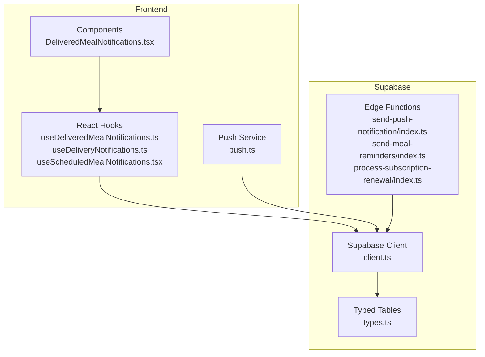
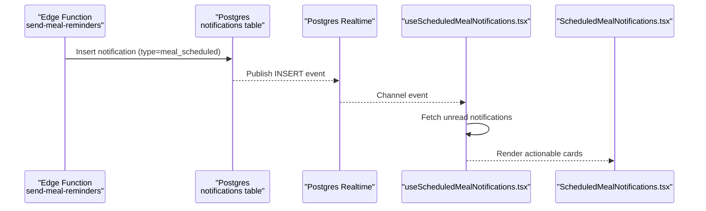
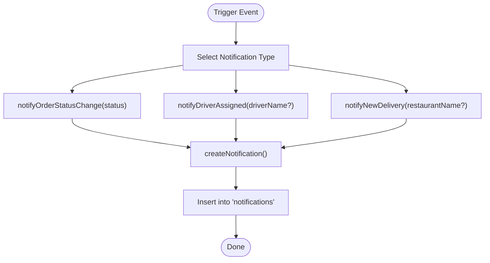
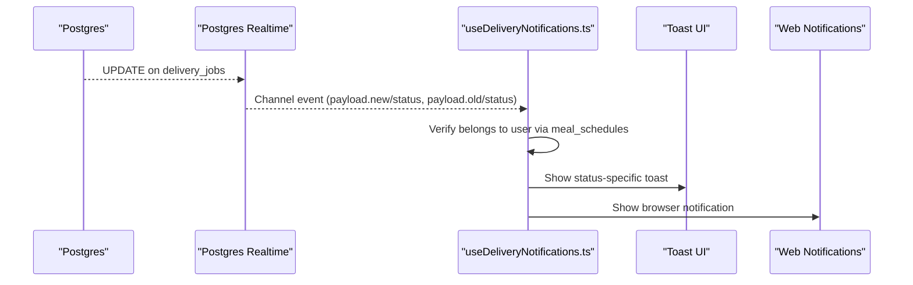
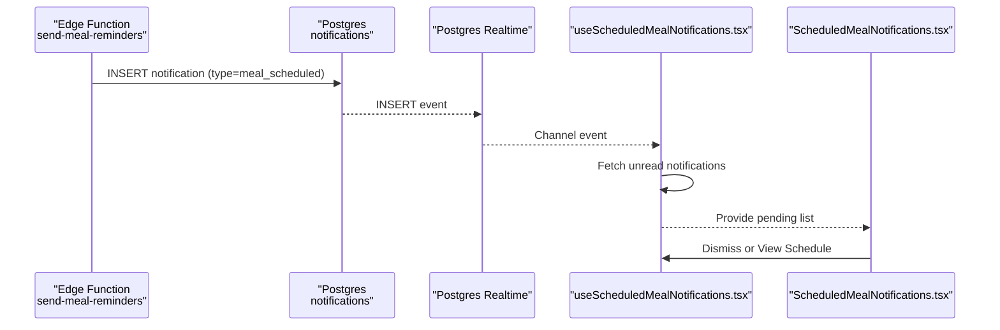
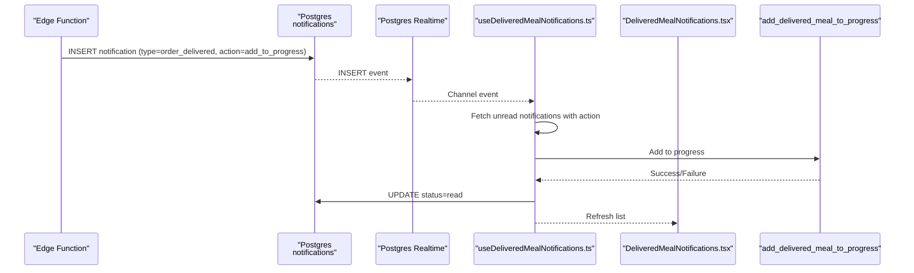
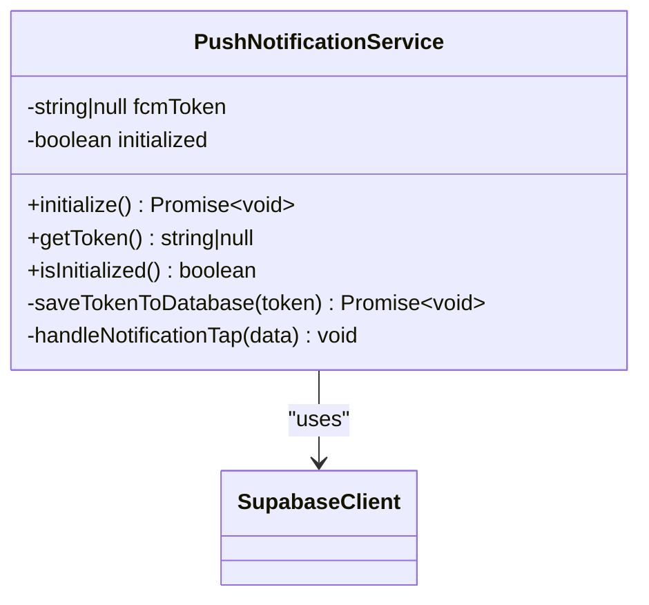
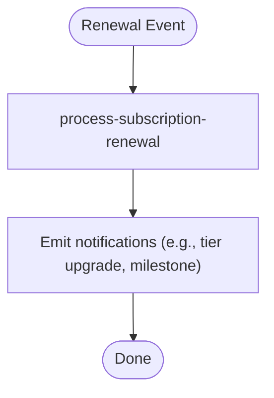
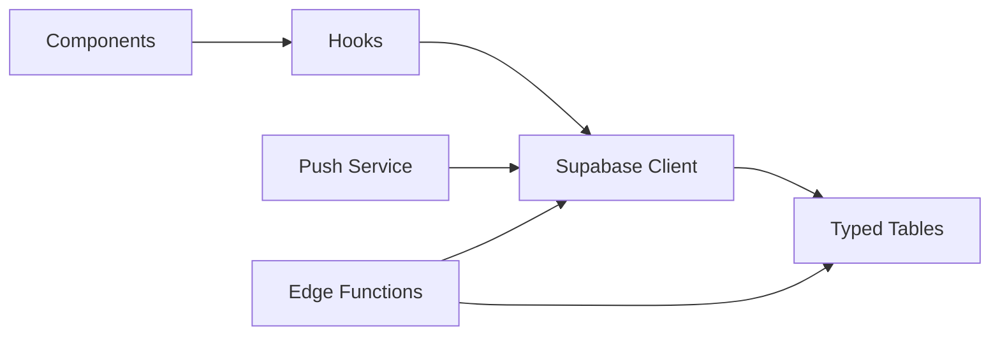

# Notification Triggers & Events

<cite>
**Referenced Files in This Document**
- [notifications.ts](file://src/lib/notifications.ts)
- [push.ts](file://src/lib/notifications/push.ts)
- [useDeliveredMealNotifications.ts](file://src/hooks/useDeliveredMealNotifications.ts)
- [useDeliveryNotifications.ts](file://src/hooks/useDeliveryNotifications.ts)
- [useScheduledMealNotifications.tsx](file://src/hooks/useScheduledMealNotifications.tsx)
- [DeliveredMealNotifications.tsx](file://src/components/DeliveredMealNotifications.tsx)
- [client.ts](file://src/integrations/supabase/client.ts)
- [types.ts](file://supabase/types.ts)
- [send-push-notification/index.ts](file://supabase/functions/send-push-notification/index.ts)
- [send-meal-reminders/index.ts](file://supabase/functions/send-meal-reminders/index.ts)
- [process-subscription-renewal/index.ts](file://supabase/functions/process-subscription-renewal/index.ts)
- [notifications-workflow.spec.ts](file://e2e/cross-portal/notifications-workflow.spec.ts)
- [notifications.spec.ts (customer)](file://e2e/customer/notifications.spec.ts)
- [notifications.spec.ts (driver)](file://e2e/driver/notifications.spec.ts)
- [notifications.spec.ts (partner)](file://e2e/partner/notifications.spec.ts)
- [notifications.spec.ts (system)](file://e2e/system/notifications.spec.ts)
</cite>

## Table of Contents
1. [Introduction](#introduction)
2. [Project Structure](#project-structure)
3. [Core Components](#core-components)
4. [Architecture Overview](#architecture-overview)
5. [Detailed Component Analysis](#detailed-component-analysis)
6. [Dependency Analysis](#dependency-analysis)
7. [Performance Considerations](#performance-considerations)
8. [Troubleshooting Guide](#troubleshooting-guide)
9. [Conclusion](#conclusion)
10. [Appendices](#appendices)

## Introduction
This document explains the notification trigger mechanisms and event-driven systems across the customer, driver, and partner portals. It covers:
- Notification triggers for order status changes, delivery updates, scheduled meal reminders, subscription renewals, and user engagement events
- Event sourcing pattern for notification generation, trigger conditions, and timing mechanisms
- Delivery notification system, scheduled reminder system, and real-time event processing
- Integration between frontend hooks and backend trigger functions, including error handling and retry logic
- Examples for implementing custom notification triggers and extending the event system

## Project Structure
The notification system spans frontend React hooks and Supabase edge functions:
- Frontend triggers and consumers: React hooks and components manage real-time subscriptions and user actions
- Backend triggers: Supabase Edge Functions emit notifications for reminders, renewals, and push delivery
- Shared infrastructure: Supabase client, typed Supabase tables, and Postgres Realtime channels

**Diagram sources**
- [client.ts](file://src/integrations/supabase/client.ts)
- [types.ts](file://supabase/types.ts)
- [useDeliveredMealNotifications.ts](file://src/hooks/useDeliveredMealNotifications.ts)
- [useDeliveryNotifications.ts](file://src/hooks/useDeliveryNotifications.ts)
- [useScheduledMealNotifications.tsx](file://src/hooks/useScheduledMealNotifications.tsx)
- [DeliveredMealNotifications.tsx](file://src/components/DeliveredMealNotifications.tsx)
- [push.ts](file://src/lib/notifications/push.ts)
- [send-push-notification/index.ts](file://supabase/functions/send-push-notification/index.ts)
- [send-meal-reminders/index.ts](file://supabase/functions/send-meal-reminders/index.ts)
- [process-subscription-renewal/index.ts](file://supabase/functions/process-subscription-renewal/index.ts)

**Section sources**
- [client.ts](file://src/integrations/supabase/client.ts)
- [types.ts](file://supabase/types.ts)

## Core Components
- Notification creation and order-related triggers: centralized in a library module that inserts records into the notifications table and provides helper functions for common scenarios.
- Real-time delivery updates: a hook subscribes to Postgres changes on the delivery_jobs table and emits browser and toast notifications.
- Scheduled meal reminders: a hook subscribes to notifications of type meal_scheduled and surfaces actionable UI cards.
- Delivered meal progress integration: a hook consumes notifications of type order_delivered with a specific action to add delivered meals to user progress.
- Push notifications: a singleton service initializes device permissions, registers tokens, and handles deep-link navigation on tap.

Key responsibilities:
- Trigger generation: Supabase Edge Functions insert notifications and publish to Postgres Realtime channels
- Consumption: Frontend hooks subscribe to channels and react to changes
- User actions: Components allow users to act on notifications (e.g., add to progress, view schedule)

**Section sources**
- [notifications.ts](file://src/lib/notifications.ts)
- [useDeliveryNotifications.ts](file://src/hooks/useDeliveryNotifications.ts)
- [useScheduledMealNotifications.tsx](file://src/hooks/useScheduledMealNotifications.tsx)
- [useDeliveredMealNotifications.ts](file://src/hooks/useDeliveredMealNotifications.ts)
- [push.ts](file://src/lib/notifications/push.ts)

## Architecture Overview
The system follows an event-driven architecture:
- Event producers: Supabase Edge Functions write notifications to the notifications table and rely on Postgres Realtime to broadcast changes
- Event consumers: Frontend hooks subscribe to channels and update UI/react to user actions
- Push delivery: A dedicated Edge Function sends push notifications via FCM; the frontend push service persists tokens and handles taps

**Diagram sources**
- [send-meal-reminders/index.ts](file://supabase/functions/send-meal-reminders/index.ts)
- [useScheduledMealNotifications.tsx](file://src/hooks/useScheduledMealNotifications.tsx)
- [DeliveredMealNotifications.tsx](file://src/components/DeliveredMealNotifications.tsx)

## Detailed Component Analysis

### Notification Library and Order Triggers
The notification library centralizes creation and common scenarios:
- Notification creation writes to the notifications table with fields for user, type, title, message, and optional metadata
- Helper functions encapsulate order status transitions and driver assignment
- New delivery notifications target drivers

**Diagram sources**
- [notifications.ts](file://src/lib/notifications.ts)

**Section sources**
- [notifications.ts](file://src/lib/notifications.ts)

### Real-Time Delivery Updates
The delivery notifications hook listens for updates on the delivery_jobs table and filters by the current user’s associated schedules. It emits toast and browser notifications based on status transitions.

**Diagram sources**
- [useDeliveryNotifications.ts](file://src/hooks/useDeliveryNotifications.ts)

**Section sources**
- [useDeliveryNotifications.ts](file://src/hooks/useDeliveryNotifications.ts)

### Scheduled Meal Reminders
The scheduled meal notifications hook fetches unread notifications of type meal_scheduled and renders actionable cards. Users can view their schedule or dismiss notifications.

**Diagram sources**
- [send-meal-reminders/index.ts](file://supabase/functions/send-meal-reminders/index.ts)
- [useScheduledMealNotifications.tsx](file://src/hooks/useScheduledMealNotifications.tsx)
- [DeliveredMealNotifications.tsx](file://src/components/DeliveredMealNotifications.tsx)

**Section sources**
- [useScheduledMealNotifications.tsx](file://src/hooks/useScheduledMealNotifications.tsx)

### Delivered Meal Progress Integration
This hook listens for order_delivered notifications with a specific action to add delivered meals to the user’s progress. It calls a stored procedure and marks the notification as read.

**Diagram sources**
- [useDeliveredMealNotifications.ts](file://src/hooks/useDeliveredMealNotifications.ts)
- [DeliveredMealNotifications.tsx](file://src/components/DeliveredMealNotifications.tsx)

**Section sources**
- [useDeliveredMealNotifications.ts](file://src/hooks/useDeliveredMealNotifications.ts)

### Push Notification Service
The push service manages device permissions, token registration, and tap handling. It persists tokens to the push_tokens table and navigates to relevant views based on notification type.

**Diagram sources**
- [push.ts](file://src/lib/notifications/push.ts)
- [client.ts](file://src/integrations/supabase/client.ts)

**Section sources**
- [push.ts](file://src/lib/notifications/push.ts)

### Subscription Renewal Trigger
The subscription renewal function processes renewals and can emit notifications for user engagement events.

**Diagram sources**
- [process-subscription-renewal/index.ts](file://supabase/functions/process-subscription-renewal/index.ts)

**Section sources**
- [process-subscription-renewal/index.ts](file://supabase/functions/process-subscription-renewal/index.ts)

## Dependency Analysis
- Frontend hooks depend on the Supabase client for authentication and Realtime subscriptions
- Edge functions depend on Supabase client and typed Supabase tables
- Push service depends on Capacitor plugins and Supabase client for token persistence
- Components depend on hooks for state and actions

**Diagram sources**
- [client.ts](file://src/integrations/supabase/client.ts)
- [types.ts](file://supabase/types.ts)
- [useDeliveredMealNotifications.ts](file://src/hooks/useDeliveredMealNotifications.ts)
- [useDeliveryNotifications.ts](file://src/hooks/useDeliveryNotifications.ts)
- [useScheduledMealNotifications.tsx](file://src/hooks/useScheduledMealNotifications.tsx)
- [DeliveredMealNotifications.tsx](file://src/components/DeliveredMealNotifications.tsx)
- [push.ts](file://src/lib/notifications/push.ts)
- [send-push-notification/index.ts](file://supabase/functions/send-push-notification/index.ts)
- [send-meal-reminders/index.ts](file://supabase/functions/send-meal-reminders/index.ts)
- [process-subscription-renewal/index.ts](file://supabase/functions/process-subscription-renewal/index.ts)

**Section sources**
- [client.ts](file://src/integrations/supabase/client.ts)
- [types.ts](file://supabase/types.ts)

## Performance Considerations
- Minimize redundant queries: batch fetches and leverage Realtime channels to avoid polling
- Limit notification payload sizes: keep metadata concise to reduce network overhead
- Debounce user actions: throttle repeated dismiss/add operations in components
- Token lifecycle: ensure tokens are refreshed and cleaned up to prevent stale entries
- Edge function idempotency: guard against duplicate notifications by checking existing records before insertion

## Troubleshooting Guide
Common issues and resolutions:
- Permission denied for push notifications: verify platform checks and user-initiated permission requests
- Missing notifications in UI: confirm Realtime channel filters and subscription lifecycles
- Stale types causing runtime errors: use raw SQL or casts when invoking stored procedures or selecting with filters
- Authentication failures during token save: ensure user session exists before persisting tokens
- Edge function errors: wrap insertions with error checks and consider retry/backoff strategies

**Section sources**
- [push.ts](file://src/lib/notifications/push.ts)
- [useDeliveredMealNotifications.ts](file://src/hooks/useDeliveredMealNotifications.ts)
- [useDeliveryNotifications.ts](file://src/hooks/useDeliveryNotifications.ts)
- [useScheduledMealNotifications.tsx](file://src/hooks/useScheduledMealNotifications.tsx)

## Conclusion
The notification system combines backend-triggered events with robust frontend consumption. Supabase Edge Functions generate notifications, Postgres Realtime broadcasts changes, and React hooks render contextual UI and handle user actions. The push service completes the loop by enabling cross-platform delivery and navigation.

## Appendices

### Event Sourcing Pattern for Notifications
- Event producers: Edge Functions insert notifications into the notifications table
- Event consumers: Frontend hooks subscribe to channels and update local state
- Idempotency: Guard against duplicates by checking existing records before emitting
- Retries: Implement exponential backoff for transient failures in edge functions

**Section sources**
- [send-push-notification/index.ts](file://supabase/functions/send-push-notification/index.ts)
- [send-meal-reminders/index.ts](file://supabase/functions/send-meal-reminders/index.ts)
- [process-subscription-renewal/index.ts](file://supabase/functions/process-subscription-renewal/index.ts)

### Trigger Conditions and Timing Mechanisms
- Order status changes: emitted when order status transitions; consumed by order update notifications
- Delivery updates: emitted on delivery_jobs status changes; filtered by user via meal_schedules
- Scheduled reminders: emitted on schedule creation; consumed by scheduled meal notifications
- Subscription renewals: emitted after successful renewal; can trigger engagement notifications
- User engagement: delivered meal progress integration allows quick addition to progress

**Section sources**
- [useDeliveryNotifications.ts](file://src/hooks/useDeliveryNotifications.ts)
- [useScheduledMealNotifications.tsx](file://src/hooks/useScheduledMealNotifications.tsx)
- [useDeliveredMealNotifications.ts](file://src/hooks/useDeliveredMealNotifications.ts)

### Frontend Hook Integration and Error Handling
- Realtime subscriptions: ensure proper unsubscribe on component unmount
- Toast and browser notifications: gate behind permission checks
- Stored procedure calls: use casts to bypass stale generated types
- Retry logic: implement for transient DB errors and token saves

**Section sources**
- [useDeliveryNotifications.ts](file://src/hooks/useDeliveryNotifications.ts)
- [useScheduledMealNotifications.tsx](file://src/hooks/useScheduledMealNotifications.tsx)
- [useDeliveredMealNotifications.ts](file://src/hooks/useDeliveredMealNotifications.ts)

### Implementing Custom Notification Triggers
Steps to add a new notification type:
1. Define a helper in the notification library to insert records with appropriate metadata
2. Create an Edge Function to emit the notification on relevant events
3. Add a frontend hook to subscribe to the new notification type via Realtime
4. Build a component to render and handle user actions for the notification
5. Test with E2E specs covering the new workflow

Example references:
- New notification helper: [notifications.ts](file://src/lib/notifications.ts)
- Edge Function emission: [send-push-notification/index.ts](file://supabase/functions/send-push-notification/index.ts)
- Realtime subscription: [useScheduledMealNotifications.tsx](file://src/hooks/useScheduledMealNotifications.tsx)
- Component rendering: [DeliveredMealNotifications.tsx](file://src/components/DeliveredMealNotifications.tsx)

**Section sources**
- [notifications.ts](file://src/lib/notifications.ts)
- [send-push-notification/index.ts](file://supabase/functions/send-push-notification/index.ts)
- [useScheduledMealNotifications.tsx](file://src/hooks/useScheduledMealNotifications.tsx)
- [DeliveredMealNotifications.tsx](file://src/components/DeliveredMealNotifications.tsx)

### E2E Coverage
End-to-end tests validate notification workflows across portals:
- Cross-portal workflow: [notifications-workflow.spec.ts](file://e2e/cross-portal/notifications-workflow.spec.ts)
- Customer portal: [notifications.spec.ts](file://e2e/customer/notifications.spec.ts)
- Driver portal: [notifications.spec.ts](file://e2e/driver/notifications.spec.ts)
- Partner portal: [notifications.spec.ts](file://e2e/partner/notifications.spec.ts)
- System-level: [notifications.spec.ts](file://e2e/system/notifications.spec.ts)

**Section sources**
- [notifications-workflow.spec.ts](file://e2e/cross-portal/notifications-workflow.spec.ts)
- [notifications.spec.ts (customer)](file://e2e/customer/notifications.spec.ts)
- [notifications.spec.ts (driver)](file://e2e/driver/notifications.spec.ts)
- [notifications.spec.ts (partner)](file://e2e/partner/notifications.spec.ts)
- [notifications.spec.ts (system)](file://e2e/system/notifications.spec.ts)