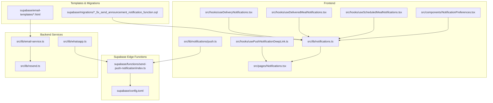
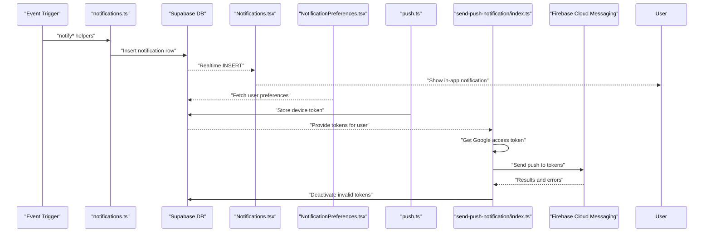
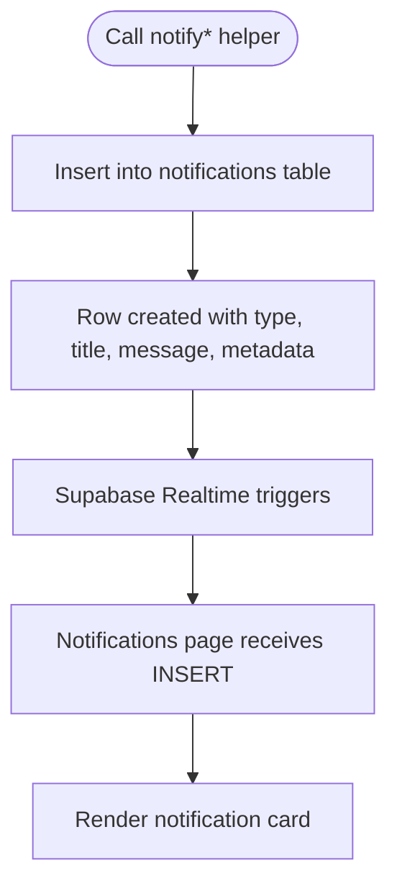
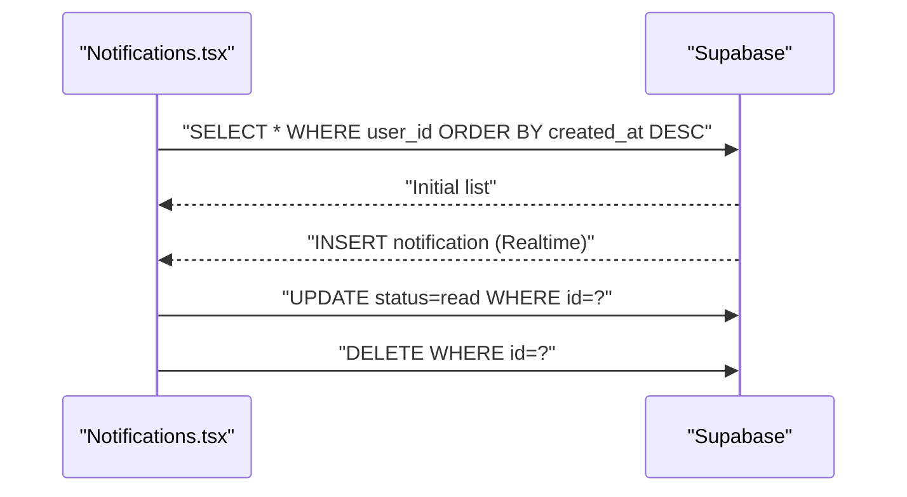
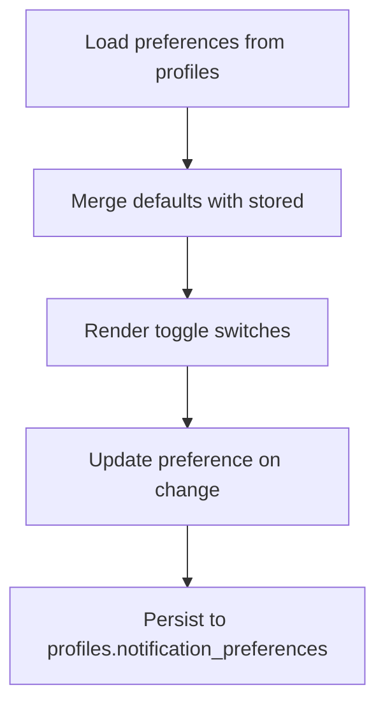
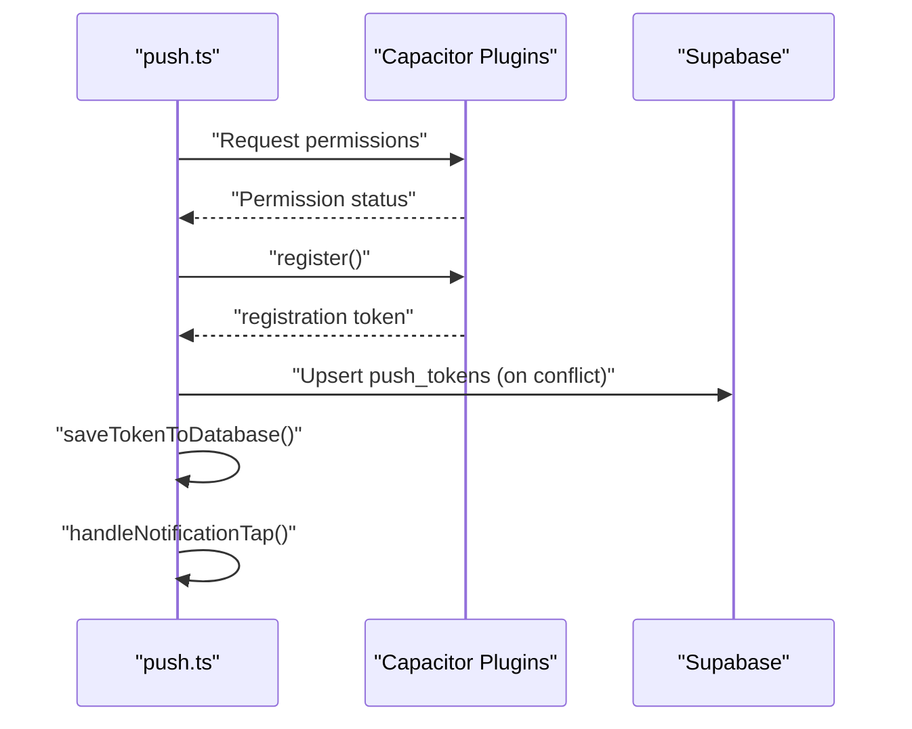
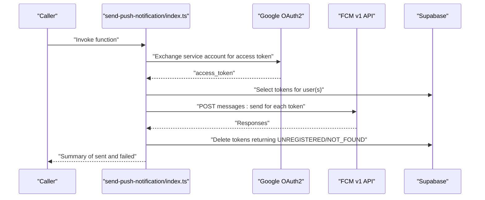
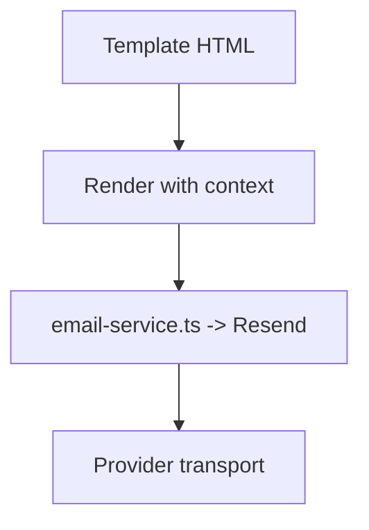
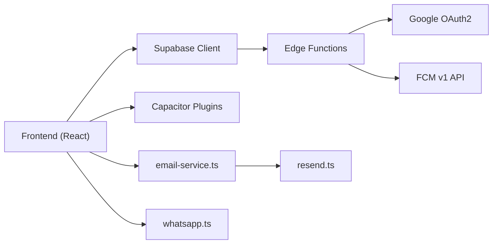

# Push Notifications

<cite>
**Referenced Files in This Document**
- [notifications.ts](file://src/lib/notifications.ts)
- [Notifications.tsx](file://src/pages/Notifications.tsx)
- [NotificationPreferences.tsx](file://src/components/NotificationPreferences.tsx)
- [push.ts](file://src/lib/notifications/push.ts)
- [push.test.ts](file://src/lib/notifications/push.test.ts)
- [send-push-notification/index.ts](file://supabase/functions/send-push-notification/index.ts)
- [config.toml](file://supabase/config.toml)
- [20260303143000_fix_send_announcement_notification_function.sql](file://supabase/migrations/20260303143000_fix_send_announcement_notification_function.sql)
- [email-templates/confirm-signup.html](file://supabase/email-templates/confirm-signup.html)
- [email-templates/reset-password.html](file://supabase/email-templates/reset-password.html)
- [email-templates/invite-user.html](file://supabase/email-templates/invite-user.html)
- [email-service.ts](file://src/lib/email-service.ts)
- [resend.ts](file://src/lib/resend.ts)
- [whatsapp.ts](file://src/lib/whatsapp.ts)
- [useScheduledMealNotifications.tsx](file://src/hooks/useScheduledMealNotifications.tsx)
- [useDeliveredMealNotifications.tsx](file://src/hooks/useDeliveredMealNotifications.tsx)
- [useDeliveryNotifications.tsx](file://src/hooks/useDeliveryNotifications.tsx)
- [usePushNotificationDeepLink.ts](file://src/hooks/usePushNotificationDeepLink.ts)
- [Notifications.tsx](file://src/pages/Notifications.tsx)
</cite>

## Table of Contents
1. [Introduction](#introduction)
2. [Project Structure](#project-structure)
3. [Core Components](#core-components)
4. [Architecture Overview](#architecture-overview)
5. [Detailed Component Analysis](#detailed-component-analysis)
6. [Dependency Analysis](#dependency-analysis)
7. [Performance Considerations](#performance-considerations)
8. [Troubleshooting Guide](#troubleshooting-guide)
9. [Conclusion](#conclusion)
10. [Appendices](#appendices)

## Introduction
This document describes the multi-channel notification system used by the application, focusing on push notifications, email alerts, and in-app messaging. It explains how notifications are triggered, stored, and delivered, how user preferences are managed, and how delivery status is tracked. It also covers the Supabase edge function implementation for push notification processing, notification templates, scheduling, and integrations with Firebase Cloud Messaging (FCM), email service providers, and WhatsApp. Finally, it documents batching, retry mechanisms, and delivery optimization strategies, along with practical examples for creating notifications, managing templates, and tracking user engagement.

## Project Structure
The notification system spans frontend libraries, UI pages, Supabase edge functions, and database migrations. Key areas include:
- Frontend notification creation and display
- User preference management
- Push notification lifecycle (registration, storage, sending)
- Email and WhatsApp delivery channels
- In-app notification inbox with real-time updates
- Supabase edge functions for push delivery and scheduled reminders

**Diagram sources**
- [notifications.ts:1-114](file://src/lib/notifications.ts#L1-L114)
- [push.ts:40-80](file://src/lib/notifications/push.ts#L40-L80)
- [Notifications.tsx:1-254](file://src/pages/Notifications.tsx#L1-L254)
- [NotificationPreferences.tsx:1-198](file://src/components/NotificationPreferences.tsx#L1-L198)
- [useScheduledMealNotifications.tsx](file://src/hooks/useScheduledMealNotifications.tsx)
- [useDeliveredMealNotifications.tsx](file://src/hooks/useDeliveredMealNotifications.tsx)
- [useDeliveryNotifications.tsx](file://src/hooks/useDeliveryNotifications.tsx)
- [usePushNotificationDeepLink.ts](file://src/hooks/usePushNotificationDeepLink.ts)
- [send-push-notification/index.ts:105-266](file://supabase/functions/send-push-notification/index.ts#L105-L266)
- [config.toml:1-59](file://supabase/config.toml#L1-L59)
- [email-templates/confirm-signup.html](file://supabase/email-templates/confirm-signup.html)
- [email-templates/reset-password.html](file://supabase/email-templates/reset-password.html)
- [email-templates/invite-user.html](file://supabase/email-templates/invite-user.html)
- [email-service.ts](file://src/lib/email-service.ts)
- [resend.ts](file://src/lib/resend.ts)
- [whatsapp.ts](file://src/lib/whatsapp.ts)
- [20260303143000_fix_send_announcement_notification_function.sql:1-48](file://supabase/migrations/20260303143000_fix_send_announcement_notification_function.sql#L1-L48)

**Section sources**
- [notifications.ts:1-114](file://src/lib/notifications.ts#L1-L114)
- [Notifications.tsx:1-254](file://src/pages/Notifications.tsx#L1-L254)
- [NotificationPreferences.tsx:1-198](file://src/components/NotificationPreferences.tsx#L1-L198)
- [send-push-notification/index.ts:105-266](file://supabase/functions/send-push-notification/index.ts#L105-L266)
- [config.toml:1-59](file://supabase/config.toml#L1-L59)

## Core Components
- Notification creation and helpers: centralized logic to insert notifications into the database and standardized templates for order updates, driver assignments, and new deliveries.
- In-app notification inbox: real-time listing, filtering, marking as read, and deletion with Supabase Realtime.
- User preference management: granular controls for push, email, and WhatsApp delivery per notification category.
- Push notification service: Capacitor-based registration, token storage, and deep-link handling.
- Supabase edge function for push: batch delivery to multiple tokens, OAuth2 access token retrieval, and deactivation of invalid tokens.
- Email and WhatsApp channels: templates and service integrations for off-platform alerts.
- Scheduling and reminders: hooks to trigger notifications at scheduled times.

**Section sources**
- [notifications.ts:1-114](file://src/lib/notifications.ts#L1-L114)
- [Notifications.tsx:1-254](file://src/pages/Notifications.tsx#L1-L254)
- [NotificationPreferences.tsx:1-198](file://src/components/NotificationPreferences.tsx#L1-L198)
- [push.ts:40-80](file://src/lib/notifications/push.ts#L40-L80)
- [send-push-notification/index.ts:105-266](file://supabase/functions/send-push-notification/index.ts#L105-L266)
- [email-service.ts](file://src/lib/email-service.ts)
- [resend.ts](file://src/lib/resend.ts)
- [whatsapp.ts](file://src/lib/whatsapp.ts)
- [useScheduledMealNotifications.tsx](file://src/hooks/useScheduledMealNotifications.tsx)
- [useDeliveredMealNotifications.tsx](file://src/hooks/useDeliveredMealNotifications.tsx)
- [useDeliveryNotifications.tsx](file://src/hooks/useDeliveryNotifications.tsx)

## Architecture Overview
The system integrates multiple channels:
- Push: device tokens stored in Supabase, edge function sends via FCM, with automatic invalid token deactivation.
- Email: templates under Supabase email-templates, integrated via email-service and Resend.
- WhatsApp: separate integration via dedicated service module.
- In-app: notifications persisted in Supabase and streamed via Realtime to the Notifications page.

**Diagram sources**
- [notifications.ts:18-35](file://src/lib/notifications.ts#L18-L35)
- [Notifications.tsx:89-96](file://src/pages/Notifications.tsx#L89-L96)
- [NotificationPreferences.tsx:51-66](file://src/components/NotificationPreferences.tsx#L51-L66)
- [push.ts:77-80](file://src/lib/notifications/push.ts#L77-L80)
- [send-push-notification/index.ts:178-266](file://supabase/functions/send-push-notification/index.ts#L178-L266)

## Detailed Component Analysis

### Notification Creation and Helpers
- Centralized insertion into the notifications table with fields for user, type, title, message, read status, and optional metadata.
- Predefined helpers for common scenarios: order status changes, driver assignment, and new delivery for drivers.
- Metadata supports downstream routing and context (e.g., order_id, delivery_id).

**Diagram sources**
- [notifications.ts:18-35](file://src/lib/notifications.ts#L18-L35)
- [Notifications.tsx:89-96](file://src/pages/Notifications.tsx#L89-L96)

**Section sources**
- [notifications.ts:1-114](file://src/lib/notifications.ts#L1-L114)

### In-App Notification Inbox
- Fetches notifications for the authenticated user, sorted by creation time.
- Subscribes to Supabase Realtime to append new notifications instantly.
- Supports filtering by category, marking as read, and deleting individual items.
- Tracks unread count and provides actions for bulk mark-as-read.

**Diagram sources**
- [Notifications.tsx:67-97](file://src/pages/Notifications.tsx#L67-L97)
- [Notifications.tsx:99-135](file://src/pages/Notifications.tsx#L99-L135)

**Section sources**
- [Notifications.tsx:1-254](file://src/pages/Notifications.tsx#L1-L254)

### User Preference Management
- Stores preferences in the profiles table under notification_preferences.
- Provides granular toggles for order updates, delivery updates, promotions, and reminders across push, email, and WhatsApp.
- Defaults are applied and merged with stored preferences.

**Diagram sources**
- [NotificationPreferences.tsx:51-83](file://src/components/NotificationPreferences.tsx#L51-L83)

**Section sources**
- [NotificationPreferences.tsx:1-198](file://src/components/NotificationPreferences.tsx#L1-L198)

### Push Notification Service (Capacitor)
- Requests notification permissions and registers for FCM tokens.
- Listens for registration, registration errors, foreground receipt, and action performed events.
- Saves tokens to the backend and handles deep links from notifications.

**Diagram sources**
- [push.ts:40-80](file://src/lib/notifications/push.ts#L40-L80)
- [push.test.ts:117-199](file://src/lib/notifications/push.test.ts#L117-L199)

**Section sources**
- [push.ts:40-80](file://src/lib/notifications/push.ts#L40-L80)
- [push.test.ts:117-199](file://src/lib/notifications/push.test.ts#L117-L199)

### Supabase Edge Function: Send Push Notifications
- Retrieves a Google OAuth2 access token using a service account.
- Sends push notifications to all active tokens via the FCM v1 API.
- Batches requests using Promise.allSettled and counts successes/failures.
- Deactivates tokens that return UNREGISTERED or NOT_FOUND errors.

**Diagram sources**
- [send-push-notification/index.ts:105-173](file://supabase/functions/send-push-notification/index.ts#L105-L173)
- [send-push-notification/index.ts:178-266](file://supabase/functions/send-push-notification/index.ts#L178-L266)

**Section sources**
- [send-push-notification/index.ts:105-266](file://supabase/functions/send-push-notification/index.ts#L105-L266)
- [config.toml:1-59](file://supabase/config.toml#L1-L59)

### Email Templates and Providers
- Email templates are stored under Supabase email-templates and include common flows such as confirm-signup, reset-password, and invite-user.
- Email service integration is provided via email-service and Resend modules for sending transactional emails.

**Diagram sources**
- [email-templates/confirm-signup.html](file://supabase/email-templates/confirm-signup.html)
- [email-templates/reset-password.html](file://supabase/email-templates/reset-password.html)
- [email-templates/invite-user.html](file://supabase/email-templates/invite-user.html)
- [email-service.ts](file://src/lib/email-service.ts)
- [resend.ts](file://src/lib/resend.ts)

**Section sources**
- [email-templates/confirm-signup.html](file://supabase/email-templates/confirm-signup.html)
- [email-templates/reset-password.html](file://supabase/email-templates/reset-password.html)
- [email-templates/invite-user.html](file://supabase/email-templates/invite-user.html)
- [email-service.ts](file://src/lib/email-service.ts)
- [resend.ts](file://src/lib/resend.ts)

### Scheduling and Reminders
- Hooks exist to schedule meal reminders and manage delivery/delivered notifications, enabling time-based triggers for reminders and status updates.

**Section sources**
- [useScheduledMealNotifications.tsx](file://src/hooks/useScheduledMealNotifications.tsx)
- [useDeliveredMealNotifications.tsx](file://src/hooks/useDeliveredMealNotifications.tsx)
- [useDeliveryNotifications.tsx](file://src/hooks/useDeliveryNotifications.tsx)

### Announcement Delivery Mapping
- Database migration adjusts announcement delivery to map severity to notification types and target audiences, ensuring consistent delivery across channels.

**Section sources**
- [20260303143000_fix_send_announcement_notification_function.sql:1-48](file://supabase/migrations/20260303143000_fix_send_announcement_notification_function.sql#L1-L48)

## Dependency Analysis
- Frontend depends on Supabase client for database operations and Realtime subscriptions.
- Push service depends on Capacitor plugins for native capabilities.
- Edge function depends on Google OAuth2 and FCM v1 API.
- Email and WhatsApp rely on external provider SDKs/services configured in the backend.

**Diagram sources**
- [notifications.ts:1-3](file://src/lib/notifications.ts#L1-L3)
- [push.ts:40-80](file://src/lib/notifications/push.ts#L40-L80)
- [send-push-notification/index.ts:105-173](file://supabase/functions/send-push-notification/index.ts#L105-L173)
- [email-service.ts](file://src/lib/email-service.ts)
- [resend.ts](file://src/lib/resend.ts)
- [whatsapp.ts](file://src/lib/whatsapp.ts)

**Section sources**
- [notifications.ts:1-114](file://src/lib/notifications.ts#L1-L114)
- [push.ts:40-80](file://src/lib/notifications/push.ts#L40-L80)
- [send-push-notification/index.ts:105-266](file://supabase/functions/send-push-notification/index.ts#L105-L266)
- [email-service.ts](file://src/lib/email-service.ts)
- [resend.ts](file://src/lib/resend.ts)
- [whatsapp.ts](file://src/lib/whatsapp.ts)

## Performance Considerations
- Batch delivery: Edge function uses Promise.allSettled to send to multiple tokens concurrently, reducing total latency.
- Token pruning: Invalid tokens are immediately deactivated after receiving UNREGISTERED/NOT_FOUND, preventing future wasted attempts.
- Conditional sending: User preferences are respected to avoid unnecessary sends across channels.
- Realtime efficiency: Frontend subscribes only to the current user’s notifications to minimize payload and processing overhead.

[No sources needed since this section provides general guidance]

## Troubleshooting Guide
- Push registration failures: Check permission status and registration error listeners; ensure user is authenticated before saving tokens.
- Edge function errors: Verify Google OAuth2 service account credentials and project ID; inspect response bodies for detailed error messages.
- Invalid tokens: Confirm that deactivation logic runs for UNREGISTERED/NOT_FOUND responses.
- In-app notifications not appearing: Verify Realtime subscription filters and user context; ensure notifications are inserted with the correct user_id.

**Section sources**
- [push.test.ts:117-199](file://src/lib/notifications/push.test.ts#L117-L199)
- [send-push-notification/index.ts:178-266](file://supabase/functions/send-push-notification/index.ts#L178-L266)
- [Notifications.tsx:89-96](file://src/pages/Notifications.tsx#L89-L96)

## Conclusion
The notification system combines in-app messaging, push notifications, email, and WhatsApp to provide timely, user-controlled communications. Supabase edge functions centralize push delivery with robust batching and token maintenance. User preferences enable fine-grained control, while hooks and templates support scheduled and scenario-driven notifications. Together, these components form a scalable, maintainable multi-channel notification infrastructure.

[No sources needed since this section summarizes without analyzing specific files]

## Appendices

### Example Workflows

- Creating an order update notification
  - Use the order status helper to insert a notification with type, title, message, and metadata including order_id.
  - Reference: [notifications.ts:38-81](file://src/lib/notifications.ts#L38-L81)

- Managing user notification preferences
  - Load and merge defaults with stored preferences; update toggles to persist changes.
  - Reference: [NotificationPreferences.tsx:51-83](file://src/components/NotificationPreferences.tsx#L51-L83)

- Sending a push notification via edge function
  - Invoke the send-push-notification function; it retrieves an access token, sends to all active tokens, and prunes invalid ones.
  - Reference: [send-push-notification/index.ts:178-266](file://supabase/functions/send-push-notification/index.ts#L178-L266)

- Handling push notification taps
  - Register listeners for action performed events and route to appropriate deep links.
  - Reference: [push.ts:68-71](file://src/lib/notifications/push.ts#L68-L71)

- Template management for email
  - Use Supabase email-templates for common flows; render and send via email-service and Resend.
  - References: [email-templates/confirm-signup.html](file://supabase/email-templates/confirm-signup.html), [email-service.ts](file://src/lib/email-service.ts), [resend.ts](file://src/lib/resend.ts)

- Tracking user engagement
  - Use the in-app notification list to observe read/unread counts and user interactions.
  - Reference: [Notifications.tsx:137-139](file://src/pages/Notifications.tsx#L137-L139)