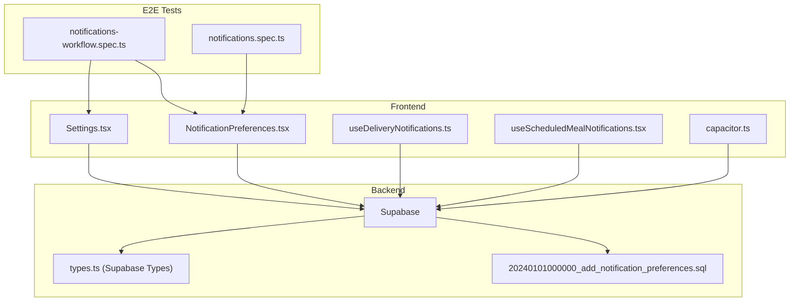
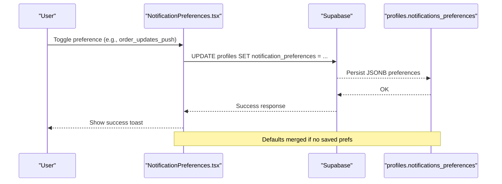
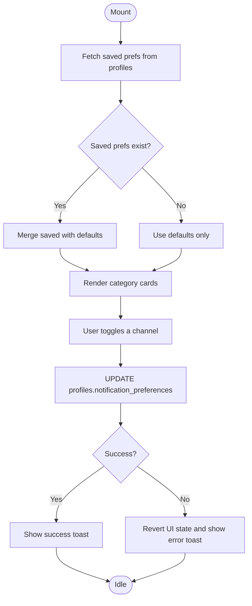
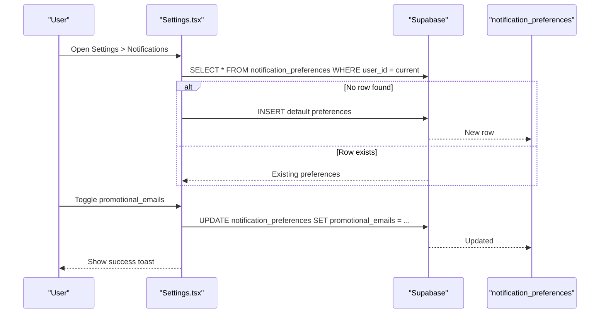
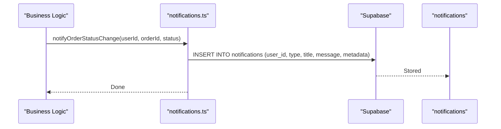
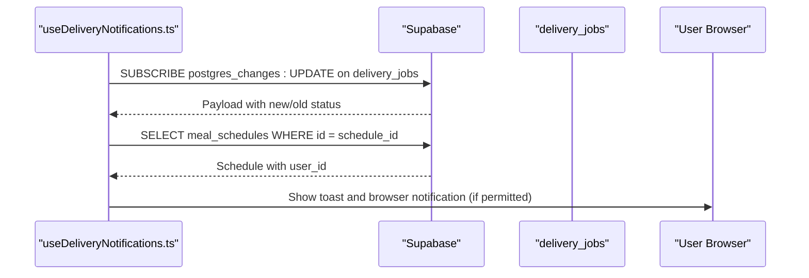
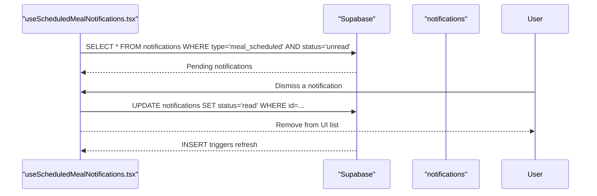
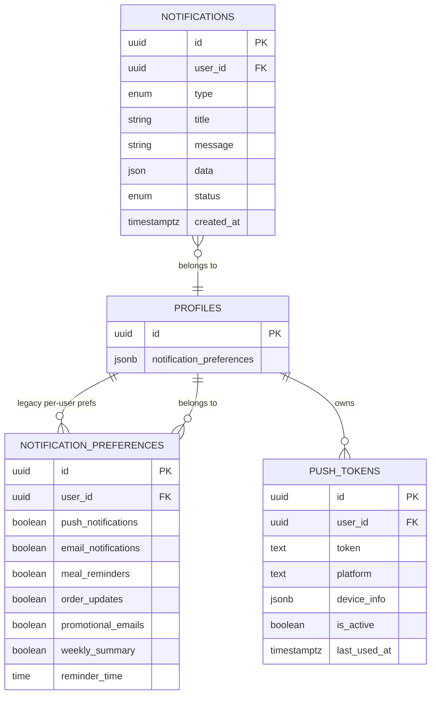
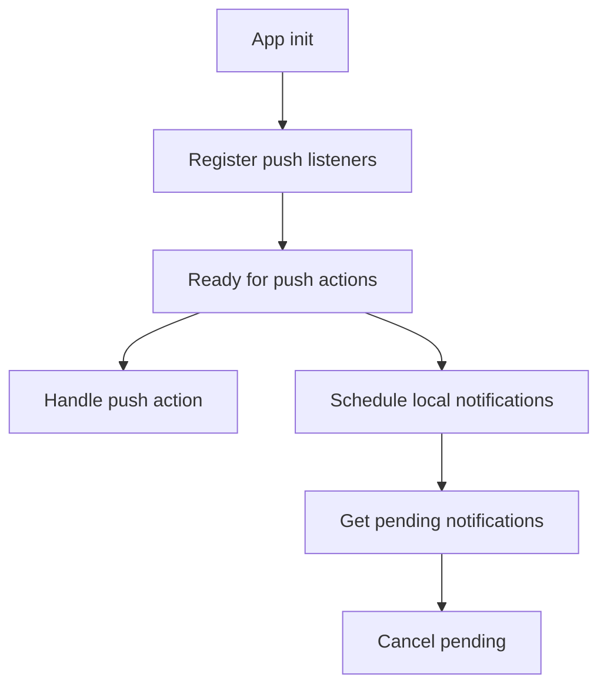
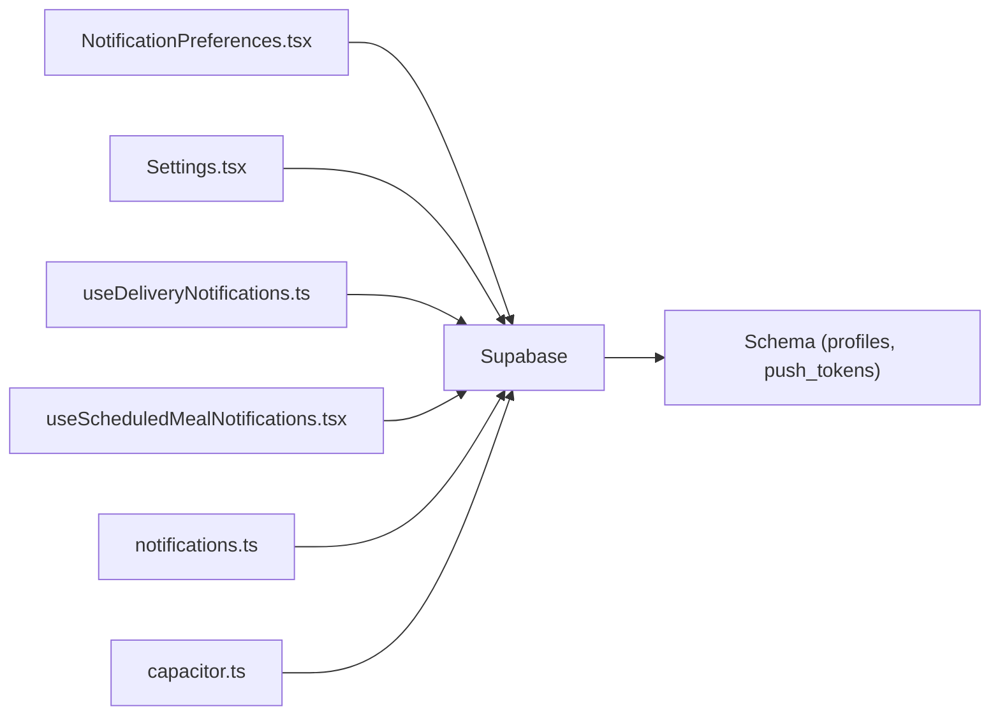

# User Notification Preferences

<cite>
**Referenced Files in This Document**
- [NotificationPreferences.tsx](file://src/components/NotificationPreferences.tsx)
- [Settings.tsx](file://src/pages/Settings.tsx)
- [notifications.ts](file://src/lib/notifications.ts)
- [useDeliveryNotifications.ts](file://src/hooks/useDeliveryNotifications.ts)
- [useScheduledMealNotifications.tsx](file://src/hooks/useScheduledMealNotifications.tsx)
- [20240101000000_add_notification_preferences.sql](file://supabase/migrations/20240101000000_add_notification_preferences.sql)
- [types.ts](file://src/integrations/supabase/types.ts)
- [useProfile.ts](file://src/hooks/useProfile.ts)
- [capacitor.ts](file://src/lib/capacitor.ts)
- [notifications-workflow.spec.ts](file://e2e/cross-portal/notifications-workflow.spec.ts)
- [notifications.spec.ts](file://e2e/customer/notifications.spec.ts)
</cite>

## Table of Contents
1. [Introduction](#introduction)
2. [Project Structure](#project-structure)
3. [Core Components](#core-components)
4. [Architecture Overview](#architecture-overview)
5. [Detailed Component Analysis](#detailed-component-analysis)
6. [Dependency Analysis](#dependency-analysis)
7. [Performance Considerations](#performance-considerations)
8. [Troubleshooting Guide](#troubleshooting-guide)
9. [Conclusion](#conclusion)
10. [Appendices](#appendices)

## Introduction
This document describes the user notification preference management system. It covers how preferences are stored, how users manage them via the UI, how defaults and validation work, and how preferences integrate with notification triggering across channels (push, email, WhatsApp). It also explains preference categories, inheritance across channels, and synchronization across devices. Guidance is included for extending the system with custom preferences and new categories.

## Project Structure
The notification preference system spans React components, Supabase-backed persistence, and runtime notification hooks:
- Preference UI and storage: NotificationPreferences component and Settings page
- Notification creation and helpers: notifications library
- Realtime delivery and scheduled meal notifications: dedicated hooks
- Database schema: JSONB preferences in profiles and supporting tables
- Device integration: Capacitor push/local notifications utilities

**Diagram sources**
- [NotificationPreferences.tsx:1-198](file://src/components/NotificationPreferences.tsx#L1-L198)
- [Settings.tsx:1-535](file://src/pages/Settings.tsx#L1-L535)
- [useDeliveryNotifications.ts:1-139](file://src/hooks/useDeliveryNotifications.ts#L1-L139)
- [useScheduledMealNotifications.tsx:1-177](file://src/hooks/useScheduledMealNotifications.tsx#L1-L177)
- [capacitor.ts:393-447](file://src/lib/capacitor.ts#L393-L447)
- [20240101000000_add_notification_preferences.sql:1-170](file://supabase/migrations/20240101000000_add_notification_preferences.sql#L1-L170)
- [types.ts:3500-3699](file://src/integrations/supabase/types.ts#L3500-L3699)
- [notifications-workflow.spec.ts](file://e2e/cross-portal/notifications-workflow.spec.ts)
- [notifications.spec.ts](file://e2e/customer/notifications.spec.ts)

**Section sources**
- [NotificationPreferences.tsx:1-198](file://src/components/NotificationPreferences.tsx#L1-L198)
- [Settings.tsx:1-535](file://src/pages/Settings.tsx#L1-L535)
- [useDeliveryNotifications.ts:1-139](file://src/hooks/useDeliveryNotifications.ts#L1-L139)
- [useScheduledMealNotifications.tsx:1-177](file://src/hooks/useScheduledMealNotifications.tsx#L1-L177)
- [20240101000000_add_notification_preferences.sql:1-170](file://supabase/migrations/20240101000000_add_notification_preferences.sql#L1-L170)
- [types.ts:3500-3699](file://src/integrations/supabase/types.ts#L3500-L3699)
- [capacitor.ts:393-447](file://src/lib/capacitor.ts#L393-L447)
- [notifications-workflow.spec.ts](file://e2e/cross-portal/notifications-workflow.spec.ts)
- [notifications.spec.ts](file://e2e/customer/notifications.spec.ts)

## Core Components
- NotificationPreferences component: Manages per-channel preferences (push/email/WhatsApp) for categories like order updates, delivery updates, promotions, and reminders. Loads defaults and merges saved preferences from the profiles table.
- Settings page: Provides a consolidated preferences panel with toggles for push/email notifications, order updates, weekly summary, promotional emails, and meal reminders with time selection.
- Notification helpers: Functions to create generic notifications and convenience helpers for order/driver/delivery events.
- Realtime hooks: Subscriptions for delivery job updates and scheduled meal notifications.
- Database schema: JSONB preferences in profiles and push tokens table for push delivery.

Key preference categories:
- Order notifications (push/email/WhatsApp)
- Delivery updates (push/email/WhatsApp)
- Promotional emails (email)
- Account alerts (push)
- Meal reminders (push)

Defaults and validation:
- Defaults are applied when no saved preferences exist.
- Preference updates are validated by the backend and revert on error.

Synchronization:
- Preferences are stored per user and loaded on demand; changes persist immediately.

**Section sources**
- [NotificationPreferences.tsx:17-83](file://src/components/NotificationPreferences.tsx#L17-L83)
- [Settings.tsx:30-140](file://src/pages/Settings.tsx#L30-L140)
- [notifications.ts:1-114](file://src/lib/notifications.ts#L1-L114)
- [useDeliveryNotifications.ts:1-139](file://src/hooks/useDeliveryNotifications.ts#L1-L139)
- [useScheduledMealNotifications.tsx:1-177](file://src/hooks/useScheduledMealNotifications.tsx#L1-L177)
- [20240101000000_add_notification_preferences.sql:9-39](file://supabase/migrations/20240101000000_add_notification_preferences.sql#L9-L39)
- [types.ts:3500-3699](file://src/integrations/supabase/types.ts#L3500-L3699)

## Architecture Overview
The system separates concerns between UI, persistence, and runtime delivery:
- UI components read/write preferences via Supabase.
- Notification creation uses a normalized notifications table with typed categories.
- Realtime subscriptions keep UI and device notifications in sync.
- Capacitor utilities enable native push and local notifications.

**Diagram sources**
- [NotificationPreferences.tsx:51-83](file://src/components/NotificationPreferences.tsx#L51-L83)
- [20240101000000_add_notification_preferences.sql:9-39](file://supabase/migrations/20240101000000_add_notification_preferences.sql#L9-L39)

**Section sources**
- [NotificationPreferences.tsx:45-83](file://src/components/NotificationPreferences.tsx#L45-L83)
- [20240101000000_add_notification_preferences.sql:9-39](file://supabase/migrations/20240101000000_add_notification_preferences.sql#L9-L39)

## Detailed Component Analysis

### NotificationPreferences Component
Responsibilities:
- Define default preferences and merge with saved preferences from profiles.
- Render category cards with channel toggles (push/email/WhatsApp).
- Persist updates to the profiles table and handle errors.

Behavior highlights:
- On mount, fetches user’s saved preferences and merges with defaults.
- Each toggle triggers an immediate update to the database.
- On error, reverts UI state and shows a toast.

**Diagram sources**
- [NotificationPreferences.tsx:45-83](file://src/components/NotificationPreferences.tsx#L45-L83)

**Section sources**
- [NotificationPreferences.tsx:17-83](file://src/components/NotificationPreferences.tsx#L17-L83)

### Settings Page Preferences
Responsibilities:
- Provide a unified preferences panel with toggles for push/email/order updates/weekly summary/promotional emails/meal reminders.
- Create default preferences row if missing.
- Persist updates to a dedicated preferences table with typed fields.

Behavior highlights:
- On first visit, inserts default preferences for the user if none exist.
- Supports selecting a daily reminder time when meal reminders are enabled.
- Uses toast feedback for save/update actions.

**Diagram sources**
- [Settings.tsx:61-140](file://src/pages/Settings.tsx#L61-L140)

**Section sources**
- [Settings.tsx:30-140](file://src/pages/Settings.tsx#L30-L140)

### Notification Helpers and Triggering
Responsibilities:
- Provide a generic notification creation function and convenience helpers for order/driver/delivery events.
- Store notifications in a normalized table with type, title, message, and optional metadata.

Behavior highlights:
- Generic create function inserts into notifications with is_read=false.
- Helpers encapsulate common messages and metadata for order lifecycle events.

**Diagram sources**
- [notifications.ts:18-81](file://src/lib/notifications.ts#L18-L81)

**Section sources**
- [notifications.ts:1-114](file://src/lib/notifications.ts#L1-L114)

### Realtime Delivery Notifications
Responsibilities:
- Subscribe to delivery job updates for the current user.
- Filter events to only those affecting the logged-in user.
- Show browser notifications and toast messages on status changes.

Behavior highlights:
- Uses Postgres changes to listen for updates on delivery_jobs.
- Verifies ownership via associated meal schedule.
- Sends browser notifications when permissions allow.

**Diagram sources**
- [useDeliveryNotifications.ts:37-129](file://src/hooks/useDeliveryNotifications.ts#L37-L129)

**Section sources**
- [useDeliveryNotifications.ts:1-139](file://src/hooks/useDeliveryNotifications.ts#L1-L139)

### Scheduled Meal Notifications
Responsibilities:
- Fetch unread notifications of type "meal_scheduled".
- Provide dismissal and navigation actions.
- Subscribe to new notifications in real time.

Behavior highlights:
- Queries notifications filtered by type and status.
- Updates status to read upon dismissal.
- Refreshes list on new inserts.

**Diagram sources**
- [useScheduledMealNotifications.tsx:39-118](file://src/hooks/useScheduledMealNotifications.tsx#L39-L118)

**Section sources**
- [useScheduledMealNotifications.tsx:1-177](file://src/hooks/useScheduledMealNotifications.tsx#L1-L177)

### Preference Storage and Schema
Responsibilities:
- Define JSONB preferences in profiles with nested channel settings.
- Provide push token storage for multi-device push delivery.
- Expose typed rows for preferences and notifications.

Behavior highlights:
- Profiles include a JSONB column for notification preferences grouped by channel.
- Push tokens table stores device tokens with platform and device info.
- Types define strongly-typed rows for preferences and notifications.

**Diagram sources**
- [20240101000000_add_notification_preferences.sql:9-39](file://supabase/migrations/20240101000000_add_notification_preferences.sql#L9-L39)
- [20240101000000_add_notification_preferences.sql:45-56](file://supabase/migrations/20240101000000_add_notification_preferences.sql#L45-L56)
- [types.ts:3500-3699](file://src/integrations/supabase/types.ts#L3500-L3699)

**Section sources**
- [20240101000000_add_notification_preferences.sql:1-170](file://supabase/migrations/20240101000000_add_notification_preferences.sql#L1-L170)
- [types.ts:3500-3699](file://src/integrations/supabase/types.ts#L3500-L3699)

### Device Integration (Push and Local Notifications)
Responsibilities:
- Provide registration and action listeners for push notifications.
- Schedule and manage local notifications on native platforms.

Behavior highlights:
- Push notification registration and action callbacks.
- Local notification scheduling and cancellation APIs.

**Diagram sources**
- [capacitor.ts:393-447](file://src/lib/capacitor.ts#L393-L447)

**Section sources**
- [capacitor.ts:393-447](file://src/lib/capacitor.ts#L393-L447)

## Dependency Analysis
- UI components depend on Supabase for reads/writes.
- Hooks subscribe to Supabase channels for real-time updates.
- Notification helpers write to the notifications table.
- Device integration depends on Capacitor plugins for native capabilities.

**Diagram sources**
- [NotificationPreferences.tsx:1-198](file://src/components/NotificationPreferences.tsx#L1-L198)
- [Settings.tsx:1-535](file://src/pages/Settings.tsx#L1-L535)
- [useDeliveryNotifications.ts:1-139](file://src/hooks/useDeliveryNotifications.ts#L1-L139)
- [useScheduledMealNotifications.tsx:1-177](file://src/hooks/useScheduledMealNotifications.tsx#L1-L177)
- [notifications.ts:1-114](file://src/lib/notifications.ts#L1-L114)
- [capacitor.ts:393-447](file://src/lib/capacitor.ts#L393-L447)
- [20240101000000_add_notification_preferences.sql:1-170](file://supabase/migrations/20240101000000_add_notification_preferences.sql#L1-L170)

**Section sources**
- [NotificationPreferences.tsx:1-198](file://src/components/NotificationPreferences.tsx#L1-L198)
- [Settings.tsx:1-535](file://src/pages/Settings.tsx#L1-L535)
- [useDeliveryNotifications.ts:1-139](file://src/hooks/useDeliveryNotifications.ts#L1-L139)
- [useScheduledMealNotifications.tsx:1-177](file://src/hooks/useScheduledMealNotifications.tsx#L1-L177)
- [notifications.ts:1-114](file://src/lib/notifications.ts#L1-L114)
- [capacitor.ts:393-447](file://src/lib/capacitor.ts#L393-L447)
- [20240101000000_add_notification_preferences.sql:1-170](file://supabase/migrations/20240101000000_add_notification_preferences.sql#L1-L170)

## Performance Considerations
- Use GIN indexes on JSONB columns for efficient querying of preferences.
- Batch updates where possible to minimize network requests.
- Debounce UI toggles to avoid rapid successive writes.
- Limit realtime subscriptions to only necessary filters to reduce bandwidth.

[No sources needed since this section provides general guidance]

## Troubleshooting Guide
Common issues and resolutions:
- Preference updates fail silently: Verify toast feedback and error handling paths in the update functions.
- Defaults not applied: Ensure the fetch path merges saved preferences with defaults.
- Realtime delivery notifications not received: Confirm subscription setup and user ownership checks.
- Scheduled meal notifications not appearing: Check unread status and type filters.

**Section sources**
- [NotificationPreferences.tsx:51-83](file://src/components/NotificationPreferences.tsx#L51-L83)
- [Settings.tsx:61-140](file://src/pages/Settings.tsx#L61-L140)
- [useDeliveryNotifications.ts:37-129](file://src/hooks/useDeliveryNotifications.ts#L37-L129)
- [useScheduledMealNotifications.tsx:39-118](file://src/hooks/useScheduledMealNotifications.tsx#L39-L118)

## Conclusion
The notification preference system combines flexible JSONB preferences in profiles with a clean UI and robust backend persistence. It supports per-category, per-channel preferences, defaults, and real-time synchronization. The architecture cleanly separates concerns and provides extension points for new categories and channels.

[No sources needed since this section summarizes without analyzing specific files]

## Appendices

### Preference Categories and Channels
- Order notifications: push, email, WhatsApp
- Delivery updates: push, email, WhatsApp
- Promotions: email
- Account alerts: push
- Meal reminders: push

Defaults and inheritance:
- Defaults are merged with saved preferences when none exist.
- Channel-specific toggles control delivery per category.

**Section sources**
- [NotificationPreferences.tsx:17-37](file://src/components/NotificationPreferences.tsx#L17-L37)
- [Settings.tsx:30-40](file://src/pages/Settings.tsx#L30-L40)

### Implementing Custom Notification Preferences
Steps:
- Extend the preference schema in the profiles table or add a new preferences table.
- Add UI toggles in the appropriate component (NotificationPreferences or Settings).
- Wire update handlers to persist to the chosen table/column.
- Add validation and error handling.
- Integrate with notification creation logic to honor new preferences.

**Section sources**
- [20240101000000_add_notification_preferences.sql:9-39](file://supabase/migrations/20240101000000_add_notification_preferences.sql#L9-L39)
- [NotificationPreferences.tsx:68-83](file://src/components/NotificationPreferences.tsx#L68-L83)
- [Settings.tsx:111-140](file://src/pages/Settings.tsx#L111-L140)

### Adding New Preference Categories
Steps:
- Define category keys and default values.
- Add category rendering in the UI component.
- Persist updates to the database.
- Ensure defaults are applied when no saved preferences exist.

**Section sources**
- [NotificationPreferences.tsx:85-122](file://src/components/NotificationPreferences.tsx#L85-L122)
- [NotificationPreferences.tsx:62-66](file://src/components/NotificationPreferences.tsx#L62-L66)

### Handling Preference Updates
- Immediate persistence on toggle.
- Error rollback and user feedback.
- Real-time refresh via subscriptions for live updates.

**Section sources**
- [NotificationPreferences.tsx:68-83](file://src/components/NotificationPreferences.tsx#L68-L83)
- [useScheduledMealNotifications.tsx:73-89](file://src/hooks/useScheduledMealNotifications.tsx#L73-L89)

### Preference Filtering and Channel-Specific Settings
- Filtering by type/status ensures only relevant notifications are shown.
- Channel toggles gate delivery per category.
- Real-time subscriptions ensure UI reflects backend changes instantly.

**Section sources**
- [useScheduledMealNotifications.tsx:44-51](file://src/hooks/useScheduledMealNotifications.tsx#L44-L51)
- [useDeliveryNotifications.ts:37-67](file://src/hooks/useDeliveryNotifications.ts#L37-L67)

### Cross-Portal and E2E Coverage
- Cross-portal and customer E2E tests exercise notification workflows and preferences.

**Section sources**
- [notifications-workflow.spec.ts](file://e2e/cross-portal/notifications-workflow.spec.ts)
- [notifications.spec.ts](file://e2e/customer/notifications.spec.ts)