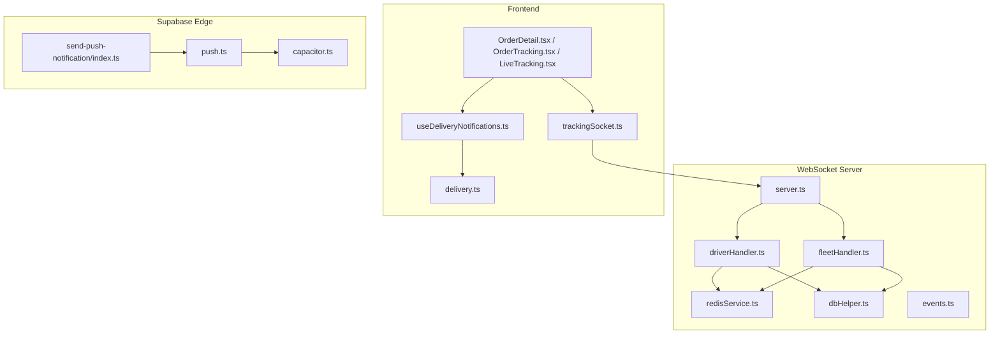
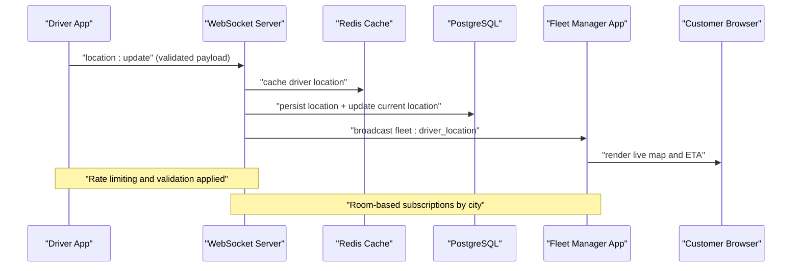
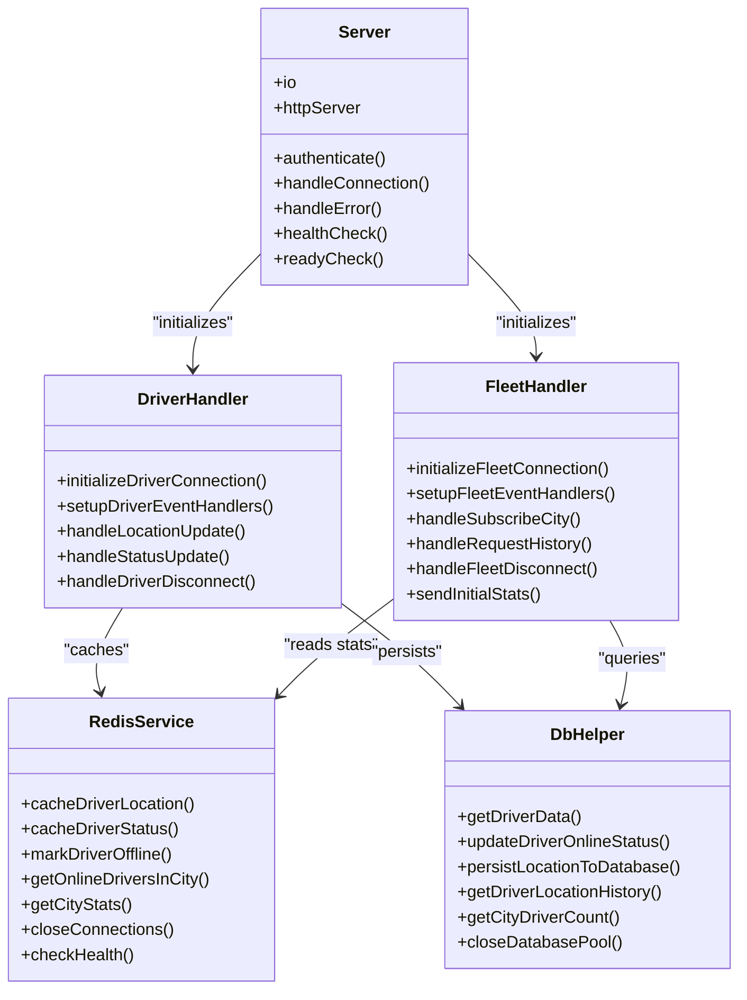
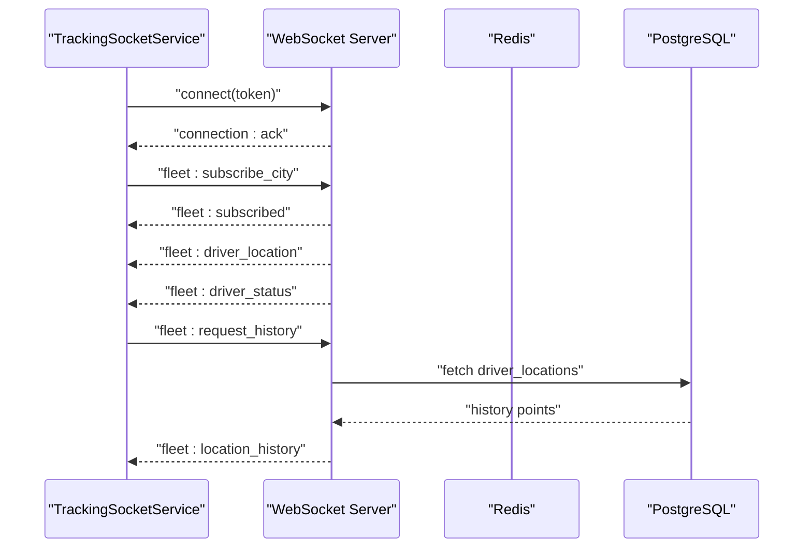
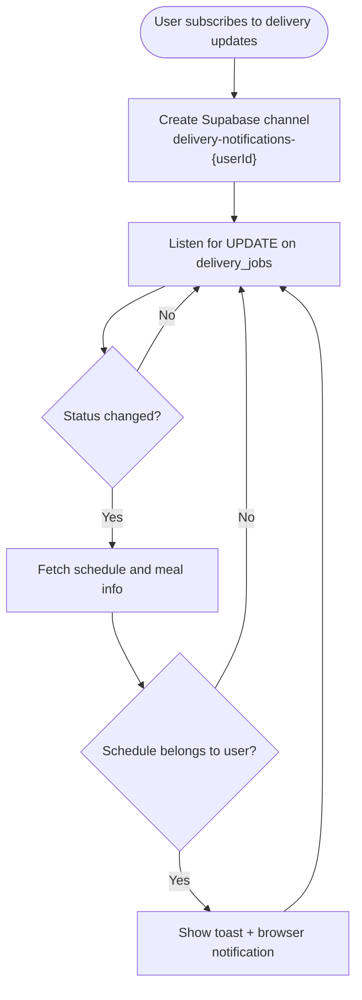
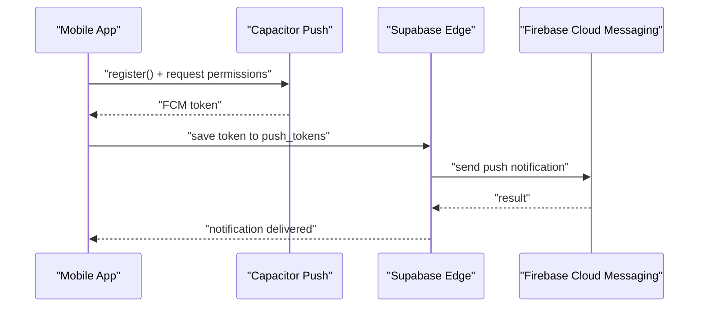
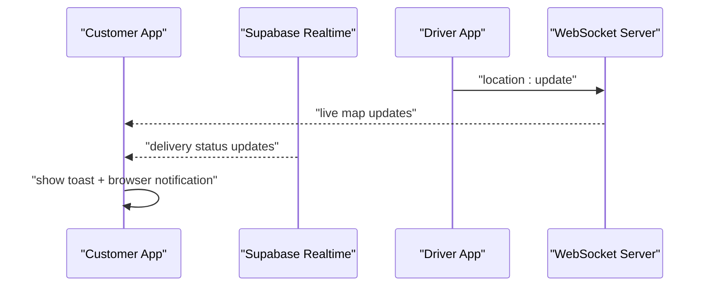
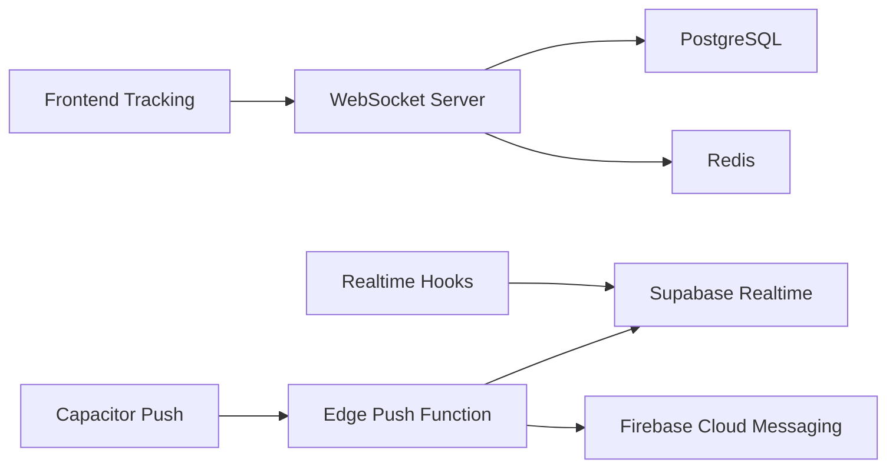

# Real-time Features

<cite>
**Referenced Files in This Document**
- [server.ts](file://websocket-server/src/server.ts)
- [driverHandler.ts](file://websocket-server/src/handlers/driverHandler.ts)
- [fleetHandler.ts](file://websocket-server/src/handlers/fleetHandler.ts)
- [redisService.ts](file://websocket-server/src/services/redisService.ts)
- [dbHelper.ts](file://websocket-server/src/handlers/dbHelper.ts)
- [events.ts](file://websocket-server/src/types/events.ts)
- [trackingSocket.ts](file://src/fleet/services/trackingSocket.ts)
- [useDeliveryNotifications.ts](file://src/hooks/useDeliveryNotifications.ts)
- [delivery.ts](file://src/integrations/supabase/delivery.ts)
- [push.ts](file://src/lib/notifications/push.ts)
- [index.ts](file://supabase/functions/send-push-notification/index.ts)
- [capacitor.ts](file://src/lib/capacitor.ts)
- [OrderDetail.tsx](file://src/pages/OrderDetail.tsx)
- [OrderTracking.tsx](file://delivery_implementation_plan.md)
- [LiveTracking.tsx](file://delivery_implementation_plan.md)
- [realtime.spec.ts](file://e2e/system/realtime.spec.ts)
- [notifications.spec.ts](file://e2e/system/notifications.spec.ts)
</cite>

## Table of Contents
1. [Introduction](#introduction)
2. [Project Structure](#project-structure)
3. [Core Components](#core-components)
4. [Architecture Overview](#architecture-overview)
5. [Detailed Component Analysis](#detailed-component-analysis)
6. [Dependency Analysis](#dependency-analysis)
7. [Performance Considerations](#performance-considerations)
8. [Troubleshooting Guide](#troubleshooting-guide)
9. [Conclusion](#conclusion)

## Introduction
This document provides comprehensive documentation for the Nutrio live communication system's real-time features. It covers the WebSocket server implementation, push notification system, and live tracking capabilities. The system enables real-time order updates, delivery tracking, and fleet coordination across mobile and web platforms. It integrates mobile push notifications, WebSocket connections, and real-time database updates, with robust connection management, error handling, and scalability considerations.

## Project Structure
The real-time system spans three primary layers:
- WebSocket server: Fleet management and driver tracking with Socket.IO and Redis adapter
- Frontend integrations: React hooks and services for Supabase Realtime and WebSocket tracking
- Supabase edge functions: Serverless push notification delivery via Firebase Cloud Messaging

**Diagram sources**
- [server.ts:1-256](file://websocket-server/src/server.ts#L1-L256)
- [driverHandler.ts:1-318](file://websocket-server/src/handlers/driverHandler.ts#L1-L318)
- [fleetHandler.ts:1-247](file://websocket-server/src/handlers/fleetHandler.ts#L1-L247)
- [redisService.ts:1-264](file://websocket-server/src/services/redisService.ts#L1-L264)
- [dbHelper.ts:1-204](file://websocket-server/src/handlers/dbHelper.ts#L1-L204)
- [events.ts:1-210](file://websocket-server/src/types/events.ts#L1-L210)
- [trackingSocket.ts:1-287](file://src/fleet/services/trackingSocket.ts#L1-L287)
- [useDeliveryNotifications.ts:1-139](file://src/hooks/useDeliveryNotifications.ts#L1-L139)
- [delivery.ts:694-734](file://src/integrations/supabase/delivery.ts#L694-L734)
- [push.ts:1-44](file://src/lib/notifications/push.ts#L1-L44)
- [index.ts:1-300](file://supabase/functions/send-push-notification/index.ts#L1-L300)
- [capacitor.ts:340-447](file://src/lib/capacitor.ts#L340-L447)
- [OrderDetail.tsx:427-460](file://src/pages/OrderDetail.tsx#L427-L460)
- [OrderTracking.tsx:1955-2113](file://delivery_implementation_plan.md#L1955-L2113)
- [LiveTracking.tsx:1830-1944](file://delivery_implementation_plan.md#L1830-L1944)

**Section sources**
- [server.ts:1-256](file://websocket-server/src/server.ts#L1-L256)
- [events.ts:1-210](file://websocket-server/src/types/events.ts#L1-L210)

## Core Components
- WebSocket Server: Implements Socket.IO with Redis adapter for multi-instance scaling, JWT authentication, room-based subscriptions, and event-driven broadcasting for driver locations, status changes, and fleet statistics.
- Driver Handler: Validates and rate-limits driver location/status updates, caches recent data in Redis, persists to PostgreSQL, and broadcasts updates to fleet managers.
- Fleet Handler: Manages city subscriptions, access control, and location history requests with validation and authorization checks.
- Redis Service: Provides caching for driver locations and statuses, online driver discovery, and city statistics with TTL and cluster support.
- Frontend Tracking Service: Native WebSocket client for real-time fleet tracking with exponential backoff, message queuing, and event parsing.
- Supabase Realtime Hooks: React hooks for browser notifications and live delivery updates via PostgreSQL changes.
- Supabase Edge Push Function: Serverless function to send push notifications via Firebase Cloud Messaging and maintain notification records.

**Section sources**
- [driverHandler.ts:1-318](file://websocket-server/src/handlers/driverHandler.ts#L1-L318)
- [fleetHandler.ts:1-247](file://websocket-server/src/handlers/fleetHandler.ts#L1-L247)
- [redisService.ts:1-264](file://websocket-server/src/services/redisService.ts#L1-L264)
- [trackingSocket.ts:1-287](file://src/fleet/services/trackingSocket.ts#L1-L287)
- [useDeliveryNotifications.ts:1-139](file://src/hooks/useDeliveryNotifications.ts#L1-L139)
- [delivery.ts:694-734](file://src/integrations/supabase/delivery.ts#L694-L734)
- [index.ts:1-300](file://supabase/functions/send-push-notification/index.ts#L1-L300)

## Architecture Overview
The system combines real-time streaming and serverless push notifications:
- WebSocket Server: Authenticates via JWT, manages rooms by city, and broadcasts driver location/status updates to fleet managers.
- Supabase Realtime: Subscribes to PostgreSQL changes for delivery jobs and driver locations to provide near real-time UI updates.
- Edge Functions: Serverless push notifications delivered via Firebase Cloud Messaging with token deactivation on invalid/unregistered tokens.

**Diagram sources**
- [driverHandler.ts:105-207](file://websocket-server/src/handlers/driverHandler.ts#L105-L207)
- [redisService.ts:87-114](file://websocket-server/src/services/redisService.ts#L87-L114)
- [dbHelper.ts:83-125](file://websocket-server/src/handlers/dbHelper.ts#L83-L125)
- [events.ts:157-186](file://websocket-server/src/types/events.ts#L157-L186)

## Detailed Component Analysis

### WebSocket Server Implementation
The WebSocket server provides:
- Multi-instance scaling via Redis adapter and Socket.IO
- JWT-based authentication with role-aware user data
- Room management for city-based fleet visibility
- Event-driven broadcasting for driver locations, status changes, and fleet statistics
- Health checks and graceful shutdown handling

**Diagram sources**
- [server.ts:65-150](file://websocket-server/src/server.ts#L65-L150)
- [driverHandler.ts:48-100](file://websocket-server/src/handlers/driverHandler.ts#L48-L100)
- [fleetHandler.ts:36-82](file://websocket-server/src/handlers/fleetHandler.ts#L36-L82)
- [redisService.ts:87-224](file://websocket-server/src/services/redisService.ts#L87-L224)
- [dbHelper.ts:34-192](file://websocket-server/src/handlers/dbHelper.ts#L34-L192)

**Section sources**
- [server.ts:1-256](file://websocket-server/src/server.ts#L1-L256)
- [driverHandler.ts:1-318](file://websocket-server/src/handlers/driverHandler.ts#L1-L318)
- [fleetHandler.ts:1-247](file://websocket-server/src/handlers/fleetHandler.ts#L1-L247)
- [redisService.ts:1-264](file://websocket-server/src/services/redisService.ts#L1-L264)
- [dbHelper.ts:1-204](file://websocket-server/src/handlers/dbHelper.ts#L1-L204)
- [events.ts:1-210](file://websocket-server/src/types/events.ts#L1-L210)

### Frontend Real-time Tracking Service
The frontend tracking service provides:
- Native WebSocket client compatible with Socket.IO servers
- Token-based authentication via query parameter
- Exponential backoff reconnection with retry limits
- Message queueing during connection outages
- Event parsing for driver location, status, and fleet stats
- City subscription management and location history requests

**Diagram sources**
- [trackingSocket.ts:34-132](file://src/fleet/services/trackingSocket.ts#L34-L132)
- [events.ts:157-186](file://websocket-server/src/types/events.ts#L157-L186)

**Section sources**
- [trackingSocket.ts:1-287](file://src/fleet/services/trackingSocket.ts#L1-L287)
- [events.ts:157-186](file://websocket-server/src/types/events.ts#L157-L186)

### Supabase Realtime Integration
Supabase Realtime provides:
- Live delivery updates via PostgreSQL changes for delivery_jobs
- Live driver location updates via driver_locations insertions
- Browser notifications for delivery status changes with toast and native web notifications
- Access control by verifying user ownership of schedules

**Diagram sources**
- [useDeliveryNotifications.ts:37-130](file://src/hooks/useDeliveryNotifications.ts#L37-L130)
- [delivery.ts:695-734](file://src/integrations/supabase/delivery.ts#L695-L734)

**Section sources**
- [useDeliveryNotifications.ts:1-139](file://src/hooks/useDeliveryNotifications.ts#L1-L139)
- [delivery.ts:694-734](file://src/integrations/supabase/delivery.ts#L694-L734)

### Push Notification System
The push notification system delivers:
- Native mobile push via Capacitor Push Notifications
- Serverless push delivery via Supabase Edge Function using Firebase Cloud Messaging
- Token management and deactivation for invalid/unregistered tokens
- Cross-platform notification routing and deep links

**Diagram sources**
- [push.ts:25-1034](file://src/lib/notifications/push.ts#L25-L1034)
- [index.ts:178-299](file://supabase/functions/send-push-notification/index.ts#L178-L299)
- [capacitor.ts:345-404](file://src/lib/capacitor.ts#L345-L404)

**Section sources**
- [push.ts:1-44](file://src/lib/notifications/push.ts#L1-L44)
- [index.ts:1-300](file://supabase/functions/send-push-notification/index.ts#L1-L300)
- [capacitor.ts:340-447](file://src/lib/capacitor.ts#L340-L447)

### Real-time Order Updates and Delivery Tracking
Real-time order updates and delivery tracking include:
- Live map rendering and ETA calculation for customers
- Driver assignment, acceptance, pickup, and delivery status updates
- Customer engagement through proactive status notifications and contact actions

**Diagram sources**
- [OrderDetail.tsx:427-460](file://src/pages/OrderDetail.tsx#L427-L460)
- [OrderTracking.tsx:1955-2113](file://delivery_implementation_plan.md#L1955-L2113)
- [LiveTracking.tsx:1830-1944](file://delivery_implementation_plan.md#L1830-L1944)
- [useDeliveryNotifications.ts:37-130](file://src/hooks/useDeliveryNotifications.ts#L37-L130)

**Section sources**
- [OrderDetail.tsx:427-460](file://src/pages/OrderDetail.tsx#L427-L460)
- [OrderTracking.tsx:1955-2113](file://delivery_implementation_plan.md#L1955-L2113)
- [LiveTracking.tsx:1830-1944](file://delivery_implementation_plan.md#L1830-L1944)
- [useDeliveryNotifications.ts:1-139](file://src/hooks/useDeliveryNotifications.ts#L1-L139)

## Dependency Analysis
The real-time system exhibits clear separation of concerns:
- WebSocket server depends on Redis for caching and PostgreSQL for persistence
- Frontend services depend on environment variables for WebSocket URLs and Supabase for Realtime
- Edge functions depend on Supabase for token retrieval and Firebase for push delivery

**Diagram sources**
- [server.ts:53-55](file://websocket-server/src/server.ts#L53-L55)
- [redisService.ts:63-82](file://websocket-server/src/services/redisService.ts#L63-L82)
- [trackingSocket.ts](file://src/fleet/services/trackingSocket.ts#L6)
- [useDeliveryNotifications.ts:2-3](file://src/hooks/useDeliveryNotifications.ts#L2-L3)
- [index.ts:178-299](file://supabase/functions/send-push-notification/index.ts#L178-L299)
- [capacitor.ts:345-404](file://src/lib/capacitor.ts#L345-L404)

**Section sources**
- [server.ts:1-256](file://websocket-server/src/server.ts#L1-L256)
- [trackingSocket.ts:1-287](file://src/fleet/services/trackingSocket.ts#L1-L287)
- [useDeliveryNotifications.ts:1-139](file://src/hooks/useDeliveryNotifications.ts#L1-L139)
- [index.ts:1-300](file://supabase/functions/send-push-notification/index.ts#L1-L300)

## Performance Considerations
- WebSocket Server
  - Uses Redis adapter for horizontal scaling and reduces memory footprint per instance
  - Configurable ping intervals and timeouts to manage long-lived connections efficiently
  - Message compression threshold to reduce bandwidth usage
- Driver Location Updates
  - Rate limiting prevents excessive updates and conserves resources
  - Asynchronous persistence avoids blocking the event loop
- Redis Caching
  - TTL-based eviction ensures stale data removal
  - Cluster mode support for high availability and throughput
- Supabase Realtime
  - Efficient channel filtering minimizes unnecessary updates
  - Toast and browser notifications avoid repeated network requests
- Edge Push Function
  - Parallel token delivery with Promise.allSettled for resilience
  - Token deactivation on invalid/unregistered errors to prevent future failures

[No sources needed since this section provides general guidance]

## Troubleshooting Guide
Common issues and resolutions:
- WebSocket Connection Failures
  - Verify JWT token validity and expiration
  - Check allowed origins and CORS configuration
  - Monitor Redis connectivity and readiness probes
- Driver Location Update Errors
  - Validate payload against Zod schemas
  - Inspect rate limiting thresholds and adjust if needed
  - Review database transaction logs for persistence errors
- Fleet Access Control
  - Ensure manager roles and assigned cities align with subscriptions
  - Validate city subscription requests and driver access permissions
- Push Notification Delivery
  - Confirm token registration and permission prompts
  - Monitor FCM response codes and deactivate invalid tokens
  - Check Supabase edge function logs for runtime errors

**Section sources**
- [server.ts:95-102](file://websocket-server/src/server.ts#L95-L102)
- [driverHandler.ts:126-135](file://websocket-server/src/handlers/driverHandler.ts#L126-L135)
- [fleetHandler.ts:94-116](file://websocket-server/src/handlers/fleetHandler.ts#L94-L116)
- [index.ts:245-271](file://supabase/functions/send-push-notification/index.ts#L245-L271)
- [push.ts:964-1034](file://src/lib/notifications/push.ts#L964-L1034)

## Conclusion
The Nutrio real-time features combine a scalable WebSocket server, Supabase Realtime, and serverless push notifications to deliver seamless order updates, live delivery tracking, and fleet coordination. The system emphasizes robust connection management, validation, and error handling, ensuring reliability under varying loads. With clear separation of concerns and modular components, the architecture supports future enhancements and maintains performance through caching, asynchronous persistence, and efficient resource utilization.