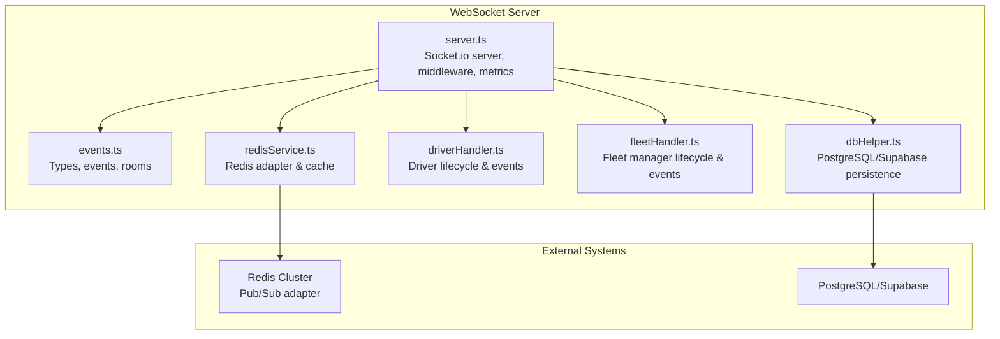
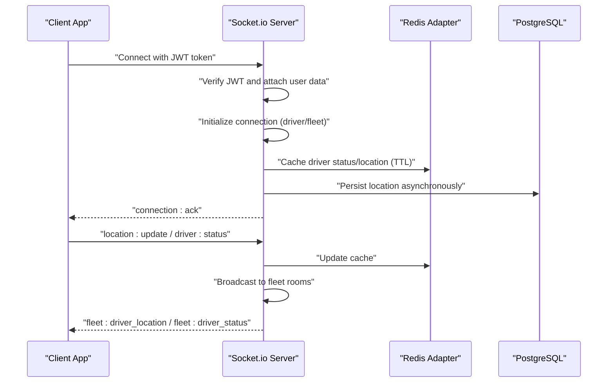
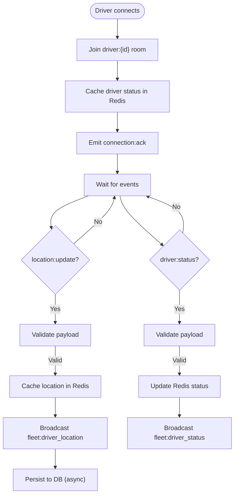
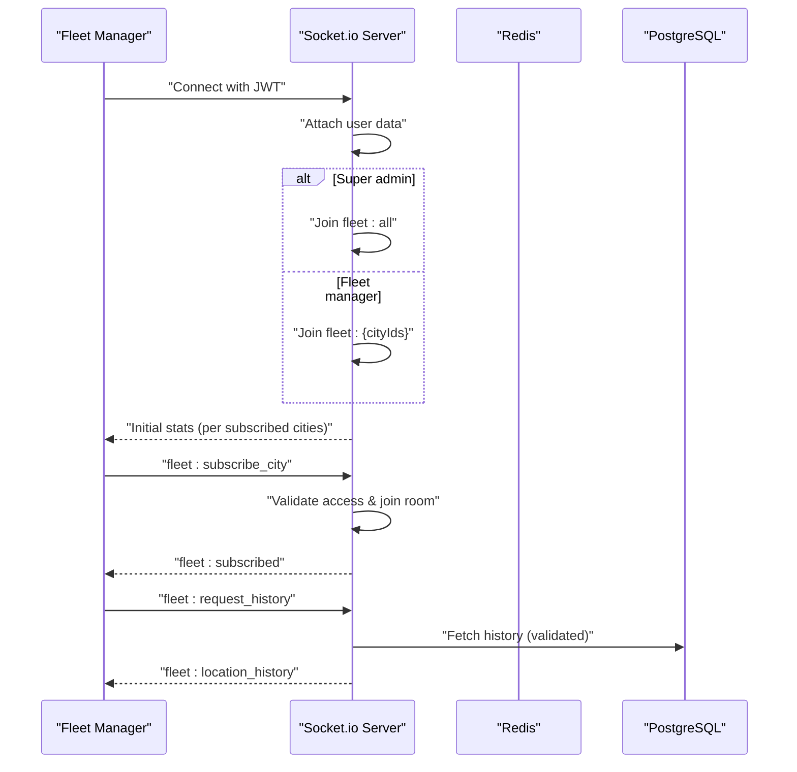
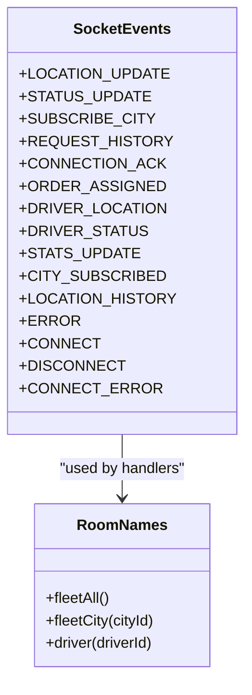
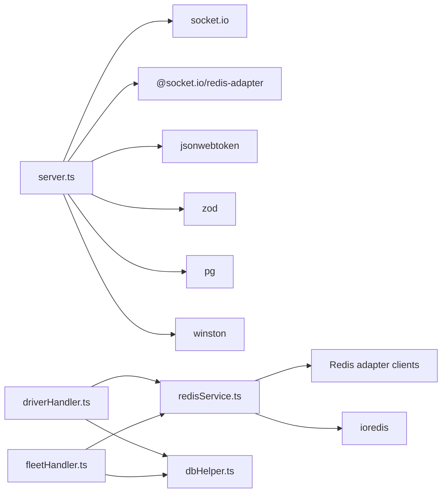
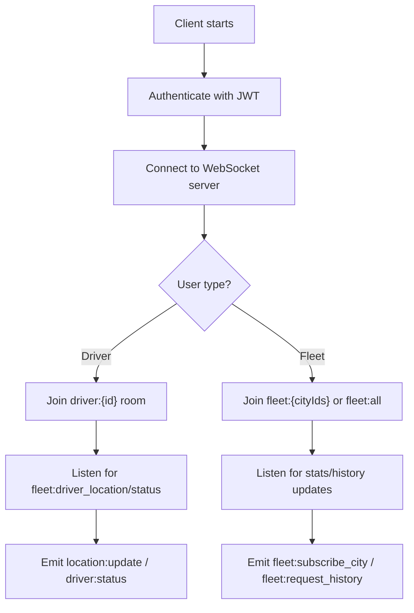

# WebSocket Implementation

<cite>
**Referenced Files in This Document**
- [server.ts](file://websocket-server/src/server.ts)
- [events.ts](file://websocket-server/src/times/events.ts)
- [redisService.ts](file://websocket-server/src/services/redisService.ts)
- [driverHandler.ts](file://websocket-server/src/handlers/driverHandler.ts)
- [fleetHandler.ts](file://websocket-server/src/handlers/fleetHandler.ts)
- [dbHelper.ts](file://websocket-server/src/handlers/dbHelper.ts)
- [package.json](file://websocket-server/package.json)
- [Dockerfile](file://websocket-server/Dockerfile)
- [fleet-management-portal-design.md](file://docs/fleet-management-portal-design.md)
</cite>

## Table of Contents
1. [Introduction](#introduction)
2. [Project Structure](#project-structure)
3. [Core Components](#core-components)
4. [Architecture Overview](#architecture-overview)
5. [Detailed Component Analysis](#detailed-component-analysis)
6. [Dependency Analysis](#dependency-analysis)
7. [Performance Considerations](#performance-considerations)
8. [Troubleshooting Guide](#troubleshooting-guide)
9. [Conclusion](#conclusion)
10. [Appendices](#appendices)

## Introduction
This document details the WebSocket implementation powering real-time fleet tracking in Nutrio’s fleet management system. It covers the Socket.io server configuration, JWT-based authentication, Redis adapter for horizontal scaling, connection initialization for drivers and fleet managers, room-based broadcasting, event-driven architecture, connection metrics, health checks, graceful shutdown, and practical client-side integration guidance. It also outlines performance optimization strategies and operational best practices.

## Project Structure
The WebSocket server is implemented as a standalone Node.js service under websocket-server with modular handlers, a Redis adapter service, and a database helper for persistence. The design supports multi-instance deployments via Redis pub/sub and includes health and readiness probes, plus graceful shutdown hooks.

**Diagram sources**
- [server.ts:38-51](file://websocket-server/src/server.ts#L38-L51)
- [redisService.ts:63-82](file://websocket-server/src/services/redisService.ts#L63-L82)
- [driverHandler.ts:48-80](file://websocket-server/src/handlers/driverHandler.ts#L48-L80)
- [fleetHandler.ts:36-62](file://websocket-server/src/handlers/fleetHandler.ts#L36-L62)
- [dbHelper.ts:15-29](file://websocket-server/src/handlers/dbHelper.ts#L15-L29)

**Section sources**
- [server.ts:1-256](file://websocket-server/src/server.ts#L1-L256)
- [events.ts:157-187](file://websocket-server/src/types/events.ts#L157-L187)
- [redisService.ts:1-264](file://websocket-server/src/services/redisService.ts#L1-L264)
- [driverHandler.ts:1-318](file://websocket-server/src/handlers/driverHandler.ts#L1-L318)
- [fleetHandler.ts:1-247](file://websocket-server/src/handlers/fleetHandler.ts#L1-L247)
- [dbHelper.ts:1-204](file://websocket-server/src/handlers/dbHelper.ts#L1-L204)

## Core Components
- Socket.io server with Redis adapter for multi-node scaling, CORS configuration, transport selection, and message compression.
- JWT authentication middleware validating tokens and attaching user metadata to sockets.
- Room-based broadcasting for driver locations and status to fleet managers by city and super admins globally.
- Redis-backed caching for driver location/status and city statistics with TTLs.
- PostgreSQL persistence for historical location data and driver status updates.
- Health and readiness endpoints, plus graceful shutdown handling.

**Section sources**
- [server.ts:38-51](file://websocket-server/src/server.ts#L38-L51)
- [server.ts:65-103](file://websocket-server/src/server.ts#L65-L103)
- [events.ts:157-187](file://websocket-server/src/types/events.ts#L157-L187)
- [redisService.ts:87-146](file://websocket-server/src/services/redisService.ts#L87-L146)
- [dbHelper.ts:83-125](file://websocket-server/src/handlers/dbHelper.ts#L83-L125)

## Architecture Overview
The system uses Socket.io with a Redis adapter to synchronize messages across multiple server instances. Drivers and fleet managers authenticate via JWT and join rooms based on roles and assigned cities. Redis caches live driver state while PostgreSQL persists historical data.

**Diagram sources**
- [server.ts:65-103](file://websocket-server/src/server.ts#L65-L103)
- [driverHandler.ts:105-207](file://websocket-server/src/handlers/driverHandler.ts#L105-L207)
- [redisService.ts:87-146](file://websocket-server/src/services/redisService.ts#L87-L146)
- [dbHelper.ts:83-125](file://websocket-server/src/handlers/dbHelper.ts#L83-L125)

## Detailed Component Analysis

### Socket.io Server Configuration and Middleware
- Transport and compression: supports WebSocket and polling, with message compression for payloads > 1KB and a max HTTP buffer size of 1MB.
- CORS: configured from environment variables with credentials enabled.
- Redis adapter: creates separate publish/subscribe clients for cross-node message routing.
- Connection metrics: tracks total, driver, and fleet connections with increments/decrements on connect/disconnect.
- Capacity guard: rejects new connections when a configurable maximum is reached.
- Health and readiness: HTTP endpoints expose connection counts and Redis health.
- Graceful shutdown: closes HTTP server, Socket.io server, disconnects all sockets, closes Redis and DB pools.

**Section sources**
- [server.ts:38-51](file://websocket-server/src/server.ts#L38-L51)
- [server.ts:57-150](file://websocket-server/src/server.ts#L57-L150)
- [server.ts:162-192](file://websocket-server/src/server.ts#L162-L192)
- [server.ts:197-224](file://websocket-server/src/server.ts#L197-L224)

### JWT-Based Authentication
- Extracts token from handshake authentication and verifies it against the configured secret.
- Builds a typed user object with role, IDs, and assigned cities for drivers and fleet managers.
- Rejects missing or invalid tokens and surfaces explicit error messages for expired or malformed tokens.

**Section sources**
- [server.ts:65-103](file://websocket-server/src/server.ts#L65-L103)

### Connection Initialization: Drivers
- Driver-specific room joining and Redis status caching upon connection.
- Emits a connection acknowledgment with a recommended update interval.
- Registers handlers for location updates and status changes with rate limiting and Zod validation.
- Broadcasts location/status updates to city-specific fleet rooms and super admin room.
- Persists location asynchronously to PostgreSQL.

**Diagram sources**
- [driverHandler.ts:48-100](file://websocket-server/src/handlers/driverHandler.ts#L48-L100)
- [driverHandler.ts:105-207](file://websocket-server/src/handlers/driverHandler.ts#L105-L207)
- [redisService.ts:87-146](file://websocket-server/src/services/redisService.ts#L87-L146)
- [dbHelper.ts:83-125](file://websocket-server/src/handlers/dbHelper.ts#L83-L125)

**Section sources**
- [driverHandler.ts:48-80](file://websocket-server/src/handlers/driverHandler.ts#L48-L80)
- [driverHandler.ts:85-100](file://websocket-server/src/handlers/driverHandler.ts#L85-L100)
- [driverHandler.ts:105-207](file://websocket-server/src/handlers/driverHandler.ts#L105-L207)

### Connection Initialization: Fleet Managers
- Super admins join a global fleet room; others join rooms for their assigned cities.
- Registers handlers for city subscription and location history requests with access control.
- Sends initial city statistics to subscribed fleets.
- Validates payloads and enforces role-based access to cities/drivers.

**Diagram sources**
- [fleetHandler.ts:36-62](file://websocket-server/src/handlers/fleetHandler.ts#L36-L62)
- [fleetHandler.ts:67-82](file://websocket-server/src/handlers/fleetHandler.ts#L67-L82)
- [fleetHandler.ts:87-140](file://websocket-server/src/handlers/fleetHandler.ts#L87-L140)
- [fleetHandler.ts:145-212](file://websocket-server/src/handlers/fleetHandler.ts#L145-L212)
- [dbHelper.ts:130-163](file://websocket-server/src/handlers/dbHelper.ts#L130-L163)

**Section sources**
- [fleetHandler.ts:36-62](file://websocket-server/src/handlers/fleetHandler.ts#L36-L62)
- [fleetHandler.ts:67-82](file://websocket-server/src/handlers/fleetHandler.ts#L67-L82)
- [fleetHandler.ts:87-140](file://websocket-server/src/handlers/fleetHandler.ts#L87-L140)
- [fleetHandler.ts:145-212](file://websocket-server/src/handlers/fleetHandler.ts#L145-L212)

### Event-Driven Architecture and Broadcasting
- Client-to-server events: location updates, driver status, city subscription, and history requests.
- Server-to-client events: connection acknowledgment, order assignment, driver location/status broadcasts, city subscription confirmation, and location history.
- Rooms: global fleet room for super admins and city-specific rooms for fleet managers; driver-specific rooms for targeted notifications.

**Diagram sources**
- [events.ts:157-187](file://websocket-server/src/types/events.ts#L157-L187)

**Section sources**
- [events.ts:157-187](file://websocket-server/src/types/events.ts#L157-L187)
- [driverHandler.ts:172-182](file://websocket-server/src/handlers/driverHandler.ts#L172-L182)
- [fleetHandler.ts:118-129](file://websocket-server/src/handlers/fleetHandler.ts#L118-L129)

### Redis Adapter Setup and Caching
- Separate Redis clients for publishing and subscribing to enable multi-node synchronization.
- Caches driver location and status with TTLs; exposes helpers to retrieve online drivers and maintain city stats.
- Provides health checks and connection lifecycle management.

**Section sources**
- [redisService.ts:63-82](file://websocket-server/src/services/redisService.ts#L63-L82)
- [redisService.ts:87-146](file://websocket-server/src/services/redisService.ts#L87-L146)
- [redisService.ts:165-207](file://websocket-server/src/services/redisService.ts#L165-L207)
- [redisService.ts:254-263](file://websocket-server/src/services/redisService.ts#L254-L263)

### Database Persistence
- Uses a connection pool to PostgreSQL/Supabase for driver data, location history, and driver status updates.
- Performs transactional writes for location persistence and updates current coordinates atomically.
- Provides city driver counts and location history queries with limits.

**Section sources**
- [dbHelper.ts:15-29](file://websocket-server/src/handlers/dbHelper.ts#L15-L29)
- [dbHelper.ts:83-125](file://websocket-server/src/handlers/dbHelper.ts#L83-L125)
- [dbHelper.ts:130-163](file://websocket-server/src/handlers/dbHelper.ts#L130-L163)
- [dbHelper.ts:168-192](file://websocket-server/src/handlers/dbHelper.ts#L168-L192)

### Health Checks and Readiness
- HTTP endpoint /health returns server status, timestamps, and connection counts.
- HTTP endpoint /ready pings Redis to determine readiness.
- Docker HEALTHCHECK configured to probe /health.

**Section sources**
- [server.ts:162-192](file://websocket-server/src/server.ts#L162-L192)
- [redisService.ts:254-263](file://websocket-server/src/services/redisService.ts#L254-L263)
- [Dockerfile:63-64](file://websocket-server/Dockerfile#L63-L64)

### Graceful Shutdown
- Closes HTTP and Socket.io servers, disconnects all sockets, closes Redis and DB pools, and exits the process cleanly on SIGTERM/SIGINT or uncaught exceptions.

**Section sources**
- [server.ts:197-224](file://websocket-server/src/server.ts#L197-L224)

## Dependency Analysis
The server depends on Socket.io for real-time communication, @socket.io/redis-adapter for multi-node synchronization, ioredis for Redis connectivity, jsonwebtoken for JWT verification, pg for PostgreSQL access, and zod for payload validation.

**Diagram sources**
- [package.json:21-29](file://websocket-server/package.json#L21-L29)
- [server.ts:7-16](file://websocket-server/src/server.ts#L7-L16)
- [redisService.ts:6-7](file://websocket-server/src/services/redisService.ts#L6-L7)
- [driverHandler.ts:6-22](file://websocket-server/src/handlers/driverHandler.ts#L6-L22)
- [fleetHandler.ts:6-17](file://websocket-server/src/handlers/fleetHandler.ts#L6-L17)

**Section sources**
- [package.json:21-29](file://websocket-server/package.json#L21-L29)

## Performance Considerations
- Connection pooling: PostgreSQL pool configured via environment variables; tune max connections and SSL settings for production.
- Message compression: Enabled for payloads larger than 1KB; keep messages concise and avoid unnecessary fields.
- Bandwidth management: Limit history points per request; enforce client-side throttling for location updates.
- Redis TTLs: Optimize cache TTLs for location and status to balance freshness and memory usage.
- Horizontal scaling: Use sticky sessions at the load balancer and Redis pub/sub for cross-node messaging.
- Backpressure: Monitor connection counts and apply rate limits; consider exponential backoff on client reconnection.

[No sources needed since this section provides general guidance]

## Troubleshooting Guide
Common issues and resolutions:
- Authentication failures: Verify JWT secret and token validity; check handshake token presence.
- Redis connectivity: Confirm Redis URL/password/db and cluster mode settings; use readiness probe to detect unavailability.
- Connection limits: Review WS_MAX_CONNECTIONS and consider auto-scaling; monitor /health for capacity.
- Payload validation errors: Inspect client payloads against Zod schemas; ensure required fields and types match.
- Graceful shutdown: Ensure SIGTERM/SIGINT handling and pool closures are executed during maintenance.

**Section sources**
- [server.ts:29-32](file://websocket-server/src/server.ts#L29-L32)
- [server.ts:110-117](file://websocket-server/src/server.ts#L110-L117)
- [redisService.ts:254-263](file://websocket-server/src/services/redisService.ts#L254-L263)
- [driverHandler.ts:126-135](file://websocket-server/src/handlers/driverHandler.ts#L126-L135)
- [fleetHandler.ts:94-103](file://websocket-server/src/handlers/fleetHandler.ts#L94-L103)

## Conclusion
The WebSocket implementation integrates Socket.io with Redis for scalable, real-time fleet tracking. JWT authentication secures connections, while room-based broadcasting enables efficient delivery of driver location and status updates to fleet managers. Redis caching and PostgreSQL persistence provide fast reads and durable history. Health checks, readiness probes, and graceful shutdown ensure robust operations. Client-side integration should focus on secure token handling, room subscriptions, and resilient reconnection logic.

[No sources needed since this section summarizes without analyzing specific files]

## Appendices

### Practical Client-Side Integration (React)
- Establish a connection with Socket.io client using the server URL and include the JWT token in handshake authentication.
- After connecting, emit driver-specific events (e.g., location updates) and listen for fleet broadcasts.
- Handle connection acknowledgments and error events; implement retry logic with exponential backoff.
- Fleet managers should subscribe to city rooms after receiving access permissions and request historical data when needed.

Conceptual flow:

[No sources needed since this diagram shows conceptual workflow, not actual code structure]

### Deployment Notes
- Use Docker multi-stage builds for production images; configure health checks and environment variables for Redis and database connectivity.
- Configure load balancers with sticky sessions to ensure driver sessions remain on the same server instance.
- Scale horizontally based on connection metrics and Redis pub/sub throughput.

**Section sources**
- [Dockerfile:1-96](file://websocket-server/Dockerfile#L1-L96)
- [fleet-management-portal-design.md:2511-2585](file://docs/fleet-management-portal-design.md#L2511-L2585)