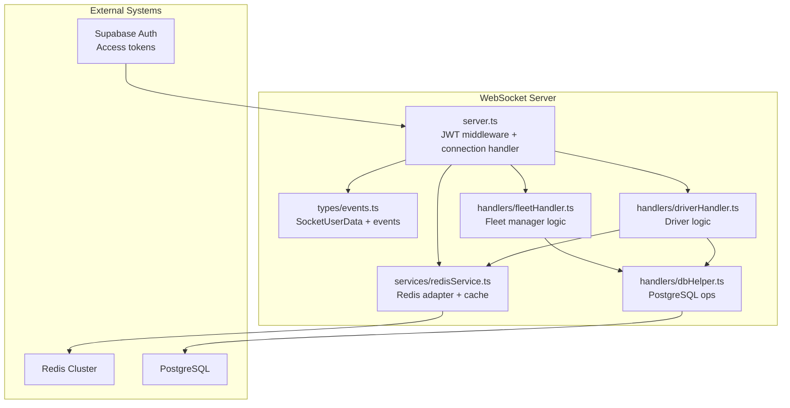
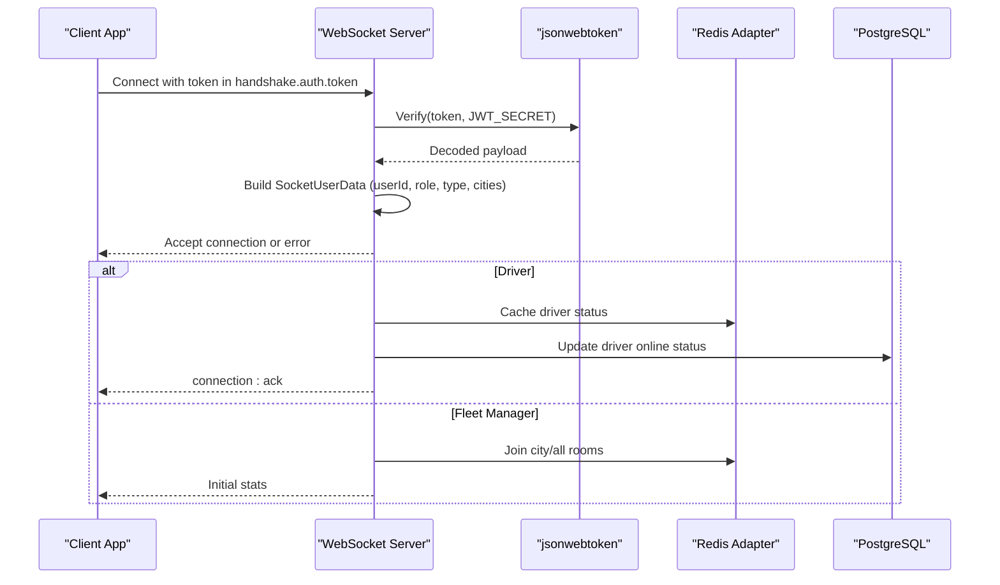
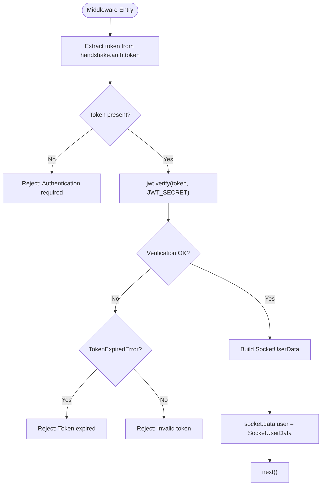
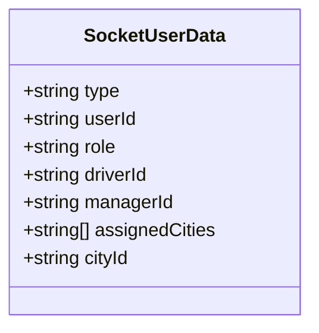
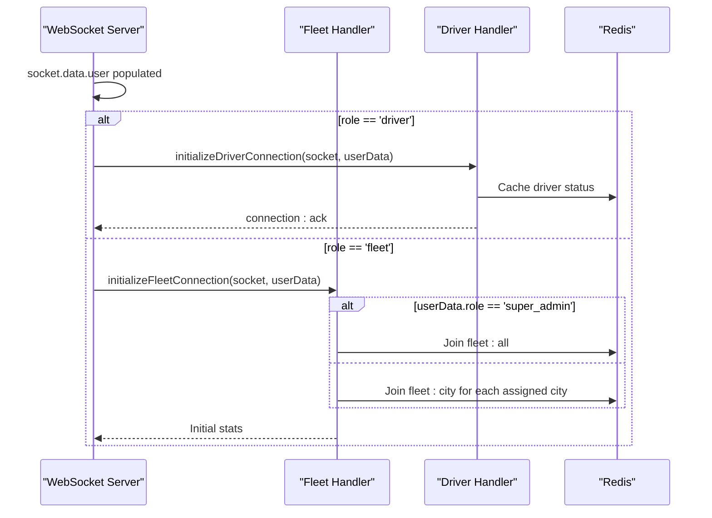
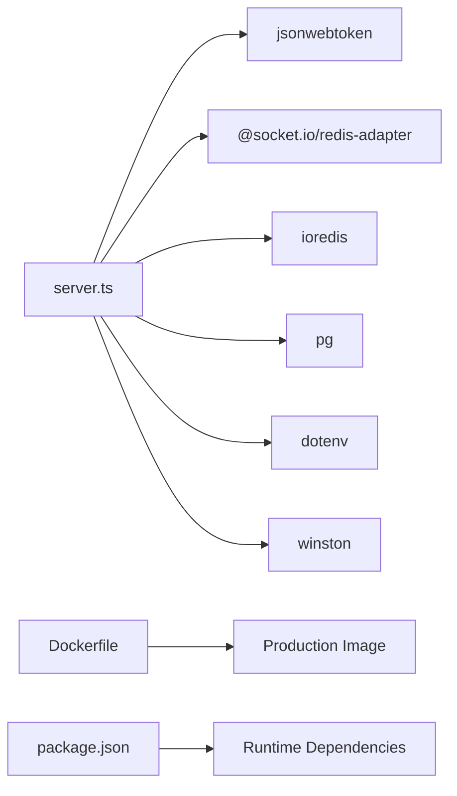

# Authentication & Authorization

<cite>
**Referenced Files in This Document**
- [server.ts](file://websocket-server/src/server.ts)
- [events.ts](file://websocket-server/src/types/events.ts)
- [fleetHandler.ts](file://websocket-server/src/handlers/fleetHandler.ts)
- [driverHandler.ts](file://websocket-server/src/handlers/driverHandler.ts)
- [redisService.ts](file://websocket-server/src/services/redisService.ts)
- [dbHelper.ts](file://websocket-server/src/handlers/dbHelper.ts)
- [package.json](file://websocket-server/package.json)
- [Dockerfile](file://websocket-server/Dockerfile)
- [AuthContext.tsx](file://src/contexts/AuthContext.tsx)
- [index.ts](file://supabase/functions/fleet-auth/index.ts)
</cite>

## Table of Contents
1. [Introduction](#introduction)
2. [Project Structure](#project-structure)
3. [Core Components](#core-components)
4. [Architecture Overview](#architecture-overview)
5. [Detailed Component Analysis](#detailed-component-analysis)
6. [Dependency Analysis](#dependency-analysis)
7. [Performance Considerations](#performance-considerations)
8. [Troubleshooting Guide](#troubleshooting-guide)
9. [Conclusion](#conclusion)

## Introduction
This document provides comprehensive authentication and authorization documentation for WebSocket connections in the Fleet Management WebSocket Server. It explains the JWT authentication middleware, token validation process, user role detection, and the SocketUserData interface. It also covers authentication failure scenarios, authenticated connection initialization, user data storage on socket objects, role-based access control, security considerations, token refresh mechanisms, and authentication error handling patterns.

## Project Structure
The WebSocket server is implemented in TypeScript using Socket.IO with Redis adapter for multi-server scaling. The authentication flow is centralized in the server middleware and validated against Supabase-managed access tokens.

**Diagram sources**
- [server.ts:37-55](file://websocket-server/src/server.ts#L37-L55)
- [events.ts:15-23](file://websocket-server/src/types/events.ts#L15-L23)
- [fleetHandler.ts:36-62](file://websocket-server/src/handlers/fleetHandler.ts#L36-L62)
- [driverHandler.ts:48-80](file://websocket-server/src/handlers/driverHandler.ts#L48-L80)
- [redisService.ts:63-82](file://websocket-server/src/services/redisService.ts#L63-L82)
- [dbHelper.ts:15-29](file://websocket-server/src/handlers/dbHelper.ts#L15-L29)

**Section sources**
- [server.ts:1-256](file://websocket-server/src/server.ts#L1-L256)
- [events.ts:1-210](file://websocket-server/src/types/events.ts#L1-L210)
- [fleetHandler.ts:1-247](file://websocket-server/src/handlers/fleetHandler.ts#L1-L247)
- [driverHandler.ts:1-318](file://websocket-server/src/handlers/driverHandler.ts#L1-L318)
- [redisService.ts:1-264](file://websocket-server/src/services/redisService.ts#L1-L264)
- [dbHelper.ts:1-204](file://websocket-server/src/handlers/dbHelper.ts#L1-L204)

## Core Components
- JWT Authentication Middleware: Validates the presence and validity of the JWT token and populates SocketUserData on the socket.
- SocketUserData Interface: Defines the authenticated user's identity and permissions stored on each socket.
- Role-Based Access Control: Fleet managers and drivers join different rooms and receive different capabilities based on roles.
- Redis Adapter: Enables horizontal scaling across multiple WebSocket server instances.
- Database Integration: PostgreSQL-backed driver data and location history persistence.

**Section sources**
- [server.ts:65-103](file://websocket-server/src/server.ts#L65-L103)
- [events.ts:15-23](file://websocket-server/src/types/events.ts#L15-L23)
- [redisService.ts:63-82](file://websocket-server/src/services/redisService.ts#L63-L82)
- [dbHelper.ts:34-53](file://websocket-server/src/handlers/dbHelper.ts#L34-L53)

## Architecture Overview
The authentication pipeline begins at the Socket.IO connection handshake. The server extracts the token from socket.handshake.auth.token, verifies it using jsonwebtoken, and constructs SocketUserData. Based on the role, the socket is directed to the appropriate handler and rooms.

**Diagram sources**
- [server.ts:65-103](file://websocket-server/src/server.ts#L65-L103)
- [driverHandler.ts:48-80](file://websocket-server/src/handlers/driverHandler.ts#L48-L80)
- [fleetHandler.ts:36-62](file://websocket-server/src/handlers/fleetHandler.ts#L36-L62)
- [redisService.ts:119-128](file://websocket-server/src/services/redisService.ts#L119-L128)
- [dbHelper.ts:58-78](file://websocket-server/src/handlers/dbHelper.ts#L58-L78)

## Detailed Component Analysis

### JWT Authentication Middleware
- Token extraction: Reads token from socket.handshake.auth.token.
- Presence check: Rejects connections without a token.
- Verification: Uses jsonwebtoken to verify the token against JWT_SECRET.
- User data construction: Builds SocketUserData with type, userId, role, driverId/managerId, and assignedCities.
- Error handling: Distinguishes expired vs invalid tokens and returns standardized error messages.

**Diagram sources**
- [server.ts:65-103](file://websocket-server/src/server.ts#L65-L103)

**Section sources**
- [server.ts:65-103](file://websocket-server/src/server.ts#L65-L103)

### SocketUserData Interface
Defines the authenticated user's identity and permissions attached to each socket:
- type: 'driver' | 'fleet'
- userId: string (subject or user identifier)
- role: 'driver' | 'fleet_manager' | 'super_admin'
- driverId?: string (present for drivers)
- managerId?: string (present for fleet managers)
- assignedCities: string[] (city IDs for fleet managers)
- cityId?: string (optional current city)

**Diagram sources**
- [events.ts:15-23](file://websocket-server/src/types/events.ts#L15-L23)

**Section sources**
- [events.ts:15-23](file://websocket-server/src/types/events.ts#L15-L23)

### Role Detection and Room Assignment
- Driver role: socket joins driver-specific room and receives connection acknowledgment with recommended update interval.
- Fleet manager role: joins either all cities room (super_admin) or assigned cities rooms; receives initial stats for subscribed cities.

**Diagram sources**
- [server.ts:108-130](file://websocket-server/src/server.ts#L108-L130)
- [driverHandler.ts:48-80](file://websocket-server/src/handlers/driverHandler.ts#L48-L80)
- [fleetHandler.ts:36-62](file://websocket-server/src/handlers/fleetHandler.ts#L36-L62)

**Section sources**
- [server.ts:108-130](file://websocket-server/src/server.ts#L108-L130)
- [driverHandler.ts:48-80](file://websocket-server/src/handlers/driverHandler.ts#L48-L80)
- [fleetHandler.ts:36-62](file://websocket-server/src/handlers/fleetHandler.ts#L36-L62)

### Authentication Failure Scenarios
- Missing token: Connection rejected with "Authentication required".
- Expired token: Connection rejected with "Token expired".
- Invalid token: Connection rejected with "Invalid token".
- General authentication failure: Connection rejected with "Authentication failed".

These failures originate from the JWT verification step and are surfaced via next(new Error(...)) in the middleware.

**Section sources**
- [server.ts:95-102](file://websocket-server/src/server.ts#L95-L102)

### Authenticated Connection Initialization
- Driver initialization:
  - Joins driver-specific room.
  - Caches driver status in Redis.
  - Updates driver online status in PostgreSQL.
  - Emits connection acknowledgment with recommended update interval.
- Fleet manager initialization:
  - Joins appropriate rooms based on role and assigned cities.
  - Sets up event handlers for city subscription and history requests.
  - Sends initial statistics for subscribed cities.

**Section sources**
- [driverHandler.ts:48-80](file://websocket-server/src/handlers/driverHandler.ts#L48-L80)
- [fleetHandler.ts:36-62](file://websocket-server/src/handlers/fleetHandler.ts#L36-L62)

### User Data Storage on Socket Objects
- The middleware stores SocketUserData on socket.data.user after successful JWT verification.
- Handlers access socket.data.user to determine routing and permissions.

**Section sources**
- [server.ts:90-91](file://websocket-server/src/server.ts#L90-L91)
- [driverHandler.ts:52-55](file://websocket-server/src/handlers/driverHandler.ts#L52-L55)
- [fleetHandler.ts:40-42](file://websocket-server/src/handlers/fleetHandler.ts#L40-L42)

### Role-Based Access Control
- City subscription:
  - Super admin can join any city room.
  - Fleet manager can only join rooms for assigned cities.
- Location history requests:
  - Managers must have access to the driver's city; unauthorized attempts are rejected.
- Broadcasting:
  - Driver location/status updates are broadcast to relevant fleet rooms (city or all).

**Section sources**
- [fleetHandler.ts:108-116](file://websocket-server/src/handlers/fleetHandler.ts#L108-L116)
- [fleetHandler.ts:178-186](file://websocket-server/src/handlers/fleetHandler.ts#L178-L186)
- [driverHandler.ts:172-182](file://websocket-server/src/handlers/driverHandler.ts#L172-L182)

### Security Considerations
- Secret management:
  - JWT_SECRET must be configured; server exits if missing.
  - Separate refresh secret exists in backend auth functions.
- Transport and network:
  - Enforces secure WebSocket transport and optional polling fallback.
  - CORS configured via ALLOWED_ORIGINS.
- Redis and database:
  - Redis adapter ensures multi-instance consistency.
  - PostgreSQL connection pooling with SSL option.
- Token refresh:
  - Backend auth functions issue access and refresh tokens with distinct secrets and types.

**Section sources**
- [server.ts:28-32](file://websocket-server/src/server.ts#L28-L32)
- [server.ts:39-42](file://websocket-server/src/server.ts#L39-L42)
- [redisService.ts:63-82](file://websocket-server/src/services/redisService.ts#L63-L82)
- [dbHelper.ts:15-29](file://websocket-server/src/handlers/dbHelper.ts#L15-L29)
- [index.ts:37-62](file://supabase/functions/fleet-auth/index.ts#L37-L62)
- [index.ts:78-88](file://supabase/functions/fleet-auth/index.ts#L78-L88)

### Token Refresh Mechanisms
- Access token generation includes type: 'fleet_access' and expiration.
- Refresh token generation includes type: 'fleet_refresh' and separate expiration.
- Validation distinguishes token types to prevent misuse.

Note: The frontend obtains tokens from Supabase; the WebSocket server consumes the access token passed during connection.

**Section sources**
- [index.ts:37-62](file://supabase/functions/fleet-auth/index.ts#L37-L62)
- [index.ts:66-88](file://supabase/functions/fleet-auth/index.ts#L66-L88)

### Authentication Error Handling Patterns
- Standardized error codes and messages are emitted to clients for validation failures and unauthorized access attempts.
- Errors are logged centrally in handlers for diagnostics.

**Section sources**
- [fleetHandler.ts:96-102](file://websocket-server/src/handlers/fleetHandler.ts#L96-L102)
- [fleetHandler.ts:133-140](file://websocket-server/src/handlers/fleetHandler.ts#L133-L140)
- [driverHandler.ts:128-135](file://websocket-server/src/handlers/driverHandler.ts#L128-L135)

## Dependency Analysis
The WebSocket server depends on external systems for authentication, caching, and persistence. The package.json lists core dependencies, while Dockerfile defines the production runtime.

**Diagram sources**
- [server.ts:6-16](file://websocket-server/src/server.ts#L6-L16)
- [package.json:21-29](file://websocket-server/package.json#L21-L29)
- [Dockerfile:43-70](file://websocket-server/Dockerfile#L43-L70)

**Section sources**
- [package.json:1-44](file://websocket-server/package.json#L1-L44)
- [Dockerfile:1-96](file://websocket-server/Dockerfile#L1-L96)

## Performance Considerations
- Connection limits: Enforced via WS_MAX_CONNECTIONS to prevent overload.
- Compression: perMessageDeflate enabled for large messages.
- Redis TTLs: Location and status caches expire automatically.
- Asynchronous persistence: Database writes are fire-and-forget to avoid blocking the event loop.

[No sources needed since this section provides general guidance]

## Troubleshooting Guide
- Authentication required: Ensure the client passes a token in socket.handshake.auth.token.
- Token expired: Trigger a token refresh via the backend auth flow and reconnect.
- Invalid token: Verify JWT_SECRET matches the backend and token issuer.
- Unauthorized city access: Fleet managers must only request cities in assignedCities.
- Redis connectivity: Use readiness probe (/ready) to verify Redis health.
- Database connectivity: Check connection string and SSL settings.

**Section sources**
- [server.ts:109-117](file://websocket-server/src/server.ts#L109-L117)
- [server.ts:177-187](file://websocket-server/src/server.ts#L177-L187)
- [redisService.ts:254-263](file://websocket-server/src/services/redisService.ts#L254-L263)
- [dbHelper.ts:15-29](file://websocket-server/src/handlers/dbHelper.ts#L15-L29)

## Conclusion
The WebSocket server implements robust JWT-based authentication with clear role-based access control, scalable Redis adapter integration, and PostgreSQL-backed persistence. The SocketUserData interface centralizes authenticated identity and permissions, enabling secure and efficient real-time communication for drivers and fleet managers.