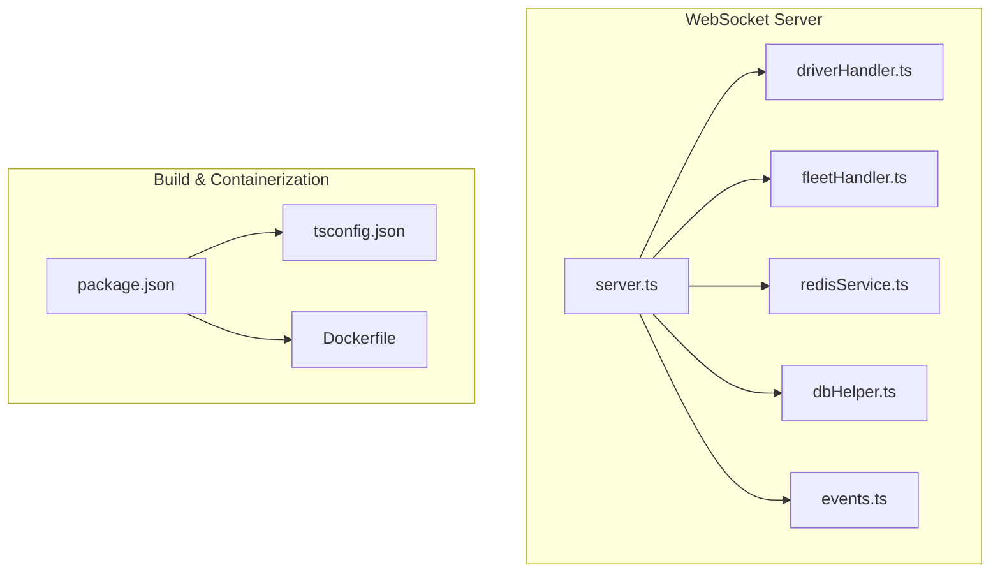
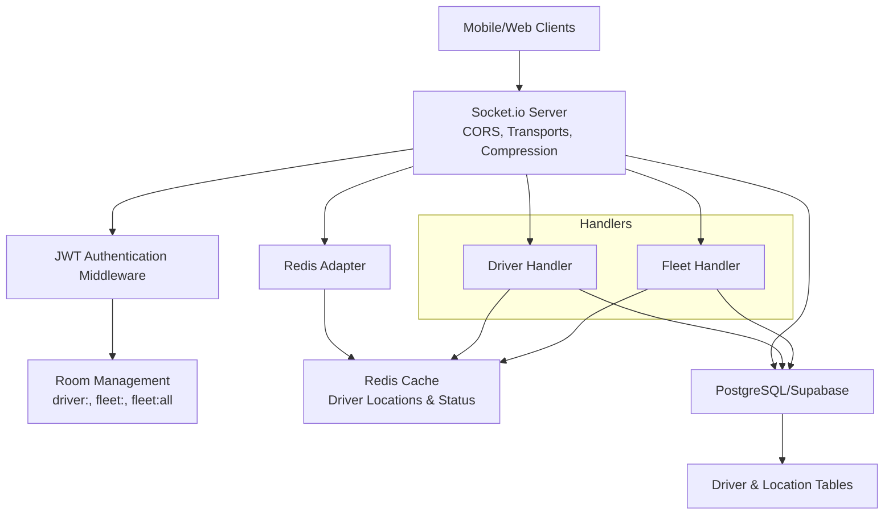
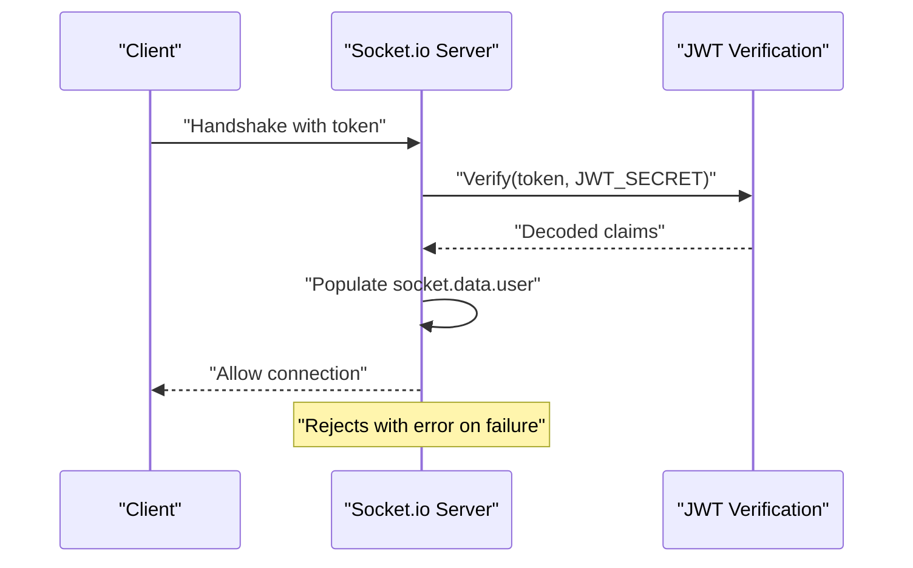
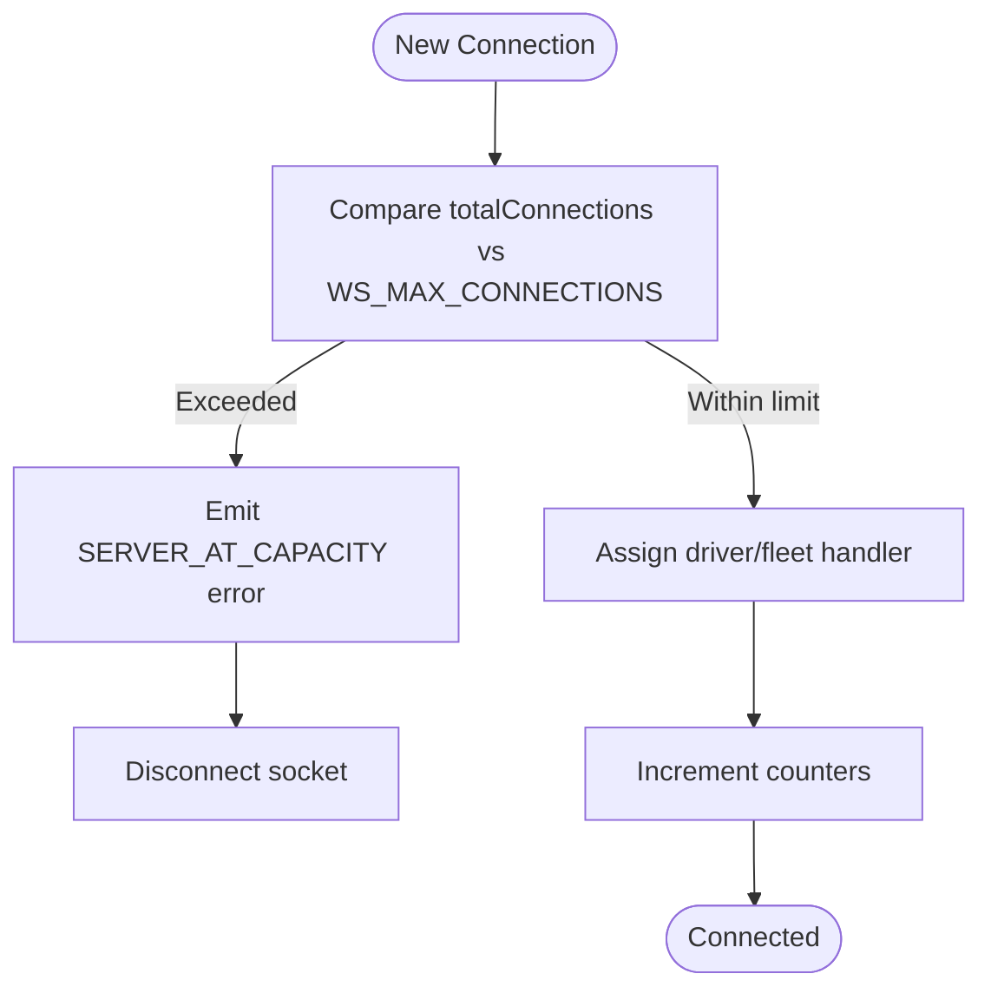
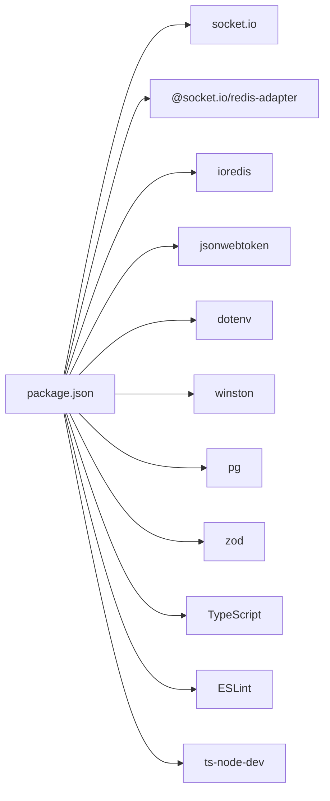

# Configuration & Setup

<cite>
**Referenced Files in This Document**
- [server.ts](file://websocket-server/src/server.ts)
- [driverHandler.ts](file://websocket-server/src/handlers/driverHandler.ts)
- [fleetHandler.ts](file://websocket-server/src/handlers/fleetHandler.ts)
- [redisService.ts](file://websocket-server/src/services/redisService.ts)
- [dbHelper.ts](file://websocket-server/src/handlers/dbHelper.ts)
- [events.ts](file://websocket-server/src/types/events.ts)
- [package.json](file://websocket-server/package.json)
- [tsconfig.json](file://websocket-server/tsconfig.json)
- [Dockerfile](file://websocket-server/Dockerfile)
- [vite.config.ts](file://vite.config.ts)
</cite>

## Table of Contents
1. [Introduction](#introduction)
2. [Project Structure](#project-structure)
3. [Core Components](#core-components)
4. [Architecture Overview](#architecture-overview)
5. [Detailed Component Analysis](#detailed-component-analysis)
6. [Dependency Analysis](#dependency-analysis)
7. [Performance Considerations](#performance-considerations)
8. [Troubleshooting Guide](#troubleshooting-guide)
9. [Conclusion](#conclusion)
10. [Appendices](#appendices)

## Introduction
This document provides comprehensive configuration and setup guidance for the WebSocket server used by the Fleet Management Portal. It covers environment variables, Socket.io server configuration, TypeScript setup, dependency management, build process, production vs development configurations, security considerations for JWT secrets, performance tuning parameters, and health check endpoints.

## Project Structure
The WebSocket server is organized into modular TypeScript files under the websocket-server directory. Key areas include:
- Server entrypoint and Socket.io configuration
- Handlers for driver and fleet manager interactions
- Redis adapter and caching utilities
- PostgreSQL database helpers
- Type definitions for events and payloads
- Build and containerization configuration

**Diagram sources**
- [server.ts:1-256](file://websocket-server/src/server.ts#L1-L256)
- [driverHandler.ts:1-318](file://websocket-server/src/handlers/driverHandler.ts#L1-L318)
- [fleetHandler.ts:1-247](file://websocket-server/src/handlers/fleetHandler.ts#L1-L247)
- [redisService.ts:1-264](file://websocket-server/src/services/redisService.ts#L1-L264)
- [dbHelper.ts:1-204](file://websocket-server/src/handlers/dbHelper.ts#L1-L204)
- [events.ts:1-210](file://websocket-server/src/types/events.ts#L1-L210)
- [package.json:1-44](file://websocket-server/package.json#L1-L44)
- [tsconfig.json:1-36](file://websocket-server/tsconfig.json#L1-L36)
- [Dockerfile:1-96](file://websocket-server/Dockerfile#L1-L96)

**Section sources**
- [server.ts:1-256](file://websocket-server/src/server.ts#L1-L256)
- [package.json:1-44](file://websocket-server/package.json#L1-L44)
- [tsconfig.json:1-36](file://websocket-server/tsconfig.json#L1-L36)
- [Dockerfile:1-96](file://websocket-server/Dockerfile#L1-L96)

## Core Components
This section documents the primary configuration surfaces exposed by the WebSocket server.

- Environment variables
  - JWT_SECRET: Required for JWT verification during Socket.io authentication middleware.
  - ALLOWED_ORIGINS: Comma-separated list of origins for CORS configuration.
  - WS_MAX_CONNECTIONS: Maximum concurrent connections enforced at the server level.
  - WS_PING_INTERVAL: Interval for ping messages to keep connections alive.
  - WS_PING_TIMEOUT: Timeout for pong responses before disconnecting.
  - WS_UPGRADE_TIMEOUT: Timeout for HTTP upgrade to WebSocket.
  - Additional optional variables:
    - PORT: Server port (defaulted to 3001).
    - NODE_ENV: Environment mode (defaulted to development).
    - LOG_LEVEL: Logging verbosity (defaulted to info).
    - REDIS_URL, REDIS_PASSWORD, REDIS_DB, REDIS_CLUSTER_MODE, REDIS_CLUSTER_NODES: Redis connectivity and clustering options.
    - LOCATION_CACHE_TTL, STATUS_CACHE_TTL, REDIS_KEY_PREFIX: Redis caching behavior.
    - DATABASE_URL, DATABASE_POOL_SIZE, DATABASE_SSL: PostgreSQL/Supabase connection settings.
    - LOCATION_UPDATE_INTERVAL: Minimum interval between driver location updates.
    - MAX_LOCATION_HISTORY_POINTS: Limit for historical location queries.
    - VITE_* variables (frontend): Sentry DSN, PostHog key, Sentry org/project/auth token.

- Socket.io server configuration
  - CORS: Origin list and credential allowance.
  - Transport protocols: websocket and polling fallback.
  - Compression: per-message deflate with a 1 KB threshold.
  - Buffer sizes: maxHttpBufferSize set to 1 MB.
  - Heartbeat: pingInterval, pingTimeout, upgradeTimeout.

- Health checks
  - /health: Returns server status, timestamps, connection counts, and environment.
  - /ready: Probes Redis health; responds OK when healthy, otherwise 503.

**Section sources**
- [server.ts:18-51](file://websocket-server/src/server.ts#L18-L51)
- [server.ts:162-192](file://websocket-server/src/server.ts#L162-L192)
- [redisService.ts:14-17](file://websocket-server/src/services/redisService.ts#L14-L17)
- [redisService.ts:24-42](file://websocket-server/src/services/redisService.ts#L24-L42)
- [dbHelper.ts:15-21](file://websocket-server/src/handlers/dbHelper.ts#L15-L21)
- [driverHandler.ts:24-26](file://websocket-server/src/handlers/driverHandler.ts#L24-L26)
- [fleetHandler.ts:29-31](file://websocket-server/src/handlers/fleetHandler.ts#L29-L31)

## Architecture Overview
The WebSocket server integrates Socket.io with Redis for horizontal scaling and PostgreSQL for durable storage. Authentication is performed via JWT tokens passed during handshake. Handlers manage driver and fleet manager interactions, while Redis caches frequently accessed data and Socket.io’s Redis adapter synchronizes state across instances.

**Diagram sources**
- [server.ts:37-51](file://websocket-server/src/server.ts#L37-L51)
- [server.ts:65-103](file://websocket-server/src/server.ts#L65-L103)
- [redisService.ts:63-82](file://websocket-server/src/services/redisService.ts#L63-L82)
- [driverHandler.ts:48-80](file://websocket-server/src/handlers/driverHandler.ts#L48-L80)
- [fleetHandler.ts:36-62](file://websocket-server/src/handlers/fleetHandler.ts#L36-L62)
- [dbHelper.ts:34-78](file://websocket-server/src/handlers/dbHelper.ts#L34-L78)

## Detailed Component Analysis

### Environment Variables Reference
- Required
  - JWT_SECRET: Must be set; server exits if missing.
- Optional (with defaults)
  - PORT: Defaults to 3001.
  - NODE_ENV: Defaults to development.
  - LOG_LEVEL: Defaults to info.
  - WS_MAX_CONNECTIONS: Defaults to 10000.
  - WS_PING_INTERVAL: Defaults to 25000 ms.
  - WS_PING_TIMEOUT: Defaults to 60000 ms.
  - WS_UPGRADE_TIMEOUT: Defaults to 10000 ms.
  - ALLOWED_ORIGINS: Defaults to http://localhost:3000 when unspecified.
- Redis
  - REDIS_URL: Defaults to redis://localhost:6379.
  - REDIS_PASSWORD: Optional.
  - REDIS_DB: Defaults to 0.
  - REDIS_CLUSTER_MODE: Boolean flag to enable cluster mode.
  - REDIS_CLUSTER_NODES: Comma-separated nodes when cluster mode is enabled.
  - LOCATION_CACHE_TTL: Defaults to 300 seconds.
  - STATUS_CACHE_TTL: Defaults to 60 seconds.
  - REDIS_KEY_PREFIX: Defaults to fleet:.
- Database
  - DATABASE_URL: Required for PostgreSQL/Supabase.
  - DATABASE_POOL_SIZE: Defaults to 20.
  - DATABASE_SSL: Boolean flag enabling SSL with relaxed verification.
- Driver/Fleet
  - LOCATION_UPDATE_INTERVAL: Defaults to 5000 ms.
  - MAX_LOCATION_HISTORY_POINTS: Defaults to 1000.

**Section sources**
- [server.ts:18-26](file://websocket-server/src/server.ts#L18-L26)
- [server.ts:38-51](file://websocket-server/src/server.ts#L38-L51)
- [redisService.ts:14-17](file://websocket-server/src/services/redisService.ts#L14-L17)
- [redisService.ts:24-42](file://websocket-server/src/services/redisService.ts#L24-L42)
- [dbHelper.ts:15-21](file://websocket-server/src/handlers/dbHelper.ts#L15-L21)
- [driverHandler.ts:24-26](file://websocket-server/src/handlers/driverHandler.ts#L24-L26)
- [fleetHandler.ts:29-31](file://websocket-server/src/handlers/fleetHandler.ts#L29-L31)

### Socket.io Server Configuration
- CORS
  - origin: Array parsed from ALLOWED_ORIGINS or default fallback.
  - credentials: Enabled to allow cookies/credentials.
- Transport protocols
  - transports: websocket and polling (fallback).
- Compression
  - perMessageDeflate.threshold: 1024 bytes.
- Buffer sizing
  - maxHttpBufferSize: 1e6 (1 MB).
- Heartbeats
  - pingInterval: WS_PING_INTERVAL.
  - pingTimeout: WS_PING_TIMEOUT.
  - upgradeTimeout: WS_UPGRADE_TIMEOUT.

**Section sources**
- [server.ts:38-51](file://websocket-server/src/server.ts#L38-L51)

### JWT Authentication Middleware
- Extracts token from socket.handshake.auth.token.
- Verifies token against JWT_SECRET.
- Populates socket.data.user with role-based metadata.
- Rejects connections with explicit error messages for missing/expired/invalid tokens.

**Diagram sources**
- [server.ts:65-103](file://websocket-server/src/server.ts#L65-L103)

**Section sources**
- [server.ts:65-103](file://websocket-server/src/server.ts#L65-L103)

### Connection Limits and Metrics
- Enforced at server level using a counter and WS_MAX_CONNECTIONS.
- Tracks total, driver, and fleet connections.
- Emits an error and disconnects when capacity is reached.

**Diagram sources**
- [server.ts:108-150](file://websocket-server/src/server.ts#L108-L150)

**Section sources**
- [server.ts:108-150](file://websocket-server/src/server.ts#L108-L150)

### Driver Handler
- Joins driver-specific room upon connection.
- Caches driver status and persists online status to database.
- Validates and rate-limits location updates.
- Broadcasts location and status updates to relevant fleet rooms.
- Persists location asynchronously to database.

**Section sources**
- [driverHandler.ts:48-80](file://websocket-server/src/handlers/driverHandler.ts#L48-L80)
- [driverHandler.ts:105-207](file://websocket-server/src/handlers/driverHandler.ts#L105-L207)
- [driverHandler.ts:212-275](file://websocket-server/src/handlers/driverHandler.ts#L212-L275)

### Fleet Handler
- Joins rooms based on role and assigned cities.
- Validates city subscription requests and access control.
- Requests driver location history with validation and access checks.
- Sends initial city statistics to subscribed clients.

**Section sources**
- [fleetHandler.ts:36-62](file://websocket-server/src/handlers/fleetHandler.ts#L36-L62)
- [fleetHandler.ts:87-140](file://websocket-server/src/handlers/fleetHandler.ts#L87-L140)
- [fleetHandler.ts:145-212](file://websocket-server/src/handlers/fleetHandler.ts#L145-L212)

### Redis Service
- Provides shared Redis client and adapter clients for Socket.io.
- Supports single-node and cluster modes.
- Caches driver location and status with TTLs.
- Offers health check via PING.

**Section sources**
- [redisService.ts:22-58](file://websocket-server/src/services/redisService.ts#L22-L58)
- [redisService.ts:63-82](file://websocket-server/src/services/redisService.ts#L63-L82)
- [redisService.ts:87-146](file://websocket-server/src/services/redisService.ts#L87-L146)
- [redisService.ts:254-263](file://websocket-server/src/services/redisService.ts#L254-L263)

### Database Helper
- Manages a PostgreSQL connection pool with configurable SSL and pool size.
- Provides driver data retrieval, status updates, and location persistence.
- Implements transactional writes for location history and driver updates.

**Section sources**
- [dbHelper.ts:15-29](file://websocket-server/src/handlers/dbHelper.ts#L15-L29)
- [dbHelper.ts:34-78](file://websocket-server/src/handlers/dbHelper.ts#L34-L78)
- [dbHelper.ts:83-125](file://websocket-server/src/handlers/dbHelper.ts#L83-L125)
- [dbHelper.ts:130-163](file://websocket-server/src/handlers/dbHelper.ts#L130-L163)
- [dbHelper.ts:168-192](file://websocket-server/src/handlers/dbHelper.ts#L168-L192)

### Health Check Endpoints
- /health
  - Returns server status, timestamp, connection counts (total, drivers, fleet), and environment.
- /ready
  - Probes Redis health; returns OK on success, otherwise 503 with a descriptive message.

**Section sources**
- [server.ts:162-192](file://websocket-server/src/server.ts#L162-L192)
- [redisService.ts:254-263](file://websocket-server/src/services/redisService.ts#L254-L263)

## Dependency Analysis
The WebSocket server relies on the following core dependencies:
- socket.io and @socket.io/redis-adapter for real-time bidirectional communication and clustering.
- ioredis for Redis connectivity and adapter clients.
- jsonwebtoken for JWT verification.
- dotenv for environment variable loading.
- winston for logging.
- pg for PostgreSQL/Supabase database access.
- zod for runtime validation of payloads.

Development and build dependencies include TypeScript, ESLint, ts-node-dev, and related type packages.

**Diagram sources**
- [package.json:21-40](file://websocket-server/package.json#L21-L40)

**Section sources**
- [package.json:21-40](file://websocket-server/package.json#L21-L40)

## Performance Considerations
- Connection limits
  - Tune WS_MAX_CONNECTIONS based on available resources and expected concurrency.
- Heartbeats
  - Adjust WS_PING_INTERVAL and WS_PING_TIMEOUT to balance responsiveness and overhead.
- Transport fallback
  - Keep polling enabled for environments with restrictive firewalls; monitor impact on bandwidth.
- Compression
  - perMessageDeflate.threshold at 1024 bytes reduces payload sizes; evaluate trade-offs for CPU usage.
- Buffer sizing
  - maxHttpBufferSize at 1 MB accommodates typical payloads; adjust if clients send larger messages.
- Redis caching
  - Optimize LOCATION_CACHE_TTL and STATUS_CACHE_TTL for desired freshness vs. memory usage.
- Database pool
  - Scale DATABASE_POOL_SIZE according to workload; enable DATABASE_SSL for secure connections.
- Rate limiting
  - LOCATION_UPDATE_INTERVAL prevents excessive updates; consider moving to Redis-backed rate limiter for cross-instance consistency.

[No sources needed since this section provides general guidance]

## Troubleshooting Guide
- Authentication failures
  - Ensure JWT_SECRET is set and matches the token issuer.
  - Verify token presence and validity; check for expiration or signature errors.
- Connection refused or capacity exceeded
  - Confirm WS_MAX_CONNECTIONS and server resource limits.
  - Review logs for SERVER_AT_CAPACITY errors.
- Redis connectivity issues
  - Validate REDIS_URL, REDIS_PASSWORD, REDIS_DB, and cluster settings.
  - Use /ready endpoint to confirm Redis health.
- Database errors
  - Check DATABASE_URL, pool size, and SSL settings.
  - Inspect transaction rollback scenarios for location persistence.
- Health endpoint anomalies
  - /health should return 200 with JSON payload; /ready should return 200 or 503 depending on Redis.

**Section sources**
- [server.ts:28-32](file://websocket-server/src/server.ts#L28-L32)
- [server.ts:65-103](file://websocket-server/src/server.ts#L65-L103)
- [server.ts:108-150](file://websocket-server/src/server.ts#L108-L150)
- [redisService.ts:254-263](file://websocket-server/src/services/redisService.ts#L254-L263)
- [dbHelper.ts:15-29](file://websocket-server/src/handlers/dbHelper.ts#L15-L29)

## Conclusion
The WebSocket server is configured for scalability, security, and operability. Proper environment variable management, careful tuning of Socket.io parameters, and robust Redis and database integration ensure reliable real-time tracking for drivers and fleet managers. Use the provided health endpoints and handlers to monitor and maintain system stability.

[No sources needed since this section summarizes without analyzing specific files]

## Appendices

### TypeScript Configuration
- Compiler options emphasize strictness and emit declarations/source maps.
- Module resolution targets Node.js with ES2022.
- Includes source paths and excludes tests.

**Section sources**
- [tsconfig.json:2-32](file://websocket-server/tsconfig.json#L2-L32)

### Build and Scripts
- Build: tsc compiles TypeScript to dist.
- Start: node dist/server.js runs the compiled server.
- Dev: ts-node-dev watches and restarts on changes.
- Lint: ESLint scans TypeScript sources.
- Typecheck: tsc validates types without emitting.

**Section sources**
- [package.json:6-11](file://websocket-server/package.json#L6-L11)

### Containerization
- Multi-stage Docker build:
  - Dependencies stage installs production dependencies.
  - Builder stage compiles TypeScript with dev dependencies.
  - Production stage runs the server with non-root user and health checks.
  - Development stage enables hot reload with all dependencies.

**Section sources**
- [Dockerfile:1-96](file://websocket-server/Dockerfile#L1-L96)

### Frontend Integration Notes
- The main project uses Vite with React and Sentry integration.
- While not part of the WebSocket server, frontend environment variables (e.g., VITE_SENTRY_DSN, VITE_POSTHOG_KEY, SENTRY_ORG, SENTRY_PROJECT, SENTRY_AUTH_TOKEN) are managed alongside backend variables for unified deployment.

**Section sources**
- [vite.config.ts:35-39](file://vite.config.ts#L35-L39)