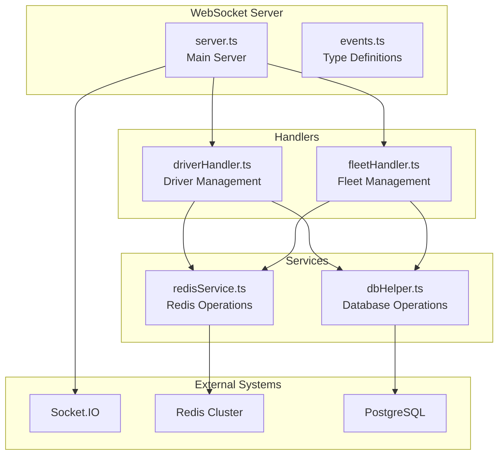
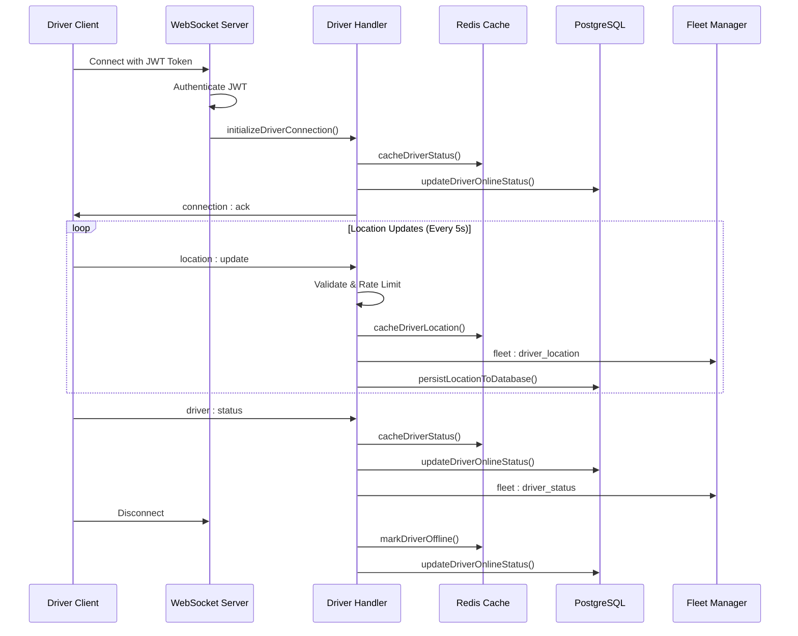
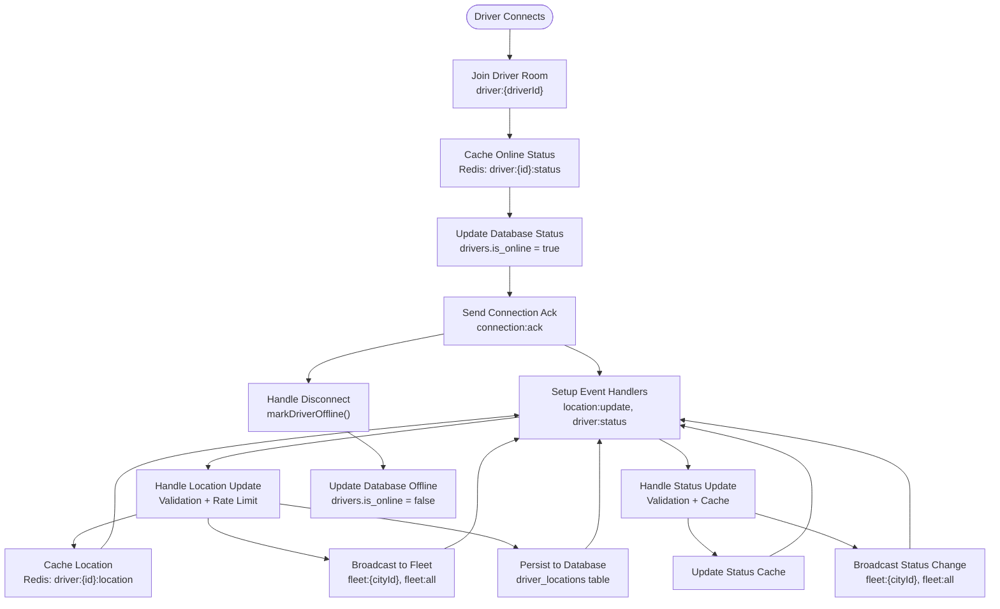
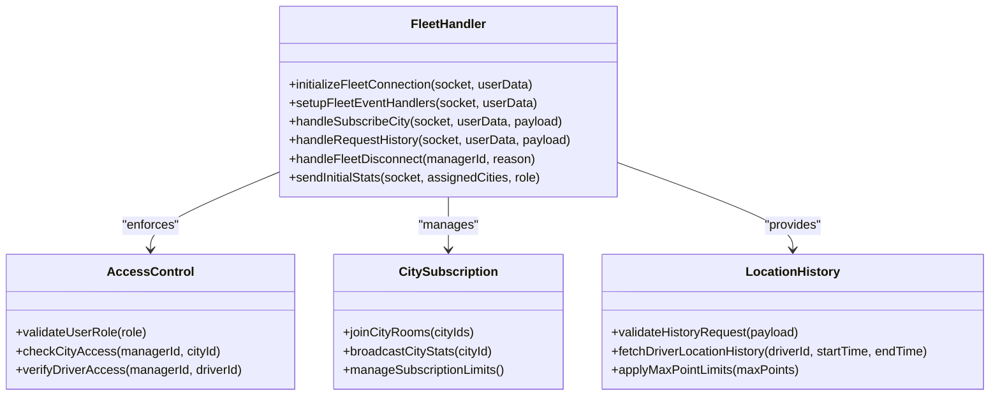
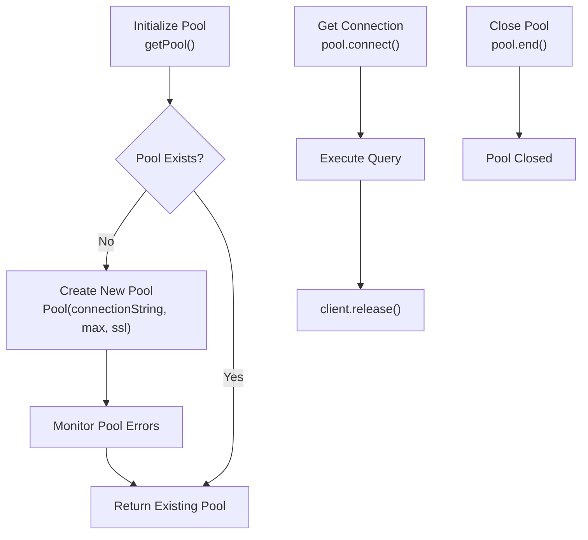
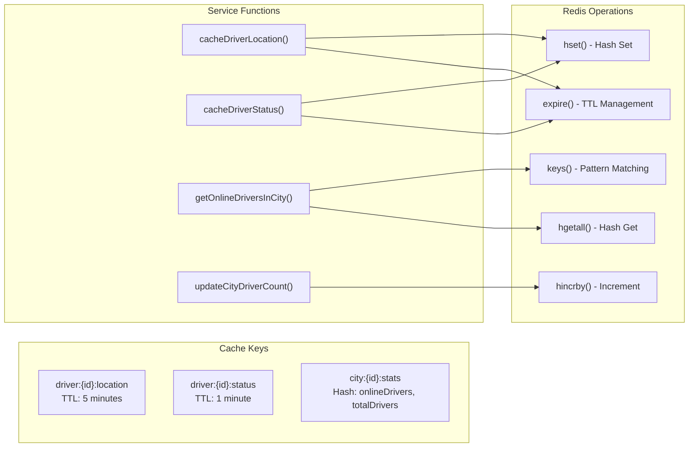
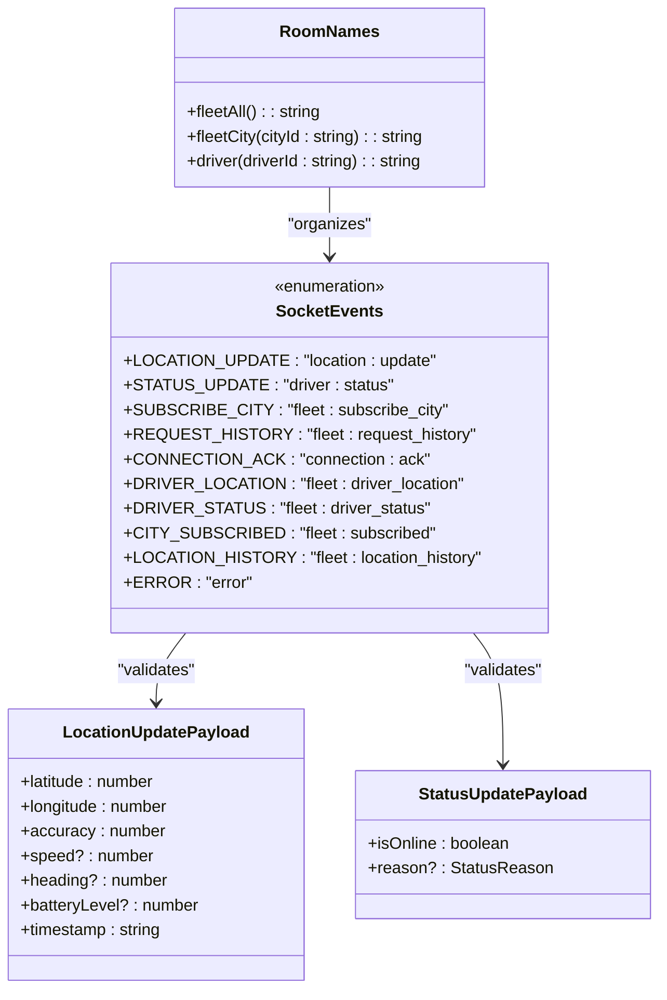
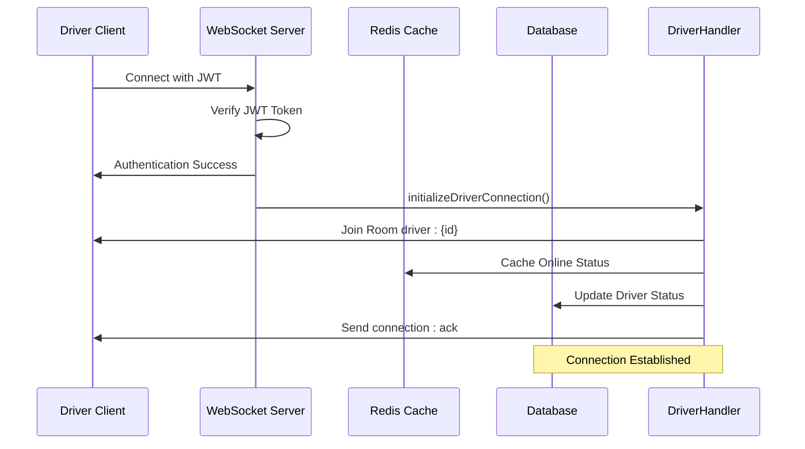
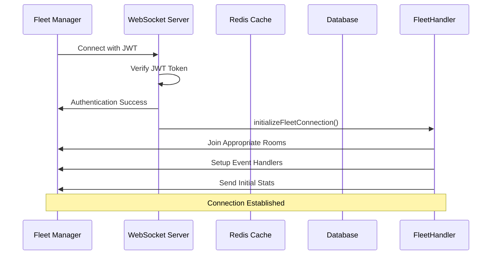
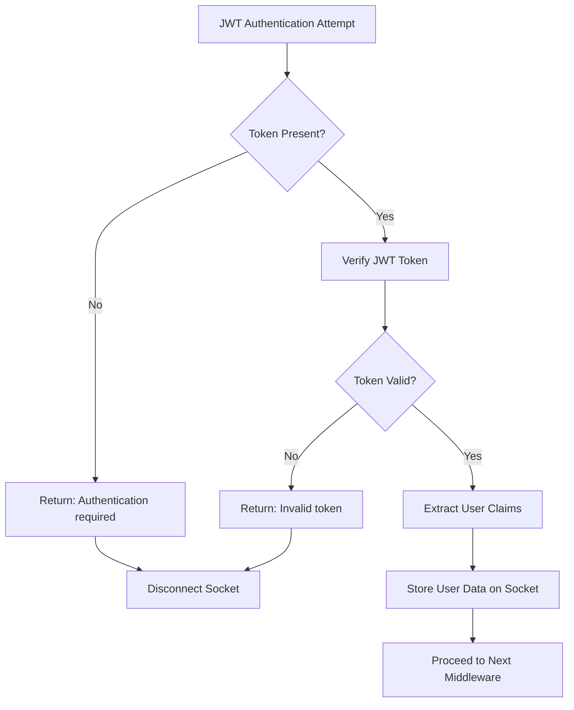

# Connection Handlers

<cite>
**Referenced Files in This Document**
- [server.ts](file://websocket-server/src/server.ts)
- [driverHandler.ts](file://websocket-server/src/handlers/driverHandler.ts)
- [fleetHandler.ts](file://websocket-server/src/handlers/fleetHandler.ts)
- [dbHelper.ts](file://websocket-server/src/handlers/dbHelper.ts)
- [redisService.ts](file://websocket-server/src/services/redisService.ts)
- [events.ts](file://websocket-server/src/types/events.ts)
- [package.json](file://websocket-server/package.json)
</cite>

## Table of Contents
1. [Introduction](#introduction)
2. [Project Structure](#project-structure)
3. [Core Components](#core-components)
4. [Architecture Overview](#architecture-overview)
5. [Detailed Component Analysis](#detailed-component-analysis)
6. [Database Helper Functions](#database-helper-functions)
7. [Redis Service Layer](#redis-service-layer)
8. [Event Types and Contracts](#event-types-and-contracts)
9. [Connection Initialization Patterns](#connection-initialization-patterns)
10. [Error Handling Strategies](#error-handling-strategies)
11. [Performance Considerations](#performance-considerations)
12. [Troubleshooting Guide](#troubleshooting-guide)
13. [Conclusion](#conclusion)

## Introduction

The WebSocket Connection Handlers system provides real-time communication infrastructure for the Nutrio Fleet Management Portal. This system handles two primary user types: drivers who provide location updates and status information, and fleet managers who monitor driver activities and receive operational updates.

The system implements a robust architecture with Socket.IO for real-time communication, Redis for caching and pub/sub messaging, and PostgreSQL for persistent data storage. It supports horizontal scaling through Redis adapters and provides comprehensive error handling, rate limiting, and connection lifecycle management.

## Project Structure

The WebSocket server follows a modular architecture with clear separation of concerns:

**Diagram sources**
- [server.ts:1-256](file://websocket-server/src/server.ts#L1-L256)
- [driverHandler.ts:1-318](file://websocket-server/src/handlers/driverHandler.ts#L1-L318)
- [fleetHandler.ts:1-247](file://websocket-server/src/handlers/fleetHandler.ts#L1-L247)
- [redisService.ts:1-264](file://websocket-server/src/services/redisService.ts#L1-L264)
- [dbHelper.ts:1-204](file://websocket-server/src/handlers/dbHelper.ts#L1-L204)

**Section sources**
- [server.ts:1-256](file://websocket-server/src/server.ts#L1-L256)
- [package.json:1-44](file://websocket-server/package.json#L1-L44)

## Core Components

The system consists of four primary components that work together to provide real-time fleet management capabilities:

### 1. Main Server (`server.ts`)
The central orchestrator that manages Socket.IO server configuration, authentication, connection routing, and graceful shutdown procedures.

### 2. Driver Handler (`driverHandler.ts`)
Manages driver connections, validates location updates, handles status changes, and coordinates real-time broadcasting to fleet managers.

### 3. Fleet Handler (`fleetHandler.ts`)
Handles fleet manager connections, city subscriptions, location history requests, and access control enforcement.

### 4. Database Helper (`dbHelper.ts`)
Provides database connection pooling, transaction management, and CRUD operations for driver and location data.

**Section sources**
- [server.ts:1-256](file://websocket-server/src/server.ts#L1-L256)
- [driverHandler.ts:1-318](file://websocket-server/src/handlers/driverHandler.ts#L1-L318)
- [fleetHandler.ts:1-247](file://websocket-server/src/handlers/fleetHandler.ts#L1-L247)
- [dbHelper.ts:1-204](file://websocket-server/src/handlers/dbHelper.ts#L1-L204)

## Architecture Overview

The system implements a multi-layered architecture designed for scalability and reliability:

**Diagram sources**
- [server.ts:65-150](file://websocket-server/src/server.ts#L65-L150)
- [driverHandler.ts:48-100](file://websocket-server/src/handlers/driverHandler.ts#L48-L100)
- [redisService.ts:87-128](file://websocket-server/src/services/redisService.ts#L87-L128)
- [dbHelper.ts:83-125](file://websocket-server/src/handlers/dbHelper.ts#L83-L125)

## Detailed Component Analysis

### Driver Handler Implementation

The driver handler manages all driver-related WebSocket connections and real-time updates:

#### Connection Lifecycle Management

**Diagram sources**
- [driverHandler.ts:48-100](file://websocket-server/src/handlers/driverHandler.ts#L48-L100)
- [driverHandler.ts:105-207](file://websocket-server/src/handlers/driverHandler.ts#L105-L207)
- [driverHandler.ts:212-275](file://websocket-server/src/handlers/driverHandler.ts#L212-L275)
- [driverHandler.ts:280-317](file://websocket-server/src/handlers/driverHandler.ts#L280-L317)

#### Driver-Specific Event Handling

The driver handler implements comprehensive event processing with validation and error handling:

**Location Update Processing:**
- Payload validation using Zod schemas
- Rate limiting to prevent excessive updates
- Real-time caching in Redis with TTL expiration
- Immediate broadcasting to fleet managers
- Asynchronous database persistence

**Status Update Processing:**
- Boolean validation with optional reason enumeration
- Atomic status updates in Redis cache
- Database synchronization for persistent state
- Broadcast notifications to fleet supervisors

**Resource Cleanup:**
- Automatic offline marking in Redis cache
- Database status synchronization
- Graceful socket disconnection handling

**Section sources**
- [driverHandler.ts:1-318](file://websocket-server/src/handlers/driverHandler.ts#L1-L318)

### Fleet Handler Implementation

The fleet handler manages fleet manager connections and operational oversight:

#### Fleet Manager Functionality

**Diagram sources**
- [fleetHandler.ts:36-62](file://websocket-server/src/handlers/fleetHandler.ts#L36-L62)
- [fleetHandler.ts:87-140](file://websocket-server/src/handlers/fleetHandler.ts#L87-L140)
- [fleetHandler.ts:145-212](file://websocket-server/src/handlers/fleetHandler.ts#L145-L212)

#### Fleet Manager Features

**City Subscription Management:**
- Role-based access control (super_admin vs fleet_manager)
- Dynamic room joining for city-specific monitoring
- Initial statistics broadcasting upon subscription
- Subscription validation and limits enforcement

**Driver Supervision:**
- Location history retrieval with time-based filtering
- Access control verification for driver data
- Batch processing with configurable point limits
- Real-time driver activity monitoring

**Operational Commands:**
- City access validation before data requests
- Comprehensive error reporting with validation details
- Graceful handling of unauthorized access attempts
- Audit logging for security compliance

**Section sources**
- [fleetHandler.ts:1-247](file://websocket-server/src/handlers/fleetHandler.ts#L1-L247)

## Database Helper Functions

The database helper provides a robust abstraction layer for PostgreSQL operations with connection pooling and transaction management:

### Connection Pool Management

**Diagram sources**
- [dbHelper.ts:15-29](file://websocket-server/src/handlers/dbHelper.ts#L15-L29)
- [dbHelper.ts:34-53](file://websocket-server/src/handlers/dbHelper.ts#L34-L53)

### Transaction Management

The database helper implements atomic operations for data consistency:

**Location Persistence Transaction:**
- BEGIN transaction for atomicity
- Insert into driver_locations table
- Update drivers table with current coordinates
- COMMIT on success, ROLLBACK on failure
- Proper client release in finally block

**Error Handling Strategy:**
- Centralized error logging with context
- Database-specific error propagation
- Resource cleanup in finally blocks
- Connection pool health monitoring

**Section sources**
- [dbHelper.ts:1-204](file://websocket-server/src/handlers/dbHelper.ts#L1-L204)

## Redis Service Layer

The Redis service provides high-performance caching and pub/sub messaging for real-time features:

### Cache Management Architecture

**Diagram sources**
- [redisService.ts:87-128](file://websocket-server/src/services/redisService.ts#L87-L128)
- [redisService.ts:165-187](file://websocket-server/src/services/redisService.ts#L165-L187)
- [redisService.ts:192-207](file://websocket-server/src/services/redisService.ts#L192-L207)

### Multi-Server Synchronization

The Redis adapter enables horizontal scaling across multiple server instances:

**Redis Adapter Configuration:**
- Separate publisher and subscriber clients
- Automatic message broadcasting across servers
- Connection pooling for adapter clients
- Graceful handling of connection failures

**Scalability Features:**
- Sticky session configuration for client routing
- Cross-server message synchronization
- Connection limit enforcement
- Health check integration

**Section sources**
- [redisService.ts:1-264](file://websocket-server/src/services/redisService.ts#L1-L264)

## Event Types and Contracts

The system defines comprehensive TypeScript interfaces for type safety and contract enforcement:

### Socket Event Definitions

**Diagram sources**
- [events.ts:157-186](file://websocket-server/src/types/events.ts#L157-L186)
- [events.ts:27-55](file://websocket-server/src/types/events.ts#L27-L55)

### Data Validation Strategy

The system implements comprehensive validation using Zod schemas:

**Driver Location Validation:**
- Geographic coordinate bounds checking
- Numeric range validation with min/max constraints
- Optional field handling for advanced metrics
- ISO datetime timestamp validation

**Fleet Management Validation:**
- UUID format validation for city and driver IDs
- DateTime range validation for history requests
- Enum validation for subscription payloads
- Configurable point limits for data requests

**Section sources**
- [events.ts:1-210](file://websocket-server/src/types/events.ts#L1-L210)
- [driverHandler.ts:28-43](file://websocket-server/src/handlers/driverHandler.ts#L28-L43)
- [fleetHandler.ts:19-28](file://websocket-server/src/handlers/fleetHandler.ts#L19-L28)

## Connection Initialization Patterns

The system implements standardized connection initialization patterns for different user types:

### Driver Connection Flow

**Diagram sources**
- [server.ts:108-130](file://websocket-server/src/server.ts#L108-L130)
- [driverHandler.ts:48-80](file://websocket-server/src/handlers/driverHandler.ts#L48-L80)

### Fleet Manager Connection Flow

**Diagram sources**
- [server.ts:127-129](file://websocket-server/src/server.ts#L127-L129)
- [fleetHandler.ts:36-62](file://websocket-server/src/handlers/fleetHandler.ts#L36-L62)

## Error Handling Strategies

The system implements comprehensive error handling across all layers:

### Authentication Error Handling

**Diagram sources**
- [server.ts:65-103](file://websocket-server/src/server.ts#L65-L103)

### Runtime Error Handling

**Driver Handler Error Scenarios:**
- Validation errors with detailed Zod error information
- Rate limiting violations with retry suggestions
- Database connectivity issues with fallback mechanisms
- Redis cache failures with graceful degradation

**Fleet Handler Error Scenarios:**
- Access control violations with specific error codes
- Invalid request payloads with validation details
- Driver not found scenarios with appropriate messaging
- Database query failures with error propagation

**Section sources**
- [driverHandler.ts:125-135](file://websocket-server/src/handlers/driverHandler.ts#L125-L135)
- [fleetHandler.ts:94-103](file://websocket-server/src/handlers/fleetHandler.ts#L94-L103)

## Performance Considerations

The system implements several performance optimization strategies:

### Connection Management
- Connection pooling with configurable limits
- Graceful connection limits with capacity management
- Efficient room management for targeted broadcasting
- Memory-efficient event handler registration

### Caching Strategy
- Redis caching with TTL expiration for hot data
- Multi-level caching for frequently accessed data
- Batch operations for improved throughput
- Connection pooling for Redis operations

### Database Optimization
- Connection pooling with SSL support
- Transaction batching for atomic operations
- Proper indexing for driver location queries
- Connection cleanup in finally blocks

### Scalability Features
- Redis adapter for multi-server synchronization
- Horizontal scaling with sticky sessions
- Load balancing with health checks
- Graceful degradation during failures

## Troubleshooting Guide

### Common Issues and Solutions

**Connection Authentication Failures:**
- Verify JWT_SECRET environment variable is set
- Check token validity and expiration
- Validate user role claims in JWT payload
- Review authentication middleware logs

**Redis Connectivity Issues:**
- Verify REDIS_URL environment variable
- Check Redis cluster configuration for cluster mode
- Monitor Redis connection health
- Review Redis adapter client configuration

**Database Connection Problems:**
- Verify DATABASE_URL environment variable
- Check PostgreSQL server availability
- Monitor connection pool health
- Review transaction rollback scenarios

**Rate Limiting Issues:**
- Adjust LOCATION_UPDATE_INTERVAL environment variable
- Monitor rate limiting violation logs
- Implement client-side exponential backoff
- Review connection acknowledgment intervals

**Section sources**
- [server.ts:28-32](file://websocket-server/src/server.ts#L28-L32)
- [redisService.ts:22-58](file://websocket-server/src/services/redisService.ts#L22-L58)
- [dbHelper.ts:15-29](file://websocket-server/src/handlers/dbHelper.ts#L15-L29)

## Conclusion

The WebSocket Connection Handlers system provides a comprehensive real-time communication infrastructure for fleet management operations. The modular architecture ensures maintainability while the multi-layered design supports scalability and reliability.

Key strengths of the implementation include:

- **Robust Authentication**: JWT-based user identification with role-based access control
- **Real-time Communication**: Socket.IO with Redis adapter for multi-server scaling
- **Data Consistency**: Transactional database operations with Redis caching
- **Error Resilience**: Comprehensive error handling and graceful degradation
- **Performance Optimization**: Connection pooling, caching, and efficient resource management

The system successfully balances real-time responsiveness with long-term reliability, making it suitable for production fleet management operations. The modular design allows for easy extension and maintenance as requirements evolve.