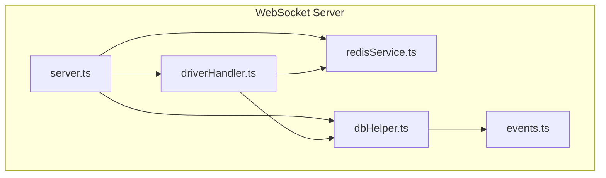
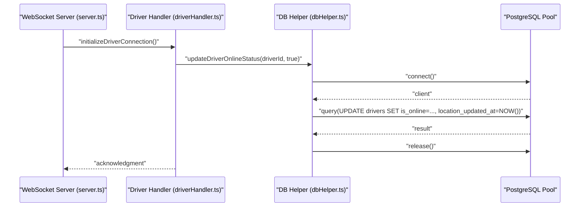
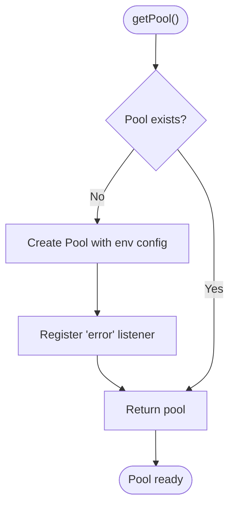
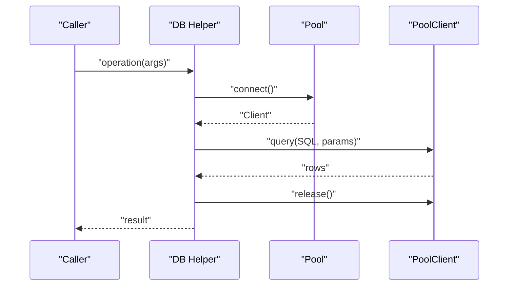
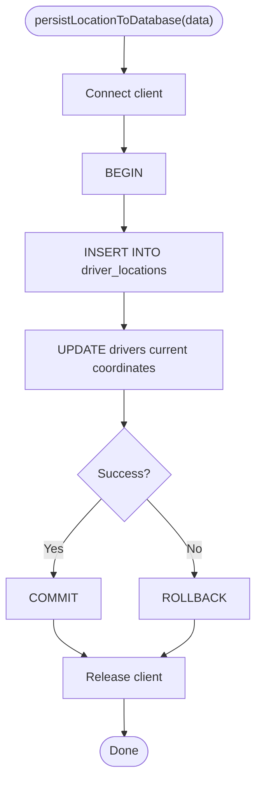
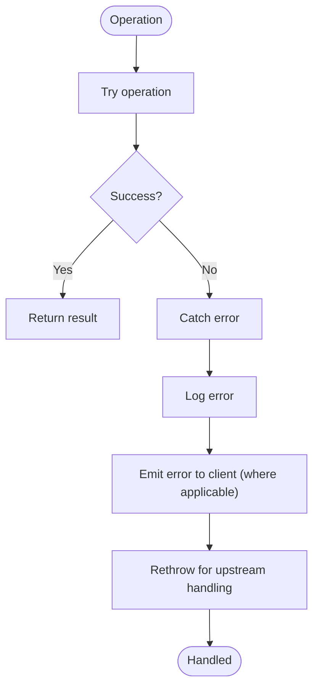
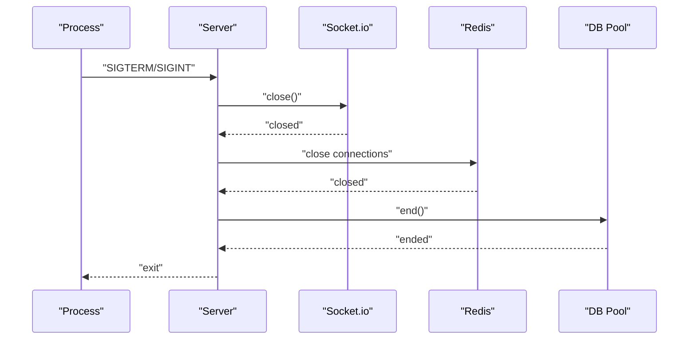
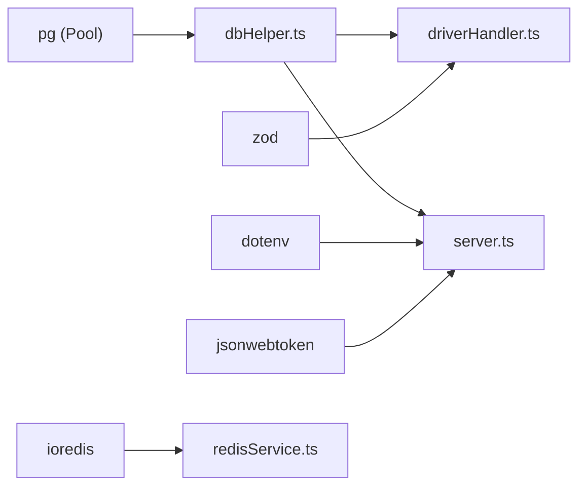

# Database Helper

<cite>
**Referenced Files in This Document**
- [dbHelper.ts](file://websocket-server/src/handlers/dbHelper.ts)
- [driverHandler.ts](file://websocket-server/src/handlers/driverHandler.ts)
- [server.ts](file://websocket-server/src/server.ts)
- [redisService.ts](file://websocket-server/src/services/redisService.ts)
- [events.ts](file://websocket-server/src/types/events.ts)
- [package.json](file://websocket-server/package.json)
</cite>

## Table of Contents
1. [Introduction](#introduction)
2. [Project Structure](#project-structure)
3. [Core Components](#core-components)
4. [Architecture Overview](#architecture-overview)
5. [Detailed Component Analysis](#detailed-component-analysis)
6. [Dependency Analysis](#dependency-analysis)
7. [Performance Considerations](#performance-considerations)
8. [Troubleshooting Guide](#troubleshooting-guide)
9. [Conclusion](#conclusion)

## Introduction
This document explains the database helper functions used by WebSocket handlers in the fleet management WebSocket server. It covers connection pooling, query execution patterns, transaction management, initialization, error handling, and resource cleanup. It also documents configuration options, performance optimization techniques, and security considerations for database access.

## Project Structure
The WebSocket server organizes database operations in a dedicated helper module and integrates them into handler modules. The server initializes the database pool and orchestrates graceful shutdown, ensuring proper cleanup of database connections.

**Diagram sources**
- [server.ts:1-256](file://websocket-server/src/server.ts#L1-L256)
- [driverHandler.ts:1-318](file://websocket-server/src/handlers/driverHandler.ts#L1-L318)
- [redisService.ts:1-264](file://websocket-server/src/services/redisService.ts#L1-L264)
- [dbHelper.ts:1-204](file://websocket-server/src/handlers/dbHelper.ts#L1-L204)
- [events.ts:1-210](file://websocket-server/src/types/events.ts#L1-L210)

**Section sources**
- [server.ts:1-256](file://websocket-server/src/server.ts#L1-L256)
- [dbHelper.ts:1-204](file://websocket-server/src/handlers/dbHelper.ts#L1-L204)
- [driverHandler.ts:1-318](file://websocket-server/src/handlers/driverHandler.ts#L1-L318)
- [redisService.ts:1-264](file://websocket-server/src/services/redisService.ts#L1-L264)
- [events.ts:1-210](file://websocket-server/src/types/events.ts#L1-L210)

## Core Components
- Database pool initialization and lifecycle management
- Prepared statement usage with parameterized queries
- Transaction management for atomic writes
- Error handling and logging
- Resource cleanup during graceful shutdown

**Section sources**
- [dbHelper.ts:15-29](file://websocket-server/src/handlers/dbHelper.ts#L15-L29)
- [dbHelper.ts:34-53](file://websocket-server/src/handlers/dbHelper.ts#L34-L53)
- [dbHelper.ts:58-78](file://websocket-server/src/handlers/dbHelper.ts#L58-L78)
- [dbHelper.ts:83-125](file://websocket-server/src/handlers/dbHelper.ts#L83-L125)
- [dbHelper.ts:130-163](file://websocket-server/src/handlers/dbHelper.ts#L130-L163)
- [dbHelper.ts:168-192](file://websocket-server/src/handlers/dbHelper.ts#L168-L192)
- [dbHelper.ts:197-203](file://websocket-server/src/handlers/dbHelper.ts#L197-L203)
- [server.ts:197-224](file://websocket-server/src/server.ts#L197-L224)

## Architecture Overview
The WebSocket server uses a single Postgres connection pool initialized once and reused across requests. Handlers connect individual clients from the pool, execute queries, and release connections back to the pool. Transactions are used for atomic writes when persisting driver location history and updating current coordinates.

**Diagram sources**
- [server.ts:108-150](file://websocket-server/src/server.ts#L108-L150)
- [driverHandler.ts:48-80](file://websocket-server/src/handlers/driverHandler.ts#L48-L80)
- [dbHelper.ts:58-78](file://websocket-server/src/handlers/dbHelper.ts#L58-L78)

**Section sources**
- [server.ts:108-150](file://websocket-server/src/server.ts#L108-L150)
- [driverHandler.ts:48-80](file://websocket-server/src/handlers/driverHandler.ts#L48-L80)
- [dbHelper.ts:58-78](file://websocket-server/src/handlers/dbHelper.ts#L58-L78)

## Detailed Component Analysis

### Database Pool Initialization and Lifecycle
- The pool is lazily initialized on first use with environment-driven configuration.
- Connection string, pool size, and SSL settings are configured via environment variables.
- Pool error events are logged centrally.
- The pool is closed during graceful shutdown to release all connections.

**Diagram sources**
- [dbHelper.ts:15-29](file://websocket-server/src/handlers/dbHelper.ts#L15-L29)

**Section sources**
- [dbHelper.ts:15-29](file://websocket-server/src/handlers/dbHelper.ts#L15-L29)
- [server.ts:197-224](file://websocket-server/src/server.ts#L197-L224)

### Query Execution Patterns
- Parameterized queries prevent SQL injection and leverage prepared statements implicitly.
- Each operation connects a client from the pool, executes the query, and releases the client.
- Results are mapped to typed interfaces for safe consumption.

**Diagram sources**
- [dbHelper.ts:34-53](file://websocket-server/src/handlers/dbHelper.ts#L34-L53)
- [dbHelper.ts:130-163](file://websocket-server/src/handlers/dbHelper.ts#L130-L163)

**Section sources**
- [dbHelper.ts:34-53](file://websocket-server/src/handlers/dbHelper.ts#L34-L53)
- [dbHelper.ts:130-163](file://websocket-server/src/handlers/dbHelper.ts#L130-L163)

### Transaction Management
- Atomic persistence of location history and current coordinate updates uses explicit BEGIN/COMMIT/ROLLBACK.
- Errors trigger rollback and rethrow to the caller.
- Client is always released in a finally block to avoid leaks.

**Diagram sources**
- [dbHelper.ts:83-125](file://websocket-server/src/handlers/dbHelper.ts#L83-L125)

**Section sources**
- [dbHelper.ts:83-125](file://websocket-server/src/handlers/dbHelper.ts#L83-L125)

### Error Handling Mechanisms
- Centralized logging of database errors for observability.
- Caller-specific error responses are emitted to clients for invalid inputs or transient failures.
- Unhandled exceptions trigger graceful shutdown to ensure clean resource release.

**Diagram sources**
- [dbHelper.ts:47-52](file://websocket-server/src/handlers/dbHelper.ts#L47-L52)
- [dbHelper.ts:118-124](file://websocket-server/src/handlers/dbHelper.ts#L118-L124)
- [driverHandler.ts:125-135](file://websocket-server/src/handlers/driverHandler.ts#L125-L135)
- [server.ts:231-239](file://websocket-server/src/server.ts#L231-L239)

**Section sources**
- [dbHelper.ts:47-52](file://websocket-server/src/handlers/dbHelper.ts#L47-L52)
- [dbHelper.ts:118-124](file://websocket-server/src/handlers/dbHelper.ts#L118-L124)
- [driverHandler.ts:125-135](file://websocket-server/src/handlers/driverHandler.ts#L125-L135)
- [server.ts:231-239](file://websocket-server/src/server.ts#L231-L239)

### Resource Cleanup Procedures
- Database pool is ended during graceful shutdown.
- Redis connections are closed after Socket.io and database cleanup.
- Socket.io servers are closed prior to ending the HTTP server.

**Diagram sources**
- [server.ts:197-224](file://websocket-server/src/server.ts#L197-L224)
- [redisService.ts:229-249](file://websocket-server/src/services/redisService.ts#L229-L249)
- [dbHelper.ts:197-203](file://websocket-server/src/handlers/dbHelper.ts#L197-L203)

**Section sources**
- [server.ts:197-224](file://websocket-server/src/server.ts#L197-L224)
- [redisService.ts:229-249](file://websocket-server/src/services/redisService.ts#L229-L249)
- [dbHelper.ts:197-203](file://websocket-server/src/handlers/dbHelper.ts#L197-L203)

### Common Database Operations
- Fetch driver data by ID
- Update driver online status
- Persist location history and current coordinates atomically
- Retrieve driver location history with time bounds and limits
- Compute city driver counts (total and online)

These operations demonstrate prepared statements, parameter binding, and transactional writes.

**Section sources**
- [dbHelper.ts:34-53](file://websocket-server/src/handlers/dbHelper.ts#L34-L53)
- [dbHelper.ts:58-78](file://websocket-server/src/handlers/dbHelper.ts#L58-L78)
- [dbHelper.ts:83-125](file://websocket-server/src/handlers/dbHelper.ts#L83-L125)
- [dbHelper.ts:130-163](file://websocket-server/src/handlers/dbHelper.ts#L130-L163)
- [dbHelper.ts:168-192](file://websocket-server/src/handlers/dbHelper.ts#L168-L192)

### Connection Health Monitoring
- The server exposes readiness and health endpoints.
- Readiness checks validate Redis connectivity; health checks report connection counts.
- Database pool health is indirectly monitored via successful operations and error logs.

**Section sources**
- [server.ts:162-192](file://websocket-server/src/server.ts#L162-L192)
- [redisService.ts:254-263](file://websocket-server/src/services/redisService.ts#L254-L263)

### Database Configuration Options
- Connection string: DATABASE_URL
- Pool size: DATABASE_POOL_SIZE
- SSL enforcement: DATABASE_SSL (boolean)
- Additional environment variables are used by the server for WebSocket behavior and logging.

**Section sources**
- [dbHelper.ts:17-21](file://websocket-server/src/handlers/dbHelper.ts#L17-L21)
- [server.ts:18-26](file://websocket-server/src/server.ts#L18-L26)

### Security Considerations
- All queries use parameterized parameters to prevent SQL injection.
- JWT verification occurs before database access in the authentication middleware.
- Sensitive environment variables (DATABASE_URL, JWT_SECRET) are validated at startup.

**Section sources**
- [dbHelper.ts:39-44](file://websocket-server/src/handlers/dbHelper.ts#L39-L44)
- [server.ts:65-103](file://websocket-server/src/server.ts#L65-L103)

## Dependency Analysis
The database helper depends on the Postgres client library and is consumed by WebSocket handlers. The server orchestrates initialization and shutdown.

**Diagram sources**
- [dbHelper.ts:6](file://websocket-server/src/handlers/dbHelper.ts#L6)
- [driverHandler.ts:22](file://websocket-server/src/handlers/driverHandler.ts#L22)
- [server.ts:6](file://websocket-server/src/server.ts#L6)
- [redisService.ts:6](file://websocket-server/src/services/redisService.ts#L6)
- [package.json:21-29](file://websocket-server/package.json#L21-L29)

**Section sources**
- [package.json:21-29](file://websocket-server/package.json#L21-L29)
- [dbHelper.ts:6](file://websocket-server/src/handlers/dbHelper.ts#L6)
- [driverHandler.ts:22](file://websocket-server/src/handlers/driverHandler.ts#L22)
- [redisService.ts:6](file://websocket-server/src/services/redisService.ts#L6)
- [server.ts:6](file://websocket-server/src/server.ts#L6)

## Performance Considerations
- Use a connection pool sized appropriately for concurrent WebSocket operations (DATABASE_POOL_SIZE).
- Prefer parameterized queries to leverage prepared statement reuse.
- Batch or defer non-critical writes (e.g., asynchronous persistence) to reduce latency.
- Monitor pool utilization and adjust pool size based on observed concurrency and database capacity.
- Keep queries simple and indexed; ensure appropriate indexes exist for filters (e.g., driver_id, timestamps).

## Troubleshooting Guide
- Connection failures: Verify DATABASE_URL and network connectivity; check pool error logs.
- SSL issues: Disable SSL locally by setting DATABASE_SSL=false; ensure certificates match in production.
- Slow queries: Review query plans for driver location history and count queries; add or tune indexes.
- Memory leaks: Ensure client.release() is called in all code paths (finally blocks are used).
- Graceful shutdown hangs: Confirm pool.end() completes and no lingering operations remain.

**Section sources**
- [dbHelper.ts:23-25](file://websocket-server/src/handlers/dbHelper.ts#L23-L25)
- [dbHelper.ts:50-52](file://websocket-server/src/handlers/dbHelper.ts#L50-L52)
- [dbHelper.ts:122-124](file://websocket-server/src/handlers/dbHelper.ts#L122-L124)
- [server.ts:197-224](file://websocket-server/src/server.ts#L197-L224)

## Conclusion
The database helper provides a robust foundation for WebSocket-driven fleet operations. It leverages a connection pool, parameterized queries, and explicit transactions to ensure correctness and resilience. Proper configuration, error handling, and graceful shutdown practices maintain reliability under real-time workloads.