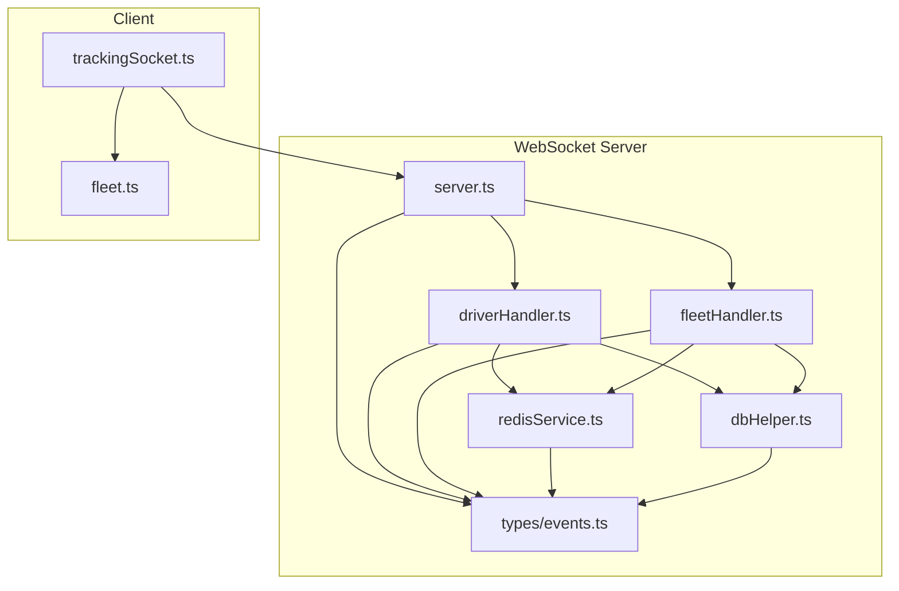
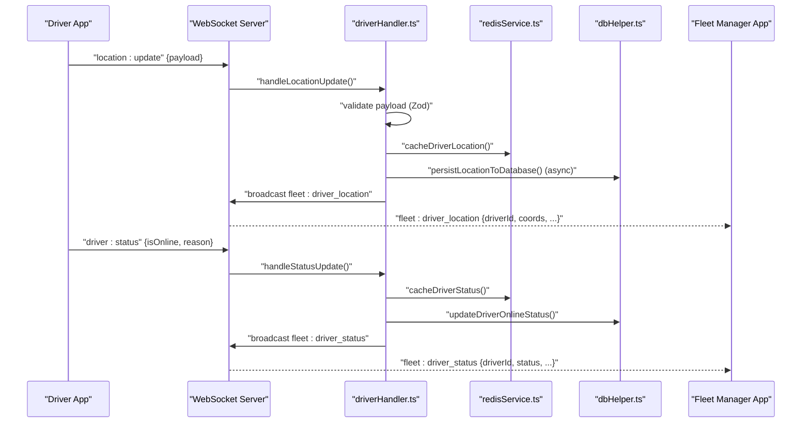
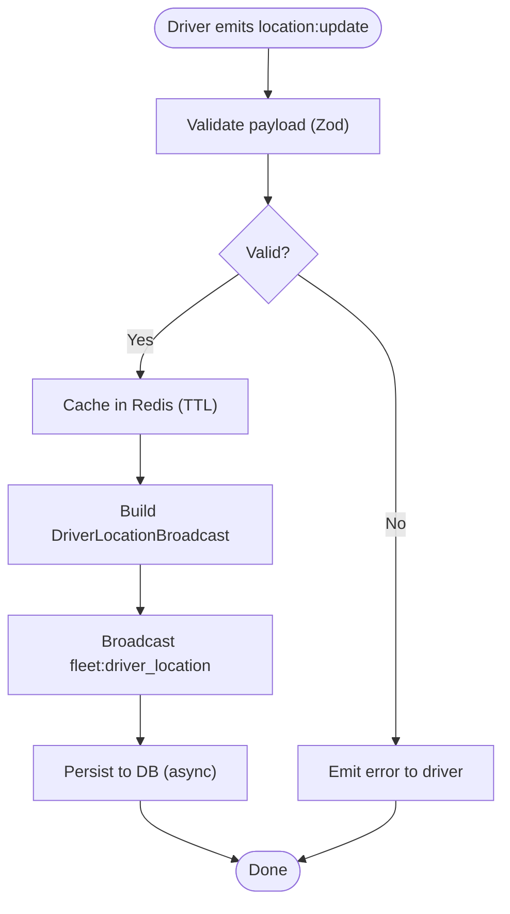
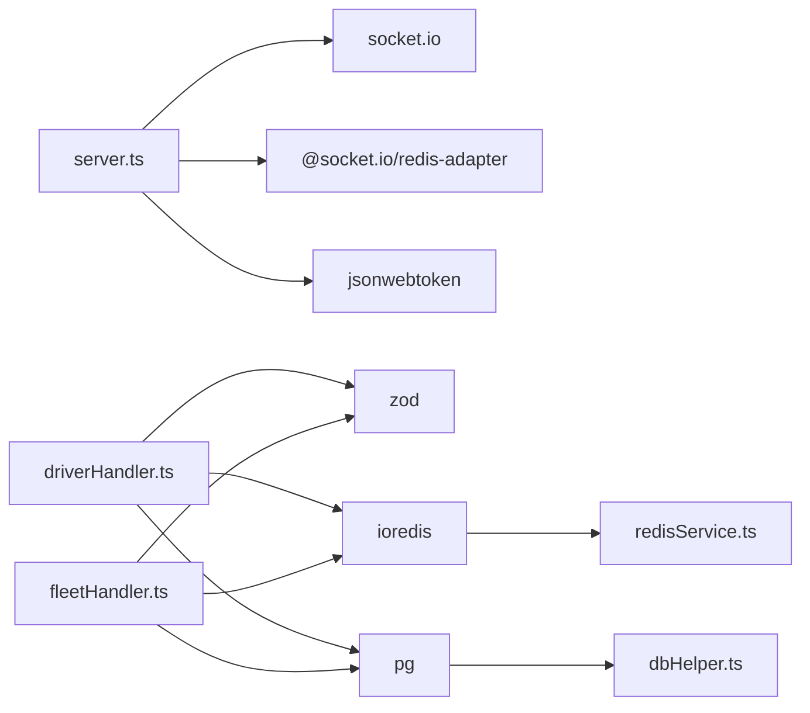

# Event System & Types

<cite>
**Referenced Files in This Document**
- [events.ts](file://websocket-server/src/types/events.ts)
- [server.ts](file://websocket-server/src/server.ts)
- [driverHandler.ts](file://websocket-server/src/handlers/driverHandler.ts)
- [fleetHandler.ts](file://websocket-server/src/handlers/fleetHandler.ts)
- [redisService.ts](file://websocket-server/src/services/redisService.ts)
- [dbHelper.ts](file://websocket-server/src/handlers/dbHelper.ts)
- [trackingSocket.ts](file://src/fleet/services/trackingSocket.ts)
- [fleet.ts](file://src/fleet/types/fleet.ts)
- [package.json](file://websocket-server/package.json)
</cite>

## Table of Contents
1. [Introduction](#introduction)
2. [Project Structure](#project-structure)
3. [Core Components](#core-components)
4. [Architecture Overview](#architecture-overview)
5. [Detailed Component Analysis](#detailed-component-analysis)
6. [Dependency Analysis](#dependency-analysis)
7. [Performance Considerations](#performance-considerations)
8. [Troubleshooting Guide](#troubleshooting-guide)
9. [Conclusion](#conclusion)

## Introduction
This document describes the WebSocket event system and type definitions used by the Fleet Management Portal. It covers:
- SocketEvents enum values and naming conventions
- Event payload structures and message formats
- SocketUserData interface and connection types
- Event-driven communication patterns between drivers and fleet managers
- Examples of event emission, listener registration, and real-time broadcasting
- Payload validation, error handling, and operational safeguards
- Versioning, backward compatibility, and migration strategies for event schema changes

## Project Structure
The WebSocket server is implemented as a standalone module with clear separation of concerns:
- Type definitions and event names live in a shared types module
- Server initialization, authentication, and lifecycle management in the main server
- Handlers for driver and fleet roles manage event routing and business logic
- Redis service provides caching and inter-process/pub-sub coordination
- Database helper encapsulates persistence operations
- Client-side tracking socket demonstrates event consumption and reconnection

**Diagram sources**
- [server.ts:1-256](file://websocket-server/src/server.ts#L1-L256)
- [driverHandler.ts:1-318](file://websocket-server/src/handlers/driverHandler.ts#L1-L318)
- [fleetHandler.ts:1-247](file://websocket-server/src/handlers/fleetHandler.ts#L1-L247)
- [redisService.ts:1-264](file://websocket-server/src/services/redisService.ts#L1-L264)
- [dbHelper.ts:1-204](file://websocket-server/src/handlers/dbHelper.ts#L1-L204)
- [events.ts:1-210](file://websocket-server/src/types/events.ts#L1-L210)
- [trackingSocket.ts:1-287](file://src/fleet/services/trackingSocket.ts#L1-L287)
- [fleet.ts:448-484](file://src/fleet/types/fleet.ts#L448-L484)

**Section sources**
- [server.ts:1-51](file://websocket-server/src/server.ts#L1-L51)
- [events.ts:155-178](file://websocket-server/src/types/events.ts#L155-L178)

## Core Components
- SocketEvents: Centralized event names for client-to-server and server-to-client communications, plus built-in Socket.IO events
- SocketUserData: User identity and role metadata attached to each socket connection
- RoomNames: Dynamic room naming for scoping broadcasts to all fleets, specific cities, or individual drivers
- Payload types: Strongly typed interfaces for location updates, status changes, order assignments, history requests, and error responses
- Validation: Zod schemas for runtime validation of incoming payloads
- Caching and persistence: Redis caches for real-time state and PostgreSQL for durable storage

**Section sources**
- [events.ts:15-210](file://websocket-server/src/types/events.ts#L15-L210)
- [driverHandler.ts:28-43](file://websocket-server/src/handlers/driverHandler.ts#L28-L43)
- [fleetHandler.ts:19-28](file://websocket-server/src/handlers/fleetHandler.ts#L19-L28)

## Architecture Overview
The system uses Socket.IO with a Redis adapter for horizontal scalability. Drivers emit location and status updates; fleet managers subscribe to city rooms and receive real-time broadcasts. The server validates payloads, enforces access controls, and persists data asynchronously.

**Diagram sources**
- [driverHandler.ts:85-207](file://websocket-server/src/handlers/driverHandler.ts#L85-L207)
- [redisService.ts:84-146](file://websocket-server/src/services/redisService.ts#L84-L146)
- [dbHelper.ts:80-125](file://websocket-server/src/handlers/dbHelper.ts#L80-L125)
- [server.ts:108-150](file://websocket-server/src/server.ts#L108-L150)

## Detailed Component Analysis

### SocketEvents and Naming Conventions
- Client-to-server events:
  - location:update: Driver sends periodic location updates
  - driver:status: Driver toggles online/offline or background/timeout states
  - fleet:subscribe_city: Fleet manager subscribes to city-level updates
  - fleet:request_history: Fleet manager requests historical location data
- Server-to-client events:
  - connection:ack: Initial acknowledgment with recommended update interval
  - order:assigned: Driver receives new order assignment
  - fleet:driver_location: Real-time driver location broadcast
  - fleet:driver_status: Driver status change broadcast
  - fleet:stats_update: Periodic or on-demand fleet statistics
  - fleet:subscribed: Confirmation of city subscription
  - fleet:location_history: Historical location data response
  - error: Standardized error envelope
- Built-in Socket.IO events:
  - connect, disconnect, connect_error

Naming convention:
- Use domain:event format (e.g., fleet:driver_location)
- Use pluralization for collections (e.g., fleet:location_history)
- Keep event names concise but descriptive

**Section sources**
- [events.ts:157-178](file://websocket-server/src/types/events.ts#L157-L178)

### SocketUserData and Connection Types
- SocketUserData carries:
  - type: driver or fleet
  - userId: Supabase auth sub or user identifier
  - role: driver, fleet_manager, super_admin
  - driverId: present for drivers
  - managerId: present for fleet managers
  - assignedCities: array of city identifiers for fleet managers
  - cityId: optional current city for drivers
- Authentication middleware decodes JWT and attaches user data to socket.data.user

Connection types:
- Drivers join driver:<driverId> room and receive targeted acknowledgments
- Fleet managers join fleet:all or fleet:<cityId> rooms depending on role and assigned cities

**Section sources**
- [events.ts:15-23](file://websocket-server/src/types/events.ts#L15-L23)
- [server.ts:65-103](file://websocket-server/src/server.ts#L65-L103)
- [driverHandler.ts:48-80](file://websocket-server/src/handlers/driverHandler.ts#L48-L80)
- [fleetHandler.ts:36-62](file://websocket-server/src/handlers/fleetHandler.ts#L36-L62)

### Driver Event Flow: Location Updates
- Emission: Driver emits location:update with coordinates, accuracy, optional speed/heading/battery, and timestamp
- Validation: Zod schema ensures numeric bounds and ISO datetime
- Caching: Redis hash stores latest location with TTL
- Broadcasting: Server emits fleet:driver_location to city and all rooms
- Persistence: Asynchronous write to driver_locations table with transactional updates to drivers.current_latitude/longitude

**Diagram sources**
- [driverHandler.ts:85-207](file://websocket-server/src/handlers/driverHandler.ts#L85-L207)
- [redisService.ts:84-96](file://websocket-server/src/services/redisService.ts#L84-L96)
- [dbHelper.ts:80-125](file://websocket-server/src/handlers/dbHelper.ts#L80-L125)

**Section sources**
- [driverHandler.ts:85-207](file://websocket-server/src/handlers/driverHandler.ts#L85-L207)
- [events.ts:27-48](file://websocket-server/src/types/events.ts#L27-L48)

### Driver Event Flow: Status Updates
- Emission: Driver emits driver:status with isOnline and optional reason
- Validation: Zod enum for reason
- Caching: Redis hash updated with status and timestamps
- Persistence: Drivers table updated
- Broadcasting: fleet:driver_status sent to city and all rooms

**Section sources**
- [driverHandler.ts:212-275](file://websocket-server/src/handlers/driverHandler.ts#L212-L275)
- [events.ts:52-64](file://websocket-server/src/types/events.ts#L52-L64)

### Fleet Manager Event Flow: City Subscription
- Emission: fleet:subscribe_city with cityId
- Access control: Super admins can subscribe to any city; fleet managers are restricted to assignedCities
- Room joining: Fleet manager joins fleet:all or fleet:<cityId>
- Response: fleet:subscribed with driverCount

**Section sources**
- [fleetHandler.ts:67-140](file://websocket-server/src/handlers/fleetHandler.ts#L67-L140)
- [events.ts:92-99](file://websocket-server/src/types/events.ts#L92-L99)

### Fleet Manager Event Flow: Location History Request
- Emission: fleet:request_history with driverId, startTime, endTime
- Validation: Zod UUID and datetime checks
- Access control: Fleet manager must have access to driver’s city
- Response: fleet:location_history with locations array

**Section sources**
- [fleetHandler.ts:73-212](file://websocket-server/src/handlers/fleetHandler.ts#L73-L212)
- [events.ts:101-117](file://websocket-server/src/types/events.ts#L101-L117)

### Real-Time Data Broadcasting Patterns
- Room scoping:
  - fleet:all: Super admin receives all cities
  - fleet:<cityId>: City-specific fleet managers receive updates
  - driver:<driverId>: Targeted acknowledgments and order assignments
- Broadcast targets:
  - Driver location: city room + all room
  - Driver status: city room + all room
  - Stats: fleet managers’ subscribed rooms

**Section sources**
- [driverHandler.ts:172-182](file://websocket-server/src/handlers/driverHandler.ts#L172-L182)
- [driverHandler.ts:257-266](file://websocket-server/src/handlers/driverHandler.ts#L257-L266)
- [fleetHandler.ts:44-55](file://websocket-server/src/handlers/fleetHandler.ts#L44-L55)

### Client-Side Event Consumption
- The client connects with a JWT token as a query parameter
- On open, it subscribes to cities based on user role
- Listeners handle:
  - fleet:driver_location
  - fleet:driver_status
  - fleet:stats_update
  - error
- Reconnection logic with exponential backoff

**Section sources**
- [trackingSocket.ts:34-95](file://src/fleet/services/trackingSocket.ts#L34-L95)
- [trackingSocket.ts:97-132](file://src/fleet/services/trackingSocket.ts#L97-L132)
- [trackingSocket.ts:162-178](file://src/fleet/services/trackingSocket.ts#L162-L178)

### Message Formats and Payload Structures
- LocationUpdatePayload: latitude, longitude, accuracy, optional speed/heading/battery, timestamp
- DriverLocationBroadcast: driver metadata, coordinates, speed/heading, online status, optional current order, timestamp
- StatusUpdatePayload: isOnline, optional reason
- DriverStatusBroadcast: driver identifiers, previous/current statuses, city, timestamp
- SubscribeCityPayload: cityId
- CitySubscribedPayload: cityId, driverCount
- RequestLocationHistoryPayload: driverId, startTime, endTime
- LocationHistoryResponse: driverId, locations[]
- ErrorPayload: code, message, optional details

**Section sources**
- [events.ts:27-133](file://websocket-server/src/types/events.ts#L27-L133)

## Dependency Analysis
External libraries and their roles:
- socket.io: WebSocket server and Redis adapter for multi-instance scaling
- @socket.io/redis-adapter: Enables clustering and pub/sub across nodes
- ioredis: Redis client for caching and health checks
- jsonwebtoken: JWT decoding for authentication
- dotenv: Environment variable loading
- winston: Logging (present in dependencies)
- pg: PostgreSQL client for durable persistence
- zod: Runtime validation for payloads

**Diagram sources**
- [package.json:21-29](file://websocket-server/package.json#L21-L29)
- [server.ts:7-14](file://websocket-server/src/server.ts#L7-L14)
- [driverHandler.ts:22](file://websocket-server/src/handlers/driverHandler.ts#L22)
- [fleetHandler.ts:17](file://websocket-server/src/handlers/fleetHandler.ts#L17)
- [redisService.ts:6](file://websocket-server/src/services/redisService.ts#L6)
- [dbHelper.ts:6](file://websocket-server/src/handlers/dbHelper.ts#L6)

**Section sources**
- [package.json:21-29](file://websocket-server/package.json#L21-L29)

## Performance Considerations
- Connection limits and pings: Configurable max connections and heartbeat timeouts
- Compression: Messages exceeding threshold are compressed
- Rate limiting: Minimum update interval for location updates prevents overload
- Async persistence: Database writes are fire-and-forget to avoid blocking real-time delivery
- Redis TTLs: Automatic expiration of cached driver state
- Horizontal scaling: Redis adapter enables multiple server instances

**Section sources**
- [server.ts:18-51](file://websocket-server/src/server.ts#L18-L51)
- [driverHandler.ts:24-26](file://websocket-server/src/handlers/driverHandler.ts#L24-L26)
- [redisService.ts:15-17](file://websocket-server/src/services/redisService.ts#L15-L17)

## Troubleshooting Guide
Common issues and resolutions:
- Authentication failures:
  - Missing or invalid token leads to immediate disconnect
  - Token expiration triggers a specific error message
- Payload validation errors:
  - Zod validation errors return structured error payloads with details
- Access control violations:
  - Attempting to access unauthorized cities or drivers triggers error responses
- Capacity exceeded:
  - Server rejects new connections when max capacity is reached
- Redis connectivity:
  - Health check endpoint indicates readiness; errors logged on Redis client events
- Client reconnection:
  - Exponential backoff with capped attempts; logs reconnection attempts

Operational endpoints:
- GET /health: Returns connection counts and environment
- GET /ready: Probes Redis readiness

**Section sources**
- [server.ts:65-103](file://websocket-server/src/server.ts#L65-L103)
- [driverHandler.ts:125-135](file://websocket-server/src/handlers/driverHandler.ts#L125-L135)
- [fleetHandler.ts:94-116](file://websocket-server/src/handlers/fleetHandler.ts#L94-L116)
- [server.ts:110-117](file://websocket-server/src/server.ts#L110-L117)
- [redisService.ts:254-263](file://websocket-server/src/services/redisService.ts#L254-L263)
- [server.ts:162-192](file://websocket-server/src/server.ts#L162-L192)
- [trackingSocket.ts:162-178](file://src/fleet/services/trackingSocket.ts#L162-L178)

## Event Versioning, Backward Compatibility, and Migration Strategies
Guidelines for evolving the event system safely:
- Versioned event names:
  - Prefix domains with version segments (e.g., v1:fleet:driver_location) to isolate breaking changes
  - Maintain legacy aliases during transition periods
- Schema evolution:
  - Add optional fields to existing payloads to preserve backward compatibility
  - Use Zod’s passthrough or stripUnknown to accept new fields without breaking older clients
- Deprecation policy:
  - Announce deprecations with release notes and grace periods
  - Continue emitting legacy events alongside new ones until all clients migrate
- Migration patterns:
  - Gradually roll out new event versions to subsets of clients
  - Use feature flags or user segmentation to control adoption
  - Monitor error rates and fallback gracefully to legacy behavior
- Testing:
  - Unit tests for Zod validators and handler branches
  - Integration tests simulating client/server interactions under load
  - A/B testing with shadow traffic to validate new schemas

[No sources needed since this section provides general guidance]

## Conclusion
The WebSocket event system provides a robust, scalable foundation for real-time fleet tracking. With explicit event names, strongly typed payloads, validation, and access control, it supports reliable communication between drivers and fleet managers. The architecture leverages Redis for caching and Socket.IO adapters for multi-node deployments, while asynchronous persistence ensures durability without compromising latency. By following the versioning and migration strategies outlined above, teams can evolve the event schema safely over time.