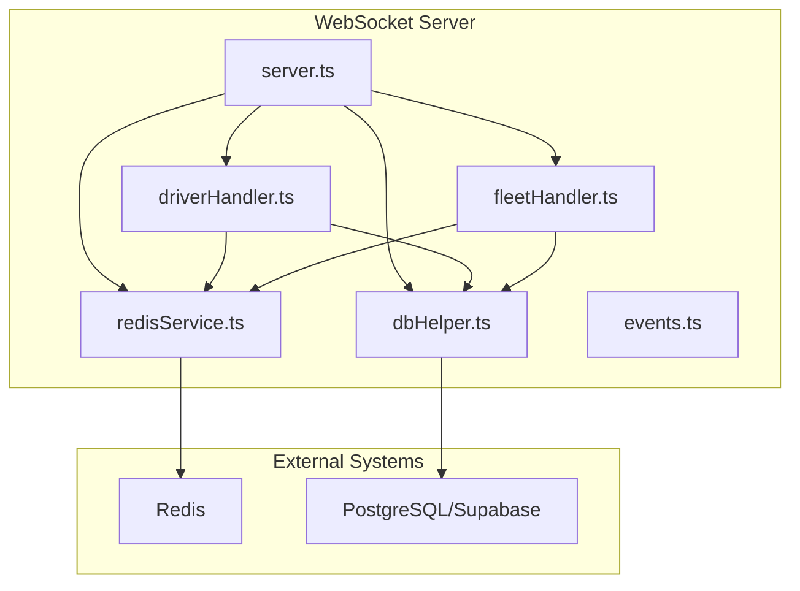
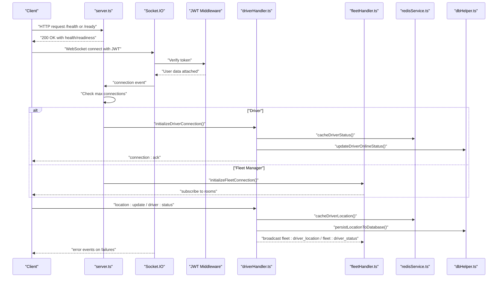
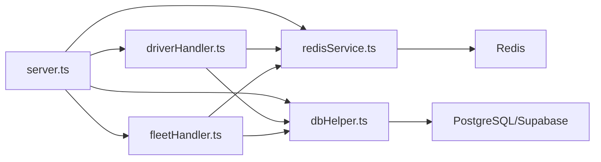

# Monitoring & Operations

<cite>
**Referenced Files in This Document**
- [server.ts](file://websocket-server/src/server.ts)
- [redisService.ts](file://websocket-server/src/services/redisService.ts)
- [dbHelper.ts](file://websocket-server/src/handlers/dbHelper.ts)
- [driverHandler.ts](file://websocket-server/src/handlers/driverHandler.ts)
- [fleetHandler.ts](file://websocket-server/src/handlers/fleetHandler.ts)
- [events.ts](file://websocket-server/src/types/events.ts)
- [Dockerfile](file://websocket-server/Dockerfile)
- [package.json](file://websocket-server/package.json)
- [load-test-config.yml](file://tests/load-test-config.yml)
</cite>

## Table of Contents
1. [Introduction](#introduction)
2. [Project Structure](#project-structure)
3. [Core Components](#core-components)
4. [Architecture Overview](#architecture-overview)
5. [Detailed Component Analysis](#detailed-component-analysis)
6. [Dependency Analysis](#dependency-analysis)
7. [Performance Considerations](#performance-considerations)
8. [Troubleshooting Guide](#troubleshooting-guide)
9. [Conclusion](#conclusion)
10. [Appendices](#appendices)

## Introduction
This document provides operational guidance for the WebSocket server that powers real-time fleet tracking. It covers health and readiness endpoints, connection metrics, graceful shutdown, signal handling, logging, error monitoring, performance metrics collection, scaling, maintenance windows, emergency response, connection limits, capacity planning, and load balancing considerations for production deployments.

## Project Structure
The WebSocket server is organized into cohesive modules:
- Server entry point initializes HTTP server, Socket.IO, Redis adapter, and routes health/readiness probes.
- Handlers manage driver and fleet connections, enforce access control, and broadcast updates.
- Services encapsulate Redis caching and database pooling.
- Types define events, rooms, and data contracts.
- Containerization and health checks are defined via Dockerfile.
- Load testing configuration outlines performance targets and thresholds.

**Diagram sources**
- [server.ts:1-256](file://websocket-server/src/server.ts#L1-L256)
- [driverHandler.ts:1-318](file://websocket-server/src/handlers/driverHandler.ts#L1-L318)
- [fleetHandler.ts:1-247](file://websocket-server/src/handlers/fleetHandler.ts#L1-L247)
- [redisService.ts:1-264](file://websocket-server/src/services/redisService.ts#L1-L264)
- [dbHelper.ts:1-204](file://websocket-server/src/handlers/dbHelper.ts#L1-L204)
- [events.ts:1-210](file://websocket-server/src/types/events.ts#L1-L210)

**Section sources**
- [server.ts:1-256](file://websocket-server/src/server.ts#L1-L256)
- [driverHandler.ts:1-318](file://websocket-server/src/handlers/driverHandler.ts#L1-L318)
- [fleetHandler.ts:1-247](file://websocket-server/src/handlers/fleetHandler.ts#L1-L247)
- [redisService.ts:1-264](file://websocket-server/src/services/redisService.ts#L1-L264)
- [dbHelper.ts:1-204](file://websocket-server/src/handlers/dbHelper.ts#L1-L204)
- [events.ts:1-210](file://websocket-server/src/types/events.ts#L1-L210)
- [Dockerfile:1-96](file://websocket-server/Dockerfile#L1-L96)
- [package.json:1-44](file://websocket-server/package.json#L1-L44)

## Core Components
- Health endpoint: Returns server status, timestamp, connection counts, and environment.
- Readiness endpoint: Probes Redis connectivity to gate traffic.
- Connection metrics: Tracks total, driver, and fleet connections with counters and logs.
- Graceful shutdown: Stops accepting new connections, closes Socket.IO, disconnects clients, closes Redis and database pools, and exits cleanly.
- Signal handling: Responds to SIGTERM/SIGINT for controlled termination.
- Logging: Centralized console logging for operational visibility; consider integrating structured logging for production.
- Error handling: Socket.IO error listener and per-module try/catch blocks emit standardized error events.

**Section sources**
- [server.ts:159-224](file://websocket-server/src/server.ts#L159-L224)

## Architecture Overview
The server leverages Socket.IO with a Redis adapter for horizontal scaling, JWT-based authentication, and role-based access control. Redis caches driver location/status and city statistics, while PostgreSQL persists location history and driver metadata.

**Diagram sources**
- [server.ts:65-150](file://websocket-server/src/server.ts#L65-L150)
- [driverHandler.ts:48-100](file://websocket-server/src/handlers/driverHandler.ts#L48-L100)
- [fleetHandler.ts:36-82](file://websocket-server/src/handlers/fleetHandler.ts#L36-L82)
- [redisService.ts:87-146](file://websocket-server/src/services/redisService.ts#L87-L146)
- [dbHelper.ts:83-125](file://websocket-server/src/handlers/dbHelper.ts#L83-L125)

## Detailed Component Analysis

### Health and Readiness Endpoints
- /health: Returns server status, timestamp, connection counts (total, drivers, fleet), and environment.
- /ready: Probes Redis connectivity; responds 200 OK if healthy, otherwise 503.

Operational usage:
- Kubernetes readinessProbe: use /ready to prevent traffic until Redis is ready.
- LivenessProbe: use /health to detect stalled processes.

**Section sources**
- [server.ts:162-192](file://websocket-server/src/server.ts#L162-L192)
- [redisService.ts:254-263](file://websocket-server/src/services/redisService.ts#L254-L263)

### Connection Metrics and Limits
- Metrics tracked:
  - totalConnections
  - driverConnections
  - fleetConnections
- Enforcement:
  - Max connections configurable via WS_MAX_CONNECTIONS.
  - On exceeding limit, server emits an error and disconnects the socket.

Operational guidance:
- Monitor /health for connections and environment.
- Tune WS_MAX_CONNECTIONS based on capacity planning and load testing.
- Use fleet:all and fleet:{cityId} rooms to segment traffic and monitor per-city loads.

**Section sources**
- [server.ts:57-117](file://websocket-server/src/server.ts#L57-L117)
- [events.ts:182-186](file://websocket-server/src/types/events.ts#L182-L186)

### Graceful Shutdown and Signal Handling
- Triggers on SIGTERM/SIGINT.
- Steps:
  - Close HTTP server (stop accepting new connections).
  - Close Socket.IO server.
  - Disconnect all active sockets.
  - Close Redis connections.
  - Close database pool.
  - Exit process.

Best practices:
- Use SIGTERM for rolling updates.
- Ensure reverse proxies drain connections before signaling.
- Include preStop hook in orchestrator to delay SIGTERM until drain completes.

**Section sources**
- [server.ts:197-224](file://websocket-server/src/server.ts#L197-L224)

### Logging and Error Monitoring
- Console logging:
  - Connection/disconnection logs with user type and totals.
  - Socket.io error logs.
  - Redis client and adapter error logs.
  - DB pool error logs.
- Recommendations:
  - Integrate Winston or Bunyan for structured logs.
  - Ship logs to centralized logging (e.g., ELK, Loki).
  - Add correlation IDs for request-scoped traces.

**Section sources**
- [server.ts:155-157](file://websocket-server/src/server.ts#L155-L157)
- [redisService.ts:44-54](file://websocket-server/src/services/redisService.ts#L44-L54)
- [dbHelper.ts:23-26](file://websocket-server/src/handlers/dbHelper.ts#L23-L26)

### Driver and Fleet Handlers
- Driver handler:
  - Validates location/status payloads with Zod.
  - Rate limits location updates via in-memory map (use Redis in production).
  - Caches driver location/status in Redis and persists to DB.
  - Broadcasts updates to fleet managers in the same city and super admins.
- Fleet handler:
  - Enforces role-based access to cities/drivers.
  - Subscribes to city rooms and sends initial stats.
  - Provides historical location queries with capped points.

**Section sources**
- [driverHandler.ts:28-100](file://websocket-server/src/handlers/driverHandler.ts#L28-L100)
- [driverHandler.ts:105-207](file://websocket-server/src/handlers/driverHandler.ts#L105-L207)
- [driverHandler.ts:212-275](file://websocket-server/src/handlers/driverHandler.ts#L212-L275)
- [fleetHandler.ts:19-82](file://websocket-server/src/handlers/fleetHandler.ts#L19-L82)
- [fleetHandler.ts:87-140](file://websocket-server/src/handlers/fleetHandler.ts#L87-L140)
- [fleetHandler.ts:145-212](file://websocket-server/src/handlers/fleetHandler.ts#L145-L212)

### Redis and Database Services
- Redis:
  - Cluster or single-node support with environment flags.
  - Caching for driver location/status and city stats.
  - Health check via PING.
- Database:
  - PostgreSQL/Supabase connection pooling.
  - Operations include fetching driver data, updating status, persisting location history, and retrieving city driver counts.

**Section sources**
- [redisService.ts:22-58](file://websocket-server/src/services/redisService.ts#L22-L58)
- [redisService.ts:254-263](file://websocket-server/src/services/redisService.ts#L254-L263)
- [dbHelper.ts:15-29](file://websocket-server/src/handlers/dbHelper.ts#L15-L29)
- [dbHelper.ts:34-78](file://websocket-server/src/handlers/dbHelper.ts#L34-L78)
- [dbHelper.ts:83-125](file://websocket-server/src/handlers/dbHelper.ts#L83-L125)
- [dbHelper.ts:168-192](file://websocket-server/src/handlers/dbHelper.ts#L168-L192)

### Events and Rooms
- Socket events define client-server interactions for location/status updates, subscriptions, and history requests.
- Room names segment broadcasts by city and driver.

**Section sources**
- [events.ts:157-186](file://websocket-server/src/types/events.ts#L157-L186)

### Containerization and Health Checks
- Multi-stage Docker build with non-root user and health check.
- HEALTHCHECK probes /health endpoint.
- Exposes port 3001 and sets NODE_ENV=production.

**Section sources**
- [Dockerfile:63-70](file://websocket-server/Dockerfile#L63-L70)

## Dependency Analysis

**Diagram sources**
- [server.ts:1-256](file://websocket-server/src/server.ts#L1-L256)
- [driverHandler.ts:1-318](file://websocket-server/src/handlers/driverHandler.ts#L1-L318)
- [fleetHandler.ts:1-247](file://websocket-server/src/handlers/fleetHandler.ts#L1-L247)
- [redisService.ts:1-264](file://websocket-server/src/services/redisService.ts#L1-L264)
- [dbHelper.ts:1-204](file://websocket-server/src/handlers/dbHelper.ts#L1-L204)

**Section sources**
- [server.ts:1-256](file://websocket-server/src/server.ts#L1-L256)
- [driverHandler.ts:1-318](file://websocket-server/src/handlers/driverHandler.ts#L1-L318)
- [fleetHandler.ts:1-247](file://websocket-server/src/handlers/fleetHandler.ts#L1-L247)
- [redisService.ts:1-264](file://websocket-server/src/services/redisService.ts#L1-L264)
- [dbHelper.ts:1-204](file://websocket-server/src/handlers/dbHelper.ts#L1-L204)

## Performance Considerations
- Connection limits:
  - Configure WS_MAX_CONNECTIONS to match infrastructure capacity.
  - Monitor /health for real-time connection counts.
- Message sizing and compression:
  - perMessageDeflate threshold set to reduce bandwidth for large messages.
  - maxHttpBufferSize controls maximum packet size.
- Transport tuning:
  - transports: ['websocket', 'polling'] enables fallback to HTTP polling for unreliable networks.
- Redis and DB:
  - Use Redis cluster mode for high availability and throughput.
  - Tune database pool size and SSL settings via environment variables.
- Load testing:
  - Use the provided load test configuration to validate latency, error rates, and throughput targets.

**Section sources**
- [server.ts:38-51](file://websocket-server/src/server.ts#L38-L51)
- [load-test-config.yml:1-173](file://tests/load-test-config.yml#L1-L173)

## Troubleshooting Guide
Common scenarios and resolutions:
- Redis connectivity issues:
  - Verify readiness via /ready.
  - Check Redis client error logs and reconnection logs.
  - Confirm REDIS_URL, REDIS_CLUSTER_MODE, and credentials.
- Database errors:
  - Inspect DB pool error logs.
  - Validate DATABASE_URL and SSL settings.
- Authentication failures:
  - Ensure JWT_SECRET is set and tokens are valid and not expired.
- Excessive connections:
  - Review WS_MAX_CONNECTIONS and scale out horizontally.
  - Use rooms to distribute load across instances.
- Graceful shutdown anomalies:
  - Confirm SIGTERM/SIGINT handlers are active.
  - Ensure reverse proxy drains connections prior to shutdown.

**Section sources**
- [server.ts:29-32](file://websocket-server/src/server.ts#L29-L32)
- [server.ts:197-224](file://websocket-server/src/server.ts#L197-L224)
- [redisService.ts:44-54](file://websocket-server/src/services/redisService.ts#L44-L54)
- [dbHelper.ts:23-26](file://websocket-server/src/handlers/dbHelper.ts#L23-L26)

## Conclusion
The WebSocket server provides robust real-time capabilities with built-in health and readiness endpoints, connection metrics, and graceful shutdown. Production deployments should integrate structured logging, configure Redis and DB pools appropriately, enforce connection limits, and leverage load testing to validate performance targets. Horizontal scaling via Redis adapter and container health checks ensures reliable operations under varying loads.

## Appendices

### Operational Procedures
- Scaling:
  - Scale Socket.IO instances behind a load balancer with sticky sessions disabled (unless required).
  - Use Redis adapter for inter-instance pub/sub.
- Maintenance windows:
  - Perform rolling updates with SIGTERM and readiness probes.
  - Drain traffic before shutdown.
- Emergency response:
  - Monitor /health and Redis readiness.
  - Use structured logs for incident triage.
  - Temporarily increase WS_MAX_CONNECTIONS or scale out instances.

### Capacity Planning and Load Balancing
- Capacity planning:
  - Use load-test-config.yml to establish baseline metrics.
  - Track connection counts and Redis/DB utilization.
- Load balancing:
  - Distribute WebSocket connections across instances.
  - Ensure /ready is used for backend selection.
  - Consider regional proximity for driver/fleet managers.

**Section sources**
- [load-test-config.yml:1-173](file://tests/load-test-config.yml#L1-L173)
- [Dockerfile:63-70](file://websocket-server/Dockerfile#L63-L70)