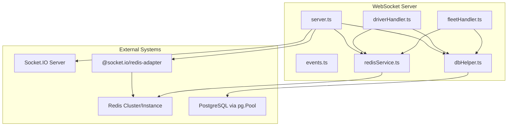
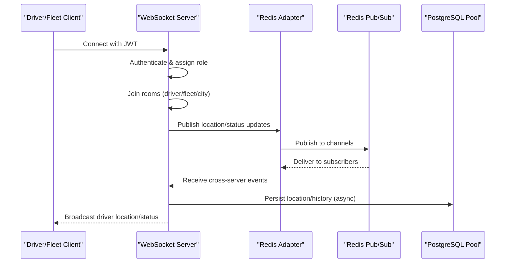
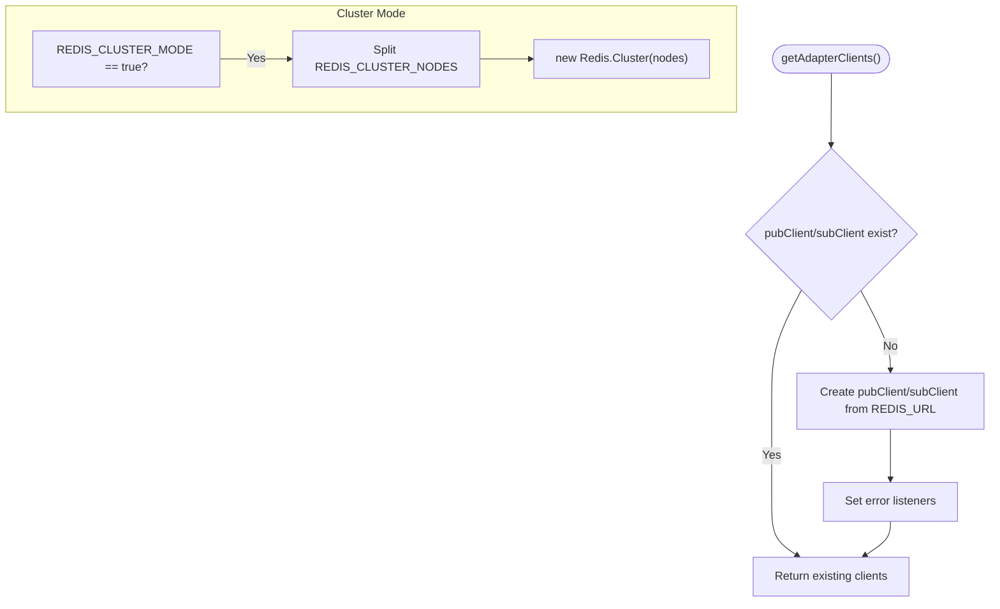
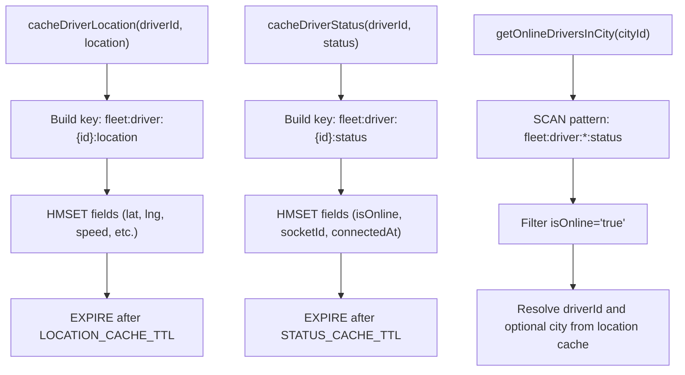
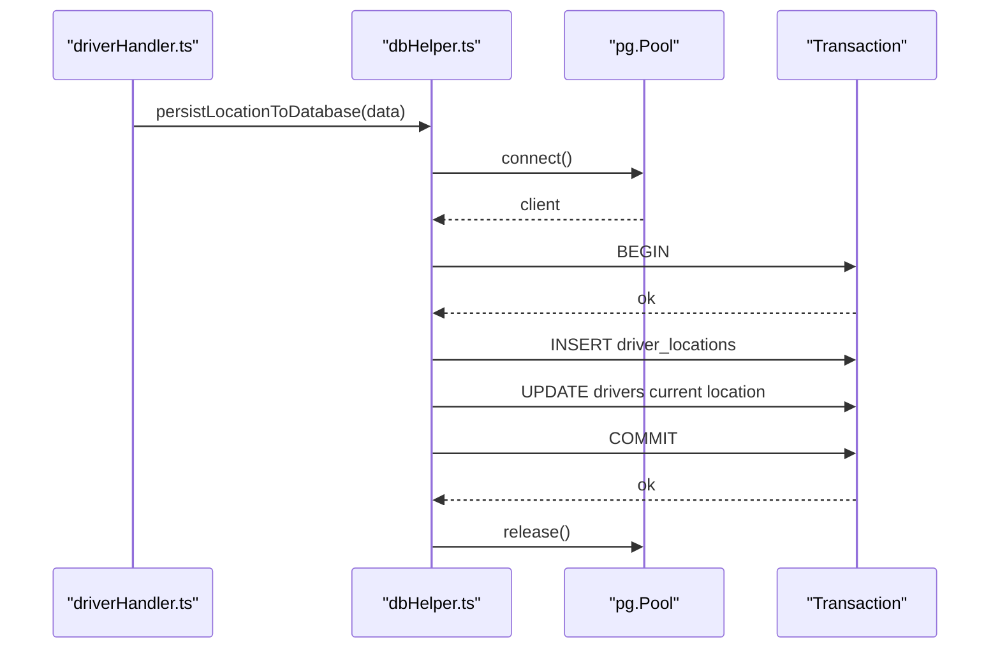
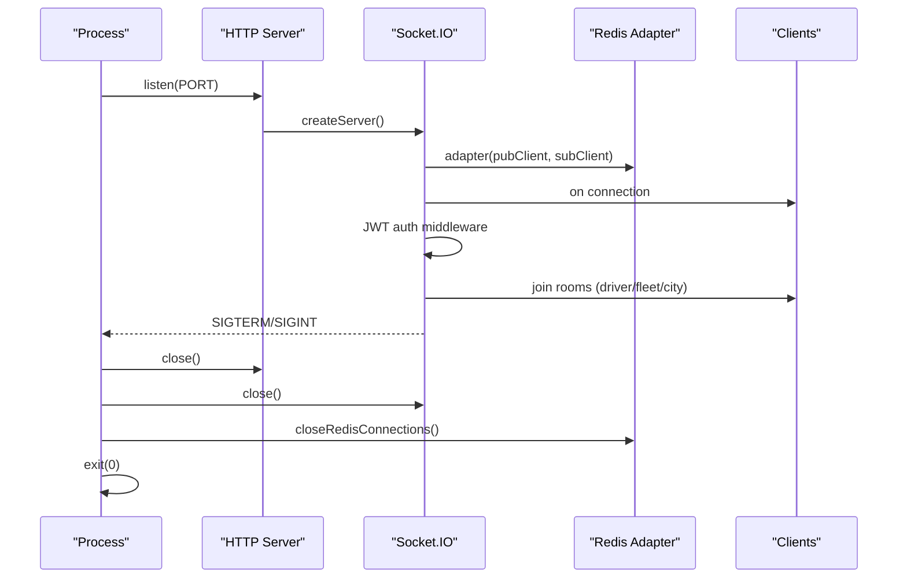
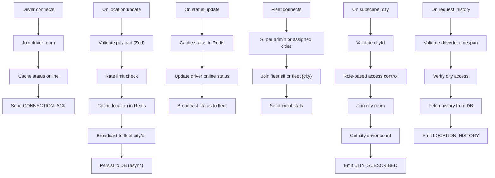
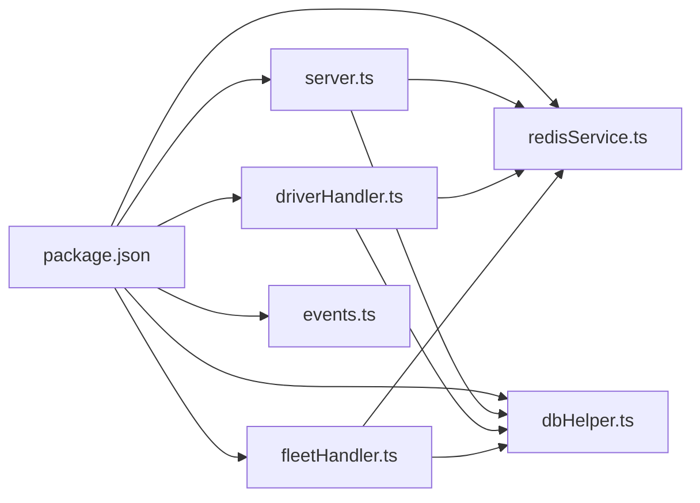

# Services & Infrastructure

<cite>
**Referenced Files in This Document**
- [server.ts](file://websocket-server/src/server.ts)
- [redisService.ts](file://websocket-server/src/services/redisService.ts)
- [dbHelper.ts](file://websocket-server/src/handlers/dbHelper.ts)
- [driverHandler.ts](file://websocket-server/src/handlers/driverHandler.ts)
- [fleetHandler.ts](file://websocket-server/src/handlers/fleetHandler.ts)
- [events.ts](file://websocket-server/src/types/events.ts)
- [package.json](file://websocket-server/package.json)
- [Dockerfile](file://websocket-server/Dockerfile)
- [DEPLOYMENT.md](file://DEPLOYMENT.md)
- [fleet-management-portal-design.md](file://docs/fleet-management-portal-design.md)
</cite>

## Table of Contents
1. [Introduction](#introduction)
2. [Project Structure](#project-structure)
3. [Core Components](#core-components)
4. [Architecture Overview](#architecture-overview)
5. [Detailed Component Analysis](#detailed-component-analysis)
6. [Dependency Analysis](#dependency-analysis)
7. [Performance Considerations](#performance-considerations)
8. [Troubleshooting Guide](#troubleshooting-guide)
9. [Conclusion](#conclusion)
10. [Appendices](#appendices)

## Introduction
This document describes the WebSocket server services and infrastructure components for real-time fleet management. It focuses on the Redis adapter implementation for horizontal scaling, connection pooling, and pub/sub messaging. It also documents Redis service functions including adapter client creation, health checking, connection management, and graceful shutdown procedures. Examples of Redis configuration, cluster setup, and failover handling are included, along with performance considerations, connection limits, and monitoring capabilities. Finally, it documents the database helper functions for connection management and query execution.

## Project Structure
The WebSocket server is organized into modular TypeScript modules:
- Server bootstrap and Socket.IO configuration
- Redis adapter and caching helpers
- Database connection pooling and helpers
- Event types and room naming
- Handlers for driver and fleet roles
- Package and Docker configuration

**Diagram sources**
- [server.ts:34-56](file://websocket-server/src/server.ts#L34-L56)
- [redisService.ts:63-82](file://websocket-server/src/services/redisService.ts#L63-L82)
- [driverHandler.ts:48-80](file://websocket-server/src/handlers/driverHandler.ts#L48-L80)
- [fleetHandler.ts:36-62](file://websocket-server/src/handlers/fleetHandler.ts#L36-L62)
- [dbHelper.ts:15-29](file://websocket-server/src/handlers/dbHelper.ts#L15-L29)

**Section sources**
- [server.ts:18-51](file://websocket-server/src/server.ts#L18-L51)
- [package.json:21-29](file://websocket-server/package.json#L21-L29)

## Core Components
- Redis adapter and clients for Socket.IO clustering
- Redis caching helpers for driver location/status and city stats
- Database pool and helpers for driver data and location history
- WebSocket server with JWT auth, room management, and health/readiness checks
- Graceful shutdown with Redis and DB cleanup

**Section sources**
- [redisService.ts:22-58](file://websocket-server/src/services/redisService.ts#L22-L58)
- [redisService.ts:63-82](file://websocket-server/src/services/redisService.ts#L63-L82)
- [redisService.ts:87-224](file://websocket-server/src/services/redisService.ts#L87-L224)
- [dbHelper.ts:15-29](file://websocket-server/src/handlers/dbHelper.ts#L15-L29)
- [dbHelper.ts:34-192](file://websocket-server/src/handlers/dbHelper.ts#L34-L192)
- [server.ts:34-51](file://websocket-server/src/server.ts#L34-L51)
- [server.ts:162-192](file://websocket-server/src/server.ts#L162-L192)
- [server.ts:197-224](file://websocket-server/src/server.ts#L197-L224)

## Architecture Overview
The system scales horizontally using:
- Sticky routing for driver sessions
- Redis pub/sub via Socket.IO adapter for cross-server broadcasts
- Separate Redis clients for publishing and subscribing
- Database pooling for reliable writes and reads

**Diagram sources**
- [server.ts:65-103](file://websocket-server/src/server.ts#L65-L103)
- [server.ts:108-150](file://websocket-server/src/server.ts#L108-L150)
- [driverHandler.ts:86-100](file://websocket-server/src/handlers/driverHandler.ts#L86-L100)
- [driverHandler.ts:172-182](file://websocket-server/src/handlers/driverHandler.ts#L172-L182)
- [redisService.ts:63-82](file://websocket-server/src/services/redisService.ts#L63-L82)

## Detailed Component Analysis

### Redis Adapter and Clients
- Single shared Redis client for general operations and caching
- Dedicated pub/sub clients for Socket.IO adapter
- Cluster mode support via environment variables
- Health check via PING
- Graceful shutdown closes all Redis connections

**Diagram sources**
- [redisService.ts:63-82](file://websocket-server/src/services/redisService.ts#L63-L82)
- [redisService.ts:26-42](file://websocket-server/src/services/redisService.ts#L26-L42)

**Section sources**
- [redisService.ts:22-58](file://websocket-server/src/services/redisService.ts#L22-L58)
- [redisService.ts:63-82](file://websocket-server/src/services/redisService.ts#L63-L82)
- [redisService.ts:254-263](file://websocket-server/src/services/redisService.ts#L254-L263)
- [redisService.ts:229-249](file://websocket-server/src/services/redisService.ts#L229-L249)

### Redis Caching Helpers
- Driver location caching with hash fields and TTL
- Driver status caching with online/offline flags and timestamps
- Online driver discovery by city using key scans
- City statistics counters with atomic increments
- Offline marking with disconnected timestamps

**Diagram sources**
- [redisService.ts:87-146](file://websocket-server/src/services/redisService.ts#L87-L146)
- [redisService.ts:165-187](file://websocket-server/src/services/redisService.ts#L165-L187)
- [redisService.ts:192-207](file://websocket-server/src/services/redisService.ts#L192-L207)
- [redisService.ts:212-224](file://websocket-server/src/services/redisService.ts#L212-L224)

**Section sources**
- [redisService.ts:87-146](file://websocket-server/src/services/redisService.ts#L87-L146)
- [redisService.ts:165-187](file://websocket-server/src/services/redisService.ts#L165-L187)
- [redisService.ts:192-207](file://websocket-server/src/services/redisService.ts#L192-L207)
- [redisService.ts:212-224](file://websocket-server/src/services/redisService.ts#L212-L224)

### Database Pool and Helpers
- Singleton pg.Pool initialized once with configurable pool size and SSL
- Driver data retrieval and online status updates
- Asynchronous location persistence with transaction semantics
- Location history retrieval with pagination and bounds
- City driver counts with totals and online counts
- Graceful pool termination

**Diagram sources**
- [dbHelper.ts:83-125](file://websocket-server/src/handlers/dbHelper.ts#L83-L125)
- [driverHandler.ts:184-198](file://websocket-server/src/handlers/driverHandler.ts#L184-L198)

**Section sources**
- [dbHelper.ts:15-29](file://websocket-server/src/handlers/dbHelper.ts#L15-L29)
- [dbHelper.ts:34-78](file://websocket-server/src/handlers/dbHelper.ts#L34-L78)
- [dbHelper.ts:83-125](file://websocket-server/src/handlers/dbHelper.ts#L83-L125)
- [dbHelper.ts:128-163](file://websocket-server/src/handlers/dbHelper.ts#L128-L163)
- [dbHelper.ts:168-192](file://websocket-server/src/handlers/dbHelper.ts#L168-L192)
- [dbHelper.ts:197-203](file://websocket-server/src/handlers/dbHelper.ts#L197-L203)

### WebSocket Server, Authentication, and Rooms
- Socket.IO server with CORS, ping intervals, and transport options
- JWT authentication middleware validating tokens and assigning roles
- Connection counting and capacity checks
- Redis adapter initialization with separate pub/sub clients
- Health and readiness endpoints
- Graceful shutdown sequence

**Diagram sources**
- [server.ts:34-51](file://websocket-server/src/server.ts#L34-L51)
- [server.ts:53-55](file://websocket-server/src/server.ts#L53-L55)
- [server.ts:65-103](file://websocket-server/src/server.ts#L65-L103)
- [server.ts:162-192](file://websocket-server/src/server.ts#L162-L192)
- [server.ts:197-224](file://websocket-server/src/server.ts#L197-L224)

**Section sources**
- [server.ts:18-51](file://websocket-server/src/server.ts#L18-L51)
- [server.ts:53-55](file://websocket-server/src/server.ts#L53-L55)
- [server.ts:65-103](file://websocket-server/src/server.ts#L65-L103)
- [server.ts:108-150](file://websocket-server/src/server.ts#L108-L150)
- [server.ts:162-192](file://websocket-server/src/server.ts#L162-L192)
- [server.ts:197-224](file://websocket-server/src/server.ts#L197-L224)

### Driver and Fleet Handlers
- Driver handler: validates and rate-limits location updates, caches and persists, broadcasts to fleet, marks offline on disconnect
- Fleet handler: manages city subscriptions, enforces access control, requests location history, sends initial stats

**Diagram sources**
- [driverHandler.ts:48-80](file://websocket-server/src/handlers/driverHandler.ts#L48-L80)
- [driverHandler.ts:86-100](file://websocket-server/src/handlers/driverHandler.ts#L86-L100)
- [driverHandler.ts:105-207](file://websocket-server/src/handlers/driverHandler.ts#L105-L207)
- [driverHandler.ts:212-275](file://websocket-server/src/handlers/driverHandler.ts#L212-L275)
- [driverHandler.ts:280-317](file://websocket-server/src/handlers/driverHandler.ts#L280-L317)
- [fleetHandler.ts:36-62](file://websocket-server/src/handlers/fleetHandler.ts#L36-L62)
- [fleetHandler.ts:67-82](file://websocket-server/src/handlers/fleetHandler.ts#L67-L82)
- [fleetHandler.ts:87-140](file://websocket-server/src/handlers/fleetHandler.ts#L87-L140)
- [fleetHandler.ts:145-212](file://websocket-server/src/handlers/fleetHandler.ts#L145-L212)

**Section sources**
- [driverHandler.ts:28-44](file://websocket-server/src/handlers/driverHandler.ts#L28-L44)
- [driverHandler.ts:105-207](file://websocket-server/src/handlers/driverHandler.ts#L105-L207)
- [driverHandler.ts:212-275](file://websocket-server/src/handlers/driverHandler.ts#L212-L275)
- [driverHandler.ts:280-317](file://websocket-server/src/handlers/driverHandler.ts#L280-L317)
- [fleetHandler.ts:19-28](file://websocket-server/src/handlers/fleetHandler.ts#L19-L28)
- [fleetHandler.ts:87-140](file://websocket-server/src/handlers/fleetHandler.ts#L87-L140)
- [fleetHandler.ts:145-212](file://websocket-server/src/handlers/fleetHandler.ts#L145-L212)

### Event Types and Room Names
- Strongly typed events for location/status updates, history requests, and stats
- Room naming conventions for fleet-wide and city-scoped communications
- Payload structures for driver location, status, and history items

**Section sources**
- [events.ts:157-187](file://websocket-server/src/types/events.ts#L157-L187)
- [events.ts:27-117](file://websocket-server/src/types/events.ts#L27-L117)

## Dependency Analysis
- Runtime dependencies include Socket.IO, Redis adapter, ioredis, jsonwebtoken, dotenv, winston, pg, and zod
- Development dependencies include TypeScript tooling and ESLint
- Docker multi-stage build for production with health checks and non-root user

**Diagram sources**
- [package.json:21-29](file://websocket-server/package.json#L21-L29)
- [server.ts:11-14](file://websocket-server/src/server.ts#L11-L14)

**Section sources**
- [package.json:21-29](file://websocket-server/package.json#L21-L29)
- [Dockerfile:43-70](file://websocket-server/Dockerfile#L43-L70)

## Performance Considerations
- Connection limits and graceful degradation
- Compression thresholds and message size limits
- Redis TTL tuning for location and status caches
- Database pool sizing and SSL configuration
- Horizontal scaling with sticky sessions and Redis pub/sub
- Rate limiting for location updates

[No sources needed since this section provides general guidance]

## Troubleshooting Guide
- Health endpoint returns current connection counts and environment
- Readiness probe checks Redis connectivity via adapter clients
- Error handlers for uncaught exceptions and unhandled rejections
- Graceful shutdown ensures clean termination of all connections and pools

**Section sources**
- [server.ts:162-192](file://websocket-server/src/server.ts#L162-L192)
- [server.ts:231-239](file://websocket-server/src/server.ts#L231-L239)
- [server.ts:197-224](file://websocket-server/src/server.ts#L197-L224)
- [redisService.ts:254-263](file://websocket-server/src/services/redisService.ts#L254-L263)

## Conclusion
The WebSocket server integrates Redis for horizontal scaling and pub/sub, while maintaining robust database operations for persistence and analytics. The design emphasizes clear separation of concerns, strong typing, and operational safety through health checks, graceful shutdown, and access control.

[No sources needed since this section summarizes without analyzing specific files]

## Appendices

### Redis Configuration and Cluster Setup
- Standard single-node and cluster modes controlled by environment variables
- Example environment variables for Redis URL, cluster mode, and key prefix
- Cluster deployment patterns and failover considerations

**Section sources**
- [redisService.ts:26-42](file://websocket-server/src/services/redisService.ts#L26-L42)
- [redisService.ts:15-17](file://websocket-server/src/services/redisService.ts#L15-L17)
- [fleet-management-portal-design.md:2794-2796](file://docs/fleet-management-portal-design.md#L2794-L2796)
- [fleet-management-portal-design.md:2511-2585](file://docs/fleet-management-portal-design.md#L2511-L2585)

### Database Configuration
- Connection string, pool size, and SSL options
- Transactional persistence for location updates
- Query patterns for driver data and history

**Section sources**
- [dbHelper.ts:17-21](file://websocket-server/src/handlers/dbHelper.ts#L17-L21)
- [dbHelper.ts:83-125](file://websocket-server/src/handlers/dbHelper.ts#L83-L125)
- [dbHelper.ts:128-163](file://websocket-server/src/handlers/dbHelper.ts#L128-L163)

### Monitoring and Readiness
- Health endpoint exposes connection metrics
- Readiness probe validates Redis adapter health
- Docker HEALTHCHECK configured for uptime monitoring

**Section sources**
- [server.ts:162-192](file://websocket-server/src/server.ts#L162-L192)
- [Dockerfile:63-64](file://websocket-server/Dockerfile#L63-L64)

### Deployment Notes
- Multi-stage Docker build with non-root user and health checks
- Environment variables for deployment and runtime configuration
- Horizontal scaling patterns and sticky session routing

**Section sources**
- [Dockerfile:43-70](file://websocket-server/Dockerfile#L43-L70)
- [DEPLOYMENT.md:69-78](file://DEPLOYMENT.md#L69-L78)
- [fleet-management-portal-design.md:2542-2585](file://docs/fleet-management-portal-design.md#L2542-L2585)