# WebSocket Server

<cite>
**Referenced Files in This Document**
- [server.ts](file://websocket-server/src/server.ts)
- [driverHandler.ts](file://websocket-server/src/handlers/driverHandler.ts)
- [fleetHandler.ts](file://websocket-server/src/handlers/fleetHandler.ts)
- [redisService.ts](file://websocket-server/src/services/redisService.ts)
- [dbHelper.ts](file://websocket-server/src/handlers/dbHelper.ts)
- [events.ts](file://websocket-server/src/types/events.ts)
- [package.json](file://websocket-server/package.json)
- [Dockerfile](file://websocket-server/Dockerfile)
- [tsconfig.json](file://websocket-server/tsconfig.json)
</cite>

## Table of Contents
1. [Introduction](#introduction)
2. [Project Structure](#project-structure)
3. [Core Components](#core-components)
4. [Architecture Overview](#architecture-overview)
5. [Detailed Component Analysis](#detailed-component-analysis)
6. [Dependency Analysis](#dependency-analysis)
7. [Performance Considerations](#performance-considerations)
8. [Troubleshooting Guide](#troubleshooting-guide)
9. [Conclusion](#conclusion)
10. [Appendices](#appendices)

## Introduction
This document describes the WebSocket server for the Nutrio real-time communication system. It covers the Socket.io implementation with Redis adapter for horizontal scaling, JWT authentication middleware, connection management, driver and fleet handlers, room management, and event-driven architecture. It also documents configuration options, connection limits, error handling, graceful shutdown, authentication flow, role-based access, connection metrics, scalability considerations, health checks, monitoring, and practical examples of event handling and broadcasting patterns.

## Project Structure
The WebSocket server is organized into modular TypeScript modules under the websocket-server package. The primary entry point initializes the HTTP server, Socket.io server, Redis adapter, and handlers. Supporting modules encapsulate Redis caching, database operations, and type definitions.

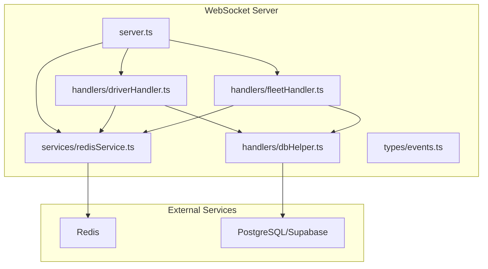

**Diagram sources**
- [server.ts:1-256](file://websocket-server/src/server.ts#L1-L256)
- [driverHandler.ts:1-318](file://websocket-server/src/handlers/driverHandler.ts#L1-L318)
- [fleetHandler.ts:1-247](file://websocket-server/src/handlers/fleetHandler.ts#L1-L247)
- [redisService.ts:1-264](file://websocket-server/src/services/redisService.ts#L1-L264)
- [dbHelper.ts:1-204](file://websocket-server/src/handlers/dbHelper.ts#L1-L204)

**Section sources**
- [server.ts:1-256](file://websocket-server/src/server.ts#L1-L256)
- [package.json:1-44](file://websocket-server/package.json#L1-L44)
- [tsconfig.json:1-36](file://websocket-server/tsconfig.json#L1-L36)

## Core Components
- Socket.io server with Redis adapter for multi-instance scaling
- JWT authentication middleware extracting user identity and roles
- Connection lifecycle management with metrics and rate limiting
- Driver handler for location/status updates and broadcasts
- Fleet handler for city subscriptions, history requests, and stats
- Redis-backed caching for driver location/status and city stats
- PostgreSQL/Supabase persistence for driver metadata and location history
- Health and readiness endpoints for monitoring and orchestration

**Section sources**
- [server.ts:34-51](file://websocket-server/src/server.ts#L34-L51)
- [server.ts:65-103](file://websocket-server/src/server.ts#L65-L103)
- [driverHandler.ts:48-80](file://websocket-server/src/handlers/driverHandler.ts#L48-L80)
- [fleetHandler.ts:36-62](file://websocket-server/src/handlers/fleetHandler.ts#L36-L62)
- [redisService.ts:63-82](file://websocket-server/src/services/redisService.ts#L63-L82)
- [dbHelper.ts:15-29](file://websocket-server/src/handlers/dbHelper.ts#L15-L29)

## Architecture Overview
The server uses Socket.io with a Redis adapter to enable horizontal scaling across multiple instances. Connections are authenticated via JWT, with user type and role determining handler selection and room access. Drivers publish location/status updates; fleet managers subscribe to city rooms and receive targeted broadcasts. Redis caches frequently accessed driver state and city stats; PostgreSQL persists historical data and driver metadata.

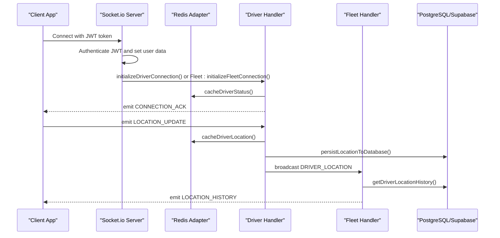

**Diagram sources**
- [server.ts:108-150](file://websocket-server/src/server.ts#L108-L150)
- [driverHandler.ts:105-207](file://websocket-server/src/handlers/driverHandler.ts#L105-L207)
- [fleetHandler.ts:145-212](file://websocket-server/src/handlers/fleetHandler.ts#L145-L212)
- [redisService.ts:87-146](file://websocket-server/src/services/redisService.ts#L87-L146)
- [dbHelper.ts:83-125](file://websocket-server/src/handlers/dbHelper.ts#L83-L125)

## Detailed Component Analysis

### Socket.io Server and Redis Adapter
- Creates HTTP server and Socket.io server with CORS, transport options, compression, and buffer size limits.
- Initializes Redis adapter using separate publisher and subscriber clients for Socket.io.
- Enforces global connection limits and exposes health/readiness endpoints.
- Implements graceful shutdown sequence: close HTTP server, Socket.io server, disconnect sockets, close Redis and DB pools.

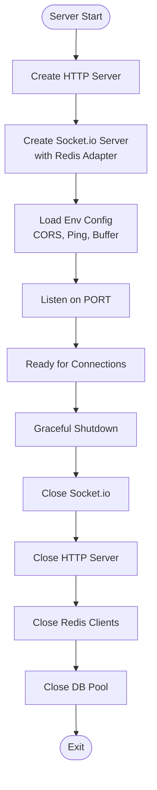

**Diagram sources**
- [server.ts:34-51](file://websocket-server/src/server.ts#L34-L51)
- [server.ts:197-224](file://websocket-server/src/server.ts#L197-L224)

**Section sources**
- [server.ts:18-26](file://websocket-server/src/server.ts#L18-L26)
- [server.ts:34-51](file://websocket-server/src/server.ts#L34-L51)
- [server.ts:197-224](file://websocket-server/src/server.ts#L197-L224)

### JWT Authentication Middleware
- Extracts token from handshake authentication.
- Verifies JWT using configured secret and decodes user claims.
- Builds SocketUserData with type, role, and role-specific identifiers.
- Rejects missing/expired/invalid tokens with descriptive errors.

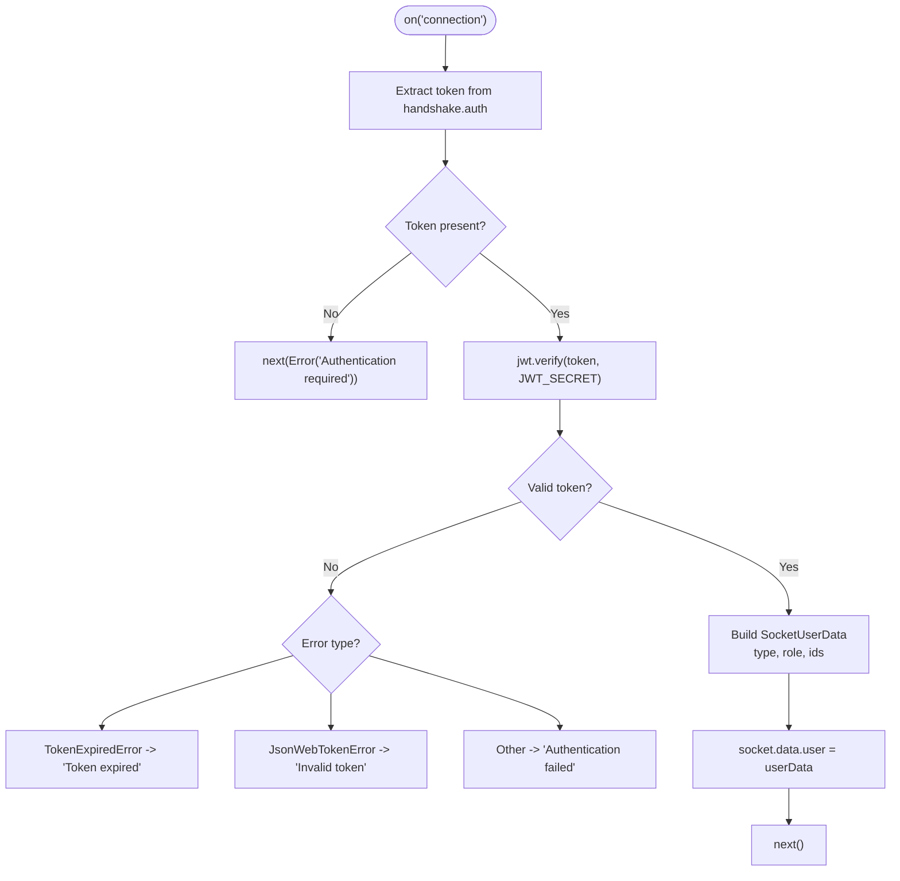

**Diagram sources**
- [server.ts:65-103](file://websocket-server/src/server.ts#L65-L103)

**Section sources**
- [server.ts:65-103](file://websocket-server/src/server.ts#L65-L103)

### Connection Management and Metrics
- Tracks total, driver, and fleet connections.
- Applies global connection cap and emits error before disconnecting.
- Updates metrics on connect/disconnect with debug logging.

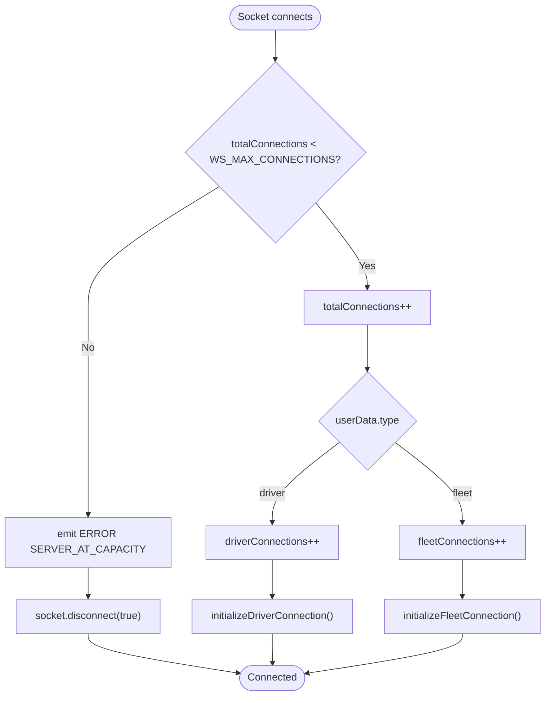

**Diagram sources**
- [server.ts:108-150](file://websocket-server/src/server.ts#L108-L150)

**Section sources**
- [server.ts:57-61](file://websocket-server/src/server.ts#L57-L61)
- [server.ts:108-150](file://websocket-server/src/server.ts#L108-L150)

### Driver Handler Implementation
- Joins driver-specific room and caches online status.
- Validates and rate-limits location updates; persists to DB asynchronously.
- Broadcasts driver location to fleet city/all rooms.
- Handles status updates and marks driver offline on disconnect.

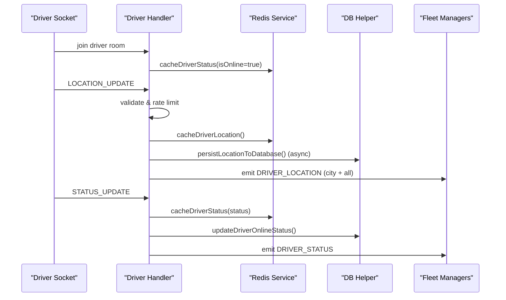

**Diagram sources**
- [driverHandler.ts:48-80](file://websocket-server/src/handlers/driverHandler.ts#L48-L80)
- [driverHandler.ts:105-207](file://websocket-server/src/handlers/driverHandler.ts#L105-L207)
- [driverHandler.ts:212-275](file://websocket-server/src/handlers/driverHandler.ts#L212-L275)
- [redisService.ts:87-146](file://websocket-server/src/services/redisService.ts#L87-L146)
- [dbHelper.ts:83-125](file://websocket-server/src/handlers/dbHelper.ts#L83-L125)

**Section sources**
- [driverHandler.ts:48-80](file://websocket-server/src/handlers/driverHandler.ts#L48-L80)
- [driverHandler.ts:105-207](file://websocket-server/src/handlers/driverHandler.ts#L105-L207)
- [driverHandler.ts:212-275](file://websocket-server/src/handlers/driverHandler.ts#L212-L275)

### Fleet Handler Implementation
- Joins fleet manager to either all cities (super admin) or assigned cities.
- Validates city subscription access and emits subscribed event with driver counts.
- Requests location history with access control and returns paginated points.
- Sends initial stats for subscribed cities.

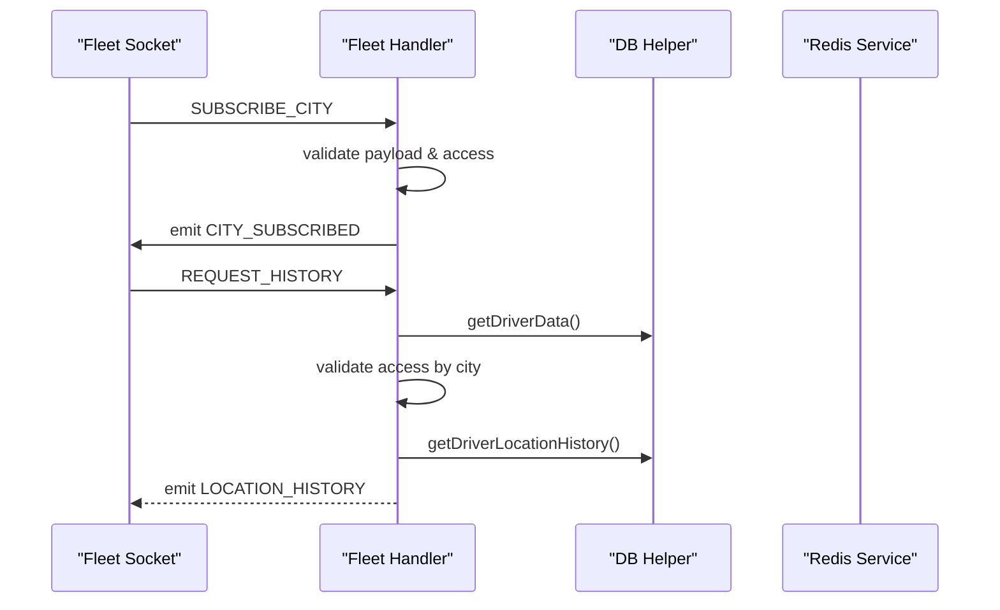

**Diagram sources**
- [fleetHandler.ts:36-62](file://websocket-server/src/handlers/fleetHandler.ts#L36-L62)
- [fleetHandler.ts:87-140](file://websocket-server/src/handlers/fleetHandler.ts#L87-L140)
- [fleetHandler.ts:145-212](file://websocket-server/src/handlers/fleetHandler.ts#L145-L212)
- [dbHelper.ts:130-163](file://websocket-server/src/handlers/dbHelper.ts#L130-L163)

**Section sources**
- [fleetHandler.ts:36-62](file://websocket-server/src/handlers/fleetHandler.ts#L36-L62)
- [fleetHandler.ts:87-140](file://websocket-server/src/handlers/fleetHandler.ts#L87-L140)
- [fleetHandler.ts:145-212](file://websocket-server/src/handlers/fleetHandler.ts#L145-L212)

### Room Management and Broadcasting
- Room names:
  - fleet:all for super admin
  - fleet:{cityId} for city-specific fleet managers
  - driver:{driverId} for driver-specific isolation
- Broadcast patterns:
  - Driver location updates broadcast to fleet city and all rooms
  - Driver status updates broadcast to fleet city and all rooms

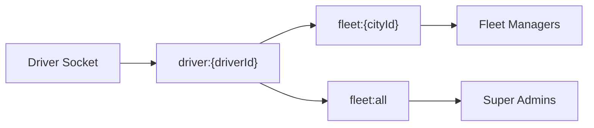

**Diagram sources**
- [events.ts:182-186](file://websocket-server/src/types/events.ts#L182-L186)
- [driverHandler.ts:172-182](file://websocket-server/src/handlers/driverHandler.ts#L172-L182)
- [driverHandler.ts:247-266](file://websocket-server/src/handlers/driverHandler.ts#L247-L266)

**Section sources**
- [events.ts:182-186](file://websocket-server/src/types/events.ts#L182-L186)
- [driverHandler.ts:172-182](file://websocket-server/src/handlers/driverHandler.ts#L172-L182)
- [driverHandler.ts:247-266](file://websocket-server/src/handlers/driverHandler.ts#L247-L266)

### Redis Service and Caching
- Provides Redis clients for Socket.io adapter and general operations.
- Caches driver location and status with TTLs.
- Retrieves online drivers and city stats; marks driver offline on disconnect.
- Health check pings Redis for readiness.

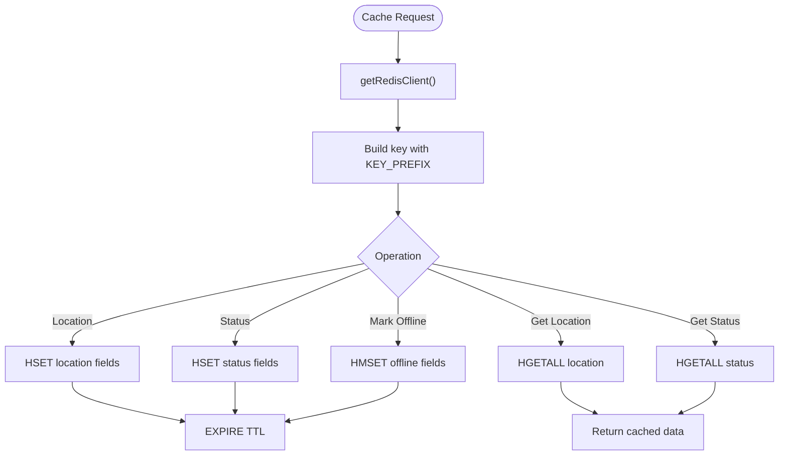

**Diagram sources**
- [redisService.ts:87-146](file://websocket-server/src/services/redisService.ts#L87-L146)
- [redisService.ts:165-207](file://websocket-server/src/services/redisService.ts#L165-L207)
- [redisService.ts:254-263](file://websocket-server/src/services/redisService.ts#L254-L263)

**Section sources**
- [redisService.ts:22-58](file://websocket-server/src/services/redisService.ts#L22-L58)
- [redisService.ts:63-82](file://websocket-server/src/services/redisService.ts#L63-L82)
- [redisService.ts:87-146](file://websocket-server/src/services/redisService.ts#L87-L146)
- [redisService.ts:165-207](file://websocket-server/src/services/redisService.ts#L165-L207)
- [redisService.ts:254-263](file://websocket-server/src/services/redisService.ts#L254-L263)

### Database Helper and Persistence
- Manages a PostgreSQL connection pool with SSL and pool size configuration.
- Provides driver metadata retrieval, online status updates, and location history queries.
- Persists location updates atomically with transaction boundaries.

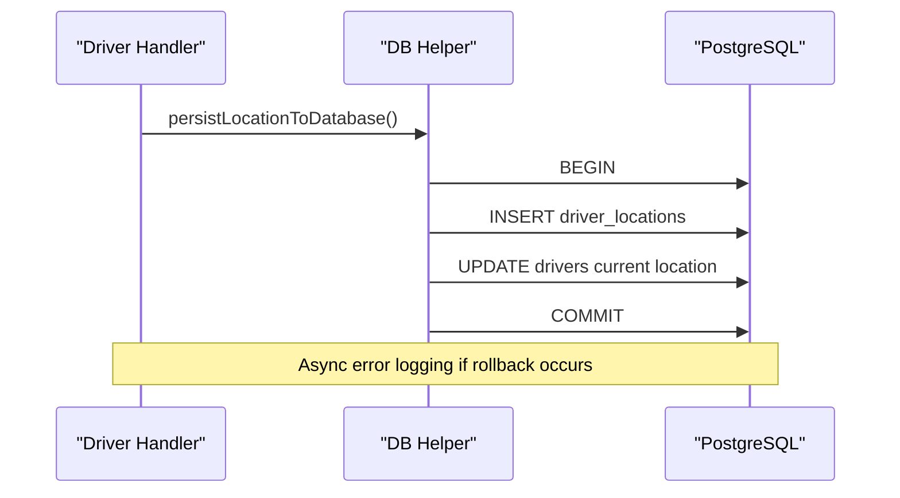

**Diagram sources**
- [dbHelper.ts:83-125](file://websocket-server/src/handlers/dbHelper.ts#L83-L125)

**Section sources**
- [dbHelper.ts:15-29](file://websocket-server/src/handlers/dbHelper.ts#L15-L29)
- [dbHelper.ts:34-53](file://websocket-server/src/handlers/dbHelper.ts#L34-L53)
- [dbHelper.ts:83-125](file://websocket-server/src/handlers/dbHelper.ts#L83-L125)
- [dbHelper.ts:130-163](file://websocket-server/src/handlers/dbHelper.ts#L130-L163)

### Event-Driven Architecture and Types
- Defines SocketEvents and RoomNames for consistent client/server contracts.
- Declares typed payloads for location, status, history, and error events.
- Supports driver and fleet roles with access control in fleet handler.

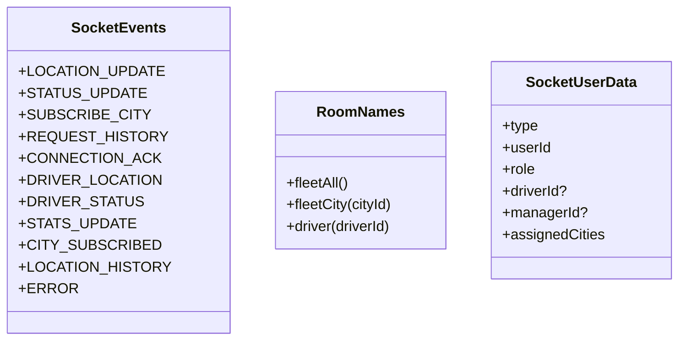

**Diagram sources**
- [events.ts:157-186](file://websocket-server/src/types/events.ts#L157-L186)

**Section sources**
- [events.ts:157-186](file://websocket-server/src/types/events.ts#L157-L186)

## Dependency Analysis
- Runtime dependencies include Socket.io, Redis adapter, ioredis, jsonwebtoken, dotenv, winston, pg, and zod.
- Development dependencies include TypeScript, ESLint, ts-node-dev, and type definitions.
- Containerization uses a multi-stage Docker build with health checks and non-root user.

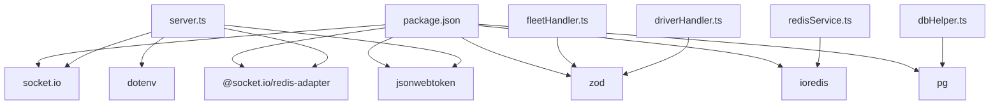

**Diagram sources**
- [package.json:21-29](file://websocket-server/package.json#L21-L29)
- [server.ts:7-16](file://websocket-server/src/server.ts#L7-L16)
- [driverHandler.ts:22](file://websocket-server/src/handlers/driverHandler.ts#L22)
- [fleetHandler.ts:17](file://websocket-server/src/handlers/fleetHandler.ts#L17)
- [redisService.ts:6](file://websocket-server/src/services/redisService.ts#L6)
- [dbHelper.ts:6](file://websocket-server/src/handlers/dbHelper.ts#L6)

**Section sources**
- [package.json:21-29](file://websocket-server/package.json#L21-L29)
- [Dockerfile:1-96](file://websocket-server/Dockerfile#L1-L96)

## Performance Considerations
- Transport and timeouts: WebSocket with polling fallback, configurable ping intervals/timeouts, and upgrade timeout.
- Compression: Message deflation threshold reduces bandwidth for large payloads.
- Buffer size: Max HTTP buffer size controls message size limits.
- Redis clustering: Optional cluster mode for horizontal Redis scaling.
- Rate limiting: Client-side update interval enforcement prevents excessive updates.
- Asynchronous persistence: Location writes to DB are fire-and-forget to avoid blocking broadcasts.
- Connection caps: Global max connections prevent resource exhaustion.

[No sources needed since this section provides general guidance]

## Troubleshooting Guide
- Authentication failures: Check JWT_SECRET presence and validity; inspect emitted error codes for missing/invalid/expired tokens.
- Connection limits: When server reaches capacity, clients receive a specific error code and are disconnected.
- Redis connectivity: Use readiness endpoint to verify Redis health; errors logged on client reconnect/connect/reconnecting.
- Database errors: Pool errors and transaction rollbacks are logged; ensure DATABASE_URL and SSL settings are correct.
- Graceful shutdown: SIGTERM/SIGINT triggers orderly closure of servers, sockets, Redis, and DB pools.

**Section sources**
- [server.ts:29-32](file://websocket-server/src/server.ts#L29-L32)
- [server.ts:110-117](file://websocket-server/src/server.ts#L110-L117)
- [server.ts:155-157](file://websocket-server/src/server.ts#L155-L157)
- [redisService.ts:44-54](file://websocket-server/src/services/redisService.ts#L44-L54)
- [dbHelper.ts:23-25](file://websocket-server/src/handlers/dbHelper.ts#L23-L25)
- [server.ts:227-239](file://websocket-server/src/server.ts#L227-L239)

## Conclusion
The WebSocket server implements a robust, horizontally scalable real-time system for Nutrio’s fleet management. Socket.io with Redis adapter ensures multi-instance coordination, while JWT-based authentication and role-aware room management enforce secure, targeted communications. Driver and fleet handlers provide clear event-driven patterns for location/status updates and city-level visibility, backed by Redis caching and PostgreSQL persistence. Health checks, graceful shutdown, and configuration-driven tuning support production-grade reliability and observability.

[No sources needed since this section summarizes without analyzing specific files]

## Appendices

### Configuration Options
- Environment variables:
  - PORT, NODE_ENV, LOG_LEVEL, WS_MAX_CONNECTIONS, WS_PING_INTERVAL, WS_PING_TIMEOUT, WS_UPGRADE_TIMEOUT
  - ALLOWED_ORIGINS, JWT_SECRET
  - REDIS_URL, REDIS_PASSWORD, REDIS_DB, REDIS_CLUSTER_MODE, REDIS_CLUSTER_NODES, REDIS_KEY_PREFIX
  - LOCATION_CACHE_TTL, STATUS_CACHE_TTL
  - DATABASE_URL, DATABASE_POOL_SIZE, DATABASE_SSL
  - LOCATION_UPDATE_INTERVAL, MAX_LOCATION_HISTORY_POINTS

**Section sources**
- [server.ts:18-26](file://websocket-server/src/server.ts#L18-L26)
- [redisService.ts:14-17](file://websocket-server/src/services/redisService.ts#L14-L17)
- [dbHelper.ts:17-21](file://websocket-server/src/handlers/dbHelper.ts#L17-L21)
- [driverHandler.ts:26](file://websocket-server/src/handlers/driverHandler.ts#L26)
- [fleetHandler.ts:31](file://websocket-server/src/handlers/fleetHandler.ts#L31)

### Health and Readiness
- HTTP endpoint /health returns server status, connection counts, and environment.
- HTTP endpoint /ready probes Redis health via ping.

**Section sources**
- [server.ts:162-192](file://websocket-server/src/server.ts#L162-L192)
- [redisService.ts:254-263](file://websocket-server/src/services/redisService.ts#L254-L263)

### Monitoring and Metrics
- Connection counters: total, driver, fleet.
- Debug logging enabled by LOG_LEVEL.
- Redis client and pool error logging.

**Section sources**
- [server.ts:57-61](file://websocket-server/src/server.ts#L57-L61)
- [server.ts:133-148](file://websocket-server/src/server.ts#L133-L148)
- [redisService.ts:44-54](file://websocket-server/src/services/redisService.ts#L44-L54)
- [dbHelper.ts:23-25](file://websocket-server/src/handlers/dbHelper.ts#L23-L25)

### Example Patterns
- Driver connection initialization and acknowledgment.
- Location update validation, caching, asynchronous persistence, and targeted broadcasting.
- Fleet city subscription with access control and driver count reporting.
- Location history request with pagination and access validation.

**Section sources**
- [driverHandler.ts:48-80](file://websocket-server/src/handlers/driverHandler.ts#L48-L80)
- [driverHandler.ts:105-207](file://websocket-server/src/handlers/driverHandler.ts#L105-L207)
- [fleetHandler.ts:87-140](file://websocket-server/src/handlers/fleetHandler.ts#L87-L140)
- [fleetHandler.ts:145-212](file://websocket-server/src/handlers/fleetHandler.ts#L145-L212)