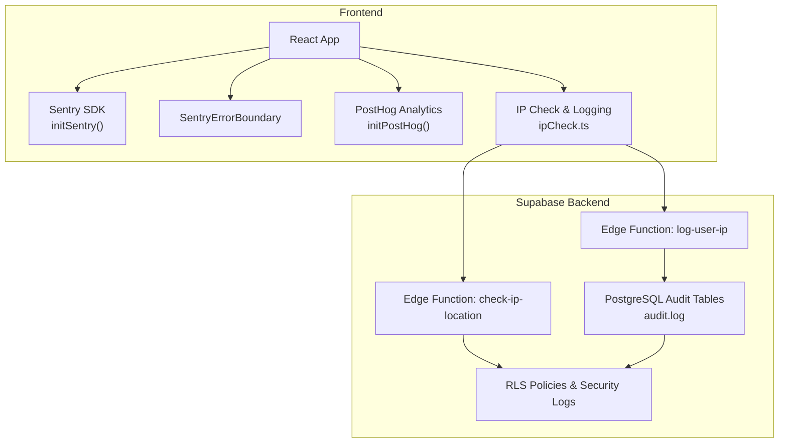
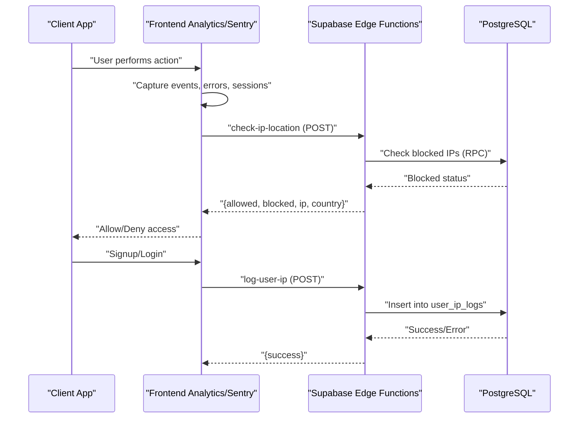
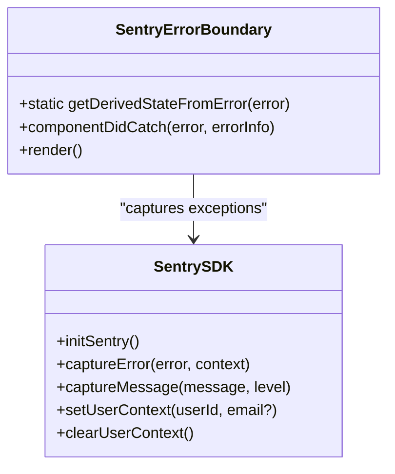
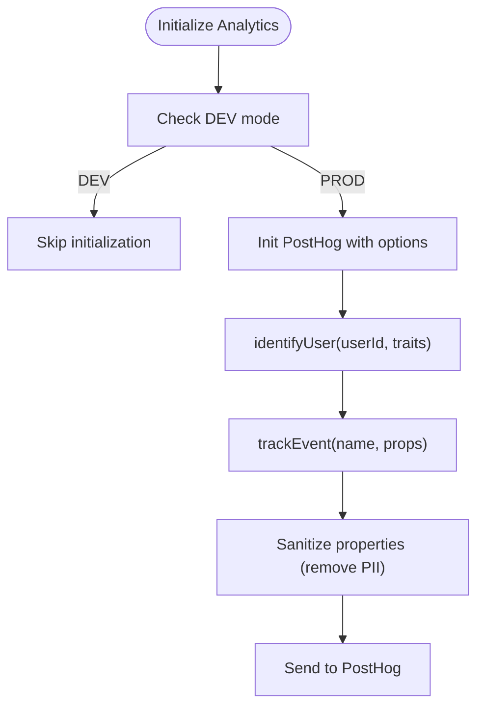
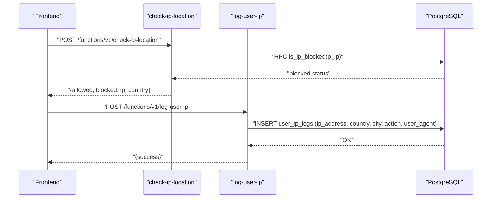
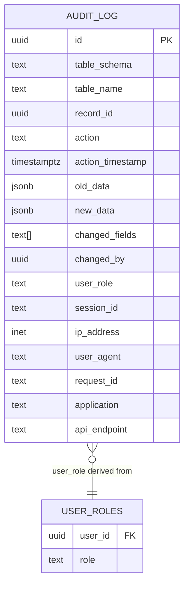
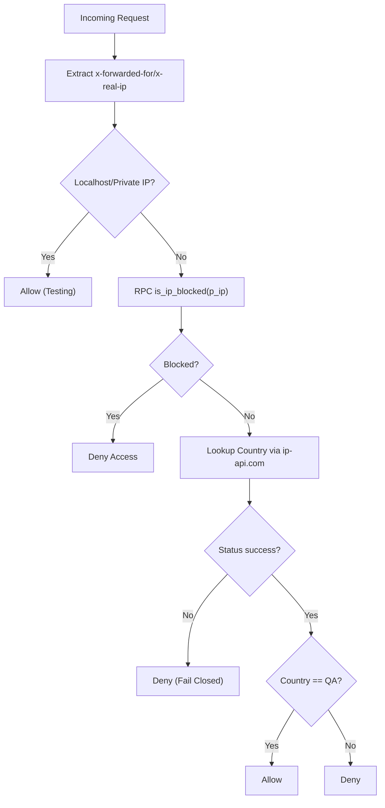
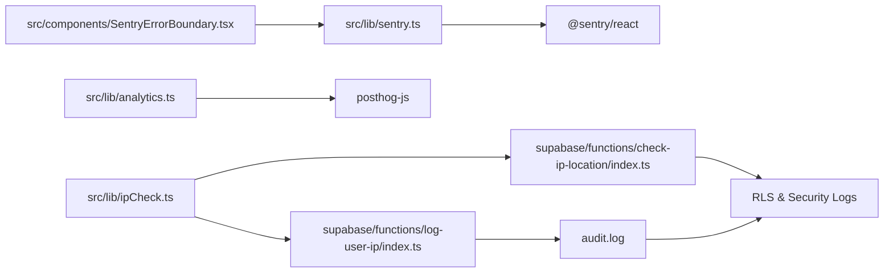

# Audit Logging & Monitoring

<cite>
**Referenced Files in This Document**
- [sentry.ts](file://src/lib/sentry.ts)
- [SentryErrorBoundary.tsx](file://src/components/SentryErrorBoundary.tsx)
- [analytics.ts](file://src/lib/analytics.ts)
- [ipCheck.ts](file://src/lib/ipCheck.ts)
- [20260226000003_audit_logging_system.sql](file://supabase/migrations/20260226000003_audit_logging_system.sql)
- [20250220000008_create_ip_logging_trigger.sql](file://supabase/migrations/20250220000008_create_ip_logging_trigger.sql)
- [20250218000002_rls_audit_and_policies.sql](file://supabase/migrations/20250218000002_rls_audit_and_policies.sql)
- [log-user-ip/index.ts](file://supabase/functions/log-user-ip/index.ts)
- [check-ip-location/index.ts](file://supabase/functions/check-ip-location/index.ts)
- [security.spec.ts](file://e2e/system/security.spec.ts)
- [COMPLETE_PRODUCTION_AUDIT_FINAL.md](file://COMPLETE_PRODUCTION_AUDIT_FINAL.md)
- [system-architecture.html](file://docs/plans/system-architecture.html)
</cite>

## Table of Contents
1. [Introduction](#introduction)
2. [Project Structure](#project-structure)
3. [Core Components](#core-components)
4. [Architecture Overview](#architecture-overview)
5. [Detailed Component Analysis](#detailed-component-analysis)
6. [Dependency Analysis](#dependency-analysis)
7. [Performance Considerations](#performance-considerations)
8. [Troubleshooting Guide](#troubleshooting-guide)
9. [Conclusion](#conclusion)
10. [Appendices](#appendices)

## Introduction
This document provides comprehensive audit logging and monitoring documentation for the Nutrio application. It covers:
- User activity tracking, system changes, and security events
- Sentry integration for error tracking, performance monitoring, and user session replay
- IP logging functionality and geographic tracking capabilities
- Analytics integration for behavioral monitoring and performance metrics
- Security incident detection and alerting mechanisms
- Log retention policies, data lifecycle management, and compliance reporting
- Practical examples for implementing audit trails, investigating security incidents, and generating compliance reports
- Log analysis techniques and automated monitoring strategies

## Project Structure
The audit and monitoring system spans frontend libraries, backend Supabase functions, and database-level audit triggers and policies. The following diagram shows the high-level structure and data flow.

**Diagram sources**
- [sentry.ts:1-73](file://src/lib/sentry.ts#L1-L73)
- [SentryErrorBoundary.tsx:1-77](file://src/components/SentryErrorBoundary.tsx#L1-L77)
- [analytics.ts:1-170](file://src/lib/analytics.ts#L1-L170)
- [ipCheck.ts:1-107](file://src/lib/ipCheck.ts#L1-L107)
- [20260226000003_audit_logging_system.sql:1-373](file://supabase/migrations/20260226000003_audit_logging_system.sql#L1-L373)
- [20250220000008_create_ip_logging_trigger.sql:1-49](file://supabase/migrations/20250220000008_create_ip_logging_trigger.sql#L1-L49)
- [20250218000002_rls_audit_and_policies.sql:1-356](file://supabase/migrations/20250218000002_rls_audit_and_policies.sql#L1-L356)
- [log-user-ip/index.ts:1-65](file://supabase/functions/log-user-ip/index.ts#L1-L65)
- [check-ip-location/index.ts:1-107](file://supabase/functions/check-ip-location/index.ts#L1-L107)

**Section sources**
- [sentry.ts:1-73](file://src/lib/sentry.ts#L1-L73)
- [SentryErrorBoundary.tsx:1-77](file://src/components/SentryErrorBoundary.tsx#L1-L77)
- [analytics.ts:1-170](file://src/lib/analytics.ts#L1-L170)
- [ipCheck.ts:1-107](file://src/lib/ipCheck.ts#L1-L107)
- [20260226000003_audit_logging_system.sql:1-373](file://supabase/migrations/20260226000003_audit_logging_system.sql#L1-L373)
- [20250220000008_create_ip_logging_trigger.sql:1-49](file://supabase/migrations/20250220000008_create_ip_logging_trigger.sql#L1-L49)
- [20250218000002_rls_audit_and_policies.sql:1-356](file://supabase/migrations/20250218000002_rls_audit_and_policies.sql#L1-L356)
- [log-user-ip/index.ts:1-65](file://supabase/functions/log-user-ip/index.ts#L1-L65)
- [check-ip-location/index.ts:1-107](file://supabase/functions/check-ip-location/index.ts#L1-L107)

## Core Components
- Frontend Sentry integration: Initializes error tracking, performance monitoring, and session replay; filters PII before sending.
- Frontend analytics: PostHog integration for behavioral analytics and session recording with masking.
- IP geolocation and logging: Client-side IP check and user IP logging via Supabase Edge Functions.
- Database audit logging: PostgreSQL audit schema with triggers capturing inserts, updates, deletes, and truncates.
- Row Level Security (RLS): Enforced policies for audit logs and core data tables; security audit log table.
- Security incident detection: Edge Functions validate IP origin, enforce allowed countries, and detect blocked IPs.

**Section sources**
- [sentry.ts:1-73](file://src/lib/sentry.ts#L1-L73)
- [SentryErrorBoundary.tsx:1-77](file://src/components/SentryErrorBoundary.tsx#L1-L77)
- [analytics.ts:1-170](file://src/lib/analytics.ts#L1-L170)
- [ipCheck.ts:1-107](file://src/lib/ipCheck.ts#L1-L107)
- [20260226000003_audit_logging_system.sql:1-373](file://supabase/migrations/20260226000003_audit_logging_system.sql#L1-L373)
- [20250218000002_rls_audit_and_policies.sql:1-356](file://supabase/migrations/20250218000002_rls_audit_and_policies.sql#L1-L356)
- [log-user-ip/index.ts:1-65](file://supabase/functions/log-user-ip/index.ts#L1-L65)
- [check-ip-location/index.ts:1-107](file://supabase/functions/check-ip-location/index.ts#L1-L107)

## Architecture Overview
The system integrates frontend telemetry with backend Edge Functions and database-level audit logging. The following sequence diagram illustrates the end-to-end flow for IP-based access control and user IP logging.

**Diagram sources**
- [ipCheck.ts:1-107](file://src/lib/ipCheck.ts#L1-L107)
- [check-ip-location/index.ts:1-107](file://supabase/functions/check-ip-location/index.ts#L1-L107)
- [log-user-ip/index.ts:1-65](file://supabase/functions/log-user-ip/index.ts#L1-L65)
- [20260226000003_audit_logging_system.sql:1-373](file://supabase/migrations/20260226000003_audit_logging_system.sql#L1-L373)

**Section sources**
- [ipCheck.ts:1-107](file://src/lib/ipCheck.ts#L1-L107)
- [check-ip-location/index.ts:1-107](file://supabase/functions/check-ip-location/index.ts#L1-L107)
- [log-user-ip/index.ts:1-65](file://supabase/functions/log-user-ip/index.ts#L1-L65)
- [20260226000003_audit_logging_system.sql:1-373](file://supabase/migrations/20260226000003_audit_logging_system.sql#L1-L373)

## Detailed Component Analysis

### Sentry Integration (Error Tracking, Performance, Session Replay)
- Initialization: Disables in development; enables performance tracing and session replay with sampling rates.
- PII filtering: Removes user email and IP address before sending events.
- Error boundary: Captures unhandled errors and sends them to Sentry.
- User context: Sets user identifier and anonymized email for correlation.

**Diagram sources**
- [sentry.ts:1-73](file://src/lib/sentry.ts#L1-L73)
- [SentryErrorBoundary.tsx:1-77](file://src/components/SentryErrorBoundary.tsx#L1-L77)

**Section sources**
- [sentry.ts:1-73](file://src/lib/sentry.ts#L1-L73)
- [SentryErrorBoundary.tsx:1-77](file://src/components/SentryErrorBoundary.tsx#L1-L77)

### Analytics Integration (Behavioral Monitoring)
- Initialization: PostHog SDK initialized with session recording and autocapture.
- User identification: Identifies users without sending PII.
- Event tracking: Sanitizes properties and tracks predefined events (authentication, orders, subscriptions, wallet, app lifecycle).
- Session recording: Masks inputs and sensitive fields.

**Diagram sources**
- [analytics.ts:1-170](file://src/lib/analytics.ts#L1-L170)

**Section sources**
- [analytics.ts:1-170](file://src/lib/analytics.ts#L1-L170)

### IP Logging and Geographic Tracking
- IP check: Client-side function calls Edge Function to validate IP origin and restrict access to Qatar by default, with a testing bypass.
- User IP logging: Client-side function posts signup/login events with user agent and IP to Edge Function, which enriches with geolocation and writes to user_ip_logs.
- Database trigger: Legacy trigger logs user sign-in IP to user_ip_logs; production relies on Edge Function for real IP and geodata.

**Diagram sources**
- [ipCheck.ts:1-107](file://src/lib/ipCheck.ts#L1-L107)
- [check-ip-location/index.ts:1-107](file://supabase/functions/check-ip-location/index.ts#L1-L107)
- [log-user-ip/index.ts:1-65](file://supabase/functions/log-user-ip/index.ts#L1-L65)
- [20250220000008_create_ip_logging_trigger.sql:1-49](file://supabase/migrations/20250220000008_create_ip_logging_trigger.sql#L1-L49)

**Section sources**
- [ipCheck.ts:1-107](file://src/lib/ipCheck.ts#L1-L107)
- [check-ip-location/index.ts:1-107](file://supabase/functions/check-ip-location/index.ts#L1-L107)
- [log-user-ip/index.ts:1-65](file://supabase/functions/log-user-ip/index.ts#L1-L65)
- [20250220000008_create_ip_logging_trigger.sql:1-49](file://supabase/migrations/20250220000008_create_ip_logging_trigger.sql#L1-L49)

### Database Audit Logging System
- Audit schema and table: Centralized audit.log capturing schema, table, record, action, timestamps, data snapshots, user/session context, and application endpoint.
- Trigger function: audit.capture_change() extracts user role from user_roles, reads IP/user-agent from application context, and inserts audit records.
- Helper functions: get_record_history, get_user_activity, get_recent_changes for querying.
- Data retention: purge_old_logs function deletes records older than N days.
- Security: RLS policies restrict audit log visibility to admins; append-only enforcement prevents modification.

**Diagram sources**
- [20260226000003_audit_logging_system.sql:1-373](file://supabase/migrations/20260226000003_audit_logging_system.sql#L1-L373)

**Section sources**
- [20260226000003_audit_logging_system.sql:1-373](file://supabase/migrations/20260226000003_audit_logging_system.sql#L1-L373)

### Security Incident Detection and Alerting
- Edge Function: check-ip-location validates IP against blocked list and geolocation; returns allow/deny with reason.
- RLS policies: Enforce strict access controls on core tables and audit logs; security_audit_log table captures sensitive events.
- Monitoring: Production audit checklist confirms uptime monitoring, performance tracking, error tracking (Sentry), and audit log monitoring.

**Diagram sources**
- [check-ip-location/index.ts:1-107](file://supabase/functions/check-ip-location/index.ts#L1-L107)
- [20250218000002_rls_audit_and_policies.sql:1-356](file://supabase/migrations/20250218000002_rls_audit_and_policies.sql#L1-L356)
- [COMPLETE_PRODUCTION_AUDIT_FINAL.md:839-891](file://COMPLETE_PRODUCTION_AUDIT_FINAL.md#L839-L891)

**Section sources**
- [check-ip-location/index.ts:1-107](file://supabase/functions/check-ip-location/index.ts#L1-L107)
- [20250218000002_rls_audit_and_policies.sql:1-356](file://supabase/migrations/20250218000002_rls_audit_and_policies.sql#L1-L356)
- [COMPLETE_PRODUCTION_AUDIT_FINAL.md:839-891](file://COMPLETE_PRODUCTION_AUDIT_FINAL.md#L839-L891)

## Dependency Analysis
- Frontend depends on Sentry SDK and PostHog for telemetry; analytics module sanitizes data and identifies users.
- Edge Functions depend on Supabase client and external ip-api.com for geolocation; they write to PostgreSQL tables.
- Database audit triggers depend on auth.uid() and application context variables to populate audit records.
- RLS policies depend on user roles and JWT claims to enforce access.

**Diagram sources**
- [sentry.ts:1-73](file://src/lib/sentry.ts#L1-L73)
- [SentryErrorBoundary.tsx:1-77](file://src/components/SentryErrorBoundary.tsx#L1-L77)
- [analytics.ts:1-170](file://src/lib/analytics.ts#L1-L170)
- [ipCheck.ts:1-107](file://src/lib/ipCheck.ts#L1-L107)
- [check-ip-location/index.ts:1-107](file://supabase/functions/check-ip-location/index.ts#L1-L107)
- [log-user-ip/index.ts:1-65](file://supabase/functions/log-user-ip/index.ts#L1-L65)
- [20260226000003_audit_logging_system.sql:1-373](file://supabase/migrations/20260226000003_audit_logging_system.sql#L1-L373)
- [20250218000002_rls_audit_and_policies.sql:1-356](file://supabase/migrations/20250218000002_rls_audit_and_policies.sql#L1-L356)

**Section sources**
- [sentry.ts:1-73](file://src/lib/sentry.ts#L1-L73)
- [SentryErrorBoundary.tsx:1-77](file://src/components/SentryErrorBoundary.tsx#L1-L77)
- [analytics.ts:1-170](file://src/lib/analytics.ts#L1-L170)
- [ipCheck.ts:1-107](file://src/lib/ipCheck.ts#L1-L107)
- [check-ip-location/index.ts:1-107](file://supabase/functions/check-ip-location/index.ts#L1-L107)
- [log-user-ip/index.ts:1-65](file://supabase/functions/log-user-ip/index.ts#L1-L65)
- [20260226000003_audit_logging_system.sql:1-373](file://supabase/migrations/20260226000003_audit_logging_system.sql#L1-L373)
- [20250218000002_rls_audit_and_policies.sql:1-356](file://supabase/migrations/20250218000002_rls_audit_and_policies.sql#L1-L356)

## Performance Considerations
- Sentry sampling: tracesSampleRate at 1.0; replaysSessionSampleRate at 0.1 to balance observability and overhead.
- PostHog session recording: masks inputs and sensitive fields to reduce payload size.
- Database audit indexing: composite indexes on table, record, user, timestamp, and action improve query performance.
- Data retention: purge_old_logs helps maintain manageable audit log sizes; consider partitioning strategies for very large datasets.
- Edge Function timeouts: Ensure IP geolocation calls are resilient and fail open/fail closed appropriately to avoid blocking legitimate traffic.

[No sources needed since this section provides general guidance]

## Troubleshooting Guide
- Sentry not capturing errors:
  - Verify environment is production (development disables Sentry).
  - Confirm beforeSend filters are not removing required context.
  - Check setUserContext is called with a valid user ID.
- Analytics events not appearing:
  - Ensure PostHog API key is configured and loaded.
  - Verify sanitizeProperties does not redact required fields unintentionally.
- IP check failing:
  - Check Edge Function response for allowed/blocked status and reason.
  - Validate ip-api.com availability and CORS headers.
  - Review testing bypass logic in ipCheck.ts during E2E tests.
- Audit logs missing:
  - Confirm audit.enable_auditing was executed for target tables.
  - Verify audit.capture_change reads app.current_ip and app.current_user_agent correctly.
  - Check RLS policies allow admin access to audit.log.

**Section sources**
- [sentry.ts:1-73](file://src/lib/sentry.ts#L1-L73)
- [analytics.ts:1-170](file://src/lib/analytics.ts#L1-L170)
- [ipCheck.ts:1-107](file://src/lib/ipCheck.ts#L1-L107)
- [check-ip-location/index.ts:1-107](file://supabase/functions/check-ip-location/index.ts#L1-L107)
- [20260226000003_audit_logging_system.sql:1-373](file://supabase/migrations/20260226000003_audit_logging_system.sql#L1-L373)
- [20250218000002_rls_audit_and_policies.sql:1-356](file://supabase/migrations/20250218000002_rls_audit_and_policies.sql#L1-L356)

## Conclusion
Nutrio’s audit logging and monitoring system combines robust frontend telemetry (Sentry and PostHog), secure IP validation and logging via Edge Functions, and comprehensive database-level audit logging with RLS protections. Together, these components provide visibility into user activity, system changes, and security events, enabling effective incident response, compliance reporting, and continuous improvement.

[No sources needed since this section summarizes without analyzing specific files]

## Appendices

### Practical Examples

- Implementing audit trails for a critical table:
  - Enable auditing on the target table using the helper function and verify triggers are attached.
  - Query get_record_history to reconstruct changes for a specific record.
  - Use get_user_activity to track a user’s actions over time.

- Investigating a security incident:
  - Review audit.log entries around the incident timeframe.
  - Cross-reference with user_ip_logs for login attempts and geolocation anomalies.
  - Check RLS policy violations and security_audit_log entries for unauthorized access attempts.

- Generating compliance reports:
  - Export audit.log data filtered by date range and action type.
  - Aggregate by user, role, and IP address to demonstrate access control adherence.
  - Document retention periods and purging activities per policy.

**Section sources**
- [20260226000003_audit_logging_system.sql:1-373](file://supabase/migrations/20260226000003_audit_logging_system.sql#L1-L373)
- [20250218000002_rls_audit_and_policies.sql:1-356](file://supabase/migrations/20250218000002_rls_audit_and_policies.sql#L1-L356)

### Log Retention and Data Lifecycle Management
- Retention policy: purge_old_logs deletes records older than N days; configure cron job or scheduled function to run periodically.
- Data minimization: Sentry beforeSend and analytics sanitize PII; Edge Functions log minimal required context.
- Compliance: RLS restricts audit log access to admins; maintain audit trail of access and modifications.

**Section sources**
- [20260226000003_audit_logging_system.sql:293-308](file://supabase/migrations/20260226000003_audit_logging_system.sql#L293-L308)
- [sentry.ts:27-35](file://src/lib/sentry.ts#L27-L35)
- [analytics.ts:146-160](file://src/lib/analytics.ts#L146-L160)
- [20250218000002_rls_audit_and_policies.sql:288-295](file://supabase/migrations/20250218000002_rls_audit_and_policies.sql#L288-L295)

### Automated Monitoring Strategies
- Sentry alerts: Configure threshold-based alerts for error volume and performance regressions.
- PostHog funnels: Track conversion funnels and alert on unexpected drops.
- Database monitoring: Monitor audit.log growth and query performance; set alerts for slow queries or missing triggers.
- Security monitoring: Alert on repeated blocked IP attempts, unusual admin actions, and access from unauthorized regions.

**Section sources**
- [system-architecture.html:1245-1268](file://docs/plans/system-architecture.html#L1245-L1268)
- [COMPLETE_PRODUCTION_AUDIT_FINAL.md:861-866](file://COMPLETE_PRODUCTION_AUDIT_FINAL.md#L861-L866)