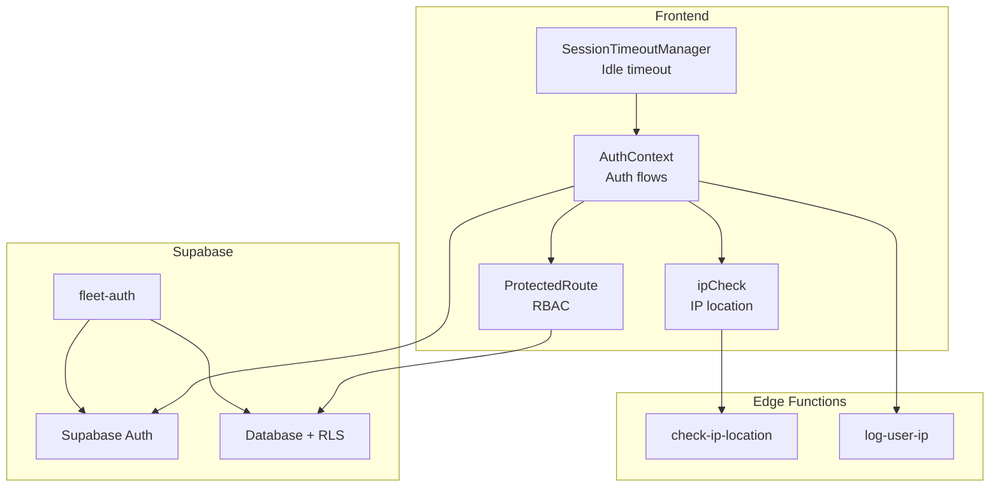
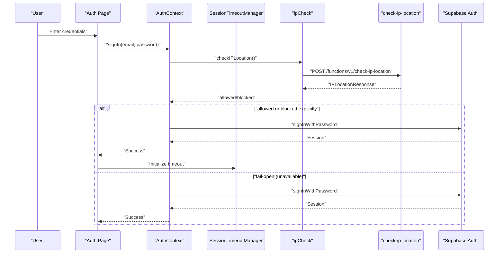
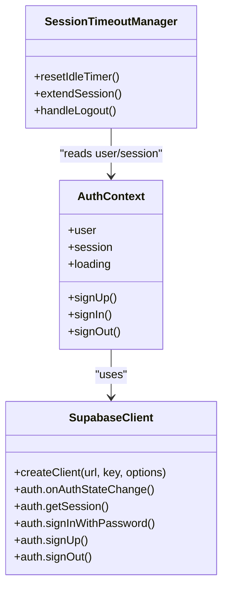
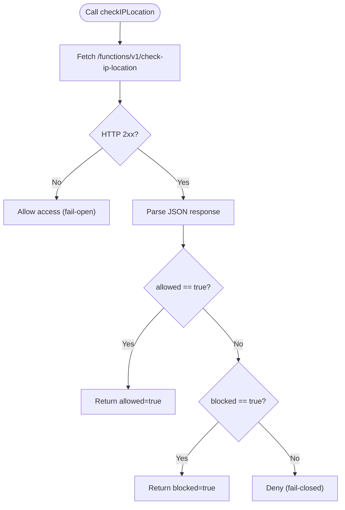
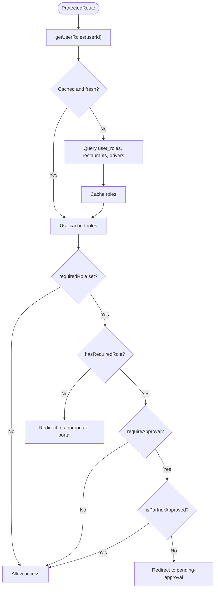
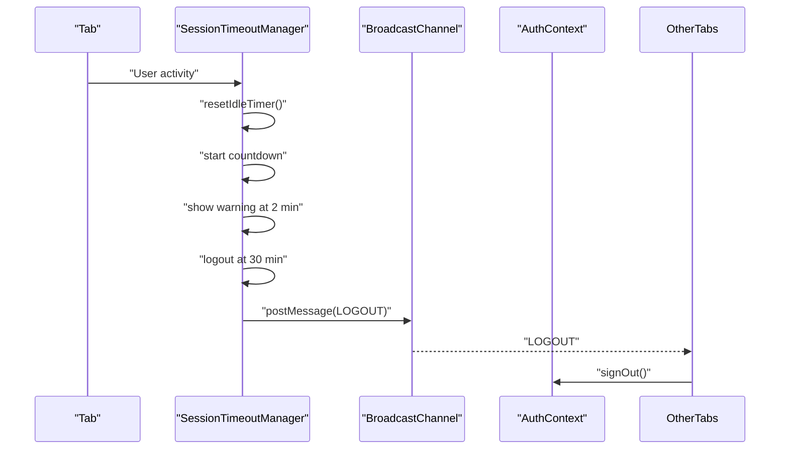
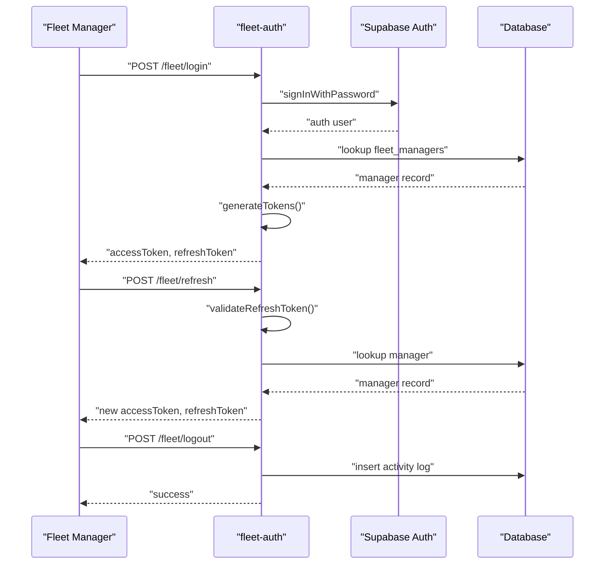
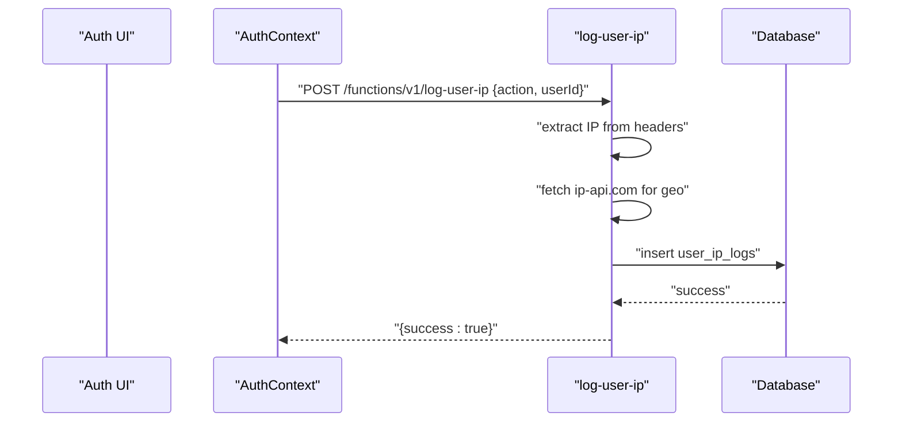
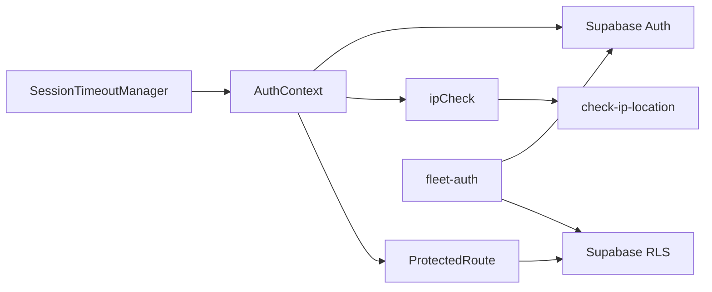

# Authentication Security

<cite>
**Referenced Files in This Document**
- [client.ts](file://src/integrations/supabase/client.ts)
- [AuthContext.tsx](file://src/contexts/AuthContext.tsx)
- [ipCheck.ts](file://src/lib/ipCheck.ts)
- [check-ip-location/index.ts](file://supabase/functions/check-ip-location/index.ts)
- [log-user-ip/index.ts](file://supabase/functions/log-user-ip/index.ts)
- [SessionTimeoutManager.tsx](file://src/components/SessionTimeoutManager.tsx)
- [ProtectedRoute.tsx](file://src/components/ProtectedRoute.tsx)
- [Auth.tsx](file://src/pages/Auth.tsx)
- [fleet-auth/index.ts](file://supabase/functions/fleet-auth/index.ts)
- [config.toml](file://supabase/config.toml)
- [types.ts](file://supabase/types.ts)
- [fleet-management-portal-design.md](file://docs/fleet-management-portal-design.md)
</cite>

## Table of Contents
1. [Introduction](#introduction)
2. [Project Structure](#project-structure)
3. [Core Components](#core-components)
4. [Architecture Overview](#architecture-overview)
5. [Detailed Component Analysis](#detailed-component-analysis)
6. [Dependency Analysis](#dependency-analysis)
7. [Performance Considerations](#performance-considerations)
8. [Troubleshooting Guide](#troubleshooting-guide)
9. [Conclusion](#conclusion)

## Introduction
This document provides comprehensive authentication security documentation for the Nutrio application. It covers Supabase Auth integration, JWT token handling, session management, role-based access control (RBAC), IP location verification, geographic access restrictions, and session timeout mechanisms. It also outlines secure authentication patterns, failure handling, and common vulnerability mitigations.

## Project Structure
The authentication system spans three primary areas:
- Frontend integration with Supabase Auth and local session management
- Edge functions for IP location checks and user IP logging
- Fleet portal authentication with custom JWT tokens and RLS policies

**Diagram sources**
- [AuthContext.tsx:31-61](file://src/contexts/AuthContext.tsx#L31-L61)
- [client.ts:47-57](file://src/integrations/supabase/client.ts#L47-L57)
- [ipCheck.ts:19-80](file://src/lib/ipCheck.ts#L19-L80)
- [check-ip-location/index.ts:1-107](file://supabase/functions/check-ip-location/index.ts#L1-L107)
- [log-user-ip/index.ts:1-65](file://supabase/functions/log-user-ip/index.ts#L1-L65)
- [ProtectedRoute.tsx:34-98](file://src/components/ProtectedRoute.tsx#L34-L98)
- [fleet-auth/index.ts:1-307](file://supabase/functions/fleet-auth/index.ts#L1-L307)

**Section sources**
- [client.ts:1-57](file://src/integrations/supabase/client.ts#L1-L57)
- [AuthContext.tsx:31-61](file://src/contexts/AuthContext.tsx#L31-L61)
- [ipCheck.ts:19-80](file://src/lib/ipCheck.ts#L19-L80)
- [check-ip-location/index.ts:1-107](file://supabase/functions/check-ip-location/index.ts#L1-L107)
- [log-user-ip/index.ts:1-65](file://supabase/functions/log-user-ip/index.ts#L1-L65)
- [ProtectedRoute.tsx:34-98](file://src/components/ProtectedRoute.tsx#L34-L98)
- [fleet-auth/index.ts:1-307](file://supabase/functions/fleet-auth/index.ts#L1-L307)

## Core Components
- Supabase client with custom storage for sessions and auto-refresh
- Auth context managing sign-up/sign-in/sign-out and IP checks
- IP location service with fail-open policy and optional bypass for testing
- Protected route component enforcing RBAC and role caching
- Session timeout manager with idle detection and cross-tab synchronization
- Fleet portal authentication edge function with custom JWT and RLS policies

**Section sources**
- [client.ts:18-57](file://src/integrations/supabase/client.ts#L18-L57)
- [AuthContext.tsx:63-127](file://src/contexts/AuthContext.tsx#L63-L127)
- [ipCheck.ts:19-80](file://src/lib/ipCheck.ts#L19-L80)
- [ProtectedRoute.tsx:34-98](file://src/components/ProtectedRoute.tsx#L34-L98)
- [SessionTimeoutManager.tsx:17-343](file://src/components/SessionTimeoutManager.tsx#L17-L343)
- [fleet-auth/index.ts:33-88](file://supabase/functions/fleet-auth/index.ts#L33-L88)

## Architecture Overview
The system integrates frontend Supabase Auth with edge functions for IP checks and fleet-specific JWT generation. RBAC is enforced via Supabase RLS policies and the ProtectedRoute component.

**Diagram sources**
- [Auth.tsx:169-203](file://src/pages/Auth.tsx#L169-L203)
- [AuthContext.tsx:87-112](file://src/contexts/AuthContext.tsx#L87-L112)
- [ipCheck.ts:47-80](file://src/lib/ipCheck.ts#L47-L80)
- [check-ip-location/index.ts:20-107](file://supabase/functions/check-ip-location/index.ts#L20-L107)

## Detailed Component Analysis

### Supabase Auth Integration and Session Management
- Custom storage adapter for Capacitor (native) and localStorage (web) ensures sessions persist across reloads.
- Auto-refresh and persistent sessions improve UX while maintaining security.
- Auth state listener updates context immediately upon changes.

**Diagram sources**
- [client.ts:47-57](file://src/integrations/supabase/client.ts#L47-L57)
- [AuthContext.tsx:31-61](file://src/contexts/AuthContext.tsx#L31-L61)
- [SessionTimeoutManager.tsx:47-217](file://src/components/SessionTimeoutManager.tsx#L47-L217)

**Section sources**
- [client.ts:18-57](file://src/integrations/supabase/client.ts#L18-L57)
- [AuthContext.tsx:31-61](file://src/contexts/AuthContext.tsx#L31-L61)
- [SessionTimeoutManager.tsx:17-343](file://src/components/SessionTimeoutManager.tsx#L17-L343)

### IP Location Verification and Geographic Access Controls
- Frontend IP check function performs a POST to the edge function and applies a fail-open policy on errors.
- Edge function validates client IP, checks database for blocks, and queries ip-api.com for geolocation.
- A testing bypass allows localhost/private IPs regardless of country setting.

**Diagram sources**
- [ipCheck.ts:47-80](file://src/lib/ipCheck.ts#L47-L80)
- [check-ip-location/index.ts:20-107](file://supabase/functions/check-ip-location/index.ts#L20-L107)

**Section sources**
- [ipCheck.ts:19-80](file://src/lib/ipCheck.ts#L19-L80)
- [check-ip-location/index.ts:31-47](file://supabase/functions/check-ip-location/index.ts#L31-L47)
- [check-ip-location/index.ts:49-94](file://supabase/functions/check-ip-location/index.ts#L49-L94)

### Role-Based Access Control (RBAC)
- ProtectedRoute caches user roles and enforces hierarchical permissions.
- Roles include customer, restaurant/partner, driver, staff, admin.
- Additional checks for partner approval status when required.

**Diagram sources**
- [ProtectedRoute.tsx:34-98](file://src/components/ProtectedRoute.tsx#L34-L98)
- [ProtectedRoute.tsx:103-137](file://src/components/ProtectedRoute.tsx#L103-L137)
- [ProtectedRoute.tsx:139-230](file://src/components/ProtectedRoute.tsx#L139-L230)

**Section sources**
- [ProtectedRoute.tsx:7-24](file://src/components/ProtectedRoute.tsx#L7-L24)
- [ProtectedRoute.tsx:34-98](file://src/components/ProtectedRoute.tsx#L34-L98)
- [ProtectedRoute.tsx:103-137](file://src/components/ProtectedRoute.tsx#L103-L137)
- [ProtectedRoute.tsx:139-230](file://src/components/ProtectedRoute.tsx#L139-L230)

### Session Timeout Mechanisms
- 30-minute idle timeout with a 2-minute warning.
- Cross-tab synchronization via BroadcastChannel (web).
- Global pause/resume hooks for long operations (uploads, API calls).
- Automatic logout and optional manual extension.

**Diagram sources**
- [SessionTimeoutManager.tsx:47-217](file://src/components/SessionTimeoutManager.tsx#L47-L217)
- [SessionTimeoutManager.tsx:227-248](file://src/components/SessionTimeoutManager.tsx#L227-L248)

**Section sources**
- [SessionTimeoutManager.tsx:17-343](file://src/components/SessionTimeoutManager.tsx#L17-L343)

### Fleet Portal Authentication (Custom JWT)
- Edge function handles login, refresh, and logout with custom JWT claims.
- Validates credentials against Supabase Auth and checks fleet manager records.
- Generates access and refresh tokens with short expiry and logs activity.

**Diagram sources**
- [fleet-auth/index.ts:90-174](file://supabase/functions/fleet-auth/index.ts#L90-L174)
- [fleet-auth/index.ts:176-230](file://supabase/functions/fleet-auth/index.ts#L176-L230)
- [fleet-auth/index.ts:232-273](file://supabase/functions/fleet-auth/index.ts#L232-L273)

**Section sources**
- [fleet-auth/index.ts:33-88](file://supabase/functions/fleet-auth/index.ts#L33-L88)
- [fleet-auth/index.ts:90-174](file://supabase/functions/fleet-auth/index.ts#L90-L174)
- [fleet-auth/index.ts:176-230](file://supabase/functions/fleet-auth/index.ts#L176-L230)
- [fleet-auth/index.ts:232-273](file://supabase/functions/fleet-auth/index.ts#L232-L273)

### IP Logging and Activity Tracking
- Frontend logs user IP on signup/login via a dedicated edge function.
- Function extracts IP and user agent, queries geolocation, and inserts into user_ip_logs.

**Diagram sources**
- [AuthContext.tsx:114-118](file://src/contexts/AuthContext.tsx#L114-L118)
- [log-user-ip/index.ts:16-54](file://supabase/functions/log-user-ip/index.ts#L16-L54)

**Section sources**
- [AuthContext.tsx:87-118](file://src/contexts/AuthContext.tsx#L87-L118)
- [log-user-ip/index.ts:16-54](file://supabase/functions/log-user-ip/index.ts#L16-L54)

## Dependency Analysis
- Supabase configuration disables JWT verification for several functions, including IP location and user IP logging. This enables client-side calls but requires careful endpoint design and RLS enforcement.
- RBAC relies on Supabase RLS policies and the ProtectedRoute cache to minimize database queries.

**Diagram sources**
- [config.toml:30-34](file://supabase/config.toml#L30-L34)
- [ProtectedRoute.tsx:34-98](file://src/components/ProtectedRoute.tsx#L34-L98)
- [fleet-auth/index.ts:281-284](file://supabase/functions/fleet-auth/index.ts#L281-L284)

**Section sources**
- [config.toml:30-34](file://supabase/config.toml#L30-L34)
- [ProtectedRoute.tsx:34-98](file://src/components/ProtectedRoute.tsx#L34-L98)
- [fleet-auth/index.ts:281-284](file://supabase/functions/fleet-auth/index.ts#L281-L284)

## Performance Considerations
- Role caching in ProtectedRoute reduces repeated database queries for role checks.
- Edge function IP checks should be monitored for latency; consider CDN caching or scheduled updates for ip-api.com lookups.
- Session timeout intervals and BroadcastChannel usage should be tuned for multi-tab performance.

## Troubleshooting Guide
Common issues and resolutions:
- IP location check failures: The system applies a fail-open policy; verify network connectivity and function availability.
- Session timeouts during uploads: Use the pause/resume hooks exposed by the timeout manager to extend sessions during long operations.
- Fleet authentication errors: Ensure JWT secrets are configured and tokens are validated by the correct secret; check activity logs for audit trails.
- Role-based redirects: Confirm user roles exist in the database and ProtectedRoute cache is not stale.

**Section sources**
- [ipCheck.ts:57-80](file://src/lib/ipCheck.ts#L57-L80)
- [SessionTimeoutManager.tsx:227-248](file://src/components/SessionTimeoutManager.tsx#L227-L248)
- [fleet-auth/index.ts:167-173](file://supabase/functions/fleet-auth/index.ts#L167-L173)
- [ProtectedRoute.tsx:40-98](file://src/components/ProtectedRoute.tsx#L40-L98)

## Conclusion
The Nutrio authentication system combines Supabase Auth with edge functions for IP verification and fleet-specific JWT handling. RBAC is enforced through Supabase RLS and a frontend ProtectedRoute component with role caching. Session timeout management improves security and UX, while IP logging and activity tracking provide operational insights. Adhering to the secure patterns outlined here will help maintain robust authentication and access control across all user roles.