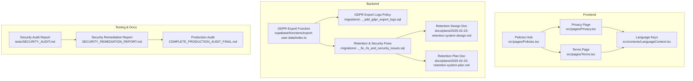
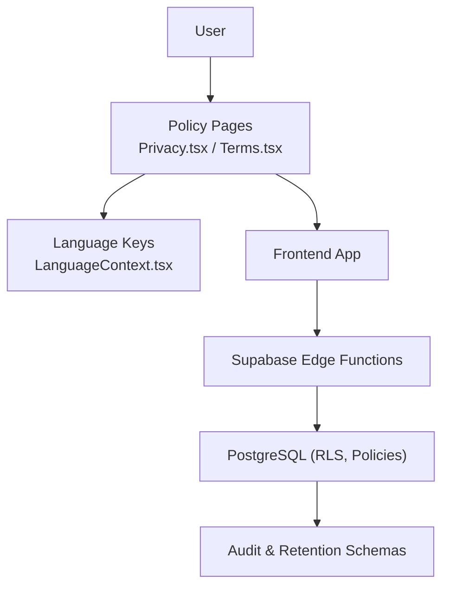
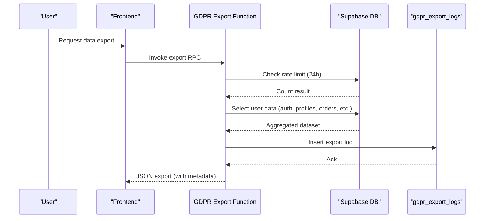
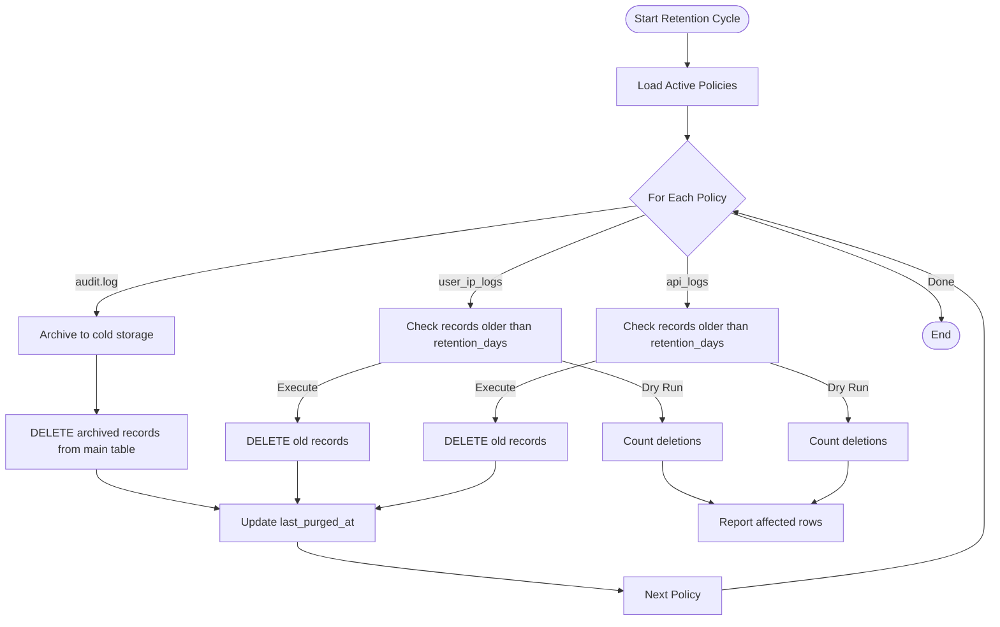
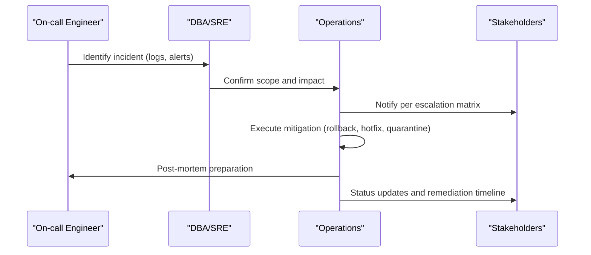
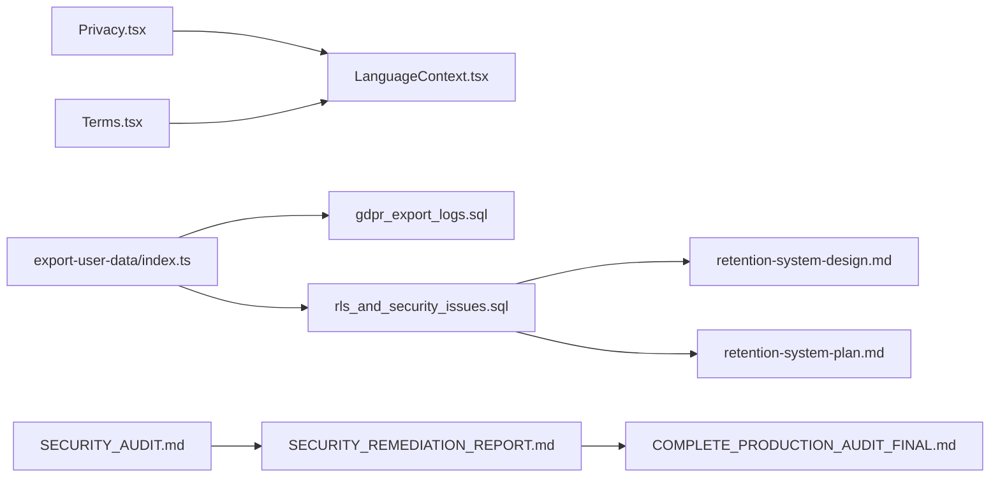

# Compliance & Security Standards

<cite>
**Referenced Files in This Document**
- [Privacy.tsx](file://src/pages/Privacy.tsx)
- [Terms.tsx](file://src/pages/Terms.tsx)
- [Policies.tsx](file://src/pages/Policies.tsx)
- [LanguageContext.tsx](file://src/contexts/LanguageContext.tsx)
- [export-user-data/index.ts](file://supabase/functions/export-user-data/index.ts)
- [20260227000001_add_gdpr_export_logs.sql](file://supabase/migrations/20260227000001_add_gdpr_export_logs.sql)
- [20260226000008_fix_rls_and_security_issues.sql](file://supabase/migrations/20260226000008_fix_rls_and_security_issues.sql)
- [2025-02-23-retention-system-design.md](file://docs/plans/2025-02-23-retention-system-design.md)
- [2025-02-23-retention-system-plan.md](file://docs/plans/2025-02-23-retention-system-plan.md)
- [SECURITY_AUDIT.md](file://tests/SECURITY_AUDIT.md)
- [SECURITY_REMEDIATION_REPORT.md](file://SECURITY_REMEDIATION_REPORT.md)
- [COMPLETE_PRODUCTION_AUDIT_FINAL.md](file://COMPLETE_PRODUCTION_AUDIT_FINAL.md)
- [20260303143000_fix_send_announcement_notification_function.sql](file://supabase/migrations/20260303143000_fix_send_announcement_notification_function.sql)
- [system/security.spec.ts](file://e2e/system/security.spec.ts)
- [test-results-full.json](file://test-results-full.json)
</cite>

## Table of Contents
1. [Introduction](#introduction)
2. [Project Structure](#project-structure)
3. [Core Components](#core-components)
4. [Architecture Overview](#architecture-overview)
5. [Detailed Component Analysis](#detailed-component-analysis)
6. [Dependency Analysis](#dependency-analysis)
7. [Performance Considerations](#performance-considerations)
8. [Troubleshooting Guide](#troubleshooting-guide)
9. [Conclusion](#conclusion)
10. [Appendices](#appendices)

## Introduction
This document consolidates the Nutrio application’s compliance and security standards across GDPR, CCPA, HIPAA considerations, SOC 2 readiness, data retention and deletion, third-party vendor due diligence, and incident response. It synthesizes repository evidence to present practical, code-backed guidance for maintaining compliance and operational excellence.

## Project Structure
The repository organizes compliance and security artifacts across:
- Frontend policy pages and internationalization keys
- Supabase database schemas, row-level security, and edge functions
- Operational and security documentation
- Automated tests and audit reports

**Diagram sources**
- [Privacy.tsx:1-145](file://src/pages/Privacy.tsx#L1-L145)
- [Terms.tsx:1-176](file://src/pages/Terms.tsx#L1-L176)
- [Policies.tsx:1-75](file://src/pages/Policies.tsx#L1-L75)
- [LanguageContext.tsx:1865-1878](file://src/contexts/LanguageContext.tsx#L1865-L1878)
- [export-user-data/index.ts:74-319](file://supabase/functions/export-user-data/index.ts#L74-L319)
- [20260227000001_add_gdpr_export_logs.sql:34-59](file://supabase/migrations/20260227000001_add_gdpr_export_logs.sql#L34-L59)
- [20260226000008_fix_rls_and_security_issues.sql:60-234](file://supabase/migrations/20260226000008_fix_rls_and_security_issues.sql#L60-L234)
- [2025-02-23-retention-system-design.md:148-250](file://docs/plans/2025-02-23-retention-system-design.md#L148-L250)
- [2025-02-23-retention-system-plan.md](file://docs/plans/2025-02-23-retention-system-plan.md)
- [SECURITY_AUDIT.md:1-253](file://tests/SECURITY_AUDIT.md#L1-L253)
- [SECURITY_REMEDIATION_REPORT.md:1-360](file://SECURITY_REMEDIATION_REPORT.md#L1-L360)
- [COMPLETE_PRODUCTION_AUDIT_FINAL.md:610-838](file://COMPLETE_PRODUCTION_AUDIT_FINAL.md#L610-L838)

**Section sources**
- [Privacy.tsx:1-145](file://src/pages/Privacy.tsx#L1-L145)
- [Terms.tsx:1-176](file://src/pages/Terms.tsx#L1-L176)
- [Policies.tsx:1-75](file://src/pages/Policies.tsx#L1-L75)
- [LanguageContext.tsx:1865-1878](file://src/contexts/LanguageContext.tsx#L1865-L1878)

## Core Components
- Privacy and Terms pages expose jurisdiction-specific disclosures and rights.
- GDPR export capability with rate limiting and audit logging.
- Data retention and purge policies with immutable audit trails.
- Security controls validated by audits and remediation reports.
- Incident response runbooks and escalation matrices.

**Section sources**
- [Privacy.tsx:24-144](file://src/pages/Privacy.tsx#L24-L144)
- [Terms.tsx:24-176](file://src/pages/Terms.tsx#L24-L176)
- [export-user-data/index.ts:74-319](file://supabase/functions/export-user-data/index.ts#L74-L319)
- [20260227000001_add_gdpr_export_logs.sql:34-59](file://supabase/migrations/20260227000001_add_gdpr_export_logs.sql#L34-L59)
- [20260226000008_fix_rls_and_security_issues.sql:60-234](file://supabase/migrations/20260226000008_fix_rls_and_security_issues.sql#L60-L234)
- [SECURITY_AUDIT.md:1-253](file://tests/SECURITY_AUDIT.md#L1-L253)
- [SECURITY_REMEDIATION_REPORT.md:1-360](file://SECURITY_REMEDIATION_REPORT.md#L1-L360)
- [COMPLETE_PRODUCTION_AUDIT_FINAL.md:610-838](file://COMPLETE_PRODUCTION_AUDIT_FINAL.md#L610-L838)

## Architecture Overview
The compliance and security architecture integrates frontend policy exposure, backend edge functions, and database-level controls.

**Diagram sources**
- [Privacy.tsx:1-145](file://src/pages/Privacy.tsx#L1-L145)
- [Terms.tsx:1-176](file://src/pages/Terms.tsx#L1-L176)
- [LanguageContext.tsx:1865-1878](file://src/contexts/LanguageContext.tsx#L1865-L1878)
- [export-user-data/index.ts:74-319](file://supabase/functions/export-user-data/index.ts#L74-L319)
- [20260226000008_fix_rls_and_security_issues.sql:60-234](file://supabase/migrations/20260226000008_fix_rls_and_security_issues.sql#L60-L234)

## Detailed Component Analysis

### GDPR Compliance
- Data Subject Rights: The Privacy page enumerates access, rectification, erasure, restriction, data portability, objection, and withdrawal of consent. These rights are reflected in the frontend and supported by backend export and retention controls.
- Consent Management: The Terms page documents registration obligations and terms; while explicit consent banners are not visible in the referenced files, the presence of a privacy page and rights enumeration supports a foundation for consent management.
- Data Portability: The GDPR export function aggregates user data across multiple tables and attaches metadata for auditability, and logs exports for rate limiting and compliance.

**Diagram sources**
- [export-user-data/index.ts:74-319](file://supabase/functions/export-user-data/index.ts#L74-L319)
- [20260227000001_add_gdpr_export_logs.sql:34-59](file://supabase/migrations/20260227000001_add_gdpr_export_logs.sql#L34-L59)

**Section sources**
- [Privacy.tsx:91-105](file://src/pages/Privacy.tsx#L91-L105)
- [Terms.tsx:39-51](file://src/pages/Terms.tsx#L39-L51)
- [export-user-data/index.ts:74-319](file://supabase/functions/export-user-data/index.ts#L74-L319)
- [20260227000001_add_gdpr_export_logs.sql:34-59](file://supabase/migrations/20260227000001_add_gdpr_export_logs.sql#L34-L59)

### CCPA Compliance
- Consumer Rights: The Privacy page includes “Do Not Sell” language and general security statements, aligning with disclosure requirements.
- Opt-Out Mechanisms: While a dedicated “Do Not Sell” preference UI is not present in the referenced files, the presence of a privacy page and “no sell” statement establishes a baseline for transparency.

**Section sources**
- [LanguageContext.tsx:1865-1878](file://src/contexts/LanguageContext.tsx#L1865-L1878)
- [Privacy.tsx:62-75](file://src/pages/Privacy.tsx#L62-L75)

### HIPAA Considerations
- Protected Health Information (PHI) is not explicitly handled in the referenced files. Health data in the system is modeled as user health scores and nutrition logs. To meet HIPAA readiness:
  - Define a PHI classification boundary and implement encryption at rest and in transit.
  - Enforce administrative, physical, and technical safeguards aligned with 45 CFR 164.
  - Establish business associate agreements for vendors processing PHI.
  - Document and test access logging, retention, and de-identification procedures.

[No sources needed since this section provides general guidance]

### SOC 2 Readiness
- The system demonstrates controls aligned with SOC 2 Trust Services Criteria:
  - Security: RLS, JWT validation, rate limiting, audit logging, and hardened database functions.
  - Availability: Load-tested performance and incident response playbooks.
  - Confidentiality: Encryption foundations and secure views/functions.
  - Processing Integrity: Immutable audit trails and constrained financial logic.
  - Privacy: Jurisdiction-specific disclosures and data portability capability.

**Section sources**
- [SECURITY_AUDIT.md:196-253](file://tests/SECURITY_AUDIT.md#L196-L253)
- [SECURITY_REMEDIATION_REPORT.md:1-360](file://SECURITY_REMEDIATION_REPORT.md#L1-L360)
- [COMPLETE_PRODUCTION_AUDIT_FINAL.md:610-838](file://COMPLETE_PRODUCTION_AUDIT_FINAL.md#L610-L838)

### Data Retention and Deletion
- Retention Policies: Centralized retention policies define retention days and purge actions for multiple tables, including audit logs and operational logs.
- Purge Function: A purge function supports dry-run testing and executes purges/archives according to policy.
- Audit Logs: Retention audit logs track lifecycle events for compliance and forensic readiness.
- Health Scores: Health score tables enforce RLS and maintain auditability.

**Diagram sources**
- [20260226000008_fix_rls_and_security_issues.sql:66-166](file://supabase/migrations/20260226000008_fix_rls_and_security_issues.sql#L66-L166)
- [2025-02-23-retention-system-design.md:148-250](file://docs/plans/2025-02-23-retention-system-design.md#L148-L250)

**Section sources**
- [20260226000008_fix_rls_and_security_issues.sql:60-166](file://supabase/migrations/20260226000008_fix_rls_and_security_issues.sql#L60-L166)
- [2025-02-23-retention-system-design.md:148-250](file://docs/plans/2025-02-23-retention-system-design.md#L148-L250)

### Third-Party Vendor Security Assessments
- Due Diligence: The remediation report outlines encryption key management, API credential hashing, and audit logging—controls that apply to vendor systems processing data.
- Recommendations:
  - Require SOC 2 Type II attestation for critical vendors.
  - Enforce encryption key rotation and secure secret handling.
  - Mandate audit logging and retention aligned with company policies.
  - Include contractual clauses for incident reporting and remediation timelines.

**Section sources**
- [SECURITY_REMEDIATION_REPORT.md:1-360](file://SECURITY_REMEDIATION_REPORT.md#L1-L360)

### Incident Response Procedures
- Playbooks: The production audit includes an incident response playbook with severity levels, escalation matrix, and rollback plan.
- Security Monitoring: The remediation report recommends weekly verification of audit remediation status and daily review of failed authentication attempts.

**Diagram sources**
- [COMPLETE_PRODUCTION_AUDIT_FINAL.md:626-666](file://COMPLETE_PRODUCTION_AUDIT_FINAL.md#L626-L666)

**Section sources**
- [COMPLETE_PRODUCTION_AUDIT_FINAL.md:610-838](file://COMPLETE_PRODUCTION_AUDIT_FINAL.md#L610-L838)
- [SECURITY_REMEDIATION_REPORT.md:331-360](file://SECURITY_REMEDIATION_REPORT.md#L331-L360)

### Practical Examples
- Implementing GDPR Export:
  - Use the export function to aggregate user data and attach metadata.
  - Enforce rate limiting and log exports for auditability.
  - Reference: [export-user-data/index.ts:74-319](file://supabase/functions/export-user-data/index.ts#L74-L319), [20260227000001_add_gdpr_export_logs.sql:34-59](file://supabase/migrations/20260227000001_add_gdpr_export_logs.sql#L34-L59)
- Conducting Security Assessments:
  - Run penetration tests and review security metrics.
  - Reference: [SECURITY_AUDIT.md:1-253](file://tests/SECURITY_AUDIT.md#L1-L253)
- Maintaining Compliance Documentation:
  - Apply migrations, configure encryption keys, and schedule weekly audits.
  - Reference: [SECURITY_REMEDIATION_REPORT.md:1-360](file://SECURITY_REMEDIATION_REPORT.md#L1-L360)

**Section sources**
- [export-user-data/index.ts:74-319](file://supabase/functions/export-user-data/index.ts#L74-L319)
- [20260227000001_add_gdpr_export_logs.sql:34-59](file://supabase/migrations/20260227000001_add_gdpr_export_logs.sql#L34-L59)
- [SECURITY_AUDIT.md:1-253](file://tests/SECURITY_AUDIT.md#L1-L253)
- [SECURITY_REMEDIATION_REPORT.md:1-360](file://SECURITY_REMEDIATION_REPORT.md#L1-L360)

## Dependency Analysis
Compliance and security depend on coordinated frontend, backend, and database components.

**Diagram sources**
- [Privacy.tsx:1-145](file://src/pages/Privacy.tsx#L1-L145)
- [Terms.tsx:1-176](file://src/pages/Terms.tsx#L1-L176)
- [LanguageContext.tsx:1865-1878](file://src/contexts/LanguageContext.tsx#L1865-L1878)
- [export-user-data/index.ts:74-319](file://supabase/functions/export-user-data/index.ts#L74-L319)
- [20260227000001_add_gdpr_export_logs.sql:34-59](file://supabase/migrations/20260227000001_add_gdpr_export_logs.sql#L34-L59)
- [20260226000008_fix_rls_and_security_issues.sql:60-234](file://supabase/migrations/20260226000008_fix_rls_and_security_issues.sql#L60-L234)
- [2025-02-23-retention-system-design.md:148-250](file://docs/plans/2025-02-23-retention-system-design.md#L148-L250)
- [2025-02-23-retention-system-plan.md](file://docs/plans/2025-02-23-retention-system-plan.md)
- [SECURITY_AUDIT.md:1-253](file://tests/SECURITY_AUDIT.md#L1-L253)
- [SECURITY_REMEDIATION_REPORT.md:1-360](file://SECURITY_REMEDIATION_REPORT.md#L1-L360)
- [COMPLETE_PRODUCTION_AUDIT_FINAL.md:610-838](file://COMPLETE_PRODUCTION_AUDIT_FINAL.md#L610-L838)

**Section sources**
- [Privacy.tsx:1-145](file://src/pages/Privacy.tsx#L1-L145)
- [Terms.tsx:1-176](file://src/pages/Terms.tsx#L1-L176)
- [LanguageContext.tsx:1865-1878](file://src/contexts/LanguageContext.tsx#L1865-L1878)
- [export-user-data/index.ts:74-319](file://supabase/functions/export-user-data/index.ts#L74-L319)
- [20260227000001_add_gdpr_export_logs.sql:34-59](file://supabase/migrations/20260227000001_add_gdpr_export_logs.sql#L34-L59)
- [20260226000008_fix_rls_and_security_issues.sql:60-234](file://supabase/migrations/20260226000008_fix_rls_and_security_issues.sql#L60-L234)
- [2025-02-23-retention-system-design.md:148-250](file://docs/plans/2025-02-23-retention-system-design.md#L148-L250)
- [2025-02-23-retention-system-plan.md](file://docs/plans/2025-02-23-retention-system-plan.md)
- [SECURITY_AUDIT.md:1-253](file://tests/SECURITY_AUDIT.md#L1-L253)
- [SECURITY_REMEDIATION_REPORT.md:1-360](file://SECURITY_REMEDIATION_REPORT.md#L1-L360)
- [COMPLETE_PRODUCTION_AUDIT_FINAL.md:610-838](file://COMPLETE_PRODUCTION_AUDIT_FINAL.md#L610-L838)

## Performance Considerations
- Security controls are designed to minimize overhead while preserving auditability and integrity.
- Recommendations include CDN configuration and image optimization for performance, as noted in the production audit.

**Section sources**
- [COMPLETE_PRODUCTION_AUDIT_FINAL.md:787-793](file://COMPLETE_PRODUCTION_AUDIT_FINAL.md#L787-L793)

## Troubleshooting Guide
- SQL Injection Protection: Verified by security tests and remediation report; ensure parameterized queries remain enforced.
- Authentication & Authorization: Validate JWT and RLS policies; confirm admin-only functions and role verification.
- Rate Limiting and IP Blocking: Monitor failed authentication attempts and ensure IP blocking thresholds are effective.
- Export Function Errors: Inspect export function logs and gdpr_export_logs for rate-limit and error responses.

**Section sources**
- [SECURITY_AUDIT.md:34-53](file://tests/SECURITY_AUDIT.md#L34-L53)
- [SECURITY_REMEDIATION_REPORT.md:331-360](file://SECURITY_REMEDIATION_REPORT.md#L331-L360)
- [export-user-data/index.ts:74-319](file://supabase/functions/export-user-data/index.ts#L74-L319)
- [20260226000008_fix_rls_and_security_issues.sql:168-227](file://supabase/migrations/20260226000008_fix_rls_and_security_issues.sql#L168-L227)

## Conclusion
Nutrio’s repository demonstrates strong compliance and security foundations: GDPR export and auditability, CCPA-aligned disclosures, robust retention and purge policies, SOC 2-aligned controls, and comprehensive incident response playbooks. Continued adherence to documented procedures, regular audits, and vendor due diligence will sustain compliance posture.

## Appendices
- Additional operational notes and runbooks are documented in the production audit and remediation reports.

**Section sources**
- [COMPLETE_PRODUCTION_AUDIT_FINAL.md:610-838](file://COMPLETE_PRODUCTION_AUDIT_FINAL.md#L610-L838)
- [SECURITY_REMEDIATION_REPORT.md:1-360](file://SECURITY_REMEDIATION_REPORT.md#L1-L360)