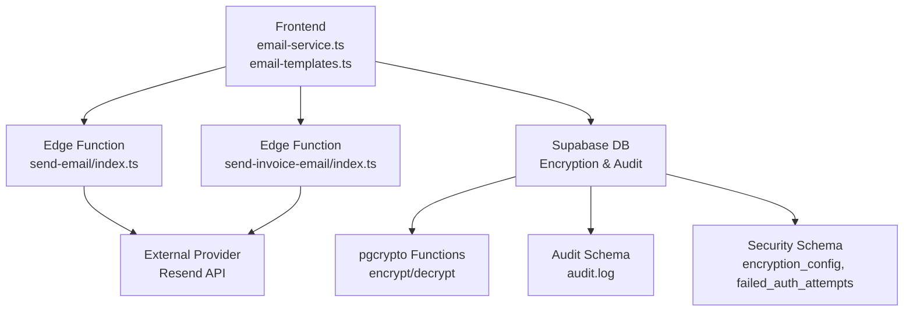
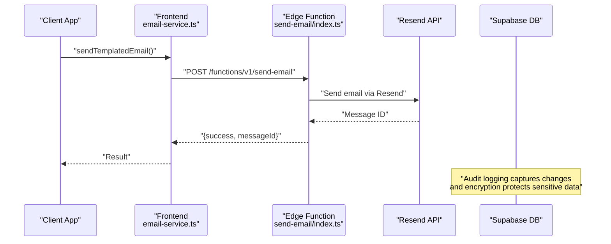
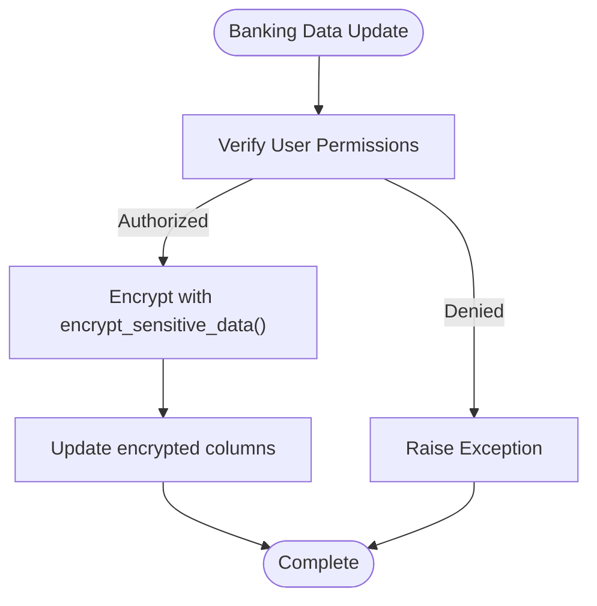
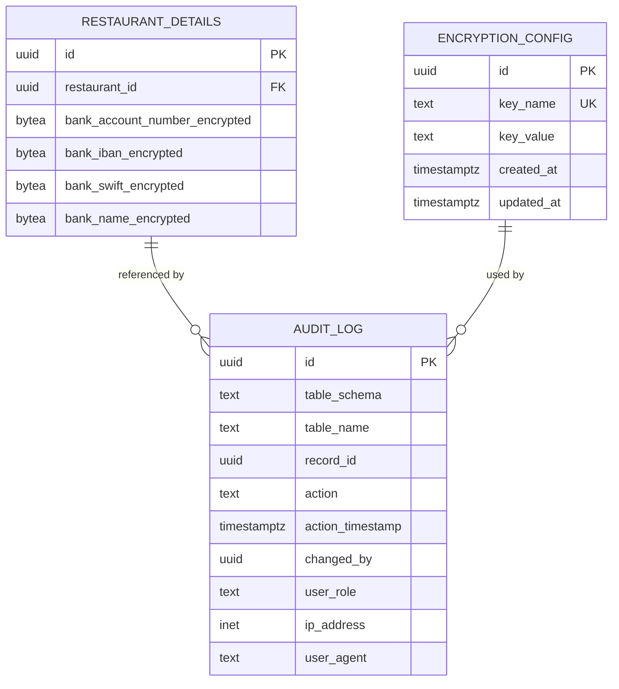
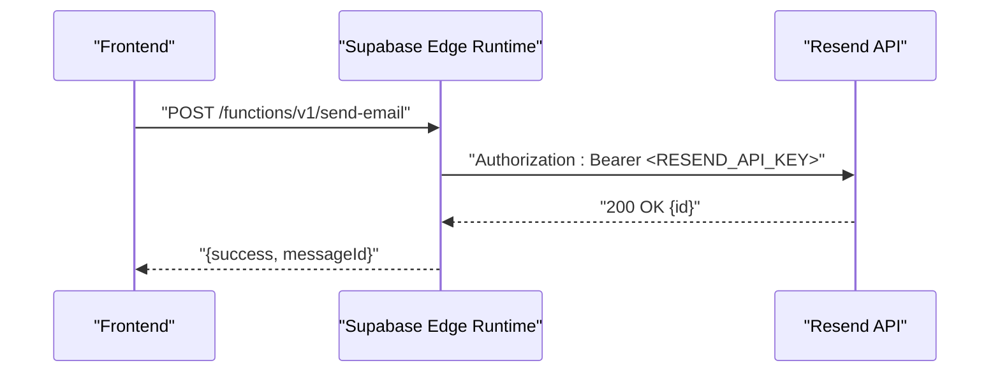
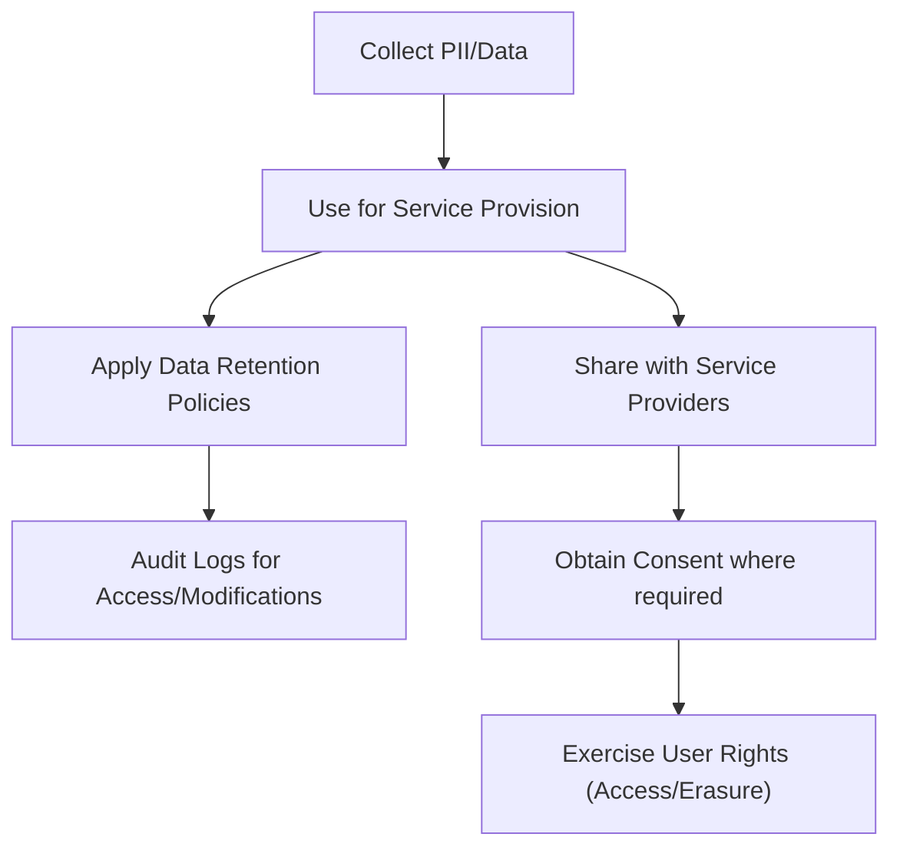
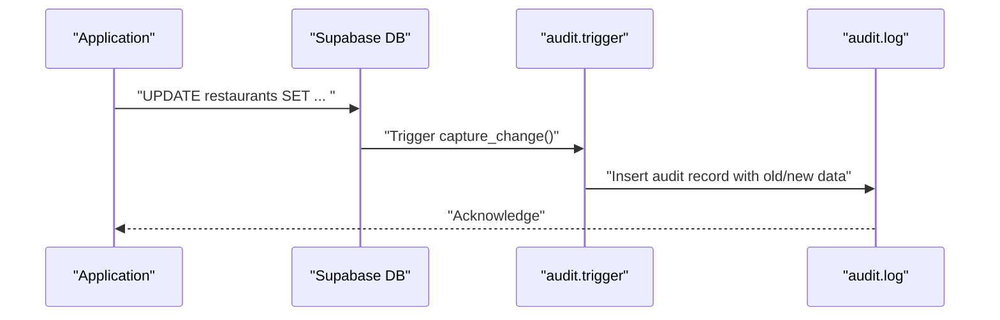
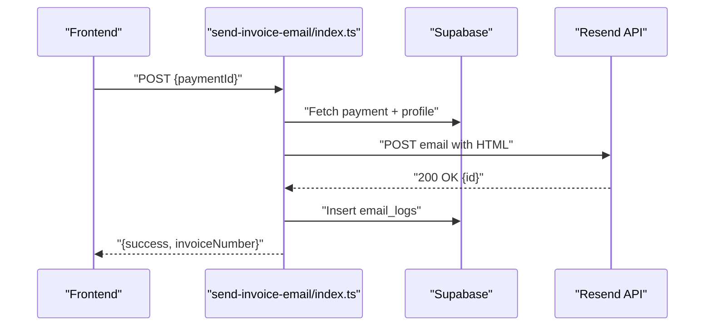
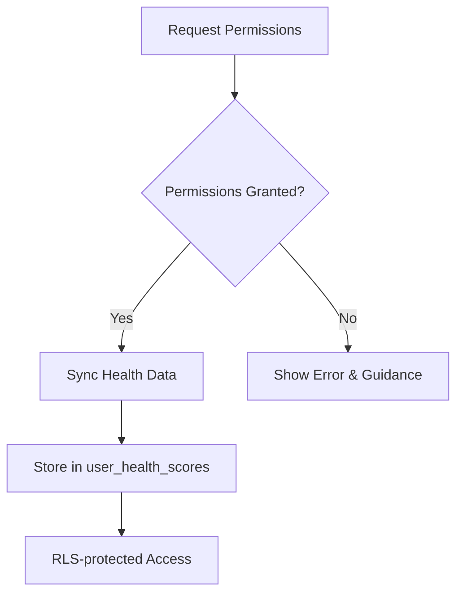
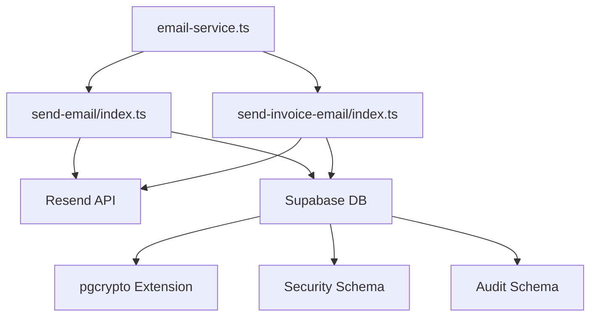

# Data Protection & Privacy

<cite>
**Referenced Files in This Document**
- [email-service.ts](file://src/lib/email-service.ts)
- [email-templates.ts](file://src/lib/email-templates.ts)
- [index.ts](file://supabase/functions/send-email/index.ts)
- [index.ts](file://supabase/functions/send-invoice-email/index.ts)
- [index.ts](file://supabase/functions/export-user-data/index.ts)
- [20260226000001_encrypt_banking_data.sql](file://supabase/migrations/20260226000001_encrypt_banking_data.sql)
- [20260226000003_audit_logging_system.sql](file://supabase/migrations/20260226000003_audit_logging_system.sql)
- [20260226000008_fix_rls_and_security_issues.sql](file://supabase/migrations/20260226000008_fix_rls_and_security_issues.sql)
- [2025-02-23-retention-system-design.md](file://docs/plans/2025-02-23-retention-system-design.md)
- [Privacy.tsx](file://src/pages/Privacy.tsx)
- [Terms.tsx](file://src/pages/Terms.tsx)
- [useHealthIntegration.ts](file://src/hooks/useHealthIntegration.ts)
- [useHealthScore.ts](file://src/hooks/useHealthScore.ts)
- [security.spec.ts](file://e2e/system/security.spec.ts)
- [test-results-full.json](file://test-results-full.json)
</cite>

## Table of Contents
1. [Introduction](#introduction)
2. [Project Structure](#project-structure)
3. [Core Components](#core-components)
4. [Architecture Overview](#architecture-overview)
5. [Detailed Component Analysis](#detailed-component-analysis)
6. [Dependency Analysis](#dependency-analysis)
7. [Performance Considerations](#performance-considerations)
8. [Troubleshooting Guide](#troubleshooting-guide)
9. [Conclusion](#conclusion)
10. [Appendices](#appendices)

## Introduction
This document provides comprehensive data protection and privacy documentation for the Nutrio application. It covers encryption strategies for sensitive data (banking, personal health, and communications), secure storage mechanisms, data transmission security, privacy measures aligned with GDPR/CCPA, audit logging for data access and modifications, email service security, and practical examples for implementing best practices and handling breach scenarios.

## Project Structure
The data protection implementation spans frontend libraries, backend edge functions, and database-level security controls:
- Frontend email orchestration and templates
- Backend edge functions for secure email delivery and user data export
- Database-level encryption, row-level security, and audit logging
- Health data integration and privacy policy pages

**Diagram sources**
- [email-service.ts:1-173](file://src/lib/email-service.ts#L1-L173)
- [email-templates.ts:1-208](file://src/lib/email-templates.ts#L1-L208)
- [index.ts:1-120](file://supabase/functions/send-email/index.ts#L1-L120)
- [index.ts:1-540](file://supabase/functions/send-invoice-email/index.ts#L1-L540)
- [20260226000001_encrypt_banking_data.sql:1-194](file://supabase/migrations/20260226000001_encrypt_banking_data.sql#L1-L194)
- [20260226000003_audit_logging_system.sql:1-373](file://supabase/migrations/20260226000003_audit_logging_system.sql#L1-L373)
- [20260226000008_fix_rls_and_security_issues.sql:190-251](file://supabase/migrations/20260226000008_fix_rls_and_security_issues.sql#L190-L251)

**Section sources**
- [email-service.ts:1-173](file://src/lib/email-service.ts#L1-L173)
- [email-templates.ts:1-208](file://src/lib/email-templates.ts#L1-L208)
- [index.ts:1-120](file://supabase/functions/send-email/index.ts#L1-L120)
- [index.ts:1-540](file://supabase/functions/send-invoice-email/index.ts#L1-L540)
- [20260226000001_encrypt_banking_data.sql:1-194](file://supabase/migrations/20260226000001_encrypt_banking_data.sql#L1-L194)
- [20260226000003_audit_logging_system.sql:1-373](file://supabase/migrations/20260226000003_audit_logging_system.sql#L1-L373)
- [20260226000008_fix_rls_and_security_issues.sql:190-251](file://supabase/migrations/20260226000008_fix_rls_and_security_issues.sql#L190-L251)

## Core Components
- Encryption for banking data at rest using database-level symmetric encryption with pgcrypto and dedicated security functions.
- Audit logging for all data modifications with user context, IP, and request metadata.
- Row-level security and restricted access to encryption keys and audit logs.
- Secure email delivery via Supabase Edge Functions with external provider integration.
- Health data integration with explicit permission requests and controlled access.
- Privacy and Terms pages reflecting data practices and user rights.

**Section sources**
- [20260226000001_encrypt_banking_data.sql:1-194](file://supabase/migrations/20260226000001_encrypt_banking_data.sql#L1-L194)
- [20260226000003_audit_logging_system.sql:1-373](file://supabase/migrations/20260226000003_audit_logging_system.sql#L1-L373)
- [email-service.ts:1-173](file://src/lib/email-service.ts#L1-L173)
- [useHealthIntegration.ts:89-135](file://src/hooks/useHealthIntegration.ts#L89-L135)
- [Privacy.tsx:1-145](file://src/pages/Privacy.tsx#L1-L145)

## Architecture Overview
End-to-end data protection architecture integrates frontend orchestration, backend edge functions, and database security controls.

**Diagram sources**
- [email-service.ts:23-84](file://src/lib/email-service.ts#L23-L84)
- [index.ts:19-119](file://supabase/functions/send-email/index.ts#L19-L119)
- [20260226000003_audit_logging_system.sql:75-161](file://supabase/migrations/20260226000003_audit_logging_system.sql#L75-L161)
- [20260226000001_encrypt_banking_data.sql:29-65](file://supabase/migrations/20260226000001_encrypt_banking_data.sql#L29-L65)

## Detailed Component Analysis

### Encryption Strategies for Sensitive Data
- Banking information encryption at rest using database-level symmetric encryption with pgcrypto.
- Dedicated encryption and decryption functions with strict role-based access.
- Encrypted columns in restaurant_details with migration of existing data.
- Secure view exposes decrypted data only to authorized users (owners/admins).
- Encryption key configuration table with restricted access and RLS policy.

**Diagram sources**
- [20260226000001_encrypt_banking_data.sql:146-173](file://supabase/migrations/20260226000001_encrypt_banking_data.sql#L146-L173)
- [20260226000001_encrypt_banking_data.sql:29-65](file://supabase/migrations/20260226000001_encrypt_banking_data.sql#L29-L65)

**Section sources**
- [20260226000001_encrypt_banking_data.sql:1-194](file://supabase/migrations/20260226000001_encrypt_banking_data.sql#L1-L194)

### Secure Storage Mechanisms
- Column-level encryption for banking data with encrypted backups in restaurant_details.
- Audit log table capturing all changes with user context, IP, and request metadata.
- Row-level security policies restricting access to encryption configuration and audit logs.
- Data retention policies and helper functions for GDPR/privacy compliance.

**Diagram sources**
- [20260226000001_encrypt_banking_data.sql:67-143](file://supabase/migrations/20260226000001_encrypt_banking_data.sql#L67-L143)
- [20260226000003_audit_logging_system.sql:10-52](file://supabase/migrations/20260226000003_audit_logging_system.sql#L10-L52)
- [20260226000003_audit_logging_system.sql:311-323](file://supabase/migrations/20260226000003_audit_logging_system.sql#L311-L323)

**Section sources**
- [20260226000003_audit_logging_system.sql:1-373](file://supabase/migrations/20260226000003_audit_logging_system.sql#L1-L373)
- [20260226000008_fix_rls_and_security_issues.sql:232-251](file://supabase/migrations/20260226000008_fix_rls_and_security_issues.sql#L232-L251)

### Data Transmission Security
- Frontend communicates with Supabase Edge Functions over HTTPS.
- Edge functions enforce CORS and validate request payloads.
- External email delivery via Resend API using bearer tokens.
- Authentication and authorization enforced via Supabase JWT and RLS.

**Diagram sources**
- [email-service.ts:54-84](file://src/lib/email-service.ts#L54-L84)
- [index.ts:67-107](file://supabase/functions/send-email/index.ts#L67-L107)

**Section sources**
- [email-service.ts:1-173](file://src/lib/email-service.ts#L1-L173)
- [index.ts:1-120](file://supabase/functions/send-email/index.ts#L1-L120)

### Privacy Measures and Compliance
- Privacy and Terms pages define information collection, use, sharing, and user rights.
- Data retention policies and audit logs support GDPR/CCPA compliance.
- Health data integration requires explicit permissions and controlled access.

**Diagram sources**
- [Privacy.tsx:1-145](file://src/pages/Privacy.tsx#L1-L145)
- [Terms.tsx:1-176](file://src/pages/Terms.tsx#L1-L176)
- [20260226000003_audit_logging_system.sql:293-307](file://supabase/migrations/20260226000003_audit_logging_system.sql#L293-L307)
- [2025-02-23-retention-system-design.md:148-199](file://docs/plans/2025-02-23-retention-system-design.md#L148-L199)

**Section sources**
- [Privacy.tsx:1-145](file://src/pages/Privacy.tsx#L1-L145)
- [Terms.tsx:1-176](file://src/pages/Terms.tsx#L1-L176)
- [2025-02-23-retention-system-design.md:148-199](file://docs/plans/2025-02-23-retention-system-design.md#L148-L199)

### Audit Logging System
- Comprehensive audit trail for inserts, updates, deletes, and truncates.
- Captures user identity, role, IP, user agent, and application context.
- Append-only policy with admin-only visibility.
- Helper functions to query record history, user activity, and recent changes.

**Diagram sources**
- [20260226000003_audit_logging_system.sql:75-161](file://supabase/migrations/20260226000003_audit_logging_system.sql#L75-L161)
- [20260226000003_audit_logging_system.sql:209-239](file://supabase/migrations/20260226000003_audit_logging_system.sql#L209-L239)

**Section sources**
- [20260226000003_audit_logging_system.sql:1-373](file://supabase/migrations/20260226000003_audit_logging_system.sql#L1-L373)

### Email Service Security
- Templated emails generated from frontend templates and sent via edge function.
- Edge function validates inputs, checks environment configuration, and forwards to Resend.
- Invoice emails include secure generation and logging of sent events.

**Diagram sources**
- [email-templates.ts:190-208](file://src/lib/email-templates.ts#L190-L208)
- [email-service.ts:157-172](file://src/lib/email-service.ts#L157-L172)
- [index.ts:327-473](file://supabase/functions/send-invoice-email/index.ts#L327-L473)

**Section sources**
- [email-service.ts:1-173](file://src/lib/email-service.ts#L1-L173)
- [email-templates.ts:1-208](file://src/lib/email-templates.ts#L1-L208)
- [index.ts:1-540](file://supabase/functions/send-invoice-email/index.ts#L1-L540)

### Health Data Handling
- Health integration requires explicit permission grants per platform.
- Controlled access to health data with user consent and opt-in flows.
- Health score calculations and history retrieval with RLS policies.

**Diagram sources**
- [useHealthIntegration.ts:100-123](file://src/hooks/useHealthIntegration.ts#L100-L123)
- [useHealthScore.ts:65-86](file://src/hooks/useHealthScore.ts#L65-L86)

**Section sources**
- [useHealthIntegration.ts:89-135](file://src/hooks/useHealthIntegration.ts#L89-L135)
- [useHealthScore.ts:45-186](file://src/hooks/useHealthScore.ts#L45-L186)
- [2025-02-23-retention-system-design.md:148-199](file://docs/plans/2025-02-23-retention-system-design.md#L148-L199)

### Data Export for Privacy Compliance
- Edge function to export user data for GDPR right to data portability.
- Generates downloadable JSON with user data for the requested period.

**Section sources**
- [index.ts:301-319](file://supabase/functions/export-user-data/index.ts#L301-L319)

## Dependency Analysis
- Frontend depends on Supabase Edge Functions for email delivery.
- Edge functions depend on external Resend API and Supabase service role keys.
- Database depends on pgcrypto extension and security/audit schemas.
- Health integration depends on platform-specific SDKs and user permissions.

**Diagram sources**
- [email-service.ts:1-173](file://src/lib/email-service.ts#L1-L173)
- [index.ts:1-120](file://supabase/functions/send-email/index.ts#L1-L120)
- [index.ts:1-540](file://supabase/functions/send-invoice-email/index.ts#L1-L540)
- [20260226000001_encrypt_banking_data.sql:6-7](file://supabase/migrations/20260226000001_encrypt_banking_data.sql#L6-L7)

**Section sources**
- [email-service.ts:1-173](file://src/lib/email-service.ts#L1-L173)
- [index.ts:1-120](file://supabase/functions/send-email/index.ts#L1-L120)
- [index.ts:1-540](file://supabase/functions/send-invoice-email/index.ts#L1-L540)
- [20260226000001_encrypt_banking_data.sql:6-7](file://supabase/migrations/20260226000001_encrypt_banking_data.sql#L6-L7)

## Performance Considerations
- Audit logging includes indexing for efficient querying; consider partitioning strategies for very large datasets.
- Encryption adds CPU overhead; batch operations and caching can mitigate impact.
- Email throughput depends on external provider rate limits; implement retry/backoff and queueing where appropriate.

[No sources needed since this section provides general guidance]

## Troubleshooting Guide
Common issues and remediation steps:
- Email sending failures: Verify environment variables and API keys in edge functions; check external provider responses.
- Audit log visibility: Confirm admin role and RLS policies; ensure request context is set for IP/user agent capture.
- Encryption key errors: Validate encryption configuration table entries and role grants; avoid storing keys in plaintext.
- XSS and session timeout test failures: Address frontend security vulnerabilities and session management concerns identified in end-to-end tests.

**Section sources**
- [index.ts:26-36](file://supabase/functions/send-email/index.ts#L26-L36)
- [20260226000003_audit_logging_system.sql:311-323](file://supabase/migrations/20260226000003_audit_logging_system.sql#L311-L323)
- [20260226000001_encrypt_banking_data.sql:175-179](file://supabase/migrations/20260226000001_encrypt_banking_data.sql#L175-L179)
- [test-results-full.json:355-934](file://test-results-full.json#L355-L934)
- [security.spec.ts:1-200](file://e2e/system/security.spec.ts#L1-L200)

## Conclusion
Nutrio implements robust data protection through database-level encryption, comprehensive audit logging, strict RLS policies, secure email delivery, and privacy-focused pages. Aligning with GDPR/CCPA, the system supports data minimization, transparency, and user rights while maintaining strong security controls across transport, storage, and processing.

[No sources needed since this section summarizes without analyzing specific files]

## Appendices

### Practical Examples: Implementing Data Protection Best Practices
- Enforce HTTPS and secure API communication by validating TLS certificates and using bearer tokens.
- Apply column-level encryption for sensitive fields and restrict access to encryption functions.
- Implement audit logging for all data modifications with user context and request metadata.
- Use RLS policies to limit access to sensitive tables and views.
- Secure email templates and delivery by validating inputs and using environment variables for secrets.

[No sources needed since this section provides general guidance]

### Handling Data Breach Scenarios
- Immediately revoke compromised keys and rotate secrets.
- Review audit logs for unauthorized access and modification patterns.
- Notify affected users and regulators per applicable regulations.
- Conduct incident response and remediation, including code and policy improvements.

[No sources needed since this section provides general guidance]